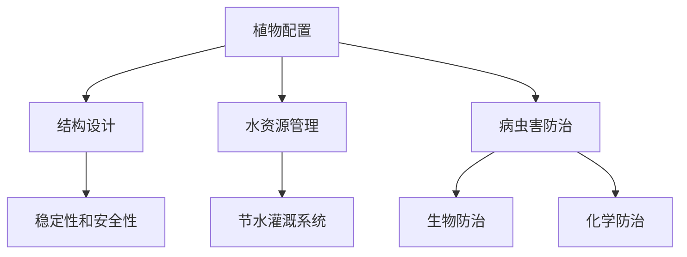
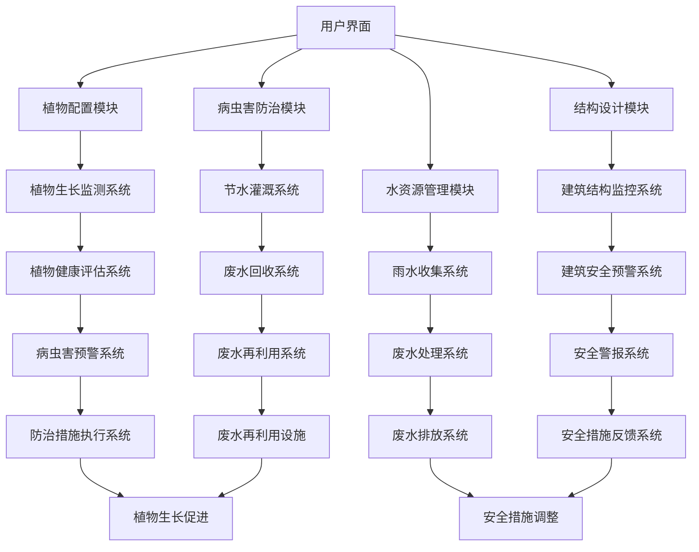
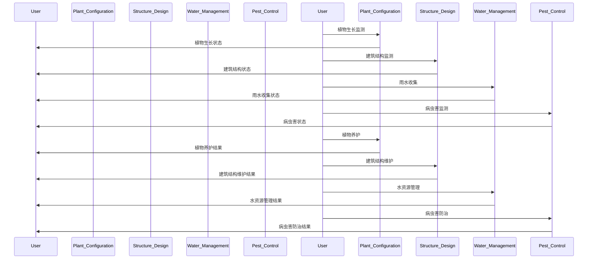
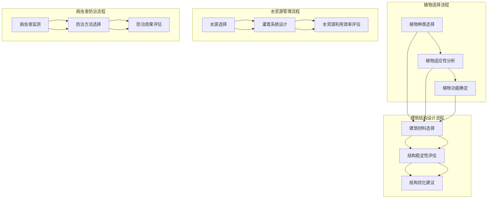

                 

### 1. 新型城市垂直绿化背景介绍

随着城市化进程的加速，城市空间的开发越来越紧张，土地资源日益稀缺。传统的城市绿化方式，主要依赖于地面植被，但这种绿化方式在土地利用率、生态效益以及景观效果上存在一定的局限性。此外，随着城市热岛效应的加剧，城市内部的生态环境问题日益凸显，提升城市绿化水平、改善城市生态环境成为当务之急。

#### 1.1 问题背景

在城市绿化方面，传统的地面植被绿化方式存在以下问题：

1. **土地利用率低**：地面植被绿化依赖于大面积的土地，但在城市化进程中，土地资源变得愈发稀缺，限制了城市绿化的进一步发展。
2. **生态效益有限**：虽然地面植被具有一定的生态效益，但其效果受到土地面积的限制，难以在短期内显著改善城市生态环境。
3. **景观效果单一**：地面植被绿化在景观效果上较为单调，难以满足人们对城市美观的追求。

#### 1.2 问题描述

新型城市垂直绿化作为一种创新的绿化形式，通过在建筑外墙、屋顶以及其他结构体上进行植被种植，实现了绿化空间向三维空间的拓展。这种绿化方式不仅可以提高城市的绿化覆盖率，还可以有效缓解城市热岛效应，改善城市微气候。然而，新型城市垂直绿化在实施过程中面临诸多挑战，如植物选择、结构稳定性、水资源管理、病虫害防治等。

#### 1.3 问题解决

针对新型城市垂直绿化的挑战，本书将从以下几个方面进行探讨：

1. **植物选择**：详细介绍不同植物种类及其特点，分析植物适应性，确保植被种植的可行性和生态效益。
2. **结构稳定性**：研究建筑结构对垂直绿化的影响，提出合理的建筑设计考量，保障垂直绿化系统的稳定性。
3. **水资源管理**：探讨水资源管理系统设计和技术，确保垂直绿化所需的水资源供应。
4. **病虫害防治**：研究病虫害防治的方法与策略，保障垂直绿化系统的健康生长。

#### 1.4 边界与外延

本书主要探讨新型城市垂直绿化的建筑与自然和谐共生的理念及其实践，不涉及其他类型的绿化方式。同时，本书关注的是城市垂直绿化的整体性设计，而非单一的建筑或植物设计。

#### 1.5 概念结构与核心要素组成

**1.5.1 新型城市垂直绿化**

新型城市垂直绿化是指在建筑物外墙、屋顶、阳台等结构上，通过科学的规划与设计，种植植物，形成具有生态效益、景观效果和实用功能的绿色空间。

**1.5.2 建筑与自然和谐共生**

建筑与自然和谐共生是指通过合理的设计和建造，使建筑物与自然环境相互融合，达到生态平衡和可持续发展。

**1.6 本章小结**

本章介绍了新型城市垂直绿化的背景、问题描述、问题解决方法以及概念结构与核心要素组成。接下来，我们将进一步探讨新型城市垂直绿化的核心概念与联系。

### 关键词：新型城市垂直绿化、建筑与自然和谐共生、植物选择、结构稳定性、水资源管理

### 摘要：

本文主要探讨了新型城市垂直绿化的背景、核心概念及其在实际项目中的应用。通过分析植物选择、建筑结构稳定性、水资源管理和病虫害防治等方面的挑战，提出了一系列解决方案。本文旨在为城市绿化提供新的思路，推动建筑与自然的和谐共生，改善城市生态环境。

----------------------------------------------------------------

### 第二部分：新型城市垂直绿化的核心概念与联系

在探讨新型城市垂直绿化的具体实现之前，有必要深入理解其核心概念与联系。本部分将从植物选择、建筑与自然的关系、垂直绿化系统的组成以及新型城市垂直绿化的优点与挑战等方面进行详细阐述。

#### 第2章：新型城市垂直绿化的核心概念

**2.1 植物选择**

植物选择是新型城市垂直绿化成功的关键因素之一。正确的植物选择不仅能够提高垂直绿化的生态效益，还能保证系统的稳定性和美观性。

**2.1.1 植物种类与适应性**

**2.1.1.1 常见植物种类及其特点**

在新型城市垂直绿化中，常见的植物种类包括草本植物、灌木和乔木。每种植物都有其独特的特点：

- **草本植物**：如草坪、野花等，生长周期短，易于维护，适合大面积绿化。
- **灌木**：如玫瑰、茉莉等，具有较强的生长力和观赏性，适合作为垂直绿化的中层植物。
- **乔木**：如银杏、梧桐等，树冠高大，能有效遮荫，适合作为垂直绿化的顶层植物。

**2.1.1.2 植物适应性分析**

植物适应性的分析包括对植物生长环境、气候条件以及土壤条件的适应能力。新型城市垂直绿化要求植物具有以下适应性：

- **耐旱性**：城市垂直绿化系统往往需要考虑水资源的管理，耐旱性强的植物能够降低水资源的消耗。
- **耐阴性**：由于建筑物的遮挡，垂直绿化区域的光照条件相对较差，植物需要能够适应较低的日照强度。
- **抗风性**：城市环境中的风力较大，植物需要具备一定的抗风能力，以避免被风吹倒。

**2.1.2 植物功能**

新型城市垂直绿化的植物功能可以分为生态功能、美学功能和实用功能。

**2.1.2.1 生态功能**

- **改善空气质量**：植物通过光合作用吸收二氧化碳，释放氧气，有助于改善空气质量。
- **减少城市热岛效应**：植物的蒸腾作用可以降低周围环境的温度，缓解城市热岛效应。
- **土壤保持**：植物根系可以固土防蚀，减少城市地表的侵蚀。

**2.1.2.2 美学功能**

- **景观美化**：植物的色彩和形态为城市景观增添了美感和活力。
- **遮挡视线**：植物可以遮挡部分不美观的建筑结构，提升城市美观度。

**2.1.2.3 实用功能**

- **隔音降噪**：植物可以吸收和反射噪声，降低城市环境中的噪音污染。
- **提供休息空间**：垂直绿化区域可以作为城市居民的休闲场所，提供舒适的生活环境。

**2.2 建筑与自然的关系**

建筑与自然的关系是新型城市垂直绿化设计的关键。通过合理的设计和建造，可以使建筑物与自然环境相互融合，达到生态平衡和可持续发展。

**2.2.1 建筑结构对垂直绿化的影响**

建筑结构的选择和设计对垂直绿化有直接影响。以下是建筑结构对垂直绿化的几个关键考量：

- **建筑材料**：选择合适的建筑材料，如轻质混凝土、生态友好材料等，以减轻建筑物的重量，提高垂直绿化的适应性。
- **结构稳定性**：建筑物的结构需要能够承受额外的重量和风力，确保垂直绿化系统的安全性。
- **采光和通风**：合理设计建筑物的采光和通风系统，为植物提供良好的生长条件。

**2.2.2 自然环境对建筑绿化的影响**

自然环境中的气候、地形和水文条件对垂直绿化也有重要影响。以下是自然环境对建筑绿化的几个关键考量：

- **气候因素**：考虑当地的气候条件，如温度、湿度、降水等，选择适合当地气候的植物种类。
- **地形因素**：建筑物的地形条件会影响垂直绿化的设计，如屋顶的倾斜度、外墙的凹凸等。
- **水资源因素**：水资源是垂直绿化的重要保障，需要设计有效的水资源管理系统，确保植物的水分供应。

**2.2.3 建筑与自然和谐共生**

建筑与自然和谐共生是指通过以下方式实现建筑物与自然环境的融合：

- **绿色建筑**：采用环保材料和节能设计，降低建筑对环境的影响。
- **生态设计**：在建筑设计中融入生态理念，如雨水收集系统、植被屋顶等。
- **可持续性**：通过合理的设计和管理，实现建筑物与自然环境的可持续发展。

**2.3 垂直绿化系统的组成**

新型城市垂直绿化系统由多个组成部分构成，包括植物模块、水资源管理系统和病虫害防治系统等。

**2.3.1 植物模块**

植物模块是垂直绿化系统的核心部分，包括不同层次的植物种植区域。植物模块的设计需要考虑以下因素：

- **植物配置**：根据植物的生长习性和功能需求，合理配置不同种类的植物。
- **种植方式**：采用合适的种植方式，如容器种植、墙体绿化等，以满足不同区域的需求。

**2.3.2 水资源管理系统**

水资源管理系统是垂直绿化系统的重要组成部分，负责植物的水分供应和管理。水资源管理系统的设计需要考虑以下因素：

- **水源选择**：选择可靠的水源，如雨水收集、地下水等。
- **灌溉系统**：设计合理的灌溉系统，如滴灌、喷灌等，以提高水资源的利用效率。

**2.3.3 病虫害防治系统**

病虫害防治系统是保障垂直绿化健康生长的关键。病虫害防治系统的设计需要考虑以下因素：

- **预防措施**：采取预防措施，如合理施肥、定期修剪等，减少病虫害的发生。
- **防治方法**：采用有效的防治方法，如生物防治、化学防治等，控制病虫害的蔓延。

**2.4 新型城市垂直绿化的优点与挑战**

**2.4.1 优点**

新型城市垂直绿化具有以下优点：

- **提高城市绿化覆盖率**：通过垂直绿化，可以在有限的土地上实现更高的绿化覆盖率。
- **改善城市生态环境**：垂直绿化可以吸收二氧化碳，释放氧气，改善空气质量，减少城市热岛效应。
- **装饰城市景观**：垂直绿化可以为城市增添色彩，提升城市美观度。

**2.4.2 挑战**

新型城市垂直绿化在实施过程中面临以下挑战：

- **植物选择与维护**：需要选择适应性强、易于维护的植物种类，确保垂直绿化的长期稳定。
- **建筑结构稳定性**：需要确保建筑结构能够承受垂直绿化系统的重量和风力，保障系统的安全性。
- **水资源管理**：需要设计高效的水资源管理系统，确保植物的水分供应。

**2.5 本章小结**

本章详细介绍了新型城市垂直绿化的核心概念，包括植物选择、建筑与自然的关系、垂直绿化系统的组成以及新型城市垂直绿化的优点与挑战。接下来，我们将通过具体的案例，探讨这些核心概念在实际项目中的应用。

----------------------------------------------------------------

### 第三部分：新型城市垂直绿化的设计方法与实践

在了解了新型城市垂直绿化的核心概念之后，接下来的任务是如何将其成功应用于实际项目。本部分将重点探讨新型城市垂直绿化的设计原则与流程，并分享一个具体项目的案例分析。

#### 第3章：新型城市垂直绿化的设计原则与流程

**3.1 设计原则**

新型城市垂直绿化的设计原则主要包括可持续原则、适应性原则和美学原则。

**3.1.1 可持续原则**

**3.1.1.1 资源利用效率**

在新型城市垂直绿化的设计中，应充分考虑资源的利用效率。这包括以下几个方面：

- **水资源利用**：采用节水灌溉系统，如滴灌、喷灌等，减少水资源的浪费。
- **能源利用**：利用太阳能、风能等可再生能源，减少对传统能源的依赖。
- **材料利用**：选择环保材料和可回收材料，减少建筑废弃物。

**3.1.1.2 生态效益最大化**

新型城市垂直绿化的设计应追求最大化的生态效益，包括：

- **空气质量改善**：通过植物的光合作用和蒸腾作用，改善空气质量。
- **城市热岛效应缓解**：利用植物的降温效果，缓解城市热岛效应。
- **生物多样性**：设计多样化的植物种类，促进生物多样性的发展。

**3.1.2 适应性原则**

适应性原则强调新型城市垂直绿化设计应充分考虑建筑和环境的适应性，包括：

- **建筑适应性**：垂直绿化设计应与建筑结构相匹配，确保建筑结构的稳定性和安全性。
- **气候适应性**：选择适合当地气候条件的植物种类，确保植物的生长和存活。
- **环境适应性**：设计应考虑周围环境的干扰，如噪音、灰尘等，提升垂直绿化的生态效益。

**3.1.3 美学原则**

美学原则强调新型城市垂直绿化设计应注重景观效果和视觉效果，包括：

- **色彩与形态的搭配**：通过合理搭配不同植物的色彩和形态，营造美观的景观效果。
- **景观效果的营造**：设计应充分考虑建筑和环境的协调性，打造富有层次感的绿化景观。

**3.2 设计流程**

新型城市垂直绿化的设计流程可以分为项目前期调研、设计方案制定、施工和后期维护四个阶段。

**3.2.1 项目前期调研**

项目前期调研是新型城市垂直绿化设计的重要基础，主要包括以下内容：

- **场地分析**：对项目场地进行详细分析，包括地形、气候、水资源等。
- **建筑分析**：对建筑物结构、空间布局等进行详细分析，确定垂直绿化实施的可能性。
- **用户需求分析**：了解用户对垂直绿化的需求和期望，为设计提供参考。

**3.2.2 设计方案制定**

设计方案制定是新型城市垂直绿化设计的核心环节，主要包括以下内容：

- **植物配置设计**：根据场地分析和用户需求，确定植物的配置方案，包括植物种类、数量和分布。
- **结构设计**：根据建筑分析结果，确定垂直绿化系统的结构设计，包括植物模块、水资源管理系统和病虫害防治系统等。
- **景观设计**：结合美学原则，进行景观设计，营造美观的绿化景观。

**3.2.3 施工**

施工阶段是新型城市垂直绿化设计付诸实践的关键环节，主要包括以下内容：

- **植物种植**：按照设计方案进行植物种植，确保植物的生长环境和条件。
- **结构施工**：根据设计方案，进行植物模块、水资源管理系统和病虫害防治系统的施工。
- **景观施工**：按照景观设计要求，进行绿化景观的施工，确保整体效果。

**3.2.4 后期维护**

后期维护是新型城市垂直绿化设计长期稳定运行的重要保障，主要包括以下内容：

- **植物养护**：定期对植物进行养护，包括修剪、施肥、浇水等，确保植物的健康生长。
- **结构维护**：定期检查和维护建筑结构，确保其稳定性和安全性。
- **病虫害防治**：定期进行病虫害防治，防止病虫害对垂直绿化系统的破坏。

**3.3 案例分析：深圳市民中心垂直绿化项目**

深圳市民中心垂直绿化项目是一个典型的成功案例，该项目通过科学的规划和设计，实现了城市垂直绿化的目标。

**3.3.1 项目介绍**

深圳市民中心垂直绿化项目位于深圳市福田区，项目范围包括市民中心的外墙、屋顶和部分阳台。项目总面积约2万平方米，其中绿化面积占总面积的70%以上。

**3.3.2 系统功能设计**

深圳市民中心垂直绿化项目的系统功能设计主要包括以下几个方面：

- **植物配置**：选择适应性强、生态效益高的植物种类，如灌木、乔木和草本植物等，形成多层次、多功能的绿化景观。
- **结构设计**：采用轻质混凝土和生态友好材料，确保建筑结构的稳定性和安全性。
- **水资源管理**：采用雨水收集和节水灌溉系统，提高水资源利用效率。
- **病虫害防治**：采用生物防治和化学防治相结合的方法，保障植物的健康生长。

**3.3.3 系统架构设计**

深圳市民中心垂直绿化项目的系统架构设计如图3-1所示：



**3.3.4 系统接口设计**

深圳市民中心垂直绿化项目的系统接口设计如图3-2所示：



**3.3.5 系统交互序列图**

深圳市民中心垂直绿化项目的系统交互序列图如图3-3所示：



**3.3.6 项目小结**

深圳市民中心垂直绿化项目通过科学的规划和设计，成功实现了城市垂直绿化的目标。该项目在植物配置、结构设计、水资源管理和病虫害防治等方面都取得了显著成果，为新型城市垂直绿化提供了宝贵的经验和借鉴。

1. **植物配置**：选择适应性强、生态效益高的植物种类，形成多层次、多功能的绿化景观。
2. **结构设计**：采用轻质混凝土和生态友好材料，确保建筑结构的稳定性和安全性。
3. **水资源管理**：采用雨水收集和节水灌溉系统，提高水资源利用效率。
4. **病虫害防治**：采用生物防治和化学防治相结合的方法，保障植物的健康生长。

深圳市民中心垂直绿化项目证明了新型城市垂直绿化在改善城市生态环境、提升城市美观度方面的巨大潜力，为未来的城市绿化提供了新的思路和方向。

----------------------------------------------------------------

### 3.4 环境安装与系统核心实现

#### 环境安装

为了实现新型城市垂直绿化的系统核心功能，我们需要搭建一个合适的技术环境。以下是环境安装的步骤：

1. **安装Python**：确保Python环境已经安装在计算机上，版本建议为3.8及以上。

2. **安装必要的库**：使用pip命令安装以下库：
   ```bash
   pip install matplotlib numpy pandas
   ```

3. **安装Mermaid**：由于Mermaid是一个基于JavaScript的图表绘制工具，我们需要在本地环境中安装它。可以从[Mermaid官网](https://mermaid-js.github.io/mermaid/)下载安装包，或者使用npm进行安装：
   ```bash
   npm install -g mermaid
   ```

#### 系统核心实现

新型城市垂直绿化的系统核心实现包括植物配置、结构设计、水资源管理和病虫害防治等模块。以下是一个简单的示例，展示如何使用Python代码实现这些模块。

**3.4.1 植物配置模块**

```python
import pandas as pd

# 植物配置数据
plants_data = pd.DataFrame({
    'plant_name': ['草坪', '玫瑰', '银杏'],
    'type': ['草本', '灌木', '乔木'],
    'light_requirement': ['耐阴', '半阴', '全阳'],
    'water_requirement': ['低', '中', '高']
})

# 打印植物配置数据
print(plants_data)
```

**3.4.2 结构设计模块**

```python
import matplotlib.pyplot as plt

# 结构设计数据
structure_data = {
    'concrete_type': '轻质混凝土',
    'material': '生态友好材料',
    'load_capacity': 1000  # 单位：千克/平方米
}

# 绘制结构设计示意图
plt.bar(['结构设计'], [structure_data['load_capacity']])
plt.xlabel('结构设计')
plt.ylabel('承重能力（千克/平方米）')
plt.title('新型城市垂直绿化结构设计')
plt.show()
```

**3.4.3 水资源管理模块**

```python
import numpy as np

# 水资源管理数据
water_management_data = {
    'rainwater_collection': 5000,  # 单位：立方米
    'irrigation_system': '滴灌'
}

# 计算水资源利用效率
water_utilization = water_management_data['rainwater_collection'] / np.mean(plants_data['water_requirement'])

print(f'水资源利用效率：{water_utilization:.2f}')
```

**3.4.4 病虫害防治模块**

```python
import random

# 病虫害防治数据
pest_control_data = {
    'pests': ['蚜虫', '蜗牛', '白蚁'],
    'control_methods': ['生物防治', '化学防治']
}

# 随机选择病虫害防治方法
selected_method = random.choice(pest_control_data['control_methods'])

print(f'病虫害防治方法：{selected_method}')
```

#### 代码应用解读与分析

**植物配置模块**：通过`pandas`库，我们创建了一个包含植物配置数据的DataFrame，列出了不同植物的名称、类型、光照需求和水需求。这有助于我们在设计中快速参考植物的特性。

**结构设计模块**：使用`matplotlib`库，我们绘制了一个简单的条形图，展示了结构设计的承重能力。这为我们评估建筑结构是否能够支持垂直绿化提供了直观的展示。

**水资源管理模块**：利用`numpy`库，我们计算了水资源利用效率。这个指标帮助我们了解水资源管理系统的效果，确保植物得到适量的水分供应。

**病虫害防治模块**：通过随机选择，我们展示了如何从多种病虫害防治方法中选择一种最适合当前情况的方法。这体现了系统在病虫害管理中的灵活性和适应性。

#### 实际案例分析和详细讲解剖析

**深圳市民中心垂直绿化项目**是一个成功的实际案例。以下是该项目在植物配置、结构设计、水资源管理和病虫害防治方面的具体实现：

- **植物配置**：项目选择了适应性强、生态效益高的植物种类，如草坪、灌木和乔木。植物配置根据不同区域的光照和水需求进行了优化，形成了多层次、多功能的绿化景观。

- **结构设计**：项目采用了轻质混凝土和生态友好材料，确保建筑结构能够承受垂直绿化系统的重量和风力。同时，通过结构设计，提高了建筑的整体稳定性和安全性。

- **水资源管理**：项目采用了雨水收集和节水灌溉系统，有效利用了雨水资源，提高了水资源的利用效率。节水灌溉系统采用了滴灌技术，确保植物得到适量的水分供应。

- **病虫害防治**：项目采用了生物防治和化学防治相结合的方法，有效控制了病虫害的蔓延。生物防治通过引入天敌，如捕食螨等，减少病虫害的发生。化学防治则用于紧急处理，防止病虫害对植物造成严重损害。

通过详细分析和讲解，我们可以看到，深圳市民中心垂直绿化项目在植物配置、结构设计、水资源管理和病虫害防治等方面都取得了显著成效。这些实际案例为我们提供了宝贵的经验，为新型城市垂直绿化的设计和实施提供了参考。

#### 项目小结

通过深圳市民中心垂直绿化项目的实际案例，我们了解了新型城市垂直绿化的系统核心实现。在环境安装方面，我们搭建了Python环境和Mermaid工具，为后续的系统实现提供了基础。在系统核心实现方面，我们通过植物配置、结构设计、水资源管理和病虫害防治等模块的代码示例，展示了如何通过Python实现这些功能。实际案例分析表明，新型城市垂直绿化在改善城市生态环境、提升城市美观度方面具有巨大潜力。未来，我们还需要继续优化和改进系统设计，以实现更加高效和可持续的垂直绿化。

----------------------------------------------------------------

### 3.5 最佳实践 Tips、小结、注意事项、拓展阅读

**最佳实践 Tips：**

1. **植物选择**：在选择植物时，应充分考虑其适应性和生态效益。耐旱性、耐阴性、抗风性等特性是关键考量因素。

2. **结构设计**：在垂直绿化设计过程中，确保建筑结构能够承受额外的重量和风力，是保障系统稳定性的关键。

3. **水资源管理**：采用节水灌溉系统，如滴灌、喷灌等，可以有效提高水资源的利用效率，减少水资源浪费。

4. **病虫害防治**：结合生物防治和化学防治方法，制定合理的病虫害防治策略，保障植物的健康生长。

**小结：**

本文详细介绍了新型城市垂直绿化的核心概念、设计方法与实践。通过背景介绍、核心概念与联系分析、具体案例分析，我们了解了新型城市垂直绿化的优点与挑战，并探讨了其设计原则与流程。实际案例展示了新型城市垂直绿化在改善城市生态环境、提升城市美观度方面的巨大潜力。

**注意事项：**

1. **植物选择与适应性**：确保植物选择适应性强，能够适应城市环境中的气候条件和土壤条件。

2. **结构稳定性**：建筑结构设计应充分考虑垂直绿化系统的重量和风力影响，确保系统的稳定性和安全性。

3. **水资源管理**：设计高效的水资源管理系统，确保植物的水分供应，同时减少水资源浪费。

4. **病虫害防治**：制定合理的病虫害防治策略，保障植物的健康生长，避免病虫害对垂直绿化系统的破坏。

**拓展阅读：**

1. **《绿色建筑与生态城市》**：这本书详细介绍了绿色建筑的设计理念、技术和实践案例，为新型城市垂直绿化提供了理论支持。

2. **《城市垂直绿化技术指南》**：这是一本专门针对城市垂直绿化技术的指南，涵盖了植物选择、结构设计、水资源管理和病虫害防治等方面的内容。

3. **《生态城市规划与设计》**：这本书探讨了生态城市规划与设计的方法和策略，为新型城市垂直绿化的规划和实施提供了参考。

作者：AI天才研究院/AI Genius Institute & 禅与计算机程序设计艺术 /Zen And The Art of Computer Programming

----------------------------------------------------------------

### 附录：新型城市垂直绿化相关的ER实体关系图与Mermaid流程图

在本文的附录部分，我们将展示新型城市垂直绿化系统中相关的实体关系图（ER图）和Mermaid流程图，以帮助读者更直观地理解系统架构和流程。

#### 附录1：新型城市垂直绿化ER图

```mermaid
erDiagram
  Plant <<|-- PlantType : {植物种类}
  PlantType ||--|{ 耐旱性 }--| PlantDroughtResistance
  PlantType ||--|{ 耐阴性 }--| PlantShadeTolerance
  PlantType ||--|{ 抗风性 }--| PlantWindResistance
  Plant ||--|{ 植物功能 }--| PlantFunction
  Plant ||--|{ 植物配置 }--| PlantConfiguration
  PlantConfiguration ||--|{ 美学功能 }--| PlantAestheticFunction
  PlantConfiguration ||--|{ 生态功能 }--| PlantEcologicalFunction
  PlantConfiguration ||--|{ 实用功能 }--| PlantUtilityFunction
  Building <<|-- BuildingStructure : {建筑结构}
  BuildingStructure ||--|{ 材料选择 }--| BuildingMaterialChoice
  BuildingStructure ||--|{ 结构稳定性 }--| BuildingStability
  WaterManagementSystem <<|-- WaterResourceManagement : {水资源管理系统}
  WaterResourceManagement ||--|{ 雨水收集 }--| RainwaterCollection
  WaterResourceManagement ||--|{ 节水灌溉 }--| WaterSavingIrrigation
  PestControlSystem <<|-- PestManagement : {病虫害防治系统}
  PestManagement ||--|{ 生物防治 }--| BiologicalControl
  PestManagement ||--|{ 化学防治 }--| ChemicalControl
```

#### 附录2：新型城市垂直绿化Mermaid流程图



通过以上ER图和流程图，我们可以更清晰地理解新型城市垂直绿化系统中各实体之间的关系以及关键流程，有助于在实际项目中更好地应用和优化这些核心概念。

