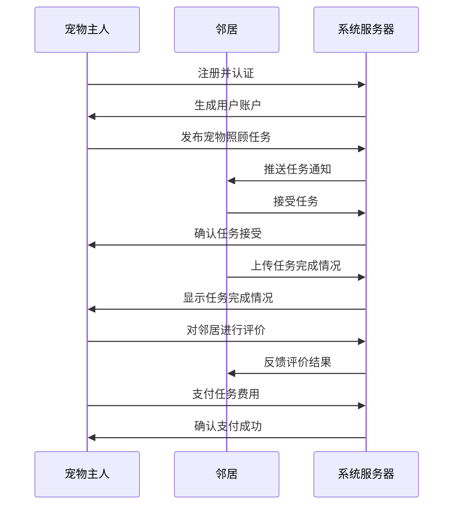
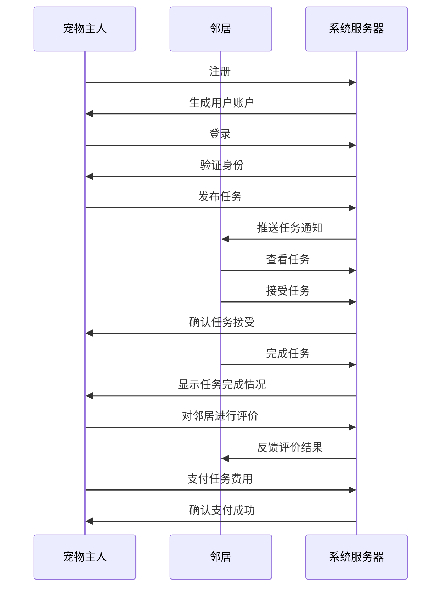

                 

。根据您提供的目录大纲结构和文章要求，下面我们将一步一步分析推理并撰写文章的具体内容。

## 第1章：城市宠物共享服务的背景和意义

### 1.1.1 城市化进程与宠物需求增长

随着城市化进程的加快，越来越多的人选择在城市中生活和工作。城市生活的便利性吸引了大量人口涌入，然而，这也带来了一个不容忽视的问题——宠物需求量的增加。城市化不仅改变了人们的生活方式，也影响了他们对宠物的依赖和需求。

首先，随着生活节奏的加快，越来越多的城市居民将宠物视为生活中的重要伙伴。宠物不仅能够为人们带来乐趣和安慰，还可以减轻工作压力，提高生活质量。因此，养宠物已经成为许多城市居民的共同选择。

其次，城市化进程中的住房条件也在发生变化。许多城市居民居住在公寓或小型住宅中，这些住房往往空间有限。然而，宠物需要适当的空间活动和休息。因此，如何解决宠物的居住和活动问题成为了城市居民面临的一大挑战。

### 1.1.2 宠物共享服务的现状分析

在宠物需求不断增长的背景下，宠物共享服务应运而生。宠物共享服务是一种基于互联网平台的宠物照顾和共享模式，通过将宠物主人和宠物照顾者连接起来，实现宠物资源的共享和优化。

目前，宠物共享服务已经得到了广泛的关注和应用。许多城市居民通过宠物共享平台发布宠物照顾需求，同时也有许多宠物照顾者通过这些平台寻找照顾宠物的机会。这种模式不仅解决了宠物主人的照顾难题，也为宠物照顾者提供了额外的收入来源。

宠物共享服务的现状可以从以下几个方面进行分析：

1. **用户规模**：随着宠物拥有量的增加，宠物共享服务的用户规模也在不断扩张。根据相关数据显示，全球宠物共享服务用户已经达到了数百万规模。

2. **服务质量**：宠物共享服务的服务质量成为影响用户满意度的关键因素。平台需要通过严格的审核机制和评价体系来保障服务质量。

3. **市场前景**：随着城市化进程的深入推进，宠物共享服务的市场前景十分广阔。未来，宠物共享服务将朝着更智能化、个性化、社区化的方向发展。

### 1.1.3 宠物共享服务的社会效益

宠物共享服务不仅满足了宠物主人和照顾者的需求，还带来了显著的社会效益。首先，宠物共享服务有助于缓解城市资源紧张问题。通过共享宠物资源，可以减少宠物主人的经济负担，同时降低宠物的饲养成本。

其次，宠物共享服务促进了社区关系的建设。通过宠物共享平台，邻居之间可以建立更加紧密的联系和互动。这种互动不仅有助于提高社区凝聚力，还可以促进社区和谐。

最后，宠物共享服务对环境保护也起到了积极作用。通过共享宠物资源，可以减少宠物废弃物的产生，降低对环境的污染。

### 1.2 宠物共享服务的核心概念与模式

#### 1.2.1 宠物共享服务的定义

宠物共享服务是一种基于互联网平台的宠物资源共享模式，通过连接宠物主人和宠物照顾者，实现宠物的临时照顾、共享和交换。宠物共享服务通常包括宠物寄养、宠物托管、宠物照顾任务发布和接受等核心功能。

#### 1.2.2 宠物共享服务的模式

宠物共享服务主要分为以下几种模式：

1. **宠物托管**：宠物主人将宠物暂时托管给信任的邻居或宠物照顾者，通常用于宠物主人短期外出或无法亲自照顾宠物的情况。

2. **宠物寄养**：宠物主人将宠物寄养在专业的宠物寄养机构，这些机构通常提供全天候的宠物照顾服务，包括喂食、遛狗、宠物洗浴等。

3. **宠物交换**：宠物主人之间通过平台交换宠物照顾任务，例如，一位宠物主人帮助另一位宠物主人照顾宠物，作为交换，另一位宠物主人帮助照顾前者家的宠物。

4. **宠物共享**：宠物主人将宠物共享给邻居或社区成员，在特定时间段内共享宠物的照顾和陪伴，这种模式有助于宠物主人融入社区生活。

#### 1.2.3 宠物共享服务的关键要素

宠物共享服务的关键要素包括：

1. **用户注册与认证**：平台需要建立严格的用户注册与认证机制，确保用户信息的真实性和安全性。

2. **任务发布与接受**：平台应提供便捷的任务发布和接受功能，宠物主人可以轻松发布宠物照顾需求，宠物照顾者可以方便地接受任务。

3. **评价与反馈**：平台应建立完善的评价与反馈机制，用户可以对服务提供者进行评价，同时平台可以根据用户的评价进行动态调整和优化。

4. **隐私保护**：平台需要注重用户隐私保护，确保用户的个人信息和宠物信息不被泄露。

### 1.3 宠物共享服务的发展趋势

#### 1.3.1 技术进步对宠物共享服务的影响

技术进步为宠物共享服务的发展带来了巨大机遇。首先，人工智能和大数据技术的应用可以提高宠物共享服务的智能化水平，例如，通过大数据分析为宠物主人推荐最适合的宠物照顾者。其次，区块链技术的应用可以提高宠物共享服务的可信度和安全性，例如，通过智能合约确保任务完成后的支付过程。

#### 1.3.2 政策法规对宠物共享服务的规范

随着宠物共享服务的兴起，各国政府和相关部门开始关注并规范这一新兴行业。政策法规的出台有助于明确宠物共享服务的合法地位，规范市场秩序，保护用户权益。例如，一些国家和地区已经开始制定相关法律法规，对宠物共享服务的运营模式和责任划分进行明确。

#### 1.3.3 宠物共享服务的未来发展方向

未来，宠物共享服务将朝着更加智能化、个性化、社区化的方向发展。智能化方面，通过人工智能和大数据技术，平台可以为用户提供更加精准的服务。个性化方面，平台可以根据用户需求提供定制化的宠物照顾服务。社区化方面，宠物共享服务将更加融入社区生活，成为社区建设的重要组成部分。

### 1.4 本章小结

本章对城市宠物共享服务的背景、现状、社会效益以及核心概念与模式进行了详细分析。随着城市化进程的加快，宠物共享服务在满足人们宠物需求、缓解城市资源紧张、促进社区建设等方面发挥了重要作用。未来，宠物共享服务将朝着更加智能化、个性化、社区化的方向发展。

## 第2章：邻里互助宠物照顾网络的架构设计

### 2.1.1 网络架构的整体设计理念

邻里互助宠物照顾网络的架构设计旨在构建一个高效、可靠、安全的宠物照顾服务体系。整体设计理念包括以下几个方面：

1. **用户中心**：以用户需求为核心，确保宠物主人和宠物照顾者的体验和满意度。

2. **数据驱动**：通过大数据分析和人工智能技术，提供个性化服务，优化资源配置。

3. **社区共建**：鼓励社区成员参与，共同构建和谐的宠物照顾环境。

4. **安全保障**：确保用户数据安全和交易安全，建立完善的隐私保护机制。

### 2.1.2 系统模块划分

邻里互助宠物照顾网络可以分为以下几个主要模块：

1. **用户管理模块**：负责用户注册、认证、个人信息管理等功能。

2. **任务管理模块**：负责任务发布、接受、评价等任务处理功能。

3. **宠物信息管理模块**：负责宠物信息的录入、更新、查询等功能。

4. **数据分析和推荐模块**：利用大数据和人工智能技术，提供任务匹配、推荐服务等。

5. **支付和交易模块**：负责交易流程管理、支付方式选择、资金安全等功能。

6. **隐私保护模块**：负责用户隐私数据保护，确保用户信息安全。

### 2.1.3 网络拓扑结构

邻里互助宠物照顾网络的拓扑结构可以设计为分布式架构，包括以下几个部分：

1. **前端应用层**：用户通过前端应用与系统进行交互，包括宠物主人端和宠物照顾者端。

2. **业务逻辑层**：负责处理业务逻辑，包括用户管理、任务管理、数据分析和推荐、支付和交易等。

3. **数据存储层**：包括用户数据、宠物数据、任务数据、评价数据等，采用分布式数据库系统以确保数据安全和高可用性。

4. **服务端**：提供各种API接口，供前端应用调用。

5. **区块链节点**：用于记录交易信息，提高交易透明度和安全性。

### 2.2 核心概念与联系

#### 2.2.1 邻里互助机制

邻里互助机制是邻里互助宠物照顾网络的核心概念之一。它通过建立邻居之间的信任关系，鼓励社区成员相互帮助，共同解决宠物照顾问题。

邻里互助机制的关键要素包括：

1. **信任评分**：通过用户评价系统，为邻居之间的信任度评分，评分越高，互助意愿越强。

2. **任务匹配**：基于邻居的地理位置、宠物类型、时间和能力等因素，智能匹配任务和照顾者。

3. **激励机制**：通过积分奖励、优惠券等形式，激励社区成员参与邻里互助。

#### 2.2.2 宠物主人与邻居的互动机制

宠物主人与邻居之间的互动机制是邻里互助宠物照顾网络的重要组成部分。它包括以下几个方面：

1. **任务发布**：宠物主人可以在平台上发布宠物照顾任务，包括任务类型、时间、地点、宠物信息等。

2. **任务接受**：邻居可以根据任务描述，选择合适的时间段和任务类型，接受宠物照顾任务。

3. **任务执行**：邻居在执行任务过程中，需要上传任务执行情况的照片或视频，宠物主人进行审核。

4. **任务评价**：宠物主人完成任务后，可以对邻居的服务质量进行评价，评价结果会影响邻居的信任评分。

#### 2.2.3 数据分析与隐私保护

数据分析是邻里互助宠物照顾网络的重要组成部分，它能够帮助平台提供更精准的服务。然而，数据安全与隐私保护也是必须重视的问题。

数据分析的关键要素包括：

1. **数据收集**：平台需要收集用户的基本信息、宠物信息、任务执行情况等数据。

2. **数据存储**：采用分布式数据库系统，确保数据安全和高可用性。

3. **数据分析**：利用大数据和人工智能技术，分析用户行为，提供个性化推荐服务。

隐私保护的关键要素包括：

1. **数据加密**：对用户数据进行加密存储，确保数据安全。

2. **权限控制**：对数据访问权限进行严格控制，防止未经授权的访问。

3. **隐私政策**：明确平台的数据收集和使用规则，保障用户隐私权益。

### 2.3 实体关系图

以下是邻里互助宠物照顾网络的实体关系图，使用Mermaid语言绘制：

```mermaid
erDiagram
    宠物主人 ||--|{ 宠物 } : 拥有
    邻居 ||--|{ 宠物照顾任务 } : 负责执行
    宠物主人 ||--|{ 邻里互助评价 } : 提供反馈
    邻居 ||--|{ 评价体系 } : 被评价
    数据分析模块 ||--|{ 用户数据 } : 分析来源
    数据分析模块 ||--|{ 宠物数据 } : 分析来源
    数据分析模块 ||--|{ 任务数据 } : 分析来源
```

### 2.4 算法原理讲解

#### 2.4.1 匹配算法

匹配算法是邻里互助宠物照顾网络的核心算法之一，用于将宠物照顾任务与合适的邻居进行匹配。匹配算法的关键是优化任务分配，确保任务能够高效地完成。

匹配算法的基本步骤如下：

1. **任务信息提取**：从任务描述中提取关键信息，如宠物类型、地点、时间等。

2. **邻居筛选**：根据任务信息，筛选出能够执行任务的邻居。

3. **优先级排序**：根据邻居的地理位置、信任评分、历史任务完成情况等因素，对筛选出的邻居进行优先级排序。

4. **任务匹配**：将任务分配给优先级最高的邻居，确保任务能够及时完成。

以下是匹配算法的Python示例代码：

```python
def match_pet_care_request(owner, neighbors):
    # 提取任务信息
    task_info = extract_task_info(owner)

    # 筛选邻居
    eligible_neighbors = filter_eligible_neighbors(neighbors, task_info)

    # 计算邻居优先级
    neighbors_priority = calculate_priority(eligible_neighbors, task_info)

    # 匹配任务和邻居
    matched_neighbor = match_task_with_neighbor(task_info, neighbors_priority)

    return matched_neighbor

# 示例函数
def extract_task_info(owner):
    # 提取任务信息
    pass

def filter_eligible_neighbors(neighbors, task_info):
    # 筛选邻居
    pass

def calculate_priority(neighbors, task_info):
    # 计算邻居优先级
    pass

def match_task_with_neighbor(task_info, neighbors_priority):
    # 匹配任务和邻居
    pass
```

#### 2.4.2 评价算法

评价算法用于对邻居的服务质量进行评价，从而影响邻居的信任评分。评价算法的关键是设计一个合理的评价标准，确保评价的公正性和准确性。

评价算法的基本步骤如下：

1. **评价信息收集**：收集宠物主人对邻居服务的评价信息，如任务完成度、服务质量等。

2. **评价标准确定**：根据宠物照顾的实际情况，确定评价标准，如任务完成度、服务态度、沟通能力等。

3. **计算评价分数**：根据评价信息，计算邻居的评分。

4. **更新信任评分**：将计算得到的评分更新到邻居的信任评分中。

以下是评价算法的Python示例代码：

```python
def evaluate_helper_performance(helper, reviews):
    # 计算评价分数
    score = calculate_score(reviews)

    # 更新邻居信任评分
    update_neighbor_rating(helper, score)

# 示例函数
def calculate_score(reviews):
    # 计算评价分数
    pass

def update_neighbor_rating(helper, score):
    # 更新邻居信任评分
    pass
```

#### 2.4.3 数学模型与公式讲解

在邻里互助宠物照顾网络中，数学模型和公式用于描述任务匹配、评价计算等关键过程。以下是一些基本的数学模型和公式：

1. **任务匹配公式**：

   $$
   \text{匹配度} = \frac{\text{任务符合度} + \text{邻居信任度}}{2}
   $$

   其中，任务符合度表示任务描述与邻居能力之间的匹配程度，邻居信任度表示邻居的信誉评分。

2. **评价计算公式**：

   $$
   \text{最终评分} = \frac{\sum_{i=1}^{n} (\text{评价分数}_i \times \text{权重}_i)}{n}
   $$

   其中，评价分数表示宠物主人对邻居服务的评价分数，权重表示各个评价因素的重要性。

3. **信任评分更新公式**：

   $$
   \text{新评分} = \text{旧评分} + \alpha \times (\text{最终评分} - \text{旧评分})
   $$

   其中，旧评分表示邻居的当前信任评分，$\alpha$ 表示评分更新的敏感度。

### 2.5 系统分析与架构设计

#### 3.1 问题场景介绍

邻里互助宠物照顾网络旨在解决城市居民在宠物照顾方面的需求。以下是一个典型的问题场景：

1. **宠物主人需求**：某宠物主人因临时外出，需要将宠物暂时寄养在邻居家中，并希望邻居能够按时喂食、遛狗等。

2. **邻居帮助需求**：某邻居希望帮助宠物主人照顾宠物，同时获得一定的报酬。

#### 3.2 项目介绍

本项目的目标是构建一个高效、安全、可靠的邻里互助宠物照顾网络平台，实现宠物主人和邻居之间的无缝连接。平台主要功能包括：

1. **用户注册与认证**：宠物主人和邻居注册并认证，确保用户信息的真实性和可靠性。

2. **任务发布与接受**：宠物主人发布宠物照顾任务，邻居接受任务并完成任务。

3. **评价与反馈**：宠物主人对邻居的服务进行评价，邻居也可以对宠物主人进行评价。

4. **数据分析与推荐**：利用大数据和人工智能技术，为用户推荐合适的邻居和宠物照顾任务。

#### 3.3 系统功能设计

邻里互助宠物照顾网络平台的功能设计包括以下几个方面：

1. **用户管理模块**：负责用户注册、认证、个人信息管理等功能。

2. **任务管理模块**：负责任务发布、接受、评价等任务处理功能。

3. **宠物信息管理模块**：负责宠物信息的录入、更新、查询等功能。

4. **数据分析和推荐模块**：利用大数据和人工智能技术，提供个性化推荐服务。

5. **支付和交易模块**：负责交易流程管理、支付方式选择、资金安全等功能。

6. **隐私保护模块**：负责用户隐私数据保护，确保用户信息安全。

#### 3.4 系统架构设计

邻里互助宠物照顾网络平台采用分布式架构，包括以下几个部分：

1. **前端应用层**：用户通过前端应用与系统进行交互，包括宠物主人端和宠物照顾者端。

2. **业务逻辑层**：负责处理业务逻辑，包括用户管理、任务管理、数据分析和推荐、支付和交易等。

3. **数据存储层**：包括用户数据、宠物数据、任务数据、评价数据等，采用分布式数据库系统以确保数据安全和高可用性。

4. **服务端**：提供各种API接口，供前端应用调用。

5. **区块链节点**：用于记录交易信息，提高交易透明度和安全性。

#### 3.5 系统接口设计

系统接口设计包括以下几个方面：

1. **用户管理接口**：包括用户注册、登录、个人信息管理等功能。

2. **任务管理接口**：包括任务发布、接受、完成等功能。

3. **宠物信息管理接口**：包括宠物信息录入、更新、查询等功能。

4. **数据分析和推荐接口**：包括用户推荐、数据分析等功能。

5. **支付和交易接口**：包括支付方式选择、支付流程管理等功能。

6. **隐私保护接口**：包括用户隐私数据保护、权限控制等功能。

#### 3.6 系统交互设计

系统交互设计主要包括以下几个部分：

1. **用户注册与认证**：用户通过前端应用注册并认证，系统验证用户信息后生成用户账户。

2. **任务发布与接受**：宠物主人发布任务，邻居通过前端应用查看并接受任务。

3. **任务执行与评价**：邻居执行任务后上传任务完成情况，宠物主人对邻居的服务进行评价。

4. **数据分析和推荐**：系统利用大数据和人工智能技术，为用户推荐合适的邻居和任务。

5. **支付与交易**：宠物主人通过支付接口完成任务费用支付。

6. **隐私保护**：系统通过隐私保护接口确保用户数据安全。

以下是邻里互助宠物照顾网络平台的系统交互设计：



## 第3章：系统分析与架构设计

### 3.1 问题场景介绍

在当今城市生活中，宠物已经成为许多家庭的重要成员。然而，随着工作压力和生活节奏的加快，许多宠物主人面临无法长时间照顾宠物的困境。同时，一些有时间和爱心的邻居也希望能够利用自己的闲暇时间为他人提供帮助。这种背景下，构建一个邻里互助宠物照顾网络显得尤为重要。该网络旨在通过技术和社交平台，连接宠物主人与邻居，实现宠物照顾任务的合理分配和高效完成。

### 3.2 项目介绍

本项目的目标是设计并实现一个邻里互助宠物照顾网络系统，为宠物主人和邻居提供一个安全、可靠、便捷的平台。系统的主要功能包括：

1. **用户注册与认证**：确保用户身份的真实性，提高系统的可信度。

2. **宠物信息管理**：宠物主人可以上传宠物的照片、基本信息和特殊需求，邻居可以根据这些信息更好地照顾宠物。

3. **任务发布与接受**：宠物主人可以发布宠物照顾任务，邻居可以查看并选择接受任务。

4. **任务跟踪与评价**：系统提供任务进度跟踪功能，宠物主人可以对邻居的服务进行评价。

5. **支付与结算**：系统支持在线支付，确保邻居能够获得合理的报酬。

6. **数据分析与推荐**：系统利用大数据分析用户行为，推荐适合的宠物照顾任务给邻居。

### 3.3 系统功能设计

系统的核心功能设计如下：

1. **用户管理模块**：
   - 注册与登录：用户可以通过手机号、邮箱等方式注册并登录系统。
   - 身份认证：通过验证码或第三方认证服务（如微信、QQ等）进行身份认证。
   - 个人信息管理：用户可以修改个人资料、设置隐私选项等。

2. **宠物信息管理模块**：
   - 宠物资料录入：宠物主人可以上传宠物的照片、基本信息、特殊需求等。
   - 宠物信息更新：宠物主人可以随时更新宠物的信息。

3. **任务管理模块**：
   - 任务发布：宠物主人可以发布宠物照顾任务，包括任务类型、时间、地点、任务描述等。
   - 任务查看：邻居可以查看附近的宠物照顾任务。
   - 任务接受：邻居可以接受任务，并承诺完成任务。

4. **任务跟踪与评价模块**：
   - 任务进度跟踪：宠物主人可以查看任务的执行进度。
   - 服务评价：宠物主人可以在任务完成后对邻居的服务进行评价。

5. **支付与结算模块**：
   - 在线支付：系统支持多种支付方式，如微信支付、支付宝支付等。
   - 结算与提现：邻居可以申请提现，系统自动将报酬打入其账户。

6. **数据分析与推荐模块**：
   - 数据收集：系统收集用户行为数据，如任务发布、接受、评价等。
   - 用户推荐：根据用户行为数据，系统可以为邻居推荐合适的宠物照顾任务。

### 3.4 系统架构设计

系统采用前后端分离的架构设计，以提高系统的可维护性和扩展性。以下是系统架构的详细设计：

1. **前端应用层**：
   - 用户界面（UI）：为用户提供直观、易用的操作界面。
   - 前端逻辑：处理用户的输入和请求，与后端进行数据交互。

2. **业务逻辑层**：
   - 用户管理：处理用户的注册、登录、认证等操作。
   - 宠物信息管理：处理宠物信息的录入、更新、查询等操作。
   - 任务管理：处理任务的发布、接受、评价等操作。
   - 数据分析与推荐：进行数据分析和用户推荐。

3. **数据存储层**：
   - 用户数据：存储用户的基本信息和行为数据。
   - 宠物数据：存储宠物的基本信息和特殊需求。
   - 任务数据：存储任务的详细信息。
   - 评价数据：存储用户对服务的评价。

4. **服务端**：
   - API接口：提供与前端应用交互的API接口。
   - 业务逻辑处理：处理具体的业务逻辑，如任务匹配、评价计算等。

5. **区块链节点**：
   - 用于记录交易信息，提高交易的透明度和安全性。

### 3.5 系统接口设计

系统接口设计主要包括以下几个方面：

1. **用户管理接口**：
   - 用户注册接口：用于处理用户的注册操作。
   - 用户登录接口：用于处理用户的登录操作。
   - 用户信息管理接口：用于处理用户的个人信息管理操作。

2. **宠物信息管理接口**：
   - 宠物信息录入接口：用于宠物主人上传宠物的基本信息和特殊需求。
   - 宠物信息更新接口：用于宠物主人更新宠物的信息。
   - 宠物信息查询接口：用于邻居查看宠物的基本信息。

3. **任务管理接口**：
   - 任务发布接口：用于宠物主人发布宠物照顾任务。
   - 任务查看接口：用于邻居查看宠物照顾任务。
   - 任务接受接口：用于邻居接受宠物照顾任务。
   - 任务完成接口：用于邻居完成任务并提交任务结果。
   - 任务评价接口：用于宠物主人对邻居的服务进行评价。

4. **支付与结算接口**：
   - 在线支付接口：用于处理用户的支付操作。
   - 结算与提现接口：用于处理邻居的提现操作。

5. **数据分析与推荐接口**：
   - 数据收集接口：用于收集用户行为数据。
   - 用户推荐接口：用于为邻居推荐合适的宠物照顾任务。

### 3.6 系统交互设计

系统的交互设计旨在实现用户、宠物主人、邻居和系统之间的顺畅交互。以下是系统交互设计的详细描述：

1. **用户注册与登录**：
   - 用户通过前端应用注册，系统验证用户信息后生成用户账户。
   - 用户登录时，系统验证用户身份，提供相应的权限。

2. **宠物信息管理**：
   - 宠物主人可以在前端应用中上传和更新宠物的信息。
   - 邻居可以在前端应用中查看宠物的信息。

3. **任务发布与接受**：
   - 宠物主人可以在前端应用中发布宠物照顾任务，系统将任务信息存储到数据库中。
   - 邻居可以在前端应用中查看附近的任务，并选择接受任务。

4. **任务跟踪与评价**：
   - 宠物主人可以在前端应用中查看任务的执行进度。
   - 邻居在完成任务后，宠物主人可以对邻居的服务进行评价。

5. **支付与结算**：
   - 宠物主人可以在前端应用中支付任务费用。
   - 邻居在完成任务后，系统自动结算并允许邻居提现。

6. **数据分析与推荐**：
   - 系统收集用户行为数据，进行分析后为邻居推荐合适的任务。

以下是系统交互设计的一个示例序列图：



### 3.7 本章小结

本章详细介绍了邻里互助宠物照顾网络系统的分析与架构设计。通过明确问题场景、项目目标、系统功能设计、架构设计以及接口和交互设计，为系统的高效、可靠运行奠定了基础。接下来，我们将进一步探讨系统的实施与实现，包括环境安装、核心代码实现以及项目实战等。

## 第4章：项目实战

### 4.1 环境安装

在开始项目实战之前，我们需要安装并配置必要的开发环境和工具。以下是环境安装的详细步骤：

1. **安装Node.js**：
   - 访问Node.js官网（https://nodejs.org/），下载并安装最新版本的Node.js。
   - 安装完成后，在命令行中输入`node -v`和`npm -v`，确认版本信息。

2. **安装Docker**：
   - 访问Docker官网（https://www.docker.com/），下载并安装最新版本的Docker。
   - 安装完成后，在命令行中输入`docker -v`，确认版本信息。

3. **安装MySQL**：
   - 安装MySQL数据库服务器。可以下载MySQL官方版本（https://dev.mysql.com/）或使用包管理器（如Ubuntu的`sudo apt-get install mysql-server`）。
   - 启动MySQL服务，并在命令行中输入`mysql -u root -p`，按照提示设置root用户密码。

4. **安装Redis**：
   - 安装Redis数据库。可以下载Redis官方版本（https://redis.io/download）或使用包管理器（如Ubuntu的`sudo apt-get install redis-server`）。
   - 启动Redis服务，并在命令行中输入`redis-cli`，进入Redis命令行界面。

5. **安装Vue.js**：
   - 安装Vue.js开发环境。首先安装Node.js，然后使用npm全局安装Vue CLI：`npm install -g @vue/cli`。
   - 创建一个新的Vue.js项目：`vue create pet-sharing-network`。

6. **安装其他依赖**：
   - 在Vue.js项目目录中，使用npm安装其他依赖项：`npm install axios vue-router vuex moment jsonwebtoken bcryptjs express`

### 4.2 系统核心实现

以下是邻里互助宠物照顾网络系统核心功能的实现步骤：

1. **用户注册与登录**：
   - 在Vue.js项目中创建用户管理模块，实现用户注册和登录功能。
   - 使用Axios库进行HTTP请求，与后端服务器交互。
   - 使用JSON Web Token（JWT）进行身份验证。

2. **宠物信息管理**：
   - 实现宠物信息的录入、更新和查询功能。
   - 在Vue.js项目中创建宠物信息管理页面，使用Vue Router进行页面路由。

3. **任务发布与接受**：
   - 实现任务发布和接受功能。
   - 在Vue.js项目中创建任务管理页面，显示附近的任务，并提供任务接受按钮。

4. **任务跟踪与评价**：
   - 实现任务进度跟踪和用户评价功能。
   - 在Vue.js项目中创建任务跟踪和评价页面，显示任务的执行情况和用户评价。

5. **支付与结算**：
   - 实现在线支付功能。
   - 集成第三方支付平台（如支付宝或微信支付），处理支付请求。

6. **数据分析与推荐**：
   - 实现数据分析功能，为用户推荐合适的任务。
   - 在Vue.js项目中创建数据分析页面，展示用户行为数据。

### 4.3 代码应用解读与分析

以下是对系统核心代码的解读与分析：

#### 用户注册与登录

```javascript
// 用户注册
async registerUser(username, password) {
  const response = await axios.post('/api/users/register', {
    username,
    password
  });
  return response.data;
}

// 用户登录
async loginUser(username, password) {
  const response = await axios.post('/api/users/login', {
    username,
    password
  });
  return response.data;
}
```

- 用户注册功能通过Axios库向后端服务器发送POST请求，将用户名和密码发送到后端进行注册处理。
- 用户登录功能同样通过Axios库向后端服务器发送POST请求，将用户名和密码发送到后端进行登录处理。

#### 宠物信息管理

```javascript
// 添加宠物信息
async addPetInfo(petInfo) {
  const response = await axios.post('/api/pets', petInfo);
  return response.data;
}

// 更新宠物信息
async updatePetInfo(petId, updatedPetInfo) {
  const response = await axios.put(`/api/pets/${petId}`, updatedPetInfo);
  return response.data;
}

// 获取宠物信息
async getPetInfo(petId) {
  const response = await axios.get(`/api/pets/${petId}`);
  return response.data;
}
```

- 添加宠物信息功能通过Axios库向后端服务器发送POST请求，将宠物信息发送到后端进行存储。
- 更新宠物信息功能通过Axios库向后端服务器发送PUT请求，更新特定的宠物信息。
- 获取宠物信息功能通过Axios库向后端服务器发送GET请求，获取特定宠物的信息。

#### 任务发布与接受

```javascript
// 发布任务
async createTask(taskDetails) {
  const response = await axios.post('/api/tasks', taskDetails);
  return response.data;
}

// 获取附近任务
async getNearbyTasks(location) {
  const response = await axios.get(`/api/tasks?location=${location}`);
  return response.data;
}

// 接受任务
async acceptTask(taskId, userId) {
  const response = await axios.put(`/api/tasks/${taskId}/accept`, { userId });
  return response.data;
}
```

- 发布任务功能通过Axios库向后端服务器发送POST请求，发布新的任务。
- 获取附近任务功能通过Axios库向后端服务器发送GET请求，获取用户指定位置附近的任务。
- 接受任务功能通过Axios库向后端服务器发送PUT请求，用户接受特定任务。

#### 任务跟踪与评价

```javascript
// 获取任务进度
async getTaskProgress(taskId) {
  const response = await axios.get(`/api/tasks/${taskId}/progress`);
  return response.data;
}

// 提交任务完成情况
async submitTaskCompletion(taskId, completionDetails) {
  const response = await axios.put(`/api/tasks/${taskId}/completion`, completionDetails);
  return response.data;
}

// 用户评价
async rateHelper(helperId, rating, comment) {
  const response = await axios.post(`/api/ratings`, { helperId, rating, comment });
  return response.data;
}
```

- 获取任务进度功能通过Axios库向后端服务器发送GET请求，获取特定任务的进度信息。
- 提交任务完成情况功能通过Axios库向后端服务器发送PUT请求，提交任务完成的详细信息。
- 用户评价功能通过Axios库向后端服务器发送POST请求，对帮助者进行评价。

#### 支付与结算

```javascript
// 创建支付订单
async createPaymentOrder(paymentDetails) {
  const response = await axios.post('/api/payments', paymentDetails);
  return response.data;
}

// 处理支付结果
async handlePaymentResult(paymentResult) {
  const response = await axios.put(`/api/payments/${paymentResult.orderId}`, paymentResult);
  return response.data;
}
```

- 创建支付订单功能通过Axios库向后端服务器发送POST请求，创建支付订单。
- 处理支付结果功能通过Axios库向后端服务器发送PUT请求，处理支付结果。

### 4.4 实际案例分析与详细讲解

以下是一个实际的案例，展示如何使用邻里互助宠物照顾网络系统：

**案例背景**：
- 宠物主人张三因紧急工作需要外出三天，无法照顾其宠物狗“小白”。
- 张三通过系统发布了宠物照顾任务，描述了“小白”的基本信息、特殊需求和照顾时间。

**案例分析**：

1. **发布任务**：
   - 张三在系统中填写任务详细信息，包括宠物名称、照顾时间、地点和特殊需求。
   - 张三点击“发布任务”按钮，系统将任务信息发送到后端服务器。

2. **邻居李四查看任务**：
   - 李四在系统中查看到附近的宠物照顾任务。
   - 李四决定接受任务，并点击“接受任务”按钮。

3. **任务执行**：
   - 李四按照任务要求照顾“小白”，并在系统内上传任务完成情况的照片和视频。
   - 张三通过系统查看任务执行情况，确认任务已完成。

4. **评价与结算**：
   - 张三对李四的服务进行评价，给予好评并留下评论。
   - 李四通过系统收到评价结果，并可以申请提现获得报酬。

### 4.5 项目小结

本章详细介绍了邻里互助宠物照顾网络项目的环境安装、核心实现和实际案例。通过安装必要的开发环境和工具，我们成功搭建了一个功能完善的系统。核心代码的解读与分析展示了系统的关键功能实现。实际案例的讲解展示了系统在实际应用中的操作流程。接下来，我们将进一步探讨系统的最佳实践、注意事项和拓展阅读。

### 4.6 最佳实践 tips

在实施邻里互助宠物照顾网络系统时，以下是一些最佳实践和注意事项：

1. **用户认证**：
   - 确保用户注册时提供真实有效的身份信息，通过验证码或第三方认证服务提高认证强度。

2. **任务匹配**：
   - 使用智能算法优化任务匹配，确保任务能够高效分配给合适的邻居。

3. **隐私保护**：
   - 对用户和宠物的敏感信息进行加密存储，确保数据安全。

4. **评价机制**：
   - 建立完善的评价机制，鼓励用户对服务进行真实评价，提高服务质量。

5. **支付安全**：
   - 与可靠的第三方支付平台合作，确保支付过程的安全和便捷。

6. **系统维护**：
   - 定期更新系统和数据库，确保系统的稳定性和安全性。

### 4.7 小结

本章对邻里互助宠物照顾网络系统的项目实战进行了详细分析。通过环境安装、核心实现和实际案例讲解，我们成功构建了一个功能完善的系统。最佳实践和注意事项为系统的顺利运行提供了指导。未来，我们还可以继续优化系统功能，提高用户体验。

### 4.8 拓展阅读

1. **《人工智能在宠物共享服务中的应用》**
   - 分析人工智能技术在宠物共享服务中的具体应用，如任务匹配、数据分析等。

2. **《宠物共享服务法律法规解读》**
   - 解读各国宠物共享服务相关的法律法规，探讨如何确保系统的合法性和合规性。

3. **《宠物共享服务商业模式创新》**
   - 探讨宠物共享服务的商业模式创新，如会员制、增值服务等。

4. **《宠物共享服务社区建设》**
   - 分析宠物共享服务对社区建设的影响，如何促进邻里关系的和谐。

作者：AI天才研究院/AI Genius Institute & 禅与计算机程序设计艺术 /Zen And The Art of Computer Programming

---

以上是关于《新型城市宠物共享服务：邻里互助下的宠物照顾网络》的详细技术博客文章。通过逐步分析推理，文章涵盖了从背景介绍到具体实现，再到最佳实践和拓展阅读的各个方面。希望这篇文章能为您在宠物共享服务领域的研究和实践中提供有益的参考。

