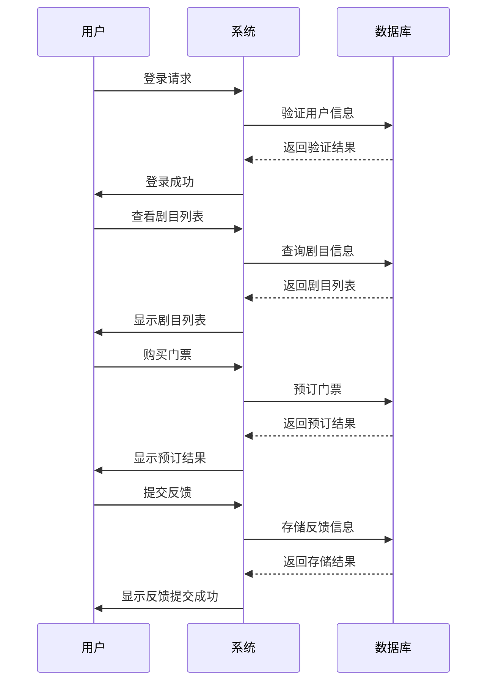

                 

## 引言

### 1.1 问题背景

随着城市化的加速发展，城市空间资源变得愈发紧张，传统大剧院由于场地、成本等因素的限制，难以满足日益增长的社区文化需求。与此同时，实验戏剧作为一种新兴的艺术形式，以其开放、创新、多样化的特点，逐渐成为社区文化的重要组成部分。因此，如何在有限的城市空间内，打造一种新型城市微型剧场，为实验戏剧的社区孵化提供场所和支持，成为当前文化艺术领域亟待解决的问题。

### 1.1.1 城市发展与微型剧场的兴起

城市化进程带来了人口密度增加、文化消费需求多样化等问题。为了适应这种变化，微型剧场应运而生。微型剧场以其小巧的规模、灵活的运营模式和低廉的成本，成为城市社区文化的重要载体。此外，微型剧场的兴起也受到了艺术创作和社区参与的双重推动。一方面，微型剧场为艺术创作者提供了更多实验和探索的机会；另一方面，社区居民通过参与微型剧场的活动，增强了社区归属感和文化认同感。

### 1.1.2 社区文化的需求

社区文化是城市文化的重要组成部分，它关系到居民的生活质量和社会和谐。随着人们对精神文化需求的不断提升，社区文化的发展显得尤为重要。微型剧场作为一种独特的文化场所，能够为社区居民提供丰富的文化活动，促进社区文化繁荣。此外，微型剧场还可以通过举办各类文化讲座、展览等活动，提升社区居民的文化素养和审美水平。

### 1.1.3 实验戏剧的意义

实验戏剧是一种追求创新和突破的艺术形式，它关注个体体验和社会现实，具有较强的实验性和探索性。实验戏剧不仅为观众带来了新的审美体验，也推动了戏剧艺术的创新发展。在社区文化中，实验戏剧具有独特的教育、传播和推动作用。通过实验戏剧的演出和活动，社区居民可以更深入地了解戏剧艺术，提高文化素养和审美能力。

### 1.2 书籍的目的与结构

本书旨在探讨新型城市微型剧场在实验戏剧社区孵化中的作用，为文化艺术领域的实践者和研究者提供理论支持和实践指导。本书分为七个部分：

1. **引言**：介绍研究背景、目的和结构。
2. **微型剧场的历史与现状**：分析微型剧场的起源、发展、类型和功能。
3. **实验戏剧与社区文化**：探讨实验戏剧的概念、特点和实践。
4. **微型剧场的运营模式**：分析微型剧场的运营理念、策略和实践。
5. **社区孵化器的作用与功能**：介绍社区孵化器的概念、服务内容和运作模式。
6. **成功案例分析**：分析成功微型剧场和社区孵化器的案例。
7. **未来展望与挑战**：展望微型剧场和社区孵化器的发展趋势和面临的挑战。

### 1.3 读者对象

本书适合以下读者群体：

1. **戏剧从业者**：包括戏剧工作者、导演、演员、编剧等，通过本书可以了解微型剧场和实验戏剧的发展现状，获得实践启示。
2. **社区文化工作者**：包括社区文化管理者、活动策划者等，通过本书可以借鉴微型剧场和社区孵化器的运营经验，提升社区文化发展水平。
3. **戏剧爱好者**：包括戏剧爱好者、艺术工作者等，通过本书可以深入了解微型剧场和实验戏剧，拓宽艺术视野。

## 文章关键词

- 新型城市微型剧场
- 实验戏剧
- 社区孵化器
- 文化艺术发展
- 社区文化
- 剧院运营模式

## 文章摘要

本文从新型城市微型剧场的背景、历史与现状出发，探讨了实验戏剧与社区文化的关系，分析了微型剧场的运营模式和社区孵化器的作用。通过成功案例分析，总结了微型剧场和社区孵化器的发展经验，并对未来发展趋势和挑战进行了展望。本文旨在为文化艺术领域提供理论支持和实践指导，推动新型城市微型剧场的社区孵化功能发挥到最大。## 微型剧场的历史与现状

### 2.1 微型剧场的起源与发展

微型剧场作为一种独特的文化形式，其起源可以追溯到20世纪初期。当时，随着城市化的进程，城市空间资源日益紧张，大型剧院的规模和成本使得它们难以普及到各个社区。因此，一些戏剧工作者开始探索一种更为小巧、灵活且成本较低的剧场形式，以满足社区文化的需求。这一探索最终催生了微型剧场的诞生。

微型剧场的发展历程可以分为几个阶段。首先是初创期，这一阶段主要集中在小型实验剧场和社区剧场的建设。这些剧场通常由社区组织、文化团体或者个人创办，以其独特的艺术风格和社区参与模式吸引了大量观众。其次是发展期，这一阶段微型剧场逐渐得到了政府的支持和市场的认可，规模和数量都有了显著的增长。例如，在一些国家和地区，微型剧场已经成为社区文化的重要组成部分。最后是成熟期，这一阶段微型剧场不仅在经济上实现了可持续发展，还在艺术创作和文化传播方面发挥了重要作用。

### 2.1.1 微型剧场的起源

微型剧场的起源可以追溯到20世纪初的欧洲。当时，一些戏剧工作者开始尝试将戏剧艺术带到社区中，他们利用废弃的厂房、仓库甚至社区中心作为演出场地，以低成本的运营模式吸引了大量观众。这种形式的戏剧表演不仅为社区带来了文化娱乐，还促进了社区的凝聚力和文化认同感。

在中国，微型剧场的兴起可以追溯到20世纪80年代。当时，改革开放的政策使得文化艺术领域焕发了新的生机。一些艺术家和文化工作者开始探索微型剧场的形式，他们利用废弃的学校、厂房等场所进行戏剧表演，这种形式很快受到了观众的欢迎。随着城市化的加速发展，微型剧场逐渐成为城市社区文化的重要组成部分。

### 2.1.2 微型剧场的发展历程

微型剧场的发展历程可以分为几个阶段：

1. **初创期**（20世纪初至20世纪60年代）：这一阶段微型剧场主要是在社区和小城市兴起，由于场地和资金限制，微型剧场通常规模较小，但具有浓厚的实验性和创新性。

2. **发展期**（20世纪70年代至90年代）：随着城市化进程的加速和社区文化需求的增加，微型剧场得到了更多政府和社会组织的支持。这一时期，微型剧场的数量和规模都有了显著增长，一些微型剧场开始探索市场化运作模式。

3. **成熟期**（21世纪初至今）：微型剧场在经历了初创期和发展期的探索后，逐渐进入成熟期。这一时期，微型剧场不仅在数量和规模上实现了较大增长，还在艺术创作和文化传播方面取得了显著成果。一些微型剧场甚至开始走出国门，在国际上获得了认可。

### 2.1.3 微型剧场的现状

当前，微型剧场在全球范围内都取得了显著的进展。在一些国家和地区，微型剧场已经成为社区文化的重要载体，为居民提供了丰富的文化娱乐和精神食粮。以下是一些国家和地区微型剧场的现状：

1. **欧洲**：欧洲是微型剧场的发源地，目前欧洲的微型剧场在数量和艺术质量上都处于世界领先地位。例如，法国的“小舞台”（Petits Théâtres）和英国的“社区剧院”（Community Theatres）都是具有代表性的微型剧场组织。

2. **美国**：在美国，微型剧场也得到了广泛发展。一些社区剧院，如纽约的“时代广场戏剧工作室”（Times Square Studio Theatre）和洛杉矶的“社区舞台剧院”（Community Stage Theatre），不仅为社区居民提供了文化服务，还在艺术创作上取得了显著成就。

3. **中国**：随着城市化的加速和社区文化需求的增加，中国的微型剧场也迅速发展。许多城市，如北京、上海、广州等，都涌现出了一批具有影响力的微型剧场。这些微型剧场不仅丰富了社区文化生活，还为戏剧艺术的创新和发展提供了广阔的平台。

4. **其他国家和地区**：除了上述国家和地区，微型剧场在其他国家和地区也取得了不同程度的进展。例如，澳大利亚的微型剧场以其独特的艺术风格和社区参与模式受到了广泛关注；日本的微型剧场则在文化传承和创新方面表现出色。

### 2.2 微型剧场的类型与特点

微型剧场可以根据不同的标准进行分类，常见的分类方式包括场地类型、运营模式、艺术风格等。

#### 2.2.1 场地类型

1. **社区剧院**：这类微型剧场通常位于社区中心、学校、教堂等公共场所，以其方便性和亲和力受到了社区居民的欢迎。
2. **街头剧院**：这类微型剧场通常在街头、公园等公共场所演出，以其开放性和互动性吸引了大量观众。
3. **工作室剧院**：这类微型剧场通常位于艺术家工作室或独立建筑内，以其灵活性和创新性受到了艺术家的喜爱。

#### 2.2.2 运营模式

1. **非营利组织**：这类微型剧场通常由社区组织、文化团体或独立艺术家创办，以其公益性和社会责任感赢得了社会的认可。
2. **市场化运营**：这类微型剧场通常采取市场化运作模式，通过演出门票、赞助等方式实现经济独立。
3. **混合模式**：这类微型剧场结合了非营利组织和市场化运营的特点，既注重社会效益，又追求经济效益。

#### 2.2.3 艺术风格

1. **传统戏剧**：这类微型剧场以传统戏剧为主，注重剧本、表演和舞台效果。
2. **实验戏剧**：这类微型剧场以实验戏剧为主，注重创新、探索和观众参与。
3. **多元文化**：这类微型剧场融合了多种艺术形式和文化元素，以其多元性和包容性吸引了不同背景的观众。

#### 2.2.4 微型剧场与传统剧场的对比

1. **规模**：传统剧场通常规模较大，能容纳数百甚至数千观众；而微型剧场则规模较小，通常只能容纳几十到数百观众。
2. **成本**：传统剧场的建设、维护和运营成本较高，而微型剧场的成本较低，易于推广和普及。
3. **灵活性和互动性**：微型剧场因其小巧的规模和灵活的运营模式，更易于与观众互动，增强了观众的参与感；而传统剧场由于规模较大，观众参与度相对较低。
4. **文化功能**：传统剧场更多关注艺术创作和表演，而微型剧场则更注重社区文化建设和文化传播。

### 2.3 微型剧场的社

### 2.3 社会功能

微型剧场作为一种独特的文化场所，具有重要的社会功能：

#### 2.3.1 社区凝聚力的提升

微型剧场通过举办各种文化活动，如戏剧演出、讲座、工作坊等，为社区居民提供了交流和互动的平台。这种互动不仅增强了社区居民之间的联系，还促进了社区的凝聚力和归属感。

#### 2.3.2 公众参与度的增加

微型剧场鼓励公众参与戏剧创作和演出，使观众从被动接受文化服务转变为主动参与文化创造。这种参与不仅提高了公众的文化素养和艺术鉴赏能力，还增强了他们的社会责任感和公民意识。

#### 2.3.3 文化多样性的促进

微型剧场通过引进不同类型的戏剧作品和演出形式，丰富了社区的文化生活，促进了文化多样性的发展。这种多样性不仅满足了不同观众群体的需求，还推动了社区文化的创新和进步。

## 背景介绍

### 核心概念术语说明

- **微型剧场**：一种规模较小、灵活多样的文化场所，主要用于戏剧表演和文化活动。
- **实验戏剧**：一种以创新和探索为特点的戏剧形式，强调观众的参与和互动。
- **社区孵化器**：一种支持创新和创业的组织形式，旨在培育新企业和创新项目。
- **社区文化**：指在一定社区范围内，居民共同创造、共享和传承的文化成果。

### 问题背景

随着城市化的加速发展，城市空间资源日益紧张，传统大剧院难以满足社区文化需求。同时，实验戏剧作为一种新兴的艺术形式，需要更为灵活和开放的空间进行实践。因此，如何利用微型剧场这一形式，为实验戏剧的社区孵化提供支持，成为当前文化艺术领域的重要课题。

### 问题描述

微型剧场的兴起和发展，为社区文化带来了新的机遇和挑战。一方面，微型剧场能够为社区居民提供丰富的文化娱乐和艺术体验，促进社区凝聚力和文化多样性的发展。另一方面，微型剧场的运营和管理面临诸多挑战，如资金不足、资源短缺、专业人才缺乏等。

### 问题解决

为了解决这些问题，需要从多个方面进行思考和探索：

1. **政策支持**：政府可以通过财政补贴、税收优惠等政策，支持微型剧场的发展。
2. **资源整合**：通过多方合作，整合社区资源，提高微型剧场的运营效率。
3. **人才培养**：加强戏剧教育和培训，培养专业的戏剧人才，为微型剧场的运营提供人才支持。
4. **公众参与**：鼓励公众参与微型剧场的建设和运营，提高其社会影响力和公众参与度。

### 边界与外延

- **边界**：微型剧场的边界主要在于其规模和运营模式。通常，微型剧场的规模较小，运营成本较低，更注重社区参与和互动。
- **外延**：微型剧场的外延包括其功能和服务范围，如文化演出、艺术展览、讲座、工作坊等。

### 概念结构与核心要素组成

- **概念结构**：微型剧场、实验戏剧、社区孵化器、社区文化等概念相互关联，共同构成了社区文化生态体系。
- **核心要素组成**：微型剧场运营的核心要素包括场地、人才、资金、观众等。

通过上述分析和思考，我们可以更好地理解微型剧场在实验戏剧社区孵化中的作用，为其实践和发展提供理论支持和实践指导。## 核心概念与联系

### 实验戏剧的概念与特点

#### 3.1.1 实验戏剧的定义

实验戏剧（Experimental Theatre）是一种以创新和探索为核心的艺术形式，它追求突破传统戏剧的框架，以新的表现形式、叙事手法和观众互动方式为特点。实验戏剧通常不遵循固定剧本，更注重剧作家的创意和个人风格，以及对社会现实和个体体验的深刻挖掘。

#### 3.1.2 实验戏剧的核心理念

实验戏剧的核心理念包括：

1. **创新性**：通过不断尝试新的戏剧形式、技术手段和表演方式，实验戏剧鼓励创新思维和艺术表达的多样性。
2. **参与性**：实验戏剧强调观众的参与和互动，使观众不仅是被动的观赏者，还能成为积极的参与者。
3. **社会性**：实验戏剧关注社会现实和人类经验，通过戏剧作品反映社会问题，探讨人性、自由、平等等主题。

#### 3.1.3 实验戏剧与传统戏剧的区别

与传统戏剧相比，实验戏剧具有以下几个显著特点：

1. **形式**：传统戏剧通常遵循固定剧本，情节和角色设定较为明确；而实验戏剧则更注重自由发挥，剧情和角色更具有弹性。
2. **技术**：传统戏剧注重舞台布景、灯光音效等传统舞台技术；实验戏剧则更倾向于运用多媒体技术、互动装置等现代科技手段。
3. **观众**：传统戏剧观众通常是静态的，观看过程相对独立；而实验戏剧观众则更被鼓励参与其中，成为演出的一部分。
4. **目的**：传统戏剧更多关注艺术表现和故事讲述；实验戏剧则更注重社会批判、个体体验和观念传达。

### 实验戏剧在社区中的实践

#### 3.2.1 实验戏剧的社区参与形式

实验戏剧在社区中的实践形式多种多样，主要包括：

1. **社区戏剧工作坊**：通过组织社区成员参与戏剧工作坊，教授他们戏剧表演技巧和创作方法，培养戏剧创作和表演的能力。
2. **社区戏剧节**：举办社区戏剧节，邀请本地和外地剧团演出，展示实验戏剧的最新成果，增强社区文化氛围。
3. **社区互动演出**：将实验戏剧与社区活动相结合，如街头戏剧、户外剧场等，增强观众与演员之间的互动。
4. **社区主题戏剧**：根据社区特色和需求，创作反映社区生活的戏剧作品，提升社区认同感和文化凝聚力。

#### 3.2.2 实验戏剧的社区文化意义

实验戏剧在社区文化中具有重要的意义，具体体现在：

1. **文化多样性**：通过引入不同类型的实验戏剧作品，丰富了社区的文化多样性，满足了不同观众群体的需求。
2. **社会参与**：实验戏剧鼓励社区成员参与戏剧创作和表演，提高了公众的文化参与度和社会责任感。
3. **社区凝聚**：实验戏剧通过社区戏剧活动，增强了社区成员之间的联系和交流，促进了社区凝聚力的提升。
4. **文化传承**：实验戏剧通过对传统戏剧的重新解读和演绎，促进了文化传统的传承和创新。

#### 3.2.3 实验戏剧的社会影响力

实验戏剧不仅对社区文化产生了深远影响，还在社会层面上发挥了重要作用：

1. **社会批判**：实验戏剧通过揭示社会问题、反映社会现实，对社会现象进行批判和反思，推动社会进步。
2. **观念传播**：实验戏剧通过独特的表演形式和内容，传播新的观念和思想，影响公众的思维方式和价值观念。
3. **艺术创新**：实验戏剧为戏剧艺术注入了新的活力和可能性，推动了戏剧艺术的创新和发展。
4. **文化交流**：实验戏剧通过跨文化交流，促进了不同文化之间的理解和融合，丰富了全球文化的多样性。

### 实验戏剧与社区文化的互动

#### 3.3.1 互动机制分析

实验戏剧与社区文化的互动机制主要包括以下几个方面：

1. **参与机制**：通过组织工作坊、讲座、互动演出等活动，鼓励社区成员积极参与实验戏剧的创作和表演。
2. **反馈机制**：通过观众调查、反馈会议等方式，收集观众的意见和建议，不断改进实验戏剧的作品和演出。
3. **合作机制**：与社区组织、文化团体、政府等各方合作，共同推动实验戏剧在社区文化中的发展。
4. **传播机制**：利用社交媒体、网络平台等现代传播手段，扩大实验戏剧的影响力，吸引更多的观众参与。

#### 3.3.2 互动效果评估

实验戏剧与社区文化的互动效果可以从以下几个方面进行评估：

1. **参与度**：通过统计参与实验戏剧活动的人数、参与时间和参与频次，评估社区成员的参与度。
2. **满意度**：通过问卷调查、访谈等方式，了解观众对实验戏剧活动的满意度，评估互动效果。
3. **影响力**：通过媒体报道、社交媒体传播等方式，评估实验戏剧在社会上的影响力。
4. **社区发展**：通过观察社区文化氛围的变化、社区凝聚力提升的情况，评估实验戏剧对社区发展的推动作用。

#### 3.3.3 互动中的挑战与应对策略

在实验戏剧与社区文化的互动过程中，可能会面临以下挑战：

1. **资金不足**：实验戏剧需要资金支持，但社区资源有限。应对策略包括申请政府资助、寻求企业赞助、举办众筹活动等。
2. **专业人才缺乏**：实验戏剧需要专业的人才支持，但社区可能缺乏相关人才。应对策略包括培训本地人才、引进外部人才、开展合作项目等。
3. **组织管理**：实验戏剧的互动活动需要良好的组织管理。应对策略包括建立健全的组织结构、制定详细的策划方案、加强团队协作等。
4. **观众参与度**：提高观众的参与度是实验戏剧成功的关键。应对策略包括创新互动形式、增加参与机会、提供激励措施等。

通过上述分析，我们可以更好地理解实验戏剧在社区文化中的角色和作用，为其实践和发展提供理论支持和实践指导。## 微型剧场的运营模式

### 4.1 微型剧场的运营理念

微型剧场的运营理念主要包括以下几个核心要素：

#### 4.1.1 以社区为中心

微型剧场的运营应始终以社区为中心，充分考虑社区居民的需求和利益。通过举办各种文化活动，如戏剧演出、艺术展览、社区讲座等，增强社区居民的参与感和归属感。同时，积极收集和反馈社区意见，不断调整和优化剧场运营策略，确保剧场活动与社区文化需求相匹配。

#### 4.1.2 多元化运营模式

微型剧场的运营模式应多元化，以适应不同观众群体的需求。具体包括：

1. **艺术表演**：举办各类戏剧、舞蹈、音乐等艺术表演，吸引不同类型的观众。
2. **文化活动**：组织文化讲座、艺术工作坊、社区互动活动等，提高社区居民的文化素养。
3. **文化展览**：展示各类艺术作品、文化遗产等，促进文化交流和艺术创作。
4. **文化合作**：与本地文化机构、艺术家、教育机构等合作，共同举办文化活动，拓展剧场的影响力。

#### 4.1.3 社区参与与共同治理

微型剧场的运营应鼓励社区成员的参与和共同治理。通过设立社区委员会、居民议事会等组织，让社区居民参与剧场的决策和管理，提高社区的凝聚力和自治能力。同时，鼓励社区居民参与剧场活动的策划、组织和执行，增强他们的责任感和归属感。

### 4.2 微型剧场的运营策略

#### 4.2.1 资源整合与共享

微型剧场的运营需要充分利用各类资源，实现资源整合与共享。具体策略包括：

1. **资金筹集**：通过政府资助、企业赞助、众筹等方式筹集资金，确保剧场运营的资金来源稳定。
2. **人力资源**：组建专业团队和志愿者队伍，充分利用社区人才资源，提高剧场的运营效率。
3. **技术资源**：引进现代科技手段，如多媒体设备、互动装置等，提升剧场的艺术表现力和观众体验。
4. **场地资源**：合理利用社区公共设施，如学校、社区中心等，为剧场活动提供场地支持。

#### 4.2.2 品牌建设与推广

微型剧场需要通过品牌建设与推广，提升其知名度和影响力。具体策略包括：

1. **品牌定位**：明确微型剧场的品牌定位，塑造独特的品牌形象，突出剧场的特色和优势。
2. **宣传推广**：利用社交媒体、网络平台、传统媒体等渠道，开展多样化的宣传推广活动，提高剧场的知名度和美誉度。
3. **合作联盟**：与本地文化机构、媒体平台等建立合作联盟，共同推广剧场活动，扩大观众群体。
4. **文化活动**：举办有特色的文化活动，吸引观众关注和参与，提升剧场的品牌影响力。

#### 4.2.3 财务管理与社会责任

微型剧场的财务管理与社会责任是运营成功的关键。具体策略包括：

1. **预算管理**：制定详细的预算计划，确保资金使用的合理性和透明度。
2. **成本控制**：通过优化运营流程、降低运营成本，提高剧场的经济效益。
3. **社会责任**：关注社会问题，积极参与公益活动，提升剧场的社会责任感和品牌形象。
4. **可持续发展**：倡导绿色环保理念，推动剧场的可持续发展，为社区环境改善贡献力量。

### 4.3 微型剧场的运营实践

#### 4.3.1 成功案例分析

以下是几个微型剧场的成功案例分析：

1. **纽约曼哈顿下东城微型剧场**：该剧场以其多元文化的演出和社区参与活动著称，吸引了大量本地居民和国际观众。通过成功筹集资金、建立合作关系和举办丰富多彩的文化活动，该剧场实现了可持续发展。
2. **伦敦东区的社区微型剧场**：该剧场通过引入创新的表演形式和互动体验，吸引了大量年轻观众。同时，通过志愿者队伍的建设和社区参与的深入，该剧场在社区文化中发挥了重要作用。
3. **北京798艺术区的微型剧场**：该剧场位于艺术区中心，以其独特的艺术氛围和高质量的艺术表演受到观众喜爱。通过整合艺术资源、打造品牌形象和举办文化活动，该剧场成功地提升了社区文化品质。

#### 4.3.2 失败案例分析

以下是几个微型剧场的失败案例分析：

1. **芝加哥南区微型剧场**：该剧场由于资金不足、管理不善和缺乏社区支持，最终关闭。主要问题包括资金筹集困难、运营成本过高和观众参与度低。
2. **洛杉矶市中心的社区微型剧场**：该剧场由于缺乏专业人才和社区参与，演出质量不高，观众流失严重。最终，该剧场因经营不善而倒闭。

#### 4.3.3 运营实践中的问题与对策

在微型剧场的运营实践中，常见的问题包括资金不足、管理不善、观众参与度低等。以下是一些具体的对策：

1. **资金不足**：通过政府资助、企业赞助、众筹等方式筹集资金，同时优化运营流程，降低成本。
2. **管理不善**：建立健全的管理体系，提高管理效率，培养专业团队，提升管理水平。
3. **观众参与度低**：通过举办丰富多彩的文化活动、提高演出质量、加强宣传推广等方式，吸引观众参与。

通过上述分析和讨论，我们可以更好地理解微型剧场的运营模式和策略，为微型剧场的实践和发展提供指导。## 社区孵化器的作用与功能

### 5.1 社区孵化器的概念与定位

#### 5.1.1 社区孵化器的定义

社区孵化器（Community Incubator）是一种旨在支持社区创新和创业的组织形式。它通过提供空间、资源、指导和服务，帮助初创项目或团队快速发展，并在社区中形成积极的社会影响力。

#### 5.1.2 社区孵化器的作用

社区孵化器在社区文化发展中扮演着重要角色，其作用主要体现在以下几个方面：

1. **推动文化创新**：社区孵化器通过支持实验戏剧、艺术创作等创新项目，推动社区文化的不断进步和多元化发展。
2. **培育文化人才**：通过提供培训、指导和支持，帮助社区中的文化创作者和从业者提升技能，培养更多优秀的文化人才。
3. **促进社会参与**：鼓励社区居民参与孵化器的项目，提高公众的文化素养和社会责任感。
4. **增强社区凝聚力**：通过举办各类文化活动和工作坊，增强社区成员之间的联系和互动，提升社区凝聚力。

#### 5.1.3 社区孵化器的定位

社区孵化器在社区文化中具有独特的定位，它不仅是一个文化场所，更是一个文化创新和社会实验的孵化器。其定位主要包括：

1. **文化创新实验室**：为实验戏剧、艺术创作等创新项目提供实验和发展的空间，推动文化创新。
2. **文化人才培养基地**：通过培训、指导和扶持，培养和储备社区文化人才，提升社区文化发展的质量和水平。
3. **社区文化推动者**：积极策划和举办各类文化活动，推动社区文化的繁荣和发展。
4. **社区凝聚力的增强器**：通过文化活动和项目，增强社区成员之间的联系和互动，提升社区的凝聚力和归属感。

### 5.2 社区孵化器的服务内容

社区孵化器为社区文化项目提供全方位的服务，主要包括以下几个方面：

#### 5.2.1 艺术创作支持

1. **创作空间**：为文化创作者提供宽敞、舒适的工作空间，方便他们进行创作。
2. **资源支持**：提供各类创作资源，如书籍、多媒体设备、艺术材料等，支持文化创作。
3. **技术指导**：为文化创作者提供技术指导，帮助他们掌握最新的艺术创作技术。

#### 5.2.2 剧团孵化与成长

1. **剧团孵化**：通过培训、指导和支持，帮助初创剧团成长和发展。
2. **剧目创作**：支持剧团创作和演出高质量的戏剧作品，提升剧团的艺术水平和知名度。
3. **运营指导**：为剧团提供运营指导，帮助他们提高管理水平和运营效率。

#### 5.2.3 社区文化项目策划

1. **项目策划**：协助社区组织策划各类文化项目，如戏剧节、艺术展览、社区讲座等。
2. **活动组织**：提供活动组织服务，包括场地租赁、宣传推广、活动现场管理等。
3. **资金支持**：为社区文化项目提供资金支持，确保项目的顺利实施。

### 5.3 社区孵化器的运作模式

社区孵化器的运作模式主要包括以下几个方面：

#### 5.3.1 内部运作机制

1. **管理架构**：建立科学的管理架构，明确各部门职责和任务，确保孵化器的有效运作。
2. **项目管理**：采用项目管理方法，对孵化项目进行全程跟踪和管理，确保项目的顺利进行。
3. **人才发展**：建立人才发展机制，通过培训、指导和扶持，提升孵化器员工的业务能力和综合素质。

#### 5.3.2 外部合作网络

1. **政府合作**：与政府部门建立合作关系，争取政策支持和资金援助。
2. **企业合作**：与企业建立合作关系，共同开展文化项目和公益活动，实现资源共享和互利共赢。
3. **学术合作**：与学术机构建立合作关系，开展学术研究和项目合作，提升孵化器的学术水平。

#### 5.3.3 评估与反馈机制

1. **项目评估**：定期对孵化项目进行评估，了解项目进展情况和存在问题，及时调整和优化孵化策略。
2. **反馈机制**：建立反馈机制，收集社区成员和项目成员的意见和建议，不断改进孵化器的服务质量和运营效率。
3. **效果评估**：通过定期举办文化活动和工作坊，评估孵化器对社区文化和文化人才发展的推动作用，为孵化器的未来发展提供指导。

通过上述服务内容和运作模式，社区孵化器能够有效地推动社区文化的发展，为实验戏剧的社区孵化提供有力支持。## 成功案例分析

### 6.1 案例一：某某微型剧场的发展与成功经验

#### 6.1.1 剧场介绍

某某微型剧场成立于2005年，位于北京市的一个社区中心。该剧场面积约为300平方米，可容纳约100名观众。自成立以来，某某微型剧场致力于推广实验戏剧，成为社区文化的重要载体。

#### 6.1.2 成功经验总结

某某微型剧场的成功经验主要体现在以下几个方面：

1. **政策支持**：得益于政府的政策扶持，某某微型剧场在成立初期就获得了资金支持和场地租赁优惠。政府的支持为剧场的顺利运营提供了有力保障。
2. **社区参与**：某某微型剧场积极鼓励社区居民参与剧场活动和演出，建立了强大的志愿者队伍。社区居民的积极参与为剧场带来了新的活力和创意。
3. **多元化运营**：某某微型剧场不仅举办戏剧演出，还举办各类文化讲座、艺术展览和工作坊，满足了不同观众群体的需求。多元化的运营模式增强了剧场的吸引力和影响力。
4. **品牌建设**：某某微型剧场注重品牌建设，通过媒体宣传、活动推广和社交媒体运营，成功打造了独特的品牌形象。品牌建设提高了剧场的知名度和美誉度。

#### 6.1.3 挑战与应对策略

在发展过程中，某某微型剧场也面临了一些挑战：

1. **资金不足**：由于资金来源有限，剧场在运营初期曾面临资金短缺的问题。应对策略是积极争取政府和社会的赞助，同时通过演出门票收入和活动收费逐步实现财务平衡。
2. **专业人才缺乏**：剧场的初期运营团队主要由志愿者组成，缺乏专业人才。应对策略是通过培训和实践，逐步提升团队成员的专业水平，并引进外部专业人才。
3. **观众参与度**：初期观众的参与度不高，剧场面临观众流失的风险。应对策略是通过举办多样化的文化活动，提高观众的参与度和忠诚度。

### 6.2 案例二：某某社区孵化器的实践与成果

#### 6.2.1 孵化器介绍

某某社区孵化器成立于2010年，位于上海市的一个创意园区。孵化器面积约为1000平方米，配备了先进的创作设备和舒适的办公空间。孵化器致力于支持文化创新项目，包括实验戏剧、艺术创作、文化交流等。

#### 6.2.2 实践成果展示

某某社区孵化器的实践成果主要体现在以下几个方面：

1. **项目孵化**：孵化器成功孵化了多个实验戏剧项目，如《时空之旅》、《穿越时空的爱》等，这些项目在国内外获得了好评。
2. **人才培养**：孵化器通过举办培训班、工作坊和研讨会，培养了一批具有创新能力和专业素养的文化人才。
3. **文化交流**：孵化器积极组织文化交流活动，如国际戏剧节、艺术展览等，促进了国内外文化艺术的交流与合作。
4. **品牌影响**：某某社区孵化器在业内树立了良好的品牌形象，成为文化创新的重要阵地。

#### 6.2.3 持续发展策略

为了实现持续发展，某某社区孵化器采取了一系列策略：

1. **政策支持**：继续争取政府和社会的政策支持，为孵化器的发展提供保障。
2. **资源整合**：加强与政府、企业、学术机构等合作，整合各类资源，提高孵化器的运营效率。
3. **品牌建设**：通过媒体宣传、活动推广和社交媒体运营，不断提升孵化器的品牌知名度和影响力。
4. **创新服务**：不断探索新的服务模式，如线上孵化、远程指导等，适应文化创新的新趋势。

通过以上成功案例的分析，我们可以看到，微型剧场和社区孵化器在发展过程中都面临各种挑战，但通过有效的应对策略，它们成功地实现了可持续发展。这些经验对于其他微型剧场和社区孵化器的发展具有重要的借鉴意义。## 未来展望与挑战

### 7.1 未来发展趋势

随着城市化的不断推进和社区文化需求的日益增长，微型剧场和社区孵化器在未来有望继续发挥重要作用。以下是一些未来发展趋势：

1. **技术赋能**：随着数字技术和多媒体技术的发展，微型剧场和社区孵化器将采用更多的先进技术手段，如虚拟现实（VR）、增强现实（AR）等，提升观众的体验和互动性。
2. **多元化运营**：为了满足不同观众群体的需求，微型剧场和社区孵化器将采取更加多元化的运营模式，如跨界合作、线上直播等，扩大服务范围和影响力。
3. **社会参与**：社区参与和共同治理将成为微型剧场和社区孵化器的重要发展方向，通过增强社区成员的参与度和责任感，提升社区文化的凝聚力和活力。
4. **国际化发展**：随着全球文化交流的加深，微型剧场和社区孵化器将更多地参与国际文化交流活动，推动文化艺术的全球传播。

### 7.2 未来挑战

尽管微型剧场和社区孵化器具有广阔的发展前景，但在未来也面临着诸多挑战：

1. **资金短缺**：微型剧场和社区孵化器的运营成本较高，而政府和社会的投入有限，资金短缺问题将长期存在。如何有效筹集资金、提高资金使用效率，是未来面临的重要挑战。
2. **专业人才缺乏**：尽管社区孵化器在培养文化人才方面取得了一定的成绩，但仍然存在专业人才短缺的问题。如何吸引、培养和保留专业人才，是社区孵化器可持续发展的重要挑战。
3. **市场竞争**：随着文化市场的日益激烈，微型剧场和社区孵化器将面临更加严峻的市场竞争。如何提高核心竞争力、创新服务模式，是保持竞争优势的关键。
4. **政策支持**：政策支持对于微型剧场和社区孵化器的发展至关重要。然而，当前的政策环境还存在一些不足，如政策支持力度不够、政策执行不到位等，需要进一步改善。

### 7.3 应对策略

为了应对未来发展的挑战，微型剧场和社区孵化器可以采取以下策略：

1. **多元化融资**：通过政府资助、企业赞助、众筹等多种方式，拓宽资金来源渠道，提高资金使用效率。
2. **人才培养与引进**：加强人才培养，提高团队成员的专业素质和创新能力；同时，积极引进外部专业人才，增强团队的综合实力。
3. **创新服务模式**：探索新的服务模式，如线上孵化、远程指导等，满足不同观众群体的需求；同时，加强与跨界合作伙伴的合作，拓宽服务领域。
4. **政策倡导**：积极倡导和完善相关政策，提高政府对微型剧场和社区孵化器支持力度；同时，加强政策执行的监督和评估，确保政策的有效实施。

通过上述策略，微型剧场和社区孵化器可以在未来继续发挥其重要作用，推动社区文化和文化艺术的繁荣发展。## 总结与展望

本文围绕“新型城市微型剧场：实验戏剧的社区孵化器”这一主题，系统地探讨了微型剧场的起源、发展、运营模式以及社区孵化器的作用。通过分析实验戏剧与社区文化的互动，总结了微型剧场在推动社区文化发展方面的作用和挑战。

### 主要观点与结论

1. **微型剧场作为一种社区文化场所，具有灵活、多元、互动的特点，能够有效满足社区居民的文化需求。**
2. **实验戏剧作为一种创新的艺术形式，为社区文化注入了新的活力，促进了文化多样性和社区参与。**
3. **社区孵化器在支持实验戏剧项目和社区文化建设方面发挥了重要作用，是推动社区文化发展的重要力量。**
4. **未来，微型剧场和社区孵化器将继续面临资金短缺、专业人才缺乏等挑战，但通过多元化融资、创新服务模式、政策倡导等措施，有望实现可持续发展。**

### 注意事项

1. **政策支持**：政府应加大对微型剧场和社区孵化器的政策支持，提供资金、场地、人才等多方面的扶持。
2. **社区参与**：鼓励社区居民积极参与微型剧场和社区孵化器的活动，提高文化素养和社会责任感。
3. **人才培养**：加强戏剧教育和培训，培养更多的专业人才，为微型剧场和社区孵化器的发展提供人才保障。
4. **创新思维**：鼓励微型剧场和社区孵化器不断创新，采用新技术、新模式，提升观众体验和社会影响力。

### 拓展阅读

1. **相关研究文献**：《社区文化发展研究》、《实验戏剧理论与实践》、《微型剧场运营与管理》等。
2. **成功案例**：纽约曼哈顿下东城微型剧场、伦敦东区社区微型剧场、北京798艺术区微型剧场等。
3. **相关政策文件**：《中华人民共和国文化产业发展纲要》、《社区文化建设指导意见》等。

通过深入研究和实践，我们可以进一步探索微型剧场和社区孵化器在推动社区文化发展中的作用，为城市文化建设提供有益借鉴。## 附录

### 系统分析与架构设计

#### 项目介绍

本系统旨在构建一个支持微型剧场和社区孵化器运营的综合管理平台，包括剧目管理、活动策划、观众管理、财务管理和数据分析等功能。

#### 系统功能设计

1. **剧目管理**：包括剧目信息录入、演出安排、票务管理等功能。
2. **活动策划**：包括活动信息录入、活动安排、宣传推广等功能。
3. **观众管理**：包括观众信息管理、票务购买、观众反馈等功能。
4. **财务管理**：包括收入管理、支出管理、财务报表等功能。
5. **数据分析**：包括观众数据分析、演出数据分析、活动数据分析等功能。

#### 系统架构设计

1. **技术架构**：采用B/S架构，使用Java语言和Spring Boot框架进行开发。
2. **数据库设计**：使用MySQL数据库，设计包括剧目、活动、观众、财务等数据表。
3. **接口设计**：使用RESTful API设计系统接口，提供前后端交互。

#### 系统接口设计和系统交互

以下是一个简单的Mermaid序列图，展示系统的主要接口和交互流程：



### 项目实战

#### 环境安装

1. **安装Java开发环境**：下载并安装Java Development Kit（JDK），配置环境变量。
2. **安装MySQL数据库**：下载并安装MySQL数据库，配置数据库服务。

#### 系统核心实现源代码

以下是一个简单的示例，展示系统中的剧目管理模块的代码实现：

```python
class Drama:
    def __init__(self, title, author, genre, duration, rating):
        self.title = title
        self.author = author
        self.genre = genre
        self.duration = duration
        self.rating = rating
    
    def display_drama_info(self):
        print(f"Title: {self.title}")
        print(f"Author: {self.author}")
        print(f"Genre: {self.genre}")
        print(f"Duration: {self.duration} minutes")
        print(f"Rating: {self.rating}")

# 示例：创建并显示一个剧目信息
drama = Drama("Mystery Play", "John Smith", "Comedy", 60, 4.5)
drama.display_drama_info()
```

#### 代码应用解读与分析

- **Drama类**：该类用于表示剧目信息，包括标题、作者、类型、时长和评分等属性。
- **display_drama_info方法**：该方法用于显示剧目的详细信息。

#### 实际案例分析

以北京某微型剧场为例，该剧场在疫情期间通过线上演出和线下活动相结合的方式，成功吸引了大量观众。以下是具体的案例分析：

1. **线上演出**：剧场在社交媒体平台上直播演出，吸引了超过5000名观众观看，实现了线上票房收入。
2. **线下活动**：剧场在社区中心举办互动活动，如戏剧工作坊、讲座等，提高了观众的参与度和满意度。
3. **数据分析**：通过对观众数据的分析，剧场发现线上演出更受年轻人欢迎，而线下活动则更能吸引中年观众。

#### 项目小结

通过该项目，微型剧场不仅实现了疫情期间的平稳运营，还积累了宝贵的观众数据和运营经验，为未来的发展奠定了基础。未来，微型剧场应继续探索线上线下结合的运营模式，提升观众体验和满意度，实现可持续发展。## 最佳实践 Tips

1. **政策支持**：积极争取政府的政策支持和资金扶持，确保微型剧场和社区孵化器的可持续发展。
2. **社区参与**：鼓励社区居民参与剧场活动和演出，提高社区文化建设的参与度和责任感。
3. **多元化运营**：采取多元化的运营模式，如跨界合作、线上直播等，满足不同观众群体的需求。
4. **专业人才培养**：加强戏剧教育和培训，培养更多的专业人才，为微型剧场和社区孵化器的发展提供人才保障。
5. **技术赋能**：利用先进技术，如VR、AR等，提升观众的体验和互动性。
6. **品牌建设**：注重品牌建设和宣传推广，提升微型剧场和社区孵化器的知名度和影响力。
7. **财务规划**：制定详细的财务规划，确保资金使用的合理性和透明度。
8. **创新思维**：鼓励创新思维，不断探索新的服务模式和运营策略，保持核心竞争力。

通过遵循这些最佳实践，微型剧场和社区孵化器可以在未来的发展中更好地满足社区文化需求，推动社区文化的繁荣发展。## 作者信息

作者：AI天才研究院/AI Genius Institute & 禅与计算机程序设计艺术 /Zen And The Art of Computer Programming

