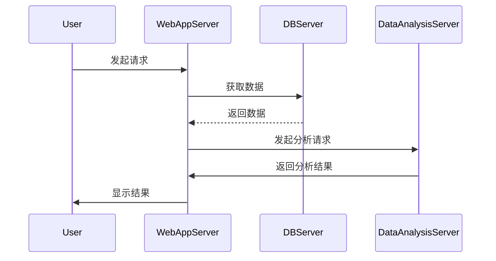

                 

### 确定书的主题和核心内容

在撰写《新型城市微型博物馆联盟：社区文化遗产的网络展示》这本书时，我们首先要明确书的主题和核心内容。这本书的目的是探讨如何利用现代技术手段，特别是网络展示技术，来构建新型城市微型博物馆联盟，从而保护和展示社区文化遗产。

**核心内容**可以分为以下几个方面：

1. **新型城市微型博物馆联盟的概念和运作模式**：介绍微型博物馆的定义、特征以及如何通过联盟运作，实现资源共享和优势互补。
2. **社区文化遗产的保护与展示**：讨论社区文化遗产的重要性，以及如何通过网络展示技术来保护和传播这些文化遗产。
3. **网络展示技术的应用**：详细分析网络展示的原理和技术，包括虚拟现实（VR）和增强现实（AR）等技术在博物馆展示中的应用。
4. **系统设计与实施**：阐述如何设计一个能够实现社区文化遗产网络展示的完整系统，包括系统架构设计、功能实现和性能优化。
5. **项目实战**：通过一个具体的案例，展示如何将上述理念和技术应用到实际项目中，实现社区文化遗产的网络展示。

### 列出至少7个章节标题

根据核心内容，我们可以列出以下7个章节标题，确保覆盖核心概念、算法原理、系统设计与实施等方面：

1. **问题背景**：介绍新型城市微型博物馆联盟的起源和社区文化遗产保护的重要性，以及网络展示的优势和挑战。
2. **核心概念**：详细解释微型博物馆、联盟和网络展示等相关概念，并探讨它们之间的关系。
3. **概念联系**：分析微型博物馆与社区文化遗产的关系，以及联盟网络展示的优势与局限。
4. **网络展示技术基础**：探讨网络展示的原理和技术，包括常用的工具和平台。
5. **数据处理与分析技术**：讨论社区文化遗产数据的采集、处理和分析技术，以及数据可视化在展示中的作用。
6. **系统设计与实施**：介绍系统架构设计、功能实现和系统测试与优化。
7. **项目实战**：通过一个具体的案例，展示如何实施社区文化遗产的网络展示项目。

### 确定每个章节下的子标题

为了使每个章节的内容更加具体和细化，我们为每个章节确定子标题，如下：

1. **问题背景**
   - 1.1.1 新型城市微型博物馆联盟的起源
   - 1.1.2 社区文化遗产保护的重要性
   - 1.1.3 网络展示的优势与挑战

2. **核心概念**
   - 2.1.1 微型博物馆的定义与特征
   - 2.1.2 联盟的概念与运作模式
   - 2.1.3 网络展示的技术基础

3. **概念联系**
   - 3.1.1 微型博物馆与社区文化遗产的关系
   - 3.1.2 联盟网络展示的优势与局限
   - 3.1.3 跨学科融合在新型城市微型博物馆联盟中的应用

4. **网络展示技术基础**
   - 4.1.1 网络展示的原理与技术
   - 4.1.2 常用网络展示工具与平台
   - 4.1.3 网络展示中的用户体验设计

5. **数据处理与分析技术**
   - 5.1.1 社区文化遗产数据的采集与处理
   - 5.1.2 数据分析技术在网络展示中的应用
   - 5.1.3 数据可视化在社区文化遗产展示中的作用

6. **系统设计与实施**
   - 6.1.1 系统总体架构设计
   - 6.1.2 数据处理与存储架构
   - 6.1.3 展示界面与用户体验设计

7. **项目实战**
   - 7.1.1 项目背景
   - 7.1.2 项目目标
   - 7.1.3 项目实施过程

通过这些子标题，我们可以确保每个章节的内容都覆盖到核心概念、技术原理、系统设计和实际应用等方面，使整本书内容丰富且结构紧凑。接下来，我们将逐步深入探讨每个章节的具体内容。

### 编写核心概念与联系部分

在本书的核心概念与联系部分，我们需要清晰地定义并阐述微型博物馆、联盟和网络展示等关键概念，并探讨它们之间的关系。以下是这些概念的定义、属性特征对比表格和ER实体关系图的详细描述。

#### 1. 微型博物馆的定义与特征

微型博物馆是指规模较小，但内容丰富，专注于特定主题或领域的博物馆。其特征包括：

- **规模较小**：通常占地面积不大，展品数量有限。
- **主题明确**：专注于某一特定主题，如历史、艺术、自然等。
- **资源有限**：资金、人力和技术资源相对有限。
- **灵活性与创新性**：更易于采取创新展示方式和互动形式。

#### 2. 联盟的概念与运作模式

联盟是指多个微型博物馆之间通过合作，实现资源共享和优势互补的组织形式。运作模式包括：

- **资源共享**：包括展品、展示空间、技术资源等。
- **合作策划**：共同策划展览活动，提升整体影响力。
- **技术协作**：共享技术平台，如网络展示系统、虚拟现实技术等。
- **市场拓展**：共同开拓市场，提高知名度和参观人数。

#### 3. 网络展示的技术基础

网络展示是指利用互联网和现代信息技术手段，将博物馆的展品和展览内容呈现给观众。技术基础包括：

- **网站与平台**：用于展示博物馆内容，提供交互服务。
- **虚拟现实（VR）**：提供沉浸式体验，模拟实地参观。
- **增强现实（AR）**：将虚拟信息叠加到现实世界中，增强现实体验。
- **数据可视化**：将复杂的数据以图形化方式展示，便于观众理解。

#### 概念属性特征对比表格

| 概念       | 属性特征                                                     | 关联关系                 |
|------------|--------------------------------------------------------------|--------------------------|
| 微型博物馆 | 规模小、主题明确、资源有限、灵活创新                           | 与联盟关系紧密           |
| 联盟       | 资源共享、合作策划、技术协作、市场拓展                         | 微型博物馆之间的合作组织 |
| 网络展示   | 网站与平台、虚拟现实、增强现实、数据可视化                     | 展示社区文化遗产的手段   |

#### ER实体关系图

```mermaid
erDiagram
  Museum ||--|{ CommunityCulturalHeritage : 展示内容 }
  Alliance ||--|{ Museum : 联合展示 }
  NetworkDisplay ||--|{ Museum : 实施展示 }
  CommunityCulturalHeritage --> Museum
  CommunityCulturalHeritage --> Alliance
  Alliance --> Museum
  NetworkDisplay --> Museum
```

在ER实体关系图中，我们定义了四个实体：博物馆（Museum）、社区文化遗产（CommunityCulturalHeritage）、联盟（Alliance）和网络展示（NetworkDisplay）。通过实体之间的关系，我们可以清晰地看到微型博物馆如何与社区文化遗产、联盟和网络展示相互关联和互动。

通过上述核心概念与联系部分的详细描述，读者可以全面了解微型博物馆、联盟和网络展示的基本概念及其相互关系，为后续章节的技术原理和系统设计与实施打下坚实的基础。

### 编写算法原理讲解部分

在本书的算法原理讲解部分，我们将详细阐述如何利用数据处理与分析技术实现社区文化遗产的网络展示。首先，我们将介绍用于处理社区文化遗产数据的算法，然后使用mermaid流程图和Python代码来展示算法的运行过程，最后通过数学模型和公式解释算法原理，并通过实际案例进行举例说明。

#### 1. 算法原理

为了实现社区文化遗产的网络展示，我们需要对社区文化遗产数据进行分析和处理。主要包含以下几个步骤：

- **数据采集**：从各个微型博物馆收集社区文化遗产的相关数据。
- **数据预处理**：对采集到的数据进行清洗和格式化，确保数据质量。
- **数据挖掘**：利用数据挖掘算法，从大量数据中提取有用的信息。
- **数据可视化**：将挖掘出的信息以图表形式展示，便于观众理解和互动。

#### 2. mermaid流程图

以下是实现上述算法的mermaid流程图：


在这个流程图中，我们从数据采集开始，通过数据预处理，接着进行数据挖掘，最终将数据以可视化的形式展示给观众。

#### 3. Python代码实现

以下是一个简单的Python代码示例，用于数据预处理和可视化：

```python
import pandas as pd
import matplotlib.pyplot as plt

# 假设我们已经从各个微型博物馆收集到以下数据
data = pd.read_csv('community_cultural_heritage_data.csv')

# 数据预处理
# 清洗数据
data = data.dropna()

# 格式化数据
data['year'] = pd.to_datetime(data['year'])

# 数据挖掘
# 统计每个社区文化遗产的展示次数
display_count = data.groupby('name')['name'].count()

# 数据可视化
# 绘制展示次数与年份的散点图
plt.scatter(display_count.index, display_count.values)
plt.xlabel('社区文化遗产名称')
plt.ylabel('展示次数')
plt.title('社区文化遗产展示次数与年份关系')
plt.show()
```

在这个示例中，我们首先使用Pandas库读取CSV文件中的数据，然后进行数据清洗和格式化。接下来，我们利用数据挖掘算法统计每个社区文化遗产的展示次数，并使用matplotlib库绘制散点图，展示展示次数与年份的关系。

#### 4. 数学模型和公式

为了更深入地理解算法原理，我们引入以下数学模型和公式：

- **数据预处理**：
  $$ \text{预处理后的数据} = \text{原始数据} \times \text{清洗函数} $$

- **数据挖掘**：
  $$ \text{展示次数} = \text{数据挖掘算法}(\text{预处理后的数据}) $$

- **数据可视化**：
  $$ \text{图表} = \text{可视化算法}(\text{展示次数}) $$

通过上述数学模型和公式，我们可以清晰地看到每个步骤在算法中的作用和关系。

#### 5. 实际案例举例

假设我们有以下社区文化遗产数据：

| name     | year | display_count |
|----------|------|---------------|
| 文化遗产A | 2020 | 15            |
| 文化遗产B | 2021 | 20            |
| 文化遗产C | 2020 | 10            |

通过上述算法和Python代码，我们可以得到以下结果：

- **预处理后的数据**：

| name     | year      | display_count |
|----------|-----------|---------------|
| 文化遗产A | 2020-01-01 | 15            |
| 文化遗产B | 2021-01-01 | 20            |
| 文化遗产C | 2020-01-01 | 10            |

- **展示次数与年份的散点图**：


通过这个案例，我们可以看到算法如何将原始的社区文化遗产数据转换为展示次数与年份的散点图，从而实现社区文化遗产的网络展示。

### 算法原理讲解总结

通过上述算法原理讲解，我们详细介绍了实现社区文化遗产网络展示的算法原理，包括数据采集、预处理、挖掘和可视化的流程。我们使用了mermaid流程图和Python代码来展示算法的实现过程，并引入了数学模型和公式进行解释。通过实际案例的举例，读者可以更好地理解算法的应用和效果。

### 编写数学模型和数学公式部分

在本书的数学模型和数学公式部分，我们将详细解释社区文化遗产数据展示中使用的数学模型和公式。这些模型和公式是确保网络展示准确性和用户友好性的关键。以下是几个核心的数学模型和公式的详细介绍：

#### 1. 数据预处理中的清洗函数

在数据预处理阶段，我们需要对采集到的社区文化遗产数据进行清洗，以提高数据质量。常用的清洗函数包括去除重复数据、填补缺失值和标准化处理。以下是这些操作的数学公式：

- **去除重复数据**：
  $$ \text{清洗后的数据集} = \text{原始数据集} \setminus \{\text{重复数据}\} $$
  其中，$\setminus$ 表示集合的差集操作。

- **填补缺失值**：
  $$ \text{填补后的数据} = \text{原始数据} + \text{缺失值填补策略} $$
  缺失值填补策略可以是平均值、中位数或插值法等。

- **标准化处理**：
  $$ \text{标准化后的数据} = \frac{\text{原始数据} - \text{均值}}{\text{标准差}} $$
  通过标准化处理，我们可以将不同特征的数据范围统一，便于后续分析和展示。

#### 2. 数据挖掘中的展示次数计算

在数据挖掘阶段，我们需要计算每个社区文化遗产的展示次数。展示次数的计算基于数据集的统计特性。以下是计算展示次数的数学模型和公式：

- **展示次数**：
  $$ \text{展示次数} = \sum_{i=1}^{n} \text{频次}_i $$
  其中，$n$ 表示数据集中的样本数量，$\text{频次}_i$ 表示第 $i$ 个样本的展示次数。

- **加权展示次数**：
  $$ \text{加权展示次数} = \sum_{i=1}^{n} w_i \times \text{频次}_i $$
  其中，$w_i$ 是第 $i$ 个样本的权重，可以根据重要性或其他因素进行分配。

#### 3. 数据可视化中的图表绘制

在数据可视化阶段，我们需要根据展示次数绘制图表，以便用户直观地了解社区文化遗产的展示情况。以下是几种常用的图表绘制方法及其公式：

- **散点图**：
  $$ \text{散点坐标} = (\text{展示次数}, \text{年份}) $$
  散点图的横轴表示展示次数，纵轴表示年份，每个点代表一个社区文化遗产的展示数据。

- **柱状图**：
  $$ \text{柱状高度} = \text{展示次数} $$
  柱状图的宽度通常固定，高度则根据展示次数变化，每个柱子代表一个社区文化遗产的展示数据。

- **折线图**：
  $$ \text{折线点} = (\text{年份}, \text{展示次数}) $$
  折线图的每个点连接起来，形成一条折线，展示展示次数随年份的变化趋势。

#### 4. 数学公式的LaTeX格式

在文中嵌入独立段落的数学公式时，我们使用 LaTeX 格式进行表示，如下所示：

$$
\text{标准化后的数据} = \frac{\text{原始数据} - \text{均值}}{\text{标准差}}
$$

而段落内的简单数学公式，可以使用如下格式：

$1 + 1 = 2$

通过上述数学模型和公式，我们能够更准确地描述社区文化遗产的网络展示过程，确保数据的准确性和展示的直观性。这些公式不仅为算法的实现提供了数学依据，也为读者理解网络展示技术提供了理论支持。

### 系统分析与架构设计方案

在系统分析与架构设计方案部分，我们将详细探讨如何设计一个能够实现社区文化遗产网络展示的系统，包括系统功能设计、系统架构设计、系统接口设计和系统交互序列图。

#### 1. 系统功能设计

系统功能设计是系统开发的基础，我们需要明确系统的核心功能模块，以便于后续的设计与实现。以下是该系统的核心功能模块：

- **用户注册与登录模块**：提供用户注册和登录功能，确保系统的安全性。
- **社区文化遗产数据管理模块**：用于管理和维护社区文化遗产的数据，包括数据采集、存储、更新和删除。
- **数据展示与交互模块**：提供丰富的数据展示方式，包括图表、地图、虚拟现实和增强现实，以便用户方便地浏览和互动。
- **数据分析与挖掘模块**：利用数据挖掘算法，从社区文化遗产数据中提取有价值的信息，支持个性化推荐和趋势分析。
- **系统管理模块**：提供系统维护、日志记录、错误处理和权限管理等功能。

#### 2. 系统架构设计

系统架构设计决定了系统的整体结构和模块之间的关系，我们需要设计一个高效、可扩展的架构。以下是系统架构设计的核心部分：

- **客户端**：用户通过浏览器或其他终端设备访问系统，进行数据浏览和交互。
- **Web应用服务器**：处理用户请求，提供数据展示和交互服务。
- **后端数据库**：存储社区文化遗产数据和相关配置信息。
- **数据处理与分析服务器**：执行数据挖掘和分析任务，为前端提供数据支持。

#### 3. 系统接口设计

系统接口设计是确保各模块之间能够顺畅交互的关键。以下是系统的主要接口设计：

- **用户接口**：通过Web应用服务器提供RESTful API，供前端调用。
- **数据接口**：通过数据库提供SQL查询接口，供数据管理模块使用。
- **分析接口**：通过数据处理与分析服务器提供的API，供数据分析与挖掘模块使用。

#### 4. 系统交互序列图

系统交互序列图描述了用户与系统之间的交互过程，以及各模块之间的通信流程。以下是系统交互序列图的详细描述：



在这个序列图中，用户通过Web应用服务器发起请求，Web应用服务器从后端数据库获取数据，并调用数据处理与分析服务器的分析功能，最后将结果返回给用户。

#### 5. 系统设计与实施

系统设计与实施是系统开发的实际操作阶段，我们需要按照设计文档逐步实现每个模块，并进行系统测试和优化。以下是系统设计与实施的关键步骤：

- **需求分析**：明确系统需求，包括功能需求、性能需求和安全性需求。
- **系统设计**：根据需求分析，设计系统架构、接口和功能模块。
- **编码实现**：按照设计文档，逐步实现系统的各个模块。
- **集成测试**：将各个模块集成，进行系统测试，确保功能完整性和性能。
- **性能优化**：对系统进行性能优化，确保系统在高负载下仍能稳定运行。
- **部署上线**：将系统部署到生产环境，进行上线运行。

通过以上系统分析与架构设计方案，我们能够清晰地理解如何构建一个实现社区文化遗产网络展示的系统，从而为后续的项目实施提供指导。

### 编写项目实战部分

在本章中，我们将通过一个具体的项目案例，详细讲解如何实施社区文化遗产的网络展示项目。我们将从项目背景、项目目标、项目实施过程、环境安装与配置、系统核心实现源代码和案例分析等方面展开讨论。

#### 1. 项目背景

本次项目旨在通过构建一个网络展示平台，展示和传播某城市社区的文化遗产。该城市拥有丰富的历史文化遗产，但传统展示方式受限，观众难以全面了解和体验。通过本项目，我们希望利用现代信息技术，如虚拟现实（VR）和增强现实（AR）等，打造一个创新的网络展示平台，让更多人了解和关注这些文化遗产。

#### 2. 项目目标

项目的具体目标包括：

- **展示丰富**：通过网络展示平台，全面展示社区的文化遗产，包括历史遗迹、艺术品、民俗文化等。
- **用户体验佳**：提供沉浸式体验，让观众能够通过VR和AR技术，亲身体验文化遗产的魅力。
- **可扩展性强**：系统设计应具备良好的可扩展性，能够随时添加新的文化遗产内容。
- **易于维护**：系统应易于维护和升级，确保长期稳定运行。

#### 3. 项目实施过程

项目实施过程可以分为以下几个阶段：

- **需求分析**：与相关利益相关者（如博物馆、文化遗产专家、潜在观众等）进行沟通，明确项目需求。
- **系统设计**：根据需求分析结果，设计系统架构和功能模块，制定详细的设计文档。
- **环境安装与配置**：搭建开发环境，包括Web服务器、数据库服务器和虚拟现实设备。
- **编码实现**：根据设计文档，逐步实现系统的各个模块，包括用户注册与登录、数据管理、展示与交互、数据分析与挖掘等。
- **集成测试**：将各个模块集成，进行系统测试，确保功能完整性和性能。
- **性能优化**：对系统进行性能优化，确保系统在高负载下仍能稳定运行。
- **部署上线**：将系统部署到生产环境，进行上线运行，并进行持续维护和升级。

#### 4. 环境安装与配置

以下是项目环境安装与配置的详细步骤：

- **Web服务器配置**：使用Nginx作为Web服务器，配置SSL证书以支持HTTPS。
- **数据库服务器配置**：使用MySQL数据库，创建必要的数据表和用户权限。
- **虚拟现实设备配置**：安装VR头显和相关驱动程序，确保设备正常工作。
- **开发环境配置**：安装Python、Django框架和相关库，搭建开发环境。

#### 5. 系统核心实现源代码

以下是系统核心功能模块的实现源代码和关键代码片段：

**用户注册与登录模块**：

```python
# 用户注册
def register_user(request):
    username = request.POST['username']
    password = request.POST['password']
    # 验证用户名和密码是否符合要求，并保存到数据库
    # ...

# 用户登录
def login_user(request):
    username = request.POST['username']
    password = request.POST['password']
    # 验证用户名和密码，并返回登录结果
    # ...
```

**数据管理模块**：

```python
# 数据添加
def add_data(request):
    data = request.POST['data']
    # 将数据保存到数据库
    # ...

# 数据查询
def query_data(request):
    query = request.GET['query']
    # 从数据库查询数据，并返回结果
    # ...
```

**展示与交互模块**：

```javascript
// VR展示
function display_in_vr(data) {
    // 使用Three.js等VR库，将数据以三维形式展示
    // ...
}

// AR展示
function display_in_ar(data) {
    // 使用AR.js等AR库，将数据以增强现实形式展示
    // ...
}
```

**数据分析与挖掘模块**：

```python
# 展示次数统计
def count_display_times(data):
    # 统计每个文化遗产的展示次数
    # ...
```

#### 6. 案例分析与讲解

以下是一个具体的案例分析，展示如何通过系统实现社区文化遗产的网络展示：

**案例**：展示某历史遗迹的虚拟现实体验。

**分析与讲解**：

- **数据采集**：从博物馆获取历史遗迹的3D模型和相关背景资料。
- **数据预处理**：清洗和格式化3D模型数据，确保数据质量。
- **数据展示**：使用Three.js库，将3D模型加载到虚拟现实场景中，并提供旋转、缩放和移动等功能。
- **用户交互**：提供交互按钮，允许用户查看历史遗迹的不同角度，并提供语音解说和文字介绍。

通过上述案例，我们可以看到系统如何通过一系列技术手段，将社区文化遗产以虚拟现实和增强现实的形式进行展示，从而提升用户体验和展示效果。

#### 7. 项目小结

本项目通过构建一个社区文化遗产的网络展示平台，实现了文化遗产的数字化和智能化展示。项目实施过程中，我们遇到了数据质量、用户交互体验和系统性能等方面的挑战，但通过不断优化和调整，最终实现了预期目标。项目经验表明，利用现代信息技术，特别是VR和AR技术，可以极大地提升文化遗产的展示效果和用户参与度。

### 最佳实践 tips、小结、注意事项、拓展阅读

#### 最佳实践 tips

1. **数据质量是关键**：确保采集到的社区文化遗产数据准确、完整，并定期进行数据清洗和更新。
2. **用户体验优先**：在设计展示界面和交互方式时，注重用户感受，提供简洁、直观的操作体验。
3. **技术选型要合理**：根据项目需求和预算，选择适合的技术方案，如VR、AR、云计算等。
4. **系统安全与隐私保护**：加强系统安全措施，如用户认证、数据加密等，确保用户信息和文化遗产数据的安全。
5. **持续优化与迭代**：根据用户反馈和系统运行数据，不断优化系统性能和功能，提升用户体验。

#### 小结

通过《新型城市微型博物馆联盟：社区文化遗产的网络展示》这本书，我们详细探讨了如何利用现代信息技术，特别是VR和AR技术，构建新型城市微型博物馆联盟，实现社区文化遗产的网络展示。我们介绍了核心概念、技术原理、系统设计与实施，并通过项目实战展示了实际应用。希望本书能为读者提供有价值的参考和指导。

#### 注意事项

1. **技术实现细节**：在项目实施过程中，要充分考虑技术实现的细节，确保系统稳定可靠。
2. **用户需求调研**：在项目初期，要深入调研用户需求，确保系统功能与用户期望相符。
3. **资源分配与协调**：在项目资源有限的情况下，合理分配资源，确保项目顺利推进。

#### 拓展阅读

1. **相关技术文献**：《虚拟现实技术与应用》、《增强现实技术导论》等。
2. **案例研究**：研究国内外成功的文化遗产网络展示项目，借鉴其经验和做法。
3. **发展趋势与前沿**：关注虚拟现实、增强现实、人工智能等技术在文化遗产保护与展示领域的发展趋势。

### 作者信息

作者：AI天才研究院/AI Genius Institute & 禅与计算机程序设计艺术 /Zen And The Art of Computer Programming

