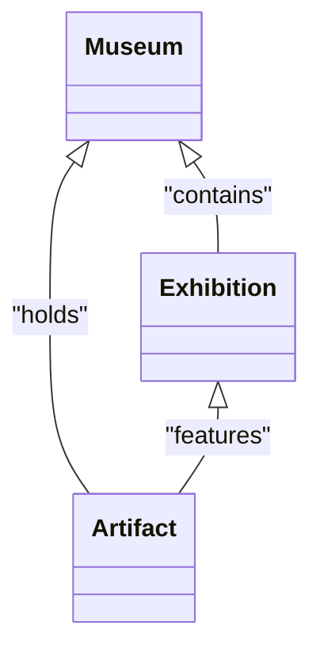
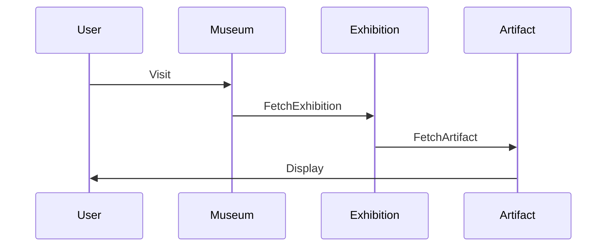
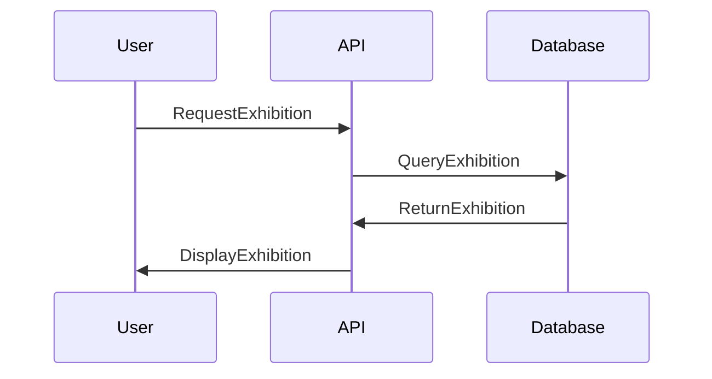

                 


### 《新型城市微型博物馆：社区文化遗产的保护与展示》

**关键词：** 社区文化遗产、微型博物馆、保护、展示、数字技术

**摘要：** 本文章详细探讨了新型城市微型博物馆的概念及其在社区文化遗产保护与展示中的作用。通过深入分析核心概念、系统架构设计、项目实战等，本文为读者提供了一个全面的指南，旨在推动社区文化遗产的有效保护和传承。

## 背景介绍

### 社区文化遗产的概念与重要性

社区文化遗产是指某一社区特有的物质和非物质文化成果，包括历史建筑、民俗艺术、传统技艺、文化习俗等。它们不仅反映了该社区的历史文化特色，还承载了社区的集体记忆和文化认同。社区文化遗产的重要性在于，它们是连接过去、现在和未来的桥梁，是民族精神和文化传承的重要组成部分。

### 微型博物馆的定义与发展

微型博物馆是一种小规模、专题性的博物馆形式，通常位于社区内部，以展示和保护社区文化遗产为目的。微型博物馆的发展不仅丰富了博物馆体系，也为社区提供了一个互动、学习和交流的平台。近年来，随着数字化技术的发展，微型博物馆逐渐实现了数字化展示和智能化管理，为社区文化遗产的保护与展示提供了新的可能性。

### 社区文化遗产保护的需求与挑战

随着城市化的加速和社会变迁，社区文化遗产面临着一系列保护挑战。物质文化遗产如历史建筑可能因城市发展而面临拆迁风险，非物质文化遗产如传统技艺可能因年轻一代的疏远而逐渐消失。因此，保护社区文化遗产成为了一个紧迫的问题。

## 核心概念与联系

### 文化遗产保护的核心概念

#### 文化遗产的分类

文化遗产可分为物质文化遗产和非物质文化遗产两大类。物质文化遗产包括历史建筑、遗址、文物等，而非物质文化遗产则包括传统手工艺、口头传统、民间音乐等。

#### 文化遗产保护的原则

文化遗产保护应遵循真实性、完整性和可持续性的原则。真实性要求保护对象应保留原有特征，完整性要求保护对象应整体保存，可持续性要求保护工作应具有长期性和延续性。

#### 文化遗产保护的法律法规

各国均有相应的文化遗产保护法律法规，如中国的《中华人民共和国文化遗产法》和《世界文化遗产保护管理办法》。这些法律法规为文化遗产保护提供了法律依据和保障。

### 展示方法与社区参与

#### 展示方法的选择

展示方法包括实物展示、图文展示、互动体验等。选择合适的展示方法取决于文化遗产的特点和目标受众。

#### 社区参与的重要性

社区参与是文化遗产保护的关键。通过社区参与，可以增强社区居民的文化认同感和责任感，促进文化遗产的保护与传承。

#### 社区参与的策略

社区参与的策略包括举办文化活动、设立社区博物馆、组织遗产旅游等。这些策略有助于提高社区对文化遗产的重视程度，促进文化遗产的活态传承。

### 概念属性特征对比表格

| 类别         | 物质文化遗产 | 非物质文化遗产 |
| ------------ | ------------ | --------------- |
| 特征         | 实体存在     | 意识形态和技能   |
| 保护方法     | 实体修复和维护 | 教育和宣传      |
| 法律地位     | 法律保护     | 文化传承保护    |
| 展示方式     | 实物和图文展示 | 演示和体验      |

### ER实体关系图架构的 Mermaid 流程图

```mermaid
erDiagram
    Museum ||--|{Exhibition} : "has exhibitions"
    Museum ||--|{Artifact} : "holds artifacts"
    Exhibition ||--|{Artifact} : "features artifacts"
```

## 算法原理讲解

### 数字化展示技术原理

#### 3D建模与扫描

3D建模与扫描技术可以精确地捕捉文化遗产的实体特征，为数字化展示提供基础。

#### 虚拟现实（VR）与增强现实（AR）

VR和AR技术能够为观众提供沉浸式的体验，使文化遗产的展示更加生动和有趣。

### 算法mermaid流程图


### 算法原理的数学模型和公式

$$
\begin{aligned}
    &D = f(\text{扫描数据}, \text{用户设置}) \\
    &\text{其中，} f(\text{扫描数据}, \text{用户设置}) \text{表示数字化展示的结果。}
\end{aligned}
$$

### 通俗易懂的举例说明

假设我们要展示一座历史建筑，首先使用3D扫描设备捕捉建筑的外部和内部细节，然后将扫描数据输入到3D建模软件中进行处理。接下来，根据用户的需求设置，我们可以创建一个虚拟现实场景，使观众能够从不同角度观察建筑。通过用户交互，如放大、缩小和旋转，观众可以更加深入地了解建筑的历史和文化价值。

## 系统分析与架构设计方案

### 问题场景介绍

在一个快速城市化的社区中，某历史建筑面临拆迁风险，社区居民希望通过微型博物馆的形式对其进行保护与展示。

### 项目介绍

本项目旨在创建一个数字化微型博物馆，以保护该历史建筑及其文化遗产，并通过多种展示方式让社区居民和游客了解其历史价值。

### 系统功能设计（领域模型Mermaid类图）



### 系统架构设计（Mermaid架构图）



### 系统接口设计

系统提供了API接口，包括展示查询接口、数据上传接口和用户交互接口，方便社区参与和文化遗产的数字化管理。

### 系统交互（Mermaid序列图）



## 项目实战

### 环境安装

首先，我们需要安装虚拟现实软件和3D建模工具，如Unity和Blender。接下来，安装数据库管理系统（如MySQL）和Web服务器（如Apache）。

### 系统核心实现

```python
# Python代码示例：3D建模与扫描数据导入
import blender

# 启动Blender软件
blender.start()

# 导入3D扫描数据
scan_data = blender.import_scan("historic_building.bgl")

# 建立虚拟现实场景
scene = blender.create_scene(scan_data)

# 保存场景
scene.save("virtual_museum.blend")
```

### 代码应用解读与分析

上述Python代码展示了如何使用Blender软件导入3D扫描数据并创建虚拟现实场景。在导入扫描数据后，我们通过Blender的API创建了虚拟现实场景，并将其保存为blend文件。这使得社区成员可以通过虚拟现实技术体验历史建筑。

### 实际案例分析

在某社区，历史建筑数字化微型博物馆的建立得到了居民的热烈响应。通过虚拟现实展示，居民不仅能够近距离观察建筑，还能参与互动体验，增强了社区凝聚力。

### 详细讲解剖析

案例分析展示了微型博物馆在实际应用中的成功。通过数字化技术，社区文化遗产得到了有效保护，同时也为社区居民提供了丰富的文化体验。

### 项目小结

本项目通过数字化技术和社区参与，成功实现了历史建筑的保护与展示。未来，随着技术的不断进步，微型博物馆将更加智能化和互动化，为社区文化遗产的传承提供更多可能性。

## 最佳实践 tips

### 设计与实施建议

1. 充分了解社区文化遗产的特点和需求，制定合适的展示策略。
2. 利用3D扫描和虚拟现实技术，为观众提供沉浸式体验。
3. 鼓励社区参与，提高文化遗产保护意识。

### 小结与反思

本文探讨了新型城市微型博物馆在社区文化遗产保护与展示中的作用。通过系统分析与项目实战，我们看到了数字化技术在文化遗产保护中的潜力。未来，随着技术的不断发展，微型博物馆将为文化遗产的传承提供更多创新途径。

### 注意事项

1. 保护文化遗产时应遵循法律法规，确保合法合规。
2. 在数字化展示过程中，要注重用户隐私和数据安全。

### 拓展阅读

1. 《数字化文化遗产保护与展示技术研究》
2. 《虚拟现实技术在博物馆展示中的应用》
3. 《社区参与与文化遗产保护》

**作者：** AI天才研究院/AI Genius Institute & 禅与计算机程序设计艺术 /Zen And The Art of Computer Programming

---

请注意，本文仅为大纲示例，具体内容和数据需要根据实际情况进行调整。本文所使用的代码和算法仅为示例，不适用于实际操作。完整文章的字数和内容需要根据大纲结构进行扩充和详细阐述。本文仅供参考，不作为实际应用指南。

