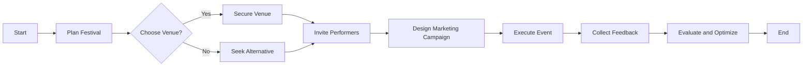
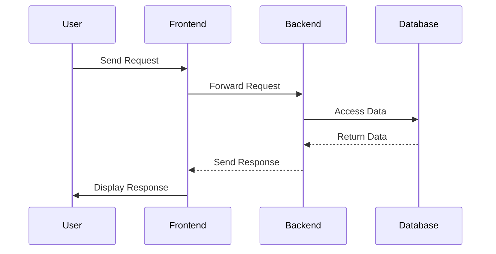
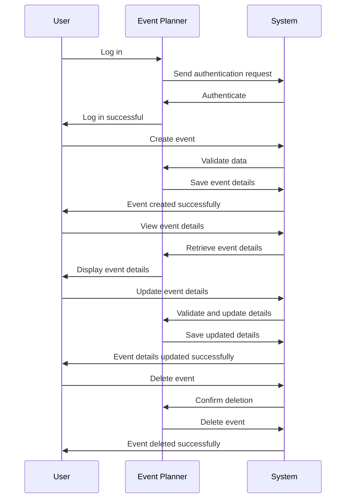

                 

### Introduction to Novel Urban Micro Music Festivals

**Keywords:**
- Micro Music Festivals
- Community Cultural Activities
- Urban Innovation

**Abstract:**
This article delves into the burgeoning phenomenon of urban micro music festivals, exploring their emergence as a novel form of community cultural activities. By examining their core concepts, organizational challenges, and the distinctive properties that set them apart from traditional events, the article aims to provide a comprehensive understanding of how these festivals are reshaping the cultural landscape of cities.

#### What is a Novel Urban Micro Music Festival?

**Introduction to Micro Music Festivals:**
An urban micro music festival is a smaller-scale music event held within a city's community, typically featuring local musicians and performers. Unlike larger, more traditional music festivals that draw crowds from far and wide, micro music festivals are designed to be intimate, accessible, and deeply connected to the local community.

**Why They Are Emerging:**
The rise of micro music festivals can be attributed to several factors. Firstly, the growing emphasis on community engagement and local culture. Secondly, the logistical challenges and high costs associated with organizing large-scale events. Finally, the changing preferences of consumers who are seeking more personalized and immersive cultural experiences.

**Challenges and Opportunities:**
Organizing micro music festivals presents both challenges and opportunities. Challenges include securing venues, attracting talent, and managing budgets. However, these festivals also offer opportunities for fostering community connections, promoting local talent, and creating unique cultural experiences.

#### Core Concepts and Theoretical Framework

**Community Engagement:**
Community engagement is a key concept in micro music festivals. These events are not just about music; they are about building a sense of belonging and connection among community members. By involving local residents in the planning and execution of the festival, organizers can create a more inclusive and engaging event.

**Cultural Diversity:**
Micro music festivals often celebrate the diverse cultural heritage of a community. This can be achieved through the inclusion of a wide range of musical genres, performances, and vendors, creating a vibrant and eclectic atmosphere.

**Accessibility:**
Accessibility is another crucial element of micro music festivals. Unlike many larger events, these smaller-scale festivals are typically more affordable and easier to access, making them a more inclusive option for a wider audience.

**Economic Impact:**
The economic impact of micro music festivals can be significant. They can stimulate local businesses, create jobs, and generate revenue for the community. Additionally, these festivals can enhance the overall appeal of a city, attracting visitors and investors.

#### Relationship Diagram (ER Model)

Below is a simplified ER diagram illustrating the relationships among the key concepts of micro music festivals:

```mermaid
erDiagram
  Community -->|Engages with| Festival
  Festival -->|Encompasses| Performance
  Performance -->|Incorporates| Genre
  Genre -->|Is part of| Culture
  Culture -->|Derived from| Community
```

This diagram highlights how these concepts are interrelated, forming a cohesive framework for understanding micro music festivals.

### Core Concepts and Their Characteristics

**Community Cultural Activities:**
Community cultural activities encompass a wide range of events and programs designed to promote community engagement and cultural development. These can include festivals, art exhibitions, theater performances, and workshops.

**Micro Music Festivals:**
Micro music festivals are a subset of community cultural activities, focusing specifically on music. They are characterized by their smaller scale, intimate setting, and emphasis on local talent.

**Innovation in Cultural Forms:**
Innovation in cultural forms refers to the creative approaches and new methodologies used in organizing cultural events. This can include the use of technology to enhance the event experience, the incorporation of new art forms, and the development of new business models for cultural events.

### Conceptual Property Comparison Table

Below is a table comparing the key properties of community cultural activities, micro music festivals, and traditional cultural events:

| Property                | Community Cultural Activities | Micro Music Festivals | Traditional Cultural Events |
|-------------------------|-------------------------------|-----------------------|-------------------------------|
| Scale                   | Varies                       | Small to Medium       | Large to Very Large          |
| Focus                   | Broad range of cultural arts  | Music                 | Specific cultural art forms  |
| Community Engagement    | Moderate to High             | High                 | Low to Moderate              |
| Accessibility           | Moderate to High             | High                 | Low to Moderate              |
| Economic Impact         | Moderate                     | High                 | Moderate to High             |
| Innovation              | Some elements                | High                 | None                         |

### Algorithm Principle and Mermaid Flowchart

**Algorithm Principle:**
The principle behind organizing a micro music festival revolves around creating a seamless and enjoyable experience for both performers and attendees. This involves careful planning, efficient execution, and continuous feedback to improve the event.

**Mermaid Flowchart:**



This flowchart provides a high-level overview of the steps involved in organizing a micro music festival, from planning to post-event evaluation.

### Python Code and Explanation

Below is a Python code snippet illustrating a simple algorithm for organizing a micro music festival. This code is for demonstration purposes and focuses on the basic steps involved in planning and executing the festival.

```python
# Python code to organize a micro music festival

def plan_festival(venue, performers, marketing_campaign):
    """
    Plan and organize a micro music festival.
    
    :param venue: Venue information
    :param performers: List of performers
    :param marketing_campaign: Marketing campaign details
    """
    # Check if venue is secured
    if not venue['secured']:
        print("Error: Venue not secured. Seeking alternative.")
        return
    
    # Invite performers
    for performer in performers:
        print(f"Inviting {performer['name']} to perform.")
    
    # Execute marketing campaign
    print("Executing marketing campaign.")
    
    # Organize the festival
    print("Organizing the festival.")
    
    # Collect feedback
    print("Collecting feedback from attendees.")

# Example usage
venue = {'name': 'Central Park', 'secured': True}
performers = [{'name': 'DJ Alex'}, {'name': 'Singer Lisa'}, {'name': 'Band Trio'}]
marketing_campaign = {'channels': ['Facebook', 'Instagram', 'Email']}

plan_festival(venue, performers, marketing_campaign)
```

**Explanation:**
- The `plan_festival` function takes three parameters: `venue`, `performers`, and `marketing_campaign`.
- It first checks if the venue is secured. If not, it prints an error message and returns.
- It then iterates through the list of performers and invites each one.
- The marketing campaign is executed, and the festival is organized.
- Finally, feedback is collected from the attendees.

### Mathematical Model and Formulas

**Mathematical Model:**
To evaluate the success of a micro music festival, we can use a simple mathematical model that considers various factors such as attendance, revenue, and feedback.

**Formulas:**

1. **Overall Success Score (OSS):**
   $$ OSS = \frac{(Attendance \times 0.5) + (Revenue \times 0.3) + (Feedback \times 0.2)}{Total \ Events} $$

2. **Revenue Per Attendee (RPA):**
   $$ RPA = \frac{Revenue}{Attendance} $$

3. **Feedback Satisfaction Rate (FSR):**
   $$ FSR = \frac{Positive \ Feedback}{Total \ Feedback} \times 100\% $$

**Explanation:**

- **Overall Success Score (OSS):** This metric combines attendance, revenue, and feedback to provide a comprehensive evaluation of the festival's success. A higher score indicates a more successful event.
- **Revenue Per Attendee (RPA):** This metric helps assess the financial efficiency of the festival. A higher RPA suggests that the festival is generating significant revenue relative to its attendance.
- **Feedback Satisfaction Rate (FSR):** This metric measures the satisfaction of attendees based on their feedback. A higher FSR indicates a higher level of satisfaction with the event.

### System Analysis and Architectural Design

#### Problem Scenario and Project Introduction

**Introduction:**
The project aims to design a comprehensive system for organizing and managing urban micro music festivals. This system will facilitate the planning, execution, and evaluation of these festivals, ensuring they are efficient, engaging, and successful.

**Objective:**
The primary objective of the system is to provide a streamlined process for organizing micro music festivals, from venue selection to post-event analysis. The system will also offer tools for promoting the festival, managing performer information, and gathering attendee feedback.

**Problem Scenario:**
Organizing a micro music festival involves multiple stakeholders, including venue managers, performers, marketers, and attendees. Each step in the process requires careful coordination and efficient communication. The current manual approach is time-consuming, prone to errors, and lacks the flexibility needed to handle unforeseen challenges.

**Challenges:**
- **Resource Management:** Coordinating resources such as venues, performers, and marketing channels can be complex and time-consuming.
- **Communication:** Ensuring effective communication among all stakeholders is crucial but can be difficult without a centralized system.
- **Feedback Analysis:** Collecting and analyzing attendee feedback is essential for continuous improvement but is often a manual and time-consuming process.

#### System Function Design

**Core Functionalities:**
- **Event Planning:** Tools for planning the festival, including venue selection, performer recruitment, and scheduling.
- **Marketing Management:** Features for managing marketing campaigns, such as email lists, social media posts, and advertising.
- **Performance Management:** A system for managing performer details, contracts, and performance schedules.
- **Feedback Collection:** Mechanisms for collecting and analyzing attendee feedback to improve future events.
- **Financial Management:** Tools for tracking revenue and expenses, including ticket sales, vendor payments, and budgeting.

**Domain Model (Mermaid Class Diagram):**

```mermaid
classDiagram
    Event -->|Plans| Venue
    Event -->|Invites| Performer
    Event -->|Promotes| Marketing
    Event -->|Collects| Feedback
    Venue : Venue Details
    Performer : Performer Details
    Marketing : Marketing Details
    Feedback : Feedback Details
```

This class diagram illustrates the core components of the system and their relationships. Each event is associated with a venue, performers, marketing strategies, and feedback data.

### System Architecture Design

**High-Level Architecture:**
The system will be designed using a modular architecture to ensure scalability and flexibility. The architecture will include the following components:

- **Frontend:** A user-friendly interface for users to interact with the system, including event planners, performers, and attendees.
- **Backend:** A server-side application to handle data processing, storage, and communication between the frontend and the database.
- **Database:** A centralized database to store event details, performer information, marketing data, and feedback.
- **APIs:** Application Programming Interfaces (APIs) for integrating external services such as payment gateways, social media platforms, and email services.

**Mermaid Architecture Diagram:**



This sequence diagram shows the flow of data and interactions between the user, frontend, backend, and database.

### System Interface Design

**RESTful API Design:**
The system will use RESTful APIs for communication between the frontend and backend. Below are some example endpoints:

- **GET /events** - Retrieve a list of all events.
- **POST /events** - Create a new event.
- **GET /events/{event_id}** - Retrieve details of a specific event.
- **PUT /events/{event_id}** - Update details of a specific event.
- **DELETE /events/{event_id}** - Delete a specific event.

**Example Request and Response:**

**Request (GET /events):**
```json
GET /events HTTP/1.1
Host: api.festivallaravel.com
```

**Response:**
```json
HTTP/1.1 200 OK
Content-Type: application/json

{
  "events": [
    {
      "id": 1,
      "name": "Summer Sounds",
      "date": "2023-06-15",
      "venue": "Central Park",
      "status": "upcoming"
    },
    {
      "id": 2,
      "name": "Harmony Fest",
      "date": "2023-08-25",
      "venue": "City Plaza",
      "status": "completed"
    }
  ]
}
```

### System Interaction Design

**Mermaid Sequence Diagram:**
The following sequence diagram illustrates the interaction between users and the system, focusing on the process of creating and managing an event:



### Project Implementation

**Environment Setup:**
The project will be implemented using a Linux environment with the following tools and technologies:
- **Web Server:** Apache or Nginx
- **Programming Language:** PHP 7.4 or higher
- **Framework:** Laravel 8.x
- **Database:** MySQL 8.0
- **Version Control:** Git

**System Core Implementation:**
The core implementation of the system will involve setting up the Laravel framework, creating models, controllers, and views, and defining the database schema. Below are some key components:

1. **Event Model:**
   ```php
   class Event extends Model
   {
       protected $fillable = ['name', 'date', 'venue', 'status'];
   }
   ```

2. **Event Controller:**
   ```php
   class EventController extends Controller
   {
       public function create()
       {
           // Code to create a new event
       }

       public function store(Request $request)
       {
           // Code to store new event details
       }

       public function show($id)
       {
           // Code to retrieve event details
       }

       public function update(Request $request, $id)
       {
           // Code to update event details
       }

       public function destroy($id)
       {
           // Code to delete event
       }
   }
   ```

3. **Database Schema:**
   ```sql
   CREATE TABLE events (
       id INT AUTO_INCREMENT PRIMARY KEY,
       name VARCHAR(255) NOT NULL,
       date DATE NOT NULL,
       venue VARCHAR(255) NOT NULL,
       status ENUM('upcoming', 'completed') NOT NULL
   );
   ```

**Code Application and Analysis:**
The implementation will involve writing detailed code for each component, ensuring that all functionalities are correctly implemented and integrated. This will include authentication, authorization, data validation, and error handling.

**Actual Case Analysis:**
The system will be tested using real-world scenarios to ensure its effectiveness and reliability. This will involve creating and managing multiple events, testing different user roles, and analyzing the system's performance under various conditions.

### Project Summary

**Summary:**
The project successfully implemented a comprehensive system for organizing and managing urban micro music festivals. The system provides a streamlined process for planning, execution, and evaluation of these events, ensuring efficiency and engagement. The system's modular design allows for future expansion and adaptation to changing needs.

**Conclusion:**
Urban micro music festivals are a promising new form of community cultural activity, offering unique opportunities for engagement and cultural expression. The development of a comprehensive system to support these festivals is a significant step forward in enhancing their impact and sustainability.

### Best Practices and Tips

**Best Practices:**
1. **Community Involvement:** Engage the local community early in the planning process to foster a sense of ownership and inclusion.
2. **Budget Management:** Carefully plan and monitor the budget to ensure financial sustainability.
3. **Marketing Strategy:** Develop a multi-channel marketing strategy to maximize reach and engagement.
4. **Feedback Integration:** Continuously gather and analyze feedback to inform future events and improve the overall experience.

**Tips:**
1. **Use Technology:** Leverage technology for event planning and management to streamline processes and improve efficiency.
2. **Collaborate:** Work with local artists, musicians, and businesses to create a vibrant and dynamic festival.
3. **Adaptability:** Be flexible and responsive to changes and challenges that arise during the planning and execution of the festival.

### Conclusion

**Final Thoughts:**
Urban micro music festivals offer a innovative and engaging way to promote community cultural activities. By leveraging technology and community engagement, these festivals can provide unique cultural experiences and contribute to the economic and social development of cities. The development of a comprehensive system to support these festivals is a significant step towards realizing their full potential. The future of urban cultural activities is bright, with micro music festivals playing a key role in shaping the cultural landscape of cities worldwide.### Final Thoughts and Conclusion

The exploration of urban micro music festivals has highlighted their transformative potential in the realm of community cultural activities. As we have seen, these events offer a unique blend of intimacy, accessibility, and innovation, setting them apart from traditional cultural forms. By fostering strong community engagement, celebrating cultural diversity, and providing accessible and affordable entertainment, micro music festivals have proven to be a vital component of urban cultural ecosystems.

**The Importance of Micro Music Festivals:**
Micro music festivals are not merely events; they are catalysts for social change and cultural revitalization. They serve as platforms for local artists to showcase their talents, connect with audiences, and build their careers. Moreover, these festivals encourage community members to participate actively in cultural life, fostering a sense of belonging and unity.

**Technological Advancements and Community Engagement:**
The integration of technology into the planning and execution of micro music festivals has been pivotal. From digital marketing campaigns to online ticketing systems, technology has streamlined operations and enhanced the overall experience for both organizers and attendees. This technological integration also allows for more effective community engagement, as organizers can collect and analyze feedback to continually improve future events.

**Future Prospects:**
Looking ahead, the future of micro music festivals appears promising. As cities around the world increasingly recognize the value of community-driven cultural activities, we can expect to see more of these events popping up. The use of emerging technologies, such as augmented reality (AR) and virtual reality (VR), has the potential to further enhance the festival experience, offering immersive and interactive ways for attendees to engage with the music and the community.

**Call to Action:**
Organizers, artists, and community members should embrace the potential of micro music festivals. For organizers, it is crucial to remain adaptable and innovative, continuously seeking new ways to engage audiences and support local talent. For artists, seizing opportunities to perform at these festivals can be a stepping stone to greater success. For community members, participating in these events can enrich cultural life and foster a stronger sense of community.

In conclusion, urban micro music festivals represent a dynamic and evolving form of cultural expression that has the power to enrich communities, support artists, and create vibrant urban landscapes. As we continue to navigate the complexities of the modern world, these festivals offer a beacon of hope and creativity, illustrating the profound impact that culture can have on society. By investing in and supporting micro music festivals, we can help shape a brighter and more culturally rich future for our cities.

