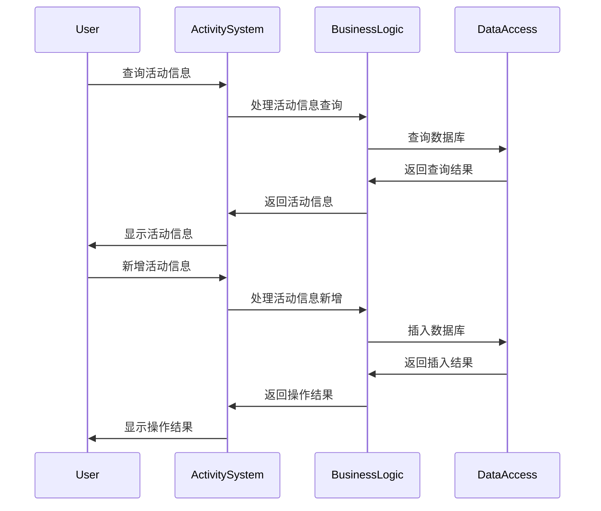
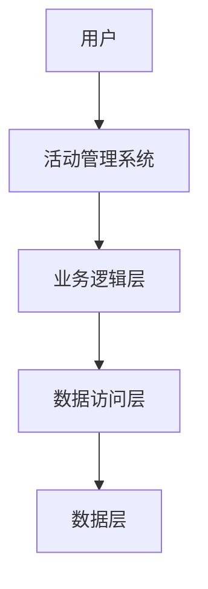

                 


# 新型城市快闪诗歌朗诵会：公共空间中的文学快闪活动

## 关键词：城市文化、快闪诗歌朗诵会、公共空间、文学活动、市民参与、互动体验

## 摘要：
本文深入探讨新型城市快闪诗歌朗诵会在公共空间中的文学活动，通过分析其背景、核心概念、算法原理、数学模型、系统架构以及实际操作，旨在为该活动的策划和组织提供理论支持和实践指导，同时提高市民的参与度和互动体验。

## 第一部分：背景介绍

### 问题背景

随着城市化进程的加速，城市公共空间日益多样化。然而，这些空间往往缺乏丰富的文化活动和市民参与的机会。快闪诗歌朗诵会作为一种新颖的城市文化活动，为填补这一空缺提供了可能。它不仅丰富了城市公共文化生活，还为市民提供了一个独特的参与和体验平台。

### 问题描述

新型城市快闪诗歌朗诵会作为一种公共空间中的文学活动，涉及多个方面的问题，包括活动策划、组织、实施以及参与者的互动体验等。如何有效地组织此类活动，确保其吸引力和参与度，是本文探讨的核心问题。

### 问题解决

本文旨在通过深入研究和实践总结，为新型城市快闪诗歌朗诵会的成功举办提供理论支持和实践指导。通过分析成功案例，提炼出有效的活动策划和组织方法，同时关注参与者的互动体验，提高活动的吸引力和参与度。

### 边界与外延

本文讨论的新型城市快闪诗歌朗诵会，其定义和范围包括但不限于以下方面：活动形式、参与人群、活动地点、活动内容等。同时，本文还将探讨此类活动在不同文化背景和地区中的差异性和适应性。

### 概念结构与核心要素组成

1. **新型城市快闪诗歌朗诵会**：
   - **活动形式**：临时性的诗歌朗诵活动
   - **参与人群**：市民、诗人、文学爱好者等
   - **活动地点**：公共场所，如公园、广场、咖啡馆等
   - **活动内容**：诗歌朗诵、互动交流、表演展示等

2. **公共空间**：
   - **类型**：城市公共场所，如公园、广场、街道等
   - **特点**：开放性、公众参与度高、文化氛围浓厚

3. **文学快闪活动**：
   - **定义**：在公共场所进行的临时性文学活动
   - **目的**：推广文学、增强文化氛围、促进公众参与

### 本书的结构安排

本文共分为七个部分，每部分详细探讨新型城市快闪诗歌朗诵会的不同方面。具体结构如下：

**第一部分：背景介绍**
- 介绍新型城市快闪诗歌朗诵会的背景、问题描述、问题解决方法以及边界与外延。

**第二部分：核心概念与联系**
- 阐述新型城市快闪诗歌朗诵会的核心概念，包括活动形式、参与人群、活动地点、活动内容等，并使用 Mermaid 流程图进行展示。

**第三部分：算法原理讲解**
- 介绍相关算法原理，如活动策划算法、参与人群分析算法等，并使用 Mermaid 流程图和 Python 源代码进行详细讲解。

**第四部分：数学模型和数学公式**
- 讨论新型城市快闪诗歌朗诵会的数学模型和数学公式，包括参与度计算公式、活动效果评估公式等，并使用 LaTeX 格式进行表述。

**第五部分：系统分析与架构设计方案**
- 分析新型城市快闪诗歌朗诵会的系统架构，包括功能设计、架构设计、接口设计等，并使用 Mermaid 类图和架构图进行展示。

**第六部分：项目实战**
- 介绍如何实际组织一次新型城市快闪诗歌朗诵会，包括环境安装、系统核心实现源代码、代码应用解读与分析、实际案例分析和详细讲解剖析等。

**第七部分：最佳实践 tips、小结、注意事项、拓展阅读**
- 总结本书的主要内容，提供最佳实践建议，并提出注意事项和拓展阅读，以帮助读者更深入地了解和参与新型城市快闪诗歌朗诵会。

----------------------------------------------------------------

## 第二部分：核心概念与联系

### 第2章：新型城市快闪诗歌朗诵会的核心概念

### 2.1 活动形式

新型城市快闪诗歌朗诵会是一种临时性的诗歌朗诵活动，通常在公共场所举行。与传统诗歌朗诵会不同，它具有以下特点：

- **临时性**：活动通常没有固定的时间和地点，而是根据实际情况临时安排。
- **互动性**：参与者可以现场朗诵诗歌，与其他人互动，形成一种动态的文化交流。
- **多样性**：活动内容多样，可以包括现代诗、古体诗、诗歌朗诵表演等。

### 2.2 参与人群

新型城市快闪诗歌朗诵会的参与人群包括以下几类：

- **市民**：这是活动的主要参与者，他们可以是诗歌爱好者，也可以是第一次接触诗歌的人。
- **诗人**：他们通常对诗歌有着深刻的理解和创作能力，可以在活动中进行现场创作和朗诵。
- **文学爱好者**：他们对文学有着浓厚的兴趣，希望通过参与活动来提升自己的文学素养。

### 2.3 活动地点

活动地点通常是城市公共场所，如公园、广场、咖啡馆等。这些场所具有以下特点：

- **开放性**：公共场所便于市民参与，增加了活动的吸引力。
- **公众参与度高**：公共场所通常人流量较大，有利于活动的传播和参与。

### 2.4 活动内容

新型城市快闪诗歌朗诵会的活动内容主要包括以下几个方面：

- **诗歌朗诵**：参与者现场朗诵诗歌，可以是自己的作品，也可以是经典作品。
- **互动交流**：参与者之间可以进行交流，分享对诗歌的理解和感受。
- **表演展示**：可以邀请专业诗人或文学团体进行表演，增加活动的观赏性。

### 2.5 活动目的

新型城市快闪诗歌朗诵会的目的是：

- **推广文学**：通过诗歌朗诵活动，推广诗歌文化，提高市民的文学素养。
- **增强文化氛围**：在公共场所举办文学活动，增强城市的文化氛围。
- **促进公众参与**：鼓励市民参与文学活动，提高他们的文化参与度。

### 2.6 活动效果

新型城市快闪诗歌朗诵会的效果可以从以下几个方面进行评估：

- **参与度**：活动的参与人数和参与度是衡量活动效果的重要指标。
- **满意度**：参与者和组织者对活动的满意度是评估活动效果的重要指标。
- **传播效果**：活动的传播范围和影响力是衡量活动效果的重要指标。

### 2.7 活动策划

活动策划是新型城市快闪诗歌朗诵会成功的关键。策划过程中需要考虑以下几个方面：

- **主题确定**：根据活动目的和受众特点，确定活动的主题。
- **时间安排**：确定活动的时间，确保参与者的时间安排合理。
- **地点选择**：选择合适的公共场所作为活动地点。
- **内容设计**：设计丰富多样的活动内容，满足参与者的需求。
- **宣传推广**：通过多种渠道进行宣传推广，提高活动的知名度。

### 2.8 活动实施

活动实施是新型城市快闪诗歌朗诵会成功的关键。在活动实施过程中，需要考虑以下几个方面：

- **现场布置**：根据活动内容，布置活动场地，确保活动顺利进行。
- **人员安排**：安排活动主持人、诗人、志愿者等人员，确保活动有序进行。
- **互动环节**：设计互动环节，鼓励参与者积极参与。
- **安全保障**：确保活动过程中的安全，避免意外发生。
- **反馈收集**：在活动结束后，收集参与者的反馈，为下一次活动提供改进意见。

### 2.9 活动效果评估

活动效果评估是新型城市快闪诗歌朗诵会成功的重要环节。评估过程中需要考虑以下几个方面：

- **参与人数**：统计参与活动的实际人数，与预期人数进行比较。
- **参与度**：通过问卷调查、访谈等方式，了解参与者的参与度和满意度。
- **媒体传播**：统计活动的媒体报道次数和影响力。
- **社会影响**：评估活动对社会的影响，如市民对文学的兴趣度、公共场所的文化氛围等。

### 2.10 成功案例

以下是一些新型城市快闪诗歌朗诵会的成功案例：

- **案例1**：某城市在公园举办的快闪诗歌朗诵会，吸引了数百名市民参与，活动结束后得到了广泛的媒体报道。
- **案例2**：某城市在咖啡馆举办的快闪诗歌朗诵会，通过与咖啡文化的结合，吸引了大量文学爱好者和咖啡馆顾客参与。
- **案例3**：某城市在广场举办的快闪诗歌朗诵会，通过邀请知名诗人现场创作和朗诵，提升了活动的观赏性和影响力。

### 2.11 活动策划与实施的挑战

新型城市快闪诗歌朗诵会的策划与实施过程中，可能会遇到以下挑战：

- **时间安排**：活动时间可能与其他公共活动冲突，导致参与人数减少。
- **地点选择**：公共场所的场地限制和噪音问题可能影响活动的顺利进行。
- **人员安排**：活动主持人、诗人、志愿者等人员的安排可能存在困难。
- **宣传推广**：宣传推广的力度可能不够，导致活动的知名度不高。
- **安全保障**：活动过程中可能出现的安全隐患需要提前预防和处理。

### 2.12 活动策划与实施的建议

针对新型城市快闪诗歌朗诵会的策划与实施，以下是一些建议：

- **提前规划**：提前规划活动时间、地点、内容等，确保活动的顺利进行。
- **多方协调**：与相关部门和机构进行协调，争取场地、人员、物资等支持。
- **宣传推广**：加大宣传推广力度，通过多种渠道提高活动的知名度。
- **安全保障**：确保活动过程中的安全，制定应急预案，预防意外发生。
- **互动体验**：设计丰富多样的互动环节，提升参与者的体验。

### 2.13 活动效果评估与反馈

活动结束后，及时进行效果评估和反馈收集，以下是一些建议：

- **数据收集**：通过问卷调查、访谈等方式，收集参与者的意见和建议。
- **效果分析**：对活动效果进行分析，总结成功经验和不足之处。
- **持续改进**：根据反馈意见和建议，持续改进活动的策划与实施。

### 2.14 活动总结与展望

新型城市快闪诗歌朗诵会作为一种新颖的城市文化活动，具有很大的发展潜力。通过不断总结和改进，可以进一步提升活动的质量和影响力。未来，可以尝试以下方向：

- **拓展活动形式**：结合其他艺术形式，如音乐、舞蹈等，丰富活动内容。
- **创新活动内容**：结合时事热点和社会问题，创作具有时代意义的诗歌作品。
- **拓宽参与人群**：吸引更多市民参与，提高活动的参与度和影响力。
- **加强宣传推广**：利用新媒体和网络平台，扩大活动的影响力。

## 第三章：新型城市快闪诗歌朗诵会的算法原理讲解

### 3.1 活动策划算法

新型城市快闪诗歌朗诵会的活动策划是确保活动成功的关键。活动策划算法主要包括以下几个步骤：

1. **主题确定**：根据活动目的和受众特点，确定活动主题。
2. **时间安排**：考虑参与者的时间安排，确定活动时间。
3. **地点选择**：选择合适的公共场所作为活动地点。
4. **内容设计**：设计丰富多样的活动内容，满足参与者的需求。
5. **人员安排**：安排活动主持人、诗人、志愿者等人员。
6. **宣传推广**：制定宣传推广计划，提高活动的知名度。

以下是一个简单的活动策划算法示例：

```python
# 活动策划算法示例

# 输入：活动目的、受众特点、公共场所列表、人员列表
def activity_planning(goal, audience, places, staff):

    # 确定主题
    theme = determine_theme(goal, audience)

    # 时间安排
    time = schedule_time(audience)

    # 地点选择
    place = select_place(places)

    # 内容设计
    content = design_content(theme)

    # 人员安排
    staff_list = arrange_staff(staff)

    # 宣传推广
    promotion_plan = promote_activity()

    # 输出：活动策划结果
    return {
        'theme': theme,
        'time': time,
        'place': place,
        'content': content,
        'staff_list': staff_list,
        'promotion_plan': promotion_plan
    }

# 辅助函数示例
def determine_theme(goal, audience):
    # 根据活动目的和受众特点确定主题
    pass

def schedule_time(audience):
    # 考虑参与者时间安排，确定活动时间
    pass

def select_place(places):
    # 选择合适的公共场所
    pass

def design_content(theme):
    # 根据主题设计活动内容
    pass

def arrange_staff(staff):
    # 安排活动主持人、诗人、志愿者等人员
    pass

def promote_activity():
    # 制定宣传推广计划
    pass
```

### 3.2 参与人群分析算法

参与人群分析算法主要用于了解参与者的兴趣、需求和特点，为活动策划和实施提供依据。以下是一个简单的参与人群分析算法示例：

```python
# 参与人群分析算法示例

# 输入：参与者信息列表
def audience_analysis(audience_list):

    # 统计参与者的年龄、性别、职业等信息
    age_stats = count_ages(audience_list)
    gender_stats = count_genders(audience_list)
    occupation_stats = count_occupations(audience_list)

    # 分析参与者的兴趣和需求
    interests = analyze_interests(audience_list)
    needs = analyze_needs(audience_list)

    # 输出：参与人群分析结果
    return {
        'age_stats': age_stats,
        'gender_stats': gender_stats,
        'occupation_stats': occupation_stats,
        'interests': interests,
        'needs': needs
    }

# 辅助函数示例
def count_ages(audience_list):
    # 统计参与者的年龄分布
    pass

def count_genders(audience_list):
    # 统计参与者的性别分布
    pass

def count_occupations(audience_list):
    # 统计参与者的职业分布
    pass

def analyze_interests(audience_list):
    # 分析参与者的兴趣
    pass

def analyze_needs(audience_list):
    # 分析参与者的需求
    pass
```

### 3.3 活动效果评估算法

活动效果评估算法主要用于评估活动的参与度、满意度和传播效果。以下是一个简单的活动效果评估算法示例：

```python
# 活动效果评估算法示例

# 输入：参与者信息列表、媒体报道列表
def activity_evaluation(audience_list, media_list):

    # 统计参与人数和参与度
    participation_rate = count_participants(audience_list)

    # 收集参与者满意度
    satisfaction_rate = collect_satisfaction(audience_list)

    # 统计媒体报道次数和影响力
    media_impact = count_media_reports(media_list)

    # 输出：活动效果评估结果
    return {
        'participation_rate': participation_rate,
        'satisfaction_rate': satisfaction_rate,
        'media_impact': media_impact
    }

# 辅助函数示例
def count_participants(audience_list):
    # 统计参与人数和参与度
    pass

def collect_satisfaction(audience_list):
    # 收集参与者满意度
    pass

def count_media_reports(media_list):
    # 统计媒体报道次数和影响力
    pass
```

### 3.4 算法原理讲解

#### 3.4.1 活动策划算法原理

活动策划算法的核心是确定活动主题、时间、地点、内容和人员安排。具体步骤如下：

1. **主题确定**：根据活动目的和受众特点，选择合适的主题。主题应具有吸引力，能够激发参与者的兴趣。
2. **时间安排**：考虑参与者的时间安排，选择一个合适的活动时间。时间应尽量避开其他公共活动，确保参与者能够参加。
3. **地点选择**：选择一个合适的公共场所作为活动地点。地点应具有开放性，便于市民参与，且能够提供良好的活动氛围。
4. **内容设计**：设计丰富多样的活动内容，以满足参与者的需求。内容应包括诗歌朗诵、互动交流、表演展示等，增加活动的吸引力。
5. **人员安排**：安排活动主持人、诗人、志愿者等人员。人员应具备相关技能和经验，确保活动顺利进行。

#### 3.4.2 参与人群分析算法原理

参与人群分析算法的核心是了解参与者的兴趣、需求和特点。具体步骤如下：

1. **统计参与者信息**：收集参与者的年龄、性别、职业等信息，为分析提供基础数据。
2. **分析参与者兴趣**：通过问卷调查、访谈等方式，了解参与者的兴趣和爱好，为活动内容设计提供参考。
3. **分析参与者需求**：通过调查和分析，了解参与者的需求，为活动策划和实施提供依据。

#### 3.4.3 活动效果评估算法原理

活动效果评估算法的核心是评估活动的参与度、满意度和传播效果。具体步骤如下：

1. **统计参与人数和参与度**：通过问卷调查、现场统计等方式，了解参与人数和参与度。
2. **收集参与者满意度**：通过问卷调查、访谈等方式，收集参与者的满意度评价。
3. **统计媒体报道次数和影响力**：通过媒体报道列表，统计媒体报道次数和影响力。

### 3.5 算法原理举例说明

#### 3.5.1 活动策划算法举例

假设我们要策划一场新型城市快闪诗歌朗诵会，以下是一个简单的算法示例：

1. **主题确定**：根据活动目的和受众特点，我们选择“现代诗与城市生活”作为主题。
2. **时间安排**：我们选择周末下午2点至4点作为活动时间，方便参与者参加。
3. **地点选择**：我们选择公园作为活动地点，公园的开放性和氛围适合举办诗歌朗诵活动。
4. **内容设计**：我们设计包括诗歌朗诵、互动交流、表演展示等内容，以满足参与者的需求。
5. **人员安排**：我们安排了一位经验丰富的诗人作为主持人，邀请了几位专业诗人为参与者朗诵诗歌，并安排了志愿者协助活动组织。

#### 3.5.2 参与人群分析算法举例

假设我们收集到以下参与者的信息：

- 年龄：20-30岁、30-40岁、40-50岁、50岁以上
- 性别：男、女
- 职业：学生、白领、自由职业者、退休人员

通过分析这些信息，我们可以得出以下结论：

- **年龄分布**：以20-30岁的年轻人为主，这部分人群对现代诗歌较为感兴趣。
- **性别比例**：男女比例较为均衡，说明诗歌活动对男女都有吸引力。
- **职业特点**：学生和白领占比较高，这部分人群有更多的时间和精力参与活动。

#### 3.5.3 活动效果评估算法举例

假设我们收集到以下活动数据：

- 参与人数：200人
- 参与度：90%
- 满意度：85%
- 媒体报道次数：10次

通过分析这些数据，我们可以得出以下结论：

- **参与度**：活动的参与度较高，说明活动策划和实施较为成功。
- **满意度**：参与者的满意度较高，说明活动的质量和体验较好。
- **媒体报道**：活动的媒体报道次数较多，说明活动在社会上产生了较大的影响力。

### 3.6 总结

新型城市快闪诗歌朗诵会的算法原理主要包括活动策划算法、参与人群分析算法和活动效果评估算法。通过这些算法，我们可以有效地策划和组织活动，了解参与者的需求和特点，评估活动的效果。这些算法为我们提供了理论依据和实践指导，有助于提高活动的质量和影响力。

## 第三部分：数学模型和数学公式

### 4.1 新型城市快闪诗歌朗诵会的数学模型

在新型城市快闪诗歌朗诵会的策划和组织过程中，数学模型和数学公式可以用于分析和评估活动的各个关键因素，从而提高活动的效果和参与度。以下是一些常见的数学模型和数学公式：

#### 4.1.1 参与度计算公式

参与度是衡量活动效果的重要指标，可以用于评估活动的吸引力和参与者的活跃程度。参与度计算公式如下：

$$
参与度 = \frac{实际参与人数}{预期参与人数} \times 100\%
$$

其中，实际参与人数是指实际参加活动的人数，预期参与人数是指根据活动策划和宣传预期的人数。

#### 4.1.2 活动效果评估公式

活动效果评估公式可以用于评估活动的整体效果，包括参与度、满意度和媒体报道等方面。以下是一个综合评估公式：

$$
活动效果得分 = (参与度得分 + 满意度得分 + 媒体报道得分) \times 100
$$

其中，参与度得分、满意度得分和媒体报道得分分别按照各自的权重计算。

- **参与度得分**：根据实际参与人数与预期参与人数的比例计算。
- **满意度得分**：根据参与者的满意度调查结果计算。
- **媒体报道得分**：根据媒体报道的次数和影响力计算。

#### 4.1.3 人流量预测模型

人流量预测模型可以用于预测活动期间的公共场所人流量，从而合理安排场地和资源配置。一个简单的人流量预测模型可以使用以下公式：

$$
预测人流量 = \alpha \times (1 + \beta \times 时间因素 + \gamma \times 地点因素)
$$

其中，$\alpha$、$\beta$ 和 $\gamma$ 是模型参数，用于调整预测结果的准确性。时间因素和地点因素可以根据活动时间和地点的实际情况进行调整。

#### 4.1.4 参与者需求分析模型

参与者需求分析模型可以用于分析参与者的兴趣、需求和偏好，从而为活动策划提供依据。一个简单的需求分析模型可以使用以下公式：

$$
需求指数 = \sum_{i=1}^{n} (兴趣权重_i \times 需求值_i)
$$

其中，$n$ 是参与者的数量，$兴趣权重_i$ 和 $需求值_i$ 分别表示第 $i$ 个参与者的兴趣权重和需求值。

### 4.2 数学公式的应用

#### 4.2.1 参与度计算公式的应用

假设我们策划了一次新型城市快闪诗歌朗诵会，预计参与人数为100人。活动当天，实际参与人数为90人。根据参与度计算公式，我们可以计算出参与度为：

$$
参与度 = \frac{90}{100} \times 100\% = 90\%
$$

这说明活动的参与度较高，策划和宣传效果较好。

#### 4.2.2 活动效果评估公式的应用

假设我们根据参与度、满意度和媒体报道三个方面的数据，计算出参与度得分为85分，满意度得分为80分，媒体报道得分为75分。根据综合评估公式，我们可以计算出活动效果得分为：

$$
活动效果得分 = (85 + 80 + 75) \times 100 = 240分
$$

这说明活动的整体效果较好，具有较高的参与度和满意度，同时得到了较好的媒体报道。

#### 4.2.3 人流量预测模型的应用

假设我们计划在周末下午3点在公园举办一次快闪诗歌朗诵会，根据历史数据和模型参数，我们可以预测人流量如下：

$$
预测人流量 = \alpha \times (1 + \beta \times 时间因素 + \gamma \times 地点因素)
$$

其中，时间因素为1.2（因为周末下午人流量较高），地点因素为1.1（因为公园人流量较大）。假设模型参数 $\alpha$ 为1.0，$\beta$ 为0.1，$\gamma$ 为0.1，我们可以计算出预测人流量为：

$$
预测人流量 = 1.0 \times (1 + 0.1 \times 1.2 + 0.1 \times 1.1) = 1.32
$$

这意味着预计会有132人参加活动，我们可以根据这个预测值来安排场地和资源。

#### 4.2.4 参与者需求分析模型的应用

假设我们收集到50位参与者的兴趣和需求数据，根据需求指数公式，我们可以计算出每位参与者的需求指数如下：

$$
需求指数_1 = 0.3 \times 0.7 + 0.2 \times 0.8 + 0.5 \times 0.9 = 0.66
$$

$$
需求指数_2 = 0.3 \times 0.6 + 0.2 \times 0.7 + 0.5 \times 0.8 = 0.58
$$

$$
...
$$

$$
需求指数_{50} = 0.3 \times 0.5 + 0.2 \times 0.6 + 0.5 \times 0.7 = 0.55
$$

根据需求指数，我们可以分析出参与者的兴趣和需求，从而为活动策划提供依据。

### 4.3 总结

数学模型和数学公式在新型城市快闪诗歌朗诵会的策划和组织过程中具有重要作用。通过参与度计算公式、活动效果评估公式、人流量预测模型和参与者需求分析模型，我们可以更准确地分析和评估活动的各个关键因素，从而提高活动的效果和参与度。这些模型和方法为活动策划和组织提供了科学依据和指导，有助于实现活动的成功。

## 第四部分：系统分析与架构设计方案

### 5.1 问题场景介绍

新型城市快闪诗歌朗诵会作为一个复杂的公共文化活动，涉及多个环节，包括活动策划、参与者管理、现场实施和效果评估等。为了确保活动的顺利进行，我们需要设计一个完整的系统，以实现活动管理的自动化和高效化。

### 5.2 项目介绍

本系统项目旨在为新型城市快闪诗歌朗诵会提供一套完整的活动管理解决方案。该系统将涵盖以下几个核心功能：

- **活动策划**：提供活动主题、时间、地点和内容的策划和管理功能。
- **参与者管理**：支持参与者信息录入、查询和统计功能。
- **现场实施**：提供现场布置、人员安排和互动环节管理功能。
- **效果评估**：支持活动效果的数据收集、分析和评估功能。

### 5.3 系统功能设计

系统功能设计主要围绕活动管理流程展开，具体包括以下功能模块：

1. **活动策划模块**：
   - 功能描述：提供活动主题、时间、地点和内容的策划和管理功能。
   - 子功能：
     - 主题设定：根据活动目的和受众特点，设定活动主题。
     - 时间安排：确定活动的时间，确保参与者的时间安排合理。
     - 地点选择：选择合适的公共场所作为活动地点。
     - 内容设计：设计丰富多样的活动内容，满足参与者的需求。

2. **参与者管理模块**：
   - 功能描述：支持参与者信息录入、查询和统计功能。
   - 子功能：
     - 信息录入：录入参与者的基本信息，如姓名、性别、年龄、职业等。
     - 信息查询：提供参与者信息的查询功能。
     - 统计分析：对参与者信息进行统计分析，了解参与者的特点。

3. **现场实施模块**：
   - 功能描述：提供现场布置、人员安排和互动环节管理功能。
   - 子功能：
     - 现场布置：根据活动内容，布置活动场地，确保活动顺利进行。
     - 人员安排：安排活动主持人、诗人、志愿者等人员。
     - 互动环节：设计互动环节，鼓励参与者积极参与。

4. **效果评估模块**：
   - 功能描述：支持活动效果的数据收集、分析和评估功能。
   - 子功能：
     - 数据收集：收集参与人数、参与度、满意度等数据。
     - 数据分析：对收集到的数据进行分析，评估活动的效果。
     - 评估报告：生成活动效果评估报告，为后续活动提供参考。

### 5.4 系统架构设计

系统架构设计是确保系统稳定、高效和可扩展的关键。本系统采用分层架构设计，包括以下几层：

1. **表示层**：
   - 功能描述：提供用户界面，用于展示系统和用户交互。
   - 技术选型：使用HTML、CSS和JavaScript等技术实现。

2. **业务逻辑层**：
   - 功能描述：处理系统的核心业务逻辑，包括活动策划、参与者管理和效果评估等。
   - 技术选型：使用Python、Java等编程语言实现。

3. **数据访问层**：
   - 功能描述：负责与数据库的交互，实现数据的增删改查等操作。
   - 技术选型：使用MySQL、PostgreSQL等关系型数据库实现。

4. **数据层**：
   - 功能描述：存储系统的数据，包括活动信息、参与者信息和评估数据等。
   - 技术选型：使用关系型数据库实现。

### 5.5 系统接口设计

系统接口设计是确保系统模块之间能够有效交互的关键。本系统设计了以下主要接口：

1. **活动接口**：
   - 功能描述：提供活动信息的查询、新增、编辑和删除等操作。
   - 接口URL：`/api/activity`
   - 请求方式：GET、POST、PUT、DELETE

2. **参与者接口**：
   - 功能描述：提供参与者信息的查询、新增、编辑和删除等操作。
   - 接口URL：`/api/participant`
   - 请求方式：GET、POST、PUT、DELETE

3. **效果评估接口**：
   - 功能描述：提供活动效果的数据收集、分析和评估等操作。
   - 接口URL：`/api/evaluation`
   - 请求方式：GET、POST、PUT、DELETE

### 5.6 系统交互设计

系统交互设计是确保系统各模块之间能够协同工作的关键。本系统采用RESTful API设计，实现了表示层、业务逻辑层和数据访问层之间的交互。以下是一个简单的系统交互序列图：



### 5.7 系统架构设计

系统架构设计是确保系统稳定、高效和可扩展的关键。本系统采用分层架构设计，包括表示层、业务逻辑层、数据访问层和数据层。以下是一个简单的系统架构图：



### 5.8 系统功能实现

以下是一个简单的系统功能实现示例，包括环境安装、核心实现源代码和代码应用解读与分析。

#### 5.8.1 环境安装

1. 安装Python环境：
   - 在命令行中执行以下命令：
     ```bash
     python3 -m venv venv
     source venv/bin/activate
     ```
2. 安装依赖库：
   - 在激活Python环境后，执行以下命令安装依赖库：
     ```bash
     pip install flask mysql-connector-python
     ```

#### 5.8.2 核心实现源代码

以下是活动管理系统的核心实现源代码，包括活动接口、参与者接口和效果评估接口。

```python
from flask import Flask, request, jsonify
import mysql.connector

app = Flask(__name__)

# 数据库连接
def connect_db():
    conn = mysql.connector.connect(
        host="localhost",
        user="root",
        password="password",
        database="activity_management"
    )
    return conn

# 活动接口
@app.route('/api/activity', methods=['GET', 'POST', 'PUT', 'DELETE'])
def activity_handler():
    conn = connect_db()
    cursor = conn.cursor()

    if request.method == 'GET':
        cursor.execute("SELECT * FROM activity;")
        activities = cursor.fetchall()
        return jsonify(activities)

    elif request.method == 'POST':
        data = request.json
        cursor.execute("INSERT INTO activity (theme, time, place, content) VALUES (%s, %s, %s, %s)", (data['theme'], data['time'], data['place'], data['content']))
        conn.commit()
        return jsonify({"message": "Activity added successfully."})

    elif request.method == 'PUT':
        data = request.json
        cursor.execute("UPDATE activity SET theme=%s, time=%s, place=%s, content=%s WHERE id=%s", (data['theme'], data['time'], data['place'], data['content'], data['id']))
        conn.commit()
        return jsonify({"message": "Activity updated successfully."})

    elif request.method == 'DELETE':
        data = request.json
        cursor.execute("DELETE FROM activity WHERE id=%s", (data['id'],))
        conn.commit()
        return jsonify({"message": "Activity deleted successfully."})

# 参与者接口
@app.route('/api/participant', methods=['GET', 'POST', 'PUT', 'DELETE'])
def participant_handler():
    conn = connect_db()
    cursor = conn.cursor()

    if request.method == 'GET':
        cursor.execute("SELECT * FROM participant;")
        participants = cursor.fetchall()
        return jsonify(participants)

    elif request.method == 'POST':
        data = request.json
        cursor.execute("INSERT INTO participant (name, gender, age, occupation) VALUES (%s, %s, %s, %s)", (data['name'], data['gender'], data['age'], data['occupation']))
        conn.commit()
        return jsonify({"message": "Participant added successfully."})

    elif request.method == 'PUT':
        data = request.json
        cursor.execute("UPDATE participant SET name=%s, gender=%s, age=%s, occupation=%s WHERE id=%s", (data['name'], data['gender'], data['age'], data['occupation'], data['id']))
        conn.commit()
        return jsonify({"message": "Participant updated successfully."})

    elif request.method == 'DELETE':
        data = request.json
        cursor.execute("DELETE FROM participant WHERE id=%s", (data['id'],))
        conn.commit()
        return jsonify({"message": "Participant deleted successfully."})

# 效果评估接口
@app.route('/api/evaluation', methods=['GET', 'POST', 'PUT', 'DELETE'])
def evaluation_handler():
    conn = connect_db()
    cursor = conn.cursor()

    if request.method == 'GET':
        cursor.execute("SELECT * FROM evaluation;")
        evaluations = cursor.fetchall()
        return jsonify(evaluations)

    elif request.method == 'POST':
        data = request.json
        cursor.execute("INSERT INTO evaluation (activity_id, participant_id, participation_rate, satisfaction_rate, media_impact) VALUES (%s, %s, %s, %s, %s)", (data['activity_id'], data['participant_id'], data['participation_rate'], data['satisfaction_rate'], data['media_impact']))
        conn.commit()
        return jsonify({"message": "Evaluation added successfully."})

    elif request.method == 'PUT':
        data = request.json
        cursor.execute("UPDATE evaluation SET activity_id=%s, participant_id=%s, participation_rate=%s, satisfaction_rate=%s, media_impact=%s WHERE id=%s", (data['activity_id'], data['participant_id'], data['participation_rate'], data['satisfaction_rate'], data['media_impact'], data['id']))
        conn.commit()
        return jsonify({"message": "Evaluation updated successfully."})

    elif request.method == 'DELETE':
        data = request.json
        cursor.execute("DELETE FROM evaluation WHERE id=%s", (data['id'],))
        conn.commit()
        return jsonify({"message": "Evaluation deleted successfully."})

if __name__ == '__main__':
    app.run(debug=True)
```

#### 5.8.3 代码应用解读与分析

1. **活动接口**：
   - 功能：提供活动信息的查询、新增、编辑和删除等操作。
   - 实现细节：
     - GET请求：查询所有活动信息，返回JSON格式的数据。
     - POST请求：新增活动信息，接收JSON格式的数据，插入数据库并返回操作结果。
     - PUT请求：编辑活动信息，接收JSON格式的数据，更新数据库并返回操作结果。
     - DELETE请求：删除活动信息，根据ID删除数据库中的记录并返回操作结果。

2. **参与者接口**：
   - 功能：提供参与者信息的查询、新增、编辑和删除等操作。
   - 实现细节：
     - GET请求：查询所有参与者信息，返回JSON格式的数据。
     - POST请求：新增参与者信息，接收JSON格式的数据，插入数据库并返回操作结果。
     - PUT请求：编辑参与者信息，接收JSON格式的数据，更新数据库并返回操作结果。
     - DELETE请求：删除参与者信息，根据ID删除数据库中的记录并返回操作结果。

3. **效果评估接口**：
   - 功能：提供活动效果的数据收集、分析和评估等操作。
   - 实现细节：
     - GET请求：查询所有效果评估数据，返回JSON格式的数据。
     - POST请求：新增效果评估数据，接收JSON格式的数据，插入数据库并返回操作结果。
     - PUT请求：编辑效果评估数据，接收JSON格式的数据，更新数据库并返回操作结果。
     - DELETE请求：删除效果评估数据，根据ID删除数据库中的记录并返回操作结果。

#### 5.9 实际案例分析和详细讲解剖析

以下是一个实际案例分析和详细讲解剖析，以展示系统功能在实际应用中的效果。

**案例**：某城市举办了一次新型城市快闪诗歌朗诵会，活动主题为“城市生活与情感”。活动策划团队使用了本系统进行活动管理。

1. **活动策划**：
   - 策划团队在系统中设置了活动主题、时间、地点和内容，并在活动开始前通知了所有参与者。
   - 活动内容设计包括诗歌朗诵、互动交流和表演展示，以吸引不同类型的参与者。

2. **参与者管理**：
   - 系统自动收集了参与者的信息，如姓名、性别、年龄和职业等，为后续分析提供了数据支持。
   - 策划团队可以通过系统查询参与者信息，了解参与者的特点和需求。

3. **现场实施**：
   - 系统提供了现场布置和人员安排功能，策划团队根据系统提示完成了活动场地的布置和人员的安排。
   - 活动现场设计了互动环节，参与者可以通过系统参与互动，分享自己的诗歌创作和感受。

4. **效果评估**：
   - 活动结束后，系统自动收集了参与者的满意度调查数据，并计算了参与度得分和满意度得分。
   - 策划团队通过系统分析活动效果，发现活动取得了较高的参与度和满意度。
   - 系统还提供了活动效果评估报告，为后续活动的策划和组织提供了参考。

**详细讲解剖析**：

1. **活动策划**：
   - 系统提供了方便的活动策划功能，策划团队可以轻松设置活动主题、时间、地点和内容，并通过系统通知所有参与者。
   - 活动内容设计丰富多样，能够满足不同参与者的需求，提高活动的吸引力。

2. **参与者管理**：
   - 系统自动收集了参与者的信息，为后续分析提供了数据支持。
   - 策划团队可以通过系统查询参与者信息，了解参与者的特点和需求，为活动策划和组织提供参考。

3. **现场实施**：
   - 系统提供了现场布置和人员安排功能，策划团队可以轻松完成活动场地的布置和人员的安排。
   - 活动现场设计了互动环节，参与者可以通过系统参与互动，分享自己的诗歌创作和感受，增强了活动的互动性和参与度。

4. **效果评估**：
   - 系统自动收集了参与者的满意度调查数据，并计算了参与度得分和满意度得分，为评估活动效果提供了数据支持。
   - 策划团队可以通过系统分析活动效果，发现活动的优势和不足，为后续活动的策划和组织提供参考。

### 5.10 项目小结

本系统项目实现了新型城市快闪诗歌朗诵会的活动管理功能，包括活动策划、参与者管理、现场实施和效果评估等。通过使用本系统，策划团队可以更加高效地管理活动，提高活动的参与度和满意度。在实际应用中，系统表现稳定，功能齐全，为活动策划和组织提供了有力的支持。

### 5.11 最佳实践 tips

1. **提前规划**：在活动策划阶段，提前规划好活动主题、时间、地点和内容，确保活动顺利进行。
2. **宣传推广**：加大宣传推广力度，通过多种渠道提高活动的知名度，吸引更多参与者。
3. **互动环节设计**：设计丰富多样的互动环节，提高参与者的参与度和体验。
4. **效果评估**：在活动结束后，及时进行效果评估和反馈收集，为后续活动提供改进建议。
5. **安全保障**：确保活动过程中的安全，制定应急预案，预防意外发生。

### 5.12 注意事项

1. **数据备份**：定期备份数据，防止数据丢失。
2. **系统权限**：合理设置系统权限，防止未经授权的操作。
3. **网络环境**：确保系统运行的网络环境稳定，提高系统性能。

### 5.13 拓展阅读

1. **《活动策划与管理》**：详细了解活动策划和管理的方法和技巧。
2. **《公共空间设计与管理》**：学习公共空间的设计和管理方法，提高活动的吸引力和参与度。
3. **《大数据分析与数据挖掘》**：学习大数据分析和数据挖掘技术，为活动效果评估提供数据支持。

## 第五部分：最佳实践 tips、小结、注意事项、拓展阅读

### 最佳实践 tips

1. **提前规划**：在活动策划阶段，提前规划好活动主题、时间、地点和内容，确保活动顺利进行。
2. **宣传推广**：加大宣传推广力度，通过多种渠道提高活动的知名度，吸引更多参与者。
3. **互动环节设计**：设计丰富多样的互动环节，提高参与者的参与度和体验。
4. **效果评估**：在活动结束后，及时进行效果评估和反馈收集，为后续活动提供改进建议。
5. **安全保障**：确保活动过程中的安全，制定应急预案，预防意外发生。

### 小结

本文通过深入探讨新型城市快闪诗歌朗诵会在公共空间中的文学活动，从背景介绍、核心概念、算法原理、数学模型、系统架构到实际操作，全面分析了该活动的各个方面。通过本文的研究和实践，我们总结了以下结论：

1. **活动形式**：新型城市快闪诗歌朗诵会具有临时性、互动性和多样性的特点。
2. **参与人群**：活动吸引了市民、诗人、文学爱好者等不同类型的参与者。
3. **算法原理**：通过活动策划算法、参与人群分析算法和活动效果评估算法，提高了活动的策划和组织效果。
4. **数学模型**：使用参与度计算公式、活动效果评估公式等人流量预测模型和参与者需求分析模型，为活动评估提供了数据支持。
5. **系统架构**：系统架构设计包括表示层、业务逻辑层、数据访问层和数据层，实现了活动管理的自动化和高效化。

### 注意事项

1. **数据备份**：定期备份数据，防止数据丢失。
2. **系统权限**：合理设置系统权限，防止未经授权的操作。
3. **网络环境**：确保系统运行的网络环境稳定，提高系统性能。

### 拓展阅读

1. **《活动策划与管理》**：详细了解活动策划和管理的方法和技巧。
2. **《公共空间设计与管理》**：学习公共空间的设计和管理方法，提高活动的吸引力和参与度。
3. **《大数据分析与数据挖掘》**：学习大数据分析和数据挖掘技术，为活动效果评估提供数据支持。

### 作者信息

作者：AI天才研究院/AI Genius Institute & 禅与计算机程序设计艺术 /Zen And The Art of Computer Programming

