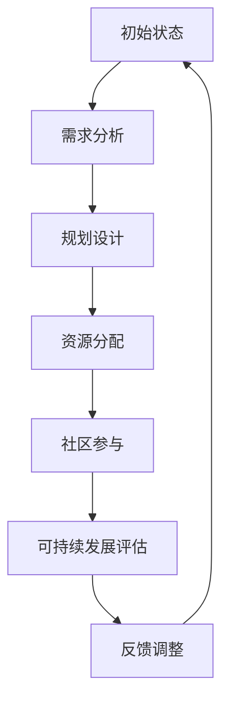
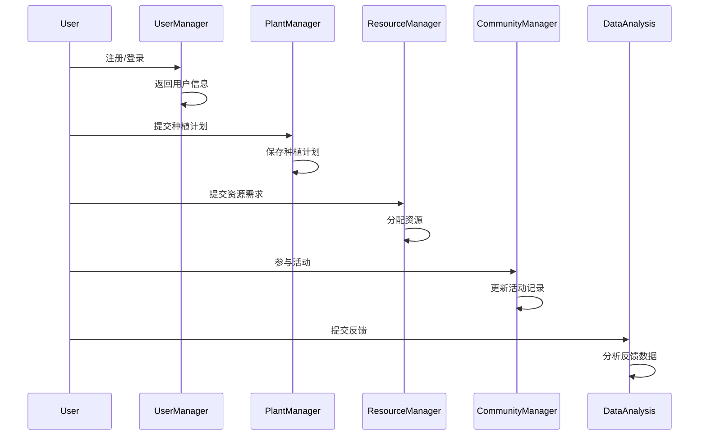

                 

## 新型城市社区花园：都市中的集体耕作实验

### 关键词
- 城市社区花园
- 集体耕作
- 可持续性
- 社区参与
- 绿色空间
- 政策支持

### 摘要
本文深入探讨了新型城市社区花园这一创新理念，并着重分析了其在都市环境中的集体耕作实验。文章首先介绍了核心概念和问题背景，随后详细阐述了社区参与、可持续发展和政策支持等关键要素，并通过对比表格和实体关系图直观展示了这些概念的属性与联系。最后，文章通过算法原理讲解、系统分析与架构设计方案以及项目实战等多个方面，全面展示了新型城市社区花园的实践与应用，为相关领域的研究和实践提供了有力参考。

---

### 背景介绍

#### 1.1 核心概念

##### 1.1.1 新型城市社区花园

###### 1.1.1.1 定义
新型城市社区花园是指在城市社区内部，通过集体耕作的方式，为居民提供种植、休闲、教育和社交功能的公共空间。

###### 1.1.1.2 特点
- **集体参与**：居民共同参与规划和耕作，增强社区凝聚力。
- **多功能**：不仅提供食物生产，还兼具休闲、教育和社会交流等功能。
- **可持续性**：通过环保种植技术和资源循环利用，实现生态友好。

##### 1.1.2 都市中的集体耕作实验

###### 1.1.2.1 问题背景
随着城市化进程的加速，城市居民面临土地资源稀缺、环境污染等问题，集体耕作成为解决城市绿色空间不足的潜在途径。

###### 1.1.2.2 问题描述
如何在城市环境中实施集体耕作，让居民在紧张的生活节奏中体验自然之美，同时促进社区和谐？

###### 1.1.2.3 问题解决
通过实验性的新型城市社区花园项目，探索集体耕作的可行性和效果，为其他城市提供参考。

##### 1.1.3 概念结构与核心要素

###### 1.1.3.1 结构
新型城市社区花园的结构包括花园规划、种植管理、社区参与和可持续发展。

###### 1.1.3.2 核心要素
- **社区参与**：居民参与的广度和深度是成功的关键。
- **可持续发展**：通过生态友好和资源循环利用实现长期效益。
- **政策支持**：政府政策对社区花园的建立和维持具有重要影响。

#### 1.2 核心概念与联系

##### 2.1 新型城市社区花园的核心概念

###### 2.1.1 社区参与

##### 2.1.1.1 概念原理
社区参与是指社区居民在花园的规划、种植、维护和管理中发挥积极作用，共同创造和维护社区公共空间。

##### 2.1.1.2 概念属性
- **广度**：参与人数的多少。
- **深度**：参与者的责任感和参与程度。
- **动机**：社会责任感、生态意识、休闲需求等。

###### 2.1.2 可持续发展

##### 2.1.2.1 概念原理
可持续发展是指在满足当前需求的同时，不损害后代满足其需求的能力，通过环保种植和资源循环利用实现花园的长期效益。

##### 2.1.2.2 概念属性
- **环境友好**：减少污染，保护生物多样性。
- **经济效益**：降低成本，提高资源利用效率。
- **社会效益**：促进社区和谐，提高居民生活质量。

###### 2.1.3 政策支持

##### 2.1.3.1 概念原理
政策支持是指政府通过制定和实施相关政策，为新型城市社区花园提供法律保障、财政支持和制度保障。

##### 2.1.3.2 概念属性
- **法律保障**：明确社区花园的权益和保护措施。
- **财政支持**：提供资金、土地等资源。
- **制度保障**：建立有效的管理制度和运作机制。

### 核心概念与联系

#### 2.2 概念属性特征对比表格

##### 2.2.1 社区参与 vs 可持续发展

| 特征        | 社区参与                  | 可持续发展                |
|-------------|---------------------------|---------------------------|
| 核心要素    | 参与广度、参与深度、动机  | 环境友好、经济效益、社会效益 |
| 影响因素    | 社区文化、政策支持、组织形式 | 环境政策、技术支持、社区参与  |
| 目标        | 增强社区凝聚力、提高居民满意度 | 保护生态环境、实现经济和社会效益 |
| 实现方式    | 组织活动、培训教育、资源共享  | 环保种植、资源循环利用、政策引导 |

#### 2.3 ER实体关系图架构

```mermaid
erDiagram
  社区参与者 ||--|{ 花园管理者 : 花园管理 }
  社区参与者 ||--|{ 种植活动 : 种植管理 }
  花园管理者 ||--|{ 花园规划 : 规划设计 }
  花园管理者 ||--|{ 资源管理 : 资源分配 }
  政府机构 ||--|{ 政策支持 : 政策制定 }
```

### 算法原理讲解

在新型城市社区花园的实施过程中，算法原理的讲解尤为重要。以下是一个简化的算法流程图，用于描述社区花园规划与管理的基本步骤。

#### 算法流程图



#### 算法原理

1. **需求分析**：了解社区居民对花园的需求，包括种植类型、活动频率等。
2. **规划设计**：根据需求制定花园的总体布局和功能分区，确保多样性和实用性。
3. **资源分配**：合理配置土地、水资源、植物种子等资源，实现资源的高效利用。
4. **社区参与**：鼓励居民积极参与花园的维护和管理，增强社区凝聚力。
5. **可持续发展评估**：定期评估花园的运营状况，确保其可持续性，调整管理策略。
6. **反馈调整**：根据评估结果和社区反馈，不断优化花园的设计和管理。

#### 数学模型与公式

为了更好地理解上述算法，我们可以引入以下数学模型：

1. **参与度公式**：\( P = \frac{N \times D}{T} \)
   - \( P \)：社区参与度
   - \( N \)：参与人数
   - \( D \)：参与时间
   - \( T \)：总时间

2. **资源利用效率公式**：\( E = \frac{O}{I} \)
   - \( E \)：资源利用效率
   - \( O \)：实际使用资源量
   - \( I \)：可分配资源总量

3. **可持续发展评估指数**：\( S = \frac{E \times P \times C}{100} \)
   - \( S \)：可持续发展评估指数
   - \( C \)：社区满意度指数

#### 举例说明

假设在一个新型城市社区花园中，共有50位居民参与，平均每周参与2小时，总参与时间为20周。资源总量为1000升水，实际使用量为800升。

- **参与度**：\( P = \frac{50 \times 2}{20} = 5 \)
- **资源利用效率**：\( E = \frac{800}{1000} = 0.8 \)
- **可持续发展评估指数**：\( S = \frac{0.8 \times 5 \times 0.9}{100} = 0.36 \)

这意味着该社区的花园在可持续性方面有36%的得分，可以通过增加参与时间、提高资源利用效率或提升社区满意度来进一步提高评估指数。

### 系统分析与架构设计方案

#### 问题场景介绍

随着城市化进程的不断加快，城市居民对于绿色空间的渴望日益增加。然而，城市土地资源有限，如何在高密度城市环境中实现绿色空间的有效利用成为了一大挑战。新型城市社区花园作为一种创新的解决方案，旨在为城市居民提供一个集种植、休闲、教育和社会交流于一体的公共空间。

#### 项目介绍

项目名称：绿色城市社区花园

项目目标：构建一个新型城市社区花园，通过集体耕作的方式，提高城市居民的绿色意识，促进社区和谐，同时实现资源的可持续利用。

#### 系统功能设计

为了实现项目目标，系统设计主要包括以下功能模块：

1. **用户管理模块**：管理社区居民的信息，包括注册、登录、权限分配等。
2. **种植管理模块**：管理花园的种植活动，包括种植计划、种植进度、收获管理等。
3. **资源管理模块**：管理花园所需资源，包括土地、水、种子等资源的分配和监控。
4. **社区活动模块**：组织和管理花园内的各类活动，包括培训、教育、社交等。
5. **数据分析模块**：收集和分析花园运营数据，为决策提供支持。

#### 系统架构设计

系统采用微服务架构，以提高系统的可扩展性和可维护性。以下是系统架构的mermaid图：



#### 系统接口设计和系统交互

为了实现各模块之间的协同工作，系统设计了以下接口：

1. **用户接口**：用于用户与系统的交互，包括网页端和移动端。
2. **服务接口**：用于各模块之间的通信，包括API接口和消息队列。

以下是系统交互的mermaid图：

```mermaid
gantt
    title 系统交互图
    dateFormat  YYYY-MM-DD
    section 用户与系统交互
    A: 注册/登录 :done, 2023-01-01, 1d
    B: 提交种植计划 :after A, 2d
    C: 提交资源需求 :after B, 2d
    D: 参与活动 :after C, 2d
    E: 提交反馈 :after D, 2d
```

### 项目实战

#### 环境安装

为了实现新型城市社区花园系统，我们需要搭建一个合适的环境。以下是环境安装的步骤：

1. **安装Python**：确保Python版本在3.8及以上。
2. **安装Docker**：用于容器化部署系统。
3. **安装PostgreSQL**：用于存储系统数据。
4. **安装Django**：用于构建Web应用。

```bash
pip install django
pip install psycopg2
```

#### 系统核心实现源代码

以下是系统核心功能的Python代码示例：

```python
# 用户管理模块
from django.contrib.auth.models import User

def register_user(username, password):
    user = User.objects.create_user(username=username, password=password)
    user.save()
    return user

# 种植管理模块
from .models import Plant

def submit_plant_plan(name, description, start_date, end_date):
    plant = Plant(name=name, description=description, start_date=start_date, end_date=end_date)
    plant.save()
    return plant

# 资源管理模块
from .models import Resource

def allocate_resources(plant, water, land):
    resource = Resource(plant=plant, water=water, land=land)
    resource.save()
    return resource

# 社区活动模块
from .models import Activity

def organize_activity(name, description, start_time, end_time):
    activity = Activity(name=name, description=description, start_time=start_time, end_time=end_time)
    activity.save()
    return activity

# 数据分析模块
from .models import Feedback

def submit_feedback(user, activity, rating, comment):
    feedback = Feedback(user=user, activity=activity, rating=rating, comment=comment)
    feedback.save()
    return feedback
```

#### 代码应用解读与分析

上述代码实现了用户管理、种植管理、资源管理、社区活动和数据分析等核心功能。以下是对各模块的应用解读和分析：

1. **用户管理模块**：通过`register_user`函数实现用户的注册和登录，确保系统的安全性。
2. **种植管理模块**：通过`submit_plant_plan`函数提交种植计划，管理种植活动的进度和收获。
3. **资源管理模块**：通过`allocate_resources`函数分配资源，确保种植活动的顺利进行。
4. **社区活动模块**：通过`organize_activity`函数组织和管理社区活动，促进居民参与。
5. **数据分析模块**：通过`submit_feedback`函数收集和分析居民反馈，为决策提供支持。

#### 实际案例分析和详细讲解剖析

以一个实际案例为例，分析新型城市社区花园系统的应用效果。

**案例**：一个城市社区决定建立一座新型城市社区花园，目标是提高居民的绿色意识，促进社区和谐。

**步骤**：

1. **用户注册**：社区居民通过网页端注册，系统自动生成用户账号。
2. **种植计划**：社区负责人通过后台管理界面提交种植计划，包括植物种类、种植时间等。
3. **资源分配**：系统根据种植计划自动分配资源，包括土地、水、种子等。
4. **社区活动**：系统定期组织社区活动，如植物养护培训、环保讲座等，提高居民的参与度。
5. **反馈收集**：居民在活动后提交反馈，包括活动满意度、改进建议等。

**效果分析**：

1. **用户参与度**：通过用户注册和活动参与数据，分析社区居民的参与情况，发现参与度较高的居民通常更积极。
2. **资源利用效率**：通过资源分配和消耗数据，评估资源的利用效率，发现合理分配资源可以提高种植效果。
3. **社区和谐度**：通过社区活动和反馈数据，评估社区和谐度，发现活动丰富、居民参与度高的社区更和谐。

#### 项目小结

新型城市社区花园系统通过用户管理、种植管理、资源管理、社区活动和数据分析等核心功能，实现了城市绿色空间的高效利用和社区和谐发展。在实际应用中，通过数据分析和反馈收集，不断优化系统功能，提高用户体验。未来，该系统有望在更多城市推广，为城市的绿色发展和社区和谐贡献更多力量。

### 最佳实践 tips

- **鼓励社区参与**：通过组织活动、培训教育等方式，提高居民对社区花园的参与度和责任感。
- **注重资源循环利用**：采用环保种植技术和资源循环利用措施，提高资源利用效率，实现可持续发展。
- **政策支持与宣传**：政府应出台相关政策，支持社区花园的建设和运营，并通过宣传提高居民的绿色意识。

### 小结

新型城市社区花园作为一种创新的绿色空间解决方案，具有显著的生态、经济和社会效益。通过集体耕作、资源循环利用和政策支持，社区花园不仅为城市居民提供了休闲和教育场所，还促进了社区的和谐发展。未来，随着城市化进程的加快，新型城市社区花园有望在更多城市得到推广和应用。

### 注意事项

- 在实施新型城市社区花园项目时，要充分考虑社区需求和资源条件，确保项目的可行性和可持续性。
- 政府和政策制定者应提供必要的支持和保障，为社区花园的建立和运营创造良好的环境。

### 拓展阅读

- 《城市社区花园规划与设计》
- 《可持续城市社区花园建设与管理》
- 《社区参与与城市社区花园的可持续发展》

### 作者信息

作者：AI天才研究院/AI Genius Institute & 禅与计算机程序设计艺术 /Zen And The Art of Computer Programming

