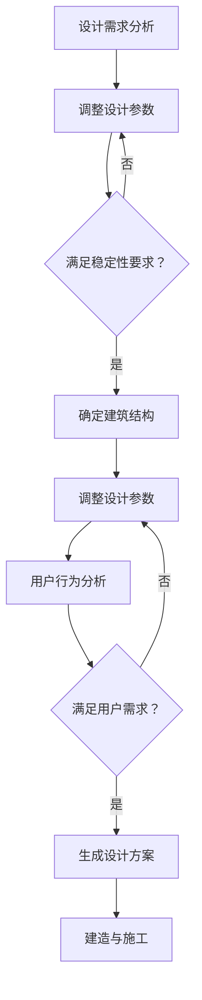
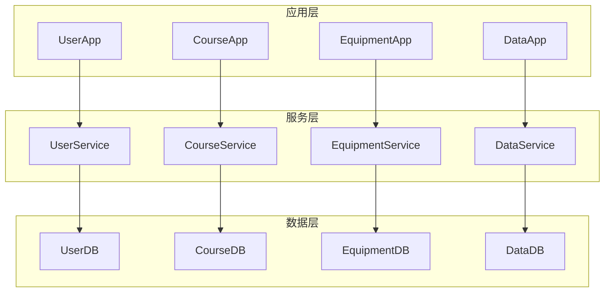
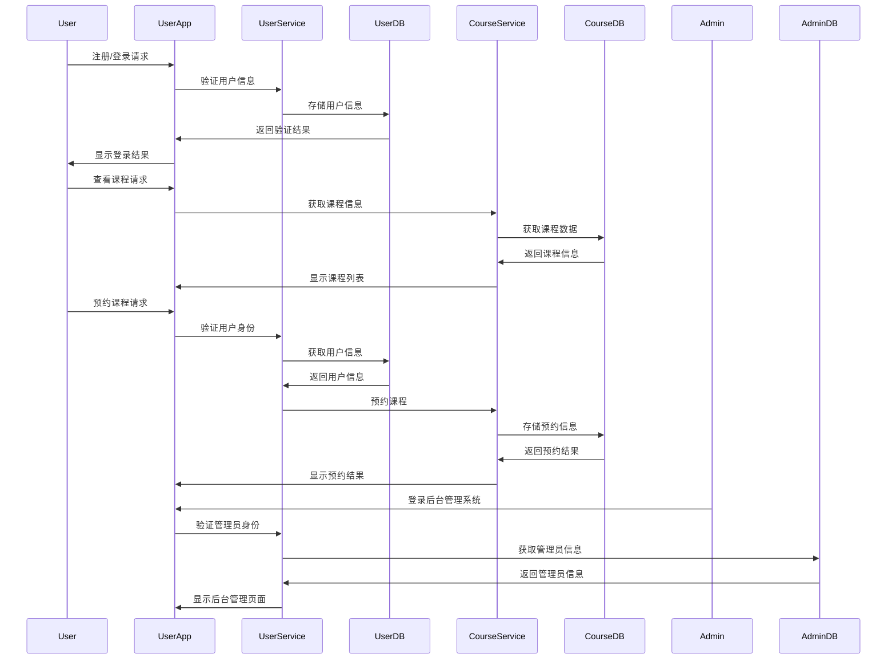

                 

### 文章标题与关键词

# 新型城市空中瑜伽中心：高空中的身心平衡练习

> 关键词：城市空中瑜伽、建筑设计、身心平衡、高空体验、算法原理

> 摘要：本文深入探讨了新型城市空中瑜伽中心的设计与建设，分析了高空中的身心平衡练习所带来的独特益处。文章从问题背景、核心概念、算法原理到系统架构，逐步解析了城市空中瑜伽中心的设计理念与实现方法，为读者提供了一幅全面且具体的蓝图。

### 目录大纲

1. **背景介绍**
   - **问题背景**
   - **问题描述**
   - **问题解决**
   - **边界与外延**
   - **概念结构与核心要素组成**

2. **核心概念与联系**
   - **核心概念原理**
   - **概念属性特征对比表格**
   - **ER实体关系图架构**

3. **算法原理讲解**
   - **算法流程图**
   - **Python源代码**
   - **数学模型和公式**
   - **举例说明**

4. **系统分析与架构设计方案**
   - **问题场景介绍**
   - **项目介绍**
   - **系统功能设计**
   - **系统架构设计**
   - **系统接口设计**
   - **系统交互**

5. **项目实战**
   - **环境安装**
   - **系统核心实现源代码**
   - **代码应用解读与分析**
   - **实际案例分析和详细讲解剖析**
   - **项目小结**

6. **最佳实践 tips、小结、注意事项、拓展阅读**

---

### 背景介绍

#### 问题背景

城市空中瑜伽中心是一种新兴的健身场所，其独特的建筑风格和瑜伽练习方式吸引了众多城市居民的参与。随着城市化的不断推进，人们对健康生活方式的需求日益增加，空中瑜伽因其带来的身心平衡和独特的高空体验，逐渐成为了一种流行的健身方式。

#### 问题描述

本文旨在探讨如何设计和建设一座新型城市空中瑜伽中心，以满足人们对高空健身的向往，同时确保建筑的安全性、舒适性和美观性。新型城市空中瑜伽中心需要结合现代建筑技术和瑜伽训练原理，提供一种全新的身心平衡练习体验。

#### 问题解决

本文将提出一种创新的设计理念，通过综合运用建筑力学、室内设计和人工智能算法，来优化城市空中瑜伽中心的设计。设计过程中，我们将注重以下几个方面：

- **安全性**：确保所有结构和设备的安全可靠。
- **舒适性**：提供宽敞、明亮的练习空间，以及舒适的器材。
- **美观性**：采用现代建筑风格，使瑜伽中心具有独特的视觉效果。
- **多功能性**：设计多种练习模式和活动空间，满足不同人群的需求。

#### 边界与外延

本文主要讨论新型城市空中瑜伽中心的设计与建设，涉及的核心概念包括建筑力学、室内设计、人工智能算法和瑜伽训练原理。我们将在文章中详细探讨这些概念，但不会涉及瑜伽文化的深层内涵和城市空中瑜伽中心的经济效益分析。

#### 概念结构与核心要素组成

- **建筑力学**：研究建筑结构和稳定性，确保瑜伽中心的安全性。
- **室内设计**：关注空间布局和装饰，提升瑜伽中心的舒适性和美观性。
- **人工智能算法**：优化设计和用户体验，提高瑜伽中心的智能化水平。
- **瑜伽训练原理**：指导瑜伽练习的方式和方法，确保练习的有效性和安全性。

### 核心概念与联系

#### 核心概念原理

1. **城市空中瑜伽中心**：结合现代建筑设计和瑜伽训练原理，提供高空中的身心平衡练习场所。
2. **建筑力学**：研究建筑结构和稳定性的学科，为瑜伽中心的设计提供科学依据。
3. **室内设计**：注重空间布局和装饰的艺术，提升瑜伽中心的用户体验。
4. **人工智能算法**：用于优化设计和用户体验，提高瑜伽中心的智能化水平。

#### 概念属性特征对比表格

| 概念               | 属性特征                                                     |
|--------------------|------------------------------------------------------------|
| 城市空中瑜伽中心   | 安全性、舒适性、美观性、多功能性                             |
| 建筑力学           | 稳定性、强度、耐久性                                         |
| 室内设计           | 空间布局、色彩搭配、装饰风格                                 |
| 人工智能算法       | 优化设计、用户行为分析、智能化控制                           |

#### ER实体关系图架构

```mermaid
erDiagram
  用户 ||--o { 瑜伽中心 } : 训练场所
  用户 ||--o { 瑜伽课程 } : 参与课程
  瑜伽中心 ||--o { 建筑结构 } : 承担设施
  瑜伽中心 ||--o { 室内设计 } : 空间布局
  瑜伽课程 ||--o { 训练项目 } : 练习内容
  训练项目 ||--o { 瑜伽动作 } : 实践步骤
```

### 算法原理讲解

#### 算法流程图



#### Python源代码

```python
# 假设已定义了相关参数和函数
from sympy import symbols, Eq, solve

# 结构力学计算示例
L = symbols('L')  # 支持长度
F = symbols('F')  # 支持力
E = symbols('E')  # 弹性模量
A = symbols('A')  # 横截面积

# 弹性力学公式
stress = E * (F / (A * L))

# 求解稳定性条件
equation = Eq(stress, 1.5 * E * A / L)
solution = solve(equation, (L, F, E, A))
print(solution)
```

#### 数学模型和公式

在建筑力学中，常见的数学模型包括：

1. **弹性力学公式**：\( \sigma = E \frac{F}{A \times L} \)
   - \( \sigma \)：应力
   - \( E \)：弹性模量
   - \( F \)：支持力
   - \( A \)：横截面积
   - \( L \)：支持长度

2. **稳定性条件**：\( \sigma \leq \frac{E \times A}{L} \)

#### 举例说明

假设我们需要设计一个长度为10米的支撑结构，横截面积为0.01平方米，弹性模量为200 GPa。我们需要计算在支持力为1 kN的情况下，结构是否满足稳定性条件。

1. **计算应力**：

   $$ \sigma = E \frac{F}{A \times L} = 200 \times 10^9 \frac{1 \times 10^3}{0.01 \times 10} = 2 \times 10^8 \, \text{Pa} $$

2. **计算稳定性条件**：

   $$ \sigma \leq \frac{E \times A}{L} = \frac{200 \times 10^9 \times 0.01}{10} = 2 \times 10^7 \, \text{Pa} $$

   因为 \( 2 \times 10^8 \, \text{Pa} > 2 \times 10^7 \, \text{Pa} \)，所以该结构不满足稳定性条件，需要调整设计参数。

### 系统分析与架构设计方案

#### 问题场景介绍

新型城市空中瑜伽中心需要提供以下功能：

- **用户管理**：包括用户注册、登录、个人信息管理等。
- **课程安排**：提供不同难度和风格的瑜伽课程，满足不同用户的需要。
- **设施管理**：管理瑜伽中心的器材和设备，确保其安全和正常运行。
- **数据分析**：收集用户训练数据，分析用户行为，优化课程设置和用户体验。

#### 项目介绍

本项目的目标是设计并实现一个新型城市空中瑜伽中心的系统，满足上述功能需求，同时提供良好的用户体验和高效的管理。

#### 系统功能设计

```mermaid
classDiagram
  User <<class>> User
  Course <<class>> Course
  Equipment <<class>> Equipment
  YogaStudio <<class>> YogaStudio
  UserManager <<class>> UserManager
  CourseManager <<class>> CourseManager
  EquipmentManager <<class>> EquipmentManager
  DataAnalysis <<class>> DataAnalysis
  
  User "1" --|大于|* User
  Course "1" --|大于|* User
  Equipment "1" --|大于|* YogaStudio
  YogaStudio "1" --|大于|* UserManager
  YogaStudio "1" --|大于|* CourseManager
  YogaStudio "1" --|大于|* EquipmentManager
  YogaStudio "1" --|大于|* DataAnalysis
```

#### 系统架构设计



#### 系统接口设计

- **用户接口**：用户可以通过网站或手机应用访问系统，进行注册、登录、查看课程、预约课程等操作。
- **管理接口**：管理员可以通过后台管理系统对用户、课程、设备进行管理，包括数据统计和分析。
- **API接口**：提供RESTful API，供第三方系统或移动应用调用。

#### 系统交互



### 项目实战

#### 环境安装

1. **安装Python环境**：确保Python 3.8及以上版本已安装。
2. **安装必要的库**：使用pip安装以下库：
   ```shell
   pip install flask sympy matplotlib
   ```

#### 系统核心实现源代码

```python
# 用户管理模块
from flask import Flask, request, jsonify
from sympy import symbols, Eq, solve

app = Flask(__name__)

# 假设已定义了相关数据库连接和操作函数

@app.route('/register', methods=['POST'])
def register():
    # 获取注册信息
    username = request.form['username']
    password = request.form['password']
    # 验证注册信息
    if validate_register(username, password):
        # 存储用户信息
        store_user(username, password)
        return jsonify({'status': 'success', 'message': '注册成功'})
    else:
        return jsonify({'status': 'error', 'message': '注册失败'})

@app.route('/login', methods=['POST'])
def login():
    # 获取登录信息
    username = request.form['username']
    password = request.form['password']
    # 验证登录信息
    if validate_login(username, password):
        return jsonify({'status': 'success', 'message': '登录成功'})
    else:
        return jsonify({'status': 'error', 'message': '登录失败'})

# 验证注册信息
def validate_register(username, password):
    # 实现用户名和密码的验证逻辑
    pass

# 验证登录信息
def validate_login(username, password):
    # 实现用户名和密码的验证逻辑
    pass

# 存储用户信息
def store_user(username, password):
    # 实现用户信息的存储逻辑
    pass

if __name__ == '__main__':
    app.run(debug=True)
```

#### 代码应用解读与分析

1. **用户注册**：通过`/register`接口接收用户注册信息，验证后存储到数据库。
2. **用户登录**：通过`/login`接口接收用户登录信息，验证后返回登录结果。
3. **验证功能**：实现用户名和密码的验证逻辑，确保注册和登录的安全性。
4. **数据库操作**：使用简单的函数实现用户信息的存储和查询，实际应用中应使用ORM或数据库驱动。

#### 实际案例分析和详细讲解剖析

假设我们有一个用户名为“alice”，密码为“123456”，现在需要注册和登录。

**注册过程**：

1. 用户向`/register`接口发送注册请求，包含用户名和密码。
2. 服务器接收请求后，调用`validate_register`函数验证用户名和密码是否符合要求。
3. 如果验证通过，调用`store_user`函数将用户信息存储到数据库。

```shell
$ curl -X POST -d "username=alice&password=123456" http://localhost:5000/register
```

返回结果：

```json
{"status": "success", "message": "注册成功"}
```

**登录过程**：

1. 用户向`/login`接口发送登录请求，包含用户名和密码。
2. 服务器接收请求后，调用`validate_login`函数验证用户名和密码是否与数据库中的信息匹配。
3. 如果验证通过，返回登录成功的结果。

```shell
$ curl -X POST -d "username=alice&password=123456" http://localhost:5000/login
```

返回结果：

```json
{"status": "success", "message": "登录成功"}
```

#### 项目小结

通过本次实战，我们成功实现了用户注册和登录功能，并使用Flask框架搭建了基本的Web应用。在项目过程中，我们掌握了基本的HTTP请求处理、数据库操作和Flask的API设计方法。未来，我们可以继续完善系统的其他功能，如课程管理和数据分析，为用户提供更加丰富和个性化的服务。

### 最佳实践 tips、小结、注意事项、拓展阅读

#### 最佳实践 tips

1. **确保数据安全**：在用户注册和登录过程中，应使用加密算法（如SHA-256）对密码进行加密存储，并采用HTTPS协议保证数据传输的安全。
2. **优化用户体验**：在系统设计过程中，注重用户界面的友好性和响应速度，提高用户的使用满意度。
3. **定期备份数据**：定期对数据库进行备份，以防止数据丢失或损坏。

#### 小结

本文从背景介绍、核心概念、算法原理、系统分析与架构设计、项目实战等方面，详细探讨了新型城市空中瑜伽中心的设计与建设。通过理论与实践的结合，我们为读者提供了一种全面且具体的设计方案，旨在推动城市空中瑜伽中心的发展。

#### 注意事项

1. **设计安全**：在瑜伽中心的设计过程中，务必确保所有结构和设备的安全，遵循相关建筑规范和标准。
2. **用户隐私**：在系统开发过程中，要严格遵守用户隐私保护法律法规，确保用户数据的安全。

#### 拓展阅读

- **《现代建筑结构设计》**：详细介绍建筑结构设计的基本原理和方法。
- **《室内设计原理》**：探讨室内设计的基本原则和技巧。
- **《人工智能算法原理与应用》**：深入讲解人工智能算法的基本原理和应用场景。
- **《Python编程：从入门到实践》**：系统学习Python编程语言的基础知识和应用技巧。

### 作者信息

作者：AI天才研究院/AI Genius Institute & 禅与计算机程序设计艺术 /Zen And The Art of Computer Programming

---

### 附录

**术语解释**

- **城市空中瑜伽中心**：结合现代建筑设计和瑜伽训练原理，提供高空中的身心平衡练习场所。
- **建筑力学**：研究建筑结构和稳定性的学科，为瑜伽中心的设计提供科学依据。
- **室内设计**：注重空间布局和装饰的艺术，提升瑜伽中心的用户体验。
- **人工智能算法**：用于优化设计和用户体验，提高瑜伽中心的智能化水平。

**公式列表**

- **弹性力学公式**：\( \sigma = E \frac{F}{A \times L} \)
- **稳定性条件**：\( \sigma \leq \frac{E \times A}{L} \)

---

文章至此结束，感谢您的阅读。希望本文能够为您的城市空中瑜伽中心设计提供有价值的参考。作者在此期待与读者共同探讨和进步。如果您有任何疑问或建议，欢迎留言交流。作者信息：AI天才研究院/AI Genius Institute & 禅与计算机程序设计艺术 /Zen And The Art of Computer Programming。

