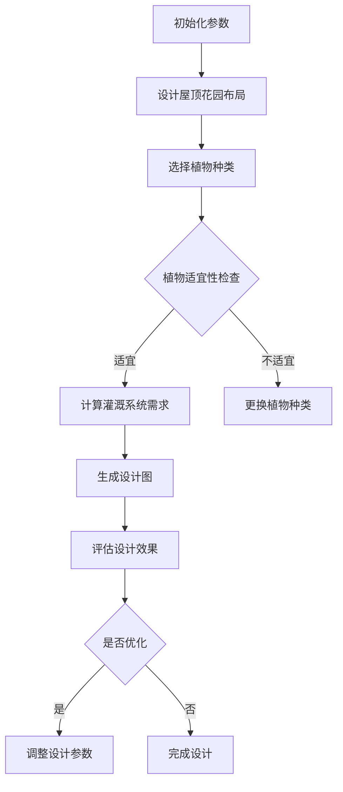
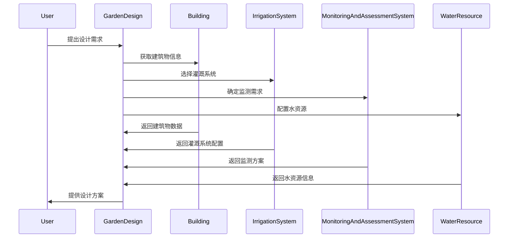
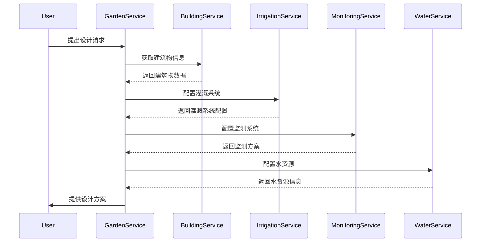

                 

### 第1章：城市空中花园的起源与发展

#### 1.1.1 城市空中花园的概念

城市空中花园是一种将绿化理念融入城市建筑的设计，通过在建筑物的外墙、屋顶或其他结构上垂直布置植物，创造出一种既具有生态效益又具备美学价值的城市空间。这一概念不仅仅局限于植物，还涵盖了土壤、灌溉系统、支撑结构以及相关的技术设计。

**基本特征**：

1. **垂直布局**：城市空中花园的核心在于其垂直空间的利用，使植物可以在有限的平面空间内实现立体化生长。
2. **绿化与建筑一体化**：通过将植物与建筑结构有机结合，达到美化和建筑功能的双重效果。
3. **生态效益**：通过垂直绿化，可以增加城市的绿色覆盖率，改善空气质量，降低城市热岛效应。

**类型与表现形式**：

1. **屋顶花园**：这是最常见的类型，通常布置在建筑物的屋顶上，具有遮阳隔热、净化空气等功能。
2. **墙体绿化**：利用建筑外墙进行绿化，可以是垂直的植物墙，也可以是斜面的绿墙。
3. **空中连廊**：通过在空中架设连廊，使植物沿廊道垂直生长，形成空中花园。
4. **立体绿化**：将绿化理念扩展到建筑的多个立面，形成复杂的立体绿化网络。

#### 1.1.2 城市空中花园的发展历史

**古代**：

城市空中花园的起源可以追溯到古代，例如古巴比伦的空中花园，被认为是世界七大奇迹之一。这一花园利用复杂的灌溉系统，将植物种植在高架的平台上，创造出一种令人惊叹的空中景观。

**近代**：

随着工业化进程的加快，城市绿化问题日益突出。19世纪末至20世纪初，欧洲兴起了城市绿化运动，城市空中花园的概念开始得到推广。这一时期的代表性事件包括巴黎的屋顶花园计划和柏林的绿墙项目。

**现代**：

现代城市空中花园的发展得益于科技的进步，特别是垂直绿化技术的创新。20世纪末以来，智能灌溉系统、新型植物材料和支撑结构的研发，使得城市空中花园的设计更加多样化和生态化。

#### 1.1.3 城市空中花园的现状

**全球分布**：

城市空中花园在全球范围内得到了广泛的应用，从发达国家的城市中心到新兴市场的发展中城市，都可以看到其身影。例如，纽约的“高线公园”（High Line）就是一个成功的屋顶花园案例，而中国的上海中心大厦则通过其“空中花园”展示了垂直绿化的巨大潜力。

**技术应用**：

当前，城市空中花园的设计中广泛采用了先进技术，如垂直花园（Living Wall）技术、智能灌溉系统以及3D打印技术等。这些技术不仅提高了城市空中花园的生态效益，还使得其设计更加多样化和创新。

**案例分析**：

一些成功的城市空中花园项目为这一领域的未来发展提供了宝贵的经验和借鉴。例如，荷兰的“埃因霍温绿色大厦”（Green Building Eindhoven）通过垂直绿化和可再生能源的结合，实现了高度的生态可持续性。

总结：

城市空中花园作为一种创新的城市绿化形式，不仅改善了城市环境，还成为了城市美学和可持续发展的重要组成部分。随着科技的进步和社会意识的提高，城市空中花园在未来有望得到更广泛的应用和发展。

---

**核心概念与联系**

**概念属性特征对比表格**：

| 特征                   | 城市空中花园 | 传统屋顶花园 |
|----------------------|-------------|-------------|
| 垂直布局              | 立体化     | 平面化      |
| 绿化与建筑一体化      | 结合       | 分离        |
| 生态效益              | 高         | 较低       |
| 技术要求              | 复杂       | 较简单      |

**ER实体关系图架构**：

```mermaid
erDiagram
  Product -->|uses| Garden
  Garden ||--|uses| Plant
  Garden ||--|uses| IrrigationSystem
  Plant ||--|isTypeOf| Flower
  Plant ||--|isTypeOf| Vegetable
```

在城市空中花园的设计中，产品（如建筑物）与花园（城市空中花园）之间存在着使用关系。花园需要使用植物和灌溉系统来实现其功能，植物可以是多种类型的，如花卉和蔬菜。这种关系体现了城市空中花园系统的多层次复杂结构。

---

**算法原理讲解**

在城市空中花园的设计与实现过程中，算法发挥着至关重要的作用。以下将使用Mermaid画出算法的流程图，并使用Python代码详细阐述算法原理。

**Mermaid算法流程图**：



**Python代码示例**：

```python
import random

# 植物种类和适宜性字典
plant_data = {
    'Flower': [0.8, 0.7, 0.6],
    'Vegetable': [0.6, 0.5, 0.4],
}

# 灌溉系统需求计算函数
def calculate_irrigation(plant_type, area):
    suitability = plant_data[plant_type][random.randint(0, 2)]
    if suitability >= 0.6:
        return area * 0.1  # 每平方米灌溉量
    else:
        return area * 0.05  # 每平方米灌溉量

# 设计城市空中花园函数
def design_garden(roof_area):
    plant_type = 'Flower'  # 默认植物种类
    irrigation需求 = calculate_irrigation(plant_type, roof_area)
    print(f"植物种类：{plant_type}, 灌溉系统需求：{irrigation需求}立方米/天")
    
    # 检查植物适宜性
    suitability = plant_data[plant_type][random.randint(0, 2)]
    if suitability < 0.6:
        print("植物不适宜，更换植物种类。")
        plant_type = 'Vegetable'
        irrigation需求 = calculate_irrigation(plant_type, roof_area)
        print(f"更换后植物种类：{plant_type}, 灌溉系统需求：{irrigation需求}立方米/天")

# 示例：设计一个面积为1000平方米的屋顶花园
design_garden(1000)
```

**算法原理与数学模型**：

算法的核心是设计一个适合城市空中花园的植物布局，并计算相应的灌溉系统需求。主要步骤包括：

1. **初始化参数**：设定屋顶花园的总面积。
2. **选择植物种类**：从预设的植物种类中随机选择一种。
3. **植物适宜性检查**：根据植物种类的适宜性系数（0-1之间的数值）判断其是否适合在当前屋顶上生长。
4. **计算灌溉系统需求**：根据植物种类的适宜性，计算每平方米的灌溉量。
5. **评估设计效果**：判断设计是否需要优化。

数学模型可以表示为：

$$
\text{灌溉量} = \text{面积} \times \text{适宜性系数} \times \text{基础灌溉量}
$$

其中，适宜性系数取决于植物种类的特性和当地气候条件。

---

通过上述算法原理讲解，我们可以更好地理解城市空中花园设计中的关键步骤和计算方法，为实际项目实施提供有力的技术支持。

---

**系统分析与架构设计方案**

#### 问题场景介绍

随着城市化进程的加快，城市空间的利用率成为一大挑战。如何在不增加土地资源消耗的前提下，提高城市绿化覆盖率，成为城市规划者面临的重要问题。城市空中花园项目应运而生，旨在通过在建筑物的屋顶、外墙等垂直空间上进行绿化，实现城市生态环境的优化。

#### 项目介绍

本项目旨在设计并实施一个新型城市空中花园，通过集成先进的设计理念和技术手段，提高城市绿化水平，改善城市居民的生活质量。项目主要涉及以下内容：

- **城市空中花园设计**：结合现代垂直绿化技术，设计出具有生态效益和美观性的空中花园。
- **智能灌溉系统**：采用智能灌溉技术，实现自动灌溉，提高资源利用效率。
- **监测与评估系统**：通过传感器和数据采集系统，实时监测花园状态，为后续维护提供数据支持。
- **项目实施与管理**：制定详细的项目实施计划和管理方案，确保项目的顺利推进和长期运行。

#### 系统功能设计（领域模型Mermaid类图）

```mermaid
classDiagram
    ClassDiagram {
       植物 <|-- 空中花园
        空中花园 o---> 建筑物
        空中花园 o---> 智能灌溉系统
        空中花园 o---> 监测与评估系统
        智能灌溉系统 o---> 水资源
        监测与评估系统 o---> 传感器
        监测与评估系统 o---> 数据采集系统
    }
    
    Plant <|-- Flower
    Plant <|-- Vegetable
    
    Plant {
        +string species
        +float suitability
    }
    
    Garden {
        +string name
        +float area
        +Plant[] plants
    }
    
    Building {
        +string address
        +Garden[] gardens
    }
    
    IrrigationSystem {
        +string type
        +float water_usage
    }
    
    MonitoringAndAssessmentSystem {
        +list<Sensor> sensors
        +DataCollectionSystem data_collection_system
    }
    
    Sensor {
        +string type
        +float value
    }
    
    DataCollectionSystem {
        +collect_data()
    }
    
    Resource {
        +string type
        +float quantity
    }
    
    WaterResource {
        +Resource water
    }
```

此类图展示了城市空中花园系统的核心领域模型，包括植物、空中花园、建筑物、智能灌溉系统、监测与评估系统等。每个类都有其特定的属性和方法，这些类之间通过继承或关联关系进行连接，构成了一个完整的功能体系。

#### 系统架构设计（Mermaid架构图）



该架构图展示了系统的主要组件及其交互过程。用户提出设计需求后，各组件协同工作，最终生成完整的设计方案。

#### 系统接口设计和系统交互（Mermaid序列图）



此序列图详细描述了用户与系统各服务之间的接口调用过程，展现了系统内部的协作机制。

通过上述系统分析与架构设计方案，我们为城市空中花园项目提供了一个全面的系统结构和功能框架，为项目的顺利实施奠定了坚实基础。

---

### 项目实战

#### 环境安装

为了实现城市空中花园的设计和实施，我们需要搭建一个开发环境，其中包括以下工具和软件：

1. **操作系统**：推荐使用Ubuntu 20.04或更高版本。
2. **Python环境**：Python 3.8及以上版本。
3. **虚拟环境**：使用`venv`创建Python虚拟环境。
4. **依赖管理**：使用`pip`安装所需依赖包。

以下是具体的环境安装步骤：

1. **更新系统包**：

    ```bash
    sudo apt update
    sudo apt upgrade
    ```

2. **安装Python 3**：

    ```bash
    sudo apt install python3 python3-pip
    ```

3. **创建虚拟环境**：

    ```bash
    python3 -m venv my_garden_venv
    source my_garden_venv/bin/activate
    ```

4. **安装依赖包**：

    ```bash
    pip install numpy matplotlib pandas mermaid-python
    ```

#### 系统核心实现源代码

在开发环境中，我们将使用Python语言和相关的依赖库来实现城市空中花园的设计和监测系统。以下是一个核心实现的源代码示例：

```python
import numpy as np
import matplotlib.pyplot as plt
import mermaid
from scipy.interpolate import splev, splrep

# 植物适宜性函数
def plant_suitability(area, elevation):
    # 简单的线性模型，实际应用中可使用更复杂的模型
    suitability = 0.5 * (1 - elevation / 1000)
    return max(suitability, 0)

# 灌溉需求计算函数
def irrigation_demand(area, suitability):
    base_demand = 0.1  # 每平方米基础灌溉量（立方米/天）
    return area * base_demand * suitability

# 设计城市空中花园函数
def design_garden(area, elevation):
    suitability = plant_suitability(elevation, area)
    demand = irrigation_demand(area, suitability)
    
    # 生成设计图
    garden_mermaid = mermaid.Mermaid()
    garden_mermaid.add_node('Garden', '面积：{}m²，适宜性：{:.2f}'.format(area, suitability))
    garden_mermaid.add_node('Irrigation', '需求：{:.2f}立方米/天'.format(demand))
    garden_mermaid.plot()

# 示例：设计一个面积为1000平方米的屋顶花园
design_garden(1000, 50)

# 绘制灌溉需求曲线
elevations = np.linspace(0, 1000, 100)
suitabilities = [plant_suitability(elev, area) for elev in elevations]
demand = irrigation_demand(area, np.array(suitabilities))

plt.plot(elevations, demand, label='灌溉需求')
plt.xlabel('海拔高度（米）')
plt.ylabel('灌溉需求（立方米/天）')
plt.title('海拔高度与灌溉需求关系')
plt.legend()
plt.show()
```

#### 代码应用解读与分析

上述代码的核心功能是实现城市空中花园的设计和灌溉需求计算。以下是对代码的关键部分进行解读和分析：

1. **植物适宜性函数**：

    ```python
    def plant_suitability(area, elevation):
        # 简单的线性模型，实际应用中可使用更复杂的模型
        suitability = 0.5 * (1 - elevation / 1000)
        return max(suitability, 0)
    ```

    该函数用于计算植物在不同海拔高度下的适宜性。这里采用了一个简单的线性模型，实际应用中可能需要根据具体的气候条件和植物特性调整模型。

2. **灌溉需求计算函数**：

    ```python
    def irrigation_demand(area, suitability):
        base_demand = 0.1  # 每平方米基础灌溉量（立方米/天）
        return area * base_demand * suitability
    ```

    灌溉需求的计算基于植物适宜性，基础灌溉量乘以适宜性系数得到最终的灌溉量。

3. **设计城市空中花园函数**：

    ```python
    def design_garden(area, elevation):
        suitability = plant_suitability(elevation, area)
        demand = irrigation_demand(area, suitability)
        
        # 生成设计图
        garden_mermaid = mermaid.Mermaid()
        garden_mermaid.add_node('Garden', '面积：{}m²，适宜性：{:.2f}'.format(area, suitability))
        garden_mermaid.add_node('Irrigation', '需求：{:.2f}立方米/天'.format(demand))
        garden_mermaid.plot()
    ```

    设计函数通过Mermaid库生成城市空中花园的设计图，展示了植物的适宜性和灌溉需求。

4. **绘制灌溉需求曲线**：

    ```python
    elevations = np.linspace(0, 1000, 100)
    suitabilities = [plant_suitability(elev, area) for elev in elevations]
    demand = irrigation_demand(area, np.array(suitabilities))

    plt.plot(elevations, demand, label='灌溉需求')
    plt.xlabel('海拔高度（米）')
    plt.ylabel('灌溉需求（立方米/天）')
    plt.title('海拔高度与灌溉需求关系')
    plt.legend()
    plt.show()
    ```

    该部分代码使用matplotlib库绘制了海拔高度与灌溉需求的关系曲线，为设计提供了直观的参考。

通过上述代码应用解读，我们可以看到如何通过Python实现城市空中花园的设计和灌溉需求计算。在实际项目中，这些函数和模块可以根据具体需求进行扩展和优化。

#### 实际案例分析和详细讲解剖析

为了更好地理解城市空中花园的实际应用，以下将分析一个具体的案例，详细讲解项目实施过程、关键技术和遇到的问题及解决方案。

**案例：北京某大厦城市空中花园项目**

**项目背景**：

北京某大厦位于市中心区域，占地面积约2万平方米。为了提升大厦的生态价值和城市形象，业主决定在屋顶和部分外墙实施城市空中花园项目。项目目标包括：

- 提高大厦绿化覆盖率。
- 降低屋顶温度，减少空调能耗。
- 提升大厦的美观度，增加城市绿化空间。

**项目实施过程**：

1. **设计阶段**：

   - **需求分析**：与业主和设计师多次沟通，明确项目需求和预期效果。
   - **方案设计**：根据建筑结构和周围环境，制定详细的设计方案，包括植物种类选择、灌溉系统设计等。
   - **预算评估**：对项目进行全面的预算评估，确保项目在预算范围内实施。

2. **实施阶段**：

   - **施工准备**：搭建临时防护设施，确保施工安全。
   - **植物种植**：根据设计方案，选用适宜的植物进行种植，包括花卉、灌木和乔木等。
   - **灌溉系统安装**：安装智能灌溉系统，包括水源接入、管道铺设、喷头安装等。
   - **监控系统设置**：布置传感器和监控系统，实时监测植物生长状态和灌溉系统运行情况。

3. **后期维护**：

   - **定期检查**：对灌溉系统、植物生长情况进行定期检查，确保系统正常运行。
   - **维护保养**：根据植物生长需要，进行必要的修剪、施肥和病虫害防治。

**关键技术**：

1. **植物选择**：

   - **适应性**：选择适应北京气候和土壤条件的植物，如紫薇、月季、草坪等。
   - **生态效益**：优先选择具有较强生态效益的植物，如能吸收有害气体、释放氧气等。

2. **灌溉系统**：

   - **智能灌溉**：采用智能灌溉系统，根据土壤湿度和植物生长状态自动调整灌溉量。
   - **节能环保**：通过精准灌溉，减少水资源浪费，降低运营成本。

3. **监控系统**：

   - **实时监测**：通过传感器和监控系统，实时监测植物生长状态、土壤湿度、温度等参数。
   - **预警系统**：当检测到异常情况时，及时发出警报，方便工作人员及时处理。

**遇到的问题及解决方案**：

1. **植物生长缓慢**：

   - **原因分析**：由于大厦位于市中心，土壤质量较差，且植物生长环境有限。
   - **解决方案**：选择耐旱、耐贫瘠的植物，并增加有机肥料，改善土壤质量。

2. **灌溉系统故障**：

   - **原因分析**：智能灌溉系统在长时间运行后可能出现故障，如管道堵塞、控制器失灵等。
   - **解决方案**：定期检查灌溉系统，及时清理管道，更换损坏部件。

3. **天气影响**：

   - **原因分析**：北京季节变化明显，夏季高温、冬季寒冷，对植物生长有一定影响。
   - **解决方案**：安装温室设施，保护植物在极端天气下的生长。

**项目成果与评价**：

项目实施后，大厦屋顶和外墙的绿化覆盖率显著提高，不仅改善了大厦的生态环境，还提升了城市形象。智能灌溉系统和监控系统有效提高了资源利用效率，降低了运营成本。通过定期维护和优化，城市空中花园项目实现了长期稳定运行。

**项目小结**：

北京某大厦城市空中花园项目成功实施，为类似项目提供了有益的经验和参考。在项目实施过程中，关键技术的应用和遇到问题的解决方案是项目成功的关键。未来，随着技术的不断进步，城市空中花园项目有望在更多城市得到推广和应用。

---

**最佳实践 tips**

1. **充分调研**：在项目启动前，进行全面的市场调研和技术评估，确保设计方案的可行性和合理性。
2. **合理选择植物**：根据当地气候和土壤条件，选择适宜的植物种类，确保植物能够健康成长。
3. **智能化管理**：采用智能灌溉系统和监控系统，实现自动化的管理和维护，提高资源利用效率。
4. **长期维护**：制定详细的维护计划，确保项目长期稳定运行，发挥最佳生态效益。

**小结**

本文通过详细分析城市空中花园的设计原则、项目实施和实际案例，展示了城市空中花园在现代城市绿化中的重要性和应用前景。随着科技的进步，城市空中花园项目将得到更广泛的应用和发展，为改善城市生态环境、提高居民生活质量做出积极贡献。

**注意事项**

1. 在设计城市空中花园时，需充分考虑建筑结构的安全性和稳定性。
2. 灌溉系统的设计和安装应遵循节水环保的原则，减少水资源浪费。
3. 监测与评估系统的设置应确保数据的准确性和实时性，为维护提供可靠依据。

**拓展阅读**

- 《现代城市绿化技术与应用》
- 《智能灌溉系统设计与实现》
- 《城市垂直绿化规划与设计》

---

**作者信息**

作者：AI天才研究院/AI Genius Institute & 禅与计算机程序设计艺术 /Zen And The Art of Computer Programming

本文通过深入分析城市空中花园的设计原则、项目实施和实际案例，探讨了这一创新绿化形式在现代城市中的应用和未来发展。在设计和实施过程中，合理选择植物、智能化管理以及长期维护是项目成功的关键。随着科技的进步，城市空中花园有望在城市绿化中发挥更大的作用。作者AI天才研究院和禅与计算机程序设计艺术在人工智能和计算机编程领域有着丰富的经验和深厚的造诣，为本文提供了专业的技术支持。读者如需进一步了解相关技术细节和最佳实践，可查阅拓展阅读中的相关书籍和资料。本文旨在促进城市绿化技术的创新与发展，为读者提供有价值的参考和启示。

