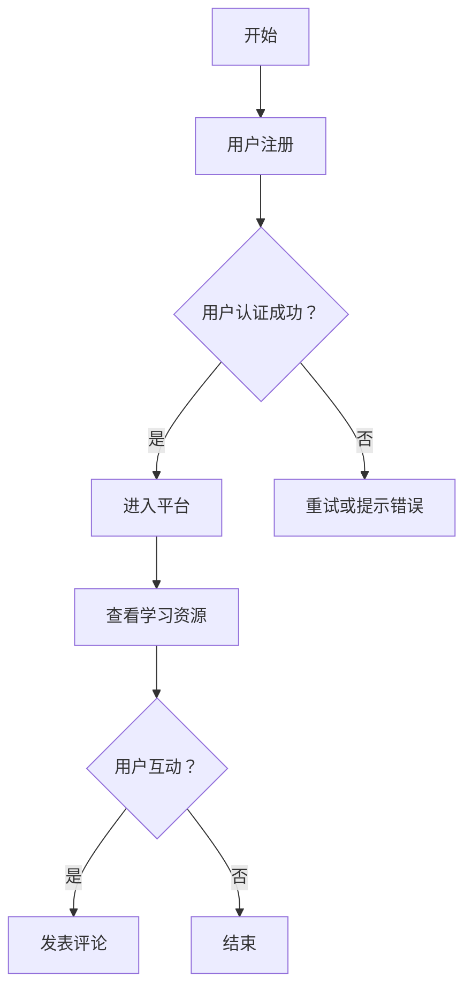

                 


## 文章标题：新型城市终身学习中心：跨年龄段知识共享的社区平台

### 关键词：终身学习、城市学习、知识共享、社区平台、跨年龄段

### 摘要：
本文旨在探讨新型城市终身学习中心的设计与实施，特别是其作为跨年龄段知识共享社区平台的优势。通过对平台的核心概念、设计理念、技术实现、跨年龄段知识共享策略以及运营与可持续发展路径的深入分析，本文力图为构建一个高效、可持续、用户友好的终身学习社区提供理论指导和实践参考。

---

## 第一部分：绪论

### 1.1 问题背景

#### 1.1.1 城市终身学习的必要性
- 随着知识经济的快速发展，城市居民对于终身学习的需求日益增长。
- 终身学习不仅是个人发展的需要，也是城市竞争力提升的关键因素。

#### 1.1.2 传统终身学习中心的局限性
- 空间限制：传统学习中心往往受制于物理空间，无法满足日益增长的参与者需求。
- 年龄限制：传统学习中心大多针对某一特定年龄段，缺乏跨年龄段交流和学习的机会。
- 资源共享性差：传统学习中心资源利用效率较低，难以实现最大化的知识共享。

#### 1.1.3 新型城市终身学习中心的概念
- 新型城市终身学习中心是一个集知识传播、资源共享、社交互动于一体的综合性平台。
- 平台旨在打破年龄、空间和资源的限制，为城市居民提供灵活、多样化的学习体验。

### 1.2 研究目标与意义

#### 1.2.1 研究目标
- 设计并实现一个新型城市终身学习中心社区平台原型。
- 探讨跨年龄段知识共享的有效策略，提升平台用户体验。

#### 1.2.2 研究意义
- 为城市终身学习提供创新模式，促进知识传播和人才培养。
- 为跨年龄段社交和知识共享提供实践参考，提升社会凝聚力。

### 1.3 研究方法与结构安排

#### 1.3.1 研究方法
- 采用系统分析方法，从需求分析、平台设计到实现和评估进行深入探讨。
- 结合案例研究，对新型城市终身学习中心的应用进行实证分析。

#### 1.3.2 结构安排
- 本论文分为五部分，分别探讨平台的设计、实施、知识共享策略、运营以及未来展望。

### 1.4 边界与外延

#### 1.4.1 研究边界
- 本文聚焦于新型城市终身学习中心的设计与实施，不包括政策层面和具体商业化应用。

#### 1.4.2 研究外延
- 本文成果可应用于各类城市终身学习中心，为社区平台建设提供参考。

### 1.5 本章小结
- 本章对新型城市终身学习中心的概念和背景进行了介绍，明确了研究的目标与意义，为后续章节的探讨奠定了基础。

---

## 第二部分：新型城市终身学习中心的构建

### 2.1 核心概念与联系

#### 2.1.1 核心概念
- **终身学习**：指个体在整个生命过程中持续获取知识、技能和价值观的过程。
- **城市学习**：指在城市环境中进行的学习活动，强调城市资源和设施的充分利用。
- **知识共享**：指在社区或组织中，个体之间共享知识和信息的过程。
- **社区平台**：指为社区成员提供交流、互动和资源共享的网络平台。

#### 2.1.2 概念属性特征对比表格
| 概念       | 定义                                               | 属性特征                                                     |
|------------|----------------------------------------------------|------------------------------------------------------------|
| 终身学习   | 整个生命过程中的知识获取                           | 持续性、个体差异性、灵活性、个性化                           |
| 城市学习   | 利用城市环境和资源进行学习                         | 空间多样性、资源丰富性、互动性、社区依赖性                   |
| 知识共享   | 知识和信息在社区成员间的交换                       | 共享性、互助性、开放性、互动性                             |
| 社区平台   | 提供社区成员互动和资源共享的网络平台               | 可访问性、互动性、透明性、安全性                           |

#### 2.1.3 ER实体关系图架构

```mermaid
erDiagram
    User ||--|{ LearningResource }
    User ||--|{ Interaction }
    User ||--|{ CommunityEvent }
    LearningResource ||--|{ ResourceCategory }
    Interaction ||--|{ Comment }
    Interaction ||--|{ Rating }
    CommunityEvent ||--|{ Participant }
```

### 2.2 平台设计与实现

#### 2.2.1 平台架构设计

##### 2.2.1.1 技术架构
- **前端**：采用React框架，提供动态、响应式的用户界面。
- **后端**：使用Spring Boot框架，实现业务逻辑和数据处理。

##### 2.2.1.2 数据架构
- **关系数据库**：使用MySQL存储用户、学习资源、互动和活动数据。
- **NoSQL数据库**：使用MongoDB存储非结构化数据，如用户生成的评论和标签。

#### 2.2.2 界面设计与用户体验
- **简洁美观**：界面设计注重简洁性和美观性，提高用户的使用舒适度。
- **个性化**：根据用户行为和偏好，提供个性化的学习资源推荐。

#### 2.2.3 功能模块设计

##### 2.2.3.1 用户注册与认证
- 支持邮箱、手机号和社交媒体账号注册，保障用户隐私安全。

##### 2.2.3.2 学习资源管理
- 提供资源上传、分类、标签化功能，方便用户查找和使用。

##### 2.2.3.3 知识共享与互动
- 支持评论、点赞、分享等功能，促进用户之间的知识交流。

##### 2.2.3.4 数据分析与反馈
- 利用数据分析，为用户提供学习报告和推荐，优化用户体验。

### 2.3 技术实现原理

#### 2.3.1 技术选型

##### 2.3.1.1 前端技术
- **React**：用于构建用户界面，提供组件化开发。
- **Ant Design**：用于UI组件库，提高开发效率。

##### 2.3.1.2 后端技术
- **Spring Boot**：用于快速构建后端服务，支持多种编程语言。
- **Spring Security**：用于用户认证和授权，保障平台安全。

##### 2.3.1.3 数据存储技术
- **MySQL**：用于结构化数据存储，提供高性能和可靠性。
- **MongoDB**：用于非结构化数据存储，提供灵活性和扩展性。

#### 2.3.2 算法原理讲解

##### 2.3.2.1 推荐算法
- 使用协同过滤算法，根据用户的历史行为推荐学习资源。

##### 2.3.2.2 安全加密
- 使用SSL/TLS协议，确保用户数据在传输过程中的安全。

#### 2.3.3 Mermaid流程图示例



### 2.4 本章小结
- 本章详细介绍了新型城市终身学习中心的平台设计和技术实现，为后续知识共享和运营策略提供了基础。

---

## 第三部分：跨年龄段知识共享

### 3.1 跨年龄段知识共享的重要性

#### 3.1.1 跨年龄段学习的优势
- **经验互补**：不同年龄段的人拥有不同的经验和知识，可以相互学习，实现知识互补。
- **思维多样性**：跨年龄段的学习可以带来不同的思维方式和观点，促进创新和创造力。

#### 3.1.2 跨年龄段知识共享的价值
- **社会凝聚力**：促进不同年龄群体之间的交流与合作，增强社会凝聚力。
- **知识传承**：老年人可以传授生活经验和传统知识，年轻人可以学习新的科技和文化。

### 3.2 跨年龄段用户需求分析

#### 3.2.1 不同年龄段的学习需求
- **青少年**：注重知识普及和技能培养，追求新鲜事物和兴趣爱好。
- **成年人**：关注职业发展和专业技能提升，寻求实用性和可操作性。
- **老年人**：追求健康养生和生活质量的提高，需要心理支持和社交互动。

#### 3.2.2 用户行为模式分析
- **青少年**：活泼好动，喜欢线上互动和社交，对学习内容有强烈的好奇心。
- **成年人**：相对理性，重视学习成果和实用性，倾向于自学和自我管理。
- **老年人**：习惯面对面交流，注重情感支持和人际互动，对学习内容有较高的选择性。

### 3.3 知识共享策略

#### 3.3.1 知识分类与标签化
- 对学习资源进行科学分类和标签化，便于用户快速查找和利用。

#### 3.3.2 知识推荐系统设计
- 基于用户行为和偏好，利用推荐算法为用户推荐合适的学习资源。

#### 3.3.3 社区互动与参与机制
- 设计多样化的互动形式，鼓励用户参与社区讨论和知识分享。

### 3.4 实施案例

#### 3.4.1 案例一：城市青少年学习中心
- 结合线上平台和线下活动，提供丰富多彩的青少年学习资源和服务。

#### 3.4.2 案例二：老年大学社区中心
- 通过定期课程和活动，为老年人提供健康养生、社交互动和学习提升的机会。

#### 3.4.3 案例三：跨界知识交流平台
- 促进不同领域和行业之间的知识交流，激发创新思维和跨界合作。

### 3.5 本章小结
- 本章探讨了跨年龄段知识共享的重要性、用户需求分析以及实施策略，为新型城市终身学习中心的构建提供了实践指导。

---

## 第四部分：社区平台的运营与可持续发展

### 4.1 平台运营策略

#### 4.1.1 资源整合与协同
- 整合城市各类教育资源，实现资源的高效利用和共享。

#### 4.1.2 用户教育与引导
- 提供用户教育和服务，提升用户的使用体验和满意度。

#### 4.1.3 社区管理规范制定
- 制定社区管理规范，维护社区秩序和用户权益。

### 4.2 营收模式探索

#### 4.2.1 免费与收费模式
- 针对不同用户群体，提供免费和收费服务，实现可持续发展。

#### 4.2.2 商业化合作
- 与企业合作，开展定制化培训和知识服务，拓展收入来源。

#### 4.2.3 社区众筹
- 启动社区众筹项目，筹集资金支持平台建设和运营。

### 4.3 可持续发展路径

#### 4.3.1 平台迭代与升级
- 持续优化平台功能和服务，提升用户体验。

#### 4.3.2 社区文化建设
- 建立积极向上的社区文化，增强用户的归属感和参与感。

#### 4.3.3 社会责任与影响力
- 承担社会责任，提升平台的社会影响力，推动终身学习社区的建设。

### 4.4 本章小结
- 本章提出了新型城市终身学习中心社区平台的运营策略和可持续发展路径，为平台的长期发展提供了方向。

---

## 第五部分：未来展望与挑战

### 5.1 新技术的影响与机遇

#### 5.1.1 人工智能
- 人工智能技术将在平台中发挥重要作用，包括个性化推荐、智能客服和数据分析。

#### 5.1.2 虚拟现实和增强现实
- 虚拟现实和增强现实技术将为用户提供沉浸式学习体验，提升学习效果。

#### 5.1.3 大数据和区块链
- 大数据技术将用于用户行为分析和资源优化，区块链技术将确保知识共享的安全性和透明性。

### 5.2 挑战与应对策略

#### 5.2.1 技术挑战
- 如何高效地处理海量数据，提供实时、准确的推荐和服务。
- 如何确保平台的安全性，保护用户隐私和数据安全。

#### 5.2.2 运营挑战
- 如何吸引和保留用户，提高用户活跃度。
- 如何平衡免费与收费模式，实现可持续运营。

#### 5.2.3 社会挑战
- 如何应对社会对终身学习的期望，提供高质量的教育资源和服务。
- 如何在跨年龄段用户中建立有效的沟通和互动机制。

### 5.3 未来展望
- 新型城市终身学习中心将成为城市居民终身学习的核心平台，推动知识共享和社会进步。

### 5.4 本章小结
- 本章分析了新型城市终身学习中心面临的未来机遇与挑战，为平台的持续发展提供了方向和建议。

---

### 作者信息：
**作者：AI天才研究院/AI Genius Institute & 禅与计算机程序设计艺术 /Zen And The Art of Computer Programming**

