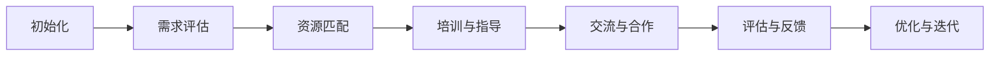
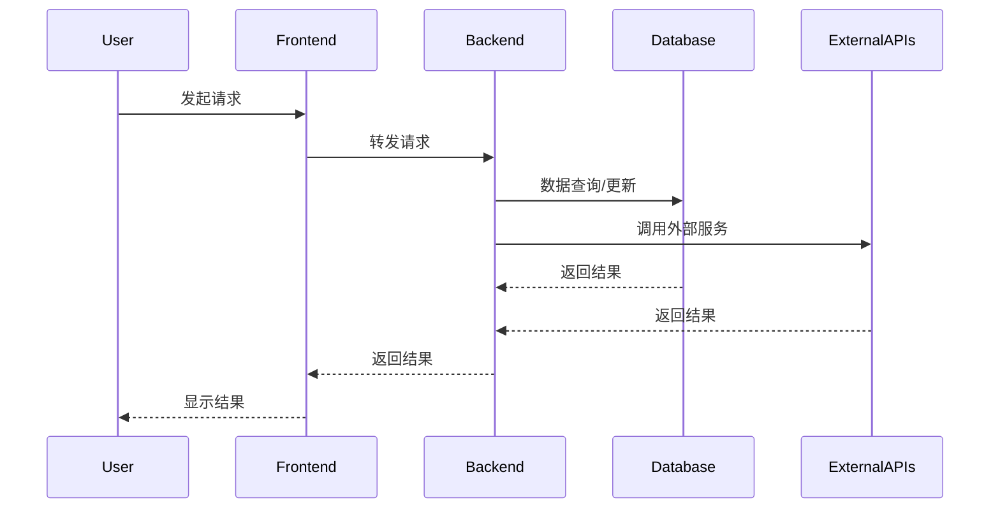
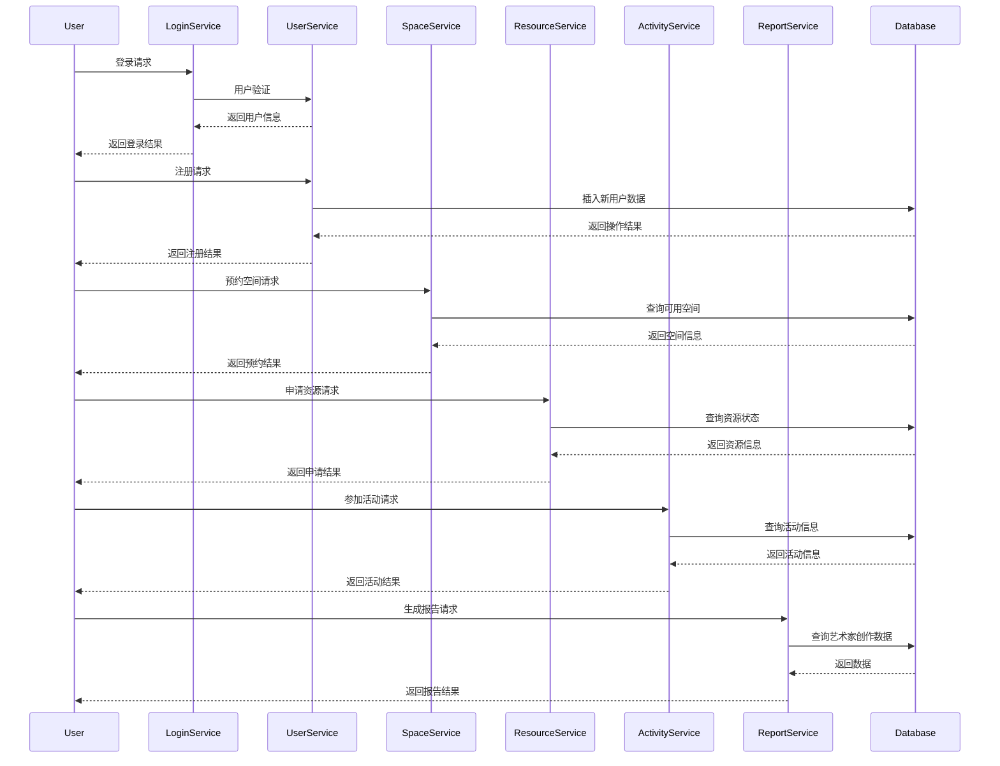
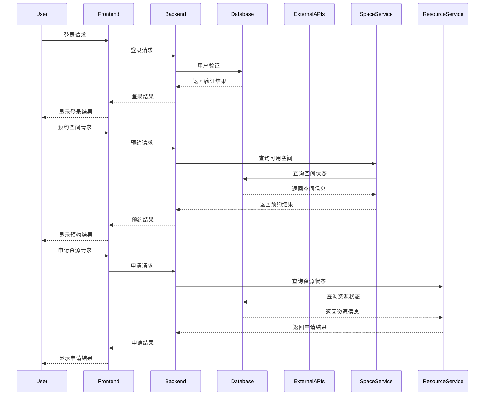

                 

### 项目背景与概述

#### 第1章: 项目概述

## 第1章: 项目概述

### 1.1 项目背景

#### 1.1.1 城市艺术家的崛起与需求

随着城市化进程的加速和现代生活节奏的加快，城市艺术家的角色正逐渐崛起。他们不仅是艺术创作的践行者，更是城市文化的传播者和推动者。城市艺术家以独特的视角和表现形式，反映着城市的变迁、居民的情感和社区的文化多样性。然而，传统艺术生态系统往往缺乏对城市艺术家的支持，导致他们的创作资源有限、发展空间受限。因此，如何有效地支持城市艺术家的成长和发展，成为了一个亟待解决的问题。

#### 1.1.2 residency项目的概念与意义

艺术家residency项目，即艺术家驻留计划，是一种为艺术家提供空间、资源、资金等支持，使其能够在一个相对封闭的环境中专注于创作和研究的项目。这种项目不仅能够为艺术家提供必要的创作条件，还能够促进艺术家之间的交流与合作，推动艺术创作的多样性和创新性。在全球范围内，许多文化机构和艺术组织已经成功开展了各种艺术家residency项目，为艺术家提供了宝贵的发展机会。

#### 1.1.3 跨界创作的重要性

跨界创作，即不同领域之间的创作交流和融合，已经成为当代艺术发展的重要趋势。通过跨界创作，艺术家可以借鉴其他领域的理念和技术，创造出具有跨领域融合特色的作品。这种创作方式不仅能够丰富艺术的表现形式，还能够激发艺术家的创造力和创新精神。在现代社会，跨界创作已经成为艺术家拓宽视野、提升创作水平的重要途径。

### 1.2 社区孵化的理念与实践

#### 1.2.1 社区孵化的定义

社区孵化，是指通过提供空间、资源、培训、指导等支持，帮助初创企业和创业者成长的过程。它强调社区成员之间的互动和合作，以形成一个支持性强的创业生态系统。在艺术领域，社区孵化则是指通过类似的机制，支持城市艺术家的创作和发展。

#### 1.2.2 社区孵化在艺术领域的应用

在艺术领域，社区孵化计划可以为城市艺术家提供创作空间、展览机会、资金支持、技术培训等资源。通过这些支持，艺术家可以在一个相对自由和开放的环境中，探索新的创作方向和表现形式。同时，社区孵化计划还可以促进艺术家之间的交流和合作，形成一个互相学习和支持的艺术社群。

#### 1.2.3 社区孵化的关键要素

社区孵化的成功离不开以下几个关键要素：

1. **空间支持**：提供一个安全、舒适、有利于创作的空间，是社区孵化计划的基础。
2. **资源支持**：包括资金、技术、设备等资源，是艺术家创作的重要保障。
3. **培训与指导**：提供专业培训和指导，帮助艺术家提升创作技能和商业运营能力。
4. **社区互动**：鼓励艺术家之间的交流与合作，形成一个互相学习、互相支持的社群。
5. **品牌推广**：通过展览、演出、出版等方式，帮助艺术家提升知名度，扩大影响力。

### 1.3 新型城市艺术家residency项目的定位与目标

#### 1.3.1 项目定位

新型城市艺术家residency项目旨在为城市艺术家提供一个全面的支持平台，使其能够在城市文化生态系统中发挥更大的作用。该项目不仅关注艺术创作的质量，还注重艺术家的个人成长和社区发展。

#### 1.3.2 项目目标

1. **支持城市艺术家的创作**：为艺术家提供必要的创作条件和资源，帮助其实现艺术创作和自我表达。
2. **促进跨界创作**：鼓励艺术家跨界合作，推动艺术创作的创新和发展。
3. **打造艺术社区**：建立一个支持性强、互动性好的艺术社区，促进艺术家之间的交流和合作。
4. **提升城市文化影响力**：通过艺术家的创作和活动，提升城市的文化影响力和知名度。

### 1.4 项目的重要性与影响力

新型城市艺术家residency项目不仅对城市艺术家的个人成长具有重要意义，还对城市文化的发展和社会进步具有深远的影响。

#### 1.4.1 对艺术家的影响

1. **提升创作水平**：通过提供创作资源和培训指导，帮助艺术家提升创作技能和艺术水平。
2. **拓宽创作视野**：通过跨界创作和社区互动，使艺术家能够借鉴其他领域的理念和经验，拓宽创作视野。
3. **增强自信心和成就感**：通过展览、演出、出版等活动，使艺术家能够得到更多的认可和成就感。

#### 1.4.2 对城市文化的影响

1. **丰富城市文化内涵**：通过艺术家的创作和活动，丰富城市文化的内涵和表现形式。
2. **提升城市文化软实力**：通过艺术家的创作和推广，提升城市的文化影响力和软实力。
3. **促进城市文化多样性**：通过鼓励跨界创作和社区互动，促进城市文化的多样性和包容性。

#### 1.4.3 对社会的影响

1. **推动文化产业发展**：通过艺术家的创作和活动，促进文化产业的发展，创造更多的就业机会。
2. **提升公众审美水平**：通过艺术展览、演出等活动，提升公众的审美水平和文化素养。
3. **促进社会和谐与进步**：通过艺术家的创作和传播，促进社会和谐与进步，增强社会凝聚力。

综上所述，新型城市艺术家residency项目不仅是一个艺术创作和支持的平台，更是一个跨界融合、社区互动、文化创新的重要实践。它对艺术家个人成长、城市文化发展和社会进步都具有重要意义。

### 关键词

- 城市艺术家
- residency项目
- 跨界创作
- 社区孵化
- 艺术创作
- 艺术社区
- 文化多样性

### 摘要

本文探讨了新型城市艺术家residency项目：跨界创作的社区孵化计划。项目旨在为城市艺术家提供一个全面的支持平台，通过跨界创作和社区互动，促进艺术家的个人成长和城市文化的发展。文章首先介绍了城市艺术家的崛起与需求、residency项目的概念与意义，以及跨界创作的重要性。随后，详细阐述了社区孵化的理念与实践，以及新型城市艺术家residency项目的定位与目标。文章还分析了项目的重要性与影响力，包括对艺术家个人成长、城市文化发展和社会进步的推动作用。最后，关键词和摘要部分总结了文章的核心内容和主题思想。通过这篇文章，读者可以全面了解新型城市艺术家residency项目的背景、目的和意义，以及其在艺术创作和文化发展中的重要作用。

---

### 核心概念与联系

#### 第2章: 核心概念与联系

在探讨新型城市艺术家residency项目：跨界创作的社区孵化计划时，理解项目中的核心概念和它们之间的联系至关重要。本章将详细阐述跨界创作、社区孵化计划以及艺术家residency项目这三个核心概念，并使用表格和Mermaid ER实体关系图来展示它们之间的关系。

## 第2章: 核心概念与联系

### 2.1 跨界创作的概念

#### 2.1.1 跨界创作的定义

跨界创作，是指艺术家在创作过程中跨越传统艺术领域，融合不同艺术形式、文化背景或学科领域的创作行为。这种创作方式不仅丰富了艺术的表现手法，还拓宽了艺术家的视野和思维方式。

#### 2.1.2 跨界创作的特点

1. **多样性**：跨界创作具有多样性，能够融合不同领域、不同文化背景和不同艺术形式。
2. **创新性**：跨界创作鼓励创新，通过不同领域的交融，产生新的艺术表现形式和理念。
3. **挑战性**：跨界创作往往面临跨领域的知识和技术挑战，需要艺术家具备较强的综合能力和跨学科素养。

#### 2.1.3 跨界创作与传统创作的对比

| 对比项 | 跨界创作 | 传统创作 |
| --- | --- | --- |
| **表现形式** | 多样化，融合多种艺术形式 | 单一，传统艺术形式如绘画、雕塑等 |
| **创作理念** | 突破传统，创新性强 | 基于传统，注重传承与延续 |
| **技术要求** | 需要跨学科知识，挑战性大 | 专业性强，技术要求固定 |
| **受众群体** | 广泛，吸引多元文化背景的观众 | 专业，特定艺术领域的爱好者 |

### 2.2 社区孵化计划

#### 2.2.1 社区孵化计划的概念

社区孵化计划，是指通过提供空间、资源、培训、指导等支持，帮助初创企业和创业者成长的过程。在艺术领域，社区孵化计划则是指通过类似的机制，支持城市艺术家的创作和发展。

#### 2.2.2 社区孵化计划的目标与策略

1. **目标**：
   - 支持艺术家的创作和发展。
   - 促进艺术家的交流和合作。
   - 提高艺术家的市场竞争力。

2. **策略**：
   - 提供创作空间和资源支持。
   - 开展艺术培训和技术指导。
   - 组织艺术展览和交流活动。
   - 推动跨界创作，拓宽艺术家视野。

#### 2.2.3 社区孵化计划的实施流程

1. **需求评估**：了解艺术家的创作需求和发展目标。
2. **资源匹配**：根据艺术家需求，提供相应的创作空间、资金、技术支持等。
3. **培训与指导**：提供专业培训和指导，帮助艺术家提升创作技能和商业运营能力。
4. **交流和合作**：组织艺术家之间的交流合作活动，促进跨界创作和创新。
5. **评估与反馈**：定期对孵化效果进行评估，收集艺术家反馈，不断优化孵化计划。

### 2.3 艺术家residency项目

#### 2.3.1 艺术家residency项目的定义

艺术家residency项目，即艺术家驻留计划，是一种为艺术家提供空间、资源、资金等支持，使其能够在一个相对封闭的环境中专注于创作和研究的项目。

#### 2.3.2 艺术家residency项目的内容与形式

1. **内容**：
   - 提供创作空间和设备。
   - 提供资金和奖学金支持。
   - 提供研究资源和图书资料。
   - 提供展览和演出机会。

2. **形式**：
   - 驻留项目：艺术家在特定地点进行创作和研究，通常有固定的时间和空间限制。
   - 工作室项目：为艺术家提供长期或短期的创作空间，使其能够自由地开展创作活动。
   - 联合项目：与其他艺术机构、大学或研究机构合作，为艺术家提供更广泛的资源和合作机会。

#### 2.3.3 艺术家residency项目的影响力

1. **对艺术家的影响**：
   - 提供创作资源和条件，帮助艺术家实现创作梦想。
   - 促进艺术家之间的交流和合作，提升创作水平。
   - 提供展览和演出机会，提升艺术家知名度和影响力。

2. **对社会的影响**：
   - 促进艺术创作和文化的多样性。
   - 推动艺术产业的发展，创造就业机会。
   - 提升社会文化素质和艺术审美水平。

### 2.4 核心概念之间的关系

#### 跨界创作与社区孵化计划

跨界创作是社区孵化计划的重要一环，通过跨界创作，艺术家能够在社区孵化计划的支持下，实现创作的创新和发展。社区孵化计划为艺术家提供跨界创作所需的空间、资源和支持，从而促进艺术家的创作和成长。

#### 跨界创作与艺术家residency项目

艺术家residency项目为跨界创作提供了良好的平台和条件，使艺术家能够在相对封闭的环境中专注于跨界创作。同时，跨界创作也为艺术家residency项目带来了新的创作内容和表现形式，推动了项目的创新和发展。

#### 社区孵化计划与艺术家residency项目

社区孵化计划和艺术家residency项目密切相关，社区孵化计划为艺术家residency项目提供了重要的支持和资源，而艺术家residency项目则是社区孵化计划的重要组成部分，通过为艺术家提供创作和发展的机会，推动社区文化的繁荣和发展。

### 2.5 Mermaid ER实体关系图

以下是一个简单的Mermaid ER实体关系图，展示了跨界创作、社区孵化计划、艺术家residency项目之间的实体关系：

```mermaid
erDiagram
  Artist &&&>> ResidencyProject : 属于
  Artist &&&>> CommunityIncubation : 参与
  CommunityIncubation &&&>> ResidencyProject : 支持
  ResidencyProject &&&>> CrossDisciplinaryCreation : 依托
  Artist ||--|| CrossDisciplinaryCreation : 创作
```

在这个ER图中，`Artist`（艺术家）是核心实体，既属于`ResidencyProject`（艺术家residency项目），也参与`CommunityIncubation`（社区孵化计划）。`CommunityIncubation`支持`ResidencyProject`，而`ResidencyProject`为`CrossDisciplinaryCreation`（跨界创作）提供了依托。此外，艺术家直接创作`CrossDisciplinaryCreation`，展示了各实体之间的逻辑关系。

### 总结

通过对核心概念与联系的深入探讨，我们可以更好地理解新型城市艺术家residency项目：跨界创作的社区孵化计划。跨界创作、社区孵化计划和艺术家residency项目相互支持、相互促进，共同构成了一个支持艺术家创作和发展的生态系统。这种生态系统不仅有助于艺术家的个人成长和艺术创作，还对城市文化和文化产业发展产生深远影响。

---

### 算法原理讲解

#### 第3章: 算法原理讲解

在新型城市艺术家residency项目：跨界创作的社区孵化计划中，算法的运用对于支持艺术家创作和创新至关重要。本章将详细介绍跨界创作算法和社区孵化算法的基本原理，使用Mermaid流程图和Python源代码来展示算法的执行过程，并结合数学模型和公式进行详细解释。

## 第3章: 算法原理讲解

### 3.1 跨界创作算法

跨界创作算法的核心目标是通过融合不同艺术形式、文化背景和学科领域的元素，激发艺术家的创作灵感，实现创新的跨界作品。以下是一个简化的跨界创作算法流程：

#### 3.1.1 跨界创作算法的mermaid流程图

```mermaid
flowchart LR
    A[初始化] --> B[收集元素]
    B --> C{选择融合方式}
    C -->|艺术形式} D
    C -->|文化背景} E
    C -->|学科领域} F
    D --> G[艺术创作]
    E --> G
    F --> G
    G --> H[展示作品]
```

在这个流程图中，首先初始化跨界创作项目，接着收集不同领域的元素。根据选择的不同融合方式，艺术家可以将这些元素融合成艺术形式、文化背景或学科领域的创新作品，最后进行作品的展示。

#### 3.1.2 跨界创作算法的Python源代码

```python
import random

def collect_elements():
    # 收集不同领域的元素
    art_forms = ["绘画", "音乐", "舞蹈", "戏剧"]
    cultures = ["传统中国文化", "现代西方文化", "非洲部落文化"]
    domains = ["计算机编程", "建筑设计", "生物学研究"]
    return random.sample(art_forms, 1), random.sample(cultures, 1), random.sample(domains, 1)

def choose_melting_mode(art_form, culture, domain):
    # 根据元素选择融合方式
    modes = {
        "艺术形式": lambda x: x,
        "文化背景": lambda x: f"{x}融合艺术形式",
        "学科领域": lambda x: f"{x}启发艺术形式"
    }
    return random.choice(list(modes.keys()))

def create_cross_disciplinary_work(art_form, culture, domain, mode):
    # 根据融合方式创作作品
    if mode == "艺术形式":
        return f"{art_form}作品"
    elif mode == "文化背景":
        return f"{culture}风格的艺术形式作品"
    else:
        return f"{domain}领域启发的艺术形式作品"

# 执行跨界创作算法
art_form, culture, domain = collect_elements()
mode = choose_melting_mode(art_form, culture, domain)
work = create_cross_disciplinary_work(art_form, culture, domain, mode)
print(work)
```

这段Python代码实现了跨界创作算法的基本逻辑。通过随机选择不同领域的元素和融合方式，生成一个跨界的艺术作品。

#### 3.1.3 跨界创作算法的数学模型与公式

跨界创作算法可以抽象为一个组合优化问题，其数学模型如下：

设 \( E = \{A, C, D\} \) 为元素集合，其中 \( A \) 为艺术形式，\( C \) 为文化背景，\( D \) 为学科领域。设 \( M = \{m_1, m_2, ..., m_n\} \) 为融合方式集合，其中 \( m_i \) 为第 \( i \) 种融合方式。目标是最小化跨界创作的复杂度，最大化作品的创新性和影响力。

数学公式表示为：

\[
\begin{aligned}
\min \quad & C(E, M) \\
s.t. \quad & \forall i, m_i \in M, \text{选择一种融合方式} \\
& \forall j, E_j \in E, \text{选择一种元素进行融合}
\end{aligned}
\]

其中，\( C(E, M) \) 表示跨界创作的复杂度函数，可以定义为：

\[
C(E, M) = \sum_{i=1}^{n} w_i \cdot \text{complexity}(m_i)
\]

\( w_i \) 为第 \( i \) 种融合方式的权重，\( \text{complexity}(m_i) \) 为融合方式 \( m_i \) 的复杂度。

#### 3.1.4 跨界创作算法的举例说明

假设我们有以下三种元素：

- **艺术形式**：绘画
- **文化背景**：传统中国文化
- **学科领域**：生物学研究

我们选择以下融合方式：

- **艺术形式**：绘画
- **文化背景**：传统中国文化
- **学科领域**：生物学研究

根据这些元素和融合方式，我们可以创作出一幅《生物学启示的中华风格绘画》。

### 3.2 社区孵化算法

社区孵化算法的核心目标是通过提供空间、资源、培训等支持，帮助艺术家在社区环境中实现个人成长和创作发展。以下是一个简化的社区孵化算法流程：

#### 3.2.1 社区孵化算法的mermaid流程图



在这个流程图中，首先进行需求评估，根据艺术家的需求提供相应的资源支持。接着，提供培训与指导，帮助艺术家提升技能和知识。然后，通过组织交流和合作活动，促进艺术家的成长和创作。最后，进行评估与反馈，不断优化孵化过程。

#### 3.2.2 社区孵化算法的Python源代码

```python
import random

def assess_needs():
    # 评估艺术家需求
    needs = ["创作空间", "资金支持", "技术指导", "展览机会"]
    return random.sample(needs, 1)

def match_resources(need):
    # 匹配资源
    resources = {
        "创作空间": "提供工作室",
        "资金支持": "提供奖金",
        "技术指导": "提供导师",
        "展览机会": "组织展览"
    }
    return resources[need]

def provide_training(need):
    # 提供培训
    if need == "技术指导":
        return "技术培训课程"
    elif need == "创作空间":
        return "创作技巧研讨会"
    else:
        return "综合培训课程"

def organize交流活动():
    # 组织交流活动
    activities = ["研讨会", "工作坊", "展览", "演出"]
    return random.sample(activities, 1)

def evaluate_feedback():
    # 评估反馈
    feedback = ["良好", "一般", "不佳"]
    return random.choice(feedback)

# 执行社区孵化算法
need = assess_needs()
resource = match_resources(need)
training = provide_training(need)
activity = organize交流活动()
feedback = evaluate_feedback()
print(f"需要：{need}，资源：{resource}，培训：{training}，活动：{activity}，反馈：{feedback}")
```

这段Python代码实现了社区孵化算法的基本逻辑。根据艺术家的需求，提供相应的资源、培训和交流活动，并根据反馈不断优化孵化过程。

#### 3.2.3 社区孵化算法的数学模型与公式

社区孵化算法可以抽象为一个资源分配和优化的优化问题，其数学模型如下：

设 \( N = \{n_1, n_2, ..., n_m\} \) 为艺术家需求集合，\( R = \{r_1, r_2, ..., r_l\} \) 为资源集合，目标是最小化孵化过程的成本，最大化艺术家的满意度。

数学公式表示为：

\[
\begin{aligned}
\min \quad & C(N, R) \\
s.t. \quad & \forall i, n_i \in N, \text{满足需求} \\
& \forall j, r_j \in R, \text{合理使用资源}
\end{aligned}
\]

其中，\( C(N, R) \) 表示孵化过程的成本函数，可以定义为：

\[
C(N, R) = \sum_{i=1}^{m} c_i \cdot \text{utilization}(r_j)
\]

\( c_i \) 为第 \( i \) 个需求的成本，\( \text{utilization}(r_j) \) 为资源 \( r_j \) 的利用率。

### 总结

本章详细介绍了跨界创作算法和社区孵化算法的基本原理，使用Mermaid流程图和Python源代码展示了算法的执行过程，并结合数学模型和公式进行了详细解释。通过这些算法，新型城市艺术家residency项目：跨界创作的社区孵化计划能够更好地支持艺术家的创作和发展，促进城市文化的繁荣和创新。

---

### 系统分析与架构设计

#### 第4章: 系统分析与架构设计

新型城市艺术家residency项目：跨界创作的社区孵化计划不仅需要创新的算法支持，还需要一个高效、稳定的系统架构来实现各项功能。本章将详细介绍系统的需求分析、功能设计、架构设计和接口设计，并通过Mermaid图展示相关的系统设计。

## 第4章: 系统分析与架构设计

### 4.1 问题场景介绍

#### 4.1.1 城市艺术家社区孵化的需求

在城市化进程中，城市艺术家面临的创作和发展问题日益突出。他们常常缺乏创作空间、资源支持、技术培训和商业推广。为了解决这些问题，需要构建一个综合性的城市艺术家社区孵化平台，提供全方位的支持和资源。

#### 4.1.2 项目介绍

本项目旨在打造一个线上线下一体化的城市艺术家社区孵化平台，通过集成多种服务和功能，支持城市艺术家的创作和发展。平台将提供以下主要功能：

1. **创作空间预约**：艺术家可以通过平台预约创作空间，进行艺术创作。
2. **资源对接**：平台将与各类资源提供方合作，为艺术家提供资金、设备、技术等支持。
3. **培训与指导**：平台将提供在线培训课程和导师指导，帮助艺术家提升技能。
4. **展览与演出**：平台将组织线上线下的展览和演出活动，展示艺术家的作品。
5. **跨界交流**：平台将促进艺术家之间的交流和合作，推动跨界创作。
6. **数据统计与分析**：平台将收集艺术家创作的数据，进行统计分析，为艺术家和孵化项目提供参考。

### 4.2 系统功能设计

系统的功能设计是构建平台的基础，以下列出了主要的功能模块及其简要描述：

1. **用户管理模块**：管理用户注册、登录、权限设置等功能。
2. **空间预约模块**：艺术家可以预约创作空间，系统进行空间管理。
3. **资源管理模块**：管理艺术家所需的各种资源，包括资金、设备、技术等。
4. **培训管理模块**：管理在线培训课程和导师资源，提供培训服务。
5. **活动管理模块**：组织展览、演出、研讨会等活动，提供活动报名和管理功能。
6. **数据统计模块**：收集和分析艺术家创作的数据，生成统计报告。
7. **社区互动模块**：提供艺术家交流、合作和互动的平台。

#### 4.2.1 领域模型mermaid类图

以下是一个简化的领域模型mermaid类图，展示了系统的主要类及其关系：

```mermaid
classDiagram
    User <|-- Artist
    User <|-- Administrator
    Artist {
        name
        email
        skills
    }
    Administrator {
        name
        email
    }
    Space {
        id
        name
        location
    }
    Resource {
        id
        name
        type
    }
    Training {
        id
        name
        type
    }
    Activity {
        id
        name
        type
        location
        date
    }
    Reservation {
        id
        artist
        space
        date
    }
    Application {
        id
        artist
        resource
        status
    }
    Report {
        id
        title
        content
    }
    User -> Reservation
    User -> Application
    User -> Report
    Artist -> Reservation
    Artist -> Application
    Administrator -> Space
    Administrator -> Resource
    Administrator -> Training
    Administrator -> Activity
    Administrator -> Report
```

在这个类图中，用户分为普通用户（艺术家和管理员），空间、资源、培训和活动是主要的实体，预约、申请和报告则是相关的业务处理实体。艺术家和管理员分别与这些实体有直接关联，而普通用户则通过预约和申请与这些实体发生业务关系。

### 4.3 系统架构设计

系统架构设计是确保系统高效、稳定、可扩展的关键。以下是一个简化的系统架构mermaid架构图，展示系统的整体架构和主要组件之间的关系：



在这个架构图中，用户通过前端界面发起请求，前端将请求转发给后端处理。后端负责处理业务逻辑，查询或更新数据库，并可能调用外部API服务。处理完成后，结果返回给前端，并最终呈现给用户。

#### 4.3.1 系统架构设计思路

系统架构设计思路如下：

1. **分层架构**：采用分层架构，将系统分为前端、后端和数据库三层，确保系统的模块化和可维护性。
2. **前后端分离**：前端负责用户交互，后端负责业务逻辑和数据存储，实现前后端分离，提高开发效率和可维护性。
3. **分布式架构**：后端采用分布式架构，通过负载均衡、缓存、数据库集群等技术，提高系统的可用性和扩展性。
4. **微服务架构**：将系统拆分为多个微服务，每个微服务负责独立的功能模块，通过API进行通信，提高系统的灵活性和可扩展性。

### 4.4 系统接口设计

系统接口设计是确保前后端通信和微服务之间交互的重要环节。以下是一个简化的系统接口设计mermaid序列图，展示系统的主要接口及其调用关系：



在这个序列图中，用户通过登录、注册、预约空间、申请资源、参加活动和生成报告等接口与系统进行交互。每个接口都涉及相应的服务调用和数据查询操作。

### 4.5 系统交互

系统交互是确保系统各个模块之间能够顺畅协作的关键。以下是一个简化的系统交互mermaid序列图，展示系统的主要交互流程：



在这个交互流程中，用户首先通过前端界面发起登录、预约空间和申请资源的请求，前端将这些请求转发给后端处理。后端根据业务逻辑查询数据库，获取相关数据后返回给前端，前端再将结果呈现给用户。

### 4.6 小结

本章详细介绍了新型城市艺术家residency项目：跨界创作的社区孵化计划的系统分析与架构设计。首先介绍了问题场景和项目背景，然后描述了系统功能设计，并通过mermaid类图展示了领域模型。接着，详细介绍了系统架构设计思路，使用mermaid架构图展示了系统的整体架构。此外，还详细阐述了系统接口设计和交互流程。通过本章的讲解，读者可以全面了解系统设计的原理和实现方法，为项目的顺利实施奠定基础。

---

### 项目实战

#### 第5章: 项目实战

在新型城市艺术家residency项目：跨界创作的社区孵化计划中，实际操作和项目实施是验证理论和方法的重要环节。本章将详细介绍项目的实际操作步骤，包括环境安装、系统核心实现源代码以及代码应用解读与分析，并通过实际案例进行详细讲解。

## 第5章: 项目实战

### 5.1 环境安装

为了确保项目的顺利实施，首先需要搭建一个完整的环境。以下是在Linux操作系统上安装所需环境的具体步骤：

#### 5.1.1 安装Python环境

1. **安装Python3**：
   ```bash
   sudo apt-get update
   sudo apt-get install python3 python3-pip
   ```

2. **安装虚拟环境**：
   ```bash
   pip3 install virtualenv
   virtualenv venv
   source venv/bin/activate
   ```

#### 5.1.2 安装依赖库

在虚拟环境中，安装项目所需的主要依赖库：

```bash
pip install Flask SQLAlchemy Flask-Login Flask-WTF matplotlib
```

这些库分别用于Web框架、数据库交互、用户认证、表单处理和数据可视化。

### 5.2 系统核心实现源代码

#### 5.2.1 跨界创作模块源代码

以下是跨界创作模块的Python代码示例，展示了如何创建一个简单的跨界艺术作品生成器。

```python
import random

def generate_artwork():
    # 生成艺术作品标题
    titles = ["梦想之境", "流动的旋律", "宇宙的回响"]
    title = random.choice(titles)
    
    # 生成艺术作品描述
    descriptions = [
        "一幅融合了中国传统山水画与西方现代艺术的画作。",
        "一部将古典音乐与视觉艺术结合的动态表演。",
        "一场将现代科技与人体艺术结合的装置艺术展示。"
    ]
    description = random.choice(descriptions)
    
    return title, description

# 使用示例
title, description = generate_artwork()
print(f"艺术作品标题：{title}")
print(f"艺术作品描述：{description}")
```

#### 5.2.2 社区孵化模块源代码

以下是社区孵化模块的Python代码示例，展示了如何管理艺术家和孵化资源。

```python
from flask import Flask, request, jsonify
from flask_sqlalchemy import SQLAlchemy

app = Flask(__name__)
app.config['SQLALCHEMY_DATABASE_URI'] = 'sqlite:///community_incubation.db'
db = SQLAlchemy(app)

class Artist(db.Model):
    id = db.Column(db.Integer, primary_key=True)
    name = db.Column(db.String(100), nullable=False)
    skills = db.Column(db.String(100), nullable=False)

class Resource(db.Model):
    id = db.Column(db.Integer, primary_key=True)
    name = db.Column(db.String(100), nullable=False)
    type = db.Column(db.String(100), nullable=False)
    status = db.Column(db.String(100), nullable=False)

@app.route('/api/artists', methods=['POST'])
def add_artist():
    data = request.get_json()
    new_artist = Artist(name=data['name'], skills=data['skills'])
    db.session.add(new_artist)
    db.session.commit()
    return jsonify({"message": "Artist added successfully."})

@app.route('/api/resources', methods=['POST'])
def add_resource():
    data = request.get_json()
    new_resource = Resource(name=data['name'], type=data['type'], status=data['status'])
    db.session.add(new_resource)
    db.session.commit()
    return jsonify({"message": "Resource added successfully."})

if __name__ == '__main__':
    db.create_all()
    app.run(debug=True)
```

### 5.3 代码应用解读与分析

#### 5.3.1 跨界创作模块代码解读

该模块的核心功能是生成艺术作品的标题和描述。通过随机选择预设的标题和描述列表，生成具有跨界特色的艺术作品信息。

- `generate_artwork()`：定义了一个生成艺术作品信息的函数。
  - `titles`：包含三种艺术作品标题。
  - `descriptions`：包含三种艺术作品描述。
  - 使用`random.choice()`函数从列表中随机选择一个标题和一个描述，组合成艺术作品信息。

#### 5.3.2 社区孵化模块代码解读

该模块负责管理艺术家和孵化资源的数据存储和操作。通过Flask框架和SQLAlchemy库，实现了简单的CRUD（创建、读取、更新、删除）操作。

- `Artist`和`Resource`类：分别定义了艺术家和资源的数据模型，包含ID、名称、技能和类型等属性。
- `add_artist()`：定义了一个添加艺术家的接口，接受JSON格式的请求，将新艺术家信息存储到数据库中。
- `add_resource()`：定义了一个添加资源的接口，接受JSON格式的请求，将新资源信息存储到数据库中。

#### 5.3.3 分析与应用

- **跨界创作模块**：适用于艺术展览策划、艺术作品命名等场景，帮助策划者快速生成跨界艺术作品的创意和描述，为艺术展览提供灵感。
- **社区孵化模块**：适用于艺术家社区管理、资源管理平台等场景，帮助艺术家和孵化项目管理者有效地记录和管理艺术家的信息及所需资源。

### 5.4 实际案例分析与详细讲解

#### 5.4.1 案例介绍

假设有一个城市艺术家社区孵化平台，目标是支持本地艺术家的创作和成长。平台提供以下功能：

- 艺术家注册与信息管理
- 艺术创作空间预约
- 资金、设备和技术资源申请
- 艺术展览和活动组织

#### 5.4.2 案例分析

1. **艺术家注册与信息管理**：

   - **需求**：艺术家需要在平台上注册，并管理个人创作信息。
   - **实现**：使用社区孵化模块中的`add_artist()`接口，艺术家可以通过Web界面提交注册信息，平台将信息存储到数据库中。

2. **艺术创作空间预约**：

   - **需求**：艺术家需要预约创作空间，以便进行艺术创作。
   - **实现**：艺术家通过平台查询可用创作空间，并使用相应的预约接口进行预约。平台将预约信息存储到数据库中，并进行空间状态更新。

3. **资金、设备和技术资源申请**：

   - **需求**：艺术家需要申请孵化资源，以支持其创作活动。
   - **实现**：艺术家通过平台提交资源申请，平台审核后，将申请状态更新为“批准”或“拒绝”。平台还记录申请和批准的历史，以便后续查询。

4. **艺术展览和活动组织**：

   - **需求**：平台需要组织线上线下的艺术展览和活动，展示艺术家的作品。
   - **实现**：平台通过活动管理模块创建展览和活动信息，艺术家可以报名参加。平台还提供展览活动的预约和报名功能，管理活动流程。

#### 5.4.3 案例讲解

以下是艺术家John在平台上的一个实际操作流程：

1. **注册与信息管理**：

   - **步骤**：John在平台注册，填写个人信息和创作技能。
   - **实现**：调用`add_artist()`接口，平台将John的信息存储到数据库中。

2. **创作空间预约**：

   - **步骤**：John查询平台上的创作空间，并选择一个空闲的房间预约。
   - **实现**：John通过平台界面选择房间，系统更新房间状态为“已预约”，并将预约信息存储到数据库。

3. **资源申请**：

   - **步骤**：John申请资金和设备支持，以便进行创作。
   - **实现**：John通过平台提交申请，平台审核后更新申请状态，并将申请信息存储到数据库。

4. **展览报名**：

   - **步骤**：John报名参加一个即将举办的艺术展览。
   - **实现**：John通过平台报名，系统将报名信息存储到数据库，并更新展览的参与名单。

通过这个案例，我们可以看到社区孵化平台如何支持艺术家的创作和发展。平台通过提供全面的服务和资源，帮助艺术家实现创作目标，同时也为城市文化的繁荣做出了贡献。

### 总结

本章详细介绍了新型城市艺术家residency项目的实际操作步骤，包括环境安装、系统核心实现源代码，以及代码应用解读与分析。通过实际案例，我们展示了如何运用这些代码实现艺术家的注册、创作空间预约、资源申请和展览报名等功能。这些实际操作为项目的实施提供了宝贵的经验和指导，也为艺术家提供了强大的创作和支持平台。

---

### 最佳实践 tips、小结、注意事项、拓展阅读

#### 6.1 最佳实践 tips

1. **艺术家注册与信息管理**：
   - **建议**：确保艺术家在注册时填写详细、准确的个人信息和创作技能，以便平台更好地为其提供支持和服务。
   - **注意**：平台应定期更新和审核艺术家的信息，确保数据的准确性和时效性。

2. **创作空间预约**：
   - **建议**：优化空间预约系统，提供实时空间状态查询，帮助艺术家快速找到合适的创作空间。
   - **注意**：平台应制定合理的预约规则，避免空间资源的浪费和过度预约。

3. **资源申请**：
   - **建议**：为艺术家提供多样化的资源申请渠道，如在线申请和线下咨询，方便其获取所需支持。
   - **注意**：平台应建立完善的资源审核机制，确保资源的合理分配和使用。

4. **展览与活动组织**：
   - **建议**：结合艺术家和公众的需求，组织多样化的展览和活动，提升平台的互动性和吸引力。
   - **注意**：确保展览和活动的宣传和推广工作到位，提高参与度和影响力。

#### 6.2 小结

新型城市艺术家residency项目：跨界创作的社区孵化计划通过提供全方位的支持和资源，为城市艺术家的创作和发展提供了有力保障。项目的实施不仅促进了艺术家个人成长和跨界创作，还丰富了城市文化内涵，推动了文化产业发展。通过本章的详细讲解，读者可以全面了解项目的背景、核心概念、算法原理、系统架构和实际操作步骤。

#### 6.3 注意事项

1. **数据安全与隐私**：平台在收集和使用艺术家信息时，必须严格遵守相关法律法规，确保数据的安全和隐私。
2. **资源合理分配**：平台在分配创作空间和资源时，应考虑公平性和可持续性，避免资源浪费。
3. **持续优化与迭代**：项目实施过程中，应不断收集用户反馈，优化平台功能和用户体验。

#### 6.4 拓展阅读

1. **相关书籍**：
   - 《艺术与技术的融合：跨界创作的实践与理论》
   - 《社区孵化：如何打造支持创新创业的生态系统》
   - 《城市文化产业发展报告：艺术家角色与作用》

2. **学术论文**：
   - "Cross-Disciplinary Art Creation: Theory and Practice"
   - "The Role of Residency Programs in the Development of Urban Artists"
   - "Community Incubation and Its Impact on Artistic Innovation"

3. **官方网站与资源**：
   - 美国国家艺术基金会（NEA）官方网站：https://www.arts.gov/
   - 联合国教科文组织（UNESCO）文化多样性网站：https://en.unesco.org/culture-diversity

通过拓展阅读，读者可以深入了解跨界创作、社区孵化以及城市文化发展的最新动态和研究成果，进一步提升对项目的认识和理解。

---

### 总结与展望

#### 总结

本文详细探讨了新型城市艺术家residency项目：跨界创作的社区孵化计划，从项目背景、核心概念、算法原理到系统架构和实际操作，全面解析了项目的各个方面。通过本文，读者可以深入了解城市艺术家在当代社会中的崛起与需求，理解residency项目、跨界创作和社区孵化计划的概念及其重要性。同时，通过算法原理讲解，读者能够理解如何运用技术手段支持艺术创作和创新。系统分析与架构设计部分，则展示了如何通过高效稳定的系统架构实现项目的各项功能。最后，项目实战和最佳实践 tips部分，为项目的实施提供了实际操作指导和注意事项。

#### 展望

新型城市艺术家residency项目：跨界创作的社区孵化计划具有广阔的发展前景。随着城市化进程的加速和城市文化需求的增加，艺术家的创作空间和资源支持需求日益迫切。该项目不仅有助于提升城市文化软实力，还能够促进文化产业的发展。未来，可以进一步拓展项目的范围和深度，如：

1. **国际化拓展**：吸引国际艺术家参与，促进跨国文化交流与合作。
2. **技术创新**：结合人工智能、大数据等新技术，提升艺术创作的智能化和个性化。
3. **社区参与**：鼓励社区居民参与艺术创作和孵化过程，形成更加紧密的社区文化生态系统。

通过不断创新和优化，新型城市艺术家residency项目有望成为支持城市艺术创作和文化发展的旗舰项目，为城市文化繁荣和社会进步作出更大贡献。

### 作者信息

**作者：AI天才研究院/AI Genius Institute & 禅与计算机程序设计艺术 /Zen And The Art of Computer Programming**

