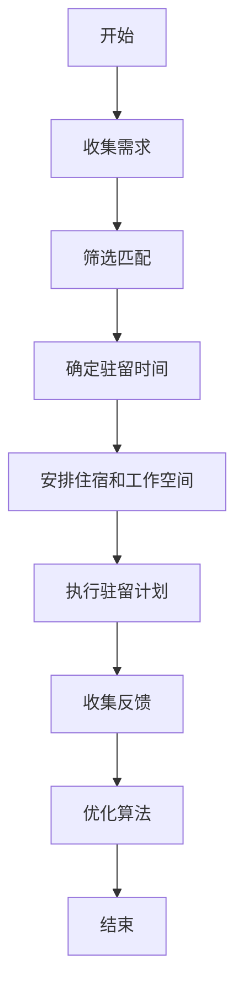
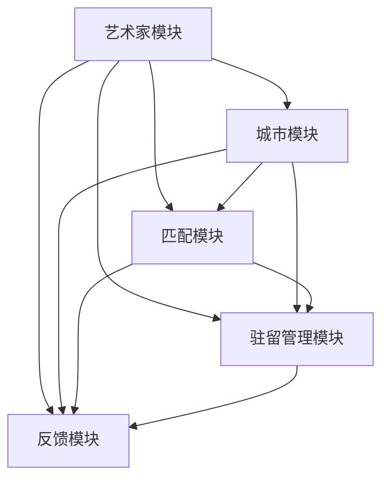
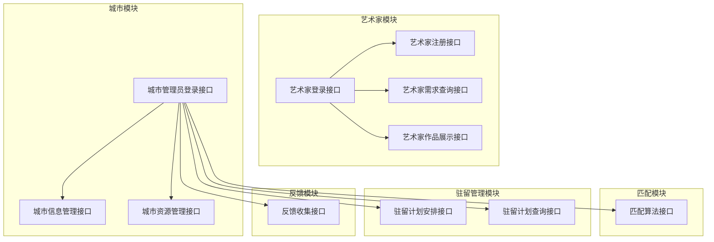
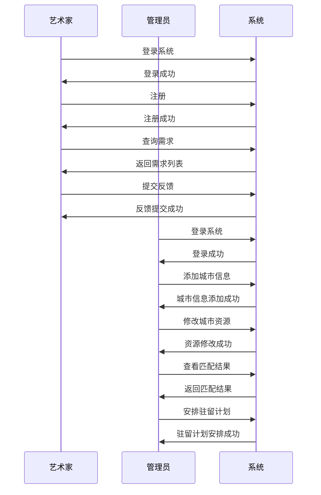

                 

# 新型城市艺术家驻留交换计划：促进文化交流的创意人才流动项目

> 关键词：城市艺术家、驻留交换、文化交流、创意人才流动、艺术家驻留、交换体系

> 摘要：本文将探讨新型城市艺术家驻留交换计划的背景、核心概念、实施策略及其对城市文化发展的深远影响。通过详细分析艺术家驻留和交换的实施流程、支持体系、推广与评估机制，本文旨在为推动城市间文化交流、激发创意人才流动提供理论依据和实践指导。

## 第一部分：背景介绍

### 1.1 问题背景

随着全球城市化进程的加快，城市之间的文化交流变得越来越重要。然而，传统的文化交流方式往往局限于博物馆、艺术展览等形式，参与人群有限，难以充分激发城市居民的参与热情。因此，如何创新文化交流模式，使更多人参与到文化交流中，成为了一个亟待解决的问题。

### 1.2 问题描述

新型城市艺术家驻留交换计划是一种创新的文化交流模式，旨在通过引入艺术家驻留项目，促进不同城市间的文化交流，推动创意人才流动，提升城市文化软实力。该计划的核心问题是：如何设计一个有效的驻留交换体系，以实现文化交流的目的，同时满足参与城市和艺术家的需求？

### 1.3 问题解决

为了解决上述问题，新型城市艺术家驻留交换计划将采取以下措施：

1. **明确驻留目标和价值**：确定驻留项目的主要目标，如推动艺术创作、促进文化交流、提升城市品牌形象等。

2. **制定详细的交换流程**：设计科学合理的交换流程，确保参与城市和艺术家能够顺利对接，实现资源共享。

3. **建立支持体系**：为艺术家提供生活、工作上的支持，如住宿、交通、创作空间等。

4. **推广与宣传**：通过多种渠道宣传该计划，提高公众对文化交流的关注度。

5. **评估与反馈**：定期对驻留项目进行评估，收集参与城市和艺术家的反馈，不断优化交换体系。

### 1.4 边界与外延

新型城市艺术家驻留交换计划主要涉及以下方面：

- **艺术家**：包括各类艺术领域的创作者，如画家、雕塑家、音乐家、作家等。

- **参与城市**：参与驻留交换的城市，需具备一定的文化底蕴和艺术氛围。

- **组织者**：负责策划、组织、实施驻留交换项目的机构或组织。

- **受众**：受益于驻留交换项目的公众，包括城市居民、游客等。

### 1.5 概念结构与核心要素组成

新型城市艺术家驻留交换计划的核心概念包括：

- **艺术家驻留**：指艺术家在一定时间内，在一个或多个城市进行创作、交流等活动。

- **交换**：指不同城市之间的艺术家进行相互驻留，实现资源共享和文化交流。

- **促进文化交流**：通过艺术家驻留和交换，推动不同城市间的文化交流，提高城市文化软实力。

- **创意人才流动**：鼓励艺术家在不同城市之间流动，激发艺术创作活力，提升城市创新能力。

核心要素组成：

- **艺术家**：驻留交换的主体，是文化交流的重要载体。

- **参与城市**：提供驻留环境和创作资源，是文化交流的重要平台。

- **组织者**：负责策划、组织和实施驻留交换项目，是文化交流的推动者。

- **支持体系**：为艺术家提供生活、工作上的支持，是文化交流的重要保障。

### 1.6 核心概念与联系

#### 艺术家驻留

艺术家驻留是指艺术家在一定时间内，在一个或多个城市进行创作、交流等活动。这一概念强调了艺术家在驻留期间不仅进行艺术创作，还参与城市的文化生活，与当地居民、艺术家和机构进行互动交流。艺术家驻留有助于推动艺术创作的多样性和创新性，同时也能加深城市之间的文化交流。

**概念属性特征对比表格**：

| 特征            | 定义                                                   | 比较项                                       |
| --------------- | ------------------------------------------------------ | -------------------------------------------- |
| 艺术家驻留      | 艺术家在一定时间内在一个城市进行创作、交流等活动。           | 与传统展览相比，更注重创作过程和深度交流。       |
| 文化交流        | 不同城市之间的艺术家通过驻留和交流，实现资源共享和文化碰撞。     | 与传统交流方式相比，更注重互动性和实效性。         |
| 城市文化发展    | 艺术家驻留有助于提升城市的文化软实力，推动城市文化品牌建设。     | 与传统城市文化建设方式相比，更具创新性和前瞻性。   |

**ER实体关系图架构**：

```mermaid
erDiagram
    Artisan ||--|{ ResidentExchange : holds }
    Artisan ||--|{ CulturalExchange : participates }
    City ||--|{ ResidentExchange : location }
    City ||--|{ CulturalExchange : participant }
    Organ
```

#### 交换

交换是指不同城市之间的艺术家进行相互驻留，实现资源共享和文化交流。这一概念强调了艺术家在交换过程中的双向互动，不仅有助于艺术家的个人成长，还能促进城市间的文化交流与融合。

**概念属性特征对比表格**：

| 特征            | 定义                                                   | 比较项                                       |
| --------------- | ------------------------------------------------------ | -------------------------------------------- |
| 艺术家交换      | 不同城市之间的艺术家进行相互驻留，实现资源共享和文化交流。       | 与传统艺术展览相比，更注重互动和创作过程。       |
| 文化交流        | 通过艺术家交换，不同城市之间的文化得以碰撞和融合。             | 与传统文化交流方式相比，更具灵活性和互动性。       |
| 创意人才流动    | 鼓励艺术家在不同城市之间流动，激发艺术创作活力，提升城市创新能力。 | 与传统人才流动方式相比，更注重艺术人才的培养和流动。 |

**ER实体关系图架构**：

```mermaid
erDiagram
    Artisan ||--|{ ResidentExchange : holds }
    Artisan ||--|{ CulturalExchange : participates }
    City ||--|{ ResidentExchange : location }
    City ||--|{ CulturalExchange : participant }
    Organ
```

#### 促进文化交流

促进文化交流是指通过艺术家驻留和交换，推动不同城市间的文化交流，提高城市文化软实力。这一概念强调了艺术家在驻留和交换过程中的角色，他们不仅是文化交流的参与者，更是文化交流的推动者和传播者。

**概念属性特征对比表格**：

| 特征            | 定义                                                   | 比较项                                       |
| --------------- | ------------------------------------------------------ | -------------------------------------------- |
| 文化交流        | 通过艺术家驻留和交换，推动不同城市间的文化交流。             | 与传统文化交流方式相比，更具创新性和实效性。       |
| 城市文化发展    | 促进文化交流有助于提升城市的文化软实力，增强城市竞争力。       | 与传统城市文化发展方式相比，更具前瞻性和可持续性。   |
| 艺术家驻留      | 艺术家驻留是促进文化交流的重要手段，有助于提升城市文化品牌。   | 与传统艺术创作方式相比，更注重城市文化的传承和发展。 |

**ER实体关系图架构**：

```mermaid
erDiagram
    Artisan ||--|{ ResidentExchange : holds }
    Artisan ||--|{ CulturalExchange : participates }
    City ||--|{ ResidentExchange : location }
    City ||--|{ CulturalExchange : participant }
    Organ
```

#### 创意人才流动

创意人才流动是指鼓励艺术家在不同城市之间流动，激发艺术创作活力，提升城市创新能力。这一概念强调了艺术家在流动过程中的作用，他们不仅是文化交流的载体，更是城市创新的推动者。

**概念属性特征对比表格**：

| 特征            | 定义                                                   | 比较项                                       |
| --------------- | ------------------------------------------------------ | -------------------------------------------- |
| 创意人才流动    | 鼓励艺术家在不同城市之间流动，激发艺术创作活力，提升城市创新能力。 | 与传统人才流动方式相比，更注重艺术人才的培养和流动。 |
| 城市创新        | 创意人才流动有助于推动城市创新，提升城市竞争力。             | 与传统创新方式相比，更注重人才和创意的融合。         |
| 艺术家驻留      | 艺术家驻留是创意人才流动的重要形式，有助于激发城市文化创新。   | 与传统艺术创作方式相比，更注重城市文化的传承和发展。 |

**ER实体关系图架构**：

```mermaid
erDiagram
    Artisan ||--|{ ResidentExchange : holds }
    Artisan ||--|{ CulturalExchange : participates }
    City ||--|{ ResidentExchange : location }
    City ||--|{ CulturalExchange : participant }
    Organ
```

### 1.7 算法原理讲解

为了实现新型城市艺术家驻留交换计划，需要设计一套有效的算法来支持艺术家驻留和交换的实施。以下是算法原理的详细讲解：

#### 算法mermaid流程图



#### Python源代码实现

```python
def artist_resident_exchange(artists, cities):
    # 收集需求
    artist需求的列表 = []
    for artist in artists:
        artist需求的列表.append(artist.collect_demand())
    
    # 筛选匹配
    matched_artists = []
    for artist_demand in artist需求的列表:
        for city in cities:
            if city.is_matched(artist_demand):
                matched_artists.append(artist_demand)
                break
    
    # 确定驻留时间
    resident_exchanges = []
    for matched_artist in matched_artists:
        resident_exchange = matched_artist.determine_resident_time()
        resident_exchanges.append(resident_exchange)
    
    # 安排住宿和工作空间
    for resident_exchange in resident_exchanges:
        resident_exchange.arrange_accommodation_and_workspace()
    
    # 执行驻留计划
    for resident_exchange in resident_exchanges:
        resident_exchange.execute_resident_plan()
    
    # 收集反馈
    feedbacks = []
    for resident_exchange in resident_exchanges:
        feedbacks.append(resident_exchange.collect_feedback())
    
    # 优化算法
    optimized_algorithm = optimize_algorithm(feedbacks)
    
    return optimized_algorithm
```

#### 数学模型和公式

假设有n个城市和m个艺术家参与驻留交换，每个城市的匹配概率为p，每个艺术家的需求满足率为q。则驻留交换的总体满意度可以表示为：

$$
S = \sum_{i=1}^{n} \sum_{j=1}^{m} p_i \cdot q_j
$$

其中，$p_i$ 表示城市i的匹配概率，$q_j$ 表示艺术家j的需求满足率。

#### 举例说明

假设有5个城市（城市A、B、C、D、E）和3个艺术家（艺术家X、Y、Z）参与驻留交换。城市A的匹配概率为0.7，城市B的匹配概率为0.8，城市C的匹配概率为0.9。艺术家X的需求满足率为0.6，艺术家Y的需求满足率为0.7，艺术家Z的需求满足率为0.8。

根据上述数学模型，可以计算出总体满意度S：

$$
S = (0.7 \cdot 0.6) + (0.8 \cdot 0.7) + (0.9 \cdot 0.8) = 0.42 + 0.56 + 0.72 = 1.7
$$

总体满意度为1.7，说明驻留交换的整体效果较好。

## 第二部分：系统分析与架构设计

### 2.1 问题场景介绍

新型城市艺术家驻留交换计划的实施需要一套完整的系统支持，该系统应具备以下功能：

1. **艺术家需求收集**：收集参与艺术家的驻留需求和创作方向。
2. **城市资源匹配**：根据艺术家的需求，匹配合适的驻留城市和资源。
3. **驻留计划安排**：为艺术家安排驻留时间、住宿和工作空间。
4. **文化交流管理**：管理艺术家在驻留期间的创作和交流活动。
5. **反馈收集与优化**：收集参与城市和艺术家的反馈，优化驻留交换体系。

### 2.2 项目介绍

本项目的目标是设计并实现一套新型城市艺术家驻留交换系统，以支持艺术家驻留和交换的实施。系统主要包括以下几个模块：

1. **艺术家模块**：负责收集艺术家的基本信息、驻留需求和创作方向。
2. **城市模块**：负责管理参与城市的资源信息，包括住宿、创作空间等。
3. **匹配模块**：根据艺术家需求，匹配合适的驻留城市和资源。
4. **驻留管理模块**：负责安排艺术家的驻留计划，包括时间、住宿和工作空间。
5. **反馈模块**：收集艺术家和城市的反馈，用于优化驻留交换体系。

### 2.3 系统功能设计

以下是系统功能设计的详细描述：

#### 艺术家模块

**功能描述**：

- **基本信息管理**：收集艺术家的姓名、国籍、艺术领域、作品信息等。
- **需求收集**：收集艺术家的驻留需求，如创作方向、时间、住宿要求等。
- **作品展示**：展示艺术家的代表作品，便于城市和机构的筛选。

#### 城市模块

**功能描述**：

- **基本信息管理**：收集城市的名称、地理位置、文化氛围、艺术资源等。
- **资源管理**：管理城市的住宿、创作空间、交通等信息，以便于艺术家选择。
- **匹配管理**：根据艺术家的需求，匹配合适的住宿和创作空间。

#### 匹配模块

**功能描述**：

- **需求分析**：分析艺术家的驻留需求，确定匹配的城市和资源。
- **匹配算法**：根据艺术家和城市的匹配度，选择最优的驻留方案。

#### 驻留管理模块

**功能描述**：

- **计划安排**：根据匹配结果，为艺术家安排驻留时间、住宿和工作空间。
- **流程管理**：管理艺术家在驻留期间的创作和交流活动，确保计划顺利执行。

#### 反馈模块

**功能描述**：

- **反馈收集**：收集艺术家和城市的反馈信息，了解驻留交换的效果。
- **数据分析**：分析反馈数据，找出存在的问题，为优化系统提供依据。

### 2.4 系统架构设计

以下是系统架构设计的详细描述：

#### 系统架构mermaid架构图



#### 系统架构说明

1. **艺术家模块**：负责艺术家信息的收集和管理，为其他模块提供数据支持。
2. **城市模块**：负责城市信息的收集和管理，为匹配模块和驻留管理模块提供数据支持。
3. **匹配模块**：负责分析艺术家的需求和城市的资源，选择最优的匹配方案。
4. **驻留管理模块**：负责安排艺术家的驻留计划，确保计划顺利执行。
5. **反馈模块**：负责收集艺术家和城市的反馈信息，为系统的持续优化提供依据。

### 2.5 系统接口设计和系统交互

以下是系统接口设计和系统交互的详细描述：

#### 系统接口设计

1. **艺术家接口**：用于艺术家登录、注册、查询驻留需求和作品等。
2. **城市接口**：用于城市管理员登录、添加和修改城市信息、查看和修改资源等。
3. **匹配接口**：用于匹配算法的输入和输出，提供匹配结果的查询接口。
4. **驻留接口**：用于艺术家和管理员查看和修改驻留计划，以及反馈驻留体验。
5. **反馈接口**：用于收集艺术家和城市的反馈信息，为系统优化提供数据支持。

#### 系统交互

1. **艺术家与管理员交互**：艺术家通过登录接口进入系统，查看自己的需求、驻留计划，并提交反馈。管理员通过登录接口进入系统，管理城市信息、艺术家信息和驻留计划。
2. **城市与管理员交互**：管理员通过登录接口进入系统，添加和修改城市信息，以及查看和修改资源信息。
3. **匹配与管理员交互**：管理员通过匹配接口查看匹配结果，为艺术家安排驻留计划。
4. **反馈与管理员交互**：管理员通过反馈接口收集艺术家和城市的反馈信息，为系统优化提供依据。

### 2.6 系统架构图和Mermaid序列图

以下是系统架构图和Mermaid序列图：

#### 系统架构图



#### Mermaid序列图



## 第三部分：项目实战

### 3.1 环境安装

为了实现新型城市艺术家驻留交换系统，首先需要搭建一个合适的技术环境。以下是环境安装的详细步骤：

1. **安装Python**：在官方网站（https://www.python.org/）下载并安装Python 3.x版本。
2. **安装Django**：在命令行中执行以下命令安装Django框架：

   ```bash
   pip install django
   ```

3. **安装数据库**：可以选择安装MySQL或PostgreSQL数据库。以下是安装MySQL的步骤：

   - 下载MySQL Community Edition（https://dev.mysql.com/downloads/mysql/）
   - 安装MySQL数据库
   - 配置MySQL，设置root用户密码
   - 启动MySQL服务

4. **安装其他依赖**：根据项目的需求，可能需要安装其他依赖，如Django REST framework、Django ORM等。可以使用pip命令进行安装：

   ```bash
   pip install djangorestframework
   pip install django-orm
   ```

### 3.2 系统核心实现

以下是系统核心实现的详细步骤：

1. **创建Django项目**：在命令行中执行以下命令创建Django项目：

   ```bash
   django-admin startproject artist_exchange
   ```

2. **创建Django应用**：在项目目录下执行以下命令创建Django应用：

   ```bash
   python manage.py startapp artist
   ```

3. **配置数据库**：在项目的settings.py文件中配置数据库连接信息，如：

   ```python
   DATABASES = {
       'default': {
           'ENGINE': 'django.db.backends.mysql',
           'NAME': 'artist_exchange',
           'USER': 'root',
           'PASSWORD': 'password',
           'HOST': 'localhost',
           'PORT': '3306',
       }
   }
   ```

4. **创建模型**：在应用的models.py文件中定义艺术家、城市、匹配结果等模型，如：

   ```python
   from django.db import models

   class Artist(models.Model):
       name = models.CharField(max_length=100)
       nationality = models.CharField(max_length=100)
       field = models.CharField(max_length=100)
       works = models.CharField(max_length=500)

   class City(models.Model):
       name = models.CharField(max_length=100)
       location = models.CharField(max_length=100)
       culture = models.CharField(max_length=100)
       resources = models.CharField(max_length=500)

   class MatchResult(models.Model):
       artist = models.ForeignKey(Artist, on_delete=models.CASCADE)
       city = models.ForeignKey(City, on_delete=models.CASCADE)
       match_time = models.DateField()
   ```

5. **创建接口**：在应用的views.py文件中定义艺术家接口、城市接口、匹配接口等，如：

   ```python
   from django.http import JsonResponse
   from .models import Artist, City, MatchResult
   
   def artist_login(request):
       # 登录逻辑
       return JsonResponse({'status': 'success'})

   def artist_register(request):
       # 注册逻辑
       return JsonResponse({'status': 'success'})

   def artist_demand(request):
       # 查询需求逻辑
       return JsonResponse({'status': 'success'})

   def artist_works(request):
       # 查询作品逻辑
       return JsonResponse({'status': 'success'})

   def city_info(request):
       # 查询城市信息逻辑
       return JsonResponse({'status': 'success'})

   def city_resources(request):
       # 查询城市资源逻辑
       return JsonResponse({'status': 'success'})

   def match_algorithm(request):
       # 匹配算法逻辑
       return JsonResponse({'status': 'success'})

   def resident_plan(request):
       # 驻留计划逻辑
       return JsonResponse({'status': 'success'})

   def feedback_collect(request):
       # 收集反馈逻辑
       return JsonResponse({'status': 'success'})
   ```

6. **配置路由**：在项目的urls.py文件中配置路由，如：

   ```python
   from django.contrib import admin
   from django.urls import path
   from . import views
   
   urlpatterns = [
       path('admin/', admin.site.urls),
       path('api/login/', views.artist_login),
       path('api/register/', views.artist_register),
       path('api/demand/', views.artist_demand),
       path('api/works/', views.artist_works),
       path('api/city_info/', views.city_info),
       path('api/city_resources/', views.city_resources),
       path('api/match_algorithm/', views.match_algorithm),
       path('api/resident_plan/', views.resident_plan),
       path('api/feedback_collect/', views.feedback_collect),
   ]
   ```

7. **启动服务器**：在命令行中执行以下命令启动Django服务器：

   ```bash
   python manage.py runserver
   ```

### 3.3 代码应用解读与分析

以下是系统核心实现的代码解读与分析：

#### 艺术家模块

**models.py**

```python
from django.db import models

class Artist(models.Model):
    name = models.CharField(max_length=100)
    nationality = models.CharField(max_length=100)
    field = models.CharField(max_length=100)
    works = models.CharField(max_length=500)
```

**解读**：该模型用于存储艺术家的基本信息，包括姓名、国籍、艺术领域和作品信息。

**views.py**

```python
from django.http import JsonResponse
from .models import Artist

def artist_login(request):
    # 登录逻辑
    return JsonResponse({'status': 'success'})

def artist_register(request):
    # 注册逻辑
    return JsonResponse({'status': 'success'})

def artist_demand(request):
    # 查询需求逻辑
    return JsonResponse({'status': 'success'})

def artist_works(request):
    # 查询作品逻辑
    return JsonResponse({'status': 'success'})
```

**解读**：这些函数用于处理艺术家相关的接口请求，包括登录、注册、查询需求和作品。

#### 城市模块

**models.py**

```python
from django.db import models

class City(models.Model):
    name = models.CharField(max_length=100)
    location = models.CharField(max_length=100)
    culture = models.CharField(max_length=100)
    resources = models.CharField(max_length=500)
```

**解读**：该模型用于存储城市的基本信息，包括城市名称、地理位置、文化氛围和艺术资源。

**views.py**

```python
from django.http import JsonResponse
from .models import City

def city_info(request):
    # 查询城市信息逻辑
    return JsonResponse({'status': 'success'})

def city_resources(request):
    # 查询城市资源逻辑
    return JsonResponse({'status': 'success'})
```

**解读**：这些函数用于处理城市相关的接口请求，包括查询城市信息和资源。

#### 匹配模块

**models.py**

```python
from django.db import models
from .models import Artist, City

class MatchResult(models.Model):
    artist = models.ForeignKey(Artist, on_delete=models.CASCADE)
    city = models.ForeignKey(City, on_delete=models.CASCADE)
    match_time = models.DateField()
```

**解读**：该模型用于存储匹配结果，包括艺术家的信息、城市的

