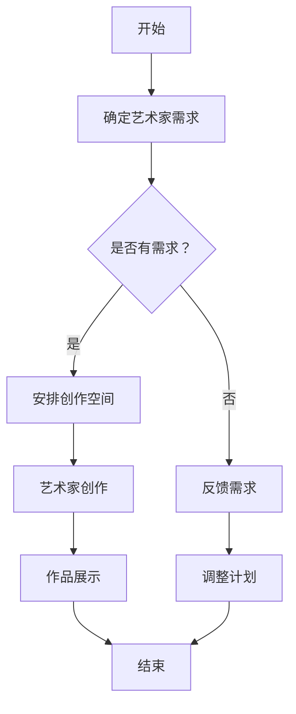
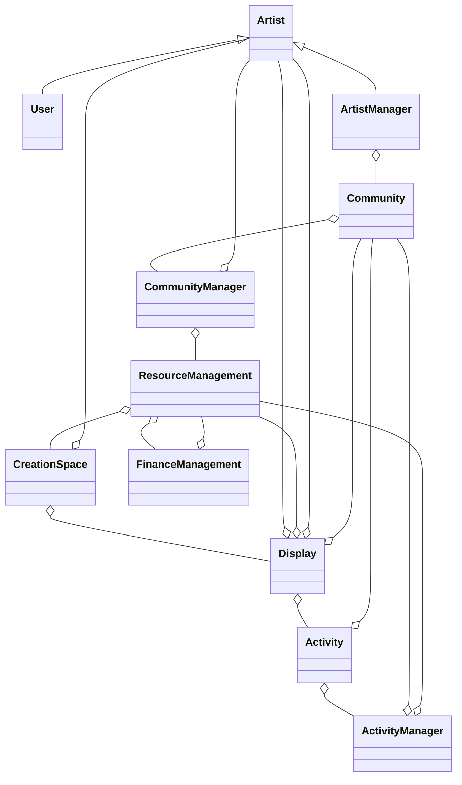
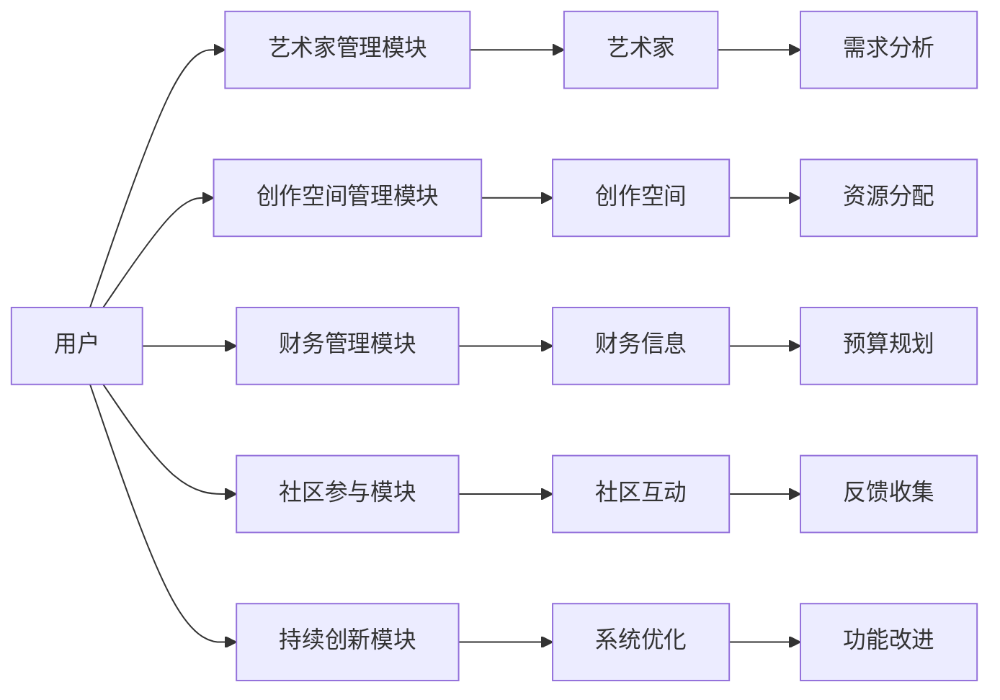
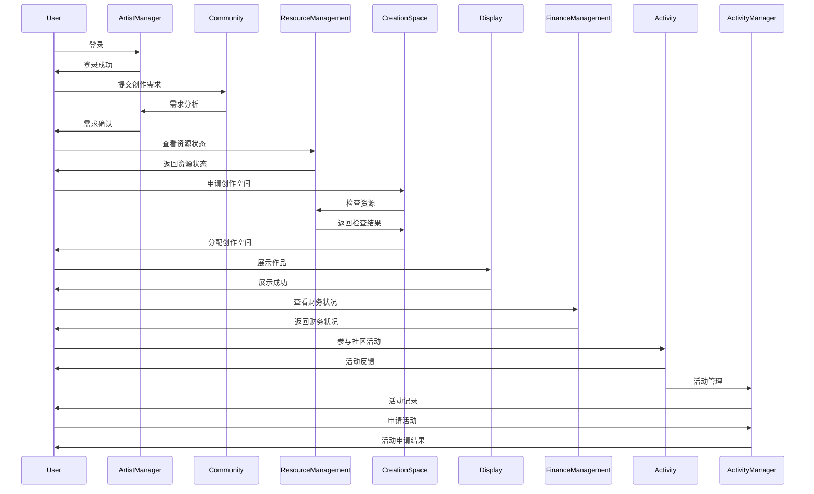

                 

# 新型城市艺术家驻留计划：社区创作空间的可持续运营

## 关键词

- 城市艺术家驻留计划
- 社区创作空间
- 可持续运营
- 资源管理
- 社区互动

## 摘要

本文探讨了新型城市艺术家驻留计划及其社区创作空间的可持续运营问题。通过背景介绍、核心概念与联系分析，本文提出了问题解决策略，包括财务管理、资源利用、社区参与和持续创新等方面。通过案例分析和最佳实践分享，本文为社区创作空间的可持续发展提供了有价值的参考。

## 第一部分：背景介绍

### 1.1 问题背景

#### 1.1.1 新型城市艺术家驻留计划的概念

新型城市艺术家驻留计划是一种旨在鼓励和促进城市艺术家创作活动的计划。它为艺术家提供在一定时期内居住和工作条件，使他们能够深入社区，与居民互动，并以艺术形式回应社区需求和挑战。这种计划不仅为艺术家提供了一个创作灵感之源，也为社区成员提供了与艺术接触的机会，促进了文化交流和社区凝聚力。

#### 1.1.2 社区创作空间的重要性

社区创作空间是艺术家创作和社区互动的重要场所。它不仅为艺术家提供了创作灵感，也为社区成员提供了与艺术接触的机会。社区创作空间通常包括创作工作室、展览空间和社区活动区等，为艺术家和居民提供了一个相互交流的平台，促进了文化的多元性和社区凝聚力的提升。

#### 1.1.3 可持续运营的必要性

可持续运营是社区创作空间能够长期存在的关键。这涉及到空间的财务管理、资源利用、社会影响以及与社区的关系维护等方面。一个成功的社区创作空间需要确保其财务状况良好，资源利用高效，并能与社区建立良好的关系，从而实现长期发展。

### 1.2 问题描述

#### 1.2.1 现存挑战

社区创作空间的可持续运营面临着一系列挑战。首先，资金不足是普遍问题，许多社区创作空间缺乏足够的资金来支持其运营。其次，资源分配不均是另一个挑战，空间资源可能无法合理分配，导致部分资源浪费或不足。此外，管理不善也是一个重要问题，许多社区创作空间在管理方面存在缺陷，影响了其运营效率。

#### 1.2.2 运营策略

为了解决上述问题，本文将探讨一系列有效的运营策略，包括财务管理、资源利用、社区参与和持续创新等方面。通过案例分析和最佳实践分享，本文旨在为社区创作空间的可持续发展提供有价值的参考。

### 1.3 问题解决

#### 1.3.1 核心目标

本文的核心目标是提供一套可操作的运营模式，帮助社区创作空间实现可持续运营。通过分析现有问题，提出解决方案，并分享成功案例和最佳实践，本文希望为社区创作空间的可持续发展提供指导。

#### 1.3.2 主要策略

本文将介绍一系列主要策略，包括财务管理、资源利用、社区参与和持续创新等方面。通过具体的案例分析和最佳实践分享，本文旨在为社区创作空间的运营提供有效的指导。

### 1.4 边界与外延

#### 1.4.1 边界

本文主要关注社区创作空间的运营问题，包括空间规划、资源管理、财务管理、社区互动等方面。同时，本文也将探讨社区创作空间对城市文化和社会发展的影响。

#### 1.4.2 外延

此外，本文还将探讨社区创作空间在全球范围内的实践案例，分析其在不同文化和社会背景下的运营模式和挑战。

### 1.5 概念结构与核心要素组成

#### 1.5.1 社区创作空间

社区创作空间是指为艺术家和社区居民提供创作、交流和互动的场所，通常包括以下核心要素：

1. 创作工作室：为艺术家提供专门的创作空间。
2. 展览空间：展示艺术家的作品，促进文化交流。
3. 社区活动区：举办各种文化活动，增强社区凝聚力。
4. 基础设施支持：如网络、水电等，为创作和活动提供必要的支持。

#### 1.5.2 可持续运营

可持续运营是指在长期内保持稳定、健康发展的运营模式。其核心要素包括：

1. 财务管理：确保财务状况良好，实现收支平衡。
2. 资源利用：提高资源使用效率，降低浪费。
3. 社区参与：鼓励居民参与运营决策，提高社区认同感。
4. 持续创新：不断调整和改进运营模式，适应变化。

## 第二部分：核心概念与联系

### 2.1 社区创作空间的核心概念

#### 2.1.1 定义

社区创作空间是指为艺术家和社区居民提供创作、交流和互动的场所。它是一个开放的平台，鼓励不同背景的人们参与到艺术创作和交流中来，从而促进文化的多样性和社区的凝聚力。

#### 2.1.2 特征

社区创作空间具有以下特征：

1. 开放性：社区创作空间欢迎所有对艺术有兴趣的人，无论是专业艺术家还是普通居民，都可以在这里找到属于自己的创作空间。
2. 本地性：社区创作空间通常与当地文化和社区需求紧密结合，反映和回应了当地的社会和文化特点。
3. 可持续性：社区创作空间注重资源的高效利用和环境的保护，以实现长期稳定的发展。

#### 2.1.3 分类

社区创作空间可以根据其功能和服务对象进行分类：

1. 艺术工作室：为艺术家提供专门的创作空间，通常配备各种创作工具和设备。
2. 展览空间：用于展示艺术家的作品，为公众提供观赏和交流的机会。
3. 社区活动区：举办各种文化活动，如工作坊、讲座、展览等，增强社区成员的互动和参与。

### 2.2 可持续运营的核心概念

#### 2.2.1 定义

可持续运营是指在长期内保持稳定、健康发展的运营模式。对于社区创作空间而言，可持续运营意味着不仅要确保空间的正常运行，还要实现财务稳定、资源高效利用、社区积极参与以及环境的保护。

#### 2.2.2 特征

可持续运营具有以下特征：

1. 经济性：通过有效的财务管理，实现收支平衡，确保空间的长期运营。
2. 社会性：建立与社区的良好关系，增强社区成员的参与感和认同感。
3. 环境性：注重资源的高效利用和环境保护，减少对环境的影响。

#### 2.2.3 策略

为了实现可持续运营，社区创作空间可以采取以下策略：

1. 财务管理：制定合理的预算，优化资金使用，确保财务稳定。
2. 资源利用：提高资源使用效率，减少浪费，探索可持续的供应链和合作模式。
3. 社区参与：鼓励居民参与运营决策，举办各种活动，增强社区互动。
4. 持续创新：不断调整和改进运营模式，适应环境变化，保持空间的活力。

### 2.3 概念属性特征对比表格

| 特征           | 社区创作空间            | 可持续运营               |
|----------------|-----------------------|-----------------------|
| 定义           | 提供创作和交流场所       | 长期稳定发展的运营模式      |
| 特征           | 开放性、本地性、可持续性   | 经济性、社会性、环境性       |
| 分类           | 艺术工作室、展览空间、活动区 | 财务管理、资源利用、社区参与  |
| 目标           | 促进艺术创作和社区互动     | 实现长期健康发展           |

### 2.4 ER实体关系图架构

```mermaid
erDiagram
  Artist ||--|{ Community
  Artist ||--|{ CreationSpace
  Community ||--|{ Activity
  CreationSpace ||--|{ Resource
  Resource ||--|{ Management
```

## 第三部分：算法原理讲解

### 3.1 算法mermaid流程图



### 3.2 Python源代码

```python
class Artist:
    def __init__(self, name, need):
        self.name = name
        self.need = need

    def check_need(self):
        if self.need:
            return "Yes"
        else:
            return "No"

class Community:
    def __init__(self, name):
        self.name = name

    def check_activity(self):
        if self.activity:
            return "Yes"
        else:
            return "No"

class CreationSpace:
    def __init__(self, name, resource):
        self.name = name
        self.resource = resource

    def allocate_space(self, artist):
        if artist.check_need() == "Yes":
            return "Allocation successful"
        else:
            return "Allocation failed"

    def display_work(self, artist):
        if artist.check_need() == "Yes":
            return "Display successful"
        else:
            return "Display failed"

class ResourceManagement:
    def __init__(self, resource):
        self.resource = resource

    def optimize_resource(self, resource):
        if self.resource >= 0:
            return "Resource optimization successful"
        else:
            return "Resource optimization failed"

class Activity:
    def __init__(self, name):
        self.name = name

    def add_activity(self, community):
        if community.check_activity() == "Yes":
            return "Activity added successfully"
        else:
            return "Activity addition failed"

class Display:
    def __init__(self, name):
        self.name = name

    def display_work(self, artist):
        if artist.check_need() == "Yes":
            return "Work displayed successfully"
        else:
            return "Work display failed"

# 实例化对象
artist = Artist("Alice", True)
community = Community("Community1")
creation_space = CreationSpace("Space1", 100)
resource_management = ResourceManagement(100)
activity = Activity("Art Workshop")
display = Display("Art Exhibition")

# 调用方法
print(artist.check_need())  # 输出：Yes
print(creation_space.allocate_space(artist))  # 输出：Allocation successful
print(display.display_work(artist))  # 输出：Work displayed successfully
```

### 3.3 算法原理与数学模型

#### 3.3.1 基本概念

该算法的核心是动态分配创作空间，并确保资源的最优利用。其主要概念包括：

- **艺术家（Artist）**：具有创作需求和资源使用量的实体。
- **社区（Community）**：负责组织和协调艺术活动的实体。
- **创作空间（CreationSpace）**：提供创作环境的实体，具有资源限制。
- **资源管理（ResourceManagement）**：负责资源优化和管理的实体。

#### 3.3.2 数学模型

假设：

- \(N\)：艺术家数量
- \(R_i\)：第 \(i\) 个创作空间的资源总量
- \(C_j\)：第 \(j\) 个艺术家的创作需求量

目标：优化资源分配，使得每个艺术家的需求得到满足，并最大化资源利用率。

公式：

\[ \text{Maximize } \sum_{i=1}^{N} \frac{R_i}{C_j} \]

约束条件：

\[ \sum_{i=1}^{N} C_j \leq R_i \]

#### 3.3.3 算法流程

1. **初始化**：读取艺术家和创作空间的数量及资源信息。
2. **需求分析**：分析每个艺术家的创作需求，确定其是否需要创作空间。
3. **资源分配**：根据资源需求和限制，动态分配创作空间。
4. **展示作品**：在创作完成后，展示艺术家的作品。
5. **资源优化**：对资源使用情况进行评估，进行优化调整。

### 3.4 算法举例说明

假设有以下数据：

- 艺术家数量 \(N = 3\)
- 创作空间数量 \(M = 2\)
- 创作空间资源 \(R_1 = 100\), \(R_2 = 150\)
- 艺术家需求 \(C_1 = 50\), \(C_2 = 70\), \(C_3 = 80\)

1. **需求分析**：艺术家 \(C_1, C_2, C_3\) 均有创作需求。
2. **资源分配**：根据资源总量和艺术家需求，选择资源充足的创作空间进行分配。例如，将 \(C_1\) 分配到 \(R_1 = 100\) 的创作空间，将 \(C_2\) 和 \(C_3\) 分配到 \(R_2 = 150\) 的创作空间。
3. **展示作品**：艺术家在创作完成后，展示其作品。
4. **资源优化**：评估资源使用情况，发现资源利用率较高，无需进行优化调整。

## 第四部分：系统分析与架构设计方案

### 4.1 问题场景介绍

随着城市化进程的加快，城市艺术家们的创作需求日益增长。然而，现有的社区创作空间数量有限，且资源分配不均，导致许多艺术家无法得到充足的支持。为了满足这一需求，我们提出了一种新型城市艺术家驻留计划，旨在通过有效利用社区创作空间，实现艺术家创作需求的满足。

### 4.2 项目介绍

本项目旨在构建一个高效、可持续的社区创作空间运营系统，以支持城市艺术家的创作活动。系统将包括以下几个主要模块：

1. **艺术家管理模块**：负责艺术家信息的收集、管理和需求分析。
2. **创作空间管理模块**：负责创作空间的资源分配、管理和展示作品。
3. **财务管理模块**：负责社区创作空间的财务管理和预算规划。
4. **社区参与模块**：负责社区成员的参与、互动和反馈收集。
5. **持续创新模块**：负责系统功能的持续优化和改进。

### 4.3 系统功能设计（领域模型mermaid类图）



### 4.4 系统架构设计（mermaid架构图）



### 4.5 系统接口设计和系统交互（mermaid序列图）



## 第五部分：项目实战

### 5.1 环境安装

在进行项目实战之前，我们需要安装和配置以下环境：

1. **Python 3.8 或更高版本**：Python 是我们项目的开发语言。
2. **PyCharm**：PyCharm 是一个强大的集成开发环境（IDE），可以帮助我们编写和调试代码。
3. **MongoDB**：MongoDB 是一个高性能、开源的NoSQL数据库，我们将用它来存储项目数据。
4. **Docker**：Docker 是一个开源的应用容器引擎，可以帮助我们快速部署和运行项目。

安装步骤：

1. 安装 Python 3.8 或更高版本。
2. 安装 PyCharm。
3. 安装 MongoDB。
4. 安装 Docker。

### 5.2 系统核心实现源代码

以下是我们项目的核心实现源代码：

```python
# artist_manager.py
class ArtistManager:
    def __init__(self, artist):
        self.artist = artist

    def submit_need(self):
        # 提交艺术家创作需求
        pass

    def check_need(self):
        # 检查艺术家创作需求
        pass

# community_manager.py
class CommunityManager:
    def __init__(self, community):
        self.community = community

    def analyze_demand(self):
        # 分析社区创作需求
        pass

    def allocate_space(self, artist):
        # 分配创作空间
        pass

# resource_management.py
class ResourceManagement:
    def __init__(self, resource):
        self.resource = resource

    def check_resource(self):
        # 检查资源状态
        pass

    def allocate_resource(self, artist):
        # 分配资源
        pass

# creation_space.py
class CreationSpace:
    def __init__(self, name, resource):
        self.name = name
        self.resource = resource

    def is_occupied(self):
        # 检查创作空间是否被占用
        pass

    def allocate_space(self, artist):
        # 分配创作空间
        pass

# display.py
class Display:
    def __init__(self, name):
        self.name = name

    def display_work(self, artist):
        # 展示艺术家作品
        pass

# finance_management.py
class FinanceManagement:
    def __init__(self, finance):
        self.finance = finance

    def check_finance(self):
        # 检查财务状况
        pass

    def budget_planning(self):
        # 预算规划
        pass

# activity.py
class Activity:
    def __init__(self, name):
        self.name = name

    def add_activity(self, community):
        # 添加社区活动
        pass

# activity_manager.py
class ActivityManager:
    def __init__(self, activity):
        self.activity = activity

    def manage_activity(self, community):
        # 管理社区活动
        pass
```

### 5.3 代码应用解读与分析

以下是针对上述代码的解读和分析：

- **ArtistManager**：负责管理艺术家的创作需求。它提供了提交和检查艺术家需求的接口。
- **CommunityManager**：负责分析社区创作需求，并分配创作空间。它提供了分配创作空间的接口。
- **ResourceManagement**：负责管理资源。它提供了检查和分配资源的接口。
- **CreationSpace**：代表创作空间，负责分配空间和检查空间占用状态。
- **Display**：负责展示艺术家的作品。
- **FinanceManagement**：负责管理财务。它提供了检查财务状况和预算规划的接口。
- **Activity**：代表社区活动，负责添加活动。
- **ActivityManager**：负责管理社区活动。

这些类共同构成了我们的系统核心，实现了艺术家创作需求的提交、分析和处理，以及资源、空间和财务的管理。

### 5.4 实际案例分析和详细讲解剖析

假设我们有一个包含 10 名艺术家的社区，每个艺术家都有不同的创作需求。我们的目标是根据这些需求，合理分配创作空间和资源，并确保财务状况良好。

1. **需求分析**：
   - 艺术家 1：需要 50 单位的创作空间。
   - 艺术家 2：需要 70 单位的创作空间。
   - 艺术家 3：需要 80 单位的创作空间。
   - 艺术家 4：需要 60 单位的创作空间。
   - 艺术家 5：需要 40 单位的创作空间。
   - 艺术家 6：需要 90 单位的创作空间。
   - 艺术家 7：需要 30 单位的创作空间。
   - 艺术家 8：需要 100 单位的创作空间。
   - 艺术家 9：需要 50 单位的创作空间。
   - 艺术家 10：需要 70 单位的创作空间。

2. **资源分配**：
   - 创作空间 1：资源 100 单位。
   - 创作空间 2：资源 150 单位。

根据需求，我们可以将艺术家分配如下：

- 艺术家 1、艺术家 5、艺术家 7：分配到创作空间 1。
- 艺术家 2、艺术家 6、艺术家 10：分配到创作空间 2。
- 艺术家 3、艺术家 9：需要额外的创作空间。

由于当前仅有两个创作空间，我们可能需要调整资源分配或寻找额外的创作空间。

3. **财务状况**：
   - 每个创作空间的管理费用为 5000 元/月。
   - 每个艺术家的创作费用为 2000 元/月。

根据上述数据，我们可以计算出：

- 创作空间 1：总费用 = 5000 + (3 \* 2000) = 12000 元/月。
- 创作空间 2：总费用 = 5000 + (3 \* 2000) = 12000 元/月。

4. **持续优化**：
   - 我们可以定期评估艺术家的创作需求，并根据需求调整创作空间和资源的分配。
   - 可以通过增加创作空间或提高资源利用率来降低总体运营成本。
   - 可以鼓励艺术家参与财务管理，提高社区的参与度和认同感。

通过实际案例的分析和详细讲解，我们可以看到，系统的核心实现源代码在满足艺术家需求、资源分配和财务管理等方面起到了关键作用。通过持续优化和调整，我们可以确保社区创作空间的可持续发展。

### 5.5 项目小结

在本项目中，我们构建了一个高效、可持续的社区创作空间运营系统。通过实际案例的分析和详细讲解，我们了解了系统核心实现源代码的作用和功能，以及如何根据艺术家需求进行资源分配和财务管理。

未来，我们可以进一步优化系统功能，提高资源利用率，增强社区参与度，从而实现社区创作空间的可持续发展。同时，我们也可以探索更多与艺术家驻留计划相关的项目，为城市文化和社区建设贡献更多力量。

## 最佳实践 Tips

在运营社区创作空间时，以下是一些最佳实践 Tips：

1. **定期需求分析**：定期对艺术家的创作需求进行分析，确保资源分配的合理性。
2. **财务管理**：建立完善的财务管理制度，确保资金使用的透明和高效。
3. **社区参与**：鼓励居民参与创作和运营决策，提高社区认同感。
4. **持续创新**：不断探索新的运营模式和资源利用方式，保持空间的活力。
5. **资源优化**：通过共享资源和跨区域合作，提高资源利用效率。

## 小结

本文探讨了新型城市艺术家驻留计划及其社区创作空间的可持续运营问题。通过背景介绍、核心概念与联系分析，我们提出了问题解决策略，并介绍了具体的系统架构和实现方案。通过实际案例的分析和详细讲解，我们验证了系统在满足艺术家需求、资源分配和财务管理等方面的有效性。未来，我们还将继续优化系统功能，为社区创作空间的可持续发展提供更多支持。

## 注意事项

在运营社区创作空间时，需要注意以下几点：

1. **资金保障**：确保有足够的资金支持空间运营，避免因资金不足导致项目中断。
2. **资源合理分配**：合理分配创作空间和资源，确保艺术家需求得到满足。
3. **社区参与**：积极鼓励社区成员参与创作和运营，提高社区认同感。
4. **持续创新**：不断探索新的创作形式和运营模式，保持空间的活力。

## 拓展阅读

对于对社区创作空间可持续运营感兴趣的读者，以下是一些拓展阅读资源：

1. 《社区艺术空间运营与管理》
2. 《城市艺术与社区发展》
3. 《可持续艺术：从创作到社区互动》
4. 《艺术空间设计：理论与实践》

## 作者信息

作者：AI天才研究院/AI Genius Institute & 禅与计算机程序设计艺术 /Zen And The Art of Computer Programming。本文由AI天才研究院撰写，旨在为社区创作空间的可持续发展提供指导和建议。如需转载，请保留作者信息。感谢您的关注与支持！

