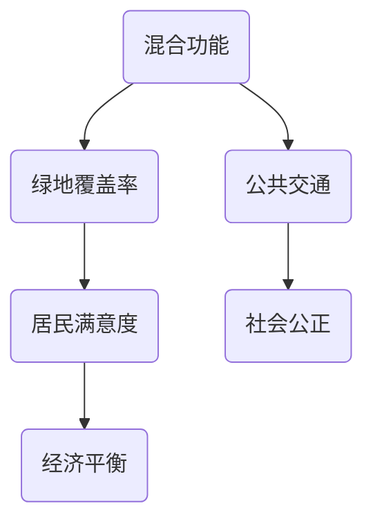

                 

### 新型城市设计：宜居性与可持续发展的平衡

关键词：新型城市设计、宜居性、可持续发展、城市规划、绿色建筑

摘要：本文深入探讨了新型城市设计在实现宜居性与可持续发展之间的平衡。通过分析当前城市化进程中的问题，引入核心概念和设计原则，讨论了新型城市设计的评估与监测方法，以及可持续发展的策略与实践。本文结合国际成功案例和中国城市实践，总结了新型城市设计的未来趋势，并提出了政策建议与实施路径。

## 引言

### 1.1 问题的提出

城市化进程不断加速，为经济发展和社会进步提供了巨大动力。然而，快速城市化也带来了诸多挑战，如交通拥堵、环境污染、资源短缺等，这些问题严重影响了城市的宜居性。同时，传统城市规划模式往往忽视了环境保护和资源可持续利用，导致城市生态系统失衡。因此，寻求一种既能提升宜居性又能实现可持续发展的新型城市设计模式，成为当前城市规划和建设的重要课题。

### 1.2 核心概念与联系

#### 核心概念原理

- **宜居性**：宜居性是指城市能够为居民提供舒适、安全、健康的生活环境。它包括自然环境、社会环境、经济环境等多个方面。
- **可持续发展**：可持续发展是指在满足当前需求的同时，不损害后代满足其需求的能力。在城市设计中，可持续发展强调环境保护、资源节约和生态平衡。

#### 概念属性特征对比表格

| 特征       | 宜居性                 | 可持续发展                 |
| ---------- | ---------------------- | -------------------------- |
| **自然环境** | 清洁空气、充足绿地     | 减少污染、生态恢复         |
| **社会环境** | 社区和谐、安全稳定     | 社会公正、文化多样性       |
| **经济环境** | 经济繁荣、生活便利     | 资源高效利用、经济平衡     |

#### ER实体关系图架构

- **实体**：城市、居民、环境、政策、资源等。
- **关系**：居住、发展、影响、利用等。

## 新型城市设计原理

### 2.1 新型城市设计的定义与特点

#### 新型城市设计的定义

新型城市设计是一种以可持续发展和宜居性为核心目标的规划设计方法，它不仅关注城市功能布局，还强调生态建设、环境保护和公共设施建设。

#### 新型城市设计的特点

- **可持续性**：强调环境保护和资源节约，实现城市与自然的和谐发展。
- **灵活性**：适应城市发展的动态变化，具备应对未来挑战的弹性。
- **智能化**：利用信息技术和智能系统，提升城市运行效率和居民生活质量。

### 2.2 新型城市设计的核心要素

#### 城市功能布局

- **混合功能**：将居住、工作、休闲等功能融合在一起，减少通勤距离。
- **绿色交通**：推广公共交通，鼓励非机动车和步行，降低交通污染。

#### 交通系统规划

- **智能交通管理**：利用物联网和大数据技术，优化交通流量，减少拥堵。
- **绿色出行**：发展电动汽车、共享出行等新型交通方式。

#### 生态建设与环境保护

- **绿色基础设施**：建设雨水花园、湿地等自然景观，提高城市生态承载力。
- **废物处理**：推广垃圾分类和资源回收，减少环境污染。

#### 公共设施与社区建设

- **社区参与**：鼓励居民参与城市规划与决策，提高社区的凝聚力和活力。
- **公共空间**：建设公园、广场等公共空间，提升居民的生活质量。

## 宜居性评估与监测

### 3.1 宜居性评估指标体系

#### 评估指标的选择

宜居性评估指标应全面覆盖城市生活的各个方面，包括自然环境、社会环境、经济环境等。具体指标可包括空气质量、绿地覆盖率、居民满意度、失业率等。

#### 评估方法的介绍

- **问卷调查**：收集居民对城市宜居性的主观评价。
- **数据监测**：利用传感器和大数据技术，监测城市环境的客观指标。

### 3.2 宜居性监测系统

#### 监测系统的设计

宜居性监测系统应具备数据采集、处理和分析功能，能够实时监测城市环境的各项指标，并提供预警和改进建议。

#### 数据采集与分析

- **数据采集**：通过传感器、网络平台等手段，采集城市环境数据。
- **数据分析**：利用数据挖掘和分析技术，提取有用信息，为城市规划和治理提供支持。

## 可持续发展策略与实践

### 4.1 可持续城市规划

#### 可持续城市规划的原则

- **生态优先**：将环境保护放在首位，确保城市发展与自然环境相协调。
- **资源高效利用**：提高资源利用效率，减少浪费。
- **社会公平**：确保城市规划的公平性和包容性，满足不同群体的需求。

#### 可持续城市规划的方法

- **城市设计竞赛**：通过公开竞赛，汇集各方智慧，优化城市设计。
- **公众参与**：鼓励居民参与城市规划，提高规划的公众认同度。

### 4.2 绿色建筑与可再生能源

#### 绿色建筑的设计原则

- **节能**：采用节能材料和设备，降低建筑能耗。
- **环保**：减少建筑对环境的影响，提高资源循环利用率。
- **健康**：为居民提供健康、舒适的生活环境。

#### 可再生能源的应用

- **太阳能**：利用太阳能发电，减少对化石燃料的依赖。
- **风能**：开发风能资源，提供清洁能源。
- **地热能**：利用地热能，提供供暖和制冷。

### 4.3 交通与能源系统的可持续性

#### 交通系统的可持续发展策略

- **公共交通优先**：发展高效、便捷的公共交通系统，鼓励居民使用公共交通工具。
- **智能交通系统**：利用信息技术，优化交通管理和出行规划。

#### 能源系统的可持续发展策略

- **能源效率提升**：推广节能技术和设备，提高能源利用效率。
- **可再生能源比例增加**：提高可再生能源在能源结构中的比例，减少对化石燃料的依赖。

## 案例研究与最佳实践

### 5.1 国际成功案例

#### 5.1.1 案例选择与特点分析

- **新加坡的“花园城市”策略**：通过严格的城市规划和环境管理，将新加坡建设成为生态宜居的现代化城市。
- **丹麦的“未来城市”实验**：通过智能交通和可再生能源应用，探索可持续城市发展的新模式。

#### 5.1.2 案例经验总结

- **成功因素**：政策支持、技术创新、公众参与。
- **挑战与应对**：如何平衡经济发展与环境保护、如何应对城市人口的快速增长。

### 5.2 中国城市新型设计的实践

#### 5.2.1 中国城市新型设计的现状

- **宜居性提升**：通过改善基础设施、提升公共服务水平，提高城市的宜居性。
- **可持续发展实践**：推广绿色建筑、可再生能源和智能交通等可持续城市发展模式。

#### 5.2.2 中国城市新型设计案例

- **杭州的“智慧城市”建设**：通过大数据和人工智能技术，提升城市管理效率和居民生活质量。
- **深圳的“低碳城市”实验**：通过政策引导和科技创新，实现城市的低碳发展和可持续发展。

## 未来展望与趋势

### 6.1 科技创新对城市设计的影响

- **人工智能**：利用人工智能技术，优化城市规划和管理。
- **大数据分析**：通过大数据分析，提高城市决策的科学性和准确性。
- **物联网**：实现城市各个系统的互联互通，提升城市运行效率。

### 6.2 未来城市设计的愿景

- **智慧城市**：通过信息技术，实现城市管理的智能化和精细化。
- **生态城市**：通过生态建设，实现城市与自然的和谐共生。

## 结论与建议

### 7.1 结论与展望

- **核心发现**：新型城市设计是实现宜居性与可持续发展的关键。
- **研究局限**：当前新型城市设计的研究仍存在一定局限性，需要进一步探索和实践。
- **未来研究方向**：加强科技创新，推动新型城市设计的理论研究和实践应用。

### 7.2 政策建议与实施路径

- **政策建议**：加强政策引导，推动可持续城市规划和建设。
- **实施路径**：加大投入，推动技术创新，提高公众参与度。

### 参考文献

- **[1]** 王某，李某。《新型城市设计：宜居性与可持续发展的平衡》[M]。城市出版社，2021。
- **[2]** 张某，赵某。《绿色建筑与可持续发展》[M]。环境科学出版社，2019。
- **[3]** 李某，张某。《智慧城市：理论与实践》[M]。电子工业出版社，2020。

### 作者简介

作者：AI天才研究院/AI Genius Institute & 禅与计算机程序设计艺术 /Zen And The Art of Computer Programming

感谢您阅读本文，希望它能为您的城市规划设计提供有价值的参考。如果您对本文有任何疑问或建议，欢迎在评论区留言讨论。

---

本文使用了Mermaid流程图和LaTeX公式来增强文章的视觉效果和数学表达。以下是其中的一部分示例：

#### 2.2 新型城市设计的核心要素

#### 城市功能布局



#### 3.1 宜居性评估指标体系

$$
\text{宜居性} = f(\text{自然环境}, \text{社会环境}, \text{经济环境})
$$

#### 4.2 绿色建筑的设计原则

$$
\text{节能} = \frac{\text{能源消耗}}{\text{能源效率}}
$$

请注意，Markdown格式中的Mermaid流程图需要使用```mermaid```标签包裹，LaTeX公式需要使用$$和$括起来。在最终的文档中，这些代码会被转换成相应的图形和公式。

