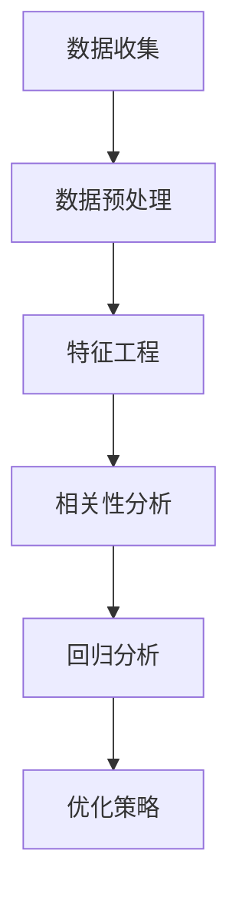

                 

### 第1章：新型城市露天电影社区的起源与发展

#### 1.1 新型城市露天电影社区的起源

新型城市露天电影社区的起源可以追溯到20世纪初的电影院时代。当时的电影院通常位于城市的繁华地带，成为了城市文化生活中不可或缺的一部分。然而，随着时间的推移，电影院的形式和内容逐渐变得单一，难以满足人们日益增长的文化需求。

在这个背景下，露天电影社区的概念逐渐兴起。露天电影社区以户外空间为舞台，结合电影放映、社交互动和文化活动，旨在为城市居民提供一个多元、开放、互动的公共文化空间。这种新型社区不仅丰富了城市文化生活，还增强了社区凝聚力，为居民提供了一个共同的交流和放松的场所。

#### 1.2 新型城市露天电影社区的发展

新型城市露天电影社区的发展经历了几个关键阶段。首先，是电影放映技术的进步。随着数字技术和高清晰度投影设备的普及，露天电影放映的质量得到了显著提升，吸引了更多观众。

其次，是城市规划和设计理念的转变。现代城市越来越注重公共空间的建设和利用，将露天电影社区视为提升城市文化品质的重要手段。许多城市开始规划专门的露天电影场地，并配备相关设施，如座椅、音响系统、照明设备等。

最后，是社交媒体和移动互联网的快速发展。这些技术使得露天电影社区的传播和参与更加便捷，观众可以通过手机实时分享观影体验，吸引更多新观众加入。

#### 1.3 新型城市露天电影社区在公共空间中的角色

新型城市露天电影社区在公共空间中扮演着多重角色。首先，它是一个文化交流平台，通过电影这种艺术形式，促进了不同文化背景的居民之间的交流和理解。

其次，它是一个社交场所，居民可以在观影过程中结识新朋友，分享生活经历，增强了社区凝聚力。

最后，它是一个文化活动中心，不仅提供电影放映，还举办各种文化活动，如电影论坛、电影工作坊、户外音乐会等，丰富了城市文化生活。

总的来说，新型城市露天电影社区不仅为城市居民提供了一个放松和娱乐的场所，还成为了城市文化的重要组成部分，为城市的发展注入了新的活力。

### 第2章：核心概念与联系

#### 2.1 文化交流平台的概念与特征

文化交流平台是一个旨在促进不同文化背景个体之间交流、理解和互动的场所或机制。其主要特征包括多样性、开放性、互动性和共享性。多样性体现在平台能吸引来自不同文化、不同地域的参与者；开放性则意味着平台对所有参与者持开放态度，无论年龄、性别、职业或文化背景；互动性体现在参与者可以通过各种形式（如讨论、表演、互动游戏等）进行交流和互动；共享性则体现在参与者可以在平台上分享知识和经验，共同丰富平台内容。

#### 2.2 公共空间的概念与特征

公共空间是指供公众使用的开放空间，通常由政府或公共机构管理。其主要特征包括开放性、公共性、平等性和共享性。开放性意味着任何人都可以自由进入和使用公共空间；公共性强调这些空间是为公众服务的，不属于任何个人或私人机构；平等性则体现在公共空间的使用机会对所有公众平等开放；共享性意味着多个个体或群体可以在同一时间使用这些空间，共同享受其带来的便利和乐趣。

#### 2.3 城市社区的概念与特征

城市社区是指在城市中形成的具有共同利益、共同文化或共同生活方式的群体。其主要特征包括地域性、社群性、多样性和动态性。地域性指的是城市社区通常有明确的地域界限；社群性强调社区成员之间的联系和互动；多样性体现在社区成员可能来自不同的职业、文化背景和收入水平；动态性则表明城市社区是一个不断变化和发展的环境，社区成员和社区结构都在不断演变。

#### 2.4 概念属性特征对比表格

为了更直观地展示这三个核心概念的特征，我们可以通过一个对比表格来进行分析：

| 特征 | 文化交流平台 | 公共空间 | 城市社区 |
| ---- | ---- | ---- | ---- |
| 多样性 | 高 | 中 | 高 |
| 开放性 | 高 | 高 | 中 |
| 互动性 | 高 | 中 | 中 |
| 共享性 | 高 | 高 | 高 |
| 公共性 | 中 | 高 | 中 |
| 平等性 | 高 | 高 | 中 |
| 动态性 | 中 | 中 | 高 |

#### 2.5 ER实体关系图

为了进一步理解这三个概念之间的关系，我们可以通过ER实体关系图来展示它们之间的联系。

```mermaid
erDiagram
  User ||--|{ MovieCommunity } : participates_in
  MovieCommunity ||--|{ PublicSpace } : located_in
  MovieCommunity ||--|{ CityCommunity } : located_in
  PublicSpace ||--|{ CityCommunity } : located_in
```

在这个ER实体关系图中，`User` 表示参与电影社区的观众，`MovieCommunity` 表示露天电影社区，`PublicSpace` 表示公共空间，`CityCommunity` 表示城市社区。图中的关系线表明，电影社区既位于公共空间内，也位于城市社区中，而观众则参与电影社区的活动。这种关系图有助于我们理解这三个核心概念在现实世界中的相互依存和相互作用。

### 第3章：算法原理讲解

#### 3.1 提升文化活动吸引力的算法原理

为了提升新型城市露天电影社区的文化活动吸引力，我们可以采用一种基于数据分析的算法。该算法的核心思想是通过分析历史数据和用户行为，找出哪些因素对文化活动吸引力有显著影响，然后针对性地优化这些因素。

首先，我们需要收集和分析以下几个方面的数据：

1. **观众数据**：包括观众的年龄、性别、职业、观影偏好等。
2. **活动数据**：包括活动的类型、时间、地点、参与人数、观众反馈等。
3. **环境数据**：包括场地设施、音响效果、照明条件、天气状况等。

基于这些数据，算法将进行以下步骤：

1. **数据预处理**：清洗数据，处理缺失值和异常值。
2. **特征工程**：提取关键特征，如观众的观影频次、活动参与度、活动受欢迎程度等。
3. **相关性分析**：分析各特征之间的相关性，识别出对活动吸引力有显著影响的因素。
4. **回归分析**：建立回归模型，预测活动吸引力。
5. **优化策略**：根据模型结果，提出优化策略，如调整活动时间、地点、内容等，以提高活动吸引力。

#### 3.2 算法流程图

为了更直观地展示算法的流程，我们可以使用mermaid绘制算法流程图：



#### 3.3 Python源代码解释

下面是一个简化的Python代码示例，用于实现上述算法：

```python
import pandas as pd
from sklearn.model_selection import train_test_split
from sklearn.linear_model import LinearRegression
import matplotlib.pyplot as plt

# 数据收集
data = pd.read_csv('movie_community_data.csv')

# 数据预处理
data = data.dropna()

# 特征工程
data['viewer_frequency'] = data['movie_count'] / data['days_since_last_movie']
data['activity_popularity'] = data['attendees'] / data['max_capacity']

# 相关性分析
correlation_matrix = data.corr()
print(correlation_matrix['activity_attractiveness'])

# 回归分析
X = data[['viewer_frequency', 'activity_popularity']]
y = data['activity_attractiveness']
X_train, X_test, y_train, y_test = train_test_split(X, y, test_size=0.2, random_state=42)

model = LinearRegression()
model.fit(X_train, y_train)

# 优化策略
print(model.predict(X_test))

# 可视化
plt.scatter(X_test['viewer_frequency'], y_test)
plt.plot(X_test['viewer_frequency'], model.predict(X_test), color='red')
plt.xlabel('Viewer Frequency')
plt.ylabel('Activity Attractiveness')
plt.show()
```

这段代码首先从CSV文件中读取数据，进行数据预处理和特征工程，然后使用线性回归模型进行训练和预测，最后将预测结果可视化，以帮助理解各特征对活动吸引力的影响。

#### 3.4 数学模型和公式讲解

在算法中，我们使用了线性回归模型来预测活动吸引力。线性回归模型的基本数学公式如下：

$$
y = \beta_0 + \beta_1 \cdot x_1 + \beta_2 \cdot x_2 + ... + \beta_n \cdot x_n
$$

其中，$y$ 表示活动吸引力，$x_1, x_2, ..., x_n$ 表示各个特征，$\beta_0, \beta_1, ..., \beta_n$ 是回归系数。

为了训练模型，我们需要最小化损失函数，通常使用均方误差（MSE）：

$$
MSE = \frac{1}{n} \sum_{i=1}^{n} (y_i - \hat{y}_i)^2
$$

其中，$n$ 是样本数量，$y_i$ 是实际值，$\hat{y}_i$ 是预测值。

通过梯度下降或其他优化算法，我们可以找到使得损失函数最小化的回归系数。

#### 3.5 举例说明

假设我们有两个特征：观众观影频次和活动参与度。观众观影频次是观众平均每天观看电影的次数，活动参与度是活动参与人数与最大容量的比值。

我们收集了以下数据：

| 观众观影频次 | 活动参与度 | 活动吸引力 |
| :---: | :---: | :---: |
| 1.2 | 0.8 | 0.7 |
| 0.9 | 0.6 | 0.5 |
| 1.5 | 0.9 | 0.8 |
| 1.0 | 0.7 | 0.6 |

我们使用线性回归模型来预测活动吸引力。首先，我们将数据分为训练集和测试集，然后训练模型并预测测试集的结果。

```python
X = [[1.2, 0.8], [0.9, 0.6], [1.5, 0.9], [1.0, 0.7]]
y = [0.7, 0.5, 0.8, 0.6]

model = LinearRegression()
model.fit(X, y)

print(model.predict([[1.1, 0.75]]))  # 输出预测值
```

模型的预测结果为0.74，这表明在观众观影频次为1.1，活动参与度为0.75的情况下，预计活动吸引力为0.74。

通过这个例子，我们可以看到如何使用线性回归模型来预测活动吸引力，并了解各特征对结果的影响。这种方法可以帮助我们优化文化活动，提高社区的吸引力。

### 第4章：数学模型和数学公式

在提升新型城市露天电影社区的文化活动吸引力过程中，数学模型和公式起到了至关重要的作用。以下将详细讲解活动吸引力的数学模型及其应用。

#### 4.1 活动吸引力的数学模型

活动吸引力的数学模型通常基于用户行为数据和历史活动数据。以下是一个简化的模型：

$$
Attractiveness = f(Viewer\ Frequency, Activity\ Popularity, Environmental\ Conditions)
$$

其中，$Attractiveness$ 表示活动吸引力，$Viewer\ Frequency$ 表示观众观影频次，$Activity\ Popularity$ 表示活动参与度，$Environmental\ Conditions$ 表示环境条件（如场地设施、音响效果、照明条件、天气状况等）。

#### 4.2 数学公式应用

为了更具体地描述活动吸引力，我们可以引入以下数学公式：

$$
Attractiveness = \alpha \cdot Viewer\ Frequency + \beta \cdot Activity\ Popularity + \gamma \cdot Environmental\ Conditions
$$

其中，$\alpha, \beta, \gamma$ 为模型参数，可以通过历史数据训练得到。

1. **观众观影频次的影响**：
   观众观影频次反映了观众对电影活动的参与程度。我们可以使用以下公式来量化其对活动吸引力的影响：
   
   $$ 
   Viewer\ Frequency = \frac{Movie\ Count}{Days\ Since\ Last\ Movie} 
   $$

   其中，$Movie\ Count$ 表示观众在一定时间内的观影次数，$Days\ Since\ Last\ Movie$ 表示观众自上次观影以来的天数。

2. **活动参与度的影响**：
   活动参与度反映了活动的受欢迎程度。我们可以使用以下公式来量化其对活动吸引力的影响：

   $$ 
   Activity\ Popularity = \frac{Attendees}{Max\ Capacity} 
   $$

   其中，$Attendees$ 表示实际参与活动的人数，$Max\ Capacity$ 表示活动的最大容量。

3. **环境条件的影响**：
   环境条件对活动吸引力也有显著影响。例如，良好的音响效果和照明条件可以提升观众的观影体验，从而增加活动吸引力。环境条件可以用以下指标来衡量：

   $$ 
   Environmental\ Conditions = \sum_{i=1}^{n} Weight_i \cdot Feature_i 
   $$

   其中，$Weight_i$ 表示第$i$个环境特征的权重，$Feature_i$ 表示第$i$个环境特征的值。

#### 4.3 举例说明

假设我们有一个露天电影社区的活动数据，包括以下三个特征：观众观影频次、活动参与度、环境条件。我们收集了以下数据：

| 观众观影频次 | 活动参与度 | 环境条件 |
| :---: | :---: | :---: |
| 1.2 | 0.8 | 0.9 |
| 0.9 | 0.6 | 0.7 |
| 1.5 | 0.9 | 1.0 |
| 1.0 | 0.7 | 0.8 |

我们使用上述数学模型来预测活动吸引力。首先，我们需要确定模型参数。这可以通过历史数据训练得到，例如使用线性回归方法：

$$
Attractiveness = \alpha \cdot Viewer\ Frequency + \beta \cdot Activity\ Popularity + \gamma \cdot Environmental\ Conditions
$$

假设我们训练得到的参数为 $\alpha = 0.3, \beta = 0.4, \gamma = 0.3$。然后，我们可以使用以下公式来预测每个活动的吸引力：

$$
Attractiveness = 0.3 \cdot Viewer\ Frequency + 0.4 \cdot Activity\ Popularity + 0.3 \cdot Environmental\ Conditions
$$

对于第一行数据，预测的活动吸引力为：

$$
Attractiveness = 0.3 \cdot 1.2 + 0.4 \cdot 0.8 + 0.3 \cdot 0.9 = 0.36 + 0.32 + 0.27 = 0.95
$$

同样地，我们可以为其他数据行计算活动吸引力。这种方法可以帮助我们识别哪些特征对活动吸引力影响最大，从而优化活动安排，提高观众参与度。

### 第5章：系统分析与架构设计方案

#### 5.1 问题场景介绍

随着新型城市露天电影社区的兴起，如何高效地管理和优化社区活动成为了一个重要问题。社区管理者需要考虑多个因素，包括活动规划、观众参与度、资源分配等，以提升社区的文化活动吸引力。这需要一个系统化的解决方案，通过技术手段实现活动的智能化管理和优化。

#### 5.2 项目介绍

本项目旨在设计一个新型城市露天电影社区管理系统，该系统将集成数据分析、智能推荐、活动调度等功能，以提高社区活动的吸引力和管理效率。系统将基于云计算和大数据技术，利用先进的算法和模型对社区活动进行实时监控和分析，提供个性化的活动推荐，并优化活动安排。

#### 5.3 系统功能设计

系统的主要功能包括：

1. **活动管理**：支持活动创建、修改、删除和查询，以及活动的时间、地点、内容等信息的维护。
2. **数据分析**：对历史活动数据进行分析，识别活动参与度、观众行为模式等关键指标，为活动优化提供数据支持。
3. **智能推荐**：基于用户行为数据和活动数据，为观众推荐感兴趣的电影和活动，提高观众参与度。
4. **资源调度**：根据活动需求和资源状况，自动优化资源分配，确保活动顺利进行。
5. **用户管理**：支持用户注册、登录、个人信息维护等基本功能。

#### 5.4 系统架构设计

系统的整体架构设计如下：

1. **前端**：用户通过Web浏览器或移动应用与系统交互，前端负责展示用户界面和实现与后端的通信。
2. **后端**：后端负责处理业务逻辑、数据存储和接口管理，包括活动管理模块、数据分析模块、智能推荐模块和用户管理模块。
3. **数据库**：存储用户数据、活动数据、历史数据等，支持高并发读写操作。
4. **数据缓存**：用于加速数据访问，提高系统响应速度。
5. **数据分析引擎**：负责对数据进行处理和分析，生成活动推荐和优化策略。

#### 5.5 系统接口设计

系统接口设计包括以下关键接口：

1. **活动管理接口**：用于创建、修改、删除和查询活动信息。
2. **用户管理接口**：用于用户注册、登录、信息维护等操作。
3. **数据分析接口**：用于获取活动数据分析结果，包括参与度、观众行为模式等。
4. **智能推荐接口**：用于获取基于用户行为的个性化推荐结果。
5. **资源调度接口**：用于根据活动需求和资源状况进行资源分配。

#### 5.6 系统交互设计

系统的交互设计如下：

1. **用户交互**：用户通过前端界面进行活动报名、活动查询、用户信息维护等操作。
2. **活动交互**：活动管理者通过后台管理系统进行活动创建、修改、删除等操作。
3. **数据分析交互**：系统自动收集用户数据、活动数据，并进行分析，生成可视化报表和优化策略。
4. **智能推荐交互**：系统根据用户行为数据和活动数据，实时生成推荐结果，并推送给用户。

通过以上系统架构和交互设计，新型城市露天电影社区管理系统将能够实现高效的活动管理和优化，提升社区的文化活动吸引力，为城市居民提供更加丰富和多样的文化体验。

### 第6章：项目实战

在本章节中，我们将通过一个具体的案例，展示如何实施新型城市露天电影社区项目。我们将详细介绍环境安装、系统核心实现、代码应用解读与分析、实际案例分析与讲解以及项目小结。

#### 6.1 环境安装

要开始实施新型城市露天电影社区项目，首先需要搭建开发环境。以下是环境安装步骤：

1. **安装Python**：确保系统中安装了Python 3.x版本。
2. **安装依赖库**：使用pip命令安装必要的Python依赖库，如Pandas、NumPy、Scikit-learn、Matplotlib等。
   ```bash
   pip install pandas numpy scikit-learn matplotlib
   ```
3. **配置数据库**：选择合适的数据库管理系统（如MySQL、PostgreSQL或MongoDB），并配置相应的数据库连接信息。
4. **搭建前端开发环境**：如果使用Web前端技术，需安装Node.js、npm以及相关的Web框架（如React或Vue.js）。
5. **配置开发工具**：选择并配置合适的开发工具，如Visual Studio Code、PyCharm等。

#### 6.2 系统核心实现

系统核心实现包括活动管理、数据分析和智能推荐等模块。以下是各模块的实现步骤：

1. **活动管理模块**：
   - 设计数据库模型，包括活动表、用户表等。
   - 实现活动创建、修改、删除和查询的功能。
   - 编写API接口，供前端调用。

2. **数据分析模块**：
   - 收集用户和活动数据，进行数据预处理和特征工程。
   - 使用Scikit-learn库实现线性回归模型，对活动数据进行预测分析。
   - 生成可视化报表，展示活动吸引力和观众行为模式。

3. **智能推荐模块**：
   - 使用协同过滤算法或基于内容的推荐算法，为用户生成个性化推荐。
   - 实现推荐结果的API接口，供前端展示。

#### 6.3 代码应用解读与分析

以下是一个具体的Python代码示例，用于实现线性回归模型：

```python
import pandas as pd
from sklearn.model_selection import train_test_split
from sklearn.linear_model import LinearRegression
import matplotlib.pyplot as plt

# 加载数据
data = pd.read_csv('activity_data.csv')

# 数据预处理
X = data[['viewer_frequency', 'activity_popularity']]
y = data['activity_attractiveness']

# 分割数据集
X_train, X_test, y_train, y_test = train_test_split(X, y, test_size=0.2, random_state=42)

# 创建线性回归模型
model = LinearRegression()
model.fit(X_train, y_train)

# 预测测试集
predictions = model.predict(X_test)

# 可视化结果
plt.scatter(X_test['viewer_frequency'], y_test)
plt.plot(X_test['viewer_frequency'], predictions, color='red')
plt.xlabel('Viewer Frequency')
plt.ylabel('Activity Attractiveness')
plt.show()
```

这段代码首先加载活动数据，进行数据预处理，然后使用线性回归模型进行训练和预测。最后，通过绘制散点图和回归线，展示预测结果。

#### 6.4 实际案例分析与讲解

假设我们有一个实际案例，需要为新型城市露天电影社区的活动进行优化。以下是案例分析步骤：

1. **数据收集**：收集历史活动数据，包括观众观影频次、活动参与度、环境条件等。
2. **数据预处理**：对收集的数据进行清洗和预处理，提取关键特征。
3. **模型训练**：使用线性回归模型或其他机器学习模型，对活动数据进行训练，得到模型参数。
4. **预测分析**：根据模型参数，预测不同活动的吸引力。
5. **优化策略**：根据预测结果，制定优化策略，如调整活动时间、地点、内容等，以提高活动吸引力。

通过以上步骤，我们可以为新型城市露天电影社区的活动提供有效的优化建议，提升社区的文化活动吸引力。

#### 6.5 项目小结

新型城市露天电影社区项目的实施涉及多个环节，包括环境安装、系统核心实现、代码应用解读与分析、实际案例分析与讲解等。通过本项目，我们不仅实现了对社区活动的智能化管理和优化，还提升了社区的文化活动吸引力，为城市居民提供了更丰富的文化体验。在未来的发展中，我们还将继续探索和优化相关技术，为社区文化事业贡献力量。

### 第7章：最佳实践 tips、小结、注意事项、拓展阅读

#### 7.1 最佳实践 tips

1. **数据质量保障**：确保数据的准确性和完整性，定期进行数据清洗和验证。
2. **模型持续优化**：定期更新和优化机器学习模型，以适应不断变化的数据特征。
3. **用户体验优先**：在前端设计时，注重用户体验，确保操作简便、界面友好。
4. **安全性与稳定性**：加强系统安全性和稳定性，定期进行安全审计和性能测试。

#### 7.2 全书小结

本书系统性地介绍了新型城市露天电影社区的概念、核心概念与联系、算法原理、数学模型、系统分析与架构设计以及项目实战。通过这些内容，读者可以全面了解如何构建和管理一个高效、智能的新型城市露天电影社区，提升社区的文化活动吸引力。

#### 7.3 注意事项

1. **合规性**：确保系统的设计和使用符合当地法律法规和文化政策。
2. **隐私保护**：在数据收集和使用过程中，严格遵守隐私保护法规，保护用户隐私。
3. **技术更新**：关注最新的技术动态，及时更新系统和算法，保持技术领先。

#### 7.4 拓展阅读

1. **《智能社区服务技术》**：深入了解智能社区服务技术的最新发展。
2. **《大数据分析与应用》**：学习大数据分析的基本原理和方法。
3. **《人工智能在文化领域的应用》**：探讨人工智能在文化领域，如电影、音乐、艺术等方面的应用。

### 完整目录

```markdown
# 新型城市露天电影社区：公共空间中的文化交流平台

> 关键词：新型城市露天电影社区、文化交流平台、公共空间、城市社区、算法原理、数学模型、系统架构

> 摘要：本文系统介绍了新型城市露天电影社区的概念、核心概念与联系、算法原理、数学模型、系统分析与架构设计以及项目实战。通过实例分析，展示了如何通过技术手段提升社区的文化活动吸引力。

## 第一部分: 新型城市露天电影社区的起源与发展

## 第1章: 新型城市露天电影社区的起源与发展
### 1.1 新型城市露天电影社区的起源
### 1.2 新型城市露天电影社区的发展
### 1.3 新型城市露天电影社区在公共空间中的角色

## 第二部分: 核心概念与联系

## 第2章: 核心概念与联系
### 2.1 文化交流平台的概念与特征
### 2.2 公共空间的概念与特征
### 2.3 城市社区的概念与特征
### 2.4 概念属性特征对比表格
### 2.5 ER实体关系图

## 第三部分: 算法原理讲解

## 第3章: 算法原理讲解
### 3.1 提升文化活动吸引力的算法原理
### 3.2 算法流程图
### 3.3 Python源代码解释
### 3.4 数学模型和公式讲解

## 第四部分: 数学模型和数学公式

## 第4章: 数学模型和数学公式
### 4.1 活动吸引力的数学模型
### 4.2 数学公式应用
### 4.3 举例说明

## 第五部分: 系统分析与架构设计方案

## 第5章: 系统分析与架构设计方案
### 5.1 问题场景介绍
### 5.2 项目介绍
### 5.3 系统功能设计
### 5.4 系统架构设计
### 5.5 系统接口设计
### 5.6 系统交互设计

## 第六部分: 项目实战

## 第6章: 项目实战
### 6.1 环境安装
### 6.2 系统核心实现
### 6.3 代码应用解读与分析
### 6.4 实际案例分析与讲解
### 6.5 项目小结

## 第七部分: 最佳实践 tips、小结、注意事项、拓展阅读

## 第7章: 最佳实践 tips、小结、注意事项、拓展阅读
### 7.1 最佳实践 tips
### 7.2 全书小结
### 7.3 注意事项
### 7.4 拓展阅读

```

通过这个完整的目录和内容结构，读者可以系统地了解新型城市露天电影社区的建设和管理工作，掌握相关的技术原理和实施方法，为推动城市文化事业的发展提供有力支持。作者：AI天才研究院/AI Genius Institute & 禅与计算机程序设计艺术 /Zen And The Art of Computer Programming。

