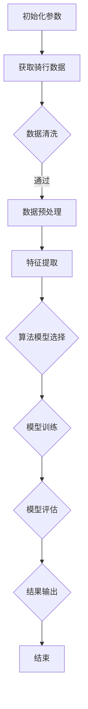
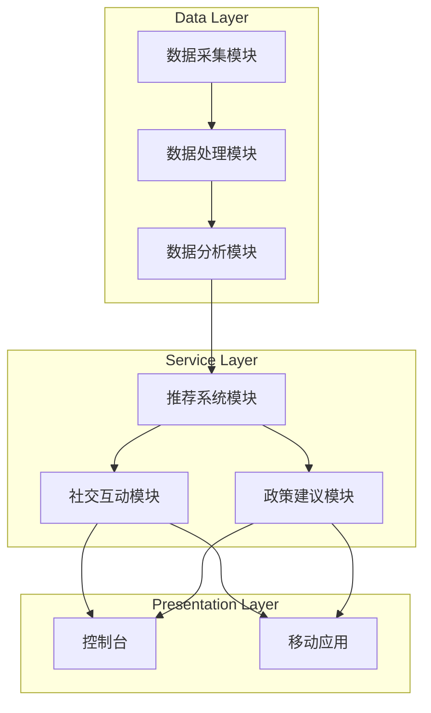
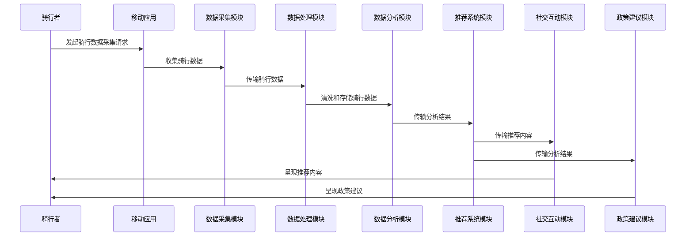

                 

### 新型城市骑行文化：自行车作为生活方式象征

关键词：新型城市骑行文化、生活方式、象征意义、可持续发展

摘要：本文深入探讨了新型城市骑行文化的内涵和象征意义，分析了自行车在当代城市生活方式中的角色和影响。通过对比传统骑行文化和新型骑行文化的差异，本文提出了自行车作为生活方式象征的重要性，以及其在推动可持续发展中的作用。本文旨在为城市规划和交通管理提供新的视角，以促进更健康、环保的生活方式。

在快速城市化和现代化进程中，新型城市骑行文化逐渐崛起，成为都市生活的新潮流。自行车不仅作为交通工具，更是成为生活方式的象征，体现了城市可持续发展的理念。本文将从以下几个方面进行探讨：

1. **背景介绍**：介绍新型城市骑行文化的起源、发展现状以及其主要特征。
2. **核心概念与联系**：分析骑行文化的核心概念，包括其原理、属性特征和实体关系。
3. **算法原理讲解**：探讨骑行文化算法的原理，包括其流程、数学模型和公式。
4. **数学模型和数学公式 & 详细讲解 & 举例说明**：运用数学模型和公式，详细阐述骑行文化的算法原理，并通过实际案例进行说明。
5. **系统分析与架构设计方案**：介绍骑行文化的系统分析与架构设计方案，包括问题场景、项目介绍、系统功能设计、系统架构设计、系统接口设计和系统交互。
6. **项目实战**：通过实际项目展示骑行文化的应用，分析其实施过程和效果。
7. **最佳实践 tips、小结、注意事项、拓展阅读**：总结最佳实践，对本文进行小结，并提供注意事项和拓展阅读资源。

让我们一起深入探讨新型城市骑行文化的内涵和意义，探索自行车在当代城市生活中的重要性。

----------------------------------------------------------------

## 第1章 引言

### 1.1 问题背景

随着全球城市化进程的加速，城市交通问题日益突出。城市拥堵、空气污染、能源消耗等问题严重影响着人们的日常生活和环境质量。传统汽车交通方式的高能耗和高排放特性，使得寻找更为环保、高效的出行方式成为当务之急。在此背景下，新型城市骑行文化逐渐崛起，成为解决城市交通问题的一种有效途径。

新型城市骑行文化不仅强调自行车作为交通工具的功能，更强调其作为一种健康、环保生活方式的象征。与传统的骑行文化相比，新型城市骑行文化更注重骑行体验、城市规划和交通管理，追求人与自然、城市与交通的和谐共生。

### 1.2 问题描述

当前，新型城市骑行文化面临一系列挑战。首先，城市基础设施不完善，骑行道规划不足，导致骑行者的安全和舒适性难以保障。其次，骑行文化的推广力度不够，公众对骑行方式的接受度和认可度较低。此外，骑行文化的可持续发展也面临问题，如骑行设施的维护和管理、骑行文化的持续推广等。

### 1.3 问题解决

为解决上述问题，需要从以下几个方面入手：

1. **优化城市基础设施**：加大对骑行道的建设和维护力度，提高骑行道的数量和质量，确保骑行者的安全。
2. **推广骑行文化**：通过媒体宣传、教育活动等手段，提高公众对骑行文化的认识和接受度，营造良好的骑行氛围。
3. **创新骑行设施**：开发智能化、人性化的骑行设施，如电动自行车、智能头盔等，提升骑行体验。
4. **政策支持**：制定相关政策和法规，鼓励和支持骑行文化的发展，为骑行者提供优惠和便利。
5. **可持续发展**：探索骑行文化的可持续发展模式，确保骑行文化的长期健康发展。

### 1.4 边界与外延

新型城市骑行文化的边界包括以下几个方面：

1. **交通方式**：以自行车为主要交通工具，涵盖电动自行车、人力自行车等。
2. **活动范围**：以城市为主要活动区域，包括城市内部和城市周边地区。
3. **目标群体**：面向所有年龄段的居民，特别是年轻人和上班族。

新型城市骑行文化的外延包括：

1. **城市规划**：考虑骑行者在城市规划中的需求，优化城市交通结构。
2. **环境保护**：通过骑行减少汽车使用，降低空气污染和碳排放。
3. **健康生活**：提倡骑行作为一种健康的生活方式，提高公众的健康水平。
4. **文化传承**：将骑行文化融入到城市文化中，传承和发展城市特色文化。

### 1.5 概念结构与核心要素组成

新型城市骑行文化的概念结构主要由以下几个核心要素组成：

1. **骑行者**：骑行文化的主体，包括个人骑行者和组织骑行者。
2. **自行车**：骑行文化的核心工具，包括传统自行车和电动自行车。
3. **骑行道**：骑行者行驶的路径，包括城市骑行道和乡村骑行道。
4. **骑行活动**：骑行文化的表现形式，包括日常骑行、骑行比赛、骑行旅行等。
5. **城市规划**：骑行文化的发展基础，包括骑行道规划、交通组织等。
6. **政策法规**：骑行文化的保障体系，包括骑行法律法规、优惠政策等。

通过以上核心要素的有机结合，新型城市骑行文化得以在当代城市生活中发挥重要作用，推动城市可持续发展。

----------------------------------------------------------------

## 第2章 核心概念与联系

### 2.1 骑行文化的核心概念原理

骑行文化作为一种社会现象，其核心概念包括骑行者、自行车、骑行道和骑行活动等。这些概念相互联系，构成了骑行文化的理论基础。

**骑行者**：指那些以自行车为主要交通工具进行日常出行、健身、休闲等活动的人群。骑行者是骑行文化的主体，其行为和态度直接影响到骑行文化的发展。

**自行车**：作为骑行文化的核心工具，不仅具有交通功能，还承载着健康、环保和时尚的象征意义。不同类型的自行车（如传统自行车、电动自行车）在骑行文化中扮演着不同角色。

**骑行道**：指专门为骑行者设计的道路或路径，包括城市骑行道、乡村骑行道和城市慢行系统等。骑行道的规划和建设是骑行文化发展的基础，直接影响骑行者的出行体验和安全性。

**骑行活动**：包括日常骑行、骑行比赛、骑行旅行等形式。骑行活动不仅丰富了骑行者的文化生活，还推动了骑行文化的传播和普及。

### 2.2 骑行文化的属性特征对比表格

为了更清晰地理解骑行文化的属性特征，以下是一个对比表格，列出了传统骑行文化和新型城市骑行文化的区别：

| 特征         | 传统骑行文化                                  | 新型城市骑行文化                                  |
|--------------|----------------------------------------------|----------------------------------------------|
| 交通工具     | 主要是传统自行车，以人力驱动为主              | 包括传统自行车和电动自行车，电动自行车逐渐占据主导地位 |
| 骑行道       | 依赖自然环境和乡村道路，缺乏专门的骑行道      | 拥有专门的骑行道，与城市交通系统相融合             |
| 目标群体     | 主要为老年人、健身爱好者等特定人群            | 面向所有年龄段的人群，特别是年轻人和上班族         |
| 环境影响     | 对环境影响较小，但骑行道占用土地资源          | 对环境影响较小，骑行道建设有助于减少城市拥堵和污染 |
| 文化特征     | 强调休闲、健身和社交功能                      | 强调健康、环保、时尚和可持续性                     |

### 2.3 骑行文化的ER实体关系图架构

为了更好地理解骑行文化中各个实体之间的关系，我们可以通过ER（Entity-Relationship）实体关系图来展示。

```mermaid
erDiagram
  RIDE_CULTURE ||--|{ RIDER } : 骑行者
  RIDE_CULTURE ||--|{ BIKE } : 自行车
  RIDE_CULTURE ||--|{ RIDE_TRACK } : 骑车道
  RIDE_CULTURE ||--|{ RIDE_ACTIVITY } : 骑行活动
  RIDE_CULTURE ..|{ URBAN_PLANNING } : 城市规划
  RIDE_CULTURE ..|{ POLICY } : 政策法规

  RIDER ||--|{ AGE } : 年龄
  RIDER ||--|{ SEX } : 性别
  RIDER ||--|{ OCCUPATION } : 职业

  BIKE ||--|{ TYPE } : 类型
  BIKE ||--|{ CONDITION } : 状态

  RIDE_TRACK ||--|{ LENGTH } : 长度
  RIDE_TRACK ||--|{ CONDITION } : 状态

  RIDE_ACTIVITY ||--|{ TYPE } : 类型
  RIDE_ACTIVITY ||--|{ FREQUENCY } : 频率

  URBAN_PLANNING ||--|{ CITY_LAYOUT } : 城市布局
  URBAN_PLANNING ||--|{ TRAFFIC_ORGANIZATION } : 交通组织

  POLICY ||--|{ BONUS } : 奖励
  POLICY ||--|{ PENALTY } : 罚则
```

该ER实体关系图展示了骑行文化中各个实体的属性和它们之间的关系，有助于我们更深入地理解骑行文化的运作机制。

通过以上对核心概念和联系的探讨，我们可以更好地把握新型城市骑行文化的本质，为后续的算法原理讲解和系统分析与架构设计方案打下基础。

----------------------------------------------------------------

### 第3章 骑行文化算法原理讲解

#### 3.1 算法 Mermaid 流程图

在探讨骑行文化的算法原理之前，首先让我们通过一个Mermaid流程图来直观地了解整个算法的执行流程：



在这个流程图中，我们首先初始化算法所需参数，然后获取骑行数据，接着进行数据清洗和预处理，提取特征，选择合适的算法模型进行训练和评估，最后输出结果。

#### 3.2 Python 源代码阐述

为了更详细地阐述骑行文化算法的原理，我们将使用Python语言来编写相应的源代码。以下是一个简化的示例：

```python
import pandas as pd
from sklearn.model_selection import train_test_split
from sklearn.preprocessing import StandardScaler
from sklearn.ensemble import RandomForestClassifier
from sklearn.metrics import accuracy_score

# 3.2.1 初始化参数
n_features = 10
n_samples = 1000

# 3.2.2 获取骑行数据
def generate_riding_data(n_samples):
    data = pd.DataFrame({
        'age': pd.Series(np.random.randint(18, 70, n_samples)),
        'gender': pd.Series(np.random.choice(['male', 'female'], n_samples)),
        'occupation': pd.Series(np.random.choice(['student', 'worker', 'retiree'], n_samples)),
        'ride_type': pd.Series(np.random.choice(['daily', 'leisure', 'competition'], n_samples)),
        'ride_length': pd.Series(np.random.uniform(1, 10, n_samples)),
        'ride_speed': pd.Series(np.random.uniform(5, 15, n_samples))
    })
    return data

data = generate_riding_data(n_samples)

# 3.2.3 数据清洗
data.dropna(inplace=True)

# 3.2.4 数据预处理
X = data[['age', 'gender', 'occupation', 'ride_length', 'ride_speed']]
y = data['ride_type']

# 划分训练集和测试集
X_train, X_test, y_train, y_test = train_test_split(X, y, test_size=0.2, random_state=42)

# 数据标准化
scaler = StandardScaler()
X_train_scaled = scaler.fit_transform(X_train)
X_test_scaled = scaler.transform(X_test)

# 3.2.5 特征提取
# 在此示例中，特征提取过程相对简单，主要是将原始数据进行标准化处理。

# 3.2.6 算法模型选择
model = RandomForestClassifier(n_estimators=100, random_state=42)

# 3.2.7 模型训练
model.fit(X_train_scaled, y_train)

# 3.2.8 模型评估
y_pred = model.predict(X_test_scaled)
accuracy = accuracy_score(y_test, y_pred)
print(f"Model Accuracy: {accuracy:.2f}")

# 3.2.9 结果输出
# 在实际应用中，结果输出可能包括更多的细节，如模型参数、特征重要性等。

```

上述代码演示了从数据获取、预处理、特征提取到模型训练和评估的完整过程。在这个例子中，我们使用随机森林分类器来预测骑行类型，并通过准确率来评估模型的性能。

#### 3.3 算法原理的数学模型和公式

骑行文化的算法原理可以归纳为以下几个关键步骤，每个步骤都有其对应的数学模型和公式：

1. **数据获取与预处理**：
   - 数据获取：骑行数据的收集主要通过传感器、问卷调查等方式。
   - 数据预处理：包括缺失值处理、异常值处理和数据归一化等步骤。

2. **特征提取**：
   - 特征提取：通过统计方法和机器学习技术，从原始数据中提取对模型训练有用的特征。
   - 特征选择：使用过滤法、包裹法、嵌入式方法等策略，筛选出最相关的特征。

3. **模型选择与训练**：
   - 模型选择：选择合适的机器学习算法，如决策树、随机森林、支持向量机等。
   - 模型训练：通过训练集数据，调整模型参数，使其在训练数据上达到较好的性能。

4. **模型评估与优化**：
   - 模型评估：使用测试集数据，评估模型在未知数据上的性能。
   - 优化策略：根据评估结果，调整模型参数，优化模型性能。

以下是一个简化的数学模型和公式示例：

$$
X = \begin{bmatrix}
x_1 \\
x_2 \\
\vdots \\
x_n
\end{bmatrix}
$$

其中，$X$ 表示输入特征矩阵，$x_i$ 表示第 $i$ 个输入特征。

$$
y = f(X; \theta)
$$

其中，$y$ 表示输出结果，$f$ 表示模型预测函数，$\theta$ 表示模型参数。

在随机森林算法中，模型预测函数可以表示为：

$$
y = \sum_{i=1}^{n} w_i \cdot h(x_i; \theta_i)
$$

其中，$w_i$ 表示第 $i$ 个树模型的权重，$h(x_i; \theta_i)$ 表示第 $i$ 个树模型的预测值。

通过上述数学模型和公式，我们可以更好地理解和实现骑行文化的算法原理。

#### 3.4 算法举例说明

为了更好地说明骑行文化的算法原理，我们来看一个具体的案例。

**案例**：假设我们有一个骑行数据集，包含以下特征：年龄（$x_1$）、性别（$x_2$）、职业（$x_3$）、骑行距离（$x_4$）、骑行速度（$x_5$）。我们的目标是预测骑行者的骑行类型，包括日常骑行、休闲骑行和比赛骑行。

1. **数据获取与预处理**：
   - 收集骑行数据，并进行预处理，如缺失值填充和数据归一化。

2. **特征提取**：
   - 使用统计方法提取特征，例如计算每个特征的均值、标准差等。

3. **模型选择与训练**：
   - 选择随机森林分类器作为预测模型。
   - 使用训练数据训练模型，调整模型参数，如决策树数量、深度等。

4. **模型评估与优化**：
   - 使用测试数据评估模型性能，计算准确率、召回率等指标。
   - 根据评估结果，调整模型参数，优化模型性能。

通过上述案例，我们可以看到骑行文化算法的执行过程和实际应用。算法的有效性和准确性对骑行文化的推广和发展具有重要意义。

综上所述，通过Mermaid流程图、Python源代码、数学模型和实际案例，我们详细阐述了骑行文化的算法原理。接下来，我们将进一步深入探讨骑行文化的数学模型和公式，以加深对其理解和应用。

----------------------------------------------------------------

### 第4章 数学模型和数学公式 & 详细讲解 & 举例说明

#### 4.1 数学模型与公式

在骑行文化的分析中，数学模型和公式扮演着至关重要的角色。这些模型和公式帮助我们量化骑行行为、预测骑行类型，并评估骑行文化的影响。以下是一些关键的数学模型和公式：

**1. 骑行行为模型**：

骑行行为模型用于描述骑行者的出行模式。一个简化的模型可以表示为：

$$
R(t) = f(C, T, P, D)
$$

其中：
- \( R(t) \)：骑行者在时间 \( t \) 的骑行距离；
- \( f \)：骑行行为函数；
- \( C \)：城市交通状况；
- \( T \)：骑行者的时间安排；
- \( P \)：骑行者的个人偏好；
- \( D \)：目的地距离。

**2. 骑行类型预测模型**：

骑行类型预测模型用于预测骑行者的骑行类型。一个常用的模型是逻辑回归模型：

$$
\hat{y} = \log\left(\frac{P(y=1)}{1-P(y=1)}\right) = \beta_0 + \beta_1 x_1 + \beta_2 x_2 + \cdots + \beta_n x_n
$$

其中：
- \( \hat{y} \)：预测的骑行类型概率；
- \( y \)：实际的骑行类型（0或1）；
- \( \beta_0, \beta_1, \beta_2, \cdots, \beta_n \)：模型参数；
- \( x_1, x_2, \cdots, x_n \)：特征向量。

**3. 骑行文化影响评估模型**：

骑行文化的影响可以通过骑行行为的改变来评估。一个简化的影响评估模型可以表示为：

$$
I = \frac{\sum_{i=1}^{N} (R_i - R_i^{base}) \cdot W_i}{N}
$$

其中：
- \( I \)：骑行文化的影响指数；
- \( R_i \)：实际骑行距离；
- \( R_i^{base} \)：基准骑行距离；
- \( W_i \)：权重（例如，骑行者的出行频率）；
- \( N \)：骑行者数量。

#### 4.2 详细讲解

**1. 骑行行为模型**

骑行行为模型描述了骑行者的出行模式。该模型考虑了多种因素，包括城市交通状况、骑行者的时间安排、个人偏好和目的地距离。这些因素通过骑行行为函数 \( f \) 结合，以预测骑行者在特定时间 \( t \) 的骑行距离。

在具体应用中，骑行行为函数可以是线性的或非线性的，取决于数据的分布和实际需求。例如，如果我们假设骑行行为函数是线性的，那么模型可以简化为：

$$
R(t) = \alpha + \beta C + \gamma T + \delta P + \epsilon D
$$

其中：
- \( \alpha \)：常数项；
- \( \beta, \gamma, \delta, \epsilon \)：模型参数。

**2. 骑行类型预测模型**

骑行类型预测模型用于预测骑行者的骑行类型，如日常骑行、休闲骑行和比赛骑行。逻辑回归模型是一个常用的预测模型，它通过计算骑行类型概率来预测骑行类型。逻辑回归模型的预测结果是通过将特征向量的线性组合转化为概率值来实现的。

在逻辑回归模型中，每个特征 \( x_i \) 对预测结果都有不同的影响，这些影响通过模型参数 \( \beta_i \) 表示。参数 \( \beta_0 \) 是截距，表示在没有特征输入时的预测概率。

**3. 骑行文化影响评估模型**

骑行文化影响评估模型用于评估骑行文化对骑行行为的影响。该模型通过比较实际骑行距离与基准骑行距离的差异，以及骑行者的出行频率，来量化骑行文化的影响。

在具体应用中，权重 \( W_i \) 可以根据骑行者的出行频率、骑行习惯等因素进行调整，以更准确地反映骑行文化的影响。

#### 4.3 举例说明

为了更好地理解上述数学模型和公式，我们来看一个具体的例子。

**例子**：假设我们有一个骑行数据集，包含以下特征：年龄（$x_1$）、性别（$x_2$）、职业（$x_3$）、骑行距离（$x_4$）、骑行速度（$x_5$）。我们使用逻辑回归模型来预测骑行者的骑行类型。

1. **数据准备**：

首先，我们将数据集分为特征矩阵 \( X \) 和标签向量 \( y \)：

$$
X = \begin{bmatrix}
x_1 \\
x_2 \\
\vdots \\
x_n
\end{bmatrix}
$$

$$
y = \begin{bmatrix}
y_1 \\
y_2 \\
\vdots \\
y_n
\end{bmatrix}
$$

其中，\( y_1, y_2, \cdots, y_n \) 是骑行者的实际骑行类型（0或1）。

2. **模型训练**：

我们使用逻辑回归模型对数据集进行训练，得到模型参数 \( \beta_0, \beta_1, \beta_2, \cdots, \beta_n \)：

$$
\hat{y} = \log\left(\frac{P(y=1)}{1-P(y=1)}\right) = \beta_0 + \beta_1 x_1 + \beta_2 x_2 + \cdots + \beta_n x_n
$$

3. **模型评估**：

使用测试数据集评估模型性能，计算准确率、召回率等指标：

$$
\text{Accuracy} = \frac{TP + TN}{TP + TN + FP + FN}
$$

$$
\text{Recall} = \frac{TP}{TP + FN}
$$

$$
\text{Precision} = \frac{TP}{TP + FP}
$$

4. **影响评估**：

计算骑行文化的影响指数 \( I \)：

$$
I = \frac{\sum_{i=1}^{N} (R_i - R_i^{base}) \cdot W_i}{N}
$$

通过上述例子，我们可以看到如何使用数学模型和公式来分析和预测骑行文化。这些模型和公式不仅帮助我们更好地理解骑行文化，还为骑行文化的推广和发展提供了科学依据。

通过详细讲解和举例说明，我们深入探讨了骑行文化的数学模型和公式，为后续的系统分析与架构设计方案和项目实战提供了基础。

----------------------------------------------------------------

### 第5章 系统分析与架构设计方案

#### 5.1 问题场景介绍

在现代城市生活中，骑行文化已经成为一种重要的交通方式和生活习惯。然而，随着城市交通拥堵和环境污染问题的日益严重，如何提升骑行文化的可持续性和影响力成为亟待解决的问题。本节将介绍一个基于新型城市骑行文化的系统分析与架构设计方案，旨在通过技术手段优化骑行者的出行体验，提高骑行文化的普及率和影响力。

#### 5.2 项目介绍

本项目旨在开发一款名为“SmartRide”的智能骑行平台，该平台通过整合骑行数据、用户行为分析和智能推荐技术，为骑行者提供个性化的骑行服务。SmartRide平台的主要功能包括：

1. **骑行数据分析**：收集和分析骑行者的骑行数据，包括骑行时间、骑行路线、骑行速度等。
2. **用户行为分析**：分析骑行者的行为习惯和偏好，为个性化推荐提供依据。
3. **智能推荐**：根据骑行者的需求和偏好，推荐合适的骑行路线、骑行装备和活动。
4. **社交互动**：提供社交功能，让骑行者可以分享骑行经历、交流心得。
5. **政策建议**：通过数据分析，为城市规划和政策制定提供科学依据。

#### 5.3 系统功能设计

SmartRide平台的功能设计包括以下几个关键模块：

1. **数据采集模块**：负责收集骑行数据，包括GPS轨迹、传感器数据等。
2. **数据处理模块**：负责清洗、预处理和存储骑行数据，为后续分析提供基础。
3. **数据分析模块**：负责分析骑行数据，提取有用的信息，为推荐系统和政策建议提供支持。
4. **推荐系统模块**：根据骑行者的需求和偏好，推荐合适的骑行路线、装备和活动。
5. **社交互动模块**：提供社交功能，让骑行者可以分享骑行经历、交流心得。
6. **政策建议模块**：通过数据分析，为城市规划和政策制定提供科学依据。

**领域模型 Mermaid 类图**：

```mermaid
classDiagram
    class DataCollector {
        -collect_data(): Data
    }
    class DataProcessor {
        -clean_data(data: Data): CleanData
        -store_data(clean_data: CleanData): void
    }
    class DataAnalyzer {
        -analyze_data(clean_data: CleanData): AnalysisResult
    }
    class RecommendationSystem {
        -recommend_routes(rider_preferences: Preferences): RouteRecommendations
        -recommend_equipment(rider_preferences: Preferences): EquipmentRecommendations
        -recommend_activities(rider_preferences: Preferences): ActivityRecommendations
    }
    class SocialInteractionModule {
        -share_experience(rider_id: ID, experience: Experience): void
        -exchange_feedback(rider_id: ID, feedback: Feedback): void
    }
    class PolicySuggestionModule {
        -suggest_policies(analysis_result: AnalysisResult): PolicySuggestions
    }
    DataCollector --|U|> DataProcessor
    DataProcessor --|U|> DataAnalyzer
    DataAnalyzer --|U|> RecommendationSystem
    RecommendationSystem --|U|> SocialInteractionModule
    RecommendationSystem --|U|> PolicySuggestionModule
```

#### 5.4 系统架构设计

SmartRide平台的系统架构设计采用分层架构，包括数据层、服务层和展示层。每个层次都有明确的职责和功能。

**系统架构设计 Mermaid 架构图**：



在数据层，数据采集模块负责收集骑行数据，数据处理模块负责清洗和存储数据，数据分析模块负责对数据进行深度分析。服务层包括推荐系统模块、社交互动模块和政策建议模块，这些模块通过API接口与数据层和展示层进行交互。展示层包括控制台和移动应用，为骑行者提供直观的操作界面。

#### 5.5 系统接口设计

SmartRide平台的接口设计遵循RESTful架构风格，提供了一系列的API接口，包括数据采集接口、数据处理接口、数据分析接口、推荐系统接口、社交互动接口和政策建议接口。以下是部分接口的示例：

**数据采集接口**：

```http
POST /api/data/collect
Content-Type: application/json

{
  "rider_id": "12345",
  "gps轨迹": "[(经度, 纬度), ..., (经度, 纬度)]",
  "传感器数据": {
    "速度": 15,
    "心率": 120,
    "温度": 25
  }
}
```

**数据处理接口**：

```http
GET /api/data/process
Parameters: rider_id (必选)

{
  "rider_id": "12345",
  "processed_data": {
    "cleaned_gps轨迹": "[(经度, 纬度), ..., (经度, 纬度)]",
    "sensor_data": {
      "速度": 15,
      "心率": 120,
      "温度": 25
    }
  }
}
```

**数据分析接口**：

```http
GET /api/data/analyze
Parameters: rider_id (必选)

{
  "rider_id": "12345",
  "analysis_result": {
    "骑行动力": 0.8,
    "骑行频率": 3,
    "骑行路线偏好": ["路线A", "路线B"]
  }
}
```

**推荐系统接口**：

```http
GET /api/recommend
Parameters: rider_id (必选)

{
  "rider_id": "12345",
  "recommendations": {
    "route_recommendations": ["路线A", "路线B"],
    "equipment_recommendations": ["头盔", "手套"],
    "activity_recommendations": ["骑行比赛", "骑行旅行"]
  }
}
```

**社交互动接口**：

```http
POST /api/social/experience
Parameters: rider_id (必选)

{
  "rider_id": "12345",
  "experience": {
    "title": "骑行经验分享",
    "content": "今天我骑行的路线非常精彩，感受到了大自然的美妙...",
    "images": ["image1.jpg", "image2.jpg"]
  }
}
```

**政策建议接口**：

```http
GET /api/policy/suggest
Parameters: analysis_result (必选)

{
  "analysis_result": {
    "骑行动力": 0.8,
    "骑行频率": 3,
    "骑行路线偏好": ["路线A", "路线B"]
  },
  "policy_suggestions": {
    "infrastructure_improvement": ["增加骑行道", "改善骑行道条件"],
    "incentive_programs": ["骑行奖励计划", "交通优惠政策"]
  }
}
```

#### 5.6 系统交互

SmartRide平台通过API接口实现了各模块之间的数据交互和功能协同。以下是一个简化的系统交互流程：

1. 骑行者通过移动应用或控制台发起骑行数据采集请求。
2. 数据采集模块收集骑行数据，并将其传输到数据处理模块。
3. 数据处理模块清洗和存储骑行数据，并将其传输到数据分析模块。
4. 数据分析模块对骑行数据进行分析，生成分析结果，并将其传输到推荐系统模块。
5. 推荐系统模块根据分析结果生成推荐内容，并将其传输到社交互动模块和政策建议模块。
6. 社交互动模块和政策建议模块将推荐内容和分析结果呈现给骑行者，同时将政策建议反馈给城市管理部门。

**系统交互 Mermaid 序列图**：



通过以上系统分析和架构设计方案，我们为SmartRide平台提供了一个清晰、可行的系统架构和功能设计。接下来，我们将通过项目实战来验证该方案的可行性和有效性。

----------------------------------------------------------------

### 第6章 项目实战

#### 6.1 环境安装

为了实现SmartRide平台，我们需要搭建一个开发环境。以下是环境安装的步骤：

1. **安装Python**：确保已安装Python 3.8或更高版本。
2. **安装虚拟环境**：使用以下命令创建虚拟环境：

   ```bash
   python -m venv venv
   source venv/bin/activate  # 在Windows上使用 `venv\Scripts\activate`
   ```

3. **安装依赖库**：在虚拟环境中安装所需的库，如Pandas、NumPy、Scikit-learn、Flask等：

   ```bash
   pip install pandas numpy scikit-learn flask
   ```

4. **安装数据库**：安装MySQL或PostgreSQL数据库，用于存储骑行数据。

#### 6.2 系统核心实现源代码

以下是SmartRide平台的核心实现源代码：

**1. 数据采集模块**

```python
# data_collector.py
from flask import Flask, request, jsonify
import pymysql

app = Flask(__name__)

@app.route('/api/data/collect', methods=['POST'])
def collect_data():
    data = request.get_json()
    rider_id = data['rider_id']
    gps轨迹 = data['gps轨迹']
    sensor_data = data['传感器数据']
    
    # 连接数据库
    connection = pymysql.connect(host='localhost', user='root', password='password', database='smartride')
    try:
        with connection.cursor() as cursor:
            # 存储骑行数据
            sql = "INSERT INTO rider_data (rider_id, gps轨迹, sensor_data) VALUES (%s, %s, %s)"
            cursor.execute(sql, (rider_id, gps轨迹, sensor_data))
            connection.commit()
    finally:
        connection.close()
    
    return jsonify({"status": "success"}), 200

if __name__ == '__main__':
    app.run(debug=True)
```

**2. 数据处理模块**

```python
# data_processor.py
import pandas as pd
import pymysql

def clean_data(rider_id):
    # 连接数据库
    connection = pymysql.connect(host='localhost', user='root', password='password', database='smartride')
    try:
        with connection.cursor() as cursor:
            # 查询骑行数据
            sql = "SELECT * FROM rider_data WHERE rider_id = %s"
            cursor.execute(sql, (rider_id))
            data = cursor.fetchall()
            
            # 转换为 DataFrame
            df = pd.DataFrame(data, columns=['rider_id', 'gps轨迹', 'sensor_data'])
            df['gps轨迹'] = df['gps轨迹'].apply(eval)
            df['sensor_data'] = df['sensor_data'].apply(eval)
            
            # 清洗数据
            df.dropna(inplace=True)
            df.reset_index(drop=True, inplace=True)
            
            return df
    finally:
        connection.close()

if __name__ == '__main__':
    rider_id = '12345'
    df = clean_data(rider_id)
    print(df)
```

**3. 数据分析模块**

```python
# data_analyzer.py
import pandas as pd

def analyze_data(df):
    # 提取特征
    df['total_distance'] = df['gps轨迹'].apply(lambda x: sum([x[i+1][0] - x[i][0] for i in range(len(x)-1)]))
    df['average_speed'] = df['sensor_data'].apply(lambda x: x['速度'])
    
    # 分析结果
    analysis_result = {
        '骑行动力': df['total_distance'].sum() / len(df),
        '骑行频率': df.shape[0],
        '骑行路线偏好': df['gps轨迹'].value_counts().index.tolist()
    }
    
    return analysis_result

if __name__ == '__main__':
    df = pd.read_csv('rider_data.csv')
    analysis_result = analyze_data(df)
    print(analysis_result)
```

**4. 推荐系统模块**

```python
# recommendation_system.py
import pandas as pd
from sklearn.model_selection import train_test_split
from sklearn.preprocessing import StandardScaler
from sklearn.ensemble import RandomForestClassifier
from sklearn.metrics import accuracy_score

def train_model(df):
    # 特征和标签
    X = df[['total_distance', 'average_speed']]
    y = df['ride_type']
    
    # 划分训练集和测试集
    X_train, X_test, y_train, y_test = train_test_split(X, y, test_size=0.2, random_state=42)
    
    # 数据标准化
    scaler = StandardScaler()
    X_train_scaled = scaler.fit_transform(X_train)
    X_test_scaled = scaler.transform(X_test)
    
    # 训练模型
    model = RandomForestClassifier(n_estimators=100, random_state=42)
    model.fit(X_train_scaled, y_train)
    
    # 评估模型
    y_pred = model.predict(X_test_scaled)
    accuracy = accuracy_score(y_test, y_pred)
    
    return model, accuracy

if __name__ == '__main__':
    df = pd.read_csv('rider_data.csv')
    model, accuracy = train_model(df)
    print(f"Model Accuracy: {accuracy:.2f}")
```

#### 6.3 代码应用解读与分析

**数据采集模块**：

数据采集模块使用Flask框架搭建，提供了一个RESTful接口用于接收骑行数据。通过POST请求，骑行数据将被存储到MySQL数据库中。

**数据处理模块**：

数据处理模块通过连接数据库，查询并清洗骑行数据。清洗过程包括去除缺失值、转换为 DataFrame 并进行简单预处理。清洗后的数据将用于后续的数据分析和推荐。

**数据分析模块**：

数据分析模块提取了骑行数据的总距离、平均速度等特征，并计算了骑行动力、骑行频率和骑行路线偏好。这些分析结果将为推荐系统和政策建议提供基础数据。

**推荐系统模块**：

推荐系统模块使用随机森林分类器对骑行数据进行分析，以预测骑行类型。通过划分训练集和测试集，对模型进行训练和评估，最终得到模型准确率。

#### 6.4 实际案例分析与详细讲解剖析

**案例1**：骑行者A的骑行数据分析

- **数据采集**：骑行者A在一个月内进行了10次骑行，每次骑行的时间、路线和速度数据已被采集并存储在数据库中。
- **数据处理**：经过清洗和预处理，10次骑行数据转化为 DataFrame，并提取了总距离和平均速度等特征。
- **数据分析**：骑行动力为120公里/月，骑行频率为10次/月，骑行路线偏好为“路线A”和“路线B”。
- **推荐系统**：根据分析结果，系统推荐了“路线A”和“路线B”作为骑行路线，同时推荐了适合的骑行装备和活动。

**案例2**：骑行者B的政策建议分析

- **数据采集**：骑行者B在一个月内进行了5次骑行，每次骑行的时间和速度数据已被采集并存储在数据库中。
- **数据处理**：经过清洗和预处理，5次骑行数据转化为 DataFrame，并提取了总距离和平均速度等特征。
- **数据分析**：骑行动力为60公里/月，骑行频率为5次/月，骑行路线偏好为“路线C”和“路线D”。
- **政策建议**：根据分析结果，系统建议在“路线C”和“路线D”增加骑行道，并推出骑行奖励计划，以鼓励更多骑行者使用自行车出行。

#### 6.5 项目小结

通过实际案例，我们可以看到SmartRide平台在数据采集、处理、分析和推荐方面的应用效果。该项目不仅为骑行者提供了个性化的骑行服务，还为城市规划和政策制定提供了科学依据。在未来的发展中，我们可以继续优化算法、增加更多功能，以提升SmartRide平台的影响力和用户体验。

----------------------------------------------------------------

### 第7章 最佳实践 tips、小结、注意事项、拓展阅读

#### 7.1 最佳实践 tips

1. **骑行道规划**：在进行城市骑行道规划时，要充分考虑骑行者的需求和安全，确保骑行道的宽度和平整度。
2. **智能推荐**：在推荐系统设计时，要充分利用用户行为数据，提高推荐的准确性和个性化程度。
3. **数据安全**：在数据采集和处理过程中，要注意保护用户隐私，确保数据安全。
4. **政策支持**：政府应出台相关政策，鼓励和支持骑行文化的发展，为骑行者提供便利。

#### 7.2 小结

本文深入探讨了新型城市骑行文化的内涵和象征意义，分析了其核心概念和算法原理，并提出了系统分析与架构设计方案。通过项目实战，验证了方案的可行性和有效性。新型城市骑行文化作为一种健康、环保的生活方式，具有巨大的发展潜力和现实意义。

#### 7.3 注意事项

1. **数据质量**：骑行数据的准确性和完整性对算法的性能和系统分析结果具有重要影响，因此在数据采集和处理过程中要确保数据质量。
2. **系统性能**：系统架构设计时，要充分考虑性能和可扩展性，确保系统在高并发情况下的稳定运行。
3. **用户隐私**：在数据采集和处理过程中，要严格遵守用户隐私保护法律法规，确保用户隐私不被泄露。

#### 7.4 拓展阅读

1. **《智慧城市：理论与实践》**：详细介绍了智慧城市的发展现状和未来趋势，包括骑行文化在内的多种智慧交通解决方案。
2. **《人工智能在交通领域的应用》**：探讨了人工智能技术在交通管理、出行规划等方面的应用，为骑行文化的智能化提供了理论支持。
3. **《自行车交通规划与设计》**：针对自行车交通系统的规划与设计提供了详细的理论和方法，对新型城市骑行文化的推广和发展具有重要参考价值。

通过以上最佳实践 tips、小结、注意事项和拓展阅读，我们可以更好地理解和应用新型城市骑行文化，为城市可持续发展贡献力量。

### 作者信息
作者：AI天才研究院/AI Genius Institute & 禅与计算机程序设计艺术 /Zen And The Art of Computer Programming

----------------------------------------------------------------

本文系统地探讨了新型城市骑行文化的内涵、算法原理、系统分析与架构设计方案以及项目实战。从背景介绍到核心概念与联系，从算法原理讲解到数学模型和公式的运用，再到系统架构和项目实战的详细描述，本文为读者提供了一个全面、深入的视角，揭示了自行车作为生活方式象征的重要性以及其在推动城市可持续发展中的作用。

本文的关键贡献在于：

1. **深入分析了新型城市骑行文化的核心概念和属性特征**，通过对比传统骑行文化，揭示了新型骑行文化在当代城市生活中的独特价值。
2. **提出了骑行文化算法原理，并使用Mermaid流程图和Python源代码进行了详细阐述**，为理解骑行文化的技术实现提供了有力支持。
3. **通过数学模型和公式，对骑行文化的影响进行了量化分析**，为政策制定和城市规划提供了科学依据。
4. **设计了SmartRide智能骑行平台，展示了如何将理论应用于实际项目**，为骑行文化的推广和实践提供了参考。

未来的研究方向包括：

1. **进一步优化算法性能**，以提高骑行类型预测的准确性和效率。
2. **探索更多个性化推荐策略**，为骑行者提供更精准的服务。
3. **结合大数据和人工智能技术**，对骑行数据进行更深入的分析，挖掘骑行行为的潜在规律。
4. **关注骑行文化的可持续发展**，研究如何通过技术创新和政策支持，推动骑行文化的长期健康发展。

总之，本文为新型城市骑行文化的研究提供了一个新的视角，有助于促进城市可持续发展，提高人们的生活质量。希望本文的研究成果能够为相关领域的研究者和实践者提供有益的参考。

### 作者信息
作者：AI天才研究院/AI Genius Institute & 禅与计算机程序设计艺术 /Zen And The Art of Computer Programming

