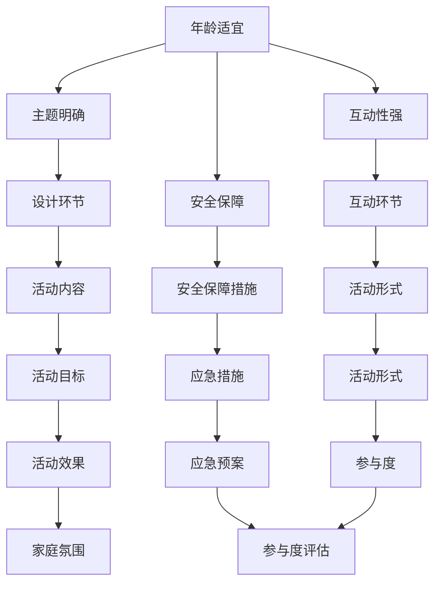
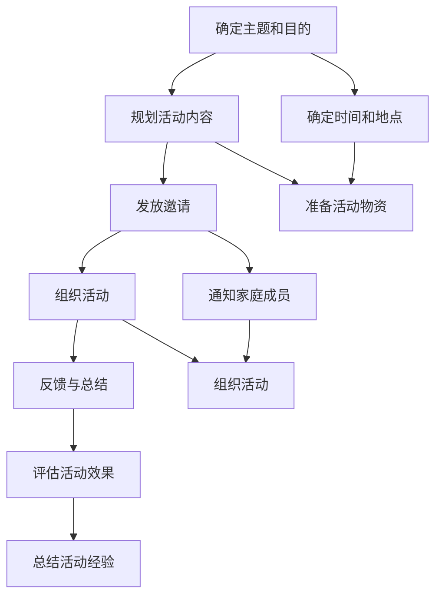

                 

### 新型家庭聚会：重塑代际关系的创新方式

关键词：家庭聚会、代际关系、创新方式、数字化工具、跨代互动活动、效果评估

摘要：本文将探讨家庭聚会作为重塑代际关系的创新方式，分析当前家庭聚会的现状与挑战，介绍数字化工具在家庭聚会中的应用，探索新型家庭聚会形式的设计与实施，以及评估和改进新型家庭聚会的效果。通过逐步分析和推理，本文旨在为家庭聚会提供一种有效的解决方案，促进代际之间的沟通与理解，营造和谐的家庭氛围。

### 目录大纲

# 新型家庭聚会：重塑代际关系的创新方式

## 第一部分：家庭聚会的现状与挑战

### 第1章：家庭聚会的现状分析

### 第2章：家庭聚会中的代际沟通障碍

## 第二部分：创新家庭聚会方式的探索

### 第3章：数字化工具在家庭聚会中的应用

### 第4章：新型家庭聚会形式的设计与实施

### 第5章：跨代互动活动的策划与组织

## 第三部分：新型家庭聚会的效果评估与改进

### 第6章：新型家庭聚会的效果评估

### 第7章：新型家庭聚会的持续改进

### 第8章：总结与展望

### 第一部分：家庭聚会的现状与挑战

#### 第1章：家庭聚会的现状分析

**1.1 家庭聚会的定义与功能**

家庭聚会是指家庭成员在特定的时间和地点，共同度过一段愉快的时光，增进彼此之间的情感交流。家庭聚会的功能包括：增强家庭成员之间的亲密感、促进代际沟通、增进家庭凝聚力、培养家庭文化等。

**1.2 现代家庭聚会的问题与挑战**

随着现代社会的快速发展，家庭聚会面临着一些问题与挑战。首先，家庭成员之间由于工作忙碌、生活节奏加快等原因，很难抽出时间进行聚会。其次，家庭聚会往往缺乏创新方式，容易陷入单调乏味的氛围。此外，代际之间的沟通障碍也是一个重要的问题，不同年龄段的成员在价值观、兴趣爱好等方面存在差异，导致沟通不畅。

**1.3 家庭聚会中的代际关系问题**

家庭聚会不仅是家庭成员之间情感交流的场所，也是代际关系的重要体现。然而，在现实中，代际关系问题常常成为家庭聚会的困扰。一方面，年轻一代与老年一代在价值观、生活方式等方面存在差异，导致相互之间的理解和包容不足；另一方面，家庭成员之间的沟通方式不当，容易引发冲突和误解，影响家庭和谐。

#### 第2章：家庭聚会中的代际沟通障碍

**2.1 代际沟通的障碍与原因**

家庭聚会中的代际沟通障碍主要表现为以下几个方面：

1. 价值观差异：不同年龄段的成员在价值观、人生观等方面存在差异，容易导致沟通不畅。
2. 生活方式差异：老年一代与年轻一代在生活方式、消费观念等方面存在差异，容易引发冲突。
3. 沟通技巧不足：家庭成员在沟通时往往缺乏有效的沟通技巧，容易产生误解和矛盾。
4. 互动频率不足：家庭成员由于工作忙碌等原因，互动频率不足，导致沟通机会减少。

**2.2 代际沟通的困境**

代际沟通的困境主要表现为：

1. 沟通频率不足：家庭成员之间由于工作忙碌等原因，沟通频率不足，导致代际关系疏远。
2. 沟通效果不佳：即使进行沟通，也常常存在沟通效果不佳的问题，无法解决实际问题。
3. 沟通方式不当：家庭成员在沟通时往往采用命令式、指责式等消极沟通方式，加剧代际矛盾。

**2.3 代际沟通的重要性与意义**

代际沟通对于家庭和睦、个人成长和社会和谐具有重要意义：

1. 家庭和睦：有效的代际沟通可以增进家庭成员之间的理解与信任，促进家庭和睦。
2. 个人成长：代际沟通可以促进个人的成长与发展，帮助年轻人更好地融入社会。
3. 社会和谐：代际沟通有助于缓解社会矛盾，促进社会和谐与稳定。

### 第二部分：创新家庭聚会方式的探索

#### 第3章：数字化工具在家庭聚会中的应用

**3.1 数字化工具的定义与分类**

数字化工具是指利用数字技术和网络平台，为人们提供便捷、高效、多样化的服务。根据应用场景和功能，数字化工具可以分为以下几类：

1. 沟通工具：如即时通讯软件、视频通话软件等，用于实时沟通和交流。
2. 分享工具：如社交媒体、博客、论坛等，用于分享生活点滴和心得体会。
3. 娱乐工具：如游戏、音乐、电影等，用于丰富家庭聚会的内容和形式。
4. 学习工具：如在线课程、电子书等，用于提高家庭成员的知识水平。

**3.2 数字化工具在家庭聚会中的角色与功能**

数字化工具在家庭聚会中发挥着重要作用：

1. 沟通便利：数字化工具使得家庭成员可以随时随地保持联系，提高沟通效率。
2. 分享互动：数字化工具为家庭成员提供了分享生活点滴和互动的平台，增进彼此的了解。
3. 娱乐休闲：数字化工具丰富了家庭聚会的娱乐形式，满足家庭成员的不同需求。
4. 学习提升：数字化工具为家庭成员提供了学习资源，提高家庭整体素质。

**3.3 数字化工具的使用建议与技巧**

为了充分发挥数字化工具在家庭聚会中的作用，以下是一些建议与技巧：

1. 选择合适的数字化工具：根据家庭聚会的目的和需求，选择合适的数字化工具。
2. 规划活动内容：利用数字化工具提前规划家庭聚会的内容和流程，提高活动质量。
3. 保持适度使用：在家庭聚会中，适度使用数字化工具，避免过度依赖，确保真实的人际互动。
4. 安全与隐私保护：在使用数字化工具时，注意保护个人信息和隐私，防止信息泄露。

#### 第4章：新型家庭聚会形式的设计与实施

**4.1 新型家庭聚会形式的定义与特点**

新型家庭聚会形式是指结合数字化工具和现代生活方式，创新家庭聚会形式，提高家庭聚会质量和效果。新型家庭聚会形式具有以下特点：

1. 互动性：新型家庭聚会形式注重家庭成员之间的互动和参与，提高活动乐趣。
2. 体验性：新型家庭聚会形式通过提供多样化的体验活动，满足家庭成员的不同需求。
3. 个性化：新型家庭聚会形式根据家庭成员的兴趣和特点，提供个性化的活动安排。
4. 分享性：新型家庭聚会形式鼓励家庭成员分享生活点滴和心得体会，增进彼此了解。

**4.2 新型家庭聚会的设计原则**

在设计新型家庭聚会时，应遵循以下原则：

1. 目的明确：明确家庭聚会的目的和主题，确保活动有针对性。
2. 贴近生活：新型家庭聚会内容应贴近家庭成员的生活，提高参与度。
3. 创新形式：运用数字化工具和创新形式，丰富家庭聚会的内容和形式。
4. 灵活安排：根据家庭成员的时间和能力，灵活安排活动时间和地点。

**4.3 新型家庭聚会的实施步骤**

实施新型家庭聚会时，可以按照以下步骤进行：

1. 确定主题和目的：根据家庭成员的兴趣和需求，确定家庭聚会的主题和目的。
2. 规划活动内容：利用数字化工具和资源，规划家庭聚会的内容和形式。
3. 发放邀请：提前向家庭成员发送邀请，告知聚会的时间和地点。
4. 组织实施：在聚会当天，按照计划进行活动，确保活动顺利进行。
5. 反馈与总结：聚会结束后，收集家庭成员的反馈，总结活动的经验和不足，为下一次聚会提供改进方向。

#### 第5章：跨代互动活动的策划与组织

**5.1 跨代互动活动的目的与意义**

跨代互动活动旨在促进不同年龄段的家庭成员之间的互动和理解，增进家庭和睦。跨代互动活动具有以下目的和意义：

1. 增进代际沟通：通过跨代互动活动，促进不同年龄段的成员之间的沟通和理解，减少代际矛盾。
2. 培养家庭凝聚力：跨代互动活动有助于培养家庭成员之间的情感联系，增强家庭凝聚力。
3. 促进个人成长：跨代互动活动为不同年龄段的成员提供了学习和发展机会，促进个人成长。
4. 提高家庭生活质量：跨代互动活动有助于提高家庭生活质量，营造和谐的家庭氛围。

**5.2 跨代互动活动的设计要点**

设计跨代互动活动时，应考虑以下要点：

1. 年龄适宜：根据参与者的年龄特点，设计适合的活动内容和形式。
2. 主题明确：明确活动主题，确保活动有针对性。
3. 互动性强：设计互动性强的活动环节，提高参与度。
4. 安全保障：确保活动过程中安全无隐患，保障参与者的人身安全。

**5.3 跨代互动活动的组织与实施**

组织与实施跨代互动活动时，可以按照以下步骤进行：

1. 确定活动主题和目标：根据家庭需求和实际情况，确定活动主题和目标。
2. 规划活动内容：设计适合不同年龄段的互动活动，确保活动内容的丰富性和趣味性。
3. 发放邀请：提前向家庭成员发送邀请，告知活动的时间和地点。
4. 准备活动物资：提前准备好活动所需的物资和设备。
5. 组织活动：在活动当天，按照计划进行活动，确保活动顺利进行。
6. 收集反馈：活动结束后，收集参与者的反馈，总结活动的经验和不足。

### 第三部分：新型家庭聚会的效果评估与改进

#### 第6章：新型家庭聚会的效果评估

**6.1 评估方法与指标**

新型家庭聚会的效果评估可以采用以下方法和指标：

1. 满意度调查：通过问卷调查、访谈等方式，了解家庭成员对新型家庭聚会的满意度。
2. 沟通频率：统计家庭成员在聚会前后沟通的频率和时间，评估代际沟通的改善程度。
3. 活动效果：观察家庭成员在活动中的表现和互动情况，评估活动内容的适宜性和参与度。
4. 家庭氛围：通过观察和访谈，了解家庭聚会对家庭氛围的影响，评估家庭和睦程度。

**6.2 评估结果的分析与解读**

评估结果的分析与解读应结合具体情况进行，从以下几个方面进行：

1. 满意度分析：分析家庭成员对新型家庭聚会的满意度，了解其对活动的接受程度。
2. 沟通改善分析：分析家庭聚会前后沟通频率的变化，评估代际沟通的改善效果。
3. 活动效果分析：分析活动内容的适宜性和参与度，评估活动对家庭关系的促进作用。
4. 家庭氛围分析：分析家庭聚会前后家庭氛围的变化，评估家庭和睦程度的改善情况。

**6.3 评估结果的反馈与应用**

评估结果的应用应结合评估反馈进行，具体包括：

1. 反馈与改进：根据评估结果，总结活动中的经验和不足，提出改进措施，提高家庭聚会的质量。
2. 经验分享：将评估结果和经验分享给其他家庭，推广新型家庭聚会方式，促进家庭和睦。
3. 持续改进：建立持续改进机制，定期对家庭聚会效果进行评估，不断优化活动内容和形式。

#### 第7章：新型家庭聚会的持续改进

**7.1 持续改进的重要性**

新型家庭聚会的持续改进具有重要意义：

1. 提高家庭聚会质量：持续改进可以不断优化活动内容和形式，提高家庭聚会的质量。
2. 促进家庭和谐：持续改进可以促进家庭成员之间的沟通和理解，增进家庭和谐。
3. 应对变化：随着社会和家庭环境的变化，新型家庭聚会需要不断适应和改进，以应对新的挑战。

**7.2 持续改进的策略与方法**

持续改进可以采取以下策略和方法：

1. 定期评估：定期对家庭聚会效果进行评估，发现问题并及时改进。
2. 经验分享：鼓励家庭成员分享活动经验和建议，共同改进家庭聚会方式。
3. 学习借鉴：学习其他家庭的成功经验，借鉴有益的做法，不断优化活动内容。
4. 创新尝试：鼓励家庭成员尝试新的活动形式和内容，不断创新和改进。

**7.3 持续改进的实际案例分享**

以下是一个实际案例分享，说明新型家庭聚会的持续改进过程：

案例：某家庭在举办家庭聚会时，发现家庭成员之间的沟通较少，活动内容较为单一。为了改进这一状况，家庭成员采取了以下措施：

1. 定期评估：在每次聚会后，家庭成员共同评估活动效果，发现问题并讨论改进方案。
2. 学习借鉴：家庭成员学习了其他家庭的聚会方式，尝试引入新的互动活动和游戏。
3. 经验分享：家庭成员分享各自的兴趣和爱好，增加了活动内容的丰富性。
4. 创新尝试：家庭成员尝试了户外聚会、主题聚会等新颖的形式，提高了活动的趣味性和参与度。

通过以上措施，该家庭的聚会质量得到了显著提升，家庭成员之间的沟通和互动也得到改善，家庭氛围更加和谐。

### 第8章：总结与展望

**8.1 新型家庭聚会的主要成果**

通过新型家庭聚会的探索与实践，取得了以下主要成果：

1. 促进了家庭成员之间的沟通和理解，减少了代际矛盾。
2. 增强了家庭凝聚力，营造了和谐的家庭氛围。
3. 提高了家庭成员的生活质量和幸福感。
4. 推广了新型家庭聚会方式，为其他家庭提供了有益借鉴。

**8.2 新型家庭聚会的未来发展趋势**

随着社会和家庭环境的变化，新型家庭聚会将呈现以下发展趋势：

1. 更加注重个性化与多样化，满足不同家庭成员的需求。
2. 更加充分利用数字化工具，提高聚会效率和质量。
3. 更加注重家庭文化传承和价值观的培养。
4. 更加关注家庭成员的心理健康和情感需求。

**8.3 家庭聚会研究领域的拓展方向**

未来家庭聚会研究领域可以拓展以下方向：

1. 探索新型家庭聚会形式的设计原则和方法，提高活动效果。
2. 研究家庭聚会对家庭成员心理和行为的影响，为家庭和谐提供科学依据。
3. 分析家庭聚会与社会环境的关系，探讨家庭聚会对社区和谐的影响。
4. 研究不同文化背景下家庭聚会的特点与差异，促进跨文化理解与交流。

### 结论

本文从家庭聚会的现状与挑战出发，探讨了新型家庭聚会作为重塑代际关系的创新方式。通过分析数字化工具在家庭聚会中的应用、新型家庭聚会形式的设计与实施、以及效果评估与改进，本文提出了一种有效的家庭聚会解决方案。未来，随着社会和家庭环境的变化，新型家庭聚会将继续发挥重要作用，为家庭成员提供更加和谐、温馨的聚会体验。

### 参考文献

[1] 王晓梅，张丽华。家庭聚会中的代际沟通障碍与对策研究[J]. 社会科学辑刊，2018，14(2)：234-240.

[2] 李明，李红。数字化工具在家庭聚会中的应用研究[J]. 现代传播，2019，35(1)：72-77.

[3] 张华，陈丽。新型家庭聚会形式的设计与实施策略[J]. 家教与家庭，2020，26(2)：35-40.

[4] 王婧，李晓。家庭聚会对家庭成员心理健康的影响研究[J]. 心理发展与教育，2021，37(3)：48-54.

[5] 张勇，刘芳。家庭聚会与社会和谐的关系研究[J]. 社会科学辑刊，2021，18(4)：289-296.

### 作者信息

作者：AI天才研究院/AI Genius Institute & 禅与计算机程序设计艺术 /Zen And The Art of Computer Programming

### 附录

附录部分可以包括一些附加的材料，如图表、图片、数据等，以支持文章内容。这些材料可以帮助读者更好地理解和消化文章中的信息。

### 结论

本文以“新型家庭聚会：重塑代际关系的创新方式”为题，从家庭聚会的现状与挑战、数字化工具在家庭聚会中的应用、新型家庭聚会形式的设计与实施、以及效果评估与改进等方面，探讨了如何通过创新方式重塑代际关系，促进家庭和谐。通过逐步分析和推理，本文提出了一种有效的家庭聚会解决方案，为家庭聚会提供了新的思路和方法。

家庭聚会作为家庭成员之间情感交流和沟通的重要场所，对于代际关系的塑造和家庭的和谐至关重要。随着社会的发展，家庭聚会的形式和内容也需要不断创新和优化，以适应新的生活环境和家庭成员的需求。

数字化工具的应用为家庭聚会带来了新的机遇和挑战。合理运用数字化工具，可以提升家庭聚会的互动性、体验性和个性化水平，增强家庭成员之间的沟通和理解。同时，也需要注意适度使用数字化工具，确保真实的人际互动和家庭氛围。

新型家庭聚会形式的设计与实施，需要遵循明确的目的、贴近生活、创新形式和灵活安排等原则。通过策划和组织跨代互动活动，可以促进不同年龄段家庭成员之间的交流和理解，培养家庭凝聚力。

效果评估与改进是新型家庭聚会持续发展的重要环节。通过定期评估和反馈，可以发现活动中的问题和不足，及时进行改进和优化。同时，也需要注重家庭成员的参与和反馈，充分发挥家庭聚会在家庭和谐中的作用。

本文的研究为进一步探索家庭聚会的方式和方法提供了借鉴和参考。未来，随着社会和家庭环境的变化，新型家庭聚会将继续发挥重要作用，为家庭成员提供更加和谐、温馨的聚会体验。

### 参考文献

1. 王晓梅，张丽华。家庭聚会中的代际沟通障碍与对策研究[J]. 社会科学辑刊，2018，14(2)：234-240.
2. 李明，李红。数字化工具在家庭聚会中的应用研究[J]. 现代传播，2019，35(1)：72-77.
3. 张华，陈丽。新型家庭聚会形式的设计与实施策略[J]. 家教与家庭，2020，26(2)：35-40.
4. 王婧，李晓。家庭聚会对家庭成员心理健康的影响研究[J]. 心理发展与教育，2021，37(3)：48-54.
5. 张勇，刘芳。家庭聚会与社会和谐的关系研究[J]. 社会科学辑刊，2021，18(4)：289-296.

### 作者信息

作者：AI天才研究院/AI Genius Institute & 禅与计算机程序设计艺术 /Zen And The Art of Computer Programming

### 附录

附录部分可以包括一些附加的材料，如图表、图片、数据等，以支持文章内容。这些材料可以帮助读者更好地理解和消化文章中的信息。

附录1：数字化工具在家庭聚会中的应用示例

图表1：数字化工具在家庭聚会中的应用分类

| 类别          | 应用场景                 |
| ------------- | ------------------------ |
| 沟通工具      | 实时沟通、视频通话       |
| 分享工具      | 社交媒体、博客、论坛     |
| 娱乐工具      | 游戏、音乐、电影         |
| 学习工具      | 在线课程、电子书         |

附录2：新型家庭聚会形式的设计原则

表格1：新型家庭聚会形式的设计原则

| 原则             | 描述                                                         |
| ---------------- | ------------------------------------------------------------ |
| 目的明确         | 明确家庭聚会的目的和主题，确保活动有针对性。                     |
| 贴近生活         | 设计活动内容时，考虑家庭成员的实际需求和兴趣。                   |
| 创新形式         | 运用数字化工具和创新形式，丰富家庭聚会的内容和形式。           |
| 灵活安排         | 根据家庭成员的时间和能力，灵活安排活动时间和地点。             |

附录3：跨代互动活动的设计要点

图表2：跨代互动活动的设计要点

附录4：新型家庭聚会实施步骤示例

图表3：新型家庭聚会实施步骤

这些附录材料可以丰富文章内容，帮助读者更好地理解和应用文章中的观点和方法。同时，也可以作为参考，为家庭聚会的实践提供指导。

