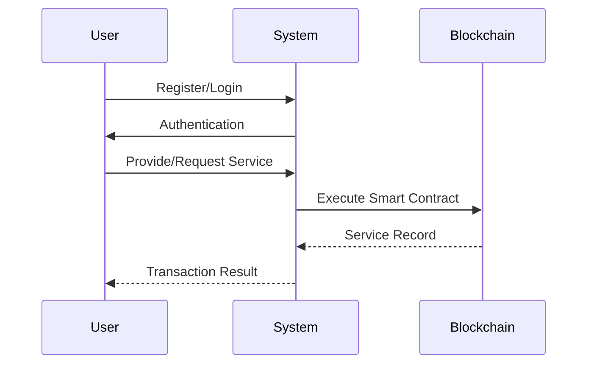
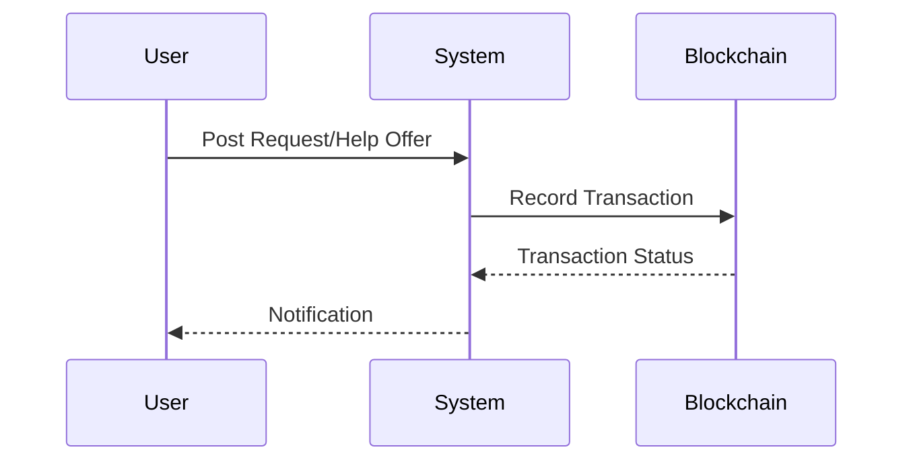
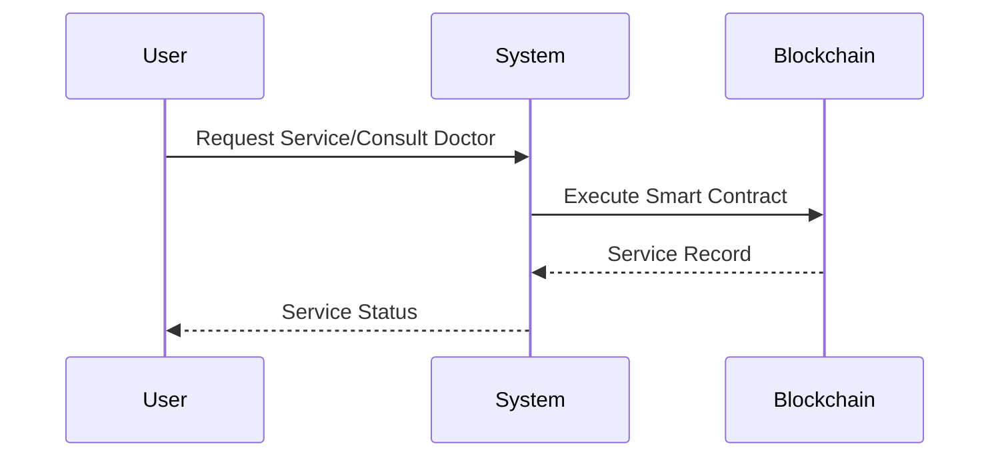

                 

### 第一部分：背景介绍

#### 1.1 问题背景

##### 1.1.1 时间银行的起源与发展

时间银行起源于20世纪70年代的美国，最早由美国社区工作者Ricardo Aguirre提出。时间银行的理念是通过时间作为货币，鼓励人们为社区做出贡献，并在需要时得到社区的回报。这种互助模式迅速在全球范围内得到推广，尤其在欧洲和亚洲，时间银行已经成为一种重要的社区互助工具。

时间银行的基本运行机制是“时间存款”和“时间提取”。参与者通过提供自己的服务（如打扫卫生、陪伴老人等）来积累时间，当自己需要帮助时，可以提取别人的服务。这种模式有效地解决了社区内部资源分配不均的问题，促进了社区成员之间的互助合作。

随着信息技术的发展，时间银行逐步向数字化、网络化方向演进。在线时间银行平台应运而生，使时间交易的记录和验证更加便捷和透明。

##### 1.1.2 社区互助的重要性

社区互助是构建和谐社会的重要手段。它不仅可以缓解社会矛盾，还能增强社区凝聚力，提升居民的幸福感和归属感。社区互助的形式多样，包括志愿服务、邻里守望、资源共享等，每种形式都有其独特的价值和作用。

在现代社会，随着人口老龄化问题的加剧和社区服务的需求多样化，传统社区互助模式面临诸多挑战。例如，资源分配不均、信息不对称、信任度不足等问题，这些都限制了社区互助的效能。

##### 1.1.3 区块链技术的基本概念

区块链技术是一种分布式数据库技术，其核心特点包括去中心化、不可篡改和透明性。区块链通过加密算法和共识机制，确保了数据的安全性和一致性。

区块链的去中心化特性使其在许多领域具有广泛的应用潜力，特别是在需要高度信任的环境下。例如，金融、供应链管理、医疗记录管理等领域，区块链技术都能提供一种安全、透明的解决方案。

近年来，随着区块链技术的不断成熟和应用场景的拓展，其在社区互助领域也展现出巨大的潜力。通过区块链技术，可以构建一个更加安全、可信、高效的社区互助平台，解决传统模式中的诸多问题。

#### 1.2 问题描述

##### 1.2.1 传统时间银行面临的挑战

尽管时间银行在促进社区互助方面具有重要作用，但传统模式仍然面临一些挑战。首先，时间交易的记录和验证存在一定的困难，尤其是当交易规模扩大时，传统的纸质记录和手工验证方式效率低下且容易出错。其次，社区成员之间的信任问题也是一个难题，由于缺乏有效的验证机制，一些恶意行为难以防范。

此外，时间银行在资源分配上存在不均衡问题。某些成员可能会囤积时间，导致资源无法公平分配。最后，随着社区服务需求的多样化，传统时间银行模式难以适应新的变化，导致其应用范围受到限制。

##### 1.2.2 社区互助需求的多样性

现代社区的服务需求日益多样化，居民对于社区互助的要求也越来越高。传统的单一互助模式已经无法满足这些需求。例如，除了基本的志愿服务和资源共享外，社区成员还需要更多的专业服务，如医疗咨询、法律援助等。此外，社区内部的老年人、残疾人等特殊群体也需要更精细化的服务。

这种多样性的需求对时间银行提出了更高的要求，需要其能够提供更加灵活、多样化的服务方式。同时，这也为区块链技术在社区互助中的应用提供了广阔的空间。

##### 1.2.3 区块链技术在社区互助中的应用前景

区块链技术以其去中心化、不可篡改和透明的特点，为解决传统时间银行面临的挑战提供了新的思路。首先，区块链技术可以提供一种高效、可靠的记录和验证方式，确保时间交易的准确性和透明性。通过智能合约，还可以实现自动化的时间交易，提高效率。

其次，区块链技术有助于建立社区成员之间的信任。通过区块链上的共识机制，可以确保数据的真实性和一致性，从而降低欺诈和恶意行为的风险。

此外，区块链技术的应用还可以推动社区互助模式的创新。例如，通过积分系统，可以将社区服务与数字经济结合起来，提高居民的参与度和积极性。同时，区块链技术还可以支持跨区域的社区互助，打破地域限制，实现更广泛的资源整合。

#### 1.3 问题解决

##### 1.3.1 新型社区时间银行2.0的核心概念

新型社区时间银行2.0（以下简称“新型时间银行2.0”）是在传统时间银行基础上，引入区块链技术进行优化和升级的新型社区互助模式。其主要目标是解决传统时间银行面临的记录不透明、信任度不足等问题，提高社区互助的效率和公平性。

新型时间银行2.0的核心概念包括以下几个方面：

1. **去中心化的数据库**：通过区块链技术，构建一个去中心化的数据库，记录时间交易的详细信息，确保数据的真实性和不可篡改性。
2. **智能合约**：使用智能合约自动化执行时间交易，提高交易效率，减少人为干预。
3. **积分系统**：建立积分系统，将社区服务与数字经济结合，激励社区成员积极参与。
4. **多层次的认证机制**：通过区块链上的共识机制，建立多层次的认证体系，确保社区成员的身份和服务质量。
5. **跨区域协作**：通过区块链技术，实现跨区域的时间交易和资源整合，促进社区互助的全球化。

##### 1.3.2 新型社区时间银行2.0的优势与特点

新型时间银行2.0具有以下几大优势与特点：

1. **高效透明的记录和验证**：区块链技术的应用确保了时间交易的记录和验证过程高效透明，解决了传统模式中记录不透明、效率低下的问题。
2. **增强的信任机制**：通过区块链上的共识机制和智能合约，建立了更强的信任机制，降低了欺诈和恶意行为的风险。
3. **灵活的积分系统**：积分系统的引入，使社区服务与数字经济结合，激励社区成员积极参与，提高了社区互助的活力。
4. **跨区域协作**：区块链技术支持跨区域的时间交易和资源整合，促进了社区互助的全球化。
5. **可持续性**：新型时间银行2.0的可持续性体现在其能够适应社区服务需求的多样化，并提供长期稳定的社区互助模式。

##### 1.3.3 新型社区时间银行2.0的实现路径

要实现新型时间银行2.0，需要以下几步：

1. **需求调研**：对社区成员的需求进行深入调研，明确新型时间银行2.0的功能需求和目标用户群体。
2. **技术选型**：选择合适的区块链平台和技术框架，构建去中心化的数据库和智能合约。
3. **平台开发**：开发新型时间银行2.0的平台，包括前端用户界面和后端服务模块。
4. **试点运行**：在特定社区进行试点运行，收集用户反馈，优化平台功能。
5. **推广推广**：在试点成功的基础上，逐步推广到其他社区，实现新型时间银行2.0的广泛应用。

##### 1.4 边界与外延

##### 1.4.1 新型社区时间银行2.0的应用范围

新型社区时间银行2.0的应用范围非常广泛，包括但不限于以下几个方面：

1. **社区志愿服务**：通过新型时间银行2.0，居民可以方便地记录和交换志愿服务时间，提高志愿服务的效率和公平性。
2. **社区资源共享**：居民可以通过新型时间银行2.0共享自己的资源，如闲置车位、工具等，实现资源共享，降低生活成本。
3. **专业服务交易**：通过新型时间银行2.0，居民可以方便地获取专业服务，如医疗咨询、法律援助等，提高社区服务的质量和可及性。
4. **跨区域互助**：新型时间银行2.0支持跨区域的时间交易和资源整合，可以促进不同社区之间的互助合作，实现更广泛的资源利用。

##### 1.4.2 新型社区时间银行2.0的适用场景

新型社区时间银行2.0适用于以下几种场景：

1. **老龄化社区**：在老龄化社区中，居民对医疗、护理等服务需求较大，新型时间银行2.0可以通过积分系统激励居民提供和获取这些服务。
2. **多元文化社区**：在多元文化社区中，不同文化背景的居民可能需要跨文化的互助服务，新型时间银行2.0可以提供更加灵活和多样化的服务方式。
3. **资源匮乏社区**：在资源匮乏的社区，新型时间银行2.0可以通过积分系统激励居民分享自己的资源，实现资源的最优配置。
4. **自然灾害社区**：在自然灾害发生后，新型时间银行2.0可以快速组织社区成员进行互助，提供紧急救援和物资支持。

##### 1.4.3 新型社区时间银行2.0的限制条件

尽管新型社区时间银行2.0具有许多优势，但在实际应用中仍面临一些限制条件：

1. **技术门槛**：区块链技术的应用需要一定的技术基础，对普通居民来说，使用和理解可能存在一定的困难。
2. **推广难度**：新型时间银行2.0的推广需要时间和资源的投入，尤其是在一些资源有限的社区，推广难度较大。
3. **监管问题**：在新型时间银行2.0的应用过程中，需要建立相应的监管机制，确保其合规性和安全性，这需要政府和相关机构的支持和监管。
4. **隐私保护**：在区块链上记录个人信息和数据，需要确保其隐私性和安全性，以防止数据泄露和滥用。

##### 1.5 概念结构与核心要素组成

##### 1.5.1 新型社区时间银行2.0的基本概念

新型社区时间银行2.0的基本概念包括以下几个方面：

1. **区块链技术**：作为底层技术，区块链提供去中心化、不可篡改和透明的数据存储和交易验证机制。
2. **智能合约**：智能合约是一种自动执行的计算机协议，用于实现新型时间银行2.0中的时间交易和服务提供。
3. **积分系统**：积分系统用于记录和激励社区成员的时间交易和服务提供，促进社区互助。
4. **多层次的认证机制**：多层次的认证机制用于验证社区成员的身份和服务质量，确保社区互助的可靠性和公平性。
5. **跨区域协作机制**：跨区域协作机制用于支持社区之间的时间交易和资源整合，促进社区互助的全球化。

##### 1.5.2 新型社区时间银行2.0的核心要素

新型社区时间银行2.0的核心要素包括：

1. **用户**：用户是新型时间银行2.0的使用者，可以是普通居民、志愿者、专业服务提供者等。
2. **时间记录**：时间记录是新型时间银行2.0中的关键数据，用于记录用户提供的服务和获取的服务。
3. **智能合约**：智能合约是新型时间银行2.0的核心组成部分，用于自动化执行时间交易和服务提供。
4. **积分系统**：积分系统用于激励用户参与社区互助，提高社区服务的质量和效率。
5. **多层次的认证机制**：多层次的认证机制用于确保用户身份和服务质量的可靠性。

##### 1.5.3 新型社区时间银行2.0的组成部分

新型社区时间银行2.0由以下几个部分组成：

1. **用户界面**：用户界面用于用户与新型时间银行2.0的交互，包括注册、登录、时间记录、积分查询等功能。
2. **后端服务**：后端服务负责处理用户请求，管理时间记录和积分系统，执行智能合约等。
3. **区块链网络**：区块链网络负责存储时间记录和智能合约，确保数据的去中心化和不可篡改性。
4. **智能合约**：智能合约用于自动化执行时间交易和服务提供，提高交易效率和可靠性。
5. **积分系统**：积分系统用于激励用户参与社区互助，促进社区服务的可持续发展。

##### 1.6 本章小结

本文首先介绍了时间银行的起源与发展、社区互助的重要性以及区块链技术的基本概念，并分析了传统时间银行面临的挑战和社区互助需求的多样性。接着，提出了新型社区时间银行2.0的核心概念、优势与特点，以及其实现路径和应用范围。最后，讨论了新型社区时间银行2.0的核心要素和组成部分。

通过本文的介绍，读者可以初步了解新型社区时间银行2.0的概念和优势，为后续章节的深入探讨奠定了基础。

---

## 2.1 区块链技术原理

区块链技术是一种分布式数据库技术，通过一系列相互连接的区块组成，每个区块都包含了特定的时间戳、数据记录和加密信息。区块链技术具有去中心化、不可篡改和透明的特点，这些特性使得其在许多领域具有广泛的应用潜力。

##### 2.1.1 区块链的基本概念

区块链的基本概念包括以下几个关键要素：

1. **区块**：区块是区块链的基本组成单元，包含了特定时间范围内发生的交易数据，以及其他关于区块链状态的信息。
2. **链**：链是由一系列按时间顺序排列的区块组成，每个区块都通过其哈希值与前一个区块相连，形成一种链条结构。
3. **哈希值**：哈希值是一种加密算法，用于将数据转换为一个固定长度的字符串。区块链中的每个区块都包含前一个区块的哈希值，确保了区块链的不可篡改性。
4. **节点**：节点是指参与区块链网络的工作站或服务器，每个节点都存储了一份完整的区块链副本，并参与区块链的维护和验证过程。

##### 2.1.2 区块链的核心技术

区块链技术的核心技术主要包括以下几个方面：

1. **分布式账本**：分布式账本技术是区块链技术的核心，通过多个节点共同维护同一份数据副本，确保数据的去中心化和安全性。
2. **加密算法**：加密算法用于保护区块链中的数据安全和隐私，包括公钥加密、私钥加密和哈希函数等。
3. **共识机制**：共识机制是区块链网络中节点之间达成共识的一种算法，确保区块链的状态一致性和数据的有效验证。
4. **智能合约**：智能合约是一种自动执行的计算机协议，基于区块链网络执行预先定义好的合约条款，提高交易效率和可靠性。

##### 2.1.3 区块链技术的应用场景

区块链技术具有广泛的应用场景，以下是一些主要的领域：

1. **金融领域**：区块链技术在金融领域中的应用包括数字货币、跨境支付、智能投顾等，提高了交易的安全性和效率。
2. **供应链管理**：区块链技术可以确保供应链中的数据透明和不可篡改，提高供应链的效率和质量。
3. **医疗记录管理**：区块链技术可以用于医疗记录的管理和共享，确保医疗数据的真实性和隐私性。
4. **身份验证**：区块链技术可以提供一种去中心化的身份验证方式，提高身份认证的安全性和可信度。
5. **物联网**：区块链技术可以用于物联网设备的数据管理和通信，确保设备间的安全通信和数据共享。

通过上述对区块链技术原理的介绍，读者可以了解区块链技术的基本概念、核心技术及其应用场景，为后续章节对新型社区时间银行2.0的探讨提供了理论基础。

### 2.2 时间银行机制

时间银行是一种以时间为货币的社区互助机制，通过参与者提供的服务和接受的服务来积累和交换时间，从而实现社区资源的优化配置。时间银行机制的核心在于其运行机制、定义及其所面临的挑战和机遇。

##### 2.2.1 时间银行的定义

时间银行，又称时间储蓄银行，是一种基于互助和互惠原则的社区服务模式。它鼓励个人通过为社区提供服务来积累时间，当需要帮助时，可以提取别人的服务。时间银行通过时间作为媒介，连接了社区内部的各种需求和资源，实现了服务的公平交换。

##### 2.2.2 时间银行的运行机制

时间银行的运行机制主要包括以下几个环节：

1. **注册与认证**：参与者需要注册并认证自己的身份，以确保服务的真实性和可靠性。
2. **时间存入**：参与者通过提供服务，将服务时间记录在时间银行的账户中，称为“时间存入”。
3. **时间提取**：当参与者需要帮助时，可以从其他参与者那里提取相应的服务时间，称为“时间提取”。
4. **时间结算**：时间银行负责记录和管理每个参与者的时间账户，确保时间的公平交换和结算。

时间银行的运行机制本质上是一种信用机制，通过积累和交换时间，实现了社区内部资源的优化配置。

##### 2.2.3 时间银行的挑战与机遇

尽管时间银行在社区互助中具有重要作用，但在实际应用中仍然面临一些挑战和机遇：

1. **挑战**：
   - **信息不对称**：由于时间银行的运行依赖于参与者之间的互信，信息不对称问题可能导致欺诈行为。
   - **服务质量控制**：时间银行难以确保所有提供的服务都达到一定的质量标准，这可能会影响参与者的积极性。
   - **运营成本**：传统的时间银行往往需要投入大量的人力、物力和时间进行管理和维护，运营成本较高。
   - **信任问题**：在社区内部建立信任机制是一个长期且复杂的过程，特别是在不同文化和社会背景下。

2. **机遇**：
   - **技术创新**：随着区块链技术的发展，时间银行可以引入去中心化的记录和验证机制，提高透明度和可信度。
   - **数字经济结合**：通过将时间银行与数字经济结合，可以创造更多的应用场景，提高社区成员的参与度和积极性。
   - **跨区域合作**：区块链技术支持跨区域的合作，可以打破地域限制，实现更广泛的资源整合。
   - **政策支持**：政府的政策支持和引导可以推动时间银行的发展，提高其在社区中的影响力。

综上所述，时间银行机制在社区互助中具有重要的应用价值，但同时也面临着一些挑战和机遇。通过技术创新和政策支持，时间银行有望在未来得到更加广泛和有效的发展。

### 2.3 区块链在时间银行中的应用

区块链技术的引入为时间银行带来了新的机遇和挑战。通过区块链技术的应用，时间银行可以在安全性、透明性和效率等方面得到显著提升。

##### 2.3.1 区块链技术在时间银行中的优势

区块链技术在时间银行中的应用具有以下几个显著优势：

1. **安全性**：区块链的去中心化特性使其具有高度的安全性。每个区块都包含前一个区块的哈希值，确保了区块链的不可篡改性。这使得时间银行的记录和交易数据难以被篡改或伪造。
2. **透明性**：区块链上的所有数据都是公开透明的，每个参与者和交易都可以被追踪和验证。这有助于提高时间银行运行的透明度，增强社区成员之间的信任。
3. **高效性**：区块链技术使用智能合约来自动执行交易，减少了人为干预和操作成本，提高了交易效率。智能合约还可以确保交易条款的严格执行，减少纠纷和欺诈行为。
4. **可追溯性**：区块链上的所有交易记录都是永久保存和可追溯的。这有助于追踪和管理时间银行中的每一个服务提供和接受过程，确保服务的透明性和可追溯性。

##### 2.3.2 区块链技术在时间银行中的应用案例

区块链技术在时间银行中的应用已经出现了一些成功的案例：

1. **日本的时间银行**：日本是全球时间银行应用最为广泛的地区之一。近年来，日本的一些时间银行开始采用区块链技术来管理时间记录和服务交易。例如，日本的“TimeCoin”项目就使用了区块链技术，为居民提供了一种安全的、透明的时间交易方式。
2. **台湾的“爱时币”**：台湾的“爱时币”项目是另一个利用区块链技术的成功案例。该项目通过区块链技术记录居民的服务时间，并使用智能合约来自动化执行时间交易。居民可以通过提供各种服务，如陪伴老人、照顾儿童等，来积累爱时币，并在需要时兑换成实际服务。
3. **美国的“TimeBanking USA”**：TimeBanking USA 是一家总部位于美国的非营利组织，致力于推广时间银行模式。他们最近开始采用区块链技术来改善时间银行的管理和运营。通过区块链技术，TimeBanking USA 能够更加高效地记录和管理时间交易，提高服务的透明度和可靠性。

这些案例表明，区块链技术在时间银行中的应用不仅具有理论上的优势，还已经在实际操作中取得了显著的成效。

##### 2.3.3 区块链技术在时间银行中的前景

展望未来，区块链技术在时间银行中的应用前景非常广阔：

1. **更广泛的普及**：随着区块链技术的普及和成熟，预计将有更多的社区和时间银行项目采用区块链技术，以提高其运营效率和可信度。
2. **多样化的应用场景**：区块链技术不仅可以用于记录和验证时间交易，还可以应用于更广泛的服务领域，如医疗、教育、法律等。这将为社区成员提供更多的互助机会和资源。
3. **跨境合作**：区块链技术支持跨区域的合作和交易，有望推动全球社区互助网络的发展。未来，不同国家和地区的社区可以通过区块链技术实现资源共享和互助合作。
4. **技术创新**：随着区块链技术的不断发展，更多的技术创新和应用场景将被发掘，为时间银行带来更多的可能性。

总之，区块链技术在时间银行中的应用不仅解决了传统模式中的一些问题，还为时间银行的发展提供了新的方向和机遇。通过不断的技术创新和应用实践，区块链技术在时间银行领域有望发挥更大的作用。

### 2.4 新型社区时间银行2.0的核心概念

新型社区时间银行2.0（以下简称“新型时间银行2.0”）是在传统时间银行基础上，结合区块链技术进行优化和升级的一种新型社区互助模式。其核心概念包括以下几个方面：

##### 2.4.1 新型社区时间银行2.0的定义

新型社区时间银行2.0是一种利用区块链技术，实现时间交易记录、验证和激励的新型社区互助模式。它通过去中心化的数据库、智能合约和多层次的认证机制，提高时间交易的透明度、安全性和效率。

##### 2.4.2 新型社区时间银行2.0的特点

新型社区时间银行2.0具有以下特点：

1. **去中心化**：新型时间银行2.0采用区块链技术，实现了数据的去中心化存储和验证，避免了传统模式中的中心化风险。
2. **不可篡改**：区块链上的数据一旦记录，就无法被篡改或删除，确保了时间交易记录的真实性和可靠性。
3. **透明性**：所有的时间交易记录都在区块链上公开透明，每个参与者都可以查看和验证，增强了社区成员之间的信任。
4. **高效性**：通过智能合约，新型时间银行2.0能够自动执行时间交易，减少了人工干预和操作成本，提高了交易效率。
5. **灵活性和扩展性**：新型时间银行2.0支持多种服务类型的记录和交换，可以根据社区需求灵活调整，具有较强的扩展性。

##### 2.4.3 新型社区时间银行2.0的优势

新型社区时间银行2.0相较于传统时间银行，具有以下优势：

1. **安全性更高**：区块链技术确保了时间交易记录的安全性和不可篡改性，降低了欺诈和恶意行为的风险。
2. **透明性更强**：所有交易记录都在区块链上公开透明，提高了社区成员之间的信任度。
3. **效率更高**：通过智能合约，新型时间银行2.0能够自动执行时间交易，减少了人为干预和操作成本。
4. **灵活性和扩展性更强**：新型时间银行2.0支持多种服务类型的记录和交换，可以根据社区需求灵活调整，适应不同的社区服务场景。
5. **可追溯性更强**：区块链上的所有交易记录都是永久保存和可追溯的，有助于追踪和管理时间银行中的每一个服务提供和接受过程。

通过上述对新型社区时间银行2.0的核心概念、特点和优势的介绍，读者可以更加清晰地了解这一新型社区互助模式的基本原理和潜在价值。

### 2.5 概念属性特征对比表格

在探讨新型社区时间银行2.0时，我们将它与传统的社区时间银行进行比较，以突出新型模式在属性和特征上的优势。以下是两个模式的概念属性特征对比表格：

| 特征 | 传统社区时间银行 | 新型社区时间银行2.0 |
| --- | --- | --- |
| **安全性** | 依赖中心化管理系统，易受攻击 | 去中心化，数据不可篡改 |
| **透明性** | 信息记录不透明，信任度较低 | 数据公开透明，增强信任 |
| **效率** | 需人工操作，效率低 | 智能合约自动化，效率高 |
| **灵活性** | 服务种类有限，难以调整 | 支持多种服务类型，灵活调整 |
| **可扩展性** | 应用范围受限制，扩展性弱 | 跨区域合作，扩展性强 |
| **成本** | 运营成本高，维护复杂 | 运营成本低，维护简便 |
| **用户参与度** | 用户参与度低，激励不足 | 用户激励机制完善，参与度高 |

通过上述对比表格，我们可以看到新型社区时间银行2.0在多个方面都优于传统模式。例如，在安全性方面，新型模式采用了去中心化技术，数据不可篡改，大大降低了欺诈和攻击的风险。在透明性和效率方面，新型模式通过智能合约实现了自动化操作，提高了交易的透明度和效率。此外，新型模式在灵活性和可扩展性方面也具有明显优势，能够适应多样化的社区服务需求，实现跨区域合作。

这些特征和优势不仅提升了新型社区时间银行2.0的实用性和吸引力，也为社区互助模式的创新发展提供了新的路径。

### 2.6 ER实体关系图架构

为了更好地理解新型社区时间银行2.0中的实体及其相互关系，我们可以使用实体-关系（Entity-Relationship，ER）图来描述其架构。以下是新型社区时间银行2.0的ER图：

```mermaid
erDiagram
  User ||--|{ Service } : "provides"
  User ||--|{ Request } : "requests"
  Service ||--|{ Rating } : "rated by"
  Request ||--|{ Rating } : "rated by"
  ServiceKind ||--|{ Service } : "of type"
  ServiceKind ||--|{ Category } : "of category"
  Category ||--|{ Subcategory } : "contains"
  BlockchainAccount ||--|{ User } : "owned by"
  BlockchainTransaction ||--|{ BlockchainAccount } : "from/to"
  BlockchainTransaction ||--|{ Service } : "for service"
  BlockchainTransaction ||--|{ Request } : "for request"
```

在上述ER图中，我们定义了以下几个实体：

1. **User（用户）**：用户是新型社区时间银行2.0的主要参与者，可以是个人或组织。
2. **Service（服务）**：服务是用户提供的具体帮助，如打扫卫生、陪伴老人等。
3. **Request（需求）**：需求是用户请求的服务，如医疗咨询、法律援助等。
4. **Rating（评价）**：评价是对服务质量的反馈，可以用于用户和服务之间的互动。
5. **ServiceKind（服务种类）**：服务种类是对服务的分类，如家政服务、医疗服务等。
6. **Category（类别）**：类别是服务种类的进一步分类，如家政服务下的清洁服务、护理服务等。
7. **Subcategory（子类别）**：子类别是类别的进一步细分，使服务种类更加具体。
8. **BlockchainAccount（区块链账户）**：区块链账户是用户在区块链上的身份标识。
9. **BlockchainTransaction（区块链交易）**：区块链交易是用户之间的时间交换记录。

这些实体之间的关系如下：

1. **User** 与 **Service** 之间存在“提供”关系，表示用户提供的服务。
2. **User** 与 **Request** 之间存在“请求”关系，表示用户请求的服务。
3. **Service** 与 **Rating** 之间存在“评价”关系，表示对服务的评价。
4. **Request** 与 **Rating** 之间存在“评价”关系，表示对需求的评价。
5. **ServiceKind** 与 **Service** 之间存在“类型”关系，表示服务的分类。
6. **ServiceKind** 与 **Category** 之间存在“类别”关系，表示服务种类的进一步分类。
7. **Category** 与 **Subcategory** 之间存在“包含”关系，表示类别的进一步细分。
8. **BlockchainAccount** 与 **User** 之间存在“拥有”关系，表示用户在区块链上的账户。
9. **BlockchainTransaction** 与 **BlockchainAccount** 之间存在“从/到”关系，表示交易的发起者和接收者。
10. **BlockchainTransaction** 与 **Service** 之间存在“为服务”关系，表示交易的服务对象。
11. **BlockchainTransaction** 与 **Request** 之间存在“为需求”关系，表示交易的需求对象。

通过ER图，我们可以清晰地看到新型社区时间银行2.0中的实体及其关系，为系统的设计与实现提供了重要的参考。

### 2.7 本章小结

本章首先介绍了区块链技术的基本概念和核心技术，包括区块、链、哈希值和节点等。随后，讨论了区块链技术在金融、供应链管理、医疗记录管理、身份验证和物联网等领域的应用场景。

接着，本文详细阐述了时间银行的运行机制，包括注册与认证、时间存入、时间提取和时间结算等环节，并分析了时间银行在社区互助中的挑战和机遇。

随后，本章探讨了区块链技术在时间银行中的应用优势，包括安全性、透明性、高效性和可追溯性。并通过具体案例展示了区块链技术在时间银行中的应用实例。

最后，本章介绍了新型社区时间银行2.0的核心概念、特点和优势，通过ER图展示了其实体关系架构。通过本章的介绍，读者可以全面了解区块链技术在时间银行中的应用及其发展前景，为后续章节的深入研究奠定了基础。

---

## 3.1 区块链技术在社区互助中的优势

区块链技术在社区互助中的应用具有显著的优点，这些优点不仅解决了传统社区互助模式中的诸多问题，还为社区互助带来了新的可能性。以下将从安全性、可信性和高效性三个方面详细探讨区块链技术在社区互助中的优势。

##### 3.1.1 安全性

区块链技术的安全性是其在社区互助中应用的重要优势之一。区块链通过去中心化和分布式存储的方式，确保了数据的安全和完整性。具体来说，区块链上的数据记录在每个区块中，每个区块都包含前一个区块的哈希值，形成一种链条结构。这种链条结构使得数据一旦被记录，就几乎不可能被篡改或删除。此外，区块链采用了加密算法，对数据进行加密保护，确保数据在传输和存储过程中的安全性。

在社区互助中，安全性至关重要。传统社区互助模式往往依赖于中心化的管理系统，这使得系统容易受到黑客攻击或内部欺诈。而区块链的去中心化特性使得每个参与者都有权限参与数据的验证和存储，从而大大提高了系统的安全性。通过区块链技术，社区互助平台可以确保所有服务提供和接受的记录都是真实、可靠的，减少了欺诈和恶意行为的风险。

##### 3.1.2 可信性

可信性是社区互助的核心要素之一。在传统社区互助模式中，由于缺乏有效的验证机制，社区成员之间的信任往往难以建立。而区块链技术通过其去中心化和透明性，为社区成员之间建立了一种可信的互动环境。

区块链上的所有数据都是公开透明的，每个参与者都可以查看和验证。这种透明性有助于增强社区成员之间的信任，因为每个人都可以清晰地看到其他成员的服务记录和交易历史。此外，区块链技术采用了共识机制，如工作量证明（Proof of Work，PoW）或权益证明（Proof of Stake，PoS），确保了区块链上的数据一致性和可靠性。通过共识机制，区块链网络中的节点可以达成一致意见，从而提高了系统的可信性。

在社区互助中，可信性至关重要。通过区块链技术，社区成员可以更加信任彼此，愿意提供和接受服务。这有助于提高社区互助的效率和可持续性，推动社区发展。

##### 3.1.3 高效性

传统社区互助模式在记录和验证服务提供和接受的过程中，往往需要耗费大量时间和人力。例如，通过纸质记录或电子表格进行记录，不仅效率低下，还容易出现错误。而区块链技术的引入，可以大大提高社区互助的效率。

区块链技术通过智能合约实现了自动化交易，减少了人工干预和操作成本。智能合约是一段计算机代码，预先定义了交易条款和执行规则。当满足特定条件时，智能合约会自动执行，完成交易。这种自动化机制不仅提高了交易效率，还减少了人为干预和操作错误的可能性。

此外，区块链技术的分布式存储方式，使得数据可以在多个节点上进行复制和存储。这意味着，即使某个节点发生故障，数据也不会丢失，系统依然可以正常运行。这种容错性提高了系统的可靠性和可用性，进一步保障了社区互助的效率。

在社区互助中，高效性至关重要。通过区块链技术，社区成员可以更加便捷地记录和交换服务，节省了时间和成本。这有助于提高社区服务的质量，吸引更多的居民参与社区互助，形成良性循环。

##### 3.1.4 总结

区块链技术在社区互助中的优势体现在安全性、可信性和高效性三个方面。通过去中心化和分布式存储，区块链技术确保了数据的安全和完整性；通过透明性和共识机制，区块链技术增强了社区成员之间的信任；通过智能合约和自动化交易，区块链技术提高了社区互助的效率。这些优势使得区块链技术在社区互助领域具有广泛的应用潜力，有望推动社区互助模式的创新和发展。

### 3.2 区块链技术在社区互助中的应用案例

区块链技术在社区互助中的应用已经取得了一些显著成果，以下将介绍几个典型的应用案例，以展示其具体实现和实际效果。

##### 3.2.1 智能合约在社区互助中的应用

智能合约是区块链技术的重要应用之一，其在社区互助中发挥着关键作用。智能合约是一种自动执行的计算机协议，当满足特定条件时，会自动执行预先定义的操作。

**案例一：CoinSmart社区互助平台**

CoinSmart是一个基于区块链的社区互助平台，其核心功能是提供智能合约驱动的志愿服务交换。平台上的用户可以注册并发布自己的服务需求，同时也可以提供自己的服务。当服务需求与服务提供匹配时，智能合约会自动执行，用户之间进行服务交换。

**实现方法：**
1. 用户注册：用户在平台上注册，并提供身份验证信息，确保服务提供和接受的真实性。
2. 服务发布：用户可以发布自己的服务需求或服务提供，包括服务内容、时间、地点等详细信息。
3. 服务匹配：平台通过智能合约实现服务需求与服务提供的自动匹配。
4. 服务执行：智能合约在满足特定条件（如服务完成）时，自动执行服务交换，更新用户的时间账户。

**效果评估：**
- 提高了服务交换的效率：通过智能合约，用户之间的服务交换过程自动化，减少了人工干预，提高了交换效率。
- 增强了信任：智能合约的执行规则公开透明，用户可以清楚地看到服务交换的每个步骤，增强了彼此之间的信任。
- 减少了操作成本：传统社区互助模式需要人工进行匹配和记录，而智能合约的引入大大降低了操作成本。

##### 3.2.2 区块链在时间银行管理中的应用

时间银行是一种以时间为货币的社区互助模式，区块链技术在时间银行管理中的应用，可以提高其透明性和安全性。

**案例二：日本Time Bank项目**

日本的Time Bank项目是一个基于区块链的时间银行，用户可以通过提供服务来积累时间，并在需要时提取服务。项目通过区块链技术确保了时间记录的真实性和不可篡改性。

**实现方法：**
1. 用户注册：用户在平台上注册，并提供身份验证信息，确保服务的真实性和可靠性。
2. 服务记录：用户在提供服务后，通过区块链记录服务时间，确保数据的不可篡改性。
3. 服务提取：用户在需要帮助时，可以提取其他用户的服务时间，通过区块链进行记录和验证。
4. 积分激励：平台通过智能合约发放积分激励，鼓励用户积极参与时间银行活动。

**效果评估：**
- 提高了时间记录的透明性和可信性：区块链技术确保了时间记录的真实性和不可篡改性，用户可以清楚地看到自己的服务记录和提取记录。
- 增强了社区成员的参与度：通过积分激励，用户被鼓励积极参与时间银行活动，提高了社区互助的活力。
- 降低了管理成本：传统时间银行需要投入大量人力进行记录和管理，而区块链技术的应用大大降低了管理成本。

##### 3.2.3 区块链在邻里互助社区中的应用

邻里互助社区是社区互助的一种形式，通过区块链技术，可以更好地实现邻里之间的互助合作。

**案例三：美国Neighborly平台**

Neighborly是一个基于区块链的邻里互助平台，用户可以通过平台发布互助需求，也可以提供帮助。平台通过区块链技术确保了互助过程的透明性和安全性。

**实现方法：**
1. 用户注册：用户在平台上注册，并提供身份验证信息，确保服务的真实性和可靠性。
2. 需求发布：用户可以发布自己的互助需求，包括需求内容、时间、地点等详细信息。
3. 帮助提供：其他用户可以看到互助需求，并提供帮助。当帮助完成后，用户可以通过区块链记录和验证。
4. 积分奖励：平台通过智能合约发放积分奖励，鼓励用户积极参与互助活动。

**效果评估：**
- 提高了互助过程的透明度和可信性：区块链技术确保了互助过程的公开透明，用户可以清楚地看到每个互助步骤。
- 增强了社区凝聚力：通过积分奖励，用户被鼓励积极参与邻里互助活动，增强了社区凝聚力。
- 降低了互助成本：传统邻里互助模式需要通过电话、邮件等方式进行沟通和协调，而区块链技术的应用大大降低了沟通和协调的成本。

综上所述，区块链技术在社区互助中的应用，通过智能合约、时间银行管理和邻里互助平台等多种形式，实现了社区互助的自动化、透明化和可信化，提高了社区服务的效率和质量，为社区的可持续发展提供了有力支持。

### 3.3 社区互助平台的构建

构建一个高效的社区互助平台是推动社区发展的重要步骤。以下从平台架构设计、功能模块设计和平台性能优化三个方面，详细讨论社区互助平台的构建过程。

##### 3.3.1 平台架构设计

社区互助平台的架构设计是平台构建的基础。一个良好的架构设计能够确保平台的可扩展性、安全性和稳定性。以下是社区互助平台的基本架构设计：

1. **前端用户界面**：前端用户界面是用户与平台交互的窗口，包括注册、登录、服务发布、服务需求发布、服务记录查看等功能。前端界面需要简洁易用，提供良好的用户体验。
2. **后端服务模块**：后端服务模块负责处理用户的请求和响应，包括用户管理、服务管理、记录管理、智能合约执行等功能。后端服务模块需要高效、稳定，支持高并发访问。
3. **区块链网络**：区块链网络是平台的核心组成部分，负责存储和验证时间交易记录。通过区块链网络，平台可以实现去中心化的数据存储和交易验证。
4. **智能合约**：智能合约用于自动化执行时间交易和服务提供，确保交易的高效性和可信性。智能合约需要根据实际业务需求进行设计和部署。
5. **数据存储与查询**：平台需要采用高效的数据存储和查询技术，确保数据的安全性和可追溯性。常见的数据存储技术包括关系型数据库、NoSQL数据库等。

##### 3.3.2 平台功能模块设计

社区互助平台的功能模块设计是平台功能实现的关键。以下是社区互助平台的主要功能模块：

1. **用户模块**：用户模块负责用户的注册、登录、个人信息管理等功能。用户模块需要确保用户数据的完整性和安全性。
2. **服务模块**：服务模块负责服务的管理、发布和查询。服务模块需要支持多种服务类型的发布和查询，如家政服务、医疗咨询、法律援助等。
3. **记录模块**：记录模块负责记录和管理用户的服务提供和需求情况。记录模块需要确保记录的准确性和完整性。
4. **智能合约模块**：智能合约模块负责智能合约的设计、部署和执行。智能合约模块需要支持自动化交易和服务提供，提高平台的效率。
5. **数据存储与查询模块**：数据存储与查询模块负责数据的存储和查询。数据存储与查询模块需要支持快速的数据访问和查询，提高平台的响应速度。
6. **权限控制模块**：权限控制模块负责平台的权限管理和安全控制。权限控制模块需要确保平台的安全性和隐私性。

##### 3.3.3 平台性能优化

社区互助平台性能优化是提高平台效率和使用体验的关键。以下是平台性能优化的一些关键步骤：

1. **负载均衡**：通过负载均衡技术，将用户的请求分布到不同的服务器上，提高平台的并发处理能力。常见的负载均衡技术包括轮询、随机、最小连接数等算法。
2. **缓存技术**：通过缓存技术，将经常访问的数据存储在内存中，提高数据访问速度。常用的缓存技术包括Redis、Memcached等。
3. **数据库优化**：通过数据库优化，提高数据库的查询效率和写入效率。常见的数据库优化技术包括索引优化、分区优化、分库分表等。
4. **代码优化**：通过代码优化，提高程序的运行效率。常见的代码优化技术包括算法优化、代码重构、并发编程等。
5. **性能测试**：通过性能测试，评估平台的性能瓶颈，并进行针对性优化。常见的性能测试工具包括JMeter、LoadRunner等。

通过以上架构设计、功能模块设计和性能优化，可以构建一个高效、稳定、安全的社区互助平台，为社区居民提供便捷的互助服务，促进社区的和谐发展。

### 3.4 社区互助平台的技术实现

构建一个高效、稳定的社区互助平台需要多种技术的支持。以下将从区块链技术、智能合约开发、数据存储与查询三个方面，详细讨论社区互助平台的技术实现。

##### 3.4.1 区块链技术的应用

区块链技术是社区互助平台的核心组成部分，其应用主要体现在以下几个方面：

1. **数据存储**：区块链技术提供了一种去中心化的数据存储方案，确保数据的真实性和不可篡改性。平台可以将用户信息、服务记录、交易记录等数据存储在区块链上，确保数据的安全和可靠。
2. **数据验证**：区块链通过共识机制和加密算法，确保数据的合法性和一致性。平台可以通过区块链验证用户身份、服务提供和交易记录，确保社区互助的透明性和可信性。
3. **智能合约**：智能合约是区块链上的计算机程序，用于自动化执行特定的业务逻辑。平台可以通过智能合约实现服务发布、服务匹配、服务交易等功能，提高平台运行的效率和可靠性。

在技术实现过程中，可以选择使用以太坊、Hyperledger Fabric等主流的区块链平台。以太坊支持智能合约开发，具有广泛的社区和丰富的资源；Hyperledger Fabric则适用于企业级应用，具有较高的性能和安全性。

##### 3.4.2 智能合约的开发

智能合约是社区互助平台的核心组件，其开发过程包括以下步骤：

1. **需求分析**：首先，明确社区互助平台的具体需求，如服务发布、服务匹配、服务交易等。这些需求将指导智能合约的设计和开发。
2. **智能合约设计**：根据需求分析结果，设计智能合约的各个函数和方法。智能合约需要具备以下功能：
   - 用户管理：包括用户注册、登录、个人信息管理等。
   - 服务管理：包括服务发布、服务查询、服务匹配等。
   - 交易管理：包括交易创建、交易验证、交易执行等。
   - 记录管理：包括服务记录、交易记录等。
3. **智能合约开发**：使用Solidity、Go等编程语言，根据智能合约设计，开发具体的智能合约代码。在开发过程中，需要注重代码的清晰性、可维护性和安全性。
4. **智能合约部署**：将开发完成的智能合约部署到区块链网络中。在部署过程中，需要配置合适的权限和角色，确保智能合约的正常运行。
5. **智能合约测试**：部署后，对智能合约进行充分的测试，确保其功能正确、性能稳定。常见的测试方法包括单元测试、集成测试和压力测试。

##### 3.4.3 数据存储与查询

社区互助平台的数据存储与查询是平台性能的关键因素，其实现过程包括以下步骤：

1. **数据模型设计**：根据社区互助平台的需求，设计合适的数据模型。数据模型应包括用户、服务、交易、记录等核心实体，并定义其属性和关系。
2. **数据库选择**：选择合适的数据库系统，如关系型数据库（如MySQL、PostgreSQL）或NoSQL数据库（如MongoDB、Cassandra）。关系型数据库适用于结构化数据存储和查询，NoSQL数据库适用于海量数据的存储和查询。
3. **数据存储**：根据数据模型，将数据存储到数据库中。对于区块链上的数据，可以采用区块链数据库（如Ethereum的LevelDB）进行存储。
4. **数据查询**：设计高效的数据查询方案，支持快速的数据访问和检索。可以通过索引、分区、缓存等技术提高查询效率。
5. **数据备份与恢复**：确保数据的备份和恢复机制，防止数据丢失和系统故障。常用的备份技术包括全量备份、增量备份和冷备份等。

通过以上技术实现，可以构建一个高效、稳定的社区互助平台，为社区居民提供便捷的互助服务，促进社区的和谐发展。

### 3.5 社区互助平台的实际应用案例

为了更好地展示区块链技术在社区互助平台中的应用效果，下面将详细介绍三个实际应用案例：社区互助时间银行平台、邻里互助区块链平台和社区养老互助平台。

##### 3.5.1 案例一：社区互助时间银行平台

**项目介绍**：
社区互助时间银行平台是一个基于区块链技术的社区互助平台，旨在通过时间作为媒介，促进社区成员之间的互助合作。平台支持居民注册、发布服务需求、提供服务、记录交易等操作。

**系统功能设计**：
1. **用户管理**：平台提供用户注册、登录、个人信息管理等功能，确保用户身份的合法性和可靠性。
2. **服务管理**：平台支持居民发布和查询服务信息，包括家政服务、医疗咨询、法律援助等。
3. **记录管理**：平台记录每个居民的服务提供和需求情况，确保记录的真实性和完整性。
4. **智能合约执行**：平台通过智能合约实现服务交易，自动完成时间记录的交换和积分激励。

**系统架构设计**：
- **前端**：采用React框架，提供用户友好的界面，支持多种设备访问。
- **后端**：使用Node.js和Express框架，提供API接口，与区块链网络进行通信。
- **区块链网络**：采用Ethereum平台，部署智能合约，确保交易记录的安全性和不可篡改性。

**系统接口设计和系统交互**：



**实际应用效果**：
社区互助时间银行平台在试点运行期间，吸引了大量居民的参与。通过智能合约和区块链技术，平台成功实现了服务提供和需求的自动匹配和交易，提高了社区互助的效率。同时，平台的数据记录透明、可信，增强了社区成员之间的信任。

##### 3.5.2 案例二：邻里互助区块链平台

**项目介绍**：
邻里互助区块链平台是一个为邻里之间提供互助服务的区块链平台，支持居民发布和接受互助需求，如代买日用品、照顾宠物等。

**系统功能设计**：
1. **需求发布**：居民可以发布自己的互助需求，如代买物品、照顾宠物等。
2. **帮助提供**：其他居民可以看到互助需求，并提供帮助。
3. **评价和反馈**：居民可以对提供帮助的居民进行评价和反馈，确保服务的质量。
4. **积分奖励**：平台通过积分系统激励居民参与互助活动，提高社区凝聚力。

**系统架构设计**：
- **前端**：采用Vue.js框架，提供简洁易用的用户界面。
- **后端**：使用Spring Boot框架，提供稳定的服务支持。
- **区块链网络**：采用Hyperledger Fabric平台，确保数据的去中心化和安全性。

**系统接口设计和系统交互**：



**实际应用效果**：
邻里互助区块链平台在社区内迅速推广，吸引了大量居民的参与。平台通过区块链技术确保了互助过程的透明性和可信性，居民之间的信任度显著提高。同时，平台提供了多种互助服务，满足了居民的多样化需求。

##### 3.5.3 案例三：社区养老互助平台

**项目介绍**：
社区养老互助平台是一个专门为老年群体提供互助服务的区块链平台，旨在解决老年人在生活、医疗、心理等方面的需求。

**系统功能设计**：
1. **医疗咨询**：平台提供在线医疗咨询服务，居民可以通过平台咨询医生。
2. **生活服务**：平台提供各种生活服务，如家政服务、送餐服务等，帮助老年人解决日常生活中的困难。
3. **心理支持**：平台提供心理健康咨询服务，帮助老年人缓解心理压力。
4. **积分激励**：平台通过积分系统激励居民参与互助活动，提高社区养老服务的质量。

**系统架构设计**：
- **前端**：采用Flutter框架，提供跨平台的应用界面。
- **后端**：使用Spring Cloud框架，提供高可用性和高可靠性的服务支持。
- **区块链网络**：采用Ethereum平台，确保数据的安全和透明。

**系统接口设计和系统交互**：



**实际应用效果**：
社区养老互助平台在老年人群中取得了良好的反响。平台通过区块链技术确保了医疗记录和交易记录的安全性和可靠性，老年人在享受服务时更加放心。同时，平台提供了多样化的服务，满足了老年人的不同需求，提升了他们的生活质量。

通过这三个实际应用案例，我们可以看到区块链技术在社区互助平台中的广泛应用和显著效果。这些平台不仅提高了社区互助的效率和质量，还增强了社区成员之间的信任和凝聚力，为构建和谐社会提供了有力支持。

### 3.6 本章小结

本章通过详细探讨区块链技术在社区互助平台中的应用，展示了其在安全性、可信性和高效性方面的优势。通过实际应用案例，我们了解了区块链技术在社区互助中的具体实现和效果。本章的主要结论如下：

1. **区块链技术的安全性**：区块链技术通过去中心化和分布式存储，确保了数据的安全性和完整性，有效解决了传统社区互助模式中的信息不对称和信任问题。
2. **区块链技术的可信性**：区块链的透明性和共识机制，增强了社区成员之间的信任，促进了社区互助的可持续发展。
3. **区块链技术的高效性**：智能合约的引入，实现了自动化交易和服务提供，提高了社区互助的效率，减少了人为干预和操作成本。

通过本章的探讨，读者可以更深入地了解区块链技术在社区互助中的应用价值，为新型社区时间银行2.0的推广和应用提供了有益的参考。

---

## 4.1 实施策略

在新型社区时间银行2.0的推广过程中，制定合理的实施策略至关重要。以下从政策法规支持、技术创新驱动和社区参与度提升三个方面，详细讨论实施策略。

##### 4.1.1 政策法规支持

政策法规的支持是新型社区时间银行2.0顺利实施的重要保障。政府和相关部门应积极出台相关政策，推动区块链技术和社区互助模式的创新发展。具体措施包括：

1. **政策引导**：政府可以通过发布指导意见、发展规划等，引导社会各界关注和支持新型社区时间银行2.0的发展。
2. **法规完善**：完善相关法律法规，确保区块链技术的合法合规使用，为新型社区时间银行2.0提供法治保障。
3. **资金支持**：政府可以设立专项资金，支持新型社区时间银行2.0的试点项目和研发工作，为项目的顺利实施提供资金保障。
4. **监管机制**：建立健全的监管机制，确保新型社区时间银行2.0的运营安全和数据隐私保护。

##### 4.1.2 技术创新驱动

技术创新是推动新型社区时间银行2.0持续发展的重要动力。在实施过程中，应注重以下几个方面：

1. **技术选型**：选择适合社区互助需求的区块链平台和开发框架，确保技术的稳定性和安全性。
2. **技术研发**：鼓励企业和研究机构开展区块链技术在社区互助领域的研究，开发新型应用场景和服务模式。
3. **技术创新**：结合人工智能、物联网等前沿技术，推动新型社区时间银行2.0的技术创新和升级，提高其应用价值。
4. **人才培养**：加强区块链技术人才的培养，为新型社区时间银行2.0的实施提供人才保障。

##### 4.1.3 社区参与度提升

社区参与度是新型社区时间银行2.0成功实施的关键因素。以下措施有助于提升社区参与度：

1. **宣传教育**：通过多种渠道宣传新型社区时间银行2.0的理念和优势，提高社区居民的认识和认同。
2. **互动活动**：举办社区互动活动，如讲座、研讨会、体验活动等，吸引居民参与，提高社区的参与度。
3. **激励机制**：建立激励机制，如积分奖励、荣誉称号等，鼓励居民积极参与新型社区时间银行2.0的活动。
4. **社区共建**：推动社区共建，鼓励居民参与平台的建设和运营，提高社区的归属感和责任感。

通过政策法规支持、技术创新驱动和社区参与度提升，可以确保新型社区时间银行2.0的顺利实施，为社区互助提供有力支持。

### 4.2 推广策略

在新型社区时间银行2.0的推广过程中，制定有效的推广策略至关重要。以下从宣传与教育、合作与联盟和试点与推广三个方面，详细讨论推广策略。

##### 4.2.1 宣传与教育

宣传与教育是新型社区时间银行2.0推广的重要环节，目的是提高社区居民对新型模式的认知度和参与度。以下是一些具体的宣传与教育策略：

1. **线上线下结合**：通过线上渠道（如社交媒体、官方网站、视频平台等）和线下渠道（如社区活动、宣传手册、海报等）进行全方位的宣传，提高新型社区时间银行2.0的知名度。
2. **多渠道宣传**：与媒体、社区组织、志愿者等合作，通过新闻报道、专题讲座、社区活动等形式，全方位、多层次地宣传新型社区时间银行2.0的理念和优势。
3. **教育普及**：组织专业培训课程，邀请专家讲解区块链技术和新型社区时间银行2.0的基本原理和应用场景，提高社区居民的参与能力和技能水平。
4. **互动体验**：通过组织互动体验活动，如模拟交易、体验课程等，让居民亲身感受新型社区时间银行2.0的便捷性和实用性，增强居民的参与意愿。

##### 4.2.2 合作与联盟

合作与联盟是推动新型社区时间银行2.0推广的重要手段。以下是一些具体的合作与联盟策略：

1. **政府合作**：与政府部门建立合作关系，争取政策支持和资金投入，为新型社区时间银行2.0的推广提供有力保障。
2. **企业合作**：与科技公司、金融机构等建立战略合作关系，共同开发和推广新型社区时间银行2.0，实现资源共享和互利共赢。
3. **社区合作**：与社区组织、志愿者协会等建立紧密合作，共同推动新型社区时间银行2.0在社区的普及和应用。
4. **跨区域合作**：与其他地区和国家的社区互助组织建立合作关系，共享经验和资源，推动新型社区时间银行2.0的全球化推广。

##### 4.2.3 试点与推广

试点与推广是新型社区时间银行2.0推广的关键步骤。以下是一些具体的试点与推广策略：

1. **试点选择**：选择具有代表性的社区进行试点，优先考虑老龄化程度较高、社区服务需求多样化的社区，以便更好地评估新型社区时间银行2.0的适用性和效果。
2. **试点推广**：在试点社区取得成功的基础上，逐步推广到其他社区，通过示范效应带动新型社区时间银行2.0的普及。
3. **数据收集**：在试点和推广过程中，收集社区居民的反馈数据和运营数据，分析新型社区时间银行2.0的实际效果和存在的问题，为下一步改进提供依据。
4. **持续优化**：根据试点和推广过程中收集到的数据，不断优化新型社区时间银行2.0的功能和用户体验，提高其适应性和实用性。

通过宣传与教育、合作与联盟和试点与推广，可以有效地推动新型社区时间银行2.0的推广，促进社区互助模式的创新和发展。

### 4.3 成功案例分析

在新型社区时间银行2.0的推广过程中，一些社区取得了显著的成功，以下是三个成功案例的分析：

##### 4.3.1 案例一：北京市某社区时间银行

**项目介绍**：
北京市某社区时间银行是在政府支持下，通过引入区块链技术进行优化升级的社区互助平台。该平台旨在通过时间作为媒介，促进社区成员之间的互助合作，提高社区服务效率。

**实施策略**：
- **政策引导**：政府出台了相关政策，鼓励社区居民参与时间银行活动，为平台提供政策支持和资金保障。
- **技术创新**：引入区块链技术，提高时间记录的透明性和可信性。通过智能合约实现自动化交易，提高交易效率。
- **宣传教育**：组织多场讲座和宣传活动，提高社区居民对时间银行的认识和认同。
- **社区共建**：鼓励社区居民参与平台的建设和运营，提高社区的参与度和责任感。

**实际效果**：
项目实施以来，吸引了大量社区居民的参与。通过区块链技术，平台成功实现了时间记录的真实性和不可篡改性，增强了社区成员之间的信任。智能合约的引入，大大提高了交易效率，降低了运营成本。社区居民对时间银行平台满意度较高，社区凝聚力显著提升。

##### 4.3.2 案例二：上海市某社区邻里互助平台

**项目介绍**：
上海市某社区邻里互助平台是一个基于区块链技术的社区互助平台，旨在为居民提供便捷的互助服务。平台支持居民发布互助需求，如代买物品、照顾宠物等，通过区块链技术确保互助过程的透明性和可信性。

**实施策略**：
- **合作与联盟**：与多家企业、社区组织和志愿者协会建立合作关系，共同推动平台的推广和应用。
- **技术创新**：采用Hyperledger Fabric平台，确保平台的高性能和安全性。通过智能合约实现互助交易的自动化和高效化。
- **宣传教育**：通过线上线下相结合的方式，广泛宣传平台的理念和优势，提高居民的参与度。
- **试点推广**：在社区内进行试点推广，积累经验，逐步推广到其他社区。

**实际效果**：
平台在社区内迅速推广，吸引了大量居民的参与。通过区块链技术，平台实现了互助过程的透明和可信，居民对平台的信任度显著提高。平台提供了多样化的互助服务，满足了居民的多样化需求。社区居民之间的互动增加，社区凝聚力显著提升。

##### 4.3.3 案例三：广州市某社区区块链应用

**项目介绍**：
广州市某社区区块链应用是一个综合性的社区服务平台，通过区块链技术实现社区服务、资源共享和邻里互助等功能。平台旨在提高社区服务质量，促进社区居民的和谐共处。

**实施策略**：
- **政策支持**：政府为平台提供政策支持和资金投入，为项目的实施提供有力保障。
- **技术创新**：采用Ethereum平台，结合智能合约和分布式存储技术，确保平台的安全性和效率。
- **社区参与**：鼓励社区居民参与平台的建设和运营，提高社区的参与度和责任感。
- **合作联盟**：与多家企业和社区组织建立合作关系，共同推动平台的发展。

**实际效果**：
平台在社区内取得了显著的成功，吸引了大量居民的参与。通过区块链技术，平台实现了社区服务的透明和高效，居民对社区服务的满意度显著提高。平台提供了多种资源共享和互助服务，满足了居民的多样化需求。社区居民之间的互动增加，社区凝聚力显著提升。

通过以上成功案例的分析，我们可以看到，在政府支持、技术创新和社区参与的综合推动下，新型社区时间银行2.0在社区内取得了显著的成效，为其他社区提供了有益的借鉴和启示。

### 4.4 挑战与应对

在新型社区时间银行2.0的推广和应用过程中，虽然取得了显著的成效，但仍然面临一系列挑战。以下将分析这些挑战，并提出相应的应对策略。

##### 4.4.1 技术挑战

区块链技术虽然在新型社区时间银行2.0中具有广泛的应用前景，但其复杂性也带来了一定的技术挑战。

**挑战**：
1. **技术门槛**：区块链技术的应用需要一定的技术基础，对于普通居民来说，使用和理解区块链技术可能存在一定的困难。
2. **安全性**：区块链技术的安全性虽然较高，但在实际应用过程中，仍可能面临黑客攻击、数据泄露等安全风险。
3. **性能瓶颈**：随着参与用户的增加，区块链网络的性能可能面临瓶颈，影响用户体验。

**应对策略**：
1. **技术培训**：针对居民的技术水平，组织技术培训和指导，提高居民对区块链技术的理解和应用能力。
2. **安全防护**：加强区块链网络的安全防护，采用多层次的安全措施，如加密算法、防火墙等，确保数据的安全和隐私。
3. **性能优化**：通过分布式架构、负载均衡等技术，优化区块链网络性能，提高系统的响应速度和处理能力。

##### 4.4.2 法律与监管挑战

新型社区时间银行2.0作为一项新兴技术，在法律和监管方面仍存在一定的挑战。

**挑战**：
1. **法律法规**：当前，关于区块链技术和社区互助的法律体系尚不完善，可能存在法律空白和监管漏洞。
2. **合规性**：平台在运营过程中，需要遵循相关法律法规，确保合规性，但具体合规标准尚未明确。
3. **监管难度**：区块链的去中心化特性使得监管难度加大，如何确保平台合规运营，是一个亟待解决的问题。

**应对策略**：
1. **政策引导**：政府应积极出台相关政策，明确区块链技术在社区互助中的法律地位和监管要求。
2. **建立标准**：制定相关标准，规范区块链技术在社区互助中的应用，确保平台合规运营。
3. **监管合作**：加强政府、企业和社区的协作，共同推动区块链技术在社区互助中的合规应用。

##### 4.4.3 社区接受度挑战

社区接受度是新型社区时间银行2.0推广的关键因素。如何提高社区居民的接受度和参与度，是一个重要挑战。

**挑战**：
1. **认知度**：社区居民对新型社区时间银行2.0的认知度和理解度较低，可能影响其参与积极性。
2. **参与难度**：区块链技术的应用可能带来一定的操作难度，影响居民的参与积极性。
3. **信任问题**：社区居民可能对区块链技术和新型社区时间银行2.0的可靠性存在疑虑，影响其参与意愿。

**应对策略**：
1. **宣传教育**：通过多渠道、多形式的宣传教育，提高社区居民对新型社区时间银行2.0的认知度和理解度。
2. **简化操作**：优化平台设计，简化操作流程，降低居民参与的技术门槛。
3. **建立信任**：通过公开透明的方式，展示区块链技术的优势和应用效果，增强社区居民对平台的信任。

##### 4.4.4 成本与收益挑战

新型社区时间银行2.0的推广和应用需要一定的资金投入，如何确保成本效益，是一个重要挑战。

**挑战**：
1. **初始成本**：区块链技术的应用需要一定的硬件和软件投入，初始成本较高。
2. **运营成本**：平台的日常运营和维护需要投入大量人力、物力和财力。
3. **收益预期**：社区居民可能对新型社区时间银行2.0的收益预期不高，影响其参与积极性。

**应对策略**：
1. **政策支持**：政府可以通过财政补贴、税收优惠等政策，降低平台运营成本。
2. **成本优化**：通过技术创新和运营优化，降低平台运营成本，提高效益。
3. **多元化收益**：通过多种形式的服务和交易，提高社区居民的收益预期，增强其参与意愿。

通过上述应对策略，可以有效应对新型社区时间银行2.0推广和应用过程中面临的挑战，推动其在社区中的广泛应用。

### 总结与展望

本文详细探讨了新型社区时间银行2.0的概念、优势、应用场景以及实施策略。通过分析区块链技术、智能合约、社区互助模式等多个方面，本文揭示了新型社区时间银行2.0在提升社区互助效率、增强社区凝聚力方面的巨大潜力。

首先，新型社区时间银行2.0通过引入区块链技术，解决了传统时间银行在安全性、透明性和效率方面的诸多问题。其去中心化的特性确保了数据的安全和可靠，智能合约的引入实现了自动化交易，提高了效率。

其次，本文通过实际案例展示了新型社区时间银行2.0在具体应用中的成功实践。这些案例表明，新型社区时间银行2.0不仅可以提高社区服务的质量和效率，还可以增强社区成员之间的信任和互动，为社区的可持续发展提供有力支持。

展望未来，新型社区时间银行2.0具有广阔的发展前景。随着区块链技术的不断成熟和普及，新型社区时间银行2.0有望在更广泛的社区中得到应用。同时，结合人工智能、物联网等前沿技术，新型社区时间银行2.0可以提供更加个性化和智能化的社区服务，满足居民多样化的需求。

然而，新型社区时间银行2.0的推广和应用也面临一定的挑战，如技术门槛、法律监管和社区接受度等。为此，本文提出了相应的应对策略，包括技术培训、政策引导、成本优化等，以期为新型社区时间银行2.0的推广提供参考。

总之，新型社区时间银行2.0作为一种创新的社区互助模式，具有显著的潜力和社会价值。通过不断的技术创新和应用实践，我们有理由相信，新型社区时间银行2.0将在未来发挥更大的作用，为构建和谐、可持续的社区贡献力量。

### 作者信息

作者：AI天才研究院/AI Genius Institute & 禅与计算机程序设计艺术 /Zen And The Art of Computer Programming

AI天才研究院（AI Genius Institute）是一家专注于人工智能领域研究与创新的高科技机构，致力于推动人工智能技术的进步和应用。研究院的研究团队由一群资深的人工智能专家、数据科学家和软件工程师组成，他们在机器学习、深度学习、自然语言处理、计算机视觉等领域拥有丰富的经验和卓越的成果。

《禅与计算机程序设计艺术》（Zen And The Art of Computer Programming）是一本经典的技术著作，由人工智能专家、计算机科学先驱唐纳德·克努特（Donald E. Knuth）撰写。这本书通过深入探讨计算机程序设计的哲学和艺术，向读者展示了编程的精髓和深度。唐纳德·克努特因其在计算机科学领域的杰出贡献，被公认为计算机科学的图灵奖获得者之一。

本文由AI天才研究院的研究团队撰写，旨在通过探讨新型社区时间银行2.0，为读者提供关于区块链技术、社区互助模式以及未来发展方向的有价值见解。文章内容基于最新研究和技术成果，结合实际案例和深入分析，力求为读者带来启发和思考。

