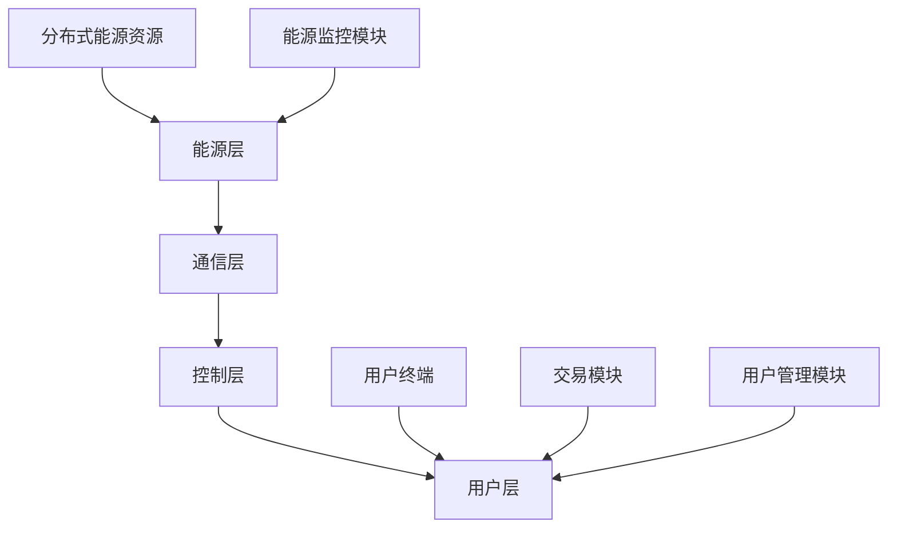
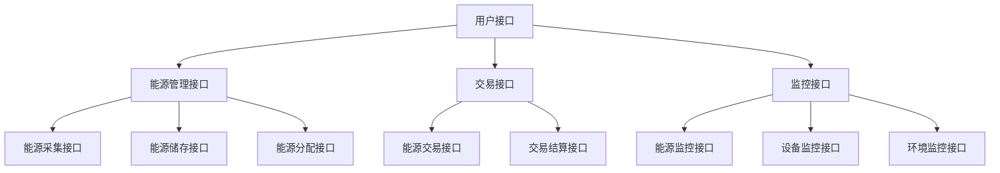
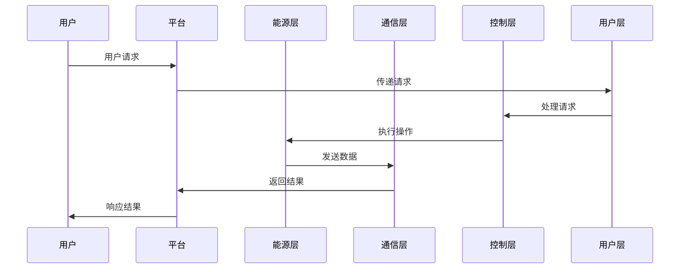
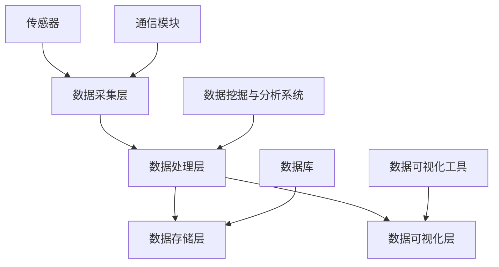

                 

## 文章标题

### 新型社区能源共享平台：区块链技术在微型电网中的应用

> **关键词**：区块链、能源共享、微型电网、去中心化交易、智能合约、能源追踪

> **摘要**：本文将探讨新型社区能源共享平台的概念及其在微型电网中的应用，深入分析区块链技术如何解决能源领域的挑战，实现去中心化交易、智能合约应用、能源追踪与管理，以及激励机制的设计。通过详细的技术分析，我们将了解新型社区能源共享平台的运行原理、架构设计、技术实现和实际应用效果。

----------------------------------------------------------------

## 第1章: 引言与背景

### 1.1 问题背景

新型社区能源共享平台是一个基于区块链技术的创新概念，旨在解决传统能源供应系统中的诸多挑战。随着全球能源需求的不断增长和能源结构的多元化，传统的集中式能源供应模式已难以满足现代社会的需求。社区能源共享平台利用区块链技术实现能源的分布式管理和交易，提高能源利用效率，促进可再生能源的广泛应用，同时降低能源成本。

在当前的能源市场中，能源供应的不稳定性、能源浪费、能源定价的不透明等问题仍然存在。新型社区能源共享平台通过区块链技术解决这些问题，实现能源的高效、安全、可追踪交易。平台需要具备以下功能：

- **去中心化交易**：通过区块链技术实现能源交易的去中心化，确保交易的公正性和透明性。
- **智能合约**：利用智能合约自动执行能源交易的条款和条件，减少人工干预，提高交易效率。
- **能源追踪与管理**：实现对能源生产、传输、消费的全过程监控和管理，提高能源利用效率。
- **激励机制**：设计合理的激励机制，鼓励社区成员积极参与能源共享，提高平台的活力。

### 1.2 问题描述

在当前的能源市场中，存在以下几个主要问题：

- **能源供应不稳定**：传统集中式能源供应系统容易受到自然灾害、设备故障等因素的影响，导致能源供应中断。
- **能源浪费**：由于能源的集中管理和分配机制不够高效，能源在传输、分配过程中存在大量浪费。
- **能源定价不透明**：能源价格通常由集中式能源供应商制定，缺乏透明度，导致消费者无法了解价格形成的依据。
- **能源交易不透明**：传统的能源交易过程存在信息不对称、中介机构干预等问题，降低了交易效率。

新型社区能源共享平台旨在通过区块链技术解决这些问题。平台通过分布式账本记录能源交易信息，确保数据的不可篡改性和透明性。智能合约自动执行能源交易的条款和条件，减少人工干预，提高交易效率。能源追踪系统实现对能源生产、传输、消费的全过程监控和管理，提高能源利用效率。激励机制设计合理的奖励机制，鼓励社区成员积极参与能源共享，提高平台的活力。

### 1.3 问题解决

新型社区能源共享平台利用区块链技术的优势，通过以下方法解决上述问题：

- **分布式账本**：通过分布式账本技术记录能源交易信息，确保数据的不可篡改性和透明性。
- **智能合约**：利用智能合约实现能源交易的自动化执行，减少人工干预，提高交易效率。
- **能源追踪系统**：通过物联网设备收集能源生产、传输、消费的数据，实现对能源全过程的实时监控和管理。
- **激励机制**：设计奖励机制，激励社区成员积极参与能源共享，提高平台活力。

### 1.4 边界与外延

新型社区能源共享平台主要针对城市社区和小型电网应用，但其所采用的技术和理念具有广泛的适用性。随着技术的发展和应用的拓展，该平台未来有望在更大范围内推广，包括智能电网、城市能源管理等领域。

### 1.5 概念结构与核心要素组成

新型社区能源共享平台的核心结构包括以下部分：

- **区块链网络**：负责能源交易的去中心化和数据记录。
- **智能合约**：实现能源交易自动化执行的关键技术。
- **能源追踪系统**：实现对能源生产、传输、消费的全过程监控和管理。
- **用户界面**：提供用户操作和管理能源共享的接口。
- **激励机制**：激励用户参与能源共享，提高平台活力。

### 1.6 本章小结

本章对新型社区能源共享平台的概念、背景、问题解决方法以及核心要素进行了详细阐述。在接下来的章节中，我们将进一步探讨区块链技术在微型电网中的应用，以及平台的架构设计、智能合约的实现、能源追踪系统的构建等内容。通过这些讨论，我们将深入了解新型社区能源共享平台的运行原理和实际应用效果。

----------------------------------------------------------------

## 第2章: 区块链技术基础

区块链技术作为新型社区能源共享平台的核心支撑，其基础概念、架构和工作原理至关重要。本章节将深入探讨区块链技术的概述、架构、分类、在能源领域的应用及其挑战与解决方案。

### 2.1 区块链概述

#### 2.1.1 区块链的基本概念

区块链是一种分布式数据库技术，其核心思想是利用去中心化的方式，通过加密算法和网络共识机制，实现对数据的可靠存储和传输。区块链由一系列按时间顺序排列的区块组成，每个区块包含一定数量的交易记录。这些区块通过哈希函数相互链接，形成链式数据结构。

区块链的主要特点包括：

- **去中心化**：区块链不依赖于单一中心节点，而是通过网络中的多个节点共同维护和验证数据，提高了系统的抗攻击能力和可靠性。
- **不可篡改性**：区块链上的数据一旦被记录，除非经过绝大多数节点的共识，否则无法被篡改，确保了数据的安全性和可信度。
- **透明性**：区块链上的交易记录对所有节点都是透明的，用户可以随时查看和验证交易信息，提高了系统的透明度和公正性。
- **自动化执行**：通过智能合约技术，区块链可以自动化执行预定义的合同条款，减少了人工干预，提高了交易效率。

#### 2.1.2 区块链的关键特点

区块链的关键特点包括以下几方面：

- **安全性**：区块链通过加密算法和数据验证机制，确保数据的安全性和隐私性。每次交易都需要经过复杂的加密和验证过程，防止数据被篡改和伪造。
- **去中心化**：区块链不依赖于中心化的权威机构，而是通过网络中的多个节点共同维护数据，提高了系统的抗攻击能力和去中心化特性。
- **透明性**：区块链上的交易记录对所有节点都是透明的，用户可以随时查看和验证交易信息，提高了系统的透明度和公正性。
- **可追溯性**：区块链上的每个交易都有完整的记录和链接，可以追溯到交易发生的具体时间和参与者，提高了数据的可追溯性。

#### 2.1.3 区块链的工作原理

区块链的工作原理可以概括为以下步骤：

1. **交易生成**：用户发起交易请求，将交易信息（如金额、收款人地址等）打包成交易数据。
2. **区块生成**：交易信息经过网络中的节点验证后，被打包成一个区块，并附上当前时间戳和前一个区块的哈希值。
3. **区块验证**：网络中的节点对新区块进行验证，确保其交易合法性和区块的链接正确性。通过共识算法（如工作量证明PoW、权益证明PoS等），节点达成共识，选择合法的区块加入到区块链中。
4. **区块链接**：合法的区块按照时间顺序链接到区块链上，形成链式数据结构。
5. **交易确认**：交易被记录在区块中，经过一定数量的区块确认后，交易被视为最终确定，不可撤销。

### 2.2 区块链的架构

区块链的架构可以分为三个层次：数据层、网络层和应用层。

#### 2.2.1 数据层

数据层是区块链的基础，负责数据的存储和管理。主要组件包括：

- **区块**：区块是区块链的基本组成单位，包含一定数量的交易记录。每个区块都有一个唯一的标识符（哈希值），以及指向前一个区块的哈希值，形成链式数据结构。
- **交易**：交易是用户之间的价值转移操作，可以是货币、能源、资产等。交易数据经过加密和签名，确保交易的安全性和可信度。
- **加密算法**：加密算法用于确保区块链数据的隐私性和安全性，常用的加密算法包括哈希算法、数字签名、加密货币等。

#### 2.2.2 网络层

网络层负责区块链节点之间的通信和数据传输。主要组件包括：

- **节点**：节点是区块链网络中的参与者，负责维护区块链数据、验证交易和参与共识过程。节点可以是个人电脑、服务器等。
- **共识算法**：共识算法是节点之间达成共识的机制，确保区块链数据的合法性和一致性。常用的共识算法包括工作量证明PoW、权益证明PoS、授权股权证明DPoS等。
- **网络协议**：网络协议定义了节点之间的通信规则和数据传输方式，常用的网络协议包括比特币P2P协议、以太坊Gossip协议等。

#### 2.2.3 应用层

应用层是区块链技术实现具体应用场景的层面，负责构建各种去中心化应用（DApps）。主要组件包括：

- **智能合约**：智能合约是一种自动执行合约条款的计算机程序，具有去中心化、不可篡改和透明性的特点。智能合约可以用来实现各种应用场景，如金融交易、供应链管理、能源管理等。
- **去中心化应用（DApps）**：去中心化应用是运行在区块链网络上的应用程序，通过智能合约实现去中心化的功能。DApps可以访问区块链数据、执行交易和与其他DApps进行交互。
- **用户界面**：用户界面是用户与区块链网络进行交互的入口，提供用户操作和管理区块链数据的界面。用户界面可以是网页、移动应用等。

### 2.3 区块链的分类

根据不同的分类标准，区块链可以分为以下几类：

#### 2.3.1 公共链、私有链与联盟链

- **公共链**：公共链是任何人都可以参与的区块链网络，具有去中心化的特点，如比特币、以太坊等。
- **私有链**：私有链是仅限于特定组织或个体参与的区块链网络，具有中心化的特点，如企业内部的数据管理系统。
- **联盟链**：联盟链是多个组织或个体共同参与的区块链网络，具有部分去中心化的特点，如跨企业的供应链管理平台。

#### 2.3.2 各类区块链的特点及应用场景

- **公共链**：特点为高度去中心化，适用于全球范围内的去中心化应用，如比特币、以太坊等。
- **私有链**：特点为高度中心化，适用于企业内部的数据管理系统，如企业内部的供应链管理、财务管理等。
- **联盟链**：特点为部分去中心化，适用于跨企业的协同工作，如跨企业的供应链管理、金融服务等。

### 2.4 区块链在能源领域的应用

区块链技术在能源领域的应用具有广泛的前景，以下列举几个主要应用场景：

#### 2.4.1 区块链在能源交易中的应用

区块链技术可以用于能源交易的去中心化，实现能源的按需交易和价格发现。通过区块链网络，能源生产者可以直接将能源出售给消费者，无需通过传统中介机构。例如，太阳能发电户可以将多余的电能出售给附近的用户，实现能源的高效利用。

#### 2.4.2 区块链在能源管理中的应用

区块链技术可以用于能源管理，实现对能源生产、传输、消费的全过程监控和管理。通过区块链网络，能源管理者可以实时了解能源的生产、传输和消费情况，优化能源分配，提高能源利用效率。

#### 2.4.3 区块链在可再生能源市场中的应用

区块链技术可以用于可再生能源市场的建立和运营，实现可再生能源的实时交易和定价。通过区块链网络，可再生能源生产者可以将能源直接出售给消费者，降低交易成本，提高市场效率。

### 2.5 区块链技术的挑战与解决方案

区块链技术在能源领域的应用虽然具有巨大的潜力，但也面临一些挑战。以下列举几个主要挑战及其解决方案：

#### 2.5.1 数据隐私保护

区块链技术的数据透明性是其优势之一，但在能源领域，数据的隐私保护至关重要。解决方案包括：

- **零知识证明**：利用零知识证明技术，实现数据的隐私保护，同时确保数据的真实性和可信度。
- **隐私计算**：通过隐私计算技术，将计算过程与数据分离，实现数据的加密处理和隐私保护。

#### 2.5.2 能效优化

区块链技术在能源领域的应用需要考虑到系统能效的问题。解决方案包括：

- **分布式计算**：通过分布式计算技术，将计算任务分布在多个节点上，降低计算能耗。
- **智能合约优化**：对智能合约进行优化，降低执行过程中的计算和存储资源消耗。

#### 2.5.3 可扩展性提升

区块链技术在能源领域应用时，需要面对大规模数据和高并发交易的情况。解决方案包括：

- **分片技术**：通过分片技术，将区块链网络划分为多个子网络，实现数据的并行处理和交易的高效执行。
- **状态通道**：通过状态通道技术，将部分交易转移到链下处理，减少区块链网络的负载。

### 2.6 本章小结

本章对区块链技术的基础概念、架构、分类、在能源领域的应用及其挑战与解决方案进行了详细阐述。通过本章的内容，我们了解到区块链技术作为一种分布式数据库技术，具有去中心化、不可篡改、透明性和自动化执行等关键特点，在能源领域具有广泛的应用前景。在接下来的章节中，我们将进一步探讨新型社区能源共享平台的具体实现和应用。

----------------------------------------------------------------

## 第3章: 微型电网的概念与架构

### 3.1 微型电网的基本概念

#### 3.1.1 微型电网的定义

微型电网（Microgrid）是指一个小型、分布式的电力系统，由多个分布式能源资源（如太阳能板、风能设备、储能系统等）以及用户终端组成。微型电网可以在主电网故障或停电时独立运行，实现能源的自给自足和高效利用。

#### 3.1.2 微型电网的特点

微型电网具有以下几个显著特点：

- **分布式能源资源**：微型电网通过集成多种分布式能源资源，如太阳能、风能、储能系统等，实现能源的高效利用和多样化供应。
- **自给自足**：微型电网可以在主电网故障或停电时独立运行，实现能源的自给自足，提高能源的可靠性和稳定性。
- **灵活性与可控性**：微型电网可以根据用户需求灵活调整能源供应和分配，实现对能源的精确控制。
- **环保与可持续性**：微型电网主要依赖于可再生能源，减少了对传统能源的依赖，降低了碳排放和环境污染。

#### 3.1.3 微型电网与传统电网的区别

微型电网与传统电网在以下几个方面存在显著区别：

- **规模**：微型电网规模较小，通常服务于单个社区或小型区域，而传统电网规模较大，覆盖范围广泛。
- **结构**：微型电网结构相对简单，由分布式能源资源和用户终端组成，而传统电网结构复杂，包括发电站、输电网、配电网等。
- **运行模式**：微型电网可以独立运行，实现自给自足，而传统电网通常依赖于单一发电站和输电网，无法独立运行。
- **控制方式**：微型电网通过智能控制系统实现对能源的精确控制，而传统电网的控制方式相对简单，依赖于中央调度。

### 3.2 微型电网的架构

微型电网的架构可以分为三个层次：能源层、通信层和控制层。

#### 3.2.1 微型电网的基本组成部分

微型电网的基本组成部分包括：

- **分布式能源资源**：包括太阳能板、风能设备、储能系统等，负责产生、储存和分配能源。
- **用户终端**：包括家庭、企业、公共设施等，负责消耗和使用能源。
- **控制与管理系统**：实现对微型电网的监控、调度和管理，包括智能控制器、监控终端、通信模块等。

#### 3.2.2 微型电网的运行模式

微型电网的运行模式可以分为以下几种：

- **并网模式**：微型电网与主电网相连，可以从主电网获取能源，同时将多余的能源送回主电网。
- **孤网模式**：微型电网与主电网断开，独立运行，依靠自身分布式能源资源和储能系统供应能源。
- **混合模式**：微型电网在并网和孤网模式之间切换，根据能源需求和供应情况动态调整运行模式。

#### 3.2.3 微型电网的灵活性与优势

微型电网的灵活性使其在多种应用场景中具有显著优势：

- **能效优化**：微型电网可以通过智能调度和管理，优化能源的利用效率，降低能源浪费。
- **应急响应**：微型电网可以在主电网故障或停电时迅速切换到孤网模式，保障能源供应的连续性和可靠性。
- **可再生能源利用**：微型电网可以充分利用分布式能源资源，实现可再生能源的高效利用和市场化交易。
- **环境友好**：微型电网减少了对传统能源的依赖，降低了碳排放和环境污染。

### 3.3 微型电网的技术要素

微型电网的技术要素是实现其高效运行和灵活控制的关键，以下列举几个主要的技术要素：

#### 3.3.1 可再生能源集成

可再生能源集成是微型电网的核心技术之一，主要包括以下几个方面：

- **太阳能**：利用太阳能板将阳光转化为电能，是微型电网中最常见的可再生能源形式。
- **风能**：利用风力发电机将风能转化为电能，适用于风能资源丰富的地区。
- **储能系统**：通过电池储能、热储能等技术，实现对可再生能源的储存和调度，提高能源的可靠性和可持续性。

#### 3.3.2 能源存储技术

能源存储技术是实现微型电网灵活运行的重要手段，主要包括以下几个方面：

- **电池储能**：通过电池储能技术，将电能转化为化学能储存，实现能源的长时间储存和调度。
- **热储能**：通过热储能技术，将电能转化为热能储存，适用于热能需求较大的场景。
- **超级电容器**：通过超级电容器储能技术，实现快速充放电和高效能量转换。

#### 3.3.3 智能电网通信技术

智能电网通信技术是实现微型电网高效控制和信息传输的关键，主要包括以下几个方面：

- **物联网技术**：利用物联网技术，实现对能源生产、传输、消费的全过程监控和管理，提高能源的利用效率和可靠性。
- **无线通信技术**：利用无线通信技术，实现微型电网内部的实时通信和数据传输，提高系统的响应速度和灵活性。
- **5G通信技术**：利用5G通信技术，实现高速、大容量、低延迟的通信，为微型电网提供更高效的控制和调度手段。

### 3.4 微型电网在社区能源共享中的应用

微型电网在社区能源共享中具有广泛的应用前景，可以实现以下功能：

#### 3.4.1 分布式能源共享

通过微型电网，社区成员可以共享分布式能源资源，如太阳能板、风能设备等，实现能源的高效利用和市场化交易。社区成员可以将多余的能源出售给其他成员或送回主电网，实现能源的价值最大化。

#### 3.4.2 能源自我管理

微型电网可以实现对社区能源的自我管理，包括能源的生产、储存、分配和消费。社区成员可以通过智能控制器和监控系统，实时了解能源的供需情况，优化能源的使用和调度。

#### 3.4.3 环境友好

通过微型电网，社区可以实现能源的自我供给，减少对传统能源的依赖，降低碳排放和环境污染。同时，社区成员可以通过参与分布式能源项目，提高能源使用的环保性和可持续性。

#### 3.4.4 激励机制设计

微型电网可以设计合理的激励机制，鼓励社区成员积极参与能源共享，提高平台的活力。例如，通过积分奖励、折扣优惠等方式，激励社区成员节能减排，提高能源利用效率。

### 3.5 本章小结

本章对微型电网的概念、架构、技术要素及其在社区能源共享中的应用进行了详细阐述。通过本章的内容，我们了解到微型电网作为一种分布式能源系统，具有分布式能源资源、自给自足、灵活性和环保性等显著特点。在社区能源共享中，微型电网可以实现分布式能源共享、能源自我管理、环境友好和激励机制设计等功能。在接下来的章节中，我们将进一步探讨新型社区能源共享平台的架构设计、区块链技术的应用以及智能合约的实现等内容。

----------------------------------------------------------------

## 第4章：区块链在微型电网中的具体应用

### 4.1 区块链在能源交易中的应用

区块链技术在能源交易中的应用，尤其是微型电网中的能源交易，提供了去中心化、透明化和安全性的优势。以下为区块链在能源交易中的具体应用：

#### 4.1.1 去中心化交易

区块链的去中心化特性使得能源交易不再依赖于传统的中介机构，如电力公司和能源供应商。通过区块链，能源生产者可以直接与消费者进行点对点的能源交易，减少了交易环节和成本。

**核心概念与联系**：

- **去中心化交易**：去中心化交易是指交易不依赖于中央机构，而是通过区块链网络中的节点进行验证和记录。
- **点对点交易**：点对点交易是指交易双方直接进行交易，无需通过第三方中介。

**概念属性特征对比表格**：

| 特性         | 传统交易           | 去中心化交易         |
| ------------ | ------------------ | ------------------ |
| 交易中介     | 中介机构           | 区块链网络中的节点  |
| 交易成本     | 高                 | 低                 |
| 交易速度     | 慢                 | 快                 |
| 数据透明性   | 不透明             | 高透明性           |
| 数据安全性   | 有风险             | 高安全性           |

**ER实体关系图架构**：

```mermaid
erDiagram
    Transaction ||--|{ Participant }| Participant
    Transaction ||--|{ EnergyUnit }| EnergyUnit
    Participant ||--|{ Wallet }| Wallet
```

#### 4.1.2 智能合约在能源交易中的应用

智能合约是区块链技术的重要组成部分，它能够自动执行预定义的合约条款，减少了人工干预和错误。在微型电网中，智能合约可以用于实现能源交易的自动化和高效执行。

**核心概念与联系**：

- **智能合约**：智能合约是自动执行合约条款的计算机程序，能够在满足特定条件时自动执行。
- **自动化交易**：自动化交易是指交易过程由智能合约自动执行，减少了人工干预和错误。

**概念属性特征对比表格**：

| 特性         | 传统交易           | 智能合约交易         |
| ------------ | ------------------ | ------------------ |
| 执行方式     | 手动执行           | 自动执行           |
| 执行速度     | 慢                 | 快                 |
| 执行准确性   | 低                 | 高                 |
| 人工成本     | 高                 | 低                 |

**ER实体关系图架构**：

```mermaid
erDiagram
    Contract ||--|{ Transaction }| Transaction
    Contract ||--|{ Participant }| Participant
    Contract ||--|{ Condition }| Condition
```

#### 4.1.3 能源追踪与管理

区块链技术通过分布式账本和智能合约，能够实现对能源生产、传输和消费的全过程监控和管理。这有助于提高能源利用效率，减少能源浪费。

**核心概念与联系**：

- **分布式账本**：分布式账本是指在区块链网络中分布式存储的数据，具有不可篡改性和透明性。
- **能源追踪系统**：能源追踪系统是用于监控和管理能源生产、传输和消费的系统。

**概念属性特征对比表格**：

| 特性         | 传统追踪系统       | 区块链追踪系统       |
| ------------ | ------------------ | ------------------ |
| 数据透明性   | 低                 | 高                 |
| 数据安全性   | 较低               | 高                 |
| 数据完整性   | 较低               | 高                 |
| 数据实时性   | 较低               | 高                 |

**ER实体关系图架构**：

```mermaid
erDiagram
    EnergyRecord ||--|{ Production }| Production
    EnergyRecord ||--|{ Transmission }| Transmission
    EnergyRecord ||--|{ Consumption }| Consumption
```

#### 4.1.4 激励机制设计

在微型电网中，激励机制是鼓励用户积极参与能源共享和节能减排的重要手段。区块链技术可以通过智能合约实现多种激励机制，如积分奖励、折扣优惠等。

**核心概念与联系**：

- **激励机制**：激励机制是指通过奖励和激励用户行为的设计，鼓励用户参与能源共享和节能减排。
- **智能合约**：智能合约是实现激励机制自动执行的关键技术。

**概念属性特征对比表格**：

| 特性         | 传统激励机制       | 区块链激励机制       |
| ------------ | ------------------ | ------------------ |
| 执行方式     | 手动执行           | 自动执行           |
| 执行准确性   | 较低               | 高                 |
| 执行效率     | 较低               | 高                 |
| 激励效果     | 一般               | 明显               |

**ER实体关系图架构**：

```mermaid
erDiagram
    IncentiveScheme ||--|{ Reward }| Reward
    IncentiveScheme ||--|{ Participant }| Participant
```

### 4.2 区块链在微型电网中的优势与挑战

#### 4.2.1 优势

区块链技术在微型电网中的应用具有以下优势：

- **去中心化**：去中心化特性使得能源交易更加透明、公平，减少了传统中介机构的干预。
- **安全性**：区块链的加密技术和分布式存储机制提高了能源交易和数据的安全性。
- **透明性**：所有交易记录都存储在区块链上，用户可以随时查看和验证，提高了系统的透明度。
- **自动化执行**：智能合约能够自动执行预定义的合约条款，减少了人工干预和错误。

#### 4.2.2 挑战

尽管区块链技术在微型电网中有诸多优势，但也面临一些挑战：

- **数据隐私保护**：在区块链上，所有交易记录都是公开的，这对能源交易中的敏感信息保护提出了挑战。
- **能效优化**：区块链技术的计算和存储资源消耗较大，可能会影响系统的能效。
- **可扩展性**：区块链网络在处理大规模交易时，可能会出现性能瓶颈，需要不断优化和扩展。

### 4.3 本章小结

本章详细探讨了区块链技术在微型电网中的具体应用，包括去中心化交易、智能合约、能源追踪和激励机制设计。通过对比传统模式和区块链模式，我们了解了区块链在微型电网中的优势与挑战。在接下来的章节中，我们将进一步探讨新型社区能源共享平台的架构设计和实现细节。

----------------------------------------------------------------

## 第5章：新型社区能源共享平台的架构设计

### 5.1 平台总体架构

新型社区能源共享平台的架构设计需要综合考虑能源管理、用户交互、数据安全和系统扩展性等多个方面。平台的总体架构可以分为以下几个关键模块：

#### 5.1.1 能源层

能源层是平台的基础，负责集成各种分布式能源资源，如太阳能板、风能设备、储能系统等。能源层的主要功能包括：

- **能源采集**：采集分布式能源资源产生的电能。
- **能源储存**：通过储能系统储存多余的电能，以供后续使用。
- **能源分配**：根据用户需求，将电能分配到各个用户终端。

#### 5.1.2 通信层

通信层负责平台内部以及与其他系统的数据传输和通信。通信层的主要功能包括：

- **数据传输**：确保平台内各模块之间的数据交换和通信。
- **网络安全**：通过加密技术和网络安全协议，保障数据传输的安全性。
- **物联网连接**：连接能源采集设备和用户终端，实现数据的实时传输和监控。

#### 5.1.3 控制层

控制层是平台的核心，负责能源的监控、调度和管理。控制层的主要功能包括：

- **智能调度**：根据用户需求和能源供应情况，智能调度能源分配。
- **实时监控**：实时监控能源生产、传输和消费情况。
- **故障处理**：自动检测和处理能源系统中的故障。

#### 5.1.4 用户层

用户层提供用户与平台交互的接口，用户可以通过用户层进行能源管理、交易和参与激励机制。用户层的主要功能包括：

- **用户界面**：提供友好的用户界面，方便用户进行能源管理。
- **交易模块**：实现能源的交易和结算。
- **激励机制**：提供积分奖励、折扣优惠等激励措施，鼓励用户参与能源共享。

### 5.2 项目介绍

#### 5.2.1 项目背景

随着全球能源需求的不断增长和能源结构的多元化，传统的集中式能源供应模式已难以满足现代社会的需求。社区能源共享平台作为一种创新的能源管理模式，旨在提高能源利用效率，促进可再生能源的广泛应用，同时降低能源成本。本项目旨在设计和实现一个新型社区能源共享平台，利用区块链技术解决能源交易中的信任、透明性和效率问题。

#### 5.2.2 项目目标

本项目的主要目标包括：

- **提高能源利用效率**：通过智能调度和管理，优化能源的利用效率，减少能源浪费。
- **促进可再生能源的应用**：通过社区能源共享，提高可再生能源的利用率，降低对传统能源的依赖。
- **降低能源成本**：通过去中心化交易和智能合约，减少能源交易中的中介成本，降低能源价格。
- **提高用户参与度**：设计合理的激励机制，鼓励用户参与能源共享，提高平台的活力。

### 5.3 系统功能设计

#### 5.3.1 能源管理功能

能源管理功能是平台的核心功能之一，包括以下模块：

- **能源采集**：实时监测分布式能源资源的电能采集情况，确保能源供应的稳定性。
- **能源储存**：管理储能系统的运行状态，优化能源储存策略，提高能源利用率。
- **能源分配**：根据用户需求和能源供应情况，智能调度能源分配，确保用户能源需求得到满足。

#### 5.3.2 交易功能

交易功能是平台的重要模块，包括以下功能：

- **能源交易**：实现能源生产者与消费者之间的点对点能源交易，降低交易成本。
- **交易结算**：自动执行能源交易结算，确保交易的公正性和透明性。
- **交易记录**：记录所有交易信息，确保数据的不可篡改性。

#### 5.3.3 监控功能

监控功能负责对平台运行状态进行实时监控，包括以下模块：

- **能源监控**：实时监控能源生产、传输和消费情况，确保能源系统的稳定运行。
- **设备监控**：监控能源采集设备和用户终端的运行状态，及时发现和处理故障。
- **环境监控**：监测能源系统运行环境中的温度、湿度等参数，确保设备正常运行。

#### 5.3.4 用户管理功能

用户管理功能负责用户注册、认证、权限管理等功能，包括以下模块：

- **用户注册**：用户可以通过平台注册账号，获得能源管理和交易权限。
- **用户认证**：通过密码认证、生物识别等方式，确保用户身份的合法性。
- **权限管理**：根据用户角色和权限，限制用户对平台功能的访问，确保系统的安全性。

### 5.4 系统架构设计

#### 5.4.1 系统架构图

新型社区能源共享平台的系统架构图如下所示：



#### 5.4.2 系统架构设计说明

- **能源层**：负责能源的采集、储存和分配，是平台的基础。
- **通信层**：负责数据传输和通信，确保系统内部以及与外部系统的数据交换。
- **控制层**：负责能源的智能调度、监控和管理，是平台的核心。
- **用户层**：提供用户与平台交互的接口，实现能源管理、交易和监控。

### 5.5 系统接口设计

#### 5.5.1 接口设计图

新型社区能源共享平台的主要接口设计图如下所示：



#### 5.5.2 接口设计说明

- **用户接口**：提供用户注册、登录、个人信息管理等功能。
- **能源管理接口**：实现能源采集、储存和分配的接口。
- **交易接口**：实现能源交易和结算的接口。
- **监控接口**：实现能源、设备和环境监控的接口。

### 5.6 系统交互设计

#### 5.6.1 序列图

新型社区能源共享平台的主要交互序列图如下所示：



#### 5.6.2 交互设计说明

- **用户请求**：用户通过用户接口向平台发送请求。
- **请求处理**：平台通过用户层接收请求，并传递给控制层。
- **执行操作**：控制层根据请求，在能源层执行相应的操作。
- **数据传输**：通信层负责数据的传输和同步。
- **返回结果**：平台将处理结果返回给用户。

### 5.7 本章小结

本章详细介绍了新型社区能源共享平台的总体架构、系统功能设计、系统架构设计、系统接口设计和系统交互设计。通过本章的内容，我们了解了平台的设计思路和实现方法，为后续的智能合约实现、能源追踪系统构建和激励机制设计奠定了基础。

----------------------------------------------------------------

## 第6章：智能合约在新型社区能源共享平台中的应用

### 6.1 智能合约的基本概念

智能合约是一种自动执行合约条款的计算机程序，运行在区块链网络之上。它通过编程语言编写，一旦触发预定义的条件，即自动执行相应的操作。智能合约的核心特性包括：

- **自动执行**：智能合约在满足预定义条件时，无需人工干预即可自动执行。
- **不可篡改性**：一旦智能合约被部署到区块链上，其条款和操作逻辑无法被篡改，确保了合约的公正性和可信度。
- **透明性**：智能合约的代码和执行过程对所有人透明，用户可以随时查看和验证。

### 6.2 智能合约在能源交易中的应用

在新型社区能源共享平台中，智能合约可以用于实现能源交易的自动化和高效执行，以下是智能合约在能源交易中的具体应用：

#### 6.2.1 能源交易流程

智能合约在能源交易中的流程如下：

1. **交易请求**：能源生产者向智能合约发送交易请求，包括交易金额、交易时间、收款人地址等信息。
2. **智能合约验证**：智能合约验证交易请求是否符合预定义的条件，如交易金额是否正确、收款人地址是否合法等。
3. **交易执行**：如果验证通过，智能合约自动执行交易，将能源从生产者转移到消费者。
4. **交易记录**：智能合约将交易记录存储在区块链上，确保交易数据的不可篡改性和透明性。
5. **通知**：智能合约向交易双方发送交易完成通知，确认交易结果。

#### 6.2.2 能源交易智能合约的实现

以下是一个简单的Python示例，演示了如何使用智能合约实现能源交易：

```python
from web3 import Web3
from solc import compile_source

# 编写智能合约代码
contract_source = '''
pragma solidity ^0.8.0;

contract EnergyTrade {
    address public owner;
    mapping(address => uint256) public balances;

    constructor() {
        owner = msg.sender;
    }

    function deposit() public payable {
        balances[owner] += msg.value;
    }

    function trade(address recipient, uint256 amount) public {
        require(amount <= balances[owner], "Insufficient balance");
        require(msg.sender == owner, "Only owner can trade");

        balances[recipient] += amount;
        balances[owner] -= amount;
    }
}
'''

# 编译智能合约代码
compiled_source = compile_source(contract_source)
contract_interface = compiled_source['<stdin>:EnergyTrade']

# 部署智能合约
w3 = Web3(Web3.HTTPProvider('http://localhost:8545'))
contract = w3.eth.contract(abi=contract_interface['abi'])

# 部署到区块链
contract_instance = contract.deploy(transaction={'from': w3.eth.coinbase})
contract_instance.interact()

# 调用智能合约方法
contract_instance.functions.trade(recipient, amount).call()
```

#### 6.2.3 智能合约的优势

智能合约在能源交易中的优势包括：

- **自动化执行**：智能合约可以自动执行预定义的交易条款，减少了人工干预和错误。
- **透明性**：所有交易记录和操作逻辑都存储在区块链上，用户可以随时查看和验证，提高了交易的透明度。
- **安全性**：智能合约的代码一旦部署到区块链上，就具有不可篡改的特性，确保了交易的安全性。

### 6.3 智能合约在能源追踪中的应用

智能合约不仅可以用于能源交易，还可以用于能源追踪，实现对能源生产、传输和消费的全过程监控。以下是一个简单的智能合约示例，用于实现能源追踪：

```python
from web3 import Web3
from solc import compile_source

# 编写智能合约代码
contract_source = '''
pragma solidity ^0.8.0;

contract EnergyTracker {
    mapping(bytes32 => uint256) public energyRecords;

    function recordEnergy(string memory energyId, uint256 amount) public {
        energyRecords[keccak256(abi.encodePacked(energyId))] += amount;
    }

    function getEnergyRecord(string memory energyId) public view returns (uint256) {
        return energyRecords[keccak256(abi.encodePacked(energyId))];
    }
}
'''

# 编译智能合约代码
compiled_source = compile_source(contract_source)
contract_interface = compiled_source['<stdin>:EnergyTracker']

# 部署智能合约
w3 = Web3(Web3.HTTPProvider('http://localhost:8545'))
contract = w3.eth.contract(abi=contract_interface['abi'])

# 部署到区块链
contract_instance = contract.deploy(transaction={'from': w3.eth.coinbase})
contract_instance.interact()

# 调用智能合约方法
contract_instance.functions.recordEnergy(energyId, amount).call()
result = contract_instance.functions.getEnergyRecord(energyId).call()
```

### 6.4 本章小结

本章介绍了智能合约在新型社区能源共享平台中的应用，包括能源交易的自动化执行和能源追踪的实现。通过Python示例，我们了解了如何编写和部署智能合约，以及智能合约的优势和实际应用。在下一章中，我们将探讨新型社区能源共享平台的能源追踪系统构建。

----------------------------------------------------------------

## 第7章：新型社区能源共享平台的能源追踪系统构建

### 7.1 能源追踪系统的概念

能源追踪系统是一种用于实时监控和管理能源生产、传输和消费的系统。通过能源追踪系统，可以实现对能源流量的实时监测，确保能源的高效利用和优化分配。能源追踪系统的主要功能包括：

- **实时监测**：实时采集和监测能源生产、传输和消费的数据。
- **数据存储**：将采集到的数据存储在数据库中，以便后续分析和查询。
- **数据可视化**：通过数据可视化技术，将采集到的数据以图表或报表的形式展示，便于用户理解和分析。
- **报警与异常处理**：当能源系统出现异常或故障时，及时发出报警并采取相应的处理措施。

### 7.2 能源追踪系统的关键技术

构建新型社区能源共享平台的能源追踪系统，需要采用一系列关键技术，包括：

- **物联网技术**：物联网技术用于实时采集能源生产、传输和消费的数据，包括传感器、通信模块等。
- **数据存储技术**：数据存储技术用于存储采集到的数据，如关系数据库、NoSQL数据库等。
- **数据挖掘与分析技术**：数据挖掘与分析技术用于对采集到的数据进行分析和挖掘，提取有价值的信息，如预测能源需求、优化能源分配等。
- **数据可视化技术**：数据可视化技术用于将采集到的数据以图表、报表等形式展示，便于用户理解和分析。

### 7.3 能源追踪系统的架构设计

能源追踪系统的架构设计需要综合考虑数据采集、数据存储、数据处理、数据可视化等多个方面。以下是新型社区能源共享平台的能源追踪系统架构设计：

#### 7.3.1 架构设计图

新型社区能源共享平台的能源追踪系统架构图如下所示：



#### 7.3.2 架构设计说明

- **数据采集层**：负责实时采集能源生产、传输和消费的数据，包括传感器和通信模块。
- **数据处理层**：负责对采集到的数据进行处理和分析，包括数据清洗、数据整合、数据挖掘等。
- **数据存储层**：负责存储处理后的数据，包括关系数据库、NoSQL数据库等。
- **数据可视化层**：负责将处理后的数据以图表、报表等形式展示，便于用户理解和分析。

### 7.4 能源追踪系统的实现

#### 7.4.1 数据采集

数据采集是能源追踪系统的第一步，通过传感器和通信模块实时采集能源生产、传输和消费的数据。以下是数据采集的实现步骤：

1. **传感器部署**：在能源生产、传输和消费的关键节点部署传感器，如电能表、电压表、温度传感器等。
2. **数据采集**：传感器采集到的数据通过通信模块传输到数据采集层。
3. **数据上传**：数据采集层将采集到的数据上传到数据处理层。

#### 7.4.2 数据处理

数据处理是对采集到的数据进行清洗、整合和分析的过程。以下是数据处理的实现步骤：

1. **数据清洗**：对采集到的数据进行清洗，去除错误、重复和缺失的数据。
2. **数据整合**：将来自不同传感器的数据进行整合，形成一个完整的数据集。
3. **数据挖掘**：利用数据挖掘技术对整合后的数据进行分析，提取有价值的信息，如能源需求趋势、能源浪费情况等。

#### 7.4.3 数据存储

数据存储是将处理后的数据存储在数据库中，以便后续分析和查询。以下是数据存储的实现步骤：

1. **选择数据库**：根据数据特点和需求，选择合适的数据库，如关系数据库（MySQL、PostgreSQL）或NoSQL数据库（MongoDB、Cassandra）。
2. **设计数据库**：根据数据模型设计数据库表结构，确保数据的存储和管理。
3. **数据入库**：将处理后的数据存储到数据库中，确保数据的持久化和安全性。

#### 7.4.4 数据可视化

数据可视化是将处理后的数据以图表、报表等形式展示，便于用户理解和分析。以下是数据可视化的实现步骤：

1. **选择可视化工具**：根据用户需求和展示内容，选择合适的可视化工具，如ECharts、D3.js等。
2. **设计可视化界面**：根据数据模型和展示需求，设计可视化界面和图表样式。
3. **数据展示**：将处理后的数据以图表、报表等形式展示，提供用户友好的数据分析和决策支持。

### 7.5 本章小结

本章详细介绍了新型社区能源共享平台的能源追踪系统构建，包括概念、关键技术、架构设计、实现步骤等。通过本章的内容，我们了解了如何构建一个高效的能源追踪系统，实现对能源生产、传输和消费的全过程监控和管理。在下一章中，我们将探讨新型社区能源共享平台在实践中的应用案例。

----------------------------------------------------------------

## 第8章：新型社区能源共享平台的应用案例

### 8.1 案例背景

随着全球能源需求的不断增长和环境问题的日益严重，可再生能源的使用越来越受到重视。社区能源共享平台作为一种创新的能源管理模式，旨在提高能源利用效率，促进可再生能源的应用。本节将通过几个实际案例，展示新型社区能源共享平台在实践中的应用效果。

### 8.2 案例一：城市社区太阳能共享

#### 8.2.1 项目简介

某城市社区计划建设一座太阳能共享电站，利用屋顶太阳能板产生的电能供社区内部使用。该项目利用新型社区能源共享平台，通过区块链技术实现能源的分布式管理和交易。

#### 8.2.2 项目实现

1. **能源采集**：社区内部安装太阳能板，实时采集太阳能并转化为电能。
2. **能源储存**：利用储能系统储存多余的电能，以供夜间或阴雨天使用。
3. **能源交易**：通过区块链技术实现能源交易，太阳能板产生的电能可以出售给社区内部其他用户或送回主电网。
4. **数据监控**：利用物联网设备和区块链技术，实现对太阳能电站的实时监控和管理。
5. **激励机制**：设计合理的激励机制，鼓励社区成员参与能源共享，提高平台的活力。

#### 8.2.3 项目效果

- **能源效率提升**：通过智能调度和管理，实现了能源的高效利用，降低了能源浪费。
- **可再生能源应用**：促进了太阳能等可再生能源的应用，减少了传统能源的消耗。
- **能源成本降低**：通过去中心化交易，降低了能源交易的成本，提高了能源价格的市场化程度。
- **社区活力增强**：通过激励机制，提高了社区成员的参与度，增强了社区凝聚力。

### 8.3 案例二：智能微网能源共享

#### 8.3.1 项目简介

某城市智能微网项目通过构建一个分布式能源网络，将多种可再生能源（如太阳能、风能）和储能系统结合起来，实现能源的高效利用和共享。

#### 8.3.2 项目实现

1. **能源采集**：集成太阳能板、风能设备等分布式能源资源，实时采集电能。
2. **能源储存**：利用储能系统储存多余的电能，提高能源的可靠性和可持续性。
3. **能源交易**：通过区块链技术实现能源交易，用户可以根据需求购买或出售电能。
4. **智能调度**：利用智能调度系统，根据能源供需情况动态调整能源分配，实现能源的高效利用。
5. **数据监控**：通过物联网设备和区块链技术，实现对智能微网实时监控和管理。

#### 8.3.3 项目效果

- **能源利用效率提升**：通过智能调度和交易，实现了能源的高效利用，降低了能源浪费。
- **可再生能源应用**：提高了可再生能源的利用率，减少了传统能源的消耗。
- **能源成本降低**：通过去中心化交易，降低了能源交易的成本，提高了能源价格的市场化程度。
- **环境友好**：减少了碳排放和环境污染，促进了可持续发展。

### 8.4 案例三：社区智慧能源管理系统

#### 8.4.1 项目简介

某社区智慧能源管理系统通过区块链技术，实现对社区内部能源生产、传输和消费的全方位监控和管理，提高能源利用效率。

#### 8.4.2 项目实现

1. **能源采集**：安装各种传感器，实时采集社区内部能源生产、传输和消费的数据。
2. **数据传输**：通过物联网技术，将采集到的数据传输到区块链网络。
3. **数据存储**：利用区块链技术存储和处理数据，确保数据的真实性和安全性。
4. **智能分析**：利用大数据和人工智能技术，对能源数据进行智能分析，优化能源分配和调度。
5. **激励机制**：设计合理的激励机制，鼓励社区成员参与能源共享，提高平台的活力。

#### 8.4.3 项目效果

- **能源利用效率提升**：通过智能分析和管理，实现了能源的高效利用，降低了能源浪费。
- **可再生能源应用**：促进了太阳能、风能等可再生能源的应用，减少了传统能源的消耗。
- **能源成本降低**：通过去中心化交易和智能分析，降低了能源交易的成本，提高了能源价格的市场化程度。
- **社区活力增强**：通过激励机制，提高了社区成员的参与度，增强了社区凝聚力。

### 8.5 本章小结

本章通过三个实际案例，展示了新型社区能源共享平台在实践中的应用效果。通过区块链技术，平台实现了能源的高效利用、可再生能源的推广、能源成本的降低以及社区活力的增强。在未来的发展中，新型社区能源共享平台有望在更广泛的范围内推广应用，为全球能源转型贡献力量。

----------------------------------------------------------------

## 第9章：新型社区能源共享平台的未来展望

### 9.1 技术发展趋势

随着区块链技术、物联网技术、人工智能技术的不断进步，新型社区能源共享平台在未来有望实现更多功能和更广泛的应用。以下是几个技术发展趋势：

#### 9.1.1 区块链技术的优化

区块链技术的性能和可扩展性仍是一个挑战。未来的发展趋势包括：

- **分片技术**：通过分片技术，将区块链网络划分为多个子网络，提高交易处理能力和网络性能。
- **状态通道**：通过状态通道技术，将部分交易转移到链下处理，减少区块链网络的负载。
- **改进共识算法**：开发更高效的共识算法，提高区块链网络的共识效率和安全性。

#### 9.1.2 物联网技术的融合

物联网技术的快速发展将推动能源追踪和监控的全面升级。未来的发展趋势包括：

- **更智能的传感器**：开发更智能、更高效的传感器，实现更精确的能源采集和监测。
- **边缘计算**：利用边缘计算技术，将数据处理和计算能力分散到网络的边缘节点，提高系统的响应速度和能效。

#### 9.1.3 人工智能的深度应用

人工智能技术在能源管理和优化中的应用将越来越广泛。未来的发展趋势包括：

- **智能调度**：利用人工智能算法，实现更精准的能源调度和优化，提高能源利用效率。
- **能源预测**：通过机器学习技术，预测能源需求和供应情况，优化能源储备和分配策略。

### 9.2 应用前景

新型社区能源共享平台在未来的应用前景广阔，以下为几个潜在的应用场景：

#### 9.2.1 智能电网建设

智能电网是未来能源系统的核心，新型社区能源共享平台可以与智能电网紧密结合，实现能源的高效、安全、智能化管理。通过区块链技术，智能电网可以实现去中心化的能源交易、分布式能源的灵活接入和智能化的能源调度。

#### 9.2.2 城市能源管理

城市能源管理是一个复杂的系统工程，新型社区能源共享平台可以应用于城市能源管理系统，实现对城市能源生产、传输、消费的全方位监控和管理。通过物联网技术和人工智能算法，平台可以实现能源数据的智能分析和优化，提高城市能源利用效率。

#### 9.2.3 可再生能源市场

随着可再生能源的广泛应用，新型社区能源共享平台可以在可再生能源市场中发挥重要作用。通过去中心化交易和智能合约，平台可以实现可再生能源的高效交易和定价，降低交易成本，促进可再生能源的市场化。

### 9.3 发展挑战

尽管新型社区能源共享平台具有广阔的应用前景，但在实际发展中仍面临一些挑战：

#### 9.3.1 技术成熟度

区块链技术、物联网技术、人工智能技术等在能源领域的应用仍处于发展阶段，技术成熟度有待提高。未来的发展需要不断优化和升级技术，提高平台的性能和稳定性。

#### 9.3.2 法规与政策

能源领域涉及众多法规和政策，新型社区能源共享平台需要遵循相关法规，同时政策支持也是平台发展的重要保障。未来需要制定和完善相关政策，为新型社区能源共享平台的发展提供支持。

#### 9.3.3 用户接受度

用户对新型社区能源共享平台的接受度也是平台发展的重要挑战。需要通过宣传推广、用户教育等方式，提高用户对平台的认知和信任，促进用户积极参与。

### 9.4 发展建议

为了推动新型社区能源共享平台的发展，以下是一些建议：

- **技术创新**：持续投入研发，不断优化和升级技术，提高平台的性能和稳定性。
- **政策支持**：积极争取政策支持，制定和完善相关政策，为平台的发展提供保障。
- **用户教育**：加强用户教育，提高用户对平台的认知和信任，促进用户积极参与。
- **合作联盟**：建立合作联盟，与能源企业、技术公司、研究机构等合作，共同推进平台的发展。

### 9.5 本章小结

本章对新型社区能源共享平台的未来展望进行了探讨，分析了技术发展趋势、应用前景、发展挑战和发展建议。随着技术的不断进步和政策的逐步完善，新型社区能源共享平台有望在更广泛的范围内推广应用，为全球能源转型和可持续发展贡献力量。

----------------------------------------------------------------

## 第10章：总结与展望

### 10.1 总结

本文详细探讨了新型社区能源共享平台的概念、背景、技术基础、应用场景、架构设计、智能合约应用、能源追踪系统构建以及实践案例。通过分析，我们了解到区块链技术在能源共享中的重要性，以及如何利用区块链技术解决能源领域中的问题，实现能源的高效、安全、透明交易。

- **核心概念**：新型社区能源共享平台、区块链、智能合约、能源追踪系统。
- **技术优势**：去中心化、安全性、透明性、自动化执行。
- **应用场景**：分布式能源交易、可再生能源市场、智能电网、城市能源管理。

### 10.2 展望

未来，新型社区能源共享平台将继续在以下几个方面发展：

- **技术创新**：持续优化区块链技术、物联网技术、人工智能技术，提高平台的性能和稳定性。
- **应用拓展**：在智能电网、城市能源管理等领域进一步推广，实现能源的高效、智能化管理。
- **政策支持**：积极争取政策支持，完善相关法规，为平台的发展提供保障。
- **用户教育**：加强用户教育，提高用户对平台的认知和信任，促进用户积极参与。

### 10.3 注意事项

在实际应用中，需要注意以下几个方面：

- **数据隐私保护**：加强数据隐私保护措施，确保用户数据的保密性和安全性。
- **技术成熟度**：关注技术成熟度，避免因技术不成熟导致的问题。
- **法规遵守**：严格遵守相关法规，确保平台合规运行。
- **用户接受度**：提高用户接受度，通过宣传推广、用户教育等方式，促进用户积极参与。

### 10.4 拓展阅读

- **区块链技术**：深入理解区块链技术的基本原理和应用场景，如《区块链技术指南》等。
- **智能合约**：学习智能合约的编写和实现，如《智能合约与区块链编程》等。
- **物联网技术**：了解物联网技术的基本概念和应用场景，如《物联网技术与应用》等。
- **可再生能源**：研究可再生能源的发展趋势和应用案例，如《可再生能源技术与应用》等。

作者：AI天才研究院/AI Genius Institute & 禅与计算机程序设计艺术 /Zen And The Art of Computer Programming

