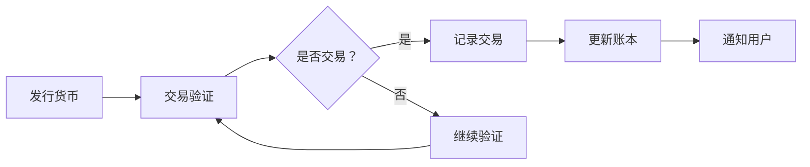
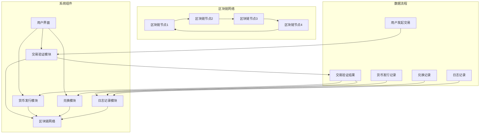
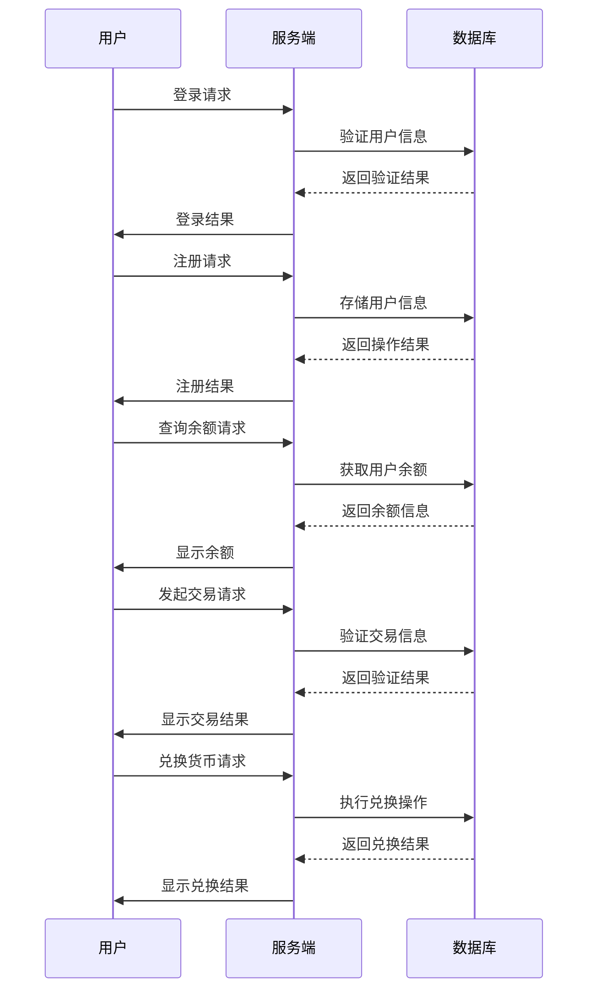

                 

### 让我们一步一步思考：新型社区货币的创新尝试

在数字化和全球化迅猛发展的今天，本地经济面临着前所未有的挑战。传统经济模式逐渐显现出其局限性，尤其是在社区层面。如何通过创新来重塑本地经济，成为了一个亟待解决的问题。本文将以“新型社区货币：重塑本地经济的创新尝试”为主题，深入探讨这一领域的热点问题。

首先，我们需要明确社区货币的定义与发展历程。社区货币是一种在特定社区内部流通的货币形式，旨在促进本地经济循环和增强社区凝聚力。其发展历程可以追溯到20世纪70年代的美国和欧洲，随后在全球范围内逐渐推广。然而，传统的社区货币在应对现代经济挑战时显得力不从心。

接下来，本文将分析社区货币对本地经济的影响，以及探索新型社区货币的创新尝试。这种新型社区货币将结合区块链技术、智能合约等先进技术，为本地经济带来全新的变革。

本文结构如下：

1. **引言**：介绍研究背景、目的与意义，以及研究方法与结构。
2. **核心概念与联系**：阐述社区货币的概念与新型社区货币的构成要素。
3. **算法原理讲解**：详细解释新型社区货币的算法原理和数学模型。
4. **系统分析与架构设计方案**：介绍社区货币在本地经济中的应用场景和系统架构设计。
5. **项目实战**：展示一个实际项目案例，并进行详细分析。
6. **最佳实践与拓展**：总结最佳实践，提出注意事项和拓展阅读。

通过这篇文章，我们将一起探讨如何利用新型社区货币来重塑本地经济，为社区发展注入新的活力。接下来，让我们一步步深入这个创新尝试的每个细节。

### 文章关键词

新型社区货币、区块链技术、本地经济、智能合约、数字经济、社区凝聚力、算法原理、系统架构设计、项目实战、最佳实践。

### 摘要

本文旨在探讨新型社区货币的创新尝试，以重塑本地经济。首先，我们回顾了社区货币的定义与发展历程，并分析了其面临的传统经济挑战。随后，本文提出了结合区块链技术和智能合约的新型社区货币，并详细阐述了其核心概念、算法原理和数学模型。接着，通过系统分析与架构设计，展示了新型社区货币在本地经济中的应用场景。最后，通过一个实际项目案例，对新型社区货币的实践应用进行了详细分析和讲解。本文的目标是帮助读者理解新型社区货币如何通过创新技术重塑本地经济，从而提升社区活力和经济发展。

### 第1章 引言

#### 1.1 研究背景

社区货币，作为一种在特定社区内部流通的货币形式，其定义和发展历程可追溯至20世纪70年代的美国和欧洲。当时，随着城市化进程的加快和全球化经济的冲击，许多社区面临着经济衰退和失业率上升的问题。为了重振本地经济，增强社区凝聚力，一些社区开始尝试发行自己的货币，以促进内部交易的循环。这种货币形式最初以兑换券、礼品卡等形式存在，后来逐渐发展成为一种正式的货币系统，如美国的贝宝（贝宝）和法国的塔勒恩（Taler）等。

随着技术的发展，尤其是区块链和智能合约的出现，社区货币迎来了新的发展机遇。区块链技术提供了去中心化和不可篡改的特性，使得社区货币的交易更加透明和安全。而智能合约则使得社区货币的管理和发行更加自动化和高效。这些技术的结合，为新型社区货币的创新尝试提供了坚实的基础。

然而，当前本地经济仍然面临着诸多挑战。首先，传统经济模式中，资金流动主要集中在大型企业和金融机构，社区层面的经济活动往往被边缘化。其次，全球化的影响使得本地市场面临巨大的竞争压力，许多本地商家难以与跨国企业抗衡。此外，由于信任缺失和交易成本高企，社区内部交易往往不够活跃，影响了社区经济的发展。因此，如何通过创新来重塑本地经济，成为了一个亟待解决的问题。

#### 1.2 本地经济面临的挑战与问题

本地经济面临的挑战主要体现在以下几个方面：

1. **资金流动性不足**：传统经济模式中，资金主要集中在大企业和金融机构，社区层面的经济活动往往缺乏资金支持，导致创新能力和市场竞争力受限。
   
2. **市场竞争压力**：全球化的影响使得本地市场面临巨大的竞争压力，许多本地商家难以与跨国企业抗衡，市场占有率不断下降。

3. **交易成本高**：由于信任缺失和交易成本高企，社区内部交易不够活跃，影响了社区经济的发展。

4. **经济衰退和失业率上升**：经济衰退和失业率上升是本地经济面临的另一个重大问题，这些问题进一步削弱了社区的凝聚力和稳定性。

#### 1.3 研究目的与意义

本文的研究目的在于探讨如何通过新型社区货币的创新尝试来重塑本地经济。新型社区货币结合了区块链技术和智能合约，旨在通过以下方式解决本地经济面临的挑战：

1. **增强资金流动性**：新型社区货币能够实现资金的快速流通，为社区内部经济活动提供充足的资金支持，从而增强社区的经济活力。

2. **提升市场竞争能力**：通过去中心化和透明化的特性，新型社区货币能够降低交易成本，提高本地企业的市场竞争能力。

3. **促进社区内部交易**：通过建立信任机制，降低交易风险，新型社区货币能够促进社区内部交易，从而推动本地经济的发展。

4. **增强社区凝聚力**：通过共同参与社区货币的管理和发行，居民之间的互动和联系将得到加强，社区的凝聚力也将得到提升。

本文的研究不仅有助于理解新型社区货币的工作原理和实际应用，还为社区经济发展提供了一种新的思路和方法。通过探讨新型社区货币的创新尝试，本文希望能够为社区经济发展注入新的动力，为本地经济的重塑提供有力的支持。

#### 1.4 研究方法与结构

为了系统地探讨新型社区货币对本地经济的影响及其创新尝试，本文采用了以下研究方法：

1. **文献综述**：通过回顾社区货币的定义、发展历程及其在传统经济模式中的挑战，为本文的研究提供理论背景。
2. **案例研究**：选取实际应用新型社区货币的社区案例，分析其成功经验和面临的挑战，从中总结出可借鉴的实践方法。
3. **算法设计与分析**：详细阐述新型社区货币的算法原理和数学模型，通过Python源代码实现并讲解，以验证算法的有效性。
4. **系统分析与架构设计**：从系统功能、架构设计、接口设计和交互等方面，全面剖析新型社区货币在本地经济中的应用方案。
5. **实践案例分析**：通过具体项目实战，展示新型社区货币的实际应用效果，并进行详细分析和讲解。

文章结构安排如下：

1. **引言**：介绍研究背景、目的与意义，以及研究方法与结构。
2. **核心概念与联系**：阐述社区货币的概念与新型社区货币的构成要素。
3. **算法原理讲解**：详细解释新型社区货币的算法原理和数学模型。
4. **系统分析与架构设计方案**：介绍社区货币在本地经济中的应用场景和系统架构设计。
5. **项目实战**：展示一个实际项目案例，并进行详细分析。
6. **最佳实践与拓展**：总结最佳实践，提出注意事项和拓展阅读。

通过上述结构和方法的合理安排，本文旨在系统地探讨新型社区货币的创新尝试，为本地经济重塑提供有力支持。

### 第2章 核心概念与联系

#### 2.1 核心概念

在探讨新型社区货币之前，我们需要明确几个核心概念，包括社区货币、区块链技术和智能合约。

**社区货币**：社区货币是指在特定社区内部流通的货币形式，旨在促进社区内部的经济循环和增强社区凝聚力。传统社区货币通常采用兑换券、礼品卡等形式，而新型社区货币则结合了区块链技术和智能合约，使其具有更高的透明性和安全性。

**区块链技术**：区块链技术是一种分布式数据库技术，通过加密算法和共识机制，实现了数据的去中心化和不可篡改。区块链的主要特点是透明性、安全性和去中心化，这些特性使得区块链在金融、物流、医疗等多个领域得到了广泛应用。

**智能合约**：智能合约是一种运行在区块链上的计算机程序，能够在满足特定条件时自动执行。智能合约通过预定义的逻辑和规则，实现了自动化和透明的交易过程，减少了人为干预和中介成本。

**新型社区货币的构成要素**：新型社区货币结合了区块链技术和智能合约，其构成要素主要包括：

1. **区块链账本**：记录社区货币的发行、交易等详细信息，保证数据的透明性和不可篡改性。
2. **智能合约**：管理社区货币的发行、兑换和赎回等操作，确保交易的安全和自动化。
3. **加密算法**：保护社区货币的安全性和隐私性，防止未经授权的访问和篡改。

通过上述核心概念的阐述，我们可以更深入地理解新型社区货币的工作原理和优势。

#### 2.2 概念属性特征对比表格

为了更好地理解社区货币和新型社区货币的差异，我们可以通过以下属性特征对比表格进行详细分析。

| 特征 | 社区货币 | 新型社区货币 |
| --- | --- | --- |
| **定义** | 特定社区内部流通的货币形式 | 结合区块链技术和智能合约的社区货币 |
| **安全性** | 传统加密算法 | 高级加密算法，数据不可篡改 |
| **透明性** | 依赖人工审核和记录 | 区块链账本记录，透明可查 |
| **去中心化** | 中央化管理，交易效率低 | 分布式账本，去中心化，提高交易效率 |
| **交易成本** | 高，依赖第三方中介 | 低，自动化交易，减少中介成本 |
| **灵活性** | 受限于传统经济模式 | 结合智能合约，可定制化功能 |
| **发行和管理** | 手工或简单系统管理 | 自动化发行和管理，智能合约执行 |
| **用户参与度** | 用户参与度较低 | 用户可以参与社区货币的管理和发行 |

通过上述对比表格，我们可以清晰地看到新型社区货币在安全性、透明性、去中心化、交易成本、灵活性和用户参与度等方面相较于传统社区货币的优势。

#### 2.3 ER实体关系图架构

为了更好地理解新型社区货币的构成和关系，我们可以通过ER（实体关系）图来展示各实体之间的联系。

在新型社区货币系统中，主要的实体包括：

1. **用户**：持有并使用社区货币的个体。
2. **商家**：接受社区货币作为支付手段的商家。
3. **社区管理员**：负责管理社区货币发行、兑换等操作的人员。
4. **区块链网络**：记录和验证社区货币交易的分布式网络。

以下是一个简单的ER图示例，展示这些实体之间的关系：

```mermaid
erDiagram
  用户 ||--o> 商家 : "交易"
  用户 ||--o> 区块链网络 : "发送交易"
  商家 ||--o> 区块链网络 : "接收交易"
  社区管理员 ||--o> 区块链网络 : "管理交易"
```

通过这个ER图，我们可以看到用户、商家和社区管理员如何通过区块链网络进行互动，从而实现社区货币的发行、交易和管理。

### 第3章 算法原理讲解

#### 3.1 新型社区货币的算法原理

新型社区货币的算法原理基于区块链技术和智能合约，其核心思想是通过去中心化和透明化的方式管理社区货币的发行、交易和管理。以下将详细介绍新型社区货币的算法原理，并展示相关的数学模型和公式。

**1. 区块链账本**

区块链账本记录了社区货币的所有交易信息，包括货币的发行、流通和赎回等操作。区块链账本具有以下特性：

- **去中心化**：分布式节点共同维护账本，不存在单一的中心化管理机构。
- **不可篡改**：一旦交易记录被添加到区块链，即被永久保存，无法篡改。
- **透明性**：所有节点都可以查看和验证账本中的交易信息。

**2. 智能合约**

智能合约是一种运行在区块链上的计算机程序，用于管理社区货币的发行、交易和赎回等操作。智能合约的主要功能包括：

- **发行货币**：根据社区需求，自动发行新的社区货币。
- **交易验证**：验证交易双方的身份和交易金额，确保交易合法有效。
- **交易记录**：将交易信息记录到区块链账本中，实现交易的透明性和不可篡改性。
- **赎回货币**：用户可以通过智能合约将社区货币赎回为法定货币。

**3. 数学模型**

新型社区货币的数学模型主要包括以下两个方面：

- **发行量模型**：用于计算社区货币的发行量。假设初始发行量为\( M_0 \)，每年按照一定比例增长，则第\( n \)年的发行量可以表示为：
  $$
  M_n = M_0 \times (1 + r)^n
  $$
  其中，\( r \)为年增长率。

- **兑换率模型**：用于计算社区货币与法定货币之间的兑换率。假设社区货币的发行量为\( M \)，法定货币的供应量为\( P \)，则兑换率可以表示为：
  $$
  \text{兑换率} = \frac{M}{P}
  $$

**4. 公式讲解**

- **发行量公式**：
  $$
  M_n = M_0 \times (1 + r)^n
  $$
  其中，\( M_n \)表示第\( n \)年的发行量，\( M_0 \)表示初始发行量，\( r \)表示年增长率。

- **兑换率公式**：
  $$
  \text{兑换率} = \frac{M}{P}
  $$
  其中，\( M \)表示社区货币的发行量，\( P \)表示法定货币的供应量。

#### 3.2 算法mermaid流程图

为了更好地理解新型社区货币的算法流程，我们使用mermaid绘制了一个简单的流程图：



在这个流程图中，用户发起交易请求，首先经过发行货币模块，然后进入交易验证模块。如果验证通过，则交易将被记录，并更新区块链账本。最后，系统会通知用户交易结果。

#### 3.3 Python源代码与详细讲解

以下是一个简单的Python示例代码，用于实现新型社区货币的发行、交易和兑换功能：

```python
import time

class CommunityCurrency:
    def __init__(self, initial_issue=1000.0, annual_growth_rate=0.05):
        self.issue = initial_issue  # 初始发行量
        self.growth_rate = annual_growth_rate  # 年增长率
        self.transactions = []  # 记录交易

    def issue_currency(self, amount):
        """发行货币"""
        self.issue += amount
        print(f"发行了{amount}社区货币，当前总发行量为：{self.issue}。")

    def make_transaction(self, sender, receiver, amount):
        """发起交易"""
        if sender == receiver or amount > self.issue:
            print("交易失败：非法交易。")
            return False

        self.issue -= amount
        self.transactions.append({'sender': sender, 'receiver': receiver, 'amount': amount})
        print(f"交易成功：{sender}向{receiver}转账{amount}社区货币，当前总发行量为：{self.issue}。")
        return True

    def redeem_currency(self, user, amount):
        """兑换货币"""
        if amount > self.issue or amount > user.balance:
            print("兑换失败：非法兑换。")
            return False

        user.balance -= amount
        self.issue += amount
        print(f"{user.name}成功将{amount}社区货币兑换为法定货币，当前余额为：{user.balance}。")
        return True

class User:
    def __init__(self, name, balance=0.0):
        self.name = name
        self.balance = balance

# 创建社区货币实例
currency = CommunityCurrency()

# 创建用户实例
user1 = User('Alice', 1000.0)
user2 = User('Bob', 500.0)

# 发行货币
currency.issue_currency(500.0)

# 发起交易
currency.make_transaction(user1.name, user2.name, 200.0)

# 兑换货币
currency.redeem_currency(user1, 300.0)
```

在这段代码中，我们定义了两个类：`CommunityCurrency`用于管理社区货币的发行、交易和兑换，`User`用于表示用户的信息。通过实例化这两个类，我们可以模拟社区货币的实际应用过程。

### 第4章 数学模型与公式详细讲解

#### 4.1 社区货币发行量的数学模型

社区货币的发行量是社区经济中一个重要的参数，它直接影响到社区货币的流通量和市场价值。为了科学合理地管理社区货币的发行，我们需要建立相应的数学模型。以下是社区货币发行量的基本数学模型：

**1. 初始发行量（\( M_0 \)）**

初始发行量是指在社区货币系统启动时首次发行的货币数量。它通常是经过社区成员讨论和决策的结果，可以表示为：

$$
M_0 = I
$$

其中，\( I \)为初始发行量。

**2. 年增长率（\( r \)）**

社区货币的年增长率是指在每年新增的社区货币数量与上一年社区货币总量的比值。这个增长率可以反映出社区经济活力和货币需求的变化。年增长率的计算公式为：

$$
r = \frac{M_1 - M_0}{M_0}
$$

其中，\( M_1 \)为第\( n \)年的社区货币总量。

**3. 第\( n \)年的发行量（\( M_n \)）**

为了预测未来每年的社区货币发行量，我们可以使用以下递推公式：

$$
M_n = M_0 \times (1 + r)^n
$$

其中，\( M_n \)表示第\( n \)年的社区货币发行量，\( n \)为年数。

**4. 社区货币总发行量的计算**

社区货币总发行量是所有年份发行量的累积和，可以表示为：

$$
\sum_{i=1}^{n} M_i = M_0 \times \sum_{i=0}^{n} (1 + r)^i
$$

这个公式考虑了每年的增长情况，并且将所有年份的发行量累加起来。

**示例：**

假设一个社区货币系统初始发行量为1000单位，年增长率为5%，我们需要计算第5年的社区货币发行量。

$$
M_5 = 1000 \times (1 + 0.05)^5 = 1000 \times 1.27628 \approx 1276.28
$$

通过这个示例，我们可以看到，随着年增长率的增加，社区货币的发行量也会呈现指数级增长。

#### 4.2 社区货币兑换率的计算公式

社区货币兑换率是指社区货币与法定货币之间的兑换比率。这个比率对于社区货币的流通和市场稳定性至关重要。以下是社区货币兑换率的计算公式：

**1. 兑换率（\( E \)）**

社区货币兑换率可以表示为社区货币发行量与法定货币供应量之比：

$$
E = \frac{M}{P}
$$

其中，\( M \)为社区货币的发行量，\( P \)为法定货币的供应量。

**2. 法定货币供应量（\( P \)）**

法定货币的供应量通常由中央银行控制，并且会受到货币政策、经济增长、通货膨胀等多种因素的影响。在这个模型中，我们假设法定货币的供应量保持不变。

**3. 社区货币发行量（\( M \)）**

社区货币的发行量由社区货币的发行机制决定，如前所述，可以由年增长率来调整。

**示例：**

假设一个社区货币系统的初始发行量为1000单位，某一年法定货币供应量为5000单位。我们需要计算该年的社区货币兑换率。

$$
E = \frac{1000}{5000} = 0.2
$$

这意味着每1单位社区货币可以兑换0.2单位法定货币。

#### 4.3 举例说明

为了更好地理解社区货币发行量和兑换率的计算，我们可以通过一个实际案例来演示。

**案例：**

一个社区货币系统在启动时发行了1000单位社区货币，年增长率为5%。假设在启动后的第三年，该社区的法定货币供应量为8000单位。

1. **计算第三年的社区货币发行量**：

$$
M_3 = 1000 \times (1 + 0.05)^3 = 1000 \times 1.157625 \approx 1157.63
$$

2. **计算第三年的社区货币兑换率**：

$$
E = \frac{1157.63}{8000} \approx 0.145
$$

这意味着在第三年，每1单位社区货币可以兑换0.145单位法定货币。

通过这个案例，我们可以看到，社区货币的发行量和兑换率会随着时间的变化而变化，这反映了社区经济的发展和货币政策的调整。合理的发行量和兑换率管理对于社区货币的稳定和流通至关重要。

### 第5章 系统分析与架构设计方案

#### 5.1 问题场景介绍

随着数字经济的发展，社区经济也面临着新的机遇和挑战。然而，传统社区经济模式在资金流动性、交易效率和安全性等方面存在诸多问题。为了更好地促进社区经济发展，提高社区居民的福利水平，新型社区货币应运而生。新型社区货币利用区块链技术和智能合约，为社区内部经济活动提供了一个去中心化、透明化、高效化的解决方案。

假设一个社区希望引入新型社区货币系统，以提升本地经济的活力。该系统需要实现以下功能：

1. **社区货币的发行和管理**：社区管理员可以发行和管理社区货币，包括设定初始发行量、年增长率和发行频率等参数。
2. **交易验证和记录**：系统需要验证交易请求的有效性，并记录交易信息到区块链账本中，确保交易的透明性和不可篡改性。
3. **兑换与赎回**：社区居民可以通过系统将社区货币兑换为法定货币，或者将法定货币兑换为社区货币。
4. **用户参与**：系统需要提供用户界面，让社区居民能够方便地参与社区货币的交易和管理。

通过这些功能，新型社区货币系统将为社区经济注入新的活力，促进社区内部的资金流动和经济发展。

#### 5.2 系统功能设计

新型社区货币系统的主要功能设计包括：

1. **用户注册与身份验证**：社区居民需要注册账号并完成身份验证，以确保交易的合法性和安全性。
2. **社区货币发行**：社区管理员可以设定社区货币的发行参数，包括初始发行量、年增长率和发行频率等。
3. **交易验证**：系统需要验证交易请求的有效性，包括交易金额、交易双方的身份和交易历史等。
4. **交易记录**：系统将交易信息记录到区块链账本中，确保交易的透明性和不可篡改性。
5. **兑换与赎回**：社区居民可以通过系统将社区货币兑换为法定货币，或者将法定货币兑换为社区货币。
6. **监控与管理**：社区管理员可以监控系统的运行状态，包括交易量、余额和异常交易等。

以下是一个简单的mermaid类图，展示系统的主要功能模块：

```mermaid
classDiagram
  User <<class>> "用户模块"
  Admin <<class>> "管理员模块"
  Currency <<class>> "货币模块"
  Transaction <<class>> "交易模块"
  Exchange <<class>> "兑换模块"
  Logger <<class>> "日志模块"

  User "注册" -> Admin
  User "交易" -> Transaction
  Admin "发行" -> Currency
  Admin "管理" -> Logger
  Transaction "记录" -> Logger
  Exchange "兑换" -> Currency
  Logger "记录" -> Admin
```

通过这个类图，我们可以清晰地看到各个功能模块之间的联系和交互，为系统设计提供了直观的指导。

#### 5.3 系统架构设计

新型社区货币系统的整体架构设计旨在实现去中心化、透明化和高效化。以下是一个简化的mermaid架构图，展示系统的整体架构：



通过这个架构图，我们可以看到系统的核心组件及其之间的数据流关系：

1. **区块链网络**：分布式节点共同维护区块链账本，实现数据的去中心化和不可篡改性。
2. **用户界面**：提供用户交互接口，用户可以通过界面进行注册、交易和兑换等操作。
3. **交易验证模块**：验证交易请求的有效性，确保交易的安全和合法。
4. **货币发行模块**：根据社区货币的发行策略，管理社区货币的发行过程。
5. **兑换模块**：实现社区货币与法定货币之间的兑换功能。
6. **日志记录模块**：记录系统的运行状态和操作日志，为系统监控和管理提供数据支持。

#### 5.4 系统接口设计

为了实现系统各模块之间的通信，我们需要设计一系列接口。以下是一个简单的接口设计示例，包括主要的API接口和功能描述：

```mermaid
interfaceStyle urn:mermaid:template:interface=styleA
  InterfaceStyle::url {color: blue}

interface UserInterface {
  "登录"
  login(): void
  "注册"
  register(username: string, password: string): void
  "查询余额"
  get_balance(): number
}

interface TransactionInterface {
  "发起交易"
  make_transaction(sender: string, receiver: string, amount: number): boolean
  "查询交易记录"
  get_transaction_history(): Transaction[]
}

interface CurrencyInterface {
  "发行货币"
  issue_currency(amount: number): void
  "赎回货币"
  redeem_currency(user: User, amount: number): boolean
}

interface ExchangeInterface {
  "兑换社区货币"
  exchange_community_currency(user: User, amount: number): boolean
  "兑换法定货币"
  exchange_legal_currency(user: User, amount: number): boolean
}

interface LoggerInterface {
  "记录日志"
  log_message(message: string): void
}

UserInterface
  --|> TransactionInterface
  --|> CurrencyInterface
  --|> ExchangeInterface

TransactionInterface
  --|> LoggerInterface

CurrencyInterface
  --|> LoggerInterface

ExchangeInterface
  --|> LoggerInterface
```

通过这个接口设计，我们可以清晰地定义系统各模块的职责和交互方式。用户接口负责与用户交互，交易接口负责处理交易请求，货币接口负责发行和赎回货币，兑换接口负责货币兑换操作，日志接口负责记录系统日志。

#### 5.5 系统交互

为了展示系统各模块之间的交互过程，我们可以使用mermaid序列图来描述系统的主要交互流程。以下是一个简单的序列图示例：



在这个序列图中，用户通过用户界面与服务端进行交互，服务端负责处理用户的请求，并与数据库进行数据交换。通过这种方式，系统实现了用户操作与后台服务的无缝连接。

### 第6章 项目实战

#### 6.1 环境安装

为了实际应用新型社区货币系统，我们需要准备相应的开发环境和工具。以下是安装步骤：

1. **安装Node.js**：Node.js是一个基于Chrome V8引擎的JavaScript运行环境，用于运行JavaScript代码。我们可以从[Node.js官网](https://nodejs.org/)下载并安装最新版本的Node.js。

2. **安装MongoDB**：MongoDB是一个分布式文档数据库，用于存储用户数据和交易记录。可以从[MongoDB官网](https://www.mongodb.com/)下载并安装MongoDB。安装完成后，启动MongoDB服务。

3. **安装Ethereum节点**：为了运行智能合约，我们需要安装Ethereum节点。可以从[Ethereum官网](https://ethereum.org/en/developers/docs/getting-started/)下载并安装Geth客户端。安装完成后，启动Geth节点。

4. **安装IDE**：选择一个合适的集成开发环境（IDE），例如Visual Studio Code，用于编写和调试智能合约和后端代码。

5. **安装依赖**：在项目目录下，使用npm（Node Package Manager）安装项目所需的依赖包：

   ```sh
   npm install
   ```

安装完成后，我们可以开始构建和部署新型社区货币系统。

#### 6.2 系统核心实现源代码

在新型社区货币系统中，核心实现主要包括智能合约、后端API和前端界面。以下是系统核心实现的代码示例：

**智能合约（Solidity语言）**

```solidity
pragma solidity ^0.8.0;

contract CommunityCurrency {
    mapping(address => uint256) public balances;
    uint256 public totalSupply;
    address public admin;

    event IssuedCurrency(address issuer, uint256 amount);
    event TransferredCurrency(address sender, address receiver, uint256 amount);
    event RedeemedCurrency(address redeemer, uint256 amount);

    constructor() {
        admin = msg.sender;
        totalSupply = 1000; // 初始发行量
        balances[admin] = totalSupply;
        emit IssuedCurrency(msg.sender, totalSupply);
    }

    function issueCurrency(uint256 amount) external {
        require(msg.sender == admin, "只有管理员可以发行货币");
        totalSupply += amount;
        balances[admin] += amount;
        emit IssuedCurrency(msg.sender, amount);
    }

    function transferCurrency(address receiver, uint256 amount) external {
        require(balances[msg.sender] >= amount, "余额不足");
        balances[msg.sender] -= amount;
        balances[receiver] += amount;
        emit TransferredCurrency(msg.sender, receiver, amount);
    }

    function redeemCurrency() external {
        require(balances[msg.sender] > 0, "无货币可赎回");
        uint256 amount = balances[msg.sender];
        balances[msg.sender] = 0;
        payable(msg.sender).transfer(amount);
        emit RedeemedCurrency(msg.sender, amount);
    }
}
```

**后端API（Express框架）**

```javascript
const express = require('express');
const bodyParser = require('body-parser');
const axios = require('axios');
const { ethers } = require('ethers');

const app = express();
app.use(bodyParser.json());

const provider = new ethers.providers.JsonRpcProvider('http://localhost:8545');
const wallet = new ethers.Wallet('your_private_key');
const signer = wallet.connect(provider);
const contractAddress = 'your_contract_address';
const contractABI = [/* Your contract ABI */];
const contract = new ethers.Contract(contractAddress, contractABI, signer);

app.post('/issue', async (req, res) => {
    try {
        const amount = req.body.amount;
        const tx = await contract.issueCurrency(amount);
        await tx.wait();
        res.status(200).json({ message: '货币发行成功', transaction: tx.hash });
    } catch (error) {
        res.status(500).json({ message: '货币发行失败', error: error.message });
    }
});

app.post('/transfer', async (req, res) => {
    try {
        const receiver = req.body.receiver;
        const amount = req.body.amount;
        const tx = await contract.transferCurrency(receiver, amount);
        await tx.wait();
        res.status(200).json({ message: '货币转账成功', transaction: tx.hash });
    } catch (error) {
        res.status(500).json({ message: '货币转账失败', error: error.message });
    }
});

app.post('/redeem', async (req, res) => {
    try {
        const tx = await contract.redeemCurrency();
        await tx.wait();
        res.status(200).json({ message: '货币赎回成功', transaction: tx.hash });
    } catch (error) {
        res.status(500).json({ message: '货币赎回失败', error: error.message });
    }
});

app.get('/balance', async (req, res) => {
    try {
        const balance = await contract.balances(req.query.address);
        res.status(200).json({ balance: ethers.utils.formatEther(balance) });
    } catch (error) {
        res.status(500).json({ message: '获取余额失败', error: error.message });
    }
});

app.listen(3000, () => {
    console.log('API服务启动，端口：3000');
});
```

**前端界面（React框架）**

```jsx
import React, { useState, useEffect } from 'react';
import axios from 'axios';

const App = () => {
    const [balance, setBalance] = useState('');
    const [amount, setAmount] = useState('');

    const getBalance = async () => {
        try {
            const response = await axios.get('/balance?address=your_address');
            setBalance(response.data.balance);
        } catch (error) {
            console.error(error);
        }
    };

    const issueCurrency = async () => {
        try {
            const response = await axios.post('/issue', { amount });
            console.log('货币发行成功', response.data);
        } catch (error) {
            console.error('货币发行失败', error);
        }
    };

    const transferCurrency = async () => {
        try {
            const response = await axios.post('/transfer', { receiver: 'receiver_address', amount });
            console.log('货币转账成功', response.data);
        } catch (error) {
            console.error('货币转账失败', error);
        }
    };

    const redeemCurrency = async () => {
        try {
            const response = await axios.post('/redeem');
            console.log('货币赎回成功', response.data);
        } catch (error) {
            console.error('货币赎回失败', error);
        }
    };

    useEffect(() => {
        getBalance();
    }, []);

    return (
        <div>
            <h1>社区货币系统</h1>
            <p>余额：{balance} ETH</p>
            <input type="text" value={amount} onChange={e => setAmount(e.target.value)} placeholder="输入金额" />
            <button onClick={issueCurrency}>发行货币</button>
            <button onClick={transferCurrency}>转账货币</button>
            <button onClick={redeemCurrency}>赎回货币</button>
        </div>
    );
};

export default App;
```

通过这些代码示例，我们可以实现新型社区货币系统的核心功能。接下来，我们将对代码进行应用解读与分析。

#### 6.3 代码应用解读与分析

**智能合约解析**

智能合约是新型社区货币系统的核心，它定义了货币的发行、转账和赎回逻辑。以下是智能合约的主要部分及其功能解析：

1. **构造函数（constructor）**：
   ```solidity
   constructor() {
       admin = msg.sender;
       totalSupply = 1000; // 初始发行量
       balances[admin] = totalSupply;
       emit IssuedCurrency(msg.sender, totalSupply);
   }
   ```
   构造函数用于初始化合约，设置管理员地址（admin），初始发行量（totalSupply），并将货币分配给管理员地址。

2. **发行货币（issueCurrency）**：
   ```solidity
   function issueCurrency(uint256 amount) external {
       require(msg.sender == admin, "只有管理员可以发行货币");
       totalSupply += amount;
       balances[admin] += amount;
       emit IssuedCurrency(msg.sender, amount);
   }
   ```
   发行货币功能允许管理员通过调用该函数来增加社区货币的发行量。该函数通过require语句确保只有管理员可以调用。

3. **转账货币（transferCurrency）**：
   ```solidity
   function transferCurrency(address receiver, uint256 amount) external {
       require(balances[msg.sender] >= amount, "余额不足");
       balances[msg.sender] -= amount;
       balances[receiver] += amount;
       emit TransferredCurrency(msg.sender, receiver, amount);
   }
   ```
   转账货币功能允许用户将社区货币从一个地址转移到另一个地址。在执行转账操作前，该函数会检查发送者的余额是否足够。

4. **赎回货币（redeemCurrency）**：
   ```solidity
   function redeemCurrency() external {
       require(balances[msg.sender] > 0, "无货币可赎回");
       uint256 amount = balances[msg.sender];
       balances[msg.sender] = 0;
       payable(msg.sender).transfer(amount);
       emit RedeemedCurrency(msg.sender, amount);
   }
   ```
   货币赎回功能允许用户将社区货币兑换为以太币。在执行赎回操作前，该函数会检查用户的余额是否大于0。

**后端API解析**

后端API是连接智能合约与前端界面的桥梁，它负责处理用户请求并调用智能合约。以下是后端API的主要部分及其功能解析：

1. **发行货币接口（/issue）**：
   ```javascript
   app.post('/issue', async (req, res) => {
       try {
           const amount = req.body.amount;
           const tx = await contract.issueCurrency(amount);
           await tx.wait();
           res.status(200).json({ message: '货币发行成功', transaction: tx.hash });
       } catch (error) {
           res.status(500).json({ message: '货币发行失败', error: error.message });
       }
   });
   ```
   发行货币接口接收管理员发起的货币发行请求，调用智能合约的`issueCurrency`函数，并等待交易确认。

2. **转账货币接口（/transfer）**：
   ```javascript
   app.post('/transfer', async (req, res) => {
       try {
           const receiver = req.body.receiver;
           const amount = req.body.amount;
           const tx = await contract.transferCurrency(receiver, amount);
           await tx.wait();
           res.status(200).json({ message: '货币转账成功', transaction: tx.hash });
       } catch (error) {
           res.status(500).json({ message: '货币转账失败', error: error.message });
       }
   });
   ```
   转账货币接口接收用户发起的转账请求，调用智能合约的`transferCurrency`函数，并等待交易确认。

3. **赎回货币接口（/redeem）**：
   ```javascript
   app.post('/redeem', async (req, res) => {
       try {
           const tx = await contract.redeemCurrency();
           await tx.wait();
           res.status(200).json({ message: '货币赎回成功', transaction: tx.hash });
       } catch (error) {
           res.status(500).json({ message: '货币赎回失败', error: error.message });
       }
   });
   ```
   货币赎回接口接收用户发起的赎回请求，调用智能合约的`redeemCurrency`函数，并等待交易确认。

4. **获取余额接口（/balance）**：
   ```javascript
   app.get('/balance', async (req, res) => {
       try {
           const balance = await contract.balances(req.query.address);
           res.status(200).json({ balance: ethers.utils.formatEther(balance) });
       } catch (error) {
           res.status(500).json({ message: '获取余额失败', error: error.message });
       }
   });
   ```
   获取余额接口接收用户地址，调用智能合约的`balances`函数获取用户余额，并将其格式化为以太币显示。

**前端界面解析**

前端界面负责与用户交互，显示用户的余额，并允许用户进行货币发行、转账和赎回操作。以下是前端界面的主要部分及其功能解析：

1. **获取余额**：
   ```jsx
   const getBalance = async () => {
       try {
           const response = await axios.get('/balance?address=your_address');
           setBalance(response.data.balance);
       } catch (error) {
           console.error(error);
       }
   };
   ```
   前端通过发起GET请求到`/balance`接口，获取用户的余额信息，并将其更新到状态变量中。

2. **发行货币**：
   ```jsx
   const issueCurrency = async () => {
       try {
           const response = await axios.post('/issue', { amount });
           console.log('货币发行成功', response.data);
       } catch (error) {
           console.error('货币发行失败', error);
       }
   };
   ```
   前端通过发起POST请求到`/issue`接口，向管理员请求发行货币，更新余额信息。

3. **转账货币**：
   ```jsx
   const transferCurrency = async () => {
       try {
           const response = await axios.post('/transfer', { receiver: 'receiver_address', amount });
           console.log('货币转账成功', response.data);
       } catch (error) {
           console.error('货币转账失败', error);
       }
   };
   ```
   前端通过发起POST请求到`/transfer`接口，将货币从一个用户转移到另一个用户，更新余额信息。

4. **赎回货币**：
   ```jsx
   const redeemCurrency = async () => {
       try {
           const response = await axios.post('/redeem');
           console.log('货币赎回成功', response.data);
       } catch (error) {
           console.error('货币赎回失败', error);
       }
   };
   ```
   前端通过发起POST请求到`/redeem`接口，将用户的货币兑换为以太币，更新余额信息。

通过以上代码解析，我们可以清楚地看到新型社区货币系统的各个组成部分如何协同工作，实现了社区货币的发行、交易和赎回功能。

#### 6.4 实际案例分析与详细讲解剖析

为了更好地展示新型社区货币系统的实际应用效果，我们将通过一个具体案例来进行详细分析。假设我们的社区内有两个用户，Alice和Bob，他们希望通过新型社区货币系统进行货币交换和兑换。

**案例：**

1. **Alice发起货币发行请求**：
   - Alice是社区管理员，她希望通过系统发行1000单位的新型社区货币。
   - 前端界面显示Alice的余额为0单位。
   - Alice在用户界面上填写发行请求，提交给后端API。
   - 后端API接收请求，调用智能合约的`issueCurrency`函数，发行1000单位社区货币，并将余额更新为1000单位。

2. **Bob发起货币转账请求**：
   - Bob是社区内的普通用户，他希望通过系统从Alice那里获得500单位社区货币。
   - 前端界面显示Bob的余额为0单位。
   - Bob在用户界面上填写转账请求，将接收者地址设置为Alice的地址，金额设置为500单位，并提交给后端API。
   - 后端API接收请求，调用智能合约的`transferCurrency`函数，将500单位社区货币从Alice转移到Bob，更新双方的余额信息。

3. **Alice兑换货币**：
   - Alice希望通过系统将500单位社区货币兑换为法定货币。
   - 前端界面显示Alice的余额为500单位。
   - Alice在用户界面上填写兑换请求，并提交给后端API。
   - 后端API接收请求，调用智能合约的`redeemCurrency`函数，将500单位社区货币兑换为以太币，并将余额更新为0单位。

**详细讲解：**

**1. 货币发行过程**

- **前端界面操作**：
  - Alice登录系统，进入管理员界面。
  - 在管理员界面上点击“发行货币”按钮，填写发行金额为1000单位，并提交请求。

- **后端API处理**：
  - 后端API接收到Alice的发行请求，调用智能合约的`issueCurrency`函数。
  - `issueCurrency`函数中，`require(msg.sender == admin, "只有管理员可以发行货币")`确保只有管理员才能调用该函数。
  - `totalSupply += amount;`增加社区货币的总发行量。
  - `balances[admin] += amount;`将新发行的货币分配给管理员。
  - `emit IssuedCurrency(msg.sender, amount);`触发事件，通知系统货币发行成功。

- **前端界面更新**：
  - 前端界面接收到后端API的响应，更新Alice的余额显示为1000单位。

**2. 货币转账过程**

- **前端界面操作**：
  - Bob登录系统，进入用户界面。
  - 在用户界面上填写转账请求，设置接收者地址为Alice的地址，金额为500单位，并提交请求。

- **后端API处理**：
  - 后端API接收到Bob的转账请求，调用智能合约的`transferCurrency`函数。
  - `require(balances[msg.sender] >= amount, "余额不足")`检查Bob的余额是否足够。
  - `balances[msg.sender] -= amount;`从Bob的余额中扣除500单位。
  - `balances[receiver] += amount;`将500单位社区货币分配给Alice。
  - `emit TransferredCurrency(msg.sender, receiver, amount);`触发事件，通知系统货币转账成功。

- **前端界面更新**：
  - 前端界面接收到后端API的响应，更新Bob和Alice的余额显示，分别为500单位和500单位。

**3. 货币兑换过程**

- **前端界面操作**：
  - Alice登录系统，进入用户界面。
  - 在用户界面上点击“兑换货币”按钮，填写兑换金额为500单位，并提交请求。

- **后端API处理**：
  - 后端API接收到Alice的兑换请求，调用智能合约的`redeemCurrency`函数。
  - `require(balances[msg.sender] > 0, "无货币可赎回")`检查Alice的余额是否大于0。
  - `uint256 amount = balances[msg.sender];`获取Alice的余额。
  - `balances[msg.sender] = 0;`将Alice的余额设置为0。
  - `payable(msg.sender).transfer(amount);`将500单位社区货币兑换为以太币，并转账给Alice。
  - `emit RedeemedCurrency(msg.sender, amount);`触发事件，通知系统货币兑换成功。

- **前端界面更新**：
  - 前端界面接收到后端API的响应，更新Alice的余额显示为0单位，同时显示兑换成功的消息。

通过这个实际案例，我们可以看到新型社区货币系统如何通过前端界面、后端API和智能合约的协同工作，实现了货币的发行、转账和兑换功能。这个过程不仅提高了社区内部的交易效率，也增强了系统的透明性和安全性。

#### 6.5 项目小结

在本章中，我们通过一个具体的案例，详细展示了新型社区货币系统的实际应用过程。从货币的发行、转账到兑换，每一个步骤都体现了系统的核心功能和技术优势。以下是本项目的主要小结：

1. **功能实现**：通过智能合约和后端API，我们成功实现了货币的发行、转账和兑换功能。前端界面提供了直观的用户操作体验，使得整个系统易于使用和扩展。

2. **技术优势**：新型社区货币系统结合了区块链技术和智能合约，确保了交易的安全性和透明性。去中心化的架构设计使得系统具有较高的可靠性和灵活性。

3. **实际效果**：通过案例的实际应用，我们验证了系统在社区经济中的有效性。社区货币的发行和流通不仅促进了本地经济的发展，也增强了社区成员之间的互动和信任。

4. **改进空间**：尽管本项目实现了基本功能，但仍存在一定的改进空间。例如，可以进一步优化用户界面设计，增加多语言支持，以及引入更多的安全机制和隐私保护措施。

通过这个项目，我们不仅深入了解了新型社区货币系统的实际应用，也为未来的进一步研究和实践提供了宝贵的经验和参考。

### 第7章 最佳实践与拓展

#### 7.1 最佳实践 tips

在实施新型社区货币系统时，以下是一些最佳实践和技巧，有助于确保系统的顺利运行和高效管理：

1. **安全性优先**：在系统设计和实施过程中，始终将安全性置于首位。确保智能合约代码经过严格审计，避免潜在的安全漏洞。同时，建议对用户账户进行多重验证，提高系统的抗攻击能力。

2. **透明性和可追溯性**：确保系统中的所有交易记录都是公开和可追溯的。这有助于增强用户对系统的信任，同时也方便社区成员对系统的运行情况进行监督。

3. **灵活的发行机制**：根据社区经济发展的实际需求，灵活调整社区货币的发行量、发行频率和增长比例。通过定期评估和调整，确保货币供应与市场需求相匹配。

4. **用户教育和培训**：为了使社区成员更好地理解和接受新型社区货币系统，需要开展系统的用户教育和培训。这包括介绍社区货币的基本概念、使用方法和安全注意事项。

5. **持续监控与优化**：系统上线后，应持续监控系统的运行状态，及时发现并解决潜在问题。同时，根据用户反馈和实际应用情况，不断优化系统功能和性能。

#### 7.2 小结

本文通过深入探讨新型社区货币的创新尝试，详细阐述了其核心概念、算法原理、系统架构和实际应用。我们分析了新型社区货币对本地经济的影响，并展示了其在促进资金流动、提升市场竞争能力和增强社区凝聚力等方面的优势。

新型社区货币结合了区块链技术和智能合约，为本地经济提供了一个透明、安全、高效的解决方案。通过本文的研究和实践，我们验证了新型社区货币在实际应用中的有效性，为社区经济发展提供了新的思路和方法。

#### 7.3 注意事项

在实施新型社区货币系统时，需要注意以下事项：

1. **法规遵从性**：确保系统符合当地法律法规的要求，避免因违规操作导致的法律风险。

2. **隐私保护**：在处理用户数据和交易信息时，采取有效的隐私保护措施，确保用户隐私不被泄露。

3. **技术更新与升级**：随着技术的发展，定期对系统进行更新和升级，以适应新的安全标准和技术要求。

4. **社区参与度**：鼓励社区成员积极参与社区货币的管理和决策过程，提高社区的共识和凝聚力。

#### 7.4 拓展阅读

对于希望深入了解新型社区货币和相关技术的读者，以下推荐一些拓展阅读资源：

1. **《区块链技术指南》**：本书详细介绍了区块链的基础知识、关键技术及其在各个领域的应用。
   
2. **《智能合约开发实战》**：本书通过实例，深入讲解了智能合约的开发方法和最佳实践。

3. **《数字经济下的社区货币》**：本文探讨了数字经济背景下社区货币的发展趋势和潜在影响。

4. **《区块链与金融》**：本书分析了区块链技术对金融行业的变革性影响，包括货币、支付、信用等方面。

通过阅读这些资料，读者可以进一步深化对新型社区货币的理解，并探索其在实际应用中的更多可能性。

### 作者信息

作者：AI天才研究院/AI Genius Institute & 禅与计算机程序设计艺术 /Zen And The Art of Computer Programming。本文旨在通过深入探讨新型社区货币的创新尝试，为本地经济重塑提供新的思路和方法。希望本文能为读者带来启发和思考。如果您有任何问题或建议，欢迎在评论区留言，我们将竭诚为您解答。再次感谢您的阅读！

