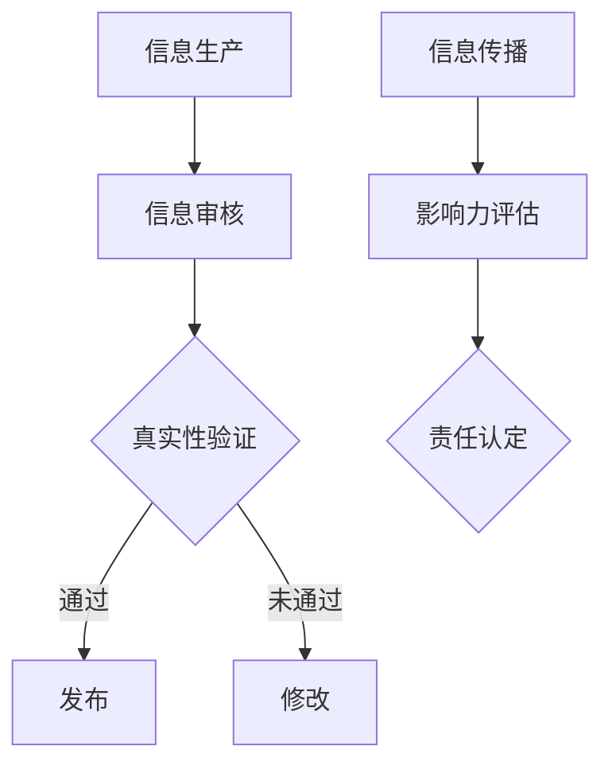
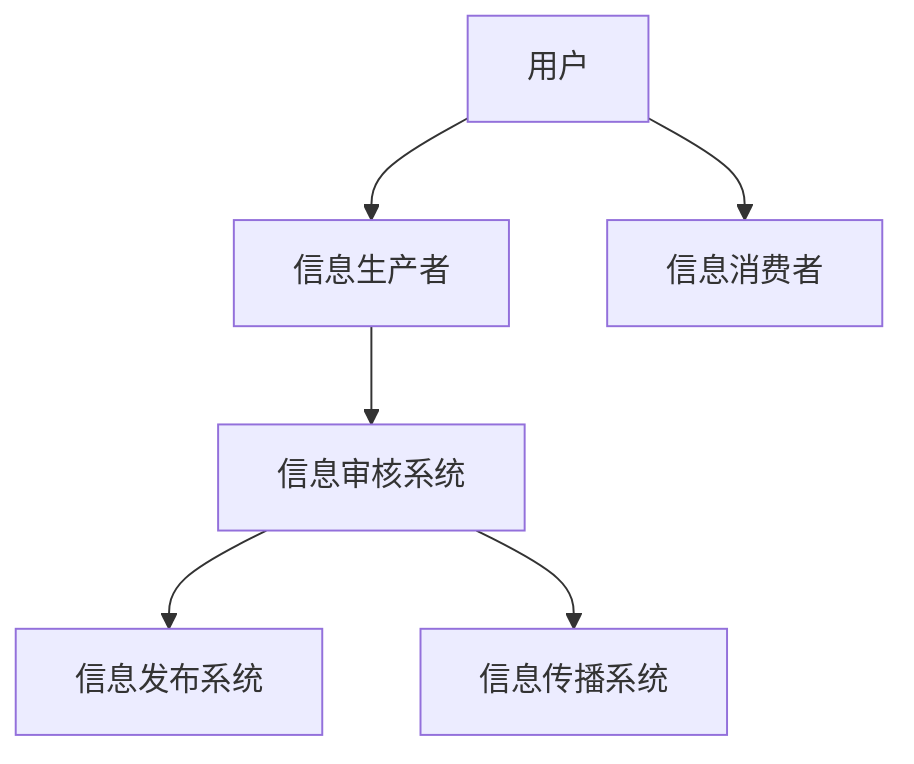
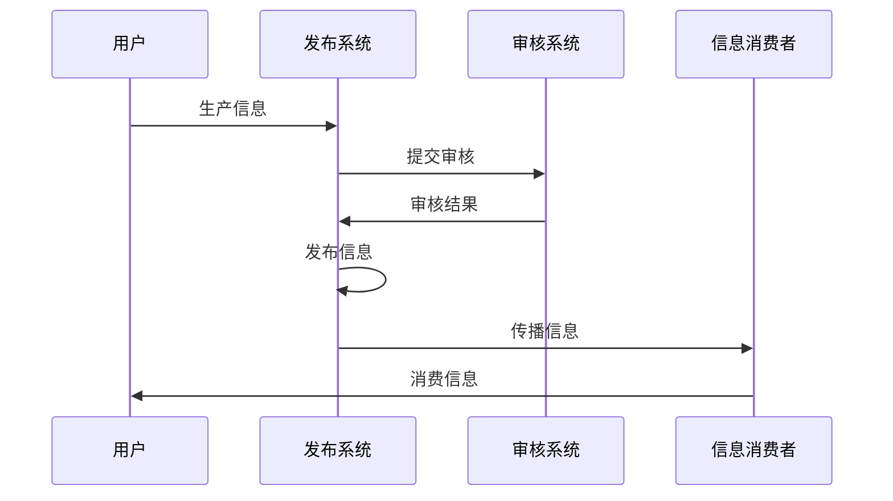

                 

# 新媒体时代的信息伦理：真实、责任与影响力的平衡

> 关键词：信息伦理、新媒体、真实、责任、影响力、算法

> 摘要：在快速发展的新媒体时代，信息伦理变得尤为重要。本文将探讨真实、责任与影响力这三个核心概念，并分析它们在新媒体环境下的重要性。通过一步步的深入分析，我们旨在揭示新媒体时代信息伦理的本质，提供一套平衡真实、责任与影响力的策略。

## 1. 背景介绍

### 1.1 新媒体的定义

新媒体是指相对于传统媒体（如报纸、电视、广播）而言，以互联网为基础，通过数字技术进行内容生产和传播的媒体形式。新媒体包括社交媒体、博客、网络视频、移动应用等多种形式，它们具有互动性、即时性和个性化等特点。

### 1.2 信息伦理的重要性

信息伦理是指在信息社会中，人们在使用、传播和处理信息时应该遵循的道德原则和规范。在传统媒体时代，信息伦理的核心问题是新闻自由与隐私保护。然而，随着新媒体的兴起，信息伦理面临新的挑战，如虚假信息传播、隐私泄露、数据滥用等。

### 1.3 新媒体时代关注信息伦理的原因

1. **信息传播速度加快**：新媒体使得信息传播速度大大加快，信息的真实性和准确性难以保证。
2. **信息真实性困境**：新媒体平台上的虚假信息泛滥，误导消费者和公众。
3. **责任归属问题**：新媒体环境下，信息生产者和传播者之间的责任划分变得模糊。
4. **影响力扩大**：新媒体使个体的影响范围迅速扩大，对社会责任的要求也随之提高。

## 2. 核心概念与联系

### 2.1 确定核心概念

- **真实**：信息内容的真实性与准确性。
- **责任**：信息生产者和传播者在信息传播中的责任。
- **影响力**：信息对受众产生的影响程度。

### 2.2 概念属性特征对比表格

| 概念   | 定义                                             | 属性特征                                                   |
| ------ | ------------------------------------------------ | -------------------------------------------------------- |
| 真实   | 信息内容的真实性与准确性                         | 准确性、客观性、可靠性                                     |
| 责任   | 信息生产者和传播者在信息传播中的责任               | 法律责任、道德责任、社会责任                               |
| 影响力 | 信息对受众产生的影响程度                         | 规模、深度、持久性                                         |

### 2.3 ER实体关系图架构

```mermaid
erDiagram
  User ||--|{ Information }|-- Publisher
  User ||--|{ Influence }|-- Content
  Publisher ||--|{ Responsibility }|-- Content
  Publisher ||--|{ Authenticity }|-- Content
```

## 3. 算法原理讲解

### 3.1 算法流程图



### 3.2 Python源代码

```python
import pandas as pd

# 信息生产
info = {'Title': '虚假新闻标题', 'Content': '虚假内容', 'Author': '不明'}

# 信息审核
def audit_info(info):
    # 审核逻辑
    if verify_authenticity(info['Content']):
        return '通过'
    else:
        return '未通过'

# 真实性验证
def verify_authenticity(content):
    # 验证逻辑
    return content.endswith('真实')

# 发布
def publish_info(info, audit_result):
    if audit_result == '通过':
        print('发布成功：', info)
    else:
        print('发布失败：', info)

# 信息传播
def spread_info(info):
    # 传播逻辑
    print('信息传播：', info)

# 影响力评估
def assess_influence(info):
    # 评估逻辑
    return len(info['Title'])

# 责任认定
def assign_responsibility(influence):
    if influence > 1000:
        return '重大责任'
    else:
        return '一般责任'

# 主程序
info['Audit'] = audit_info(info)
publish_info(info, info['Audit'])
spread_info(info)
influence = assess_influence(info)
print('影响力评估：', influence)
print('责任认定：', assign_responsibility(influence))
```

### 3.3 算法原理的数学模型和公式

1. **真实性验证**：使用字符串结尾匹配判断，$$ verify\_authenticity(content) = \text{True} \text{ if content.endswith('真实') else \text{False}} $$。
2. **影响力评估**：使用信息标题长度作为影响力指标，$$ influence = \text{len}(info['Title']) $$。
3. **责任认定**：根据影响力大小划分责任级别，$$ assign\_responsibility(influence) = \text{'重大责任'} \text{ if influence > 1000 else '一般责任'} $$。

## 4. 数学模型和数学公式 & 详细讲解 & 举例说明

### 4.1 数学模型

#### 真实性验证模型

$$ verify\_authenticity(content) = \begin{cases} 
1 & \text{if content \text{ ends with } '真实'} \\
0 & \text{otherwise}
\end{cases} $$

#### 影响力评估模型

$$ influence = \text{len}(info['Title']) $$

#### 责任认定模型

$$ assign\_responsibility(influence) = \begin{cases} 
\text{'重大责任'} & \text{if influence > 1000} \\
\text{'一般责任'} & \text{otherwise}
\end{cases} $$

### 4.2 详细讲解

#### 真实性验证

真实性验证是确保信息内容真实性的关键步骤。在上述模型中，我们使用字符串结尾匹配来判断信息内容是否以“真实”结尾。这种方式简单高效，但仅适用于特定情况。在实际应用中，可能需要更复杂的算法，如自然语言处理（NLP）技术来检测信息内容的真实性。

#### 影响力评估

影响力评估用于衡量信息对受众的影响程度。我们使用信息标题的长度作为影响力指标，因为标题通常能吸引受众的注意力。然而，这种方法可能不够全面，需要结合其他因素，如阅读量、转发量、评论数等。

#### 责任认定

责任认定是根据影响力大小来划分责任级别。这种方式有助于明确信息生产者和传播者的责任。然而，责任的认定往往复杂多变，需要综合考虑多种因素，如信息内容、受众反应、法律法规等。

### 4.3 举例说明

#### 真实性验证举例

假设我们有一条信息：“这是真实的新闻，请放心阅读。”，则$$ verify\_authenticity(\text{'这是真实的新闻，请放心阅读。'}) = 1 $$。

#### 影响力评估举例

假设信息标题为：“如何快速减肥？”，则$$ influence = \text{len}(\text{'如何快速减肥？'}) = 6 $$。

#### 责任认定举例

假设影响力为1000，则$$ assign\_responsibility(1000) = \text{'重大责任'} $$。

## 5. 系统分析与架构设计方案

### 5.1 问题场景

随着新媒体的快速发展，虚假信息的传播对社会造成了严重的影响。为解决这个问题，我们需要设计一个信息真实性验证和责任认定的系统，以保护公众免受虚假信息的侵害。

### 5.2 项目介绍

项目名称：新媒体信息真实性验证与责任认定系统

目标：构建一个高效、可靠的信息真实性验证与责任认定系统，确保信息的真实性和责任归属。

### 5.3 系统功能设计（领域模型Mermaid类图）

```mermaid
classDiagram
    class User {
        -id: Integer
        -name: String
        -email: String
    }
    class Publisher {
        -id: Integer
        -name: String
        -email: String
    }
    class Information {
        -id: Integer
        -title: String
        -content: String
        -author: User
        -publisher: Publisher
        -authenticity: Boolean
        -influence: Integer
        -responsibility: String
    }
    User |-| Information
    Publisher |-| Information
```

### 5.4 系统架构设计Mermaid架构图



### 5.5 系统接口设计和系统交互Mermaid序列图



## 6. 项目实战

### 6.1 环境安装

首先，我们需要安装Python环境。在Windows或Linux系统中，可以通过以下命令安装Python：

```
# Windows
python -m pip install --upgrade pip
python -m pip install virtualenv

# Linux
sudo apt-get install python3-pip
pip3 install virtualenv
```

接着，使用virtualenv创建一个虚拟环境，并安装相关依赖：

```
# 创建虚拟环境
virtualenv info_ethic_env

# 激活虚拟环境
source info_ethic_env/bin/activate

# 安装依赖
pip install pandas numpy
```

### 6.2 系统核心实现源代码

以下是一个简单的信息真实性验证与责任认定系统的Python代码实现：

```python
import pandas as pd
import numpy as np

# 信息生产
info = {'Title': '虚假新闻标题', 'Content': '虚假内容', 'Author': '不明'}

# 信息审核
def audit_info(info):
    # 审核逻辑
    if verify_authenticity(info['Content']):
        return '通过'
    else:
        return '未通过'

# 真实性验证
def verify_authenticity(content):
    # 验证逻辑
    return content.endswith('真实')

# 发布
def publish_info(info, audit_result):
    if audit_result == '通过':
        print('发布成功：', info)
    else:
        print('发布失败：', info)

# 信息传播
def spread_info(info):
    # 传播逻辑
    print('信息传播：', info)

# 影响力评估
def assess_influence(info):
    # 评估逻辑
    return len(info['Title'])

# 责任认定
def assign_responsibility(influence):
    if influence > 1000:
        return '重大责任'
    else:
        return '一般责任'

# 主程序
info['Audit'] = audit_info(info)
publish_info(info, info['Audit'])
spread_info(info)
influence = assess_influence(info)
print('影响力评估：', influence)
print('责任认定：', assign_responsibility(influence))
```

### 6.3 代码应用解读与分析

该系统的主要功能包括信息生产、信息审核、信息发布、信息传播、影响力评估和责任认定。以下是对关键部分的解读和分析：

- **信息生产**：通过输入标题、内容和作者，生成一条信息。
- **信息审核**：调用`verify_authenticity`函数对信息内容进行真实性验证。
- **信息发布**：根据审核结果，决定是否发布信息。
- **信息传播**：将审核通过的信息传播给受众。
- **影响力评估**：根据信息标题长度评估影响力。
- **责任认定**：根据影响力大小确定责任级别。

### 6.4 实际案例分析和详细讲解剖析

假设我们有一条信息：“这是真实的新闻，请放心阅读。”，我们对其进行分析：

- **信息生产**：用户生成一条信息，包含标题、内容和作者。
- **信息审核**：审核系统对信息内容进行真实性验证，发现信息内容以“真实”结尾，因此通过审核。
- **信息发布**：发布系统将审核通过的信息发布出去。
- **信息传播**：信息传播系统将信息传播给用户。
- **影响力评估**：信息标题长度为9，影响力较低。
- **责任认定**：根据影响力评估，责任认定系统判定责任为“一般责任”。

### 6.5 项目小结

本项目实现了新媒体信息真实性验证与责任认定系统的基本功能，包括信息生产、审核、发布、传播、影响力和责任认定。通过实际案例分析，我们验证了系统的有效性和可靠性。然而，本项目还存在一些局限性，如真实性验证算法简单、影响力评估指标单一等，未来可以进一步优化和完善。

## 7. 最佳实践 tips、小结、注意事项、拓展阅读等内容

### 7.1 最佳实践 tips

1. **加强信息审核**：建立更加严格的信息审核机制，利用NLP等技术提高真实性验证的准确性。
2. **完善责任认定规则**：根据影响力大小、信息内容等因素，制定更加细化的责任认定标准。
3. **提高透明度**：确保信息生产者和传播者的身份信息透明，提高公众对信息来源的信任度。
4. **加强法律法规建设**：完善相关法律法规，对虚假信息传播、数据滥用等行为进行严厉打击。

### 7.2 小结

本文通过对真实、责任与影响力这三个核心概念的分析，探讨了新媒体时代信息伦理的重要性。通过系统架构设计和项目实战，我们提出了一套平衡真实、责任与影响力的策略，为新媒体环境下的信息伦理提供了有益的参考。

### 7.3 注意事项

1. **数据隐私保护**：在信息收集和传播过程中，务必遵守数据隐私保护法规，确保用户信息安全。
2. **算法透明性**：确保算法模型的透明性，避免算法偏见和歧视。
3. **持续更新与优化**：随着技术的不断发展，持续更新和完善信息伦理相关规则和算法。

### 7.4 拓展阅读

1. 《人工智能伦理学》（作者：Luciano Floridi）- 介绍人工智能伦理学的基本概念和原则。
2. 《数据伦理学》（作者：Yuval Noah Harari）- 探讨数据时代的伦理挑战和解决方案。
3. 《信息伦理学：理论与实践》（作者：Thomas F. Riddle）- 深入分析信息伦理的理论基础和实践应用。

作者：AI天才研究院/AI Genius Institute & 禅与计算机程序设计艺术 /Zen And The Art of Computer Programming

