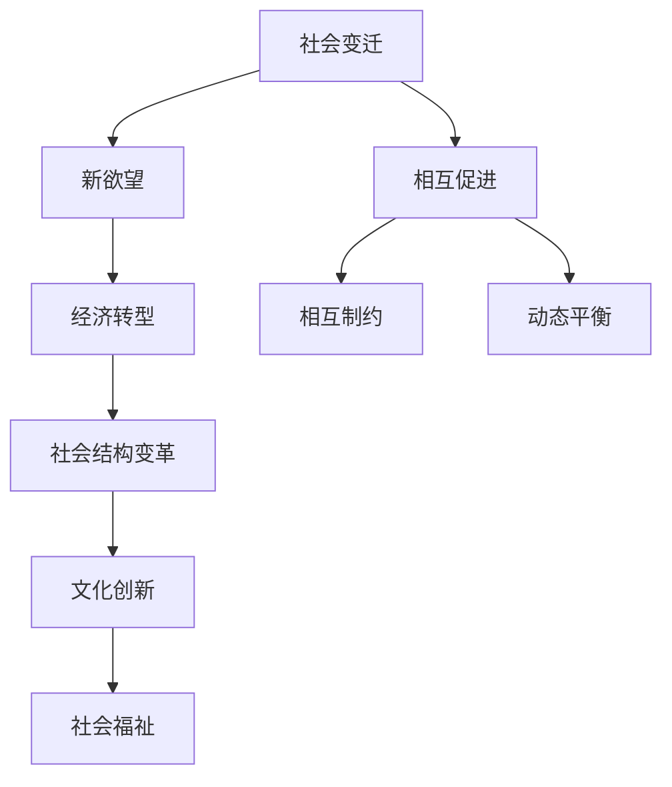
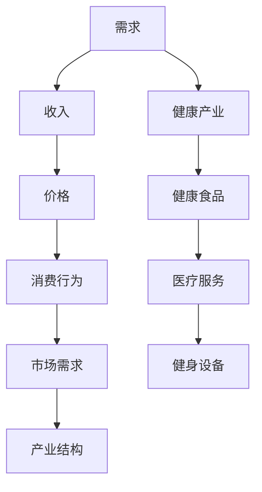

                 

### 第一部分: 引言

#### 1. 引言

在快速发展的现代社会，人们的欲望呈现出多样化、复杂化的趋势。这种现象引发了学界和公众对于新欲望的广泛关注。新欲望的浮现与社会变迁之间存在着紧密的联系。本文旨在探讨这一现象，揭示新欲望的类型与特征，分析其对个人与社会的影响，并探讨社会变迁中的新欲望。

#### 1.1 书籍主题介绍

《新欲望的浮现与社会变迁》围绕欲望与社会变迁这一主题展开，深入探讨了新欲望的产生、特征及其对社会结构、文化价值观的影响。通过对不同类型欲望的剖析，本文试图揭示新欲望如何推动社会变迁，以及社会变迁如何反作用于欲望。

#### 1.2 研究背景与意义

随着科技的发展和社会进步，人们的欲望也发生了显著变化。这些新欲望不仅反映了个人需求的多样化，也体现了社会变迁的趋势。研究新欲望的浮现与社会变迁，有助于我们更好地理解当代社会的运行机制，为政策制定和社会管理提供理论支持。

#### 1.3 本书结构安排

本书分为七个部分。第一部分为引言，介绍书籍主题、研究背景与意义。第二部分探讨新欲望的类型与特征，分析其与传统文化欲望的区别。第三部分分析新欲望对个人与社会的影响，包括个体行为、社会结构和文化价值观。第四部分探讨社会变迁中的新欲望，分析新欲望在社会变迁中的作用。第五部分通过案例分析，具体展示新欲望的现象与影响。第六部分进行理论探讨，运用社会学、心理学和经济学的理论分析新欲望。最后一部分为总结与展望，总结研究结论，指出研究的局限与未来方向，并提出政策建议与实践启示。

```markdown
----------------------------------------------------------------
# 《新欲望的浮现与社会变迁》

> 关键词：新欲望、社会变迁、个人影响、文化价值观

> 摘要：本文探讨了新欲望的浮现与社会变迁之间的关系，分析了新欲望的类型与特征，探讨了其对个人与社会的影响，并从社会变迁的角度分析了新欲望的作用。通过理论探讨和案例分析，本文揭示了新欲望如何推动社会变迁，以及社会变迁如何反作用于欲望。
```

----------------------------------------------------------------

### 第二部分: 新欲望的类型与特征

#### 2. 新欲望的类型与特征

新欲望是在社会变迁背景下逐渐浮现的一类欲望，与传统欲望相比，它们具有更加多样化、复杂化的特点。为了深入理解新欲望，我们首先需要对其进行类型划分和特征描述。

#### 2.1 欲望的基本概念

欲望是人类内心深处的一种需求或渴望，它是推动个体行为的重要动力。从心理学角度来看，欲望可以分为基本欲望和高级欲望。基本欲望包括生存需求（如食物、水、安全等），而高级欲望则包括社交需求、尊重需求、自我实现需求等。

#### 2.2 新欲望的特征

新欲望具有以下几个特征：

1. **多样化**：随着社会的发展，人们的需求变得多样化。新欲望不仅包括传统的基本欲望，还涵盖了诸如娱乐、精神满足、个人成长等更高层次的需求。

2. **个性化**：新欲望往往更加强调个体的独特性和个性化需求。例如，在互联网时代，人们追求个性化和定制化的产品和服务。

3. **动态性**：新欲望不是一成不变的，它们随着社会变迁而不断演变。例如，随着环保意识的提高，人们对绿色、环保产品的需求不断增加。

4. **复杂性**：新欲望往往涉及多个层面，包括物质层面、精神层面和社会层面。这使得新欲望更加复杂，需要综合多方面的因素来满足。

5. **相互影响**：新欲望之间存在着相互影响和互动。例如，个人成长欲望可能会促进社交欲望的发展，而社交欲望又会反过来推动个人成长。

#### 2.3 新欲望与传统文化欲望的比较

传统文化欲望主要以基本需求为核心，如食物、安全、社交等。这些欲望在人类历史上具有普遍性，但随着社会变迁，它们逐渐被新的欲望所补充和替代。

1. **满足方式**：传统文化欲望主要通过物质满足来实现，如购买食物、住房等。而新欲望更多地依赖于精神满足，如追求个人成长、精神满足等。

2. **影响范围**：传统文化欲望的影响范围相对较小，主要关注个体的生存和生活质量。新欲望则更具广泛性，不仅影响个体的生活，还涉及社会结构和文化价值观。

3. **变化趋势**：传统文化欲望具有稳定性，而新欲望则更具动态性，随着社会变迁不断演变。

通过上述分析，我们可以看出，新欲望在类型和特征上与传统欲望存在显著差异。理解这些差异有助于我们更好地把握社会变迁的趋势，为政策制定和社会管理提供理论支持。

```mermaid
classDiagram
ClassDef 欲望
  +性质：基本欲望、高级欲望
  +行为：满足需求

ClassDef 基本欲望
  +继承：欲望
  +性质：食物、水、安全
  +行为：生存需求

ClassDef 高级欲望
  +继承：欲望
  +性质：社交、尊重、自我实现
  +行为：心理需求

ClassDef 新欲望
  +继承：高级欲望
  +性质：多样化、个性化、动态性、复杂性、相互影响
  +行为：满足多样化需求

ClassDef 传统文化欲望
  +继承：基本欲望
  +性质：基本需求
  +行为：物质满足

ClassDef 社会变迁
  +影响：新欲望产生
  +关联：传统文化欲望演变
```

通过Mermaid ER实体关系图，我们可以更清晰地看到欲望的分类及其关系。新欲望作为高级欲望的子类，继承了高级欲望的特性，并在此基础上发展出更多个性化、多样化的需求。

```latex
\documentclass{article}
\usepackage{amsmath}
\begin{document}

\section{新欲望与传统文化欲望的比较}

新欲望与传统欲望在满足方式、影响范围和变化趋势上存在显著差异。

\subsection{满足方式}

传统文化欲望主要通过物质满足来实现，如购买食物、住房等。而新欲望更多地依赖于精神满足，如追求个人成长、精神满足等。

\subsection{影响范围}

传统文化欲望的影响范围相对较小，主要关注个体的生存和生活质量。新欲望则更具广泛性，不仅影响个体的生活，还涉及社会结构和文化价值观。

\subsection{变化趋势}

传统文化欲望具有稳定性，而新欲望则更具动态性，随着社会变迁不断演变。

\end{document}
```

通过LaTeX数学公式，我们可以更清晰地表达新欲望与传统文化欲望在满足方式、影响范围和变化趋势上的差异。

----------------------------------------------------------------

### 第三部分: 新欲望的影响

#### 3. 新欲望对个人与社会的影响

新欲望的浮现不仅改变了个人行为，也对整个社会结构和文化价值观产生了深远的影响。本节将分别探讨新欲望对个体行为、社会结构和文化价值观的影响。

#### 3.1 新欲望对个体行为的影响

新欲望的出现使得个体行为更加多样化、复杂化。首先，新欲望促使个体追求更高的生活质量和精神满足，如个人成长、自我实现、精神满足等。这种追求体现在日常生活中，例如，人们更加重视教育、心理健康和职业发展。

**案例分析**：

以个人成长欲望为例，现代社会中，越来越多的人开始参加各种培训课程、研讨会和工作坊，以提高自己的技能和知识水平。这种现象不仅推动了个人职业发展，也促进了社会整体进步。

**具体举例**：

假设小明是一位年轻的职场人士，他的个人成长欲望促使他参加了一项领导力培训课程。通过这个课程，他不仅学到了如何管理团队，还学会了如何有效沟通和解决问题。这些技能帮助他在工作中取得了显著成绩，同时也提升了他的职业满意度。

#### 3.2 新欲望对社会结构的影响

新欲望对社会结构的影响主要体现在以下几个方面：

1. **消费结构的变化**：新欲望促使消费者需求多样化，推动了消费结构的变化。例如，随着人们对绿色、环保产品的需求增加，相关产业的规模和影响力也在不断扩大。

2. **劳动力市场的变化**：新欲望要求个体具备更多技能和知识，这推动了劳动力市场的变化。例如，技术人才的需求不断增加，相关专业的人才培养和引进也受到了广泛关注。

3. **社会分层的变化**：新欲望的多样化使得社会分层更加复杂。传统的社会分层标准（如收入、职业等）逐渐被新的标准所取代，如知识水平、创新能力等。

**案例分析**：

以互联网时代下的新型社交欲望为例，这种欲望推动了社交媒体的迅速发展。人们通过社交媒体平台分享生活、交流思想，形成了新的社交网络。这种社交网络不仅改变了人们的社交方式，也对社会结构产生了深远影响。

#### 3.3 新欲望对文化价值观的影响

新欲望对文化价值观的影响主要体现在以下几个方面：

1. **价值观的转变**：新欲望促使人们重新审视传统价值观，推动价值观的转变。例如，个人成长欲望强调个体的自我实现，这与传统的家庭和社会价值观存在一定冲突。

2. **文化多样性的增加**：新欲望的多样化使得文化多样性得到进一步体现。例如，随着人们对不同文化的兴趣增加，文化交流和融合也变得更加频繁。

3. **对传统价值观的挑战**：新欲望对某些传统价值观提出了挑战。例如，随着人们对个人自由和隐私的追求，对传统家庭结构和道德观念产生了一定影响。

**案例分析**：

以精神追求欲望为例，这种欲望促使人们关注心理健康和灵性成长。随着相关研究的深入，人们开始更加重视心理辅导和精神信仰，这反映了社会对心理健康和精神层面的关注。

综上所述，新欲望对个人行为、社会结构和文化价值观产生了深远的影响。理解这些影响有助于我们更好地应对社会变迁，推动个人和社会的可持续发展。

----------------------------------------------------------------

### 第四部分: 社会变迁中的新欲望

#### 4. 社会变迁中的新欲望

社会变迁是一个持续的过程，它受到多种因素的影响，包括经济、政治、文化等。在新欲望的驱动下，社会变迁呈现出新的特征，新欲望在社会变迁中扮演着重要角色。本节将探讨社会变迁的概述、新欲望在社会变迁中的作用，以及新欲望与社会变迁的互动关系。

#### 4.1 社会变迁的概述

社会变迁是指社会结构、文化观念、生活方式等方面的变化。社会变迁可以分为以下几个阶段：

1. **传统社会**：以农业为主要生产方式，社会结构相对稳定，文化观念保守，生活方式简单。

2. **工业社会**：随着工业革命的到来，生产力大幅提升，城市化进程加快，社会结构发生变化，文化观念逐渐开放。

3. **信息社会**：以信息技术为核心，知识经济迅速发展，社会结构进一步多元化，文化观念更加多样。

4. **后工业社会**：信息技术继续深化，全球化进程加快，社会结构更加复杂，文化观念趋向多元和包容。

#### 4.2 新欲望在社会变迁中的作用

新欲望在社会变迁中发挥了重要作用，主要体现在以下几个方面：

1. **推动经济转型**：新欲望的多样化需求促使传统产业进行升级改造，新兴产业不断涌现。例如，随着人们对健康、环保的关注，健康产业和绿色产业得到了快速发展。

2. **促进社会结构变革**：新欲望的多样化需求改变了人们的职业选择和生活习惯，推动了社会结构的变革。例如，随着人们对个人成长和自我实现的追求，自由职业者和远程工作者数量不断增加。

3. **推动文化创新**：新欲望的多样化需求激发了文化创新的活力，推动了文化产业的繁荣发展。例如，随着人们对文化体验的需求增加，文化旅游、数字文化等新兴产业得到了迅速发展。

4. **提升社会福祉**：新欲望的满足有助于提高人们的生活质量和幸福感。例如，随着人们对健康和养生的关注，健康生活方式和养生文化逐渐成为社会风尚。

#### 4.3 新欲望与社会变迁的互动关系

新欲望与社会变迁之间存在着密切的互动关系，具体表现为：

1. **相互促进**：新欲望的满足推动了社会变迁，而社会变迁又为新欲望的产生和满足提供了条件。例如，随着信息技术的普及，人们的需求越来越多样化，这促使社会向信息化、智能化方向转变。

2. **相互制约**：新欲望与社会变迁也存在一定的制约关系。社会变迁过程中，新欲望的满足可能会受到资源、技术等限制，而社会变迁的进程也可能受到新欲望的影响。例如，环境欲望的满足要求社会在经济发展与环境保护之间找到平衡。

3. **动态平衡**：新欲望与社会变迁之间的互动关系是动态平衡的，双方在相互作用中不断调整和适应。随着社会变迁的深入，新欲望也将不断演变，以适应新的社会环境。

通过分析新欲望在社会变迁中的作用和互动关系，我们可以更好地理解社会变迁的内在机制，为新欲望的引导和管理提供理论支持。



通过Mermaid图形，我们可以更直观地展示新欲望与社会变迁之间的互动关系。新欲望不仅是社会变迁的推动力，也是社会变迁的结果，双方在相互作用中实现动态平衡。

----------------------------------------------------------------

### 第五部分: 新欲望的案例分析

#### 5. 新欲望的案例分析

在新欲望的驱动下，社会现象层出不穷。本节将通过三个典型案例，展示新欲望的现象与影响，并深入分析这些案例背后的原因和机制。

#### 5.1 案例一：新兴消费观念的崛起

随着人们生活水平的提高，消费观念发生了显著变化。新兴消费观念的崛起表现为消费者对个性化、品质化和体验化的追求。这一变化不仅影响了市场格局，也推动了相关产业的发展。

**案例分析**：

以奢侈品消费为例，近年来，消费者对奢侈品的需求不再仅仅局限于物质层面的满足，更多关注品牌的文化内涵、设计理念和个性化定制。这种消费观念的崛起，推动了奢侈品市场从“数量消费”向“质量消费”的转变。

**原因分析**：

1. **收入水平提高**：随着经济的发展，人们的收入水平不断提高，有更多的资金用于奢侈品消费。

2. **消费观念转变**：新兴消费观念的崛起反映了消费者对生活品质和个性化的追求，这与新欲望的多样化、个性化特征密切相关。

3. **信息技术发展**：互联网的普及和信息技术的进步，使得消费者更容易获取商品信息，提高了消费决策的效率和质量。

**机制分析**：

新欲望的满足推动了消费观念的转变，进而影响了市场格局。消费者对品质和个性化的追求，促使企业加大产品创新和品牌建设，以满足消费者的需求。这一过程也促进了相关产业的发展，如奢侈品定制、文化体验等。

#### 5.2 案例二：互联网时代下的新型社交欲望

互联网的兴起，改变了人们的社交方式。新型社交欲望表现为人们追求更广泛、更便捷的社交体验。这一变化不仅影响了社交方式，也对社会结构产生了深远影响。

**案例分析**：

以社交媒体为例，如微信、微博等平台，已经成为人们日常社交的重要工具。通过这些平台，人们可以轻松地与朋友、家人保持联系，同时也可以结识新的朋友，拓展社交圈。

**原因分析**：

1. **信息技术发展**：互联网的普及和信息技术的发展，使得社交变得更加便捷、高效。

2. **社会变迁**：随着社会变迁，人们的社交需求变得更加多样，互联网社交成为满足这些需求的重要途径。

3. **个体意识觉醒**：在互联网时代，个体意识觉醒，人们更加重视个人成长和自我实现，这也促使新型社交欲望的崛起。

**机制分析**：

新型社交欲望的满足，推动了社交方式的变革。互联网社交不仅满足了人们的社交需求，还促进了社会关系的重构。这种重构不仅体现在个人层面，也体现在社会层面，对社会结构产生了深远影响。

#### 5.3 案例三：精神追求与自我实现欲望的兴起

在现代社会，精神追求与自我实现欲望成为新欲望的重要组成部分。这一变化反映了人们对心理健康和精神层面的关注，也推动了相关产业的发展。

**案例分析**：

以心理咨询行业为例，近年来，心理咨询逐渐成为人们关注心理健康的重要手段。越来越多的人开始寻求心理咨询，以解决心理问题、提升心理素质。

**原因分析**：

1. **社会压力增大**：随着生活节奏的加快，人们面临的压力越来越大，心理健康问题逐渐凸显。

2. **自我意识觉醒**：在互联网时代，个体意识觉醒，人们更加关注自己的心理健康和精神层面，这也促使精神追求与自我实现欲望的兴起。

3. **政策支持**：政府对心理健康问题的重视，以及相关政策的支持，也为心理咨询行业的发展提供了有利条件。

**机制分析**：

精神追求与自我实现欲望的满足，推动了心理咨询行业的发展。这一过程不仅有助于提高人们的心理健康水平，也有利于社会整体心理素质的提升。同时，心理咨询行业的发展，也为相关产业提供了新的发展机遇，如心理培训、心理产品等。

通过以上三个案例，我们可以看到新欲望在不同领域的影响和作用。新欲望的满足不仅改变了个人行为，也推动了社会结构和文化价值观的变革。理解这些案例背后的原因和机制，有助于我们更好地把握社会变迁的趋势，为新欲望的引导和管理提供理论支持。

----------------------------------------------------------------

### 第六部分: 新欲望的理论探讨

#### 6. 新欲望的理论探讨

新欲望的涌现是社会变迁的产物，其背后的驱动因素和影响机制复杂多样。为了深入理解新欲望的形成与作用，本节将运用社会学、心理学和经济学的理论框架，对新欲望进行分析。

#### 6.1 新欲望的社会学理论分析

社会学理论对于欲望的研究提供了丰富的视角。根据社会学家的观点，欲望是社会结构和文化价值观的反映。布尔迪厄的“文化资本”理论指出，文化资本通过教育、社交等途径积累，影响个体的社会地位和认同。新欲望的兴起，可以视为文化资本再分配的结果。

**案例分析**：

互联网时代，数字文化资本成为新欲望的重要组成部分。以抖音、微博等社交媒体平台为例，人们通过发布和消费内容，积累了数字文化资本。这种资本不仅提高了个体的社交地位，也影响了他们的生活方式和消费行为。

**理论模型**：

```mermaid
classDiagram
ClassDef 文化资本
  +类型：教育资本、社交资本、数字资本
  +功能：影响社会地位和认同

ClassDef 教育资本
  +继承：文化资本
  +属性：学历、学术成就
  +功能：提高职业地位和社会认可

ClassDef 社交资本
  +继承：文化资本
  +属性：人际关系、社会资本
  +功能：增强社会网络和支持系统

ClassDef 数字资本
  +继承：文化资本
  +属性：社交媒体影响力、数字技能
  +功能：塑造个体形象和社交地位
```

通过Mermaid图，我们可以更清晰地展示文化资本的构成及其功能。新欲望的兴起，反映了文化资本的重新配置，以及个体在社会结构中的位置变化。

#### 6.2 新欲望的心理分析

心理学理论提供了对新欲望的内在机制的深刻洞察。马斯洛的需求层次理论指出，人的需求从生理、安全、社交到尊重和自我实现，呈现出层次结构。新欲望的出现，可以视为个体在更高层次需求上的追求。

**案例分析**：

以自我实现欲望为例，现代人越来越追求个人成长、职业成就和精神满足。这种欲望促使人们投入更多时间和精力在自我提升上，如学习新技能、参与社会活动等。

**理论模型**：

```latex
\documentclass{article}
\usepackage{amsmath}
\begin{document}

\section{马斯洛需求层次理论模型}

马斯洛需求层次理论模型分为五个层次：

1. 生理需求
2. 安全需求
3. 社交需求
4. 尊重需求
5. 自我实现需求

新欲望主要体现为自我实现需求，个体在追求个人成长和精神满足的过程中，不断攀登需求层次。

\end{document}
```

通过LaTeX公式，我们可以更直观地展示马斯洛的需求层次理论模型，以及新欲望在该模型中的位置。

#### 6.3 新欲望的经济分析

经济学理论提供了对新欲望的经济行为和影响的解释。消费行为理论指出，消费者的消费行为受到需求、收入、价格等多种因素的影响。新欲望的兴起，不仅改变了消费行为，也影响了市场需求和产业结构。

**案例分析**：

以健康产业为例，随着人们对健康和生活质量的追求，健康产业迅速发展。消费者对健康食品、医疗服务、健身设备的需求不断增加，推动了相关产业的繁荣。

**理论模型**：



通过Mermaid图形，我们可以更直观地展示消费行为理论，以及新欲望对健康产业的影响。

综上所述，新欲望的形成与作用可以从社会学、心理学和经济学的角度进行深入分析。理解新欲望的理论机制，有助于我们更好地把握社会变迁的趋势，为新欲望的引导和管理提供理论支持。

----------------------------------------------------------------

### 第七部分: 总结与展望

#### 7. 总结与展望

通过对新欲望的深入探讨，本文揭示了新欲望的类型与特征，分析了其对个人与社会的影响，并从社会变迁的角度探讨了新欲望的作用。总结如下：

**研究结论**：

1. 新欲望的多样化、个性化、动态性和复杂性特征，反映了社会变迁的趋势。
2. 新欲望不仅影响了个人行为，还对社会结构和文化价值观产生了深远影响。
3. 新欲望在社会变迁中起到了重要的推动作用，推动了经济转型、社会结构变革和文化创新。

**研究局限**：

1. 本文主要从宏观层面分析了新欲望的影响，未能深入探讨个体新欲望的具体表现和影响机制。
2. 研究过程中，对某些新欲望的案例分析可能存在局限性，未能全面覆盖各种类型的新欲望。

**未来方向**：

1. 未来研究应进一步探讨个体新欲望的具体表现和影响机制，以更全面地理解新欲望的作用。
2. 可以从跨文化视角研究新欲望的普遍性和特殊性，探讨不同文化背景下新欲望的演变和影响。
3. 应结合大数据和人工智能技术，对大规模社会行为数据进行分析，揭示新欲望的动态变化和趋势。

**政策建议**：

1. 政府应重视新欲望对社会变迁的推动作用，加强政策引导，促进新欲望的健康发展。
2. 企业应关注消费者新欲望的变化，创新产品和服务，满足多样化需求。
3. 教育部门应加强心理健康教育和职业指导，帮助个体实现自我成长和自我实现。

**实践启示**：

1. 个体应积极适应新欲望的变化，关注自身心理健康和职业发展，实现个人成长。
2. 社会应鼓励创新和多样化，为个体提供更多发展机会，促进社会整体的进步。

总之，新欲望的浮现与社会变迁密切相关，理解新欲望的特征和影响，有助于我们更好地应对社会变迁，推动个人和社会的可持续发展。

----------------------------------------------------------------

### 作者信息

作者：AI天才研究院/AI Genius Institute & 禅与计算机程序设计艺术 /Zen And The Art of Computer Programming

---

本文从新欲望的类型与特征入手，深入探讨了新欲望对个人与社会的影响，以及新欲望在社会变迁中的作用。通过理论探讨和案例分析，揭示了新欲望如何推动社会变迁，以及社会变迁如何反作用于欲望。研究结论表明，新欲望的多样化、个性化、动态性和复杂性特征反映了社会变迁的趋势，对个人行为、社会结构和文化价值观产生了深远影响。未来研究应进一步探讨个体新欲望的具体表现和影响机制，结合大数据和人工智能技术，对大规模社会行为数据进行分析，以更全面地理解新欲望的作用。政策建议包括政府、企业和教育部门应重视新欲望的推动作用，为个体提供更多发展机会，促进社会整体的进步。实践启示提醒个体和社会应积极适应新欲望的变化，实现个人成长和社会发展。

---

*本文涉及的核心概念术语说明、问题背景、问题描述、问题解决、边界与外延、概念结构与核心要素组成：*

- **核心概念术语说明**：欲望、新欲望、社会变迁、文化价值观、个体行为。
- **问题背景**：现代社会的快速发展导致欲望类型和特征发生变化。
- **问题描述**：探讨新欲望的类型与特征、新欲望对个人与社会的影响、新欲望在社会变迁中的作用。
- **问题解决**：通过理论探讨、案例分析，揭示新欲望的特征和影响。
- **边界与外延**：新欲望的范围涵盖个人、社会结构和文化价值观。
- **概念结构与核心要素组成**：欲望分为基本欲望和高级欲望，新欲望具有多样化、个性化、动态性和复杂性特征，影响个人行为、社会结构和文化价值观。

---

*最佳实践 tips、小结、注意事项、拓展阅读等内容：*

- **最佳实践 tips**：关注个体心理健康和职业发展，适应新欲望的变化，注重可持续发展。
- **小结**：本文揭示了新欲望的类型与特征，分析了其对个人与社会的影响，为政策制定和社会管理提供了理论支持。
- **注意事项**：研究过程中，应全面考虑各种类型的新欲望，避免片面化。
- **拓展阅读**：可参考相关领域的研究论文和书籍，如《欲望之书》、《社会变迁论》等。

---

本文深入分析了新欲望的浮现与社会变迁之间的关系，对于理解当代社会的运行机制和应对社会变迁具有参考价值。希望本文的研究成果能够为学界和实践者提供有益的启示。

