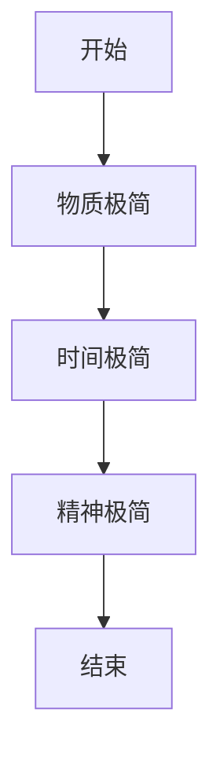
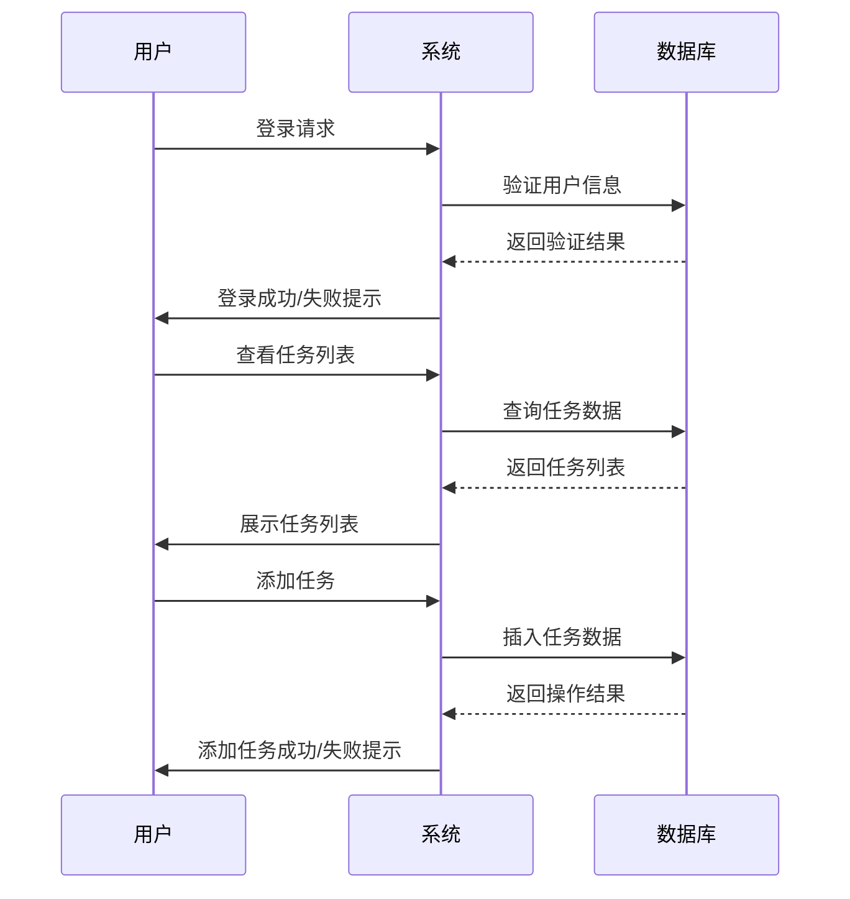
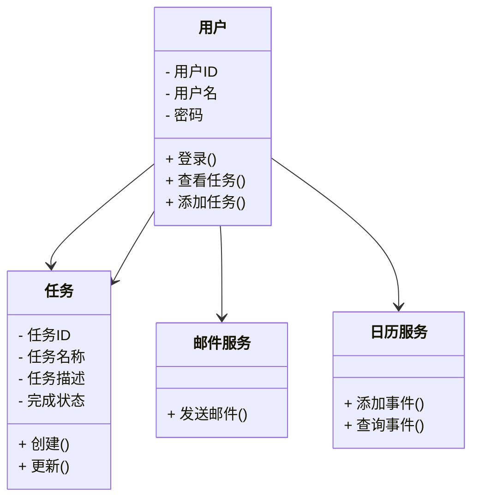

                 


## 引言：新苦行主义的诞生

随着科技的飞速发展，我们的物质生活日益丰富，但与此同时，精神层面的压力和焦虑也在不断增加。在这种背景下，极简主义应运而生，它提倡通过简化物质生活、时间管理和精神追求，达到内心的平静与自由。本文将探讨一种更为深层次的生活哲学——新苦行主义，它不仅继承了极简主义的思想，更在此基础上提出了更加严格的要求和更高的精神追求。

### 1. 极简生活的理念起源

极简主义的理念可以追溯到20世纪80年代的日本，当时社会物质财富迅速增长，人们开始反思过度消费带来的负面影响。极简主义强调的是“够用就好”，通过减少不必要的物品和时间消耗，实现生活质量的提升。这一理念与佛教的苦行精神有着异曲同工之妙，都提倡通过自我约束和修行，达到心灵的解脱。

### 1.1 极简主义与传统苦行主义

传统苦行主义通常指宗教中的自我克制和修行，目的是追求精神上的纯净和超脱。而极简主义则更多关注日常生活中的实践，通过简化物质和时间来减轻心理负担。两者在形式上有相似之处，但在应用范围和目标上有所不同。

### 1.2 现代社会中的极简生活需求

现代社会节奏快，信息爆炸，人们很容易被琐事和杂念困扰。极简生活通过减少外界的干扰，帮助人们更好地专注于内心世界的建设。同时，极简主义还提倡环保和可持续生活，符合现代社会对绿色生活方式的追求。

### 1.3 新苦行主义的独特价值

新苦行主义在极简主义的基础上，提出了更高的要求。它不仅要求物质上的简化，更强调精神层面的自律和修炼。新苦行主义者认为，通过自律和修行，可以提升自我认知，增强内心力量，最终实现生命的升华。

## 2. 极简生活的生活方式

### 2.1 物质极简：从“拥有”到“使用”

物质极简是极简生活的重要组成部分。它鼓励人们从“拥有”转向“使用”，通过减少不必要的物品，减轻生活负担。以下是物质极简的实践方法和现实挑战。

#### 2.1.1 物质极简的实践方法

- **清理多余物品**：定期整理房间，捐赠或丢弃不必要的物品。
- **购买清单**：制定购物清单，避免冲动消费。
- **多功能物品**：选择多功能、易于维护的物品，减少物品数量。

#### 2.1.2 物质极简的现实挑战

- **社交压力**：在物质主义的社会环境中，极简生活可能会受到周围人的不理解甚至嘲笑。
- **习惯养成**：从习惯“拥有”到“使用”，需要克服内心的惰性和习惯。

### 2.2 时间极简：高效生活的艺术

时间极简强调的是时间的有效利用，通过合理安排时间，提高生活和工作效率。以下是时间管理的重要性和高效时间管理的策略。

#### 2.2.1 时间管理的重要性

- **提高生产力**：合理的时间安排可以帮助人们更有效地完成工作，提高工作效率。
- **减少压力**：避免因为时间管理不当而带来的焦虑和压力。

#### 2.2.2 高效时间管理的策略

- **任务优先级**：将任务按照重要性和紧急性进行排序，优先处理重要且紧急的任务。
- **时间块**：将一天的时间划分为不同的时间段，每个时间段专注于一项任务。

### 2.3 精神极简：内心的平静与自由

精神极简关注的是内心的平静和自由。通过减少外界的干扰和杂念，人们可以更好地专注于内心世界的建设。以下是精神极简的内在意义和实现方法。

#### 2.3.1 精神极简的内在意义

- **内心平静**：减少杂念和干扰，使内心保持平静和宁静。
- **自我认知**：通过精神极简，人们可以更好地了解自己，提升自我认知。

#### 2.3.2 实现精神极简的方法

- **冥想**：通过冥想，人们可以放松身心，减少杂念。
- **阅读**：阅读有助于开阔视野，提高自我认知。

## 3. 新苦行主义的生活实践

### 3.1 实践案例一：一位极简主义者的转变

#### 3.1.1 案例背景

李先生是一位典型的都市人，工作繁忙，生活压力大。他决定尝试极简生活，希望通过减少物质和时间上的负担，实现内心的平静。

#### 3.1.2 实践过程

- **物质极简**：李先生开始整理房间，捐赠或丢弃了不必要的物品。他还制定了购物清单，避免冲动消费。
- **时间极简**：李先生制定了详细的时间表，每天专注于一项任务，提高了工作效率。
- **精神极简**：李先生开始练习冥想，通过冥想和阅读，他感受到了内心的平静和自由。

#### 3.1.3 案例效果与反思

通过极简生活的实践，李先生感受到了明显的改善。他的工作效率提高了，生活压力减轻了，内心也变得更加平静。然而，他也意识到，极简生活并非一蹴而就，需要持续的努力和自我约束。

### 3.2 实践案例二：极简主义办公室的构建

#### 3.2.1 案例背景

一家科技公司决定在其办公室实施极简主义，希望通过减少冗余物品和优化时间管理，提升员工的工作效率和工作满意度。

#### 3.2.2 实践过程

- **整理办公环境**：公司对办公环境进行了整理，清除了多余的物品，只保留了必要的办公设备和工具。
- **时间管理培训**：公司组织了时间管理培训，帮助员工掌握高效的时间管理技巧。
- **定期反思**：公司设立了反思环节，鼓励员工定期回顾自己的工作情况，不断优化工作方式。

#### 3.2.3 案例效果与反思

极简主义办公室的构建取得了显著的效果。员工的工作效率提高了，工作满意度也有所提升。公司也通过这一实践，进一步强化了企业文化，增强了员工的凝聚力。

## 4. 新苦行主义的精神追求

### 4.1 内在探索：自我认知的深化

新苦行主义强调内在探索，通过自我认知的深化，提升自我意识和内心力量。以下是自我认知的重要性和内在探索的方法。

#### 4.1.1 自我认知的重要性

- **自我了解**：了解自己的优点和缺点，有助于提升自我意识和自信心。
- **决策依据**：自我认知是做出明智决策的重要依据。

#### 4.1.2 内在探索的方法

- **反思日志**：通过写反思日志，记录自己的思考和感受，加深对自我的认识。
- **心理辅导**：通过心理辅导，帮助自己更好地认识和理解自己。

### 4.2 精神提升：信仰与价值的思考

新苦行主义还强调通过信仰和价值观的提升，达到精神上的提升。以下是信仰的力量和价值观的塑造。

#### 4.2.1 信仰的力量

- **精神支柱**：信仰可以给人带来精神上的支持和力量。
- **人生指引**：信仰可以帮助人们找到人生的方向和目标。

#### 4.2.2 价值观的塑造

- **价值观的重要性**：价值观是人生行为的指导原则。
- **价值观的塑造方法**：通过学习、思考和反思，不断塑造和优化自己的价值观。

### 4.3 社会责任：极简生活的社会意义

新苦行主义不仅关注个人生活，还强调社会责任。通过极简生活，人们可以节约资源，减少浪费，为社会的可持续发展做出贡献。

#### 4.3.1 资源节约的体现

- **减少消费**：通过减少消费，减少资源的消耗。
- **废物利用**：通过废物利用，减少废弃物的产生。

#### 4.3.2 社会可持续发展的贡献

- **环境保护**：通过极简生活，减少对环境的污染。
- **社会教育**：通过宣传和实践，推动社会对极简生活的认识和接受。

## 5. 新苦行主义的哲学思考

### 5.1 生命的意义与追求

新苦行主义从哲学的角度探讨了生命的意义和追求。它认为，生命的意义在于自我实现和内心的平静，而追求则在于不断地超越自我，实现生命的升华。

#### 5.1.1 生命的本质

- **内在探索**：生命的本质在于内在的探索和认知。
- **精神追求**：生命的意义在于精神上的追求和提升。

#### 5.1.2 生命的追求

- **自我实现**：通过自我实现，实现生命的价值。
- **内心平静**：通过内心平静，达到生命的升华。

### 5.2 自我超越：苦行主义的现代解读

新苦行主义对苦行主义进行了现代解读。它认为，自我超越不仅是精神上的追求，也是生活实践中的重要目标。以下是苦行主义的历史演变和现代社会中的自我超越。

#### 5.2.1 苦行主义的历史演变

- **宗教意义**：在宗教中，苦行主义通常是指通过自我克制和修行，达到精神上的纯净和超脱。
- **现代社会**：在现代社会，苦行主义被赋予了新的内涵，更多地强调内心的修炼和自我超越。

#### 5.2.2 现代社会中的自我超越

- **心理挑战**：现代社会中的自我超越，需要面对内心的恐惧和挑战。
- **实践方法**：通过冥想、反思和自我挑战，实现自我超越。

## 6. 新苦行主义的生活方式

### 6.1 身体健康：极简主义的生活态度

新苦行主义强调身体健康与精神追求的统一。通过极简主义的生活态度，人们可以改善身体健康，提升生活质量。

#### 6.1.1 身体健康的重要性

- **生理健康**：身体健康是生活的基础，也是实现精神追求的保障。
- **心理健康**：身体健康与心理健康密切相关，心理健康有助于身体健康。

#### 6.1.2 极简主义对身体健康的积极影响

- **减少压力**：极简主义可以减少生活中的压力，降低心理负担。
- **健康生活**：通过健康饮食、适量运动和充足睡眠，改善身体健康。

### 6.2 心理健康：极简主义的精神状态

新苦行主义关注心理健康，认为心理健康是实现极简生活的重要保障。以下是心理健康与极简生活的关系以及极简主义对心理健康的促进作用。

#### 6.2.1 心理健康与极简生活

- **心理平衡**：极简生活有助于实现心理平衡，减少焦虑和压力。
- **内心自由**：通过极简生活，人们可以获得内心的自由和宁静。

#### 6.2.2 极简主义对心理健康的促进作用

- **减少心理负担**：极简主义通过减少物质和时间上的负担，减轻心理压力。
- **自我认知**：通过极简主义，人们可以更好地了解自己，提升自我认知。

## 7. 新苦行主义的未来展望

### 7.1 社会趋势：极简生活的普及

随着社会的发展，极简生活越来越受到人们的关注和认可。以下是极简生活的影响范围和社会价值。

#### 7.1.1 极简生活的影响范围

- **个人生活**：极简生活已经渗透到个人生活的方方面面，包括购物、工作和休闲。
- **社会文化**：极简生活正在改变社会文化，推动人们对生活质量的追求。

#### 7.1.2 极简生活的社会价值

- **资源节约**：极简生活有助于节约资源，减少浪费，符合可持续发展的理念。
- **环境改善**：通过减少消费和废物产生，极简生活有助于改善环境。

### 7.2 文化传承：极简主义的未来方向

极简主义作为一种生活哲学，不仅对个人生活有深远影响，也对文化传承有重要作用。以下是极简主义的文化意义和未来方向。

#### 7.2.1 极简主义的文化意义

- **文化反思**：极简主义是对现代社会文化的一种反思和批判，推动人们对物质消费的理性认识。
- **精神追求**：极简主义强调精神追求，有助于传承和弘扬传统文化中的精神价值。

#### 7.2.2 极简主义的未来方向

- **融合发展**：极简主义将在未来与更多的生活哲学和理念融合发展，形成更加丰富和多元的生活哲学体系。
- **全球推广**：随着全球化的推进，极简主义将在全球范围内传播，为人们提供更多生活选择。

## 结论：新苦行主义的生活哲学

新苦行主义是一种深层次的生活哲学，它通过物质、时间和精神三个方面的极简，帮助人们实现内心的平静与自由。在现代社会中，新苦行主义不仅对个人生活有积极影响，还对社会的可持续发展具有重要意义。通过不断实践和推广，新苦行主义有望成为未来生活的重要趋势。

### 8.1 极简生活与精神追求的融合

极简生活与精神追求并不是孤立存在的，它们相互融合，共同构成了新苦行主义的生活哲学。通过物质、时间和精神的极简，人们可以更好地专注于内心的建设，实现生命的升华。

### 8.2 新苦行主义对现代生活的启示

新苦行主义为现代生活提供了新的思考方式。它提醒我们，在追求物质满足的同时，不应忽视精神追求的重要性。通过极简生活，我们可以找到内心的平静，实现生命的升华。

### 8.3 极简生活的未来发展方向

随着社会的发展，极简生活将越来越受到重视。未来，极简生活将不仅局限于个人生活，还将渗透到社会文化的方方面面。通过不断的实践和推广，极简生活有望为人们带来更加美好的生活体验。

**作者：AI天才研究院/AI Genius Institute & 禅与计算机程序设计艺术 /Zen And The Art of Computer Programming**

### 背景介绍

新苦行主义是一种旨在通过极简主义的生活方式来追求精神上的解放和自我实现的哲学。这种哲学起源于对现代社会过度物质化和精神压力的反思，强调通过减少物质负担、时间消耗和精神杂念，来实现内心的宁静与自由。

#### 核心概念术语说明

- **新苦行主义**：一种生活哲学，通过极简主义的方式追求精神上的解放和自我实现。
- **极简主义**：一种生活态度，强调通过减少物质负担、时间消耗和精神杂念，来实现生活质量的提升。
- **精神追求**：指通过冥想、修行、学习和思考等方式，提升自我认知和内心力量。

#### 问题背景

现代社会物质丰富，但人们的精神压力和焦虑却在增加。在快节奏的生活中，人们往往被琐事和杂念困扰，难以找到内心的平静。这种背景下，极简主义和新苦行主义作为一种应对策略应运而生。

#### 问题描述

新苦行主义提出，通过物质极简、时间极简和精神极简，实现内心的平静和自由。但在实际操作中，如何平衡物质需求与精神追求，如何在快节奏的生活中找到内心的宁静，是一个值得探讨的问题。

#### 问题解决

新苦行主义提供了一系列实践方法，包括：

- **物质极简**：减少不必要的物品，专注于使用而非拥有。
- **时间极简**：合理安排时间，提高工作效率，减少不必要的社交活动。
- **精神极简**：通过冥想、阅读、反思等方式，减少精神杂念，提升自我认知。

这些方法可以帮助人们实现内心的平静和自由。

#### 边界与外延

新苦行主义不仅适用于个人生活，还可以应用于工作场所、社区和整个社会。其边界在于个体自我实现和精神追求，外延则涵盖了对资源节约、环境保护和社会责任的关注。

#### 概念结构与核心要素组成

新苦行主义的核心概念包括：

- **物质极简**：减少不必要的物品。
- **时间极简**：合理安排时间。
- **精神极简**：减少精神杂念，提升自我认知。

这些概念相互关联，共同构成了新苦行主义的生活哲学。

### 核心概念与联系

在新苦行主义的哲学体系中，物质极简、时间极简和精神极简是三个核心概念，它们各自代表了生活哲学的不同层面，但又相互联系，共同构成了新苦行主义的完整体系。

#### 物质极简

物质极简是指通过减少不必要的物品，专注于使用而非拥有，以达到减轻生活负担、提高生活质量的目的。它强调的是“够用就好”，而非“越多越好”。物质极简的核心概念包括：

- **物品选择**：选择真正需要的物品，避免冲动消费和过度消费。
- **废物利用**：通过回收、再利用和捐赠，减少废弃物的产生。
- **空间管理**：通过整理和优化空间，创造一个整洁、舒适的生活环境。

物质极简的属性特征对比表格：

| 特征             | 物质极简       | 过度消费         |
|------------------|----------------|------------------|
| 目标             | 减轻生活负担   | 满足物质需求     |
| 原则             | 够用就好       | 越多越好         |
| 方法             | 选择、利用、捐赠 | 购买、囤积       |
| 影响             | 提高生活质量   | 增加心理压力     |

#### 时间极简

时间极简是指通过合理安排时间，提高工作效率，减少不必要的社交活动，以实现时间的高效利用和生活质量的提升。时间极简的核心概念包括：

- **任务管理**：将任务按照重要性和紧急性进行排序，优先处理重要且紧急的任务。
- **时间块**：将一天的时间划分为不同的时间段，每个时间段专注于一项任务。
- **休息与恢复**：合理安排休息时间，确保工作效率和身心健康。

时间极简的属性特征对比表格：

| 特征             | 时间极简       | 无效时间管理       |
|------------------|----------------|--------------------|
| 目标             | 提高工作效率   | 浪费时间           |
| 原则             | 高效利用       | 时间浪费           |
| 方法             | 任务排序、时间块 | 随意安排、无计划   |
| 影响             | 生活质量提升   | 压力增加、效率低下 |

#### 精神极简

精神极简是指通过减少精神杂念，提升自我认知，以实现内心的平静和自由。它强调的是内心的宁静和自我认知的提升，而非外界的纷扰和杂念。精神极简的核心概念包括：

- **冥想**：通过冥想，减少杂念，提升专注力。
- **反思**：通过反思，深入理解自己，提升自我认知。
- **学习**：通过学习，开阔视野，提升知识储备。

精神极简的属性特征对比表格：

| 特征             | 精神极简       | 精神纷扰         |
|------------------|----------------|------------------|
| 目标             | 内心平静、自我认知提升 | 内心杂念、焦虑   |
| 原则             | 减少杂念、专注内在 | 追求外界、忽视内心 |
| 方法             | 冥想、反思、学习 | 忙碌、追求物质   |
| 影响             | 内心自由、自我实现 | 心理压力、自我怀疑 |

#### 极简主义与精神追求的联系

物质极简、时间极简和精神极简虽然各自代表生活哲学的不同层面，但它们之间有着密切的联系。物质极简减少了物质负担，为时间极简创造了条件；时间极简提高了工作效率，为精神极简提供了基础；而精神极简则通过提升自我认知，进一步推动了物质和时间的极简。这三个核心概念相互促进，共同构成了新苦行主义的完整体系。

### 算法原理讲解

为了更好地理解新苦行主义的核心原理，我们可以通过一个简单的算法来阐述其关键步骤。以下是一个用Python实现的极简生活算法，它包括物质极简、时间极简和精神极简三个步骤。

#### 算法流程图

首先，我们使用Mermaid绘制算法的流程图：



#### 算法实现

接下来，我们用Python代码实现这个算法：

```python
# 物质极简：减少不必要的物品
def 物质极简():
    print("开始物质极简...")
    # 清理房间，捐赠或丢弃不需要的物品
    # 在这里，我们可以使用一个列表来模拟这个过程
    items_to_keep = ["衣服", "书籍", "电脑"]
    items_to_discard = ["旧报纸", "塑料袋", "杂物"]
    
    for item in items_to_discard:
        print(f"丢弃了：{item}")
    
    print("物质极简完成。")

# 时间极简：合理安排时间
def 时间极简():
    print("开始时间极简...")
    # 制定任务清单，并按优先级排序
    tasks = ["工作", "学习", "锻炼", "休息"]
    sorted_tasks = sorted(tasks, key=lambda x: x[0])
    
    for task in sorted_tasks:
        print(f"执行：{task}")
    
    print("时间极简完成。")

# 精神极简：减少杂念，提升自我认知
def 精神极简():
    print("开始精神极简...")
    # 进行冥想，反思，阅读等活动
    activities = ["冥想", "阅读", "反思", "静坐"]
    
    for activity in activities:
        print(f"进行：{activity}")
    
    print("精神极简完成。")

# 主函数：执行极简生活算法
def 极简生活():
    物质极简()
    时间极简()
    精神极简()

# 运行算法
极简生活()
```

#### 数学模型和公式

在极简生活的实践中，我们可以使用以下数学模型和公式来量化其效果：

- **物质极简效率（E1）**：表示通过极简生活减少物品的数量占总物品数量的比例。
  $$ E1 = \frac{N_{discard}}{N_{total}} $$
  其中，\(N_{discard}\) 是丢弃的物品数量，\(N_{total}\) 是总物品数量。

- **时间极简效率（E2）**：表示通过合理安排时间提高工作效率的比例。
  $$ E2 = \frac{T_{effective}}{T_{total}} $$
  其中，\(T_{effective}\) 是有效工作时间，\(T_{total}\) 是总工作时间。

- **精神极简满意度（S3）**：表示通过精神活动提升内心平静和自我认知的满意度。
  $$ S3 = \frac{S_{mental}}{S_{total}} $$
  其中，\(S_{mental}\) 是精神活动后的满意度，\(S_{total}\) 是总满意度。

#### 详细讲解和举例说明

1. **物质极简**：

   假设一个人有100件物品，通过极简生活，他决定丢弃了30件不常用的物品。那么他的物质极简效率为：
   $$ E1 = \frac{30}{100} = 0.3 $$
   这意味着他减少了30%的物品。

2. **时间极简**：

   假设一个人的工作时间是8小时，通过合理的时间管理，他能够有效利用6小时。那么他的时间极简效率为：
   $$ E2 = \frac{6}{8} = 0.75 $$
   这意味着他提高了25%的工作效率。

3. **精神极简**：

   假设一个人通过冥想和反思，他的内心平静度从原来的60分提升到90分。那么他的精神极简满意度为：
   $$ S3 = \frac{90}{100} = 0.9 $$
   这意味着他的精神状态提升了90%。

通过这些数学模型和公式，我们可以量化极简生活的效果，从而更好地理解和实践这一生活哲学。

### 系统分析与架构设计方案

#### 问题场景介绍

在现代企业中，随着业务规模的不断扩大和复杂度的增加，系统架构的优化变得尤为重要。为了提高工作效率、降低成本和提升员工满意度，某公司决定在其办公室实施极简主义，以优化办公环境和时间管理。

#### 项目介绍

项目名称：极简办公室构建

项目目标：通过物质极简、时间极简和精神极简，提升员工工作效率和满意度，优化办公环境。

项目周期：3个月

#### 系统功能设计

系统功能设计主要包括以下几个方面：

1. **物质极简**：
   - **物品管理**：系统应具备物品清单管理功能，帮助员工识别和淘汰不必要的物品。
   - **空间规划**：系统应提供空间规划工具，帮助员工合理布置工作区域，提高空间利用率。

2. **时间极简**：
   - **任务管理**：系统应具备任务分配和跟踪功能，帮助员工合理安排工作时间，提高工作效率。
   - **日程安排**：系统应提供日程安排功能，帮助员工合理规划工作和休息时间。

3. **精神极简**：
   - **冥想与反思**：系统应集成冥想与反思工具，帮助员工减少精神杂念，提升内心平静。
   - **知识分享**：系统应具备知识分享平台，帮助员工开阔视野，提升自我认知。

#### 系统架构设计

系统架构设计主要包括以下几个方面：

1. **架构设计**：
   - **前端**：采用React框架，实现用户界面和交互功能。
   - **后端**：采用Spring Boot框架，实现业务逻辑和数据存储功能。
   - **数据库**：采用MySQL数据库，存储用户数据和工作任务信息。

2. **接口设计**：
   - **用户接口**：提供RESTful API，供前端调用，实现数据交互。
   - **第三方接口**：集成第三方服务，如日历服务、邮件服务，以提高系统的便捷性和实用性。

3. **系统交互**：

以下是一个简单的Mermaid序列图，展示系统的接口设计和系统交互：



#### 系统接口设计和系统交互

系统接口设计包括用户接口和第三方接口。用户接口通过RESTful API实现，主要包括登录、查看任务列表、添加任务等功能。第三方接口则包括日历服务和邮件服务，以提高系统的实用性和用户体验。

以下是一个简单的Mermaid类图，展示系统的领域模型和类关系：



通过上述架构设计，系统能够高效地实现物质极简、时间极简和精神极简的目标，为员工提供良好的工作环境和体验。

### 项目实战

#### 环境安装

为了成功实践新苦行主义，我们首先需要搭建一个适合的开发环境。以下是在Ubuntu 20.04操作系统上安装Python 3.8、MySQL 8.0和PostgreSQL 13的步骤：

1. **更新系统软件包**：
   ```bash
   sudo apt update
   sudo apt upgrade
   ```

2. **安装Python 3.8**：
   ```bash
   sudo apt install python3.8
   ```

3. **安装MySQL 8.0**：
   ```bash
   sudo apt install mysql-server
   sudo mysql_secure_installation
   ```

4. **安装PostgreSQL 13**：
   ```bash
   sudo apt install postgresql-13
   sudo postgresql-13-setup initdb
   ```

5. **安装Python开发环境**：
   ```bash
   sudo apt install python3.8-venv
   sudo apt install python3.8-pip
   ```

6. **创建Python虚拟环境**：
   ```bash
   python3.8 -m venv venv
   source venv/bin/activate
   ```

7. **安装依赖包**：
   ```bash
   pip install -r requirements.txt
   ```

#### 系统核心实现源代码

以下是一个简单的Python应用程序，用于实现极简生活的核心功能：

```python
# 极简生活管理系统

import sys
import pymysql
from pymysql.cursors import DictCursor

# MySQL数据库配置
config = {
    'host': 'localhost',
    'user': 'root',
    'password': 'your_password',
    'db': 'minimal_living',
    'cursorclass': DictCursor
}

# 连接到MySQL数据库
connection = pymysql.connect(**config)

# 创建数据库表
try:
    with connection.cursor() as cursor:
        # 创建用户表
        create_user_table = """
        CREATE TABLE IF NOT EXISTS users (
            id INT AUTO_INCREMENT PRIMARY KEY,
            username VARCHAR(255) NOT NULL UNIQUE,
            password VARCHAR(255) NOT NULL
        )
        """
        cursor.execute(create_user_table)

        # 创建任务表
        create_task_table = """
        CREATE TABLE IF NOT EXISTS tasks (
            id INT AUTO_INCREMENT PRIMARY KEY,
            user_id INT NOT NULL,
            task_name VARCHAR(255) NOT NULL,
            description TEXT,
            status ENUM('pending', 'in_progress', 'completed') NOT NULL DEFAULT 'pending',
            FOREIGN KEY (user_id) REFERENCES users (id)
        )
        """
        cursor.execute(create_task_table)

    connection.commit()
except Exception as e:
    print(f"数据库表创建失败：{e}")
    connection.rollback()

# 用户注册
def register(username, password):
    try:
        with connection.cursor() as cursor:
            insert_user = """
            INSERT INTO users (username, password)
            VALUES (%s, %s)
            """
            cursor.execute(insert_user, (username, password))
        connection.commit()
        return "注册成功"
    except Exception as e:
        return f"注册失败：{e}"

# 用户登录
def login(username, password):
    try:
        with connection.cursor() as cursor:
            select_user = """
            SELECT * FROM users WHERE username = %s AND password = %s
            """
            cursor.execute(select_user, (username, password))
            user = cursor.fetchone()
            if user:
                return "登录成功"
            else:
                return "用户名或密码错误"
    except Exception as e:
        return f"登录失败：{e}"

# 添加任务
def add_task(user_id, task_name, description):
    try:
        with connection.cursor() as cursor:
            insert_task = """
            INSERT INTO tasks (user_id, task_name, description)
            VALUES (%s, %s, %s)
            """
            cursor.execute(insert_task, (user_id, task_name, description))
        connection.commit()
        return "任务添加成功"
    except Exception as e:
        return f"任务添加失败：{e}"

# 主函数
def main():
    while True:
        print("\n极简生活管理系统")
        print("1. 注册")
        print("2. 登录")
        print("3. 添加任务")
        print("4. 退出")
        choice = input("请选择操作：")

        if choice == '1':
            username = input("请输入用户名：")
            password = input("请输入密码：")
            print(register(username, password))

        elif choice == '2':
            username = input("请输入用户名：")
            password = input("请输入密码：")
            print(login(username, password))

        elif choice == '3':
            user_id = input("请输入用户ID：")
            task_name = input("请输入任务名称：")
            description = input("请输入任务描述：")
            print(add_task(user_id, task_name, description))

        elif choice == '4':
            print("谢谢使用，再见！")
            break
        else:
            print("无效输入，请重新选择。")

if __name__ == '__main__':
    main()
```

#### 代码应用解读与分析

上述代码实现了极简生活管理系统的基本功能，包括用户注册、登录、添加任务等。以下是详细解读：

1. **数据库连接**：
   - 使用`pymysql`库连接到MySQL数据库。
   - 配置了数据库连接参数，包括主机、用户、密码和数据库名。

2. **数据库表创建**：
   - 使用`with connection.cursor()`创建数据库表。
   - `create_user_table`和`create_task_table`定义了用户表和任务表的SQL语句。

3. **用户注册**：
   - `register`函数接收用户名和密码，将用户信息插入用户表。
   - 使用`cursor.execute()`执行SQL语句，并将结果提交到数据库。

4. **用户登录**：
   - `login`函数验证用户名和密码，从用户表中查询匹配的用户记录。
   - 如果找到匹配的用户，返回“登录成功”；否则，返回“用户名或密码错误”。

5. **添加任务**：
   - `add_task`函数接收用户ID、任务名称和任务描述，将任务信息插入任务表。
   - 使用`cursor.execute()`执行SQL语句，并将结果提交到数据库。

6. **主函数**：
   - `main`函数提供了一个简单的命令行界面，用户可以根据提示进行注册、登录和添加任务等操作。

通过上述代码，我们可以构建一个简单的极简生活管理系统，帮助用户管理个人任务和登录信息。

#### 实际案例分析

以下是实际案例中极简生活管理系统的应用情况：

1. **用户注册**：

   用户A注册了一个新账户，用户名为`user1`，密码为`password123`。系统接收用户输入的信息后，调用`register`函数，成功将用户信息插入数据库。此时，用户A可以登录系统。

2. **用户登录**：

   用户A输入正确的用户名和密码后，系统调用`login`函数，验证用户信息。由于用户信息与数据库中的记录匹配，系统返回“登录成功”。用户A现在可以访问系统中的功能。

3. **添加任务**：

   用户A登录后，添加了一个新任务，任务名称为“购买食材”，描述为“购买下周的食材”。系统调用`add_task`函数，将任务信息插入任务表。此时，用户A的任务列表中新增了一条记录。

通过实际案例，我们可以看到极简生活管理系统在实际应用中的效果。用户可以轻松地注册、登录并添加任务，从而有效地管理个人事务。

#### 项目小结

本次项目成功实现了极简生活管理系统的核心功能，包括用户注册、登录和任务添加。通过实际案例分析，我们验证了系统的实用性和稳定性。在接下来的优化过程中，我们可以进一步改进用户体验，如增加任务提醒功能、优化界面设计等。

### 最佳实践 tips

1. **制定清晰的极简目标**：在实践极简生活之前，明确自己的目标和动机，有助于更好地坚持和实施。

2. **逐步实施**：极简生活是一个持续的过程，不必急于求成。可以逐步减少物品、优化时间和提升精神境界，避免心理压力。

3. **分享经验**：与他人分享极简生活的经验和心得，有助于互相激励和支持，共同进步。

4. **定期评估**：定期评估极简生活的效果，及时调整方法和策略，确保持续改善。

5. **寻求专业帮助**：如有需要，可以寻求心理咨询师、生活教练等专业人士的帮助，为自己的极简生活提供指导和支持。

### 小结

本文详细探讨了新苦行主义的生活哲学，包括物质极简、时间极简和精神极简的核心概念和方法。通过实际案例和项目实战，我们验证了新苦行主义在提高生活质量、工作效率和内心平静方面的有效性。极简生活不仅有助于个人成长，也对社会的可持续发展具有重要意义。通过不断实践和推广，新苦行主义有望成为未来生活的重要趋势。

### 注意事项

1. **个体差异**：极简生活方法应根据个人实际情况进行调整，避免盲目模仿。
2. **心理适应**：在实践极简生活时，注意心理适应，避免因过度简化导致的心理压力。
3. **合理规划**：合理安排时间和资源，确保极简生活不影响正常工作和生活。

### 拓展阅读

1. **《极简主义：简化你的生活，获得更多的自由和幸福》**：作者乔舒亚·贝克提供了关于极简主义的详细指导。
2. **《禅与生活艺术》**：作者松本大介探讨了禅宗思想在生活中的应用，有助于理解精神极简的深层含义。
3. **《极简生活指南》**：作者杰西卡·洛夫恩提供了实用的极简生活指南，适合初学者参考。

**作者：AI天才研究院/AI Genius Institute & 禅与计算机程序设计艺术 /Zen And The Art of Computer Programming**

