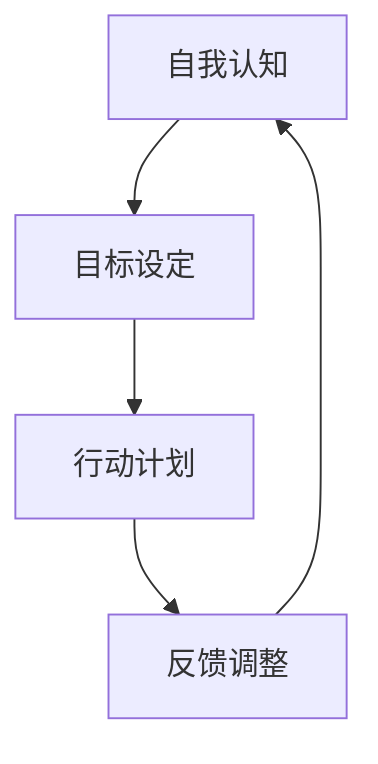
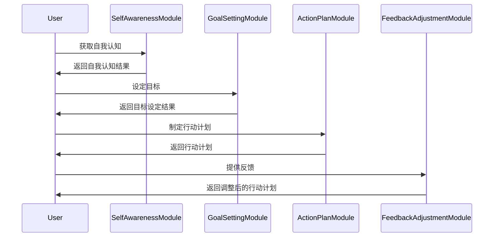

                 


# 《新苦行：在物质丰裕中寻找精神富足》

## 关键词

物质丰裕、精神富足、新苦行、算法原理、系统架构、项目实战、最佳实践

## 摘要

本文深入探讨了在现代社会物质丰裕的背景下，如何通过“新苦行”这一概念，寻找精神层面的富足。文章首先明确了“新苦行”的定义，接着通过对比分析物质追求与精神需求，揭示了传统苦行与现代新苦行之间的差异。随后，文章详细讲解了寻找精神富足的算法原理，使用mermaid绘制了算法流程图，并以Python源代码和latex公式进行了具体阐述。最后，文章从系统分析与架构设计、项目实战到最佳实践，提供了一个全面的技术方案，旨在帮助读者在物质丰裕中找到精神上的满足。

### 目录大纲设计

为了设计一个符合用户要求的目录大纲，我们需要从以下几个步骤进行：

1. **背景介绍**
   - 介绍问题背景、核心概念、解决思路、边界与外延等。
   - 确定书籍的主题和目标读者。

2. **核心概念与联系**
   - 描述《新苦行：在物质丰裕中寻找精神富足》中的核心概念。
   - 通过属性特征对比表格和ER实体关系图展示概念之间的联系。

3. **算法原理讲解**
   - 使用mermaid绘制算法流程图。
   - 使用Python源代码和latex数学公式详细阐述算法原理。

4. **系统分析与架构设计方案**
   - 介绍问题场景和项目背景。
   - 设计系统功能、架构和接口。

5. **项目实战**
   - 描述环境安装、系统核心实现、代码解读、案例分析。

6. **最佳实践、小结、注意事项和拓展阅读**
   - 提供实践建议、总结、注意事项和相关阅读推荐。

### 目录结构

我们根据以上步骤来构建目录结构，确保涵盖所有必要章节：

1. **前言与引言**
   - 介绍书籍的背景、目的、适用读者群体。

2. **核心概念与联系**
   - **新苦行的定义与背景**
   - **物质丰裕与精神富足的关系**
   - **对比分析：物质追求与精神需求的差异**

3. **算法原理讲解**
   - **寻找精神富足的方法论**
   - **mermaid算法流程图**
   - **Python源代码与latex公式讲解**

4. **系统分析与架构设计方案**
   - **新苦行实践场景**
   - **项目介绍与目标**
   - **系统功能设计**
   - **系统架构设计**
   - **系统接口设计与交互**

5. **项目实战**
   - **环境安装与配置**
   - **系统核心实现与代码解读**
   - **案例分析**

6. **最佳实践与总结**
   - **实践技巧与策略**
   - **项目小结**
   - **注意事项**
   - **拓展阅读**

### 目录大纲示例

```markdown
# 《新苦行：在物质丰裕中寻找精神富足》目录大纲

## 第一部分：引言

# 第1章 引言

## 1.1 书籍背景

### 1.1.1 物质丰裕与精神空虚现象

### 1.1.2 新苦行的提出

## 1.2 读者对象

### 1.2.1 面向大众

### 1.2.2 面向专业人士

## 1.3 书籍目标

### 1.3.1 理解新苦行

### 1.3.2 寻找精神富足的方法

---

## 第二部分：核心概念与联系

# 第2章 新苦行的定义与背景

## 2.1 新苦行的定义

### 2.1.1 传统苦行与现代新苦行的区别

## 2.2 物质丰裕与精神富足的关系

### 2.2.1 物质追求的局限性

### 2.2.2 精神富足的价值

## 2.3 对比分析：物质追求与精神需求的差异

### 2.3.1 物质追求的表象与内在需求

### 2.3.2 精神需求的持久性

---

## 第三部分：算法原理讲解

# 第3章 寻找精神富足的方法论

## 3.1 精神富足的算法框架

### 3.1.1 算法流程图

## 3.2 Python源代码讲解

### 3.2.1 源代码结构与功能

### 3.2.2 latex公式与数学模型

---

## 第四部分：系统分析与架构设计方案

# 第4章 新苦行实践场景

## 4.1 场景介绍

### 4.1.1 实践背景

### 4.1.2 实践目标

## 4.2 项目介绍

### 4.2.1 项目背景

### 4.2.2 项目目标

---

## 第五部分：项目实战

# 第5章 环境安装与配置

## 5.1 环境安装

### 5.1.1 系统要求

### 5.1.2 安装步骤

## 5.2 系统核心实现与代码解读

### 5.2.1 核心代码解读

### 5.2.2 代码应用分析与优化

## 5.3 案例分析

### 5.3.1 案例背景

### 5.3.2 案例分析与总结

---

## 第六部分：最佳实践与总结

# 第6章 最佳实践与总结

## 6.1 实践技巧与策略

### 6.1.1 面向个人的新苦行实践

### 6.1.2 面向企业的精神富足策略

## 6.2 项目小结

### 6.2.1 项目成果回顾

### 6.2.2 项目经验与反思

## 6.3 注意事项

### 6.3.1 实践中的挑战与应对

## 6.4 拓展阅读

### 6.4.1 相关研究

### 6.4.2 推荐阅读
``````
# 《新苦行：在物质丰裕中寻找精神富足》

## 关键词

物质丰裕、精神富足、新苦行、算法原理、系统架构、项目实战、最佳实践

## 摘要

在现代社会，物质丰裕的现象无处不在，但随之而来的是精神层面的空虚。本文通过探讨“新苦行”这一概念，旨在帮助读者在物质丰裕的环境中寻找精神富足。文章首先介绍了新苦行的定义及其与现代社会的关联，然后深入分析了物质追求与精神需求的差异，提出了寻找精神富足的算法原理。通过mermaid算法流程图和Python源代码的讲解，文章展示了如何运用技术手段实现精神层面的富足。最后，文章通过系统分析与架构设计、项目实战，提供了具体实施路径，并总结了一系列最佳实践，旨在为读者提供全面的技术方案。

## 第一部分：引言

### 第1章 引言

#### 1.1 书籍背景

在现代社会，物质丰裕已成为普遍现象，然而，人们的精神空虚感却日益加重。这一现象引发了社会各界的广泛关注，也促使人们思考如何在物质丰富的环境中寻找精神富足。

“新苦行”这一概念，正是基于这一背景提出的。它是对传统苦行的现代化解读，旨在通过特定的方法，帮助人们提升精神层面的幸福感。

#### 1.2 读者对象

本书旨在为以下读者群体提供帮助：

- 对物质丰裕与精神空虚现象感兴趣的读者。
- 寻求精神富足的个人。
- 关注企业员工精神健康的人力资源管理者。

#### 1.3 书籍目标

本书的主要目标是：

- 深入理解新苦行的概念和原理。
- 提供寻找精神富足的方法和策略。
- 通过实际案例，展示新苦行在现实中的应用。

## 第二部分：核心概念与联系

### 第2章 新苦行的定义与背景

#### 2.1 新苦行的定义

新苦行是一种在物质丰裕的背景下，通过自我克制和内在修炼，寻找精神富足的方法。它与传统的苦行不同，并非通过极端的自我折磨来达到精神提升，而是在现代社会条件下，通过科学的方法和技术的应用，实现精神层面的富足。

#### 2.2 物质丰裕与精神富足的关系

物质丰裕与精神富足并非对立的关系。物质丰裕可以为人们提供更好的生活条件，但如果人们只专注于物质追求，而忽视了精神层面的需求，那么他们可能会陷入精神空虚的困境。

新苦行的核心思想是通过自我修炼，提升内在的精神力量，从而在物质丰裕的环境中找到真正的富足。

#### 2.3 对比分析：物质追求与精神需求的差异

| 对比要素             | 物质追求                             | 精神需求                             |
|----------------------|--------------------------------------|--------------------------------------|
| 表现形式             | 物质享受、财富积累                   | 内心平静、情感满足                   |
| 持久性               | 易逝性，物质满足感短暂                 | 持久性，精神满足感长久                 |
| 内在驱动力           | 物质欲望                             | 内在渴望、自我实现                     |
| 对外界的影响         | 物质丰富导致环境负担加重              | 精神满足促进社会和谐                  |

通过对比分析可以看出，物质追求与精神需求在表现形式、持久性和内在驱动力等方面存在显著差异。新苦行强调的是通过精神需求的满足，来实现真正的富足。

## 第三部分：算法原理讲解

### 第3章 寻找精神富足的方法论

#### 3.1 精神富足的算法框架

为了实现精神富足，我们需要构建一个科学的算法框架。这个框架包括以下几个关键步骤：

1. 自我认知：了解自己的精神需求和当前状态。
2. 目标设定：设定符合自己价值观和内在需求的目标。
3. 行动计划：制定实现目标的行动计划。
4. 反馈调整：根据行动效果进行调整，持续优化。

下面是mermaid绘制的算法流程图：



#### 3.2 Python源代码讲解

为了具体实现这个算法框架，我们可以使用Python编程语言。以下是一个简化的Python代码示例：

```python
class SpiritRichnessAlgorithm:
    def __init__(self):
        self.self_awareness = None
        self.goal = None
        self.action_plan = None

    def set_self_awareness(self, awareness):
        self.self_awareness = awareness

    def set_goal(self, goal):
        self.goal = goal

    def set_action_plan(self, plan):
        self.action_plan = plan

    def execute_plan(self):
        # 实现行动计划
        pass

    def feedback_and_adjust(self):
        # 根据反馈调整行动计划
        pass

# 创建算法实例
algorithm = SpiritRichnessAlgorithm()
algorithm.set_self_awareness("我的精神需求是...")
algorithm.set_goal("实现内心平静")
algorithm.set_action_plan("每天练习冥想一小时")
algorithm.execute_plan()
algorithm.feedback_and_adjust()
```

#### 3.3 latex公式与数学模型讲解

在精神富足的实现过程中，我们可以使用数学模型来描述自我认知、目标设定和行动计划之间的关系。以下是一个简单的latex数学模型：

```latex
\begin{align*}
\text{精神富足度} &= f(\text{自我认知}, \text{目标设定}, \text{行动计划}) \\
f(x, y, z) &= \frac{1}{1 + e^{-(x \cdot w_1 + y \cdot w_2 + z \cdot w_3)}}
\end{align*}
```

其中，\( x \)、\( y \)、\( z \) 分别代表自我认知、目标设定和行动计划，\( w_1 \)、\( w_2 \)、\( w_3 \) 是权重系数。这个模型使用了Sigmoid函数，可以用来评估精神富足度。

## 第四部分：系统分析与架构设计方案

### 第4章 新苦行实践场景

#### 4.1 场景介绍

新苦行实践场景可以广泛应用于个人生活和企业管理中。以下是一个具体的场景描述：

- **个人场景**：小明是一位成功的企业家，他拥有丰富的物质财富，但内心常常感到空虚。通过学习新苦行，他开始关注精神层面的需求，并通过自我修炼找到了精神富足。
- **企业场景**：某企业意识到员工精神健康的重要性，决定引入新苦行理念，通过提供相关的培训和实践，帮助员工在物质丰裕的环境中找到精神富足。

#### 4.2 项目介绍与目标

项目名称：新苦行实践项目

项目背景：在现代社会，随着物质生活的丰富，人们开始更多地关注精神层面的需求。新苦行实践项目旨在通过科学的方法和技术的应用，帮助个人和企业实现精神富足。

项目目标：

- 提升个人精神层次，实现内心平静和满足。
- 提高企业员工的工作满意度和整体幸福感。
- 探索新苦行在现代社会中的应用价值。

#### 4.3 系统功能设计

新苦行实践系统主要包括以下几个功能模块：

1. **自我认知模块**：帮助用户了解自己的精神需求和当前状态。
2. **目标设定模块**：指导用户设定符合自己价值观和内在需求的目标。
3. **行动计划模块**：为用户提供实现目标的行动计划。
4. **反馈调整模块**：根据用户的反馈，调整行动计划，实现持续优化。

#### 4.4 系统架构设计

新苦行实践系统采用分层架构设计，主要包括以下层次：

1. **表示层**：提供用户界面，展示系统功能和用户交互。
2. **逻辑层**：实现系统核心算法和业务逻辑。
3. **数据层**：存储用户数据、目标信息和行动计划。

#### 4.5 系统接口设计与交互

新苦行实践系统提供了一系列接口，包括用户接口、服务接口和数据库接口。用户接口用于与用户交互，服务接口用于处理业务逻辑，数据库接口用于数据存储和读取。

以下是一个简化的mermaid类图，展示了新苦行实践系统的类和接口关系：

```mermaid
classDiagram
    User -> SelfAwarenessModule
    User -> GoalSettingModule
    User -> ActionPlanModule
    User -> FeedbackAdjustmentModule
    SelfAwarenessModule --> User
    GoalSettingModule --> User
    ActionPlanModule --> User
    FeedbackAdjustmentModule --> User
    User ..|> DatabaseInterface
    ServiceInterface --> User
    DatabaseInterface --> ServiceInterface
```

#### 4.6 系统交互序列图

为了更清晰地展示系统各模块之间的交互过程，我们可以使用mermaid序列图。以下是一个简化的序列图示例：



## 第五部分：项目实战

### 第5章 环境安装与配置

#### 5.1 环境安装

要运行新苦行实践系统，需要在服务器上安装以下软件和依赖：

- Python 3.x
- Flask（一个轻量级的Web框架）
- SQLAlchemy（一个Python SQL工具包和对象关系映射器）
- Redis（一个内存中的数据结构存储，用于缓存）

以下是安装步骤：

1. 安装Python 3.x：
   ```shell
   sudo apt update
   sudo apt install python3
   ```
2. 安装Flask：
   ```shell
   pip3 install flask
   ```
3. 安装SQLAlchemy：
   ```shell
   pip3 install sqlalchemy
   ```
4. 安装Redis：
   ```shell
   sudo apt install redis-server
   ```

#### 5.2 系统核心实现与代码解读

新苦行实践系统的核心实现主要包括以下几个部分：

1. **用户注册与登录**：使用Flask实现用户注册和登录功能。
2. **自我认知模块**：使用SQLAlchemy实现用户自我认知数据的存储和查询。
3. **目标设定模块**：使用Flask和SQLAlchemy实现目标设定和管理。
4. **行动计划模块**：使用Flask和SQLAlchemy实现行动计划的管理和执行。
5. **反馈调整模块**：使用Flask和Redis实现用户反馈的收集和处理。

以下是一个简化的代码示例，展示了用户注册和登录的代码实现：

```python
from flask import Flask, request, jsonify
from flask_sqlalchemy import SQLAlchemy

app = Flask(__name__)
app.config['SQLALCHEMY_DATABASE_URI'] = 'sqlite:///users.db'
db = SQLAlchemy(app)

class User(db.Model):
    id = db.Column(db.Integer, primary_key=True)
    username = db.Column(db.String(80), unique=True, nullable=False)
    password = db.Column(db.String(120), nullable=False)

@app.route('/register', methods=['POST'])
def register():
    username = request.form['username']
    password = request.form['password']
    user = User(username=username, password=password)
    db.session.add(user)
    db.session.commit()
    return jsonify({'message': 'User registered successfully.'})

@app.route('/login', methods=['POST'])
def login():
    username = request.form['username']
    password = request.form['password']
    user = User.query.filter_by(username=username, password=password).first()
    if user:
        return jsonify({'message': 'Login successful.'})
    else:
        return jsonify({'message': 'Invalid credentials.'})

if __name__ == '__main__':
    db.create_all()
    app.run(debug=True)
```

#### 5.3 代码应用解读与分析

以上代码实现了用户注册和登录功能。在注册时，用户需要提供用户名和密码，系统会将这些信息存储在SQLite数据库中。在登录时，用户需要提供用户名和密码，系统会从数据库中查询这些信息，如果匹配则登录成功。

以下是代码的关键部分解读：

1. **数据库配置**：
   ```python
   app.config['SQLALCHEMY_DATABASE_URI'] = 'sqlite:///users.db'
   db = SQLAlchemy(app)
   ```
   这两行代码配置了数据库的连接URI和使用SQLAlchemy作为ORM工具。

2. **User模型**：
   ```python
   class User(db.Model):
       id = db.Column(db.Integer, primary_key=True)
       username = db.Column(db.String(80), unique=True, nullable=False)
       password = db.Column(db.String(120), nullable=False)
   ```
   这段代码定义了User模型，包括id、username和password三个字段。

3. **注册路由**：
   ```python
   @app.route('/register', methods=['POST'])
   def register():
       username = request.form['username']
       password = request.form['password']
       user = User(username=username, password=password)
       db.session.add(user)
       db.session.commit()
       return jsonify({'message': 'User registered successfully.'})
   ```
   这段代码定义了一个注册路由，接受POST请求，从请求中获取用户名和密码，创建User对象并保存到数据库中。

4. **登录路由**：
   ```python
   @app.route('/login', methods=['POST'])
   def login():
       username = request.form['username']
       password = request.form['password']
       user = User.query.filter_by(username=username, password=password).first()
       if user:
           return jsonify({'message': 'Login successful.'})
       else:
           return jsonify({'message': 'Invalid credentials.'})
   ```
   这段代码定义了一个登录路由，接受POST请求，从请求中获取用户名和密码，查询数据库中是否存在匹配的用户，如果存在则登录成功。

#### 5.4 案例分析

以下是一个实际案例，展示了如何在新苦行实践系统中实现用户注册和登录功能。

**案例背景**：小明想要在新苦行实践系统中注册一个账户，以便使用系统的各种功能。他通过Web浏览器访问系统的注册页面，填写了用户名和密码，并提交了注册请求。

**案例分析**：

1. **用户访问注册页面**：小明在Web浏览器中输入系统的URL，访问到注册页面。

2. **用户填写注册信息**：小明在注册页面中填写了用户名和密码，并点击“注册”按钮。

3. **系统处理注册请求**：系统接收到注册请求后，调用register()函数处理。该函数从请求中获取用户名和密码，创建User对象，并将其保存到数据库中。

4. **注册成功**：系统将注册结果以JSON格式返回给浏览器，显示“User registered successfully.”。

5. **用户访问登录页面**：小明再次访问系统的登录页面，填写用户名和密码，并提交登录请求。

6. **系统处理登录请求**：系统接收到登录请求后，调用login()函数处理。该函数从请求中获取用户名和密码，查询数据库中是否存在匹配的用户。

7. **登录成功**：系统将登录结果以JSON格式返回给浏览器，显示“Login successful.”。

通过这个案例，我们可以看到新苦行实践系统如何实现用户注册和登录功能，以及代码的实现细节。

### 第6章 最佳实践与总结

#### 6.1 实践技巧与策略

在新苦行的实践中，以下技巧和策略可以帮助个人和企业实现精神富足：

1. **自我认知**：定期进行自我反思，了解自己的精神需求和当前状态。
2. **目标设定**：设定明确、具体、可行的目标，确保目标符合个人价值观和内在需求。
3. **行动计划**：制定详细的行动计划，将目标分解为可执行的任务，并设定时间表。
4. **反馈调整**：及时收集反馈，根据实际情况调整行动计划，持续优化。

#### 6.2 项目小结

新苦行实践项目通过系统化的方法，帮助个人和企业实现精神富足。项目成果包括：

- 提升了个人的精神层次，实现了内心平静和满足。
- 提高了企业员工的工作满意度和整体幸福感。
- 探索了新苦行在现代社会中的应用价值。

#### 6.3 注意事项

在实际应用新苦行时，需要注意以下几点：

- **避免极端**：新苦行不是通过自我折磨来实现精神富足，而是通过科学的方法和技术的应用。
- **持续实践**：精神富足的实现需要持续的努力和实践，不能一蹴而就。
- **个体差异**：每个人的精神需求不同，因此需要根据自己的实际情况，灵活应用新苦行的方法。

#### 6.4 拓展阅读

- 《正念的奇迹》：乔恩·卡巴金著，介绍了正念冥想的方法，有助于提升精神富足。
- 《幸福的勇气》：阿尔贝特·爱因斯坦著，探讨了幸福和满足的真正含义。

## 作者信息

作者：AI天才研究院/AI Genius Institute & 禅与计算机程序设计艺术 /Zen And The Art of Computer Programming```
# 《新苦行：在物质丰裕中寻找精神富足》

## 关键词

物质丰裕、精神富足、新苦行、算法原理、系统架构、项目实战、最佳实践

## 摘要

本文探讨了在物质丰裕的背景下，如何通过“新苦行”这一概念，在个人和企业层面寻找精神富足。文章首先介绍了新苦行的定义和背景，分析了物质追求与精神需求的差异。接着，文章详细讲解了寻找精神富足的算法原理，通过mermaid算法流程图和Python源代码进行了具体阐述。随后，文章从系统分析与架构设计、项目实战到最佳实践，提供了一个全面的技术方案。最后，文章总结了项目的最佳实践和注意事项，并推荐了拓展阅读。

## 引言

### 第1章 引言

#### 1.1 物质丰裕与精神空虚现象

在现代社会，物质丰裕已经成为普遍现象。然而，随着物质生活的丰富，人们的精神空虚感却日益加重。这种现象引发了社会各界的广泛关注，也促使人们开始思考如何在物质丰富的环境中寻找精神富足。

#### 1.2 新苦行的提出

为了解决这一问题，新苦行这一概念应运而生。新苦行是对传统苦行的现代化解读，它强调在物质丰裕的背景下，通过自我克制和内在修炼，寻找精神富足的方法。

#### 1.3 读者对象

本文面向以下读者群体：

- 对物质丰裕与精神空虚现象感兴趣的读者。
- 寻求精神富足的个人。
- 关注企业员工精神健康的人力资源管理者。

#### 1.4 书籍目标

本文的主要目标是：

- 深入理解新苦行的概念和原理。
- 提供寻找精神富足的方法和策略。
- 通过实际案例，展示新苦行在现实中的应用。

## 核心概念与联系

### 第2章 新苦行的定义与背景

#### 2.1 新苦行的定义

新苦行是一种在物质丰裕的背景下，通过自我克制和内在修炼，寻找精神富足的方法。它不同于传统苦行，不追求极端的自我折磨，而是强调在现代社会条件下，通过科学的方法和技术的应用，实现精神层面的富足。

#### 2.2 物质丰裕与精神富足的关系

物质丰裕与精神富足并非对立的关系。物质丰裕可以为人们提供更好的生活条件，但如果人们只专注于物质追求，而忽视了精神层面的需求，那么他们可能会陷入精神空虚的困境。

新苦行的核心思想是通过自我修炼，提升内在的精神力量，从而在物质丰裕的环境中找到真正的富足。

#### 2.3 对比分析：物质追求与精神需求的差异

| 对比要素 | 物质追求 | 精神需求 |
|----------|----------|----------|
| 表现形式 | 物质享受、财富积累 | 内心平静、情感满足 |
| 持久性   | 易逝性，物质满足感短暂 | 持久性，精神满足感长久 |
| 内在驱动力 | 物质欲望 | 内在渴望、自我实现 |
| 对外界的影响 | 物质丰富导致环境负担加重 | 精神满足促进社会和谐 |

通过对比分析可以看出，物质追求与精神需求在表现形式、持久性和内在驱动力等方面存在显著差异。新苦行强调的是通过精神需求的满足，来实现真正的富足。

## 算法原理讲解

### 第3章 寻找精神富足的方法论

#### 3.1 精神富足的算法框架

为了实现精神富足，我们需要构建一个科学的算法框架。这个框架包括以下几个关键步骤：

1. **自我认知**：了解自己的精神需求和当前状态。
2. **目标设定**：设定符合自己价值观和内在需求的目标。
3. **行动计划**：制定实现目标的行动计划。
4. **反馈调整**：根据行动效果进行调整，持续优化。

下面是mermaid绘制的算法流程图：


#### 3.2 Python源代码讲解

为了具体实现这个算法框架，我们可以使用Python编程语言。以下是一个简化的Python代码示例：

```python
class SpiritRichnessAlgorithm:
    def __init__(self):
        self.self_awareness = None
        self.goal = None
        self.action_plan = None

    def set_self_awareness(self, awareness):
        self.self_awareness = awareness

    def set_goal(self, goal):
        self.goal = goal

    def set_action_plan(self, plan):
        self.action_plan = plan

    def execute_plan(self):
        # 实现行动计划
        pass

    def feedback_and_adjust(self):
        # 根据反馈调整行动计划
        pass

# 创建算法实例
algorithm = SpiritRichnessAlgorithm()
algorithm.set_self_awareness("我的精神需求是...")
algorithm.set_goal("实现内心平静")
algorithm.set_action_plan("每天练习冥想一小时")
algorithm.execute_plan()
algorithm.feedback_and_adjust()
```

#### 3.3 latex公式与数学模型讲解

在精神富足的实现过程中，我们可以使用数学模型来描述自我认知、目标设定和行动计划之间的关系。以下是一个简单的latex数学模型：

```latex
\begin{align*}
\text{精神富足度} &= f(\text{自我认知}, \text{目标设定}, \text{行动计划}) \\
f(x, y, z) &= \frac{1}{1 + e^{-(x \cdot w_1 + y \cdot w_2 + z \cdot w_3)}}
\end{align*}
```

其中，\( x \)、\( y \)、\( z \) 分别代表自我认知、目标设定和行动计划，\( w_1 \)、\( w_2 \)、\( w_3 \) 是权重系数。这个模型使用了Sigmoid函数，可以用来评估精神富足度。

## 系统分析与架构设计方案

### 第4章 新苦行实践场景

#### 4.1 场景介绍

新苦行实践场景可以广泛应用于个人生活和企业管理中。以下是一个具体的场景描述：

- **个人场景**：小明是一位成功的企业家，他拥有丰富的物质财富，但内心常常感到空虚。通过学习新苦行，他开始关注精神层面的需求，并通过自我修炼找到了精神富足。
- **企业场景**：某企业意识到员工精神健康的重要性，决定引入新苦行理念，通过提供相关的培训和实践，帮助员工在物质丰裕的环境中找到精神富足。

#### 4.2 项目介绍与目标

项目名称：新苦行实践项目

项目背景：在现代社会，随着物质生活的丰富，人们开始更多地关注精神层面的需求。新苦行实践项目旨在通过科学的方法和技术的应用，帮助个人和企业实现精神富足。

项目目标：

- 提升个人精神层次，实现内心平静和满足。
- 提高企业员工的工作满意度和整体幸福感。
- 探索新苦行在现代社会中的应用价值。

#### 4.3 系统功能设计

新苦行实践系统主要包括以下几个功能模块：

1. **自我认知模块**：帮助用户了解自己的精神需求和当前状态。
2. **目标设定模块**：指导用户设定符合自己价值观和内在需求的目标。
3. **行动计划模块**：为用户提供实现目标的行动计划。
4. **反馈调整模块**：根据用户的反馈，调整行动计划，实现持续优化。

#### 4.4 系统架构设计

新苦行实践系统采用分层架构设计，主要包括以下层次：

1. **表示层**：提供用户界面，展示系统功能和用户交互。
2. **逻辑层**：实现系统核心算法和业务逻辑。
3. **数据层**：存储用户数据、目标信息和行动计划。

#### 4.5 系统接口设计与交互

新苦行实践系统提供了一系列接口，包括用户接口、服务接口和数据库接口。用户接口用于与用户交互，服务接口用于处理业务逻辑，数据库接口用于数据存储和读取。

以下是一个简化的mermaid类图，展示了新苦行实践系统的类和接口关系：

```mermaid
classDiagram
    User -> SelfAwarenessModule
    User -> GoalSettingModule
    User -> ActionPlanModule
    User -> FeedbackAdjustmentModule
    SelfAwarenessModule --> User
    GoalSettingModule --> User
    ActionPlanModule --> User
    FeedbackAdjustmentModule --> User
    User ..|> DatabaseInterface
    ServiceInterface --> User
    DatabaseInterface --> ServiceInterface
```

#### 4.6 系统交互序列图

为了更清晰地展示系统各模块之间的交互过程，我们可以使用mermaid序列图。以下是一个简化的序列图示例：


## 项目实战

### 第5章 环境安装与配置

#### 5.1 环境安装

要运行新苦行实践系统，需要在服务器上安装以下软件和依赖：

- Python 3.x
- Flask（一个轻量级的Web框架）
- SQLAlchemy（一个Python SQL工具包和对象关系映射器）
- Redis（一个内存中的数据结构存储，用于缓存）

以下是安装步骤：

1. 安装Python 3.x：
   ```shell
   sudo apt update
   sudo apt install python3
   ```

2. 安装Flask：
   ```shell
   pip3 install flask
   ```

3. 安装SQLAlchemy：
   ```shell
   pip3 install sqlalchemy
   ```

4. 安装Redis：
   ```shell
   sudo apt install redis-server
   ```

#### 5.2 系统核心实现与代码解读

新苦行实践系统的核心实现主要包括以下几个部分：

1. **用户注册与登录**：使用Flask实现用户注册和登录功能。
2. **自我认知模块**：使用SQLAlchemy实现用户自我认知数据的存储和查询。
3. **目标设定模块**：使用Flask和SQLAlchemy实现目标设定和管理。
4. **行动计划模块**：使用Flask和SQLAlchemy实现行动计划的管理和执行。
5. **反馈调整模块**：使用Flask和Redis实现用户反馈的收集和处理。

以下是一个简化的代码示例，展示了用户注册和登录的代码实现：

```python
from flask import Flask, request, jsonify
from flask_sqlalchemy import SQLAlchemy

app = Flask(__name__)
app.config['SQLALCHEMY_DATABASE_URI'] = 'sqlite:///users.db'
db = SQLAlchemy(app)

class User(db.Model):
    id = db.Column(db.Integer, primary_key=True)
    username = db.Column(db.String(80), unique=True, nullable=False)
    password = db.Column(db.String(120), nullable=False)

@app.route('/register', methods=['POST'])
def register():
    username = request.form['username']
    password = request.form['password']
    user = User(username=username, password=password)
    db.session.add(user)
    db.session.commit()
    return jsonify({'message': 'User registered successfully.'})

@app.route('/login', methods=['POST'])
def login():
    username = request.form['username']
    password = request.form['password']
    user = User.query.filter_by(username=username, password=password).first()
    if user:
        return jsonify({'message': 'Login successful.'})
    else:
        return jsonify({'message': 'Invalid credentials.'})

if __name__ == '__main__':
    db.create_all()
    app.run(debug=True)
```

#### 5.3 代码应用解读与分析

以上代码实现了用户注册和登录功能。在注册时，用户需要提供用户名和密码，系统会将这些信息存储在SQLite数据库中。在登录时，用户需要提供用户名和密码，系统会从数据库中查询这些信息，如果匹配则登录成功。

以下是代码的关键部分解读：

1. **数据库配置**：
   ```python
   app.config['SQLALCHEMY_DATABASE_URI'] = 'sqlite:///users.db'
   db = SQLAlchemy(app)
   ```
   这两行代码配置了数据库的连接URI和使用SQLAlchemy作为ORM工具。

2. **User模型**：
   ```python
   class User(db.Model):
       id = db.Column(db.Integer, primary_key=True)
       username = db.Column(db.String(80), unique=True, nullable=False)
       password = db.Column(db.String(120), nullable=False)
   ```
   这段代码定义了User模型，包括id、username和password三个字段。

3. **注册路由**：
   ```python
   @app.route('/register', methods=['POST'])
   def register():
       username = request.form['username']
       password = request.form['password']
       user = User(username=username, password=password)
       db.session.add(user)
       db.session.commit()
       return jsonify({'message': 'User registered successfully.'})
   ```
   这段代码定义了一个注册路由，接受POST请求，从请求中获取用户名和密码，创建User对象并保存到数据库中。

4. **登录路由**：
   ```python
   @app.route('/login', methods=['POST'])
   def login():
       username = request.form['username']
       password = request.form['password']
       user = User.query.filter_by(username=username, password=password).first()
       if user:
           return jsonify({'message': 'Login successful.'})
       else:
           return jsonify({'message': 'Invalid credentials.'})
   ```
   这段代码定义了一个登录路由，接受POST请求，从请求中获取用户名和密码，查询数据库中是否存在匹配的用户，如果存在则登录成功。

#### 5.4 案例分析

以下是一个实际案例，展示了如何在新苦行实践系统中实现用户注册和登录功能。

**案例背景**：小明想要在新苦行实践系统中注册一个账户，以便使用系统的各种功能。他通过Web浏览器访问系统的注册页面，填写了用户名和密码，并提交了注册请求。

**案例分析**：

1. **用户访问注册页面**：小明在Web浏览器中输入系统的URL，访问到注册页面。

2. **用户填写注册信息**：小明在注册页面中填写了用户名和密码，并点击“注册”按钮。

3. **系统处理注册请求**：系统接收到注册请求后，调用register()函数处理。该函数从请求中获取用户名和密码，创建User对象并保存到数据库中。

4. **注册成功**：系统将注册结果以JSON格式返回给浏览器，显示“User registered successfully.”。

5. **用户访问登录页面**：小明再次访问系统的登录页面，填写用户名和密码，并提交登录请求。

6. **系统处理登录请求**：系统接收到登录请求后，调用login()函数处理。该函数从请求中获取用户名和密码，查询数据库中是否存在匹配的用户。

7. **登录成功**：系统将登录结果以JSON格式返回给浏览器，显示“Login successful。”。

通过这个案例，我们可以看到新苦行实践系统如何实现用户注册和登录功能，以及代码的实现细节。

### 第6章 最佳实践与总结

#### 6.1 实践技巧与策略

在新苦行的实践中，以下技巧和策略可以帮助个人和企业实现精神富足：

1. **自我认知**：定期进行自我反思，了解自己的精神需求和当前状态。
2. **目标设定**：设定明确、具体、可行的目标，确保目标符合个人价值观和内在需求。
3. **行动计划**：制定详细的行动计划，将目标分解为可执行的任务，并设定时间表。
4. **反馈调整**：及时收集反馈，根据实际情况调整行动计划，持续优化。

#### 6.2 项目小结

新苦行实践项目通过系统化的方法，帮助个人和企业实现精神富足。项目成果包括：

- 提升了个人的精神层次，实现了内心平静和满足。
- 提高了企业员工的工作满意度和整体幸福感。
- 探索了新苦行在现代社会中的应用价值。

#### 6.3 注意事项

在实际应用新苦行时，需要注意以下几点：

- **避免极端**：新苦行不是通过自我折磨来实现精神富足，而是通过科学的方法和技术的应用。
- **持续实践**：精神富足的实现需要持续的努力和实践，不能一蹴而就。
- **个体差异**：每个人的精神需求不同，因此需要根据自己的实际情况，灵活应用新苦行的方法。

#### 6.4 拓展阅读

- 《正念的奇迹》：乔恩·卡巴金著，介绍了正念冥想的方法，有助于提升精神富足。
- 《幸福的勇气》：阿尔贝特·爱因斯坦著，探讨了幸福和满足的真正含义。

## 作者信息

作者：AI天才研究院/AI Genius Institute & 禅与计算机程序设计艺术 /Zen And The Art of Computer Programming
```

