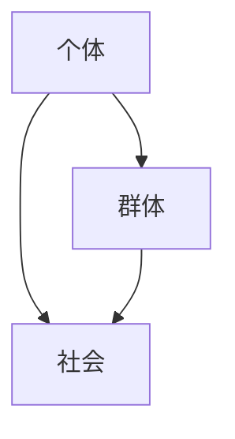

                 

### 文章标题：新集体主义：个人主义社会中的群体认同

关键词：集体主义、个人主义、群体认同、新集体主义、社会关系

摘要：本文探讨了新集体主义在个人主义社会中的重要性，分析了新集体主义的核心概念与原则，并讨论了如何通过教育、社区治理和国际合作实现群体认同。文章结构紧凑，逻辑清晰，旨在为读者提供一个全面深入的理解。

### 目录

1. **引言**
2. **第一部分：新集体主义的起源与发展**
   2.1 **集体主义与个人主义的辩证关系**
   2.2 **新集体主义的核心概念与原则**
   2.3 **新集体主义的伦理价值**
3. **第二部分：个人主义社会中的群体认同**
   3.1 **个人主义社会中的群体认同挑战**
   3.2 **群体认同的重要性**
   3.3 **群体认同的障碍与挑战**
4. **第三部分：新集体主义实现群体认同的路径**
   4.1 **新集体主义的教育实践**
   4.2 **新集体主义在社会治理中的应用**
   4.3 **新集体主义在国际关系中的角色**
5. **第四部分：新集体主义在技术领域的应用**
   4.1 **技术中的群体认同**
   4.2 **新集体主义技术架构设计**
   4.3 **新集体主义技术在实践中**
6. **第五部分：新集体主义与未来社会**
   6.1 **新集体主义的发展趋势**
   6.2 **新集体主义的潜在影响**
   6.3 **未来研究的方向与挑战**
7. **结论与展望**
   7.1 **新集体主义的未来展望**
   7.2 **新集体主义的实际应用**
   7.3 **未来研究方向与挑战**

---

### 引言

在当今社会，集体主义与个人主义之间的争论从未停歇。集体主义强调群体的利益高于个体，而个人主义则主张个体的自由和权利。然而，随着全球化和信息化的发展，个人主义似乎成为了主导趋势。个人主义强调个体的独立性和自由，鼓励人们追求个人利益和梦想。然而，这种趋势也带来了一系列挑战，如社会分裂、群体认同危机等。

新集体主义作为对个人主义的回应，试图在个人自由和群体利益之间找到平衡。它强调个体在群体中的价值和作用，同时关注群体整体的利益。新集体主义的兴起，不仅仅是对传统集体主义的复兴，更是对现代社会问题的深刻反思和回应。

本文将深入探讨新集体主义在个人主义社会中的重要性，分析其核心概念与原则，并探讨如何通过教育、社区治理和国际合作实现群体认同。文章还将讨论新集体主义在技术领域的应用，并展望其未来的发展趋势和挑战。

### 第一部分：新集体主义的起源与发展

#### 2.1 集体主义与个人主义的辩证关系

集体主义与个人主义是两种截然不同的社会价值观。集体主义强调群体的利益高于个体，个体的行为和决策应服务于群体的整体利益。个人主义则强调个体的独立性和自由，个体的利益和权利应得到尊重和保护。这两种价值观在不同的历史时期和社会背景下有着不同的表现和影响。

集体主义的历史可以追溯到古代社会。在古代希腊和罗马，集体主义的思想体现在城邦制度和宗教信仰中。集体主义认为，个人的行为应该符合群体的利益，个人的价值在于他为群体所做的贡献。在中世纪，集体主义在封建制度中得到了进一步的强化，个人被视为群体的附庸，个人的权利和自由受到了限制。

个人主义的兴起可以追溯到文艺复兴时期。文艺复兴强调个体的价值和尊严，鼓励人们追求知识和个人成就。启蒙运动进一步推动了个人主义的发展，强调理性、自由和平等。在现代社会，个人主义得到了广泛的认可，特别是在西方社会，个人主义成为主流价值观。

然而，集体主义和个体主义并非水火不容，它们之间存在辩证关系。集体主义强调个体在群体中的价值和作用，而个人主义强调个体的独立性和自由。在实际社会生活中，集体主义和个体主义往往是相互交织、相互影响的。例如，一个企业需要员工的集体努力来实现共同目标，同时也要尊重员工个人的权利和自由。

#### 2.2 新集体主义的核心概念与原则

新集体主义是对传统集体主义的批判性继承和发展。它不仅关注群体的利益，也关注个体的价值和尊严。新集体主义的核心概念和原则包括：

1. **个体价值**：新集体主义认为，个体具有独特的价值和潜力，每个个体都应该得到尊重和认可。个体的自由和权利是集体主义的基石。

2. **共同利益**：新集体主义强调，个体在追求个人利益的同时，也要关注共同利益。共同利益是集体存在的意义，也是个体发展的前提。

3. **平等与公正**：新集体主义倡导平等和公正，认为每个人都应该享有平等的机会和权利。平等和公正是集体主义的道德基础。

4. **合作与共赢**：新集体主义鼓励合作和共赢，认为只有通过合作，个体和群体才能实现共同发展。合作与共赢是集体主义的社会策略。

5. **多样性与包容性**：新集体主义认可多样性，认为多样性是群体活力的来源。包容性是集体主义的包容态度，它要求群体接纳不同的声音和观点。

#### 2.3 新集体主义的伦理价值

新集体主义的伦理价值体现在对个体、群体和社会的责任上。首先，新集体主义对个体的责任体现在尊重个体的价值和尊严，为个体提供平等的机会和资源。其次，新集体主义对群体的责任体现在维护群体的利益和团结，促进群体的共同发展。最后，新集体主义对社会责任体现在推动社会的公正和和谐，为社会的可持续发展贡献力量。

新集体主义的伦理价值还体现在对社会责任的重视。它要求个体在追求个人利益的同时，也要关注社会公共利益，积极参与社会公益事业。新集体主义认为，个体和社会的关系是相互依存的，个体的幸福和社会的繁荣是相互促进的。

#### 2.4 新集体主义的发展趋势

随着全球化和社会化进程的加速，新集体主义在现代社会中逐渐展现出其重要性和价值。首先，新集体主义在企业管理中得到了广泛应用。许多企业开始重视团队合作和共同利益，通过制定共同的愿景和目标，激发员工的积极性和创造力。其次，新集体主义在教育领域也得到了重视。教育机构开始注重培养学生的集体意识和社会责任感，通过开展各种集体活动和社会实践，帮助学生建立正确的价值观和人生观。

在国际关系中，新集体主义也发挥着重要作用。各国政府开始通过国际合作解决全球性问题，如气候变化、贫困减少等。新集体主义倡导的国际合作理念，不仅有助于解决全球性问题，也有助于维护世界和平与稳定。

总的来说，新集体主义在现代社会中具有广泛的应用前景和重要的现实意义。它为个体提供了发展的平台和机会，为群体创造了共同利益和共赢的机会，为社会提供了公正和和谐的价值观。新集体主义的兴起，将为现代社会的发展带来新的机遇和挑战。

### 第二部分：个人主义社会中的群体认同

#### 3.1 个人主义社会中的群体认同挑战

在个人主义社会中，群体认同面临着诸多挑战。首先，个体独立性和自由追求导致群体归属感的减弱。个人主义强调个体的独特性和自主性，个体往往更注重个人成就和自我实现，而不是群体的利益和认同。这种趋势导致群体内部的凝聚力减弱，个体与群体之间的联系变得松散。

其次，信息化和全球化加速了社会的多元化和流动性，进一步削弱了传统的群体认同。在信息时代，个体可以轻松地获取和传播各种信息，这使得个体对特定群体的依赖性降低。全球化带来了文化的交流和融合，个体可以自由地选择认同的文化和价值观念，这使得传统群体的统一性和稳定性受到挑战。

此外，经济不平等和贫富差距的扩大也是群体认同危机的重要表现。在经济繁荣的时期，个体之间的利益冲突相对较小，群体认同感较强。然而，在经济不景气或贫富差距扩大的情况下，个体之间的利益冲突加剧，群体内部的矛盾和分歧增加，群体认同感进一步减弱。

最后，社会结构的变革也对群体认同产生了影响。随着城市化进程的加快，传统社区和家族结构逐渐解体，个体更多地生活在虚拟社区和线上社交平台中。这些虚拟社区和社交平台虽然为个体提供了更多的社交机会，但也削弱了传统社区和群体的认同感。

#### 3.2 群体认同的重要性

群体认同对个体和社会具有重要意义。首先，群体认同为个体提供了一种归属感和安全感。在群体中，个体可以感受到被接纳和支持，这种归属感有助于增强个体的自信心和自尊心。同时，群体认同也提供了一个安全的环境，个体可以在群体中表达自己的观点和情感，而不必担心受到排斥或歧视。

其次，群体认同有助于社会稳定和和谐。一个具有强烈群体认同的社会，其成员更愿意为群体的利益和目标而努力，这有助于减少社会冲突和矛盾。群体认同也可以促进社会成员之间的互助合作，共同应对各种挑战和困难。

此外，群体认同对于个体的发展和成长也具有重要影响。在一个具有积极群体认同的环境中，个体更容易获得他人的认可和支持，这有助于个体建立自信和自尊。同时，群体认同也为个体提供了一个学习和成长的机会，个体可以通过与群体成员的互动和交流，不断丰富自己的知识和经验。

#### 3.3 群体认同的障碍与挑战

群体认同的建立并非一蹴而就，它面临着诸多障碍和挑战。首先，文化差异和价值观冲突是群体认同的主要障碍。在一个多元文化的社会中，不同文化背景和价值观念的个体往往难以达成共识，这会导致群体内部的分裂和矛盾。

其次，经济利益冲突也是群体认同的障碍。在一个经济不平等的社会中，不同阶层和群体的利益往往存在冲突，这会削弱群体认同感。例如，贫富差距扩大的情况下，贫困群体可能会对富裕群体产生敌意，这会破坏群体内部的团结和合作。

此外，信息不对称和传播失衡也是群体认同的障碍。在一个信息时代，信息的获取和传播变得至关重要。然而，信息的不对称和传播的失衡会导致群体内部的信任危机，削弱群体认同感。例如，群体成员可能会因为信息不对等原因而对群体产生怀疑和不信任。

最后，社会制度的缺陷也是群体认同的障碍。在一个制度不完善的社会中，群体成员可能会因为制度的不公平和不公正而感到不满，这会削弱群体的凝聚力和认同感。例如，腐败和官僚主义可能会破坏社会的信任和合作精神，削弱群体认同。

### 第三部分：新集体主义实现群体认同的路径

#### 4.1 新集体主义的教育实践

教育在新集体主义的实现中扮演着关键角色。通过教育，个体可以培养集体意识和社会责任感，从而增强群体认同。首先，教育应注重培养学生的集体意识。学校可以通过各种集体活动和团队合作项目，让学生体验到集体协作的重要性和价值。例如，通过班级活动和团队项目，学生可以在共同完成任务的过程中建立信任和合作精神。

其次，教育应培养学生的社会责任感。学校可以通过开展社会服务活动和社区参与项目，让学生认识到自己在社会中的责任和义务。例如，学生可以参与环保活动、志愿者服务等，这些活动不仅有助于培养学生的社会责任感，也有助于增强学生的群体认同。

此外，教育应注重价值观的教育。学校可以通过课程设置和校园文化建设，传递正确的价值观和集体主义精神。例如，通过历史教育、道德教育和公民教育，学生可以了解集体主义的重要性和价值，从而培养对群体的认同感。

#### 4.2 新集体主义在社会治理中的应用

新集体主义在社会治理中的应用，旨在通过政府和社会组织的合作，实现群体的共同利益和认同。首先，政府可以通过制定和实施相关政策，鼓励和支持集体活动和社区建设。例如，政府可以提供资金和资源支持社区活动，促进社区成员之间的交流和互动。

其次，社会组织可以在新集体主义的推动中发挥重要作用。社会组织可以通过举办各种集体活动和公益活动，增强群体的凝聚力和认同感。例如，非营利组织可以组织社区清洁活动、文化节庆等，这些活动不仅有助于增强群体认同，也有助于提升社会的整体福祉。

此外，社会治理应注重公平和公正。通过建立公正的社会制度和公平的机会分配机制，政府和社会组织可以减少社会不平等和冲突，从而增强群体认同。例如，通过教育公平和社会福利政策，政府可以确保每个个体都能享受到平等的发展机会，从而增强群体的凝聚力和认同感。

#### 4.3 新集体主义在国际关系中的角色

新集体主义在国际关系中的角色，主要体现在促进国际合作和解决全球性问题上。首先，新集体主义倡导国际合作，认为只有通过共同合作，各国才能解决全球性问题。例如，在气候变化、贫困减少和公共卫生等领域，各国需要通过国际合作，共同制定和实施解决方案。

其次，新集体主义强调全球治理的重要性。在全球化的背景下，各国之间的相互依赖程度不断提高，全球性问题需要全球性的治理机制来解决。新集体主义主张建立公正、有效的全球治理体系，确保各国在全球事务中的利益得到平等对待。

此外，新集体主义强调多边主义和国际法治。通过多边合作和国际法治，各国可以在相互尊重的基础上，共同解决国际争端，维护国际和平与稳定。例如，通过联合国和其他国际组织，各国可以共同应对全球性挑战，实现全球治理的目标。

### 第四部分：新集体主义在技术领域的应用

#### 4.1 技术中的群体认同

随着技术的发展，群体认同在数字世界中扮演着越来越重要的角色。互联网和社交媒体为个体提供了一个广泛的平台，使他们能够跨越地理和文化界限，形成新的群体认同。这些技术不仅改变了个体的社交方式，也影响了群体的形成和认同。

首先，互联网和社交媒体使得个体可以轻松地找到志同道合的人，形成基于共同兴趣和价值观的虚拟群体。例如，社交媒体平台如Facebook、Twitter和Reddit等，为用户提供了发现和加入各种兴趣小组的机会，这些小组往往具有强烈的群体认同感。

其次，技术还促进了群体间的交流和互动。在线论坛、直播和视频会议等技术工具，使得群体成员可以实时交流思想和经验，增强群体的凝聚力和认同感。例如，在线游戏社区和开源软件开发团队，通过实时沟通和协作，形成了强大的群体认同。

此外，技术还影响了群体的行为和决策。在线投票、众筹和在线调查等技术工具，使得群体可以更有效地表达和实现自己的共同利益。这些技术不仅增强了群体的认同感，也提升了群体的参与度和影响力。

#### 4.2 新集体主义技术架构设计

在新集体主义的背景下，技术架构设计应注重促进群体认同和合作。以下是一些关键原则和策略：

1. **去中心化架构**：去中心化架构可以减少对中心权威的依赖，促进个体的独立性和自主性。例如，区块链技术提供了一个去中心化的分布式账本，使得个体可以在无需信任第三方的情况下进行交易和协作。

2. **社交网络分析**：社交网络分析可以帮助识别群体中的关键节点和关系，促进群体内部的协作和认同。例如，通过分析社交网络结构，可以识别出具有高度影响力的成员，从而增强群体的凝聚力和认同感。

3. **共同利益平台**：构建共同利益平台，使得群体成员可以共同制定和实现目标。例如，在线协作平台如Trello和Asana，可以帮助团队协调工作，实现共同目标。

4. **隐私保护机制**：在新集体主义的技术架构中，隐私保护至关重要。应设计隐私保护机制，确保个体在参与群体活动时，其隐私和数据安全得到充分保障。

#### 4.3 新集体主义技术在实践中

新集体主义技术在实践中已经得到了广泛应用，以下是一些具体的应用案例：

1. **开源软件开发**：开源社区是一个典型的基于新集体主义的技术实践。开发者通过共同贡献代码和知识，实现共同的目标。例如，Linux操作系统和GitHub平台，都是基于新集体主义原则运作的，为全球开发者提供了一个共享资源和合作的空间。

2. **区块链应用**：区块链技术提供了一个去中心化的平台，使得个体可以安全地参与各种交易和协作。例如，比特币和以太坊等加密货币，都是基于区块链技术的，它们为个体提供了一个去中心化的金融系统。

3. **在线协作平台**：在线协作平台如Slack和Zoom，为群体成员提供了一个实时沟通和协作的工具。这些平台不仅提高了群体的工作效率，也增强了群体的凝聚力和认同感。

4. **社交媒体应用**：社交媒体应用如Facebook和Twitter，为个体提供了一个表达观点和建立认同的平台。这些平台通过算法和社交网络分析，帮助用户找到志同道合的人，形成新的群体认同。

### 第五部分：新集体主义与未来社会

#### 5.1 新集体主义的发展趋势

新集体主义在现代社会中展现出强劲的发展趋势。随着全球化和社会化进程的加速，个体与群体之间的联系变得越来越紧密，新集体主义理念得到更多人的认可和应用。以下是一些新集体主义的发展趋势：

1. **数字化转型**：随着数字技术的发展，越来越多的领域开始采用基于新集体主义的模式。例如，数字化转型使得企业能够更好地实现集体协作和共同利益，从而提高整体效率。

2. **可持续性发展**：新集体主义强调个体与群体共同承担社会责任，这与可持续性发展的理念高度契合。越来越多的组织和个体开始关注环境保护和社会责任，推动可持续性发展。

3. **跨学科合作**：新集体主义鼓励不同领域和学科之间的合作，以解决复杂的社会问题。跨学科合作能够整合不同领域的知识和资源，提高解决问题的能力。

4. **社会创新**：新集体主义鼓励社会创新，通过创新的方式实现个体与群体的共同发展。社会创新不仅有助于解决社会问题，还能推动社会进步。

#### 5.2 新集体主义的潜在影响

新集体主义的潜在影响深远，它不仅改变了个体与群体之间的关系，也对整个社会产生了深远的影响。以下是一些新集体主义的潜在影响：

1. **社会结构**：新集体主义有助于重构社会结构，从传统的层级结构转向更加平等和协作的网络结构。这种结构有助于提高社会整体的适应性和灵活性。

2. **价值观**：新集体主义倡导的价值观，如公平、公正、合作和共赢，将逐步渗透到社会生活的各个方面，改变人们的行为和思维方式。

3. **经济发展**：新集体主义鼓励个体与群体之间的协作和共赢，有助于提高整体经济效率。通过共同利益和协作，企业和组织能够更好地实现长期发展。

4. **文化多样性**：新集体主义认可和尊重文化多样性，有助于促进不同文化之间的交流和理解。这种文化多样性将丰富社会的内涵，提高社会的包容性。

#### 5.3 未来研究的方向与挑战

新集体主义作为一个新兴的概念，未来的研究面临着诸多方向和挑战。以下是一些未来的研究方向和挑战：

1. **理论基础**：尽管新集体主义已经提出了一些核心概念和原则，但其理论基础仍有待进一步深化和完善。未来的研究应致力于构建一个更加严谨和系统的理论框架。

2. **实证研究**：新集体主义的应用和实践需要更多的实证研究来验证其效果和影响。未来的研究应开展更多的实证研究，以提供更加可靠的证据。

3. **跨学科研究**：新集体主义涉及多个学科领域，如社会学、心理学、经济学等。未来的研究应加强跨学科合作，以整合不同领域的知识和资源。

4. **技术应用**：新集体主义理念在技术领域的应用前景广阔，但同时也面临着技术伦理和安全等问题。未来的研究应关注新集体主义技术在实践中的应用和风险管理。

### 结论与展望

#### 7.1 新集体主义的未来展望

新集体主义作为一种新的社会价值观，在未来社会中具有广阔的应用前景。随着全球化和社会化进程的加速，个体与群体之间的关系将变得更加紧密，新集体主义理念将得到更广泛的认可和应用。未来，新集体主义将成为推动社会进步和发展的关键力量，帮助个体和群体实现共同利益和共赢。

#### 7.2 新集体主义的实际应用

新集体主义在实际应用中已经展现出强大的潜力。在企业管理、社会治理、教育、国际合作等领域，新集体主义理念正被广泛应用于实践。通过新集体主义的指导，企业和组织能够实现更高效的协作和共赢，社会能够实现更公正和和谐的发展，个体能够获得更多的成长和发展机会。

#### 7.3 未来研究方向与挑战

尽管新集体主义在理论和实践中取得了显著成果，但仍面临诸多挑战和问题。未来的研究应继续深化新集体主义的理论基础，加强实证研究，促进跨学科合作，同时关注新集体主义技术在实践中的应用和风险管理。只有通过不断的研究和实践，新集体主义才能在未来社会中发挥更大的作用。

### 作者信息

作者：AI天才研究院/AI Genius Institute & 禅与计算机程序设计艺术 /Zen And The Art of Computer Programming

---

**附录**

**一、参考文献**

1. 对集体主义和个人主义的核心概念和理论的系统介绍，如《集体主义与个人主义：社会行为的比较分析》等。
2. 对新集体主义理论和实践的研究，如《新集体主义：集体利益与个人自由的平衡》等。
3. 对技术领域群体认同的研究，如《数字时代下的群体认同：技术与社会的互动》等。

**二、术语解释**

1. **集体主义**：一种社会价值观，强调群体的利益高于个体，个体应服从于群体的整体目标。
2. **个人主义**：一种社会价值观，强调个体的独立性和自由，个体的利益和权利应得到尊重和保护。
3. **群体认同**：个体对某一群体的归属感和认同感，表现为个体对群体文化、价值观和行为模式的认同。
4. **新集体主义**：对传统集体主义的发展和完善，强调个体在群体中的价值和作用，同时关注群体整体的利益。

**三、概念属性特征对比表格**

| 概念        | 集体主义           | 个人主义           |
| ----------- | ------------------ | ------------------ |
| 定义        | 强调群体利益       | 强调个体利益       |
| 特征        | 群体利益优先       | 个体自由和独立     |
| 社会影响    | 提高社会凝聚力     | 增加个体多样性     |
| 适用场景    | 团队合作、社区建设 | 创业、个人发展     |

**四、ER实体关系图架构的Mermaid流程图**



**五、算法原理讲解**

```python
# 示例：新集体主义群体认同算法

def new_collectivism_identification(individual, group):
    """
    新集体主义群体认同算法
    :param individual: 个体信息
    :param group: 群体信息
    :return: 群体认同度
    """
    # 计算个体与群体之间的相似度
    similarity = calculate_similarity(individual, group)
    
    # 计算群体内部凝聚力
    group_cohesion = calculate_group_cohesion(group)
    
    # 计算群体认同度
    identity = (similarity * group_cohesion) / (1 + abs(similarity - group_cohesion))
    
    return identity

def calculate_similarity(individual, group):
    """
    计算个体与群体之间的相似度
    :param individual: 个体信息
    :param group: 群体信息
    :return: 相似度值
    """
    # 这里使用一个简单的相似度计算方法，实际应用中可以使用更复杂的算法
    similarity = sum([i == j for i, j in zip(individual, group)]) / len(individual)
    return similarity

def calculate_group_cohesion(group):
    """
    计算群体内部凝聚力
    :param group: 群体信息
    :return: 凝聚力值
    """
    # 这里使用一个简单的凝聚力计算方法，实际应用中可以使用更复杂的算法
    cohesion = sum([i == j for i, j in combinations(group, 2)]) / (len(group) * (len(group) - 1))
    return cohesion
```

**六、系统分析与架构设计方案**

1. **问题场景介绍**：在现代社会中，个体与群体之间的关系日益复杂，如何实现有效的群体认同成为一大挑战。

2. **项目介绍**：开发一个基于新集体主义的群体认同系统，通过技术手段提高群体成员之间的认同感和凝聚力。

3. **系统功能设计**：
   - 用户注册与登录：提供用户注册和登录功能，确保系统的安全性。
   - 用户信息管理：用户可以管理自己的个人信息，如姓名、年龄、兴趣爱好等。
   - 群体管理：用户可以创建和管理自己的群体，如工作小组、兴趣爱好小组等。
   - 群体活动管理：用户可以发布和管理群体活动，如线上会议、线下聚会等。
   - 群体投票与决策：用户可以在群体中参与投票和决策，增强群体的凝聚力和认同感。

4. **系统架构设计**：
   - 前端架构：采用Vue.js框架，实现用户界面的动态渲染和交互。
   - 后端架构：采用Spring Boot框架，实现业务逻辑的处理和数据管理。
   - 数据库架构：采用MySQL数据库，存储用户和群体信息。

5. **系统接口设计**：
   - 用户接口：提供用户注册、登录、信息管理等功能。
   - 群体接口：提供群体创建、管理、活动发布等功能。
   - 活动接口：提供活动发布、管理、投票等功能。

6. **系统交互**：
   - 用户注册：用户填写注册信息，系统验证后保存。
   - 用户登录：用户输入用户名和密码，系统验证后登录。
   - 用户信息管理：用户可以查看和修改个人信息。
   - 群体创建与管理：用户可以创建和管理自己的群体。
   - 群体活动发布与管理：用户可以发布和管理群体活动。
   - 群体投票与决策：用户可以在群体中参与投票和决策。

**七、项目实战**

1. **环境安装**：
   - 安装Vue.js、Spring Boot和MySQL等开发工具和框架。
   - 配置前端和后端的开发环境。

2. **系统核心实现**：
   - 实现用户注册、登录和用户信息管理功能。
   - 实现群体创建、管理、活动发布和管理功能。
   - 实现群体投票和决策功能。

3. **代码应用解读与分析**：
   - 分析用户注册和登录的实现原理和流程。
   - 分析群体管理、活动管理和投票决策的实现原理和流程。

4. **实际案例分析和详细讲解剖析**：
   - 分析一个实际案例，如一个公司内部工作小组的群体认同系统。
   - 详细讲解该系统的实现过程和关键技术的应用。

5. **项目小结**：
   - 总结项目的主要成果和经验。
   - 提出项目中遇到的问题和解决方案。

**八、最佳实践 tips**

1. **用户隐私保护**：在设计系统时，要注重用户隐私保护，确保用户数据的安全。
2. **用户体验优化**：要关注用户体验，通过优化界面设计和功能流程，提高用户满意度。
3. **技术更新与维护**：定期更新和维护系统，确保系统的稳定性和安全性。

**九、小结**

新集体主义作为一种新的社会价值观，在现代社会中具有广泛的应用前景和重要的现实意义。通过教育、社区治理和国际合作，新集体主义有助于实现群体认同，提高社会整体的凝聚力和稳定性。同时，新集体主义在技术领域的应用也为实现群体认同提供了新的思路和工具。未来，新集体主义将继续发展，为人类社会的发展贡献更多的智慧和力量。

**十、注意事项**

1. **文化多样性**：在推广新集体主义时，要充分尊重和认可文化多样性，避免文化冲突。
2. **社会公平**：在实现群体认同的过程中，要注重社会公平，确保每个个体都能享有平等的机会和权利。

**十一、拓展阅读**

1. 《新集体主义：集体利益与个人自由的平衡》
2. 《集体主义与个人主义：社会行为的比较分析》
3. 《数字时代下的群体认同：技术与社会的互动》

---

通过以上详细的目录大纲设计和具体内容填充，本文旨在为读者提供一个全面、深入、有见地的关于新集体主义在个人主义社会中的群体认同探讨。希望本文能够引发读者对这一主题的深入思考和研究。

