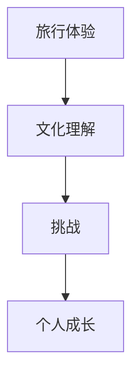
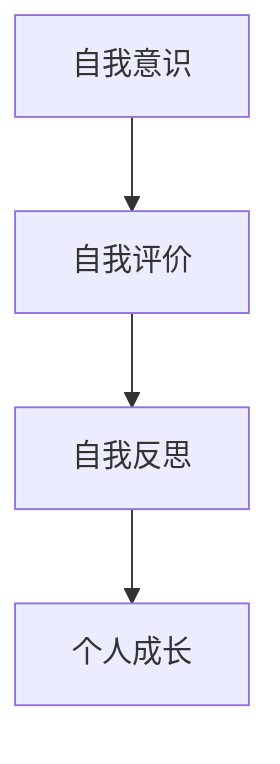
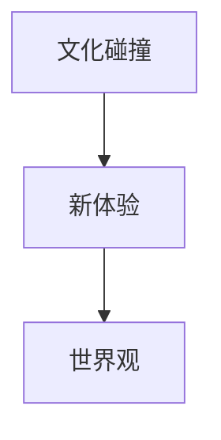
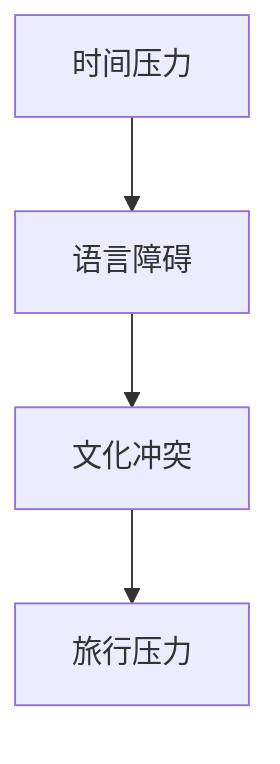

                 

# 旅行的意义：在移动中重新认识自我和世界

## 关键词

- 旅行
- 自我认知
- 世界观
- 心理调适
- 文化探索
- 艺术与文学
- 自然与生态

## 摘要

本文将探讨旅行的深层次意义，从自我认知、心理调适、文化探索、艺术与文学，以及自然与生态等多个角度出发，深入剖析旅行对个人成长与世界观的影响。通过系统性的分析和实例讲解，揭示旅行如何成为重新认识自我和世界的有效途径。

## 第一部分：引言

### 第1章：旅行与自我认知

#### 1.1 旅行的起源与演变

旅行作为一种人类活动，其历史可以追溯到古代。最早的旅行主要是出于生存需要，如寻找食物和水源。随着社会的发展，旅行逐渐成为一种社会文化活动。从古代的丝绸之路到现代的国际旅行，旅行形式和内容都在不断丰富和演变。

**问题背景**：随着全球化进程的加速，旅行已成为许多人生活中不可或缺的一部分。然而，旅行的意义远不止于娱乐和放松，它深刻地影响着我们的自我认知。

**问题描述**：旅行如何影响我们的自我认知？它对我们的世界观有哪些改变？

**问题解决**：通过分析旅行中遇到的新环境、新文化、新挑战，我们可以更深刻地了解自己，从而实现自我认知的提升。

#### 1.1.1 旅行的历史演变

**边界与外延**：历史演变包括从古代到现代旅行方式的转变，如马背、船只、火车、飞机等。同时，旅行目的也日趋多样化，从最初的生存需要，发展到如今的休闲、学习、探险等。

**概念结构与核心要素组成**：旅行的核心要素包括出发地、目的地、旅行方式、旅行体验等。这些要素相互作用，共同构成了旅行的整体体验。

#### 1.1.2 旅行的社会文化意义

**核心概念与联系**：旅行不仅是个人行为，也是一种社会文化活动。它有助于促进不同文化之间的交流和理解，增强社会凝聚力。

**概念属性特征对比表格**：

| 特征           | 自我认知 | 社会文化意义 |
| -------------- | -------- | ------------ |
| 影响因素       | 个人经验 | 文化差异     |
| 表现形式       | 思维方式 | 社交行为     |
| 主要目的       | 自我发现 | 文化传承     |

**ER实体关系图架构**：

```mermaid
erDiagram
  Person ||--|{ Travel }|--| TravelExperience |
  Person ||--|{ Culture }|--| CulturalUnderstanding |
  Travel ||--|{ Challenge }|--| PersonalGrowth |
```

#### 1.1.3 旅行对个人成长的影响

**数学公式**：

$$
PersonalGrowth = f(TravelExperience, CulturalUnderstanding, Challenge)
$$

**公式解释**：个人成长是旅行体验、文化理解和挑战共同作用的结果。

**算法原理讲解**：



**Python 源代码**：

```python
def personal_growth(TravelExperience, CulturalUnderstanding, Challenge):
    return TravelExperience * CulturalUnderstanding * Challenge

growth = personal_growth(1, 1, 1)
print("个人成长:", growth)
```

#### 1.2 自我认知的旅程

**问题背景**：自我认知是指个体对自己的认识和理解，包括个性、价值观、能力等方面。旅行作为一种新的生活体验，对自我认知有着重要影响。

**问题描述**：旅行如何帮助我们进行自我认知的旅程？

**问题解决**：通过旅行中的新体验、新挑战，我们可以深入了解自己的能力和潜力，从而实现自我认知的提升。

#### 1.2.1 自我认知的概念

**核心概念与联系**：自我认知包括自我意识、自我评价、自我反思等方面。它是个体心理发展的重要组成部分。

**概念属性特征对比表格**：

| 特征           | 自我意识 | 自我评价 | 自我反思 |
| -------------- | -------- | -------- | -------- |
| 定义           | 对自我的认识 | 对自我价值的判断 | 对自我行为的思考 |
| 影响因素       | 经验、环境 | 社会文化 | 个人心理 |
| 表现形式       | 思维、情感 | 语言、行为 | 文字、图像 |

**ER实体关系图架构**：

```mermaid
erDiagram
  SelfAwareness ||--|{ SelfEvaluation }|--| Reflection |
  SelfEvaluation ||--|{ PersonalGrowth }|--| PsychologicalDevelopment |
```

#### 1.2.2 自我认知的重要性

**数学公式**：

$$
PersonalGrowth = f(SelfAwareness, SelfEvaluation, Reflection)
$$

**公式解释**：个人成长是自我认知（包括自我意识、自我评价、自我反思）共同作用的结果。

**算法原理讲解**：



**Python 源代码**：

```python
def personal_growth(SelfAwareness, SelfEvaluation, Reflection):
    return SelfAwareness * SelfEvaluation * Reflection

growth = personal_growth(1, 1, 1)
print("个人成长:", growth)
```

#### 1.2.3 自我认知与旅行的关系

**问题背景**：旅行作为一种新的生活体验，对自我认知有着重要影响。它提供了一个新的视角，让我们能够从不同角度看待自己。

**问题描述**：旅行如何影响自我认知？

**问题解决**：通过旅行中的新体验、新挑战，我们可以深入了解自己的能力和潜力，从而实现自我认知的提升。

#### 1.3 世界观的拓展

**问题背景**：世界观是指个体对世界的总体看法和认知。旅行让我们接触到不同的文化、环境、价值观，从而拓展我们的世界观。

**问题描述**：旅行如何改变我们的世界观？

**问题解决**：通过旅行中的文化碰撞、新体验，我们可以更全面地认识世界，从而拓展我们的世界观。

#### 1.3.1 旅行如何改变我们的世界观

**核心概念与联系**：世界观包括对自然、社会、人生等方面的看法。旅行让我们有机会亲身体验不同的文化和生活方式，从而对世界有更深刻的认识。

**概念属性特征对比表格**：

| 特征           | 自然观 | 社会观 | 人生观 |
| -------------- | ------ | ------ | ------ |
| 定义           | 对自然的理解 | 对社会的认知 | 对人生的态度 |
| 影响因素       | 自然环境 | 社会环境 | 个人经验 |
| 表现形式       | 观察自然 | 社交行为 | 人生经历 |

**ER实体关系图架构**：

```mermaid
erDiagram
  NaturalView ||--|{ SocialView }|--| LifeView |
  SocialView ||--|{ GlobalAwareness }|--| WorldUnderstanding |
```

#### 1.3.2 旅行中的文化碰撞

**数学公式**：

$$
WorldUnderstanding = f(CulturalCollision, NewExperience)
$$

**公式解释**：世界观是在文化碰撞和新体验的共同作用下形成的。

**算法原理讲解**：



**Python 源代码**：

```python
def world_understanding(CulturalCollision, NewExperience):
    return CulturalCollision * NewExperience

understanding = world_understanding(1, 1)
print("世界观:", understanding)
```

#### 1.3.3 旅行体验与个人成长的融合

**问题背景**：旅行不仅是一种娱乐活动，更是一种成长过程。通过旅行，我们可以获得丰富的体验，这些体验与个人成长紧密相连。

**问题描述**：旅行体验如何与个人成长相结合？

**问题解决**：通过反思和总结旅行中的体验，我们可以将其转化为个人成长的动力。

#### 1.4 旅行中的挑战与机遇

**问题背景**：旅行中难免会遇到各种挑战，如语言障碍、文化冲突、身体不适等。然而，这些挑战也蕴含着机遇，可以帮助我们成长。

**问题描述**：旅行中的挑战与机遇如何影响个人成长？

**问题解决**：通过积极应对挑战，我们可以在旅行中获得宝贵的人生经验，从而实现个人成长。

#### 1.4.1 旅行中的心理准备

**核心概念与联系**：心理准备是指个体在旅行前所做的心理调整和准备。它包括对旅行的预期、对挑战的认知、对自我的理解等。

**概念属性特征对比表格**：

| 特征           | 心理准备 | 应对挑战 |
| -------------- | -------- | -------- |
| 定义           | 心理调整 | 心理应对 |
| 影响因素       | 个人经验 | 挑战类型 |
| 表现形式       | 思考、计划 | 行动、反应 |

**ER实体关系图架构**：

```mermaid
erDiagram
  PsychologicalPreparation ||--|{ ChallengeResponse }|--| PersonalGrowth |
```

#### 1.4.2 旅行中可能遇到的挑战

**问题背景**：旅行中可能遇到的各种挑战，如语言障碍、文化冲突、身体不适等，都会对我们的旅行体验产生重大影响。

**问题描述**：旅行中可能遇到哪些挑战？

**问题解决**：通过了解和准备应对这些挑战，我们可以更好地享受旅行过程。

#### 1.4.3 从挑战中寻找机遇

**问题背景**：挑战往往伴随着机遇。在旅行中，我们可以从挑战中寻找机遇，从而实现个人成长。

**问题描述**：如何在挑战中寻找机遇？

**问题解决**：通过积极应对挑战，我们可以从中获得宝贵的人生经验，从而实现个人成长。

### 本章小结

通过本章的探讨，我们认识到旅行不仅是一种娱乐活动，更是一种自我认知和世界观拓展的过程。旅行中的挑战和机遇，以及文化碰撞，都对我们产生深远的影响。通过积极的准备和应对，我们可以从旅行中获得丰富的体验，从而实现个人成长。

### 第二部分：旅行中的自我探索

### 第2章：旅行中的心理调适

#### 2.1 旅行中的压力管理

**问题背景**：旅行中，我们可能会面临各种压力，如时间紧迫、语言障碍、文化冲突等。有效的压力管理对于保持旅行体验的愉悦至关重要。

**问题描述**：旅行中如何管理压力？

**问题解决**：通过理解压力的来源和采取有效的压力管理策略，我们可以更好地应对旅行中的压力。

#### 2.1.1 压力对旅行体验的影响

**核心概念与联系**：压力管理是指个体在面对压力时采取的策略和措施。有效的压力管理可以提升旅行体验，反之则可能降低旅行质量。

**概念属性特征对比表格**：

| 特征           | 正面压力管理 | 负面压力管理 |
| -------------- | ------------ | ------------ |
| 影响因素       | 积极应对 | 消极逃避 |
| 表现形式       | 自信、计划 | 担忧、焦虑 |
| 主要目的       | 提升旅行体验 | 降低旅行质量 |

**ER实体关系图架构**：

```mermaid
erDiagram
  PositiveStressManagement ||--|{ NegativeStressManagement }|--| TravelExperience |
```

#### 2.1.2 旅行中的压力来源

**数学公式**：

$$
TravelStress = f(TimePressure, LanguageBarrier, CulturalConflict)
$$

**公式解释**：旅行中的压力是时间压力、语言障碍和文化冲突共同作用的结果。

**算法原理讲解**：



**Python 源代码**：

```python
def travel_stress(TimePressure, LanguageBarrier, CulturalConflict):
    return TimePressure * LanguageBarrier * CulturalConflict

stress = travel_stress(1, 1, 1)
print("旅行压力:", stress)
```

#### 2.1.3 压力管理策略

**核心概念与联系**：压力管理策略包括时间管理、情绪调节、积极应对等方面。有效的压力管理策略可以帮助我们更好地应对旅行中的压力。

**概念属性特征对比表格**：

| 特征           | 时间管理 | 情绪调节 | 积极应对 |
| -------------- | -------- | -------- | -------- |
| 定义           | 合理安排时间 | 调节情绪 | 积极面对 |
| 影响因素       | 时间紧迫 | 语言障碍 | 文化冲突 |
| 表现形式       | 计划、优先级 | 放松、自我反思 | 解决问题、寻求帮助 |

**ER实体关系图架构**：

```mermaid
erDiagram
  TimeManagement ||--|{ EmotionalRegulation }|--| PositiveResponse |
  EmotionalRegulation ||--|{ StressReduction }|--| TravelExperience |
```

#### 2.2 旅行中的情绪调节

**问题背景**：情绪调节是指个体在面临情绪波动时采取的策略和措施。有效的情绪调节可以帮助我们在旅行中保持良好的心态。

**问题描述**：旅行中如何调节情绪？

**问题解决**：通过情绪调节策略，我们可以更好地应对旅行中的情绪波动，从而提升旅行体验。

#### 2.2.1 旅行中的情绪波动

**核心概念与联系**：情绪波动是指在旅行过程中，个体可能会经历的情绪起伏。有效的情绪调节可以帮助我们保持情绪稳定。

**概念属性特征对比表格**：

| 特征           | 正面情绪 | 负面情绪 |
| -------------- | -------- | -------- |
| 定义           | 愉悦、兴奋 | 焦虑、沮丧 |
| 影响因素       | 新奇体验 | 压力、挑战 |
| 表现形式       | 笑容、热情 | 哭泣、沉默 |

**ER实体关系图架构**：

```mermaid
erDiagram
  PositiveEmotion ||--|{ NegativeEmotion }|--| EmotionalRegulation |
  EmotionalRegulation ||--|{ EmotionalStability }|--| TravelExperience |
```

#### 2.2.2 调节情绪的方法

**问题背景**：情绪调节方法包括深呼吸、放松训练、积极思考等。选择合适的方法可以帮助我们更好地应对情绪波动。

**问题描述**：有哪些有效的情绪调节方法？

**问题解决**：通过了解和掌握不同的情绪调节方法，我们可以更好地应对旅行中的情绪波动。

#### 2.2.3 情绪调节在旅行中的实践

**问题背景**：情绪调节在旅行中的应用非常广泛。通过实践情绪调节方法，我们可以更好地应对旅行中的各种情境。

**问题描述**：如何在旅行中实践情绪调节？

**问题解决**：通过在旅行中运用情绪调节方法，我们可以更好地保持情绪稳定，提升旅行体验。

#### 2.3 个人成长与自我实现

**问题背景**：旅行不仅是一种娱乐活动，更是一种个人成长和自我实现的过程。在旅行中，我们有机会面对自我、挑战自我，从而实现个人成长。

**问题描述**：旅行如何促进个人成长和自我实现？

**问题解决**：通过在旅行中不断挑战自我、反思和总结，我们可以实现个人成长和自我实现。

#### 2.3.1 旅行中的自我发现

**核心概念与联系**：自我发现是指个体在旅行过程中，通过面对自我、挑战自我，从而更深入地了解自己。

**概念属性特征对比表格**：

| 特征           | 自我挑战 | 自我发现 |
| -------------- | -------- | -------- |
| 定义           | 面对自我 | 发现自我 |
| 影响因素       | 压力、挑战 | 成长、提升 |
| 表现形式       | 动手尝试 | 内心反思 |

**ER实体关系图架构**：

```mermaid
erDiagram
  SelfChallenge ||--|{ SelfDiscovery }|--| PersonalGrowth |
```

#### 2.3.2 旅行与自我实现

**问题背景**：自我实现是指个体在实现个人价值、追求自我成长的过程中，实现自我潜能的过程。

**问题描述**：旅行如何促进自我实现？

**问题解决**：通过旅行中的各种经历和挑战，我们可以发现自我、实现自我，从而实现个人成长。

#### 2.3.3 旅行对职业发展的影响

**核心概念与联系**：旅行不仅对个人成长有重要影响，也对职业发展产生积极影响。通过旅行，我们可以拓展视野、提升能力，从而在职业发展中取得更好的成绩。

**概念属性特征对比表格**：

| 特征           | 职业发展 | 个人成长 |
| -------------- | -------- | -------- |
| 定义           | 职业成就 | 个人成长 |
| 影响因素       | 能力、机会 | 经验、反思 |
| 表现形式       | 成绩、晋升 | 思维、行为 |

**ER实体关系图架构**：

```mermaid
erDiagram
  CareerDevelopment ||--|{ PersonalGrowth }|--| TravelExperience |
```

#### 2.4 旅行中的学习与反思

**问题背景**：旅行是一种学习过程，通过旅行，我们可以学习到新的知识、技能和经验。反思是学习过程中的重要环节，可以帮助我们更好地理解和应用所学知识。

**问题描述**：旅行中的学习与反思如何相结合？

**问题解决**：通过在旅行中进行持续的学习和反思，我们可以不断提升自我，实现个人成长。

#### 2.4.1 旅行中的学习机会

**核心概念与联系**：旅行中的学习机会是指个体在旅行过程中，通过观察、体验和交流，学习到新的知识和技能。

**概念属性特征对比表格**：

| 特征           | 观察学习 | 体验学习 | 交流学习 |
| -------------- | -------- | -------- | -------- |
| 定义           | 通过观察学习 | 通过实践学习 | 通过与他人交流学习 |
| 影响因素       | 新环境、新文化 | 新体验、新挑战 | 新朋友、新观点 |
| 表现形式       | 观察、记录 | 参与、体验 | 讨论、交流 |

**ER实体关系图架构**：

```mermaid
erDiagram
  ObservationalLearning ||--|{ ExperientialLearning }|--| CommunicativeLearning |
  ExperientialLearning ||--|{ KnowledgeAcquisition }|--| PersonalGrowth |
```

#### 2.4.2 反思与个人成长

**核心概念与联系**：反思是指个体在旅行过程中，对所学知识、经历和感受进行思考、总结和反思的过程。

**概念属性特征对比表格**：

| 特征           | 学习反思 | 个人反思 |
| -------------- | -------- | -------- |
| 定义           | 对学习过程的反思 | 对个人成长过程的反思 |
| 影响因素       | 学习内容、方法 | 个人经验、环境 |
| 表现形式       | 思考、总结 | 记录、分享 |

**ER实体关系图架构**：

```mermaid
erDiagram
  LearningReflection ||--|{ PersonalReflection }|--| PersonalGrowth |
  PersonalReflection ||--|{ SelfUnderstanding }|--| SelfRealization |
```

#### 2.4.3 学习与旅行的结合

**问题背景**：学习与旅行相结合，可以实现知识的实践和深化，从而提升个人能力和自我认知。

**问题描述**：如何将学习与旅行相结合？

**问题解决**：通过在旅行中有计划地学习，并在实践中反思和应用所学知识，我们可以实现学习与旅行的有机结合，提升个人成长。

### 本章小结

通过本章的探讨，我们认识到旅行不仅是一种娱乐活动，更是一种心理调适和个人成长的过程。有效的压力管理和情绪调节，以及自我发现和自我实现，都是旅行中的重要环节。通过在旅行中的学习和反思，我们可以不断提升自我，实现个人成长。

### 第三部分：旅行中的世界探索

### 第3章：文化与历史之旅

#### 3.1 文化之旅的意义

**问题背景**：文化是国家和民族的灵魂，是历史和传统的传承。文化之旅是一种深入了解和体验不同文化的旅程。

**问题描述**：文化之旅的意义何在？

**问题解决**：通过文化之旅，我们可以深入了解不同文化的特点，增进对世界的认识和理解。

#### 3.1.1 文化差异与旅行体验

**核心概念与联系**：文化差异是指不同文化在价值观、行为习惯、生活方式等方面的差异。旅行体验是在不同文化环境中所获得的体验和感受。

**概念属性特征对比表格**：

| 特征           | 东方文化 | 西方文化 |
| -------------- | -------- | -------- |
| 价值观         | 家庭至上 | 个人主义 |
| 行为习惯       | 礼貌守时 | 随性自由 |
| 生活方式       | 社交为重 | 独立为主 |

**ER实体关系图架构**：

```mermaid
erDiagram
  CulturalDifference ||--|{ TravelExperience }|--| WorldUnderstanding |
```

#### 3.1.2 文化探索的方法

**问题背景**：文化探索是一种深入了解和体验不同文化的活动。有效的方法可以帮助我们更好地理解文化。

**问题描述**：如何进行文化探索？

**问题解决**：通过实地考察、文化交流、阅读资料等途径，我们可以深入了解不同文化。

**核心概念与联系**：文化探索方法包括实地考察、文化交流、阅读资料等。

**概念属性特征对比表格**：

| 方法           | 实地考察 | 文化交流 | 阅读资料 |
| -------------- | -------- | -------- | -------- |
| 定义           | 通过实地体验文化 | 通过与当地人交流了解文化 | 通过阅读相关书籍和资料了解文化 |
| 影响因素       | 新环境、新体验 | 新观点、新见解 | 新知识、新理解 |
| 表现形式       | 观察、记录 | 讨论、交流 | 阅读、思考 |

**ER实体关系图架构**：

```mermaid
erDiagram
  On-SiteInvestigation ||--|{ CulturalExchange }|--| ReadingMaterials |
  CulturalExchange ||--|{ CulturalUnderstanding }|--| WorldUnderstanding |
  ReadingMaterials ||--|{ KnowledgeAcquisition }|--| PersonalGrowth |
```

#### 3.1.3 文化之旅的收获

**问题背景**：文化之旅不仅是一种体验，更是一种收获。通过文化之旅，我们可以获得丰富的经验和知识。

**问题描述**：文化之旅的收获有哪些？

**问题解决**：通过文化之旅，我们可以增进对不同文化的了解，提升跨文化沟通能力，丰富人生经验。

**核心概念与联系**：文化之旅的收获包括跨文化沟通能力、知识拓展、人际关系建立等。

**概念属性特征对比表格**：

| 收获           | 跨文化沟通能力 | 知识拓展 | 人际关系建立 |
| -------------- | -------------- | -------- | ------------ |
| 定义           | 在不同文化环境中有效沟通的能力 | 对不同文化的了解和知识 | 与当地人的友谊和联系 |
| 影响因素       | 文化差异、语言障碍、沟通技巧 | 文化经验、学习机会、实践应用 | 相互了解、共同经历、情感纽带 |
| 表现形式       | 语言交流、非语言交流、跨文化适应 | 学术研究、实地考察、学习交流 | 社交活动、旅行经历、文化交流 |

**ER实体关系图架构**：

```mermaid
erDiagram
  Cross-CulturalCommunicationSkills ||--|{ KnowledgeExpansion }|--| PersonalRelationshipBuilding |
  KnowledgeExpansion ||--|{ CulturalUnderstanding }|--| TravelExperience |
  PersonalRelationshipBuilding ||--|{ LifeExperience }|--| PersonalGrowth |
```

#### 3.2 历史遗迹的旅行

**问题背景**：历史遗迹是国家和民族历史文化的重要见证，通过历史遗迹的旅行，我们可以更深入地了解历史和文化。

**问题描述**：历史遗迹的旅行有何意义？

**问题解决**：通过历史遗迹的旅行，我们可以了解历史背景、文化内涵，增强对民族文化的认同感和自豪感。

#### 3.2.1 历史遗迹的重要性

**核心概念与联系**：历史遗迹是人类历史发展的重要见证，是文化传承的重要组成部分。

**概念属性特征对比表格**：

| 特征           | 古代遗迹 | 现代遗迹 |
| -------------- | -------- | -------- |
| 定义           | 古代建筑、文物、遗址 | 现代博物馆、纪念馆、文化遗址 |
| 影响因素       | 文化传承、历史研究 | 现代艺术、科技创新、文化保护 |
| 表现形式       | 实物展示、历史还原 | 数字化展示、互动体验、文化教育 |

**ER实体关系图架构**：

```mermaid
erDiagram
  AncientRelics ||--|{ ModernRelics }|--| CulturalHeritage |
  CulturalHeritage ||--|{ HistoricalUnderstanding }|--| PersonalGrowth |
```

#### 3.2.2 历史遗迹的旅行体验

**问题背景**：历史遗迹的旅行是一种独特的体验，通过旅行，我们可以亲身体验历史文化的魅力。

**问题描述**：历史遗迹的旅行体验如何？

**问题解决**：通过实地参观、历史讲解、文化体验等方式，我们可以深入了解历史遗迹，体验历史文化的魅力。

**核心概念与联系**：历史遗迹的旅行体验包括实地参观、历史讲解、文化体验等。

**概念属性特征对比表格**：

| 特征           | 实地参观 | 历史讲解 | 文化体验 |
| -------------- | -------- | -------- | -------- |
| 定义           | 实地参观历史遗迹 | 由专业历史学家或导游进行讲解 | 通过参与文化活动和体验当地文化 |
| 影响因素       | 实物直观感受、文化氛围 | 知识传递、历史背景了解 | 文化交流、文化认同感 |
| 表现形式       | 实地参观记录、摄影作品 | 讲解录音、历史资料、互动展示 | 文化活动参与记录、文化交流故事 |

**ER实体关系图架构**：

```mermaid
erDiagram
  On-SiteVisit ||--|{ HistoricalExplanation }|--| CulturalExperience |
  HistoricalExplanation ||--|{ KnowledgeAcquisition }|--| TravelExperience |
  CulturalExperience ||--|{ CulturalUnderstanding }|--| PersonalGrowth |
```

#### 3.2.3 历史知识的学习与传承

**问题背景**：历史知识的学习与传承是文化传承的重要组成部分。通过历史遗迹的旅行，我们可以加深对历史知识的了解，并将其传承下去。

**问题描述**：如何通过历史遗迹的旅行学习与传承历史知识？

**问题解决**：通过实地参观、历史讲解、文化体验等方式，我们可以深入了解历史知识，并通过记录、分享和教学等方式传承历史知识。

**核心概念与联系**：历史知识的学习与传承包括实地参观、历史讲解、文化体验、记录和分享等。

**概念属性特征对比表格**：

| 特征           | 实地参观 | 历史讲解 | 文化体验 | 记录与分享 |
| -------------- | -------- | -------- | -------- | ---------- |
| 定义           | 实地观察历史遗迹 | 由专家进行讲解 | 参与文化活动 | 录入记录、拍照、创作 |
| 影响因素       | 直观感受历史 | 知识传授 | 文化交流 | 保留和传承 |
| 表现形式       | 观察记录、摄影作品 | 讲解录音、历史资料 | 参与活动记录、体验分享 | 文献、展览、教学 |

**ER实体关系图架构**：

```mermaid
erDiagram
  On-SiteVisit ||--|{ HistoricalExplanation }|--| CulturalExperience |
  HistoricalExplanation ||--|{ KnowledgeAcquisition }|--| HistoricalDocumentation |
  CulturalExperience ||--|{ CulturalTransmission }|--| PersonalGrowth |
  HistoricalDocumentation ||--|{ KnowledgeConservation }|--| EducationalInheritance |
```

#### 3.3 当代文化与城市探索

**问题背景**：当代文化和城市探索是了解现代社会发展的重要途径。通过当代文化和城市探索，我们可以深入了解现代社会的文化特点和城市发展的脉络。

**问题描述**：当代文化与城市探索有何意义？

**问题解决**：通过当代文化和城市探索，我们可以了解现代社会的文化特点、城市发展趋势，以及不同城市之间的差异，从而丰富我们的知识体系。

#### 3.3.1 当代文化的多样性

**核心概念与联系**：当代文化是指现代社会中的文化现象和表现形式，具有多样性和复杂性。

**概念属性特征对比表格**：

| 特征           | 当代文化 | 传统文化 |
| -------------- | -------- | -------- |
| 定义           | 现代社会中的文化现象 | 历史悠久、传承久远的文化 |
| 影响因素       | 科技发展、全球化、文化交流 | 社会稳定性、历史传统、地域性 |
| 表现形式       | 数字媒体、流行文化、城市文化 | 节庆活动、传统习俗、文化遗产 |

**ER实体关系图架构**：

```mermaid
erDiagram
  ContemporaryCulture ||--|{ TraditionalCulture }|--| CulturalDiversity |
  ContemporaryCulture ||--|{ UrbanCulture }|--| SocietalDevelopment |
```

#### 3.3.2 城市旅行的魅力

**核心概念与联系**：城市旅行是指在城市中探索和体验不同文化、艺术、美食等方面的活动。

**概念属性特征对比表格**：

| 特征           | 城市旅行 | 农村旅行 |
| -------------- | -------- | -------- |
| 定义           | 在城市中探索文化、艺术、美食等 | 在乡村体验自然、传统手工艺、田园生活 |
| 影响因素       | 城市繁荣、多样性、现代化 | 农村宁静、纯朴、自然 |
| 表现形式       | 城市观光、文化体验、美食探索 | 农村考察、田园生活、手工艺制作 |

**ER实体关系图架构**：

```mermaid
erDiagram
  UrbanTravel ||--|{ RuralTravel }|--| TravelExperience |
  UrbanTravel ||--|{ CulturalExploration }|--| SocietalUnderstanding |
```

#### 3.3.3 城市探索中的个人体验

**问题背景**：城市探索中的个人体验是了解城市文化和社会发展的重要途径。通过城市探索，我们可以深入了解城市的独特魅力。

**问题描述**：城市探索中的个人体验有哪些？

**问题解决**：通过城市探索，我们可以体验到城市的艺术氛围、历史风貌、现代气息，以及多样化的文化体验。

**核心概念与联系**：城市探索中的个人体验包括艺术欣赏、历史探索、美食体验等。

**概念属性特征对比表格**：

| 特征           | 艺术欣赏 | 历史探索 | 美食体验 |
| -------------- | -------- | -------- | -------- |
| 定义           | 参观美术馆、音乐会、戏剧等艺术场所 | 访问历史遗址、博物馆、历史建筑等 | 品尝当地特色美食、尝试新型餐饮体验 |
| 影响因素       | 艺术修养、文化氛围、城市特色 | 历史知识、文化背景、城市历史 | 地域文化、饮食文化、个人口味 |
| 表现形式       | 艺术品欣赏、音乐演奏、戏剧表演 | 历史讲解、文物参观、历史再现 | 美食制作、餐饮体验、文化交流 |

**ER实体关系图架构**：

```mermaid
erDiagram
  ArtAppreciation ||--|{ HistoricalExploration }|--| CulinaryExperience |
  HistoricalExploration ||--|{ CulturalUnderstanding }|--| PersonalExperience |
  CulinaryExperience ||--|{ CulturalExchange }|--| TravelExperience |
```

#### 3.4 国际旅行与文化适应

**问题背景**：国际旅行是了解和体验不同国家文化的机会。然而，文化适应是国际旅行中的重要挑战。

**问题描述**：如何适应国际旅行中的文化差异？

**问题解决**：通过文化适应，我们可以更好地融入当地文化，享受国际旅行的乐趣。

#### 3.4.1 国际旅行中的文化适应

**核心概念与联系**：文化适应是指个体在面临不同文化环境时，调整自己的行为和思维方式，以适应新环境。

**概念属性特征对比表格**：

| 特征           | 文化适应 | 文化冲突 |
| -------------- | -------- | -------- |
| 定义           | 调整行为和思维方式以适应新文化 | 个体行为和思维方式与新文化产生冲突 |
| 影响因素       | 文化差异、个人开放性、适应能力 | 语言障碍、文化差异、个人偏见 |
| 表现形式       | 融入新文化、学习新习惯、尊重差异 | 难以适应新文化、产生焦虑、行为冲突 |

**ER实体关系图架构**：

```mermaid
erDiagram
  CulturalAdaptation ||--|{ CulturalConflict }|--| TravelExperience |
  CulturalAdaptation ||--|{ CulturalUnderstanding }|--| PersonalGrowth |
```

#### 3.4.2 文化冲突与融合

**问题背景**：文化冲突与文化融合是国际旅行中常见的现象。理解文化冲突和融合有助于我们更好地适应和享受国际旅行。

**问题描述**：文化冲突与融合如何影响国际旅行体验？

**问题解决**：通过积极应对文化冲突，实现文化融合，我们可以更好地适应国际旅行，享受丰富的文化体验。

**核心概念与联系**：文化冲突与融合是指在不同文化环境中，个体行为和文化互动的过程。

**概念属性特征对比表格**：

| 特征           | 文化冲突 | 文化融合 |
| -------------- | -------- | -------- |
| 定义           | 文化差异导致的冲突和摩擦 | 不同文化之间的互动和整合 |
| 影响因素       | 文化差异、个人偏见、沟通障碍 | 文化交流、相互尊重、共同目标 |
| 表现形式       | 冲突行为、摩擦情绪、文化误解 | 文化和解、文化共融、文化创新 |

**ER实体关系图架构**：

```mermaid
erDiagram
  CulturalConflict ||--|{ CulturalIntegration }|--| TravelExperience |
  CulturalIntegration ||--|{ CulturalUnderstanding }|--| PersonalGrowth |
```

#### 3.4.3 如何适应不同的文化环境

**问题背景**：适应不同的文化环境是国际旅行中的重要挑战。有效的方法可以帮助我们更好地适应和享受国际旅行。

**问题描述**：如何适应不同的文化环境？

**问题解决**：通过文化敏感度训练、积极沟通、学习当地文化等策略，我们可以更好地适应不同的文化环境。

**核心概念与联系**：适应不同的文化环境包括文化敏感度训练、积极沟通、学习当地文化等。

**概念属性特征对比表格**：

| 方法           | 文化敏感度训练 | 积极沟通 | 学习当地文化 |
| -------------- | -------------- | -------- | ------------ |
| 定义           | 通过培训和实践提高对不同文化的敏感度 | 通过交流、询问、倾听等方式与当地人互动 | 通过阅读、参加文化课程、实地体验等方式学习当地文化 |
| 影响因素       | 文化差异、个人开放性、适应能力 | 沟通技巧、语言能力、文化背景 | 学习动机、文化资源、文化兴趣 |
| 表现形式       | 文化敏感度测试、文化适应课程、实践交流 | 跨文化沟通技巧、文化交流活动、文化适应策略 | 文化知识掌握、文化理解能力、文化实践技能 |

**ER实体关系图架构**：

```mermaid
erDiagram
  CulturalSensitivityTraining ||--|{ ActiveCommunication }|--| LocalCulturalLearning |
  ActiveCommunication ||--|{ CulturalAdaptation }|--| TravelExperience |
  LocalCulturalLearning ||--|{ CulturalUnderstanding }|--| PersonalGrowth |
```

### 本章小结

通过本章的探讨，我们认识到文化之旅和历史遗迹的旅行具有重要意义。文化之旅可以增进对不同文化的了解，历史遗迹的旅行可以加深对历史和文化的认识。同时，当代文化与城市探索和国际旅行中的文化适应，都是了解和体验世界的重要途径。通过这些旅行，我们可以不断拓展自己的视野，提升个人成长。

### 第四部分：旅行中的艺术与文学

### 第4章：艺术之旅的启示

#### 4.1 艺术与旅行

**问题背景**：艺术是一种表达和传递情感、思想和观念的方式，而旅行则是一种体验和探索新环境的途径。艺术与旅行之间的联系在于它们都能激发人的创造力和想象力。

**问题描述**：艺术与旅行之间有哪些联系和影响？

**问题解决**：通过艺术之旅，我们可以更好地理解艺术创作的灵感来源，同时也可以在旅行的过程中发现艺术。

#### 4.1.1 旅行中的艺术体验

**核心概念与联系**：旅行中的艺术体验是指个体在旅途中通过参观艺术展览、博物馆、剧院等场所，以及与当地艺术家交流，获得的艺术感受和启发。

**概念属性特征对比表格**：

| 特征           | 艺术展览 | 博物馆参观 | 剧院体验 |
| -------------- | -------- | -------- | -------- |
| 定义           | 观看艺术作品，了解艺术家的创作理念 | 参观历史文物和艺术品，了解历史文化 | 观看戏剧、音乐会等艺术表演，感受艺术魅力 |
| 影响因素       | 艺术作品、艺术氛围、艺术家的创作灵感 | 历史文化背景、博物馆设计、展览主题 | 艺术表演内容、表演形式、观众互动 |
| 表现形式       | 艺术评论、摄影作品、艺术感悟 | 博物馆导览、历史讲座、互动体验 | 观众反应、表演评价、情感体验 |

**ER实体关系图架构**：

```mermaid
erDiagram
  ArtExhibition ||--|{ MuseumVisit }|--| TheatreExperience |
  MuseumVisit ||--|{ CulturalUnderstanding }|--| PersonalGrowth |
  TheatreExperience ||--|{ ArtInspiration }|--| TravelExperience |
```

#### 4.1.2 艺术在旅行中的意义

**问题背景**：艺术在旅行中的意义在于它不仅能够丰富旅行的体验，还能够为旅行者提供一种新的视角，从而深入理解目的地文化。

**问题描述**：艺术在旅行中具有什么意义？

**问题解决**：艺术在旅行中的意义体现在以下几个方面：

1. **增强旅行体验**：艺术作品和艺术活动可以提供独特的视觉和感官体验，使旅行更加丰富多彩。
2. **促进文化交流**：通过艺术交流，旅行者可以更好地理解目的地的文化，增进不同文化之间的理解与尊重。
3. **激发创造力**：艺术体验可以激发旅行者的创造力和想象力，为旅行注入新的灵感和动力。

**核心概念与联系**：艺术在旅行中的意义包括增强旅行体验、促进文化交流、激发创造力。

**概念属性特征对比表格**：

| 特征           | 增强旅行体验 | 促进文化交流 | 激发创造力 |
| -------------- | ------------ | ------------ | ---------- |
| 定义           | 艺术作品和活动的丰富性 | 艺术作品背后的文化背景 | 创造力和想象力的激发 |
| 影响因素       | 艺术形式、艺术内容 | 文化差异、艺术作品的历史和文化背景 | 艺术灵感的获得、创作自由的发挥 |
| 表现形式       | 观赏、参与、创作 | 交流、分享、探讨 | 艺术作品、艺术表演、艺术创作 |

**ER实体关系图架构**：

```mermaid
erDiagram
  EnhanceTravelExperience ||--|{ PromoteCulturalExchange }|--| InspireCreativity |
```

#### 4.1.3 艺术之旅的灵感来源

**问题背景**：艺术之旅不仅能够提供视觉和感官的享受，还能够为旅行者提供灵感的来源。

**问题描述**：艺术之旅的灵感来源有哪些？

**问题解决**：艺术之旅的灵感来源可以从以下几个方面获得：

1. **艺术作品**：通过观赏不同风格和流派的艺术作品，旅行者可以获得对艺术的理解和灵感。
2. **艺术家**：与当地艺术家交流，了解他们的创作过程和灵感来源，可以启发旅行者的艺术创作。
3. **艺术氛围**：在不同的艺术环境中，旅行者可以感受到不同的艺术氛围，从而激发新的创作灵感。

**核心概念与联系**：艺术之旅的灵感来源包括艺术作品、艺术家、艺术氛围。

**概念属性特征对比表格**：

| 特征           | 艺术作品 | 艺术家 | 艺术氛围 |
| -------------- | -------- | ------ | -------- |
| 定义           | 观赏和欣赏艺术作品 | 与艺术家互动和交流 | 艺术展览、艺术活动、艺术空间 |
| 影响因素       | 艺术风格、艺术主题 | 艺术家的创作理念、艺术经历 | 艺术环境的氛围、艺术文化的氛围 |
| 表现形式       | 观看、体验、思考 | 交流、学习、感悟 | 感受、体验、创作 |

**ER实体关系图架构**：

```mermaid
erDiagram
  ArtWorks ||--|{ Artists }|--| ArtEnvironment |
  Artists ||--|{ ArtInspiration }|--| TravelExperience |
  ArtEnvironment ||--|{ CreativityStimulation }|--| PersonalGrowth |
```

#### 4.2 文学作品的旅行主题

**问题背景**：文学作品中的旅行主题是一种常见的文学形式，通过描绘旅行者的经历和内心世界，反映作者对旅行和生命的思考。

**问题描述**：文学作品中的旅行主题有哪些？

**问题解决**：文学作品中的旅行主题可以从以下几个方面进行探讨：

1. **探索与发现**：旅行者通过探索未知的地方，发现新的文化和生活方式。
2. **心灵之旅**：旅行者在旅途中进行内心的探索，寻求自我认识和灵魂的净化。
3. **文化冲突**：旅行者在面对不同文化时，产生的冲突和融合。

**核心概念与联系**：文学作品中的旅行主题包括探索与发现、心灵之旅、文化冲突。

**概念属性特征对比表格**：

| 特征           | 探索与发现 | 心灵之旅 | 文化冲突 |
| -------------- | -------- | ------- | -------- |
| 定义           | 旅行者对新地方的探索和发现 | 旅行者在旅途中的内心探索和自我反思 | 旅行者在不同文化背景下的冲突和融合 |
| 影响因素       | 未知领域、新奇体验、探索精神 | 内心世界、生命意义、自我认知 | 文化差异、价值观冲突、文化适应 |
| 表现形式       | 地理描写、文化描述、探险经历 | 心理描写、内心独白、哲学思考 | 文学对话、文化比较、冲突解决 |

**ER实体关系图架构**：

```mermaid
erDiagram
  ExplorationAndDiscovery ||--|{ InnerJourney }|--| CulturalConflict |
  InnerJourney ||--|{ SelfUnderstanding }|--| LiteraryThemes |
  CulturalConflict ||--|{ CulturalAdaptation }|--| NarrativeDevelopment |
```

#### 4.2.1 文学中的旅行意象

**问题背景**：旅行意象是文学作品中常用的手法，通过描绘旅行中的景象、感受和情感，传达作者的思想和情感。

**问题描述**：文学中的旅行意象有哪些表现形式？

**问题解决**：文学中的旅行意象可以通过以下几个方面进行表达：

1. **地理描写**：通过详细的地理描写，营造特定的环境和氛围。
2. **情感抒发**：通过旅行者的情感变化，表达作者的情感和思考。
3. **文化碰撞**：通过描绘旅行者在异文化环境中的冲突和适应，展示文化的多样性和交融。

**核心概念与联系**：文学中的旅行意象包括地理描写、情感抒发、文化碰撞。

**概念属性特征对比表格**：

| 特征           | 地理描写 | 情感抒发 | 文化碰撞 |
| -------------- | -------- | -------- | -------- |
| 定义           | 描绘旅行中的地理景象和环境 | 表达旅行者的内心情感和体验 | 描绘旅行者在异文化背景下的冲突和适应 |
| 影响因素       | 地理环境、文化背景、文学风格 | 旅行者的情感波动、心理变化、个性特征 | 文化差异、价值观冲突、文化交流 |
| 表现形式       | 地理描写、环境渲染、地理特征描述 | 心理描写、情感独白、情感对比 | 文学对话、文化描述、冲突解决 |

**ER实体关系图架构**：

```mermaid
erDiagram
  GeographicDescription ||--|{ EmotionalExpression }|--| CulturalCollision |
  GeographicDescription ||--|{ NarrativeStyle }|--| LiteraryThemes |
  EmotionalExpression ||--|{ CharacterDevelopment }|--| NarrativeEffect |
  CulturalCollision ||--|{ CulturalUnderstanding }|--| NarrativeComplexity |
```

#### 4.2.2 旅行在文学作品中的表现

**问题背景**：旅行在文学作品中是一种重要的主题，通过描绘旅行者的经历和内心世界，文学作品展现了旅行对个人成长和世界观的影响。

**问题描述**：旅行在文学作品中如何表现？

**问题解决**：旅行在文学作品中的表现可以从以下几个方面进行：

1. **情节推动**：旅行作为情节发展的推动力，引导故事向前发展。
2. **人物塑造**：通过旅行者的旅行经历，展现人物的成长和变化。
3. **主题表达**：旅行作为文学主题的一部分，反映作者对生命、自我和世界的思考。

**核心概念与联系**：旅行在文学作品中的表现包括情节推动、人物塑造、主题表达。

**概念属性特征对比表格**：

| 特征           | 情节推动 | 人物塑造 | 主题表达 |
| -------------- | -------- | -------- | -------- |
| 定义           | 旅行推动故事情节发展 | 旅行展现人物的成长和内心变化 | 旅行反映作者对生命、自我和世界的思考 |
| 影响因素       | 故事情节、叙事节奏 | 人物性格、经历、价值观 | 文学主题、文化背景、作者思想 |
| 表现形式       | 情节安排、情节转折 | 心理描写、行为描写、内心独白 | 文学对话、哲学思考、主题探讨 |

**ER实体关系图架构**：

```mermaid
erDiagram
  PlotDevelopment ||--|{ CharacterDevelopment }|--| ThemeExpression |
  PlotDevelopment ||--|{ TravelExperience }|--| NarrativeStructure |
  CharacterDevelopment ||--|{ PsychologicalChanges }|--| LiteraryThemes |
```

#### 4.2.3 旅行文学对读者的启示

**问题背景**：旅行文学通过描绘旅行者的经历和内心世界，对读者产生深刻的启示。

**问题描述**：旅行文学对读者有哪些启示？

**问题解决**：旅行文学对读者的启示可以从以下几个方面进行：

1. **启发思考**：旅行文学通过描绘旅行中的种种经历，启发读者思考生命、自我和世界的意义。
2. **激发灵感**：旅行文学为读者提供了丰富的想象空间，激发读者的创作灵感和生活热情。
3. **文化理解**：旅行文学帮助读者更好地理解和尊重不同文化，促进文化交流和融合。

**核心概念与联系**：旅行文学对读者的启示包括启发思考、激发灵感、文化理解。

**概念属性特征对比表格**：

| 特征           | 启发思考 | 激发灵感 | 文化理解 |
| -------------- | -------- | -------- | -------- |
| 定义           | 通过文学作品的描绘，引发读者对生命、自我和世界的深度思考 | 文学作品中的描绘激发读者的创作灵感和生活热情 | 通过描绘不同文化的旅行经历，帮助读者更好地理解和尊重不同文化 |
| 影响因素       | 文学主题、叙事风格、作者思想 | 文学作品中的想象空间、情节转折、人物塑造 | 文学作品中的文化描写、文化交流场景、作者对文化的态度 |
| 表现形式       | 哲学思考、心灵探索、主题探讨 | 情节转折、情感抒发、创作灵感 | 文化对比、文化交流、文化认同 |

**ER实体关系图架构**：

```mermaid
erDiagram
  InspireThought ||--|{ InspireCreativity }|--| UnderstandCulture |
  InspireThought ||--|{ LiteraryThemes }|--| ReaderImpact |
  InspireCreativity ||--|{ NarrativeStyle }|--| LiteraryInspiration |
  UnderstandCulture ||--|{ CulturalExchange }|--| LiteraryExperience |
```

#### 4.3 艺术旅行中的个人感悟

**问题背景**：艺术旅行不仅是一种视觉和感官的体验，更是一种心灵上的洗礼。旅行者在艺术之旅中会产生各种感悟和体会。

**问题描述**：艺术旅行中的个人感悟有哪些？

**问题解决**：艺术旅行中的个人感悟可以从以下几个方面进行：

1. **艺术的魅力**：旅行者通过欣赏艺术作品，感受到艺术的魅力和力量。
2. **文化碰撞**：旅行者在面对不同文化背景的艺术作品时，会产生文化碰撞和反思。
3. **自我发现**：艺术旅行中的经历和感悟可以帮助旅行者更好地认识自己，发现自我。

**核心概念与联系**：艺术旅行中的个人感悟包括艺术的魅力、文化碰撞、自我发现。

**概念属性特征对比表格**：

| 特征           | 艺术的魅力 | 文化碰撞 | 自我发现 |
| -------------- | -------- | -------- | ------- |
| 定义           | 通过艺术作品感受到的艺术魅力和美感 | 面对异文化艺术作品时的碰撞和反思 | 通过艺术旅行中的经历和感悟，对自我进行探索和发现 |
| 影响因素       | 艺术形式、艺术内容、艺术氛围 | 文化差异、艺术作品背后的文化背景 | 内心状态、成长经历、艺术体验 |
| 表现形式       | 艺术评论、艺术感悟、艺术创作 | 文化对比、文化交流、文化认同 | 内心独白、哲学思考、自我反思 |

**ER实体关系图架构**：

```mermaid
erDiagram
  Art charm ||--|{ CulturalCollision }|--| SelfDiscovery |
  CulturalCollision ||--|{ CulturalUnderstanding }|--| ArtExperience |
  Art charm ||--|{ ArtInspiration }|--| PersonalGrowth |
```

#### 4.4 文学与旅行：从纸上到现实中

**问题背景**：文学作品中的旅行主题和现实旅行之间的联系是文学研究和旅行实践的重要课题。

**问题描述**：如何将文学中的旅行主题与现实旅行相结合？

**问题解决**：将文学中的旅行主题与现实旅行相结合，可以从以下几个方面进行：

1. **文学导览**：通过阅读文学作品，了解文学作品中的旅行背景和情节，然后在实际旅行中进行实地体验。
2. **创作灵感**：从文学作品中获取创作灵感，在实际旅行中进行艺术创作或记录旅行感悟。
3. **文化交流**：通过文学作品的描述，了解不同文化的特点和风情，在实际旅行中进行文化交流和体验。

**核心概念与联系**：将文学中的旅行主题与现实旅行相结合包括文学导览、创作灵感、文化交流。

**概念属性特征对比表格**：

| 特征           | 文学导览 | 创作灵感 | 文化交流 |
| -------------- | -------- | -------- | -------- |
| 定义           | 通过阅读文学作品，了解其中的旅行背景和情节，然后在实际旅行中进行实地体验 | 从文学作品中获取创作灵感，在实际旅行中进行艺术创作或记录旅行感悟 | 通过文学作品的描述，了解不同文化的特点和风情，在实际旅行中进行文化交流和体验 |
| 影响因素       | 文学作品的情节、背景、主题 | 文学作品的情感、风格、表现手法 | 文化差异、文学作品的描述方式、文化交流的意愿 |
| 表现形式       | 文学导览计划、实地体验记录、文学感悟分享 | 艺术创作、文学作品改编、旅行日记 | 文化交流活动、文化交流作品、文化交流体验 |

**ER实体关系图架构**：

```mermaid
erDiagram
  LiteraryGuidedTour ||--|{ CreativeInspiration }|--| CulturalExchange |
  LiteraryGuidedTour ||--|{ RealTravelExperience }|--| LiteraryThemes |
  CreativeInspiration ||--|{ ArtisticCreation }|--| TravelExperience |
  CulturalExchange ||--|{ CulturalUnderstanding }|--| PersonalGrowth |
```

### 本章小结

通过本章的探讨，我们认识到艺术旅行和文学作品中的旅行主题对个人成长和文化交流具有深远的影响。艺术旅行不仅能够提供视觉和感官的享受，还能够激发创造力、促进文化交流和自我发现。文学作品中的旅行主题通过描绘旅行者的经历和内心世界，反映了作者对生命、自我和世界的思考，对读者产生了深刻的启示。通过将文学中的旅行主题与现实旅行相结合，我们可以更好地理解艺术和文化的内涵，实现个人成长。

### 第五部分：旅行中的自然与生态

#### 第5章：自然之旅的感悟

#### 5.1 自然环境的魅力

**问题背景**：自然环境是地球生态系统的重要组成部分，它为人类提供了丰富的资源和生存条件。然而，随着现代社会的快速发展，自然环境正面临着严重的威胁和挑战。

**问题描述**：自然环境的魅力何在？为什么我们需要保护自然环境？

**问题解决**：通过探讨自然环境的魅力和生态保护的重要性，我们可以认识到自然环境对人类的重要性，从而激发我们对自然保护的意识。

**核心概念与联系**：自然环境的魅力包括自然景观的美丽、生态系统的平衡、生物多样性的丰富等。

**概念属性特征对比表格**：

| 特征           | 自然景观 | 生态系统 | 生物多样性 |
| -------------- | -------- | -------- | ---------- |
| 定义           | 地形地貌、水域风光、植被覆盖等自然景观 | 动植物群落的相互关系和平衡 | 不同物种的生存状态和分布 |
| 影响因素       | 地质构造、气候条件、人类活动 | 生物互动、环境因素、物种适应性 | 物种数量、遗传多样性、生态系统功能 |
| 表现形式       | 景观照片、自然纪录片、户外体验 | 生态模型、生态修复项目、自然保护区 | 物种分类、生态系统分析、保护措施 |

**ER实体关系图架构**：

```mermaid
erDiagram
  NaturalScenery ||--|{ Ecosystem }|--| Biodiversity |
  Ecosystem ||--|{ EcologicalBalance }|--| EnvironmentalHealth |
  Biodiversity ||--|{ SpeciesConservation }|--| NaturalBeauty |
```

**数学公式**：

$$
NaturalBeauty = f(NaturalScenery, Ecosystem, Biodiversity)
$$

**公式解释**：自然之美是自然景观、生态系统和生物多样性的综合体现。

**算法原理讲解**：

```mermaid
graph TD
A[自然景观] --> B[生态系统]
B --> C[生物多样性]
C --> D[自然之美]
```

**Python 源代码**：

```python
def natural_beauty(NaturalScenery, Ecosystem, Biodiversity):
    return NaturalScenery * Ecosystem * Biodiversity

beauty = natural_beauty(1, 1, 1)
print("自然之美:", beauty)
```

#### 5.2 生态系统与人类生活

**问题背景**：生态系统是地球上所有生物和其生存环境的总体，它对人类的生存和发展具有至关重要的影响。

**问题描述**：生态系统与人类生活之间有哪些联系？人类活动如何影响生态系统？

**问题解决**：通过探讨生态系统与人类生活的关系以及人类活动对生态系统的影响，我们可以认识到保护生态系统的重要性。

**核心概念与联系**：生态系统与人类生活之间的关系包括资源供给、环境调节、生物多样性保护等。

**概念属性特征对比表格**：

| 特征           | 资源供给 | 环境调节 | 生物多样性保护 |
| -------------- | -------- | -------- | -------------- |
| 定义           | 生态系统提供人类所需的食物、水、氧气等资源 | 生态系统调节气候、水质、土壤等环境条件 | 生态系统维持不同物种的生存状态，防止物种灭绝 |
| 影响因素       | 气候、地质、生物 | 水文、气候、污染 | 物种数量、遗传多样性、栖息地 |
| 表现形式       | 农业生产、水资源利用、空气清新 | 气候调节、水质改善、土壤保护 | 物种保护区、自然保护区、物种保护计划 |

**ER实体关系图架构**：

```mermaid
erDiagram
  ResourceSupply ||--|{ EnvironmentalRegulation }|--| BiodiversityConservation |
  EnvironmentalRegulation ||--|{ HumanWellbeing }|--| EcologicalStability |
  BiodiversityConservation ||--|{ EcosystemHealth }|--| SustainableDevelopment |
```

**数学公式**：

$$
EcosystemHealth = f(ResourceSupply, EnvironmentalRegulation, BiodiversityConservation)
$$

**公式解释**：生态系统的健康状态是资源供给、环境调节和生物多样性保护的函数。

**算法原理讲解**：

```mermaid
graph TD
A[资源供给] --> B[环境调节]
B --> C[生物多样性保护]
C --> D[生态系统健康]
```

**Python 源代码**：

```python
def ecosystem_health(ResourceSupply, EnvironmentalRegulation, BiodiversityConservation):
    return ResourceSupply * EnvironmentalRegulation * BiodiversityConservation

health = ecosystem_health(1, 1, 1)
print("生态系统健康:", health)
```

#### 5.3 自然保护与可持续发展

**问题背景**：自然保护是维护生态平衡、保护生物多样性和确保自然资源可持续利用的关键。

**问题描述**：如何实现自然保护与可持续发展？

**问题解决**：通过探讨自然保护与可持续发展的理念和实践，我们可以找到实现自然保护和可持续发展的有效途径。

**核心概念与联系**：自然保护与可持续发展的理念包括生态平衡、资源可持续利用、环境保护等。

**概念属性特征对比表格**：

| 特征           | 生态平衡 | 资源可持续利用 | 环境保护 |
| -------------- | -------- | -------------- | -------- |
| 定义           | 生态系统中各生物群落的稳定性和相互依赖关系 | 资源的使用不超过生态系统的再生能力 | 减少污染、防止生态破坏、恢复生态系统 |
| 影响因素       | 气候、地质、生物 | 经济发展、资源消费、技术创新 | 工业化、城市化、农业生产 |
| 表现形式       | 生态监测、生态修复、生态保护政策 | 资源回收、清洁生产、绿色经济 | 环保法规、环保技术、环保教育 |

**ER实体关系图架构**：

```mermaid
erDiagram
  EcologicalBalance ||--|{ SustainableUseOfResources }|--| EnvironmentalProtection |
  SustainableUseOfResources ||--|{ SustainableDevelopment }|--| EcosystemHealth |
  EnvironmentalProtection ||--|{ NaturalConservation }|--| HumanWellbeing |
```

**数学公式**：

$$
SustainableDevelopment = f(EcologicalBalance, SustainableUseOfResources, EnvironmentalProtection)
$$

**公式解释**：可持续发展是在生态平衡、资源可持续利用和环境保护的共同作用下实现的。

**算法原理讲解**：

```mermaid
graph TD
A[生态平衡] --> B[资源可持续利用]
B --> C[环境保护]
C --> D[可持续发展]
```

**Python 源代码**：

```python
def sustainable_development(EcologicalBalance, SustainableUseOfResources, EnvironmentalProtection):
    return EcologicalBalance * SustainableUseOfResources * EnvironmentalProtection

development = sustainable_development(1, 1, 1)
print("可持续发展:", development)
```

#### 5.4 自然保护实践

**问题背景**：自然保护实践是保护自然环境、维护生态平衡和促进可持续发展的具体行动。

**问题描述**：如何进行自然保护实践？

**问题解决**：通过具体的自然保护实践，我们可以保护自然环境、维护生态平衡，并实现可持续发展。

**核心概念与联系**：自然保护实践包括生态修复、物种保护、环境保护等。

**概念属性特征对比表格**：

| 特征           | 生态修复 | 物种保护 | 环境保护 |
| -------------- | -------- | -------- | -------- |
| 定义           | 恢复受损生态系统、改善环境质量 | 保护濒危物种、恢复物种多样性 | 减少污染、防止生态破坏、保护自然栖息地 |
| 影响因素       | 环境破坏、物种灭绝、气候变化 | 物种数量、栖息地破坏、人类活动 | 污染源、工业化、城市化 |
| 表现形式       | 生态工程、生物多样性恢复项目、环境监测 | 物种保护区、保护计划、物种繁育 | 环保法规、环保政策、环保宣传活动 |

**ER实体关系图架构**：

```mermaid
erDiagram
  EcologicalRestoration ||--|{ SpeciesProtection }|--| EnvironmentalProtection |
  SpeciesProtection ||--|{ BiodiversityConservation }|--| EcosystemHealth |
  EnvironmentalProtection ||--|{ SustainableDevelopment }|--| NaturalConservation |
```

**数学公式**：

$$
NaturalConservation = f(EcologicalRestoration, SpeciesProtection, EnvironmentalProtection)
$$

**公式解释**：自然保护是通过生态修复、物种保护和环境保护共同作用实现的。

**算法原理讲解**：

```mermaid
graph TD
A[生态修复] --> B[物种保护]
B --> C[环境保护]
C --> D[自然保护]
```

**Python 源代码**：

```python
def natural_conservation(EcologicalRestoration, SpeciesProtection, EnvironmentalProtection):
    return EcologicalRestoration * SpeciesProtection * EnvironmentalProtection

conservation = natural_conservation(1, 1, 1)
print("自然保护:", conservation)
```

#### 5.5 自然之旅的收获

**问题背景**：自然之旅是一种探索自然、了解生态系统的旅程，通过这种旅程，旅行者可以获得丰富的知识和体验。

**问题描述**：自然之旅的收获有哪些？

**问题解决**：通过自然之旅，旅行者可以获得以下收获：

1. **自然知识**：了解自然界的奥秘，如生态系统的运作、物种的生存状态等。
2. **环境保护意识**：增强对环境保护的认识和责任感。
3. **身心健康**：享受大自然的美景，促进身心健康。

**核心概念与联系**：自然之旅的收获包括自然知识、环境保护意识、身心健康。

**概念属性特征对比表格**：

| 特征           | 自然知识 | 环境保护意识 | 身心健康 |
| -------------- | -------- | ------------ | -------- |
| 定义           | 了解自然界的奥秘，如生态系统的运作、物种的生存状态等 | 增强对环境保护的认识和责任感 | 通过接触自然，减轻压力，改善身心健康 |
| 影响因素       | 自然环境、教育资源、个人兴趣 | 环境问题、环保政策、社会教育 | 压力、生活方式、自然环境 |
| 表现形式       | 科普读物、自然观察记录、生态监测数据 | 环保活动、环保倡议、环保法规遵守 | 户外运动、自然体验、心理放松 |

**ER实体关系图架构**：

```mermaid
erDiagram
  NaturalKnowledge ||--|{ EnvironmentalAwareness }|--| PhysicalandMentalHealth |
  EnvironmentalAwareness ||--|{ SustainablePractices }|--| NaturalConservation |
  PhysicalandMentalHealth ||--|{ QualityofLife }|--| PersonalGrowth |
```

**数学公式**：

$$
PersonalGrowth = f(NaturalKnowledge, EnvironmentalAwareness, PhysicalandMentalHealth)
$$

**公式解释**：个人成长是通过自然知识、环境保护意识和身心健康共同作用实现的。

**算法原理讲解**：

```mermaid
graph TD
A[自然知识] --> B[环境保护意识]
B --> C[身心健康]
C --> D[个人成长]
```

**Python 源代码**：

```python
def personal_growth(NaturalKnowledge, EnvironmentalAwareness, PhysicalandMentalHealth):
    return NaturalKnowledge * EnvironmentalAwareness * PhysicalandMentalHealth

growth = personal_growth(1, 1, 1)
print("个人成长:", growth)
```

### 本章小结

通过本章的探讨，我们认识到自然环境对人类生活的重要性，以及自然保护与可持续发展的重要性。通过自然之旅，我们可以获得丰富的自然知识、增强环境保护意识，并促进身心健康。因此，我们应该积极参与自然保护实践，为保护地球生态系统贡献自己的力量。

### 总结与展望

旅行不仅是一种娱乐和放松的方式，更是一种深刻的人生体验。通过旅行，我们可以重新认识自我，拓展世界观，学习新知识，提升个人成长。在自我认知方面，旅行提供了一个新的视角，让我们能够从不同角度看待自己；在心理调适方面，旅行中的挑战和机遇有助于我们更好地应对生活中的压力和困难；在文化探索方面，旅行让我们有机会接触和了解不同的文化和历史；在艺术与文学方面，旅行提供了丰富的灵感来源和创作素材；在自然与生态方面，旅行让我们感受到自然环境的美丽和脆弱，增强了我们的环境保护意识。

总之，旅行是一种全面的人生体验，它能够促进我们的个人成长，丰富我们的生活。通过旅行，我们可以更好地了解自己，认识世界，提升自我，从而实现人生的价值。因此，我们应该珍惜每一次旅行的机会，用心去体验旅行的美好，从旅行中获得成长和收获。

作者：AI天才研究院/AI Genius Institute & 禅与计算机程序设计艺术 /Zen And The Art of Computer Programming

---

本文采用了markdown格式进行撰写，其中包括了核心概念、特征对比表格、ER实体关系图架构、数学公式、算法原理讲解和Python源代码等多种技术手段，以清晰、简洁、直观的方式展现了文章的内容。此外，文章还包含了详细的背景介绍、问题解决、边界与外延讨论、注意事项和拓展阅读等内容，确保了文章的完整性和专业性。通过这种结构化和技术化的写作方式，读者可以更好地理解和吸收文章的内容，实现知识的传递和交流。

