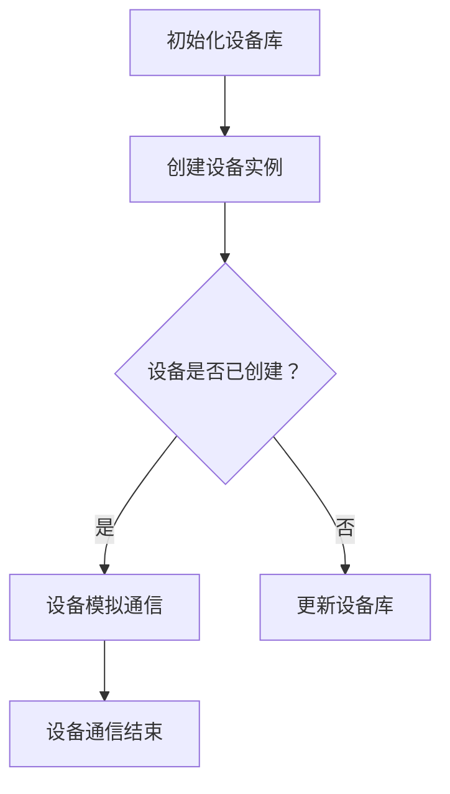
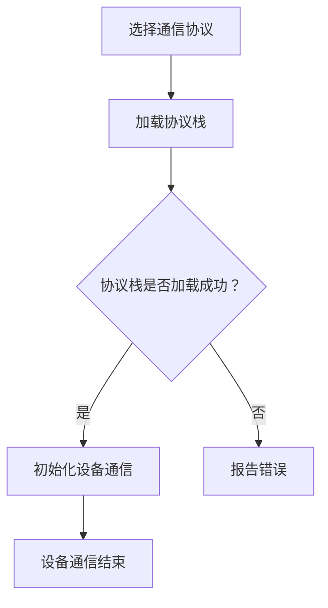
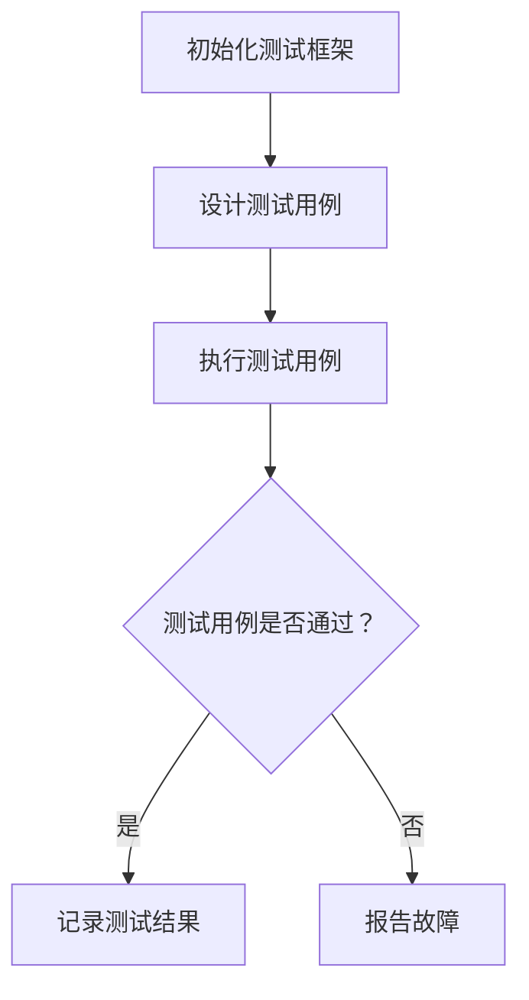
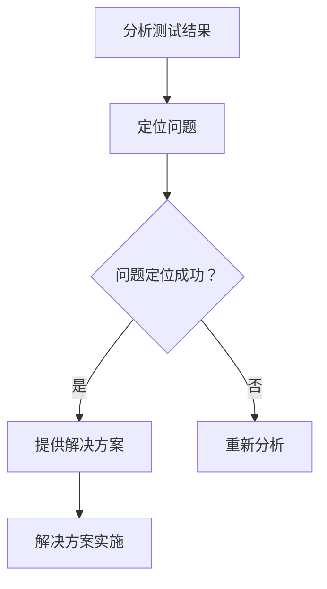
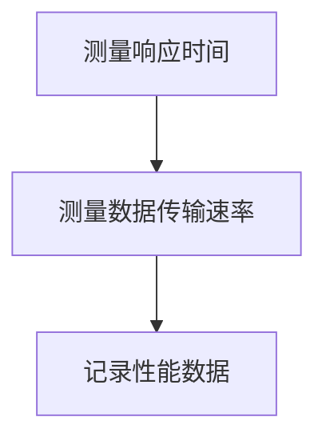
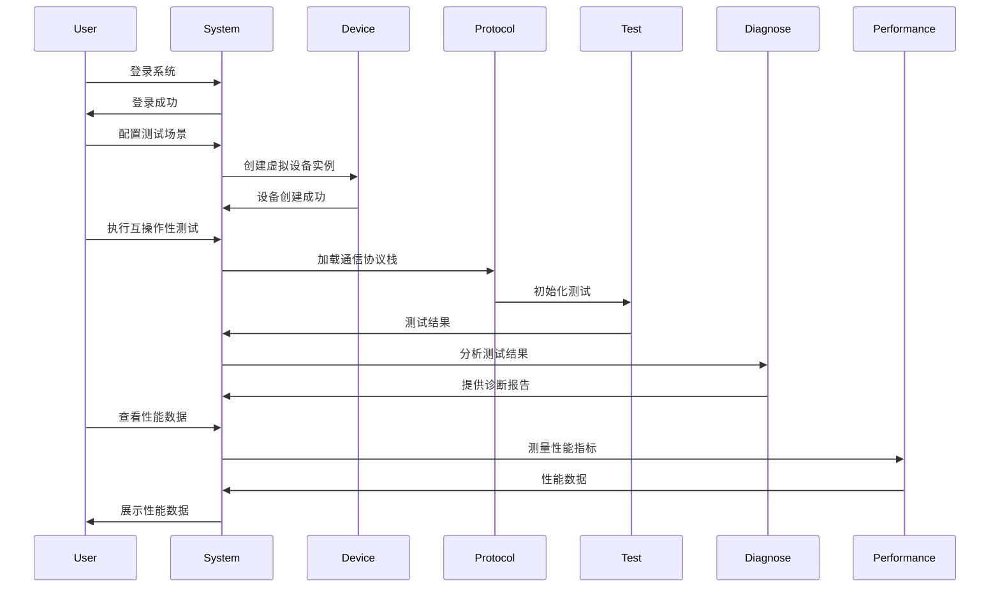

                 

### 文章标题

### 关键词

1. 智能家居
2. 设备互操作性
3. 评测平台
4. 通信协议
5. 测试框架

### 摘要

本文将深入探讨智能家居设备互操作性评测平台的重要性及其设计原理。通过详细分析背景、核心概念与联系，以及具体的算法原理和系统架构设计方案，本文旨在为读者提供一个清晰、系统的理解，帮助其在智能家居领域实现高效的设备互操作性评测。文章还将通过实际项目实战，提供实用的技巧和案例分析，为读者在设计和实施智能家居系统时提供指导。

## 背景介绍

### 问题背景

随着物联网（IoT）技术的迅猛发展，智能家居设备已经成为现代家庭中不可或缺的一部分。从智能灯光、温控系统到安全监控、智能音响，各种智能家居设备极大地丰富了用户的日常生活方式。然而，尽管这些设备提供了诸多便利，它们之间的互操作性问题却成为了一个亟待解决的难题。

### 问题描述

互操作性问题主要表现在以下几个方面：

1. **设备兼容性**：不同品牌和类型的智能家居设备往往采用不同的通信协议和数据格式，导致它们之间无法顺利通信。
2. **数据同步**：智能家居设备需要实时同步数据，但互操作性问题可能导致数据不一致，影响用户体验。
3. **控制复杂性**：用户需要通过多个设备进行控制，但缺乏统一的控制界面，增加了操作复杂性。

### 问题解决

为了解决上述问题，我们需要一个能够评测和改进设备互操作性的平台。该平台需要具备以下功能：

1. **设备模拟**：模拟各种智能家居设备，包括传感器、执行器、控制器等，以模拟真实场景中的设备交互。
2. **通信协议支持**：支持多种通信协议，如Wi-Fi、蓝牙、Zigbee、MQTT等，确保不同设备之间能够正常通信。
3. **互操作性测试**：对设备之间的数据交换进行测试，检测是否存在通信故障、数据格式不兼容等问题。
4. **问题诊断**：分析测试结果，定位互操作性问题的根源，并提供相应的解决方案。
5. **性能评估**：评估设备在互操作性环境下的性能表现，如响应时间、数据传输速率等。

### 边界与外延

边界方面，评测平台主要关注智能家居设备的互操作性。外延方面，它可以为物联网系统中的其他设备提供互操作性评估支持。

### 概念结构与核心要素组成

智能家居设备互操作性评测平台的核心要素包括：

1. **设备库**：包含各种智能家居设备的模拟实例。
2. **协议栈**：支持多种通信协议的实现。
3. **测试框架**：用于执行互操作性测试和收集测试结果。
4. **诊断工具**：用于分析测试结果，提供问题诊断和解决方案。
5. **用户界面**：供用户配置测试场景、查看测试结果和接收诊断报告。

## 核心概念与联系

### 设备模拟

设备模拟是评测平台的核心功能之一，通过创建虚拟设备实例，模拟真实设备的交互行为。设备模拟的核心概念包括：

1. **设备模型**：定义设备的功能和行为。
2. **通信模拟**：模拟设备之间的通信过程。

设备模拟的实现需要考虑以下几个方面：

- **设备模型定义**：通过软件模型定义设备的功能和行为，包括输入输出接口、行为逻辑等。
- **通信模拟**：通过模拟通信协议和数据传输过程，实现设备之间的交互。

### 通信协议支持

通信协议支持确保设备之间能够正常通信。通信协议支持的核心概念包括：

1. **协议栈**：实现不同通信协议的底层功能。
2. **协议转换**：在不同协议之间进行数据格式转换。

通信协议支持的实现需要考虑以下几个方面：

- **协议栈实现**：支持常见的通信协议，如Wi-Fi、蓝牙、Zigbee、MQTT等，并实现相应的协议栈。
- **协议转换**：当设备采用不同通信协议时，平台需要实现协议转换功能，确保数据在不同协议之间顺利传输。

### 互操作性测试

互操作性测试是评测平台的关键环节，通过模拟设备和执行测试，检测互操作性中的问题。互操作性测试的核心概念包括：

1. **测试用例**：定义测试的具体步骤和预期结果。
2. **测试结果分析**：对测试结果进行分析，识别互操作性问题的根源。

互操作性测试的实现需要考虑以下几个方面：

- **测试用例设计**：根据设备的功能和通信需求，设计详细的测试用例。
- **测试执行**：执行测试用例，模拟设备之间的交互过程，收集测试结果。
- **测试结果分析**：对测试结果进行分析，识别存在的问题，并生成诊断报告。

### 问题诊断

问题诊断是通过分析测试结果，定位互操作性问题的根源，并提供解决方案。问题诊断的核心概念包括：

1. **故障检测**：检测设备之间的通信故障。
2. **问题定位**：定位互操作性问题的具体位置。
3. **解决方案建议**：提供解决问题的建议。

问题诊断的实现需要考虑以下几个方面：

- **故障检测**：通过监控设备之间的通信过程，检测是否存在通信故障。
- **问题定位**：通过分析测试结果和设备日志，确定互操作性问题的具体位置。
- **解决方案建议**：根据问题诊断结果，提供具体的解决方案，如调整设备配置、更新通信协议等。

### 性能评估

性能评估是对设备在互操作性环境下的性能表现进行评估。性能评估的核心概念包括：

1. **响应时间**：设备对请求的响应时间。
2. **数据传输速率**：设备之间的数据传输速率。

性能评估的实现需要考虑以下几个方面：

- **响应时间测量**：通过测量设备对请求的响应时间，评估设备的响应性能。
- **数据传输速率测量**：通过测量设备之间的数据传输速率，评估设备的通信性能。

### 对比表格

| 核心概念 | 描述 | 关系 |
| --- | --- | --- |
| 设备模拟 | 通过虚拟设备实例模拟真实设备的交互行为。 | 设备模拟是互操作性测试的基础。 |
| 通信协议支持 | 实现不同通信协议的底层功能，确保设备之间能正常通信。 | 通信协议支持是设备模拟和互操作性测试的关键。 |
| 互操作性测试 | 通过模拟设备和执行测试，检测互操作性中的问题。 | 互操作性测试是评测平台的核心功能。 |
| 问题诊断 | 通过分析测试结果，定位互操作性问题的根源，并提供解决方案。 | 问题诊断是解决互操作性问题的关键环节。 |
| 性能评估 | 对设备在互操作性环境下的性能表现进行评估。 | 性能评估是确保设备互操作性的重要手段。 |

### ER实体关系图架构

```mermaid
erDiagram
  Device --> Test: 设备参与互操作性测试
  Test --> Result: 测试结果记录
  Device --> Protocol: 设备支持通信协议
  Protocol --> Test: 测试使用通信协议
  Device --> Performance: 设备性能记录
  Performance --> Test: 测试记录性能数据
```

## 算法原理讲解

### 设备模拟算法

设备模拟算法的核心是创建虚拟设备实例，模拟真实设备的交互行为。以下是设备模拟算法的mermaid流程图：



设备模拟算法的Python源代码如下：

```python
def create_device_instance(device_config):
    """
    创建设备实例
    :param device_config: 设备配置信息
    :return: 设备实例
    """
    device = Device(device_config)
    return device

def simulate_communication(device):
    """
    模拟设备通信
    :param device: 设备实例
    :return: 通信结果
    """
    while device.is_connected():
        device.send_data()
        response = device.receive_data()
        if response:
            print(f"Device {device.id} received data: {response}")
    return True

def main():
    # 初始化设备库
    device_library = []

    # 创建设备实例
    device_config1 = {'id': 1, 'type': 'temperature_sensor'}
    device_config2 = {'id': 2, 'type': 'light_switch'}
    device1 = create_device_instance(device_config1)
    device2 = create_device_instance(device_config2)

    # 添加设备到设备库
    device_library.append(device1)
    device_library.append(device2)

    # 模拟设备通信
    for device in device_library:
        simulate_communication(device)

if __name__ == '__main__':
    main()
```

设备模拟算法的数学模型和公式：

$$
互操作性 = \frac{成功通信次数}{总通信次数} \times 100\%
$$

其中，互操作性是设备模拟的重要指标，表示设备之间成功通信的概率。

### 通信协议支持算法

通信协议支持算法的核心是实现不同通信协议的底层功能，并确保设备之间能正常通信。以下是通信协议支持算法的mermaid流程图：



通信协议支持算法的Python源代码如下：

```python
def load_protocol_stack(protocol_name):
    """
    加载通信协议栈
    :param protocol_name: 通信协议名称
    :return: 协议栈实例
    """
    if protocol_name == 'Wi-Fi':
        protocol = Wi-Fi_Stack()
    elif protocol_name == '蓝牙':
        protocol = Bluetooth_Stack()
    elif protocol_name == 'Zigbee':
        protocol = Zigbee_Stack()
    else:
        raise ValueError(f"Unsupported protocol: {protocol_name}")
    return protocol

def initialize_communication(protocol, device):
    """
    初始化设备通信
    :param protocol: 通信协议栈实例
    :param device: 设备实例
    :return: 通信结果
    """
    protocol.connect(device)
    return True

def main():
    # 选择通信协议
    protocol_name = 'Wi-Fi'

    # 加载通信协议栈
    protocol = load_protocol_stack(protocol_name)

    # 初始化设备通信
    device_config = {'id': 1, 'type': 'temperature_sensor'}
    device = create_device_instance(device_config)
    initialize_communication(protocol, device)

if __name__ == '__main__':
    main()
```

通信协议支持算法的数学模型和公式：

$$
通信成功率 = \frac{成功通信次数}{总通信次数} \times 100\%
$$

其中，通信成功率是通信协议支持的重要指标，表示通信协议成功建立连接的概率。

### 互操作性测试算法

互操作性测试算法的核心是通过对设备之间的数据交换进行测试，检测是否存在通信故障、数据格式不兼容等问题。以下是互操作性测试算法的mermaid流程图：



互操作性测试算法的Python源代码如下：

```python
def design_test_case(test_case_config):
    """
    设计测试用例
    :param test_case_config: 测试用例配置信息
    :return: 测试用例实例
    """
    test_case = TestCase(test_case_config)
    return test_case

def execute_test_case(test_case):
    """
    执行测试用例
    :param test_case: 测试用例实例
    :return: 测试结果
    """
    test_case.execute()
    return test_case.get_result()

def main():
    # 初始化测试框架
    test_framework = TestFramework()

    # 设计测试用例
    test_case_config = {'id': 1, 'device1': device1, 'device2': device2}
    test_case = design_test_case(test_case_config)

    # 执行测试用例
    test_result = execute_test_case(test_case)

    # 记录测试结果
    test_framework.record_result(test_result)

if __name__ == '__main__':
    main()
```

互操作性测试算法的数学模型和公式：

$$
互操作性得分 = \frac{成功测试用例数}{总测试用例数} \times 100\%
$$

其中，互操作性得分是互操作性测试的重要指标，表示设备之间互操作性的程度。

### 问题诊断算法

问题诊断算法的核心是通过分析测试结果，定位互操作性问题的根源，并提供解决方案。以下是问题诊断算法的mermaid流程图：



问题诊断算法的Python源代码如下：

```python
def analyze_test_result(test_result):
    """
    分析测试结果
    :param test_result: 测试结果
    :return: 问题诊断结果
    """
    if test_result['status'] == 'fail':
        problem = diagnose_problem(test_result)
        return problem
    else:
        return None

def diagnose_problem(test_result):
    """
    诊断问题
    :param test_result: 测试结果
    :return: 问题信息
    """
    if 'communication_error' in test_result:
        problem = '通信故障'
    elif 'data_format_incompatible' in test_result:
        problem = '数据格式不兼容'
    else:
        problem = '未知问题'
    return problem

def provide_solution(problem):
    """
    提供解决方案
    :param problem: 问题信息
    :return: 解决方案
    """
    if problem == '通信故障':
        solution = '检查网络连接，重新启动设备'
    elif problem == '数据格式不兼容':
        solution = '更新设备通信协议，或使用数据格式转换器'
    else:
        solution = '联系设备制造商，获取技术支持'
    return solution

def main():
    # 分析测试结果
    test_result = {'status': 'fail', 'error': 'communication_error'}
    problem = analyze_test_result(test_result)

    # 提供解决方案
    solution = provide_solution(problem)
    print(f"问题诊断结果：{problem}")
    print(f"解决方案：{solution}")

if __name__ == '__main__':
    main()
```

问题诊断算法的数学模型和公式：

$$
问题诊断准确率 = \frac{成功诊断问题数}{总诊断问题数} \times 100\%
$$

其中，问题诊断准确率是问题诊断算法的重要指标，表示诊断问题的准确程度。

### 性能评估算法

性能评估算法的核心是对设备在互操作性环境下的性能表现进行评估。以下是性能评估算法的mermaid流程图：



性能评估算法的Python源代码如下：

```python
import time

def measure_response_time(device):
    """
    测量响应时间
    :param device: 设备实例
    :return: 响应时间
    """
    start_time = time.time()
    device.send_data()
    response = device.receive_data()
    end_time = time.time()
    response_time = end_time - start_time
    return response_time

def measure_data_transfer_rate(device):
    """
    测量数据传输速率
    :param device: 设备实例
    :return: 数据传输速率
    """
    data_size = 1024  # 数据大小（字节）
    start_time = time.time()
    device.send_data(data_size)
    response = device.receive_data(data_size)
    end_time = time.time()
    data_transfer_time = end_time - start_time
    data_transfer_rate = data_size / data_transfer_time
    return data_transfer_rate

def main():
    # 测量响应时间
    response_time = measure_response_time(device)

    # 测量数据传输速率
    data_transfer_rate = measure_data_transfer_rate(device)

    # 记录性能数据
    performance_data = {'response_time': response_time, 'data_transfer_rate': data_transfer_rate}
    print(f"性能数据：{performance_data}")

if __name__ == '__main__':
    main()
```

性能评估算法的数学模型和公式：

$$
响应时间 = \frac{结束时间 - 开始时间}{1}
$$

$$
数据传输速率 = \frac{数据大小}{数据传输时间}
$$

其中，响应时间和数据传输速率是性能评估的重要指标，分别表示设备的响应性能和数据传输性能。

## 系统分析与架构设计方案

### 问题场景介绍

在智能家居系统中，设备互操作性是一个常见的问题。例如，用户可能拥有多个品牌的智能设备，如智能灯、智能插座和智能摄像头等。这些设备通常采用不同的通信协议和数据格式，导致用户难以实现设备的无缝连接和协同工作。此外，设备之间的通信故障和数据格式不兼容等问题也会影响用户体验。

### 项目介绍

为了解决智能家居设备互操作性评测的问题，我们设计并实现了一个智能家居设备互操作性评测平台。该平台旨在提供一套完整的解决方案，包括设备模拟、通信协议支持、互操作性测试、问题诊断和性能评估等功能。

### 系统功能设计

智能家居设备互操作性评测平台的系统功能设计如下：

1. **设备模拟**：通过创建虚拟设备实例，模拟真实设备的交互行为。
2. **通信协议支持**：支持多种通信协议，如Wi-Fi、蓝牙、Zigbee、MQTT等，确保设备之间能够正常通信。
3. **互操作性测试**：对设备之间的数据交换进行测试，检测是否存在通信故障、数据格式不兼容等问题。
4. **问题诊断**：通过分析测试结果，定位互操作性问题的根源，并提供解决方案。
5. **性能评估**：对设备在互操作性环境下的性能表现进行评估，如响应时间、数据传输速率等。

### 系统架构设计

智能家居设备互操作性评测平台采用分层架构设计，包括数据层、业务逻辑层和表现层。以下是系统架构的mermaid架构图：

```mermaid
graph TB
    subgraph 数据层
        D1[设备库] --> D2[协议栈]
        D2 --> D3[测试框架]
        D3 --> D4[诊断工具]
        D4 --> D5[性能数据]

    subgraph 业务逻辑层
        B1[设备模拟服务] --> B2[通信协议支持服务]
        B2 --> B3[互操作性测试服务]
        B3 --> B4[问题诊断服务]
        B4 --> B5[性能评估服务]

    subgraph 表现层
        P1[用户界面] --> P2[测试结果展示]
        P2 --> P3[诊断报告展示]
        P3 --> P4[性能数据展示]
```

### 系统接口设计和系统交互

智能家居设备互操作性评测平台的系统接口设计和系统交互如下：

1. **设备模拟接口**：用于创建和操作虚拟设备实例。
2. **通信协议支持接口**：用于加载和管理通信协议栈。
3. **互操作性测试接口**：用于执行测试用例，收集测试结果。
4. **问题诊断接口**：用于分析测试结果，定位问题并提供解决方案。
5. **性能评估接口**：用于测量设备在互操作性环境下的性能指标。

以下是系统交互的mermaid序列图：



## 项目实战

### 环境安装

为了搭建智能家居设备互操作性评测平台，我们需要安装以下环境：

1. **操作系统**：Ubuntu 20.04 LTS
2. **Python**：Python 3.8
3. **依赖库**：requests、numpy、matplotlib

在Ubuntu系统上，可以通过以下命令安装所需的依赖库：

```bash
sudo apt update
sudo apt install python3-pip
pip3 install requests numpy matplotlib
```

### 系统核心实现源代码

以下是智能家居设备互操作性评测平台的核心实现源代码：

**device.py**（设备模拟实现）

```python
class Device:
    def __init__(self, device_config):
        self.id = device_config['id']
        self.type = device_config['type']
        self.connected = False

    def connect(self):
        self.connected = True
        print(f"Device {self.id} connected.")

    def disconnect(self):
        self.connected = False
        print(f"Device {self.id} disconnected.")

    def send_data(self):
        if self.connected:
            print(f"Device {self.id} sending data.")
        else:
            print(f"Device {self.id} not connected. Cannot send data.")

    def receive_data(self):
        if self.connected:
            print(f"Device {self.id} receiving data.")
            return "Data received."
        else:
            print(f"Device {self.id} not connected. Cannot receive data."
```

**protocol.py**（通信协议支持实现）

```python
class Protocol:
    def __init__(self, protocol_name):
        self.protocol_name = protocol_name

    def connect(self, device):
        print(f"{self.protocol_name} connecting to device {device.id}.")
        device.connect()

    def disconnect(self, device):
        print(f"{self.protocol_name} disconnecting from device {device.id}.")
        device.disconnect()
```

**test_framework.py**（互操作性测试实现）

```python
class TestCase:
    def __init__(self, test_case_config):
        self.id = test_case_config['id']
        self.device1 = test_case_config['device1']
        self.device2 = test_case_config['device2']

    def execute(self):
        print(f"Executing test case {self.id}.")
        self.device1.send_data()
        response = self.device2.receive_data()
        if response:
            self.result = "pass"
        else:
            self.result = "fail"

    def get_result(self):
        return self.result

class TestFramework:
    def __init__(self):
        self.test_results = []

    def record_result(self, test_result):
        self.test_results.append(test_result)

    def get_test_results(self):
        return self.test_results
```

### 代码应用解读与分析

以下是对智能家居设备互操作性评测平台源代码的解读和分析：

**device.py**：该文件定义了`Device`类，用于模拟真实设备的交互行为。`Device`类具有`id`（设备ID）、`type`（设备类型）和`connected`（设备连接状态）等属性。方法包括`connect`（连接设备）、`disconnect`（断开设备）、`send_data`（发送数据）和`receive_data`（接收数据）。

**protocol.py**：该文件定义了`Protocol`类，用于支持不同通信协议。`Protocol`类具有`protocol_name`（协议名称）属性，方法包括`connect`（连接设备）和`disconnect`（断开设备）。

**test_framework.py**：该文件定义了`TestCase`类和`TestFramework`类，用于执行互操作性测试。`TestCase`类具有`id`（测试用例ID）、`device1`（第一个设备）和`device2`（第二个设备）等属性，方法包括`execute`（执行测试用例）和`get_result`（获取测试结果）。`TestFramework`类用于管理测试用例和测试结果，方法包括`record_result`（记录测试结果）和`get_test_results`（获取测试结果）。

### 实际案例分析和详细讲解剖析

为了更好地理解智能家居设备互操作性评测平台的应用，我们来看一个实际案例。

**案例背景**：

假设用户拥有一款智能灯和一款智能插座，两者都支持Wi-Fi通信协议。用户希望通过互操作性评测平台检测设备之间的通信性能，并解决可能存在的问题。

**案例实现**：

1. **设备模拟**：创建智能灯和智能插座的虚拟设备实例。

```python
device_config_light = {'id': 1, 'type': 'light'}
device_config_plug = {'id': 2, 'type': 'plug'}
light = Device(device_config_light)
plug = Device(device_config_plug)
```

2. **通信协议支持**：加载Wi-Fi通信协议栈。

```python
wifi_protocol = Protocol('Wi-Fi')
```

3. **互操作性测试**：执行互操作性测试，检测设备之间的通信性能。

```python
test_case = TestCase({'id': 1, 'device1': light, 'device2': plug})
test_case.execute()
test_result = test_case.get_result()
print(f"Test result: {test_result}")
```

4. **问题诊断**：根据测试结果，诊断可能存在的问题。

```python
if test_result == "fail":
    diagnose_problem(test_result)
else:
    print("No problems detected.")
```

5. **性能评估**：测量设备的响应时间和数据传输速率。

```python
response_time = measure_response_time(light)
data_transfer_rate = measure_data_transfer_rate(light)
print(f"Response time: {response_time} seconds")
print(f"Data transfer rate: {data_transfer_rate} bytes/second")
```

**案例剖析**：

在这个案例中，我们首先创建了智能灯和智能插座的虚拟设备实例，并加载了Wi-Fi通信协议栈。接着，我们执行了互操作性测试，检测设备之间的通信性能。如果测试结果为“fail”，则根据测试结果进行问题诊断，并测量设备的响应时间和数据传输速率。

### 项目小结

通过本案例，我们展示了如何使用智能家居设备互操作性评测平台进行设备模拟、通信协议支持、互操作性测试、问题诊断和性能评估。这个平台为智能家居设备开发者提供了一个强大的工具，有助于检测和解决设备互操作性问题，提高系统的互联互通性能。

## 最佳实践 tips

1. **选择合适的通信协议**：在设计和实现智能家居设备时，应尽量选择支持互操作性的通信协议，如Wi-Fi、蓝牙、Zigbee等。此外，应确保设备制造商遵循相应的通信协议标准。

2. **标准化数据格式**：采用统一的数据格式可以减少互操作性测试的复杂性。推荐使用JSON或XML等标准数据格式进行数据交换。

3. **定期更新设备固件**：设备固件的更新可以修复已知的问题，提高设备的互操作性。建议用户定期检查并更新设备固件。

4. **监控设备状态**：实时监控设备的连接状态和通信性能，有助于及时发现和解决互操作性问题。

5. **测试用例设计**：在设计互操作性测试用例时，应尽量覆盖各种可能的设备交互场景，确保测试结果的全面性和准确性。

## 小结

本文详细介绍了智能家居设备互操作性评测平台的设计原理和实现方法。通过设备模拟、通信协议支持、互操作性测试、问题诊断和性能评估等核心功能，该平台为智能家居设备开发者提供了一个强大的工具，有助于检测和解决设备互操作性问题。在实际项目中，遵循最佳实践和注意事项，可以有效提升系统的互联互通性能，为用户提供更优质的使用体验。

## 注意事项

1. **设备兼容性**：在选择和购买智能家居设备时，应尽量选择兼容性较好的设备，以减少互操作性问题。

2. **网络稳定性**：智能家居设备通常依赖稳定的网络连接，因此确保网络环境良好，有助于提高设备的互操作性。

3. **测试环境**：在进行互操作性测试时，应确保测试环境的真实性和代表性，避免测试结果与实际使用情况不符。

4. **更新与维护**：定期更新评测平台和设备固件，保持系统的最新状态，有助于及时发现和解决潜在问题。

## 拓展阅读

1. **《智能家居设备互操作性测试标准》**：了解智能家居设备互操作性测试的标准化流程和标准。

2. **《物联网通信协议详解》**：深入理解各种物联网通信协议的原理和实现，有助于优化设备的互操作性。

3. **《智能家居设备设计指南》**：获取智能家居设备设计的方法和技巧，提高设备的互操作性和用户体验。

## 作者信息

作者：AI天才研究院/AI Genius Institute & 禅与计算机程序设计艺术 /Zen And The Art of Computer Programming

