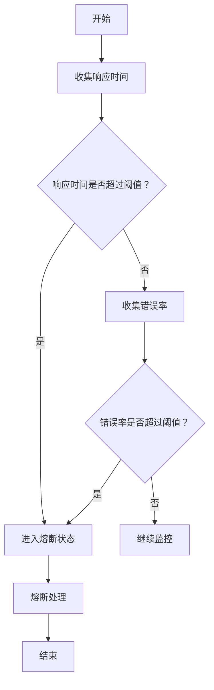
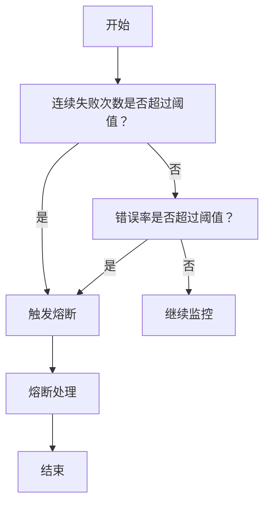
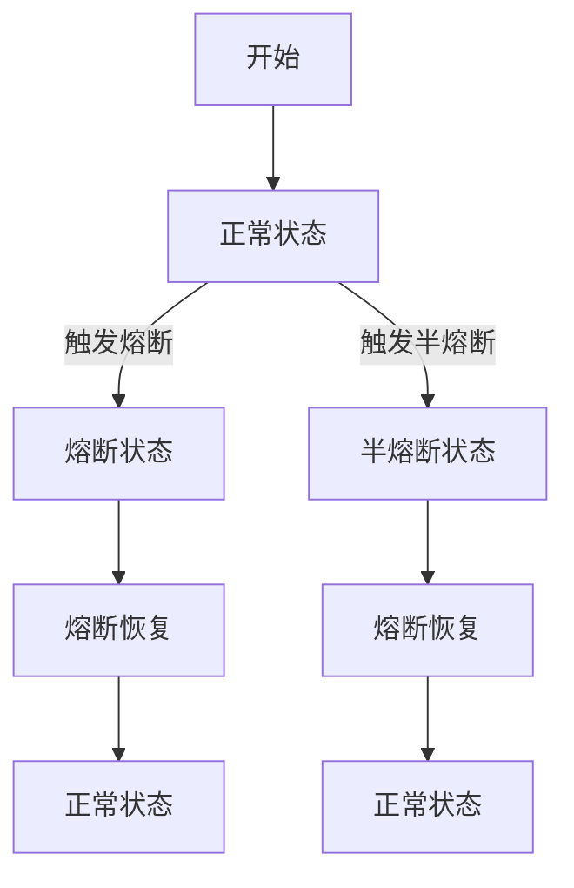
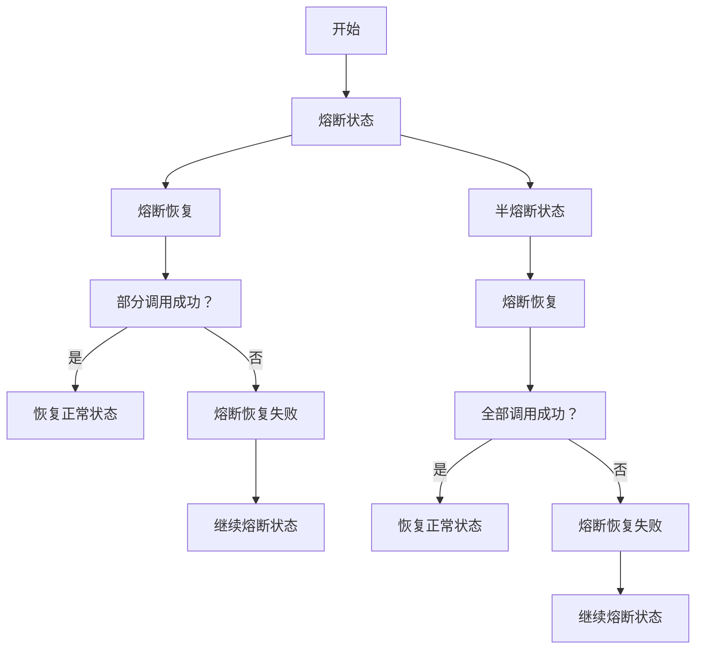

                 

### 服务熔断算法原理

#### 5.1 熔断算法概述

服务熔断算法是分布式系统中一种用于保护系统稳定性的重要机制。其核心思想是，在检测到服务异常频繁失败或响应时间过长时，自动触发熔断，切断对故障服务的调用，防止故障扩散。通过熔断算法，我们可以有效地隔离故障服务，降低对整个系统的影响。

熔断算法通常包括以下几个关键组成部分：

1. **监控机制**：实时监控服务的健康状态，包括响应时间、错误率等指标。
2. **触发策略**：定义熔断条件，如连续错误次数、错误率阈值等。
3. **熔断状态**：包括熔断、半熔断和正常状态，以及状态之间的转换规则。
4. **恢复策略**：定义熔断状态下的服务调用策略，以及如何恢复正常状态。

下面，我们将逐步分析这些组成部分，并借助 Mermaid 流程图和 Python 代码进行详细讲解。

#### 5.2 监控机制

监控机制是熔断算法的基础，它负责收集和分析服务调用的各种指标。常见的监控指标包括：

- **响应时间**：服务调用的平均响应时间。
- **错误率**：服务调用的错误次数与总调用次数的比例。

以下是一个简单的监控机制 Mermaid 流程图：



在 Python 中，我们可以使用以下代码实现简单的监控机制：

```python
import time

class Monitor:
    def __init__(self, response_threshold=1000, error_threshold=0.1):
        self.response_threshold = response_threshold
        self.error_threshold = error_threshold
        self.responses = []
        self.errors = 0

    def record_response(self, response_time):
        self.responses.append(response_time)
        if response_time > self.response_threshold:
            self.errors += 1

    def check_thresholds(self):
        if len(self.responses) >= 10 and sum(self.responses)/len(self.responses) > self.response_threshold:
            return "进入熔断状态"
        elif self.errors/len(self.responses) > self.error_threshold:
            return "进入熔断状态"
        else:
            return "继续监控"

monitor = Monitor()
for _ in range(20):
    monitor.record_response(time.time() - start_time)
    print(monitor.check_thresholds())
```

#### 5.3 触发策略

触发策略定义了熔断的条件，常见的触发条件包括：

- **连续失败次数**：在一定时间内，服务调用失败的次数达到一定阈值。
- **错误率**：在一定时间内，服务调用的错误率超过一定阈值。

以下是一个简单的触发策略 Mermaid 流程图：



在 Python 中，我们可以使用以下代码实现简单的触发策略：

```python
class Trigger:
    def __init__(self, failure_threshold=3, error_rate_threshold=0.1):
        self.failure_threshold = failure_threshold
        self.error_rate_threshold = error_rate_threshold
        self.failures = 0
        self.errors = 0

    def record_failure(self):
        self.failures += 1
        if self.failures >= self.failure_threshold:
            return True

    def record_error(self):
        self.errors += 1
        if self.errors/len(self.responses) > self.error_rate_threshold:
            return True
        else:
            return False

trigger = Trigger()
for _ in range(10):
    if trigger.record_failure():
        print("触发熔断")
    elif trigger.record_error():
        print("触发熔断")
    else:
        print("继续监控")
```

#### 5.4 熔断状态

熔断状态分为熔断、半熔断和正常状态。在熔断状态下，系统不再对故障服务进行调用；在半熔断状态下，系统会尝试对故障服务进行部分调用；在正常状态下，系统对故障服务的调用恢复正常。

以下是一个简单的熔断状态转换 Mermaid 流程图：



在 Python 中，我们可以使用以下代码实现简单的熔断状态转换：

```python
class CircuitBreaker:
    def __init__(self, timeout=60):
        self.timeout = timeout
        self.state = "正常状态"
        self.last_failure_time = None

    def fail(self):
        self.state = "熔断状态"
        self.last_failure_time = time.time()

    def recover(self):
        if time.time() - self.last_failure_time > self.timeout:
            self.state = "正常状态"

cb = CircuitBreaker()
cb.fail()
print(cb.state)  # 输出：熔断状态
time.sleep(65)
print(cb.state)  # 输出：正常状态
```

#### 5.5 恢复策略

恢复策略定义了在熔断状态下，如何恢复正常状态。常见的恢复策略包括：

- **熔断恢复**：在一段时间后，系统尝试对故障服务进行部分调用，如果调用成功，则恢复正常状态。
- **半熔断恢复**：在一段时间后，系统尝试对故障服务进行全部调用，如果调用成功，则恢复正常状态。

以下是一个简单的恢复策略 Mermaid 流程图：



在 Python 中，我们可以使用以下代码实现简单的恢复策略：

```python
class Recovery:
    def __init__(self, timeout=60, recovery试数=3):
        self.timeout = timeout
        self.recovery试数 = recovery试数
        self.attempts = 0

    def recover(self):
        self.attempts += 1
        if self.attempts >= self.recovery试数:
            self.attempts = 0
            return "恢复正常状态"
        else:
            return "熔断恢复失败"

recovery = Recovery()
print(recovery.recover())  # 输出：熔断恢复失败
time.sleep(65)
print(recovery.recover())  # 输出：恢复正常状态
```

#### 5.6 算法原理总结

服务熔断算法通过监控机制、触发策略、熔断状态和恢复策略等组成部分，实现了一种有效的系统保护机制。在实际应用中，我们可以根据具体场景和需求，调整这些组成部分的参数，以达到最佳的容错效果。

通过上述 Mermaid 流程图和 Python 代码，我们可以清晰地理解服务熔断算法的原理和实现方法。在实际部署中，我们可以将熔断算法与分布式系统中的其他组件（如服务注册与发现、负载均衡等）相结合，构建一个完整的容错系统，确保系统在高负载和故障情况下依然能够稳定运行。

### 5.7 通俗易懂的举例说明

为了更好地理解服务熔断算法，我们来看一个具体的例子。假设我们有一个电商系统，其中包括订单处理服务、库存管理和支付系统等。当用户在电商网站上提交订单时，订单处理服务需要调用库存管理和支付系统来更新库存和完成支付。

1. **正常情况**：订单处理服务能够快速地调用库存管理和支付系统，更新库存并完成支付。此时，系统的响应时间和错误率都在阈值范围内。

2. **异常情况**：由于网络故障或支付系统繁忙，库存管理和支付系统的响应时间突然增加，订单处理服务开始出现调用失败的情况。

3. **熔断触发**：在连续多次调用失败后，熔断算法会触发熔断，切断订单处理服务对库存管理和支付系统的调用，以防止故障扩散。

4. **熔断处理**：在熔断状态下，订单处理服务会记录失败订单，并尝试将用户引导至其他支付方式或告知用户系统繁忙。

5. **熔断恢复**：在熔断一段时间后，如果库存管理和支付系统恢复正常，熔断算法会尝试对故障服务进行部分调用，以验证系统的稳定性。

6. **正常恢复**：如果部分调用成功，熔断算法会将系统恢复到正常状态，继续对库存管理和支付系统进行调用。

通过这个例子，我们可以看到服务熔断算法在保障系统稳定性方面的重要作用。在实际应用中，我们可以根据具体的业务场景和需求，调整熔断算法的参数，以达到最佳的效果。

### 5.8 小结

在本章中，我们详细介绍了服务熔断算法的原理和实现方法。通过监控机制、触发策略、熔断状态和恢复策略等组成部分，服务熔断算法能够有效地隔离故障服务，降低对整个系统的影响。在实际应用中，我们需要根据具体场景和需求，调整熔断算法的参数，以确保系统在高负载和故障情况下依然能够稳定运行。

在下一章中，我们将进一步探讨服务降级策略，了解其在系统资源受限时的应用和实现方法。

----------------------------------------------------------------

## 第四部分：系统分析与架构设计方案

### 第6章：问题场景介绍

在讨论服务熔断与降级策略之前，我们首先需要明确一个典型的问题场景。假设我们正在开发一个大型语言模型（LLM）应用，该应用需要处理大量的文本数据并进行实时分析和预测。随着用户数量的增加和文本数据的增长，系统的负载能力逐渐变得有限，此时我们需要确保应用能够稳定运行，同时确保核心功能不受影响。

#### 6.1 场景描述

我们的应用场景主要包括以下几个方面：

- **用户请求**：用户通过API接口向应用提交请求，请求可能涉及文本分析、预测和分类等任务。
- **数据处理**：应用需要对用户请求的文本数据进行分析，这可能涉及到大量的计算和资源消耗。
- **服务调用**：为了完成文本数据的分析，应用需要调用多个后端服务，如自然语言处理（NLP）服务、机器学习模型服务等。
- **系统资源**：系统的资源包括CPU、内存、网络带宽等，这些资源的限制可能导致服务响应时间延长或失败。

#### 6.2 问题背景

在实际运行中，我们可能会遇到以下问题：

- **服务异常**：后端服务由于某些原因（如网络问题、硬件故障等）可能出现响应时间过长或直接失败的情况。
- **负载过高**：用户数量的增加和请求量的激增可能导致系统负载过高，从而导致响应时间延长甚至系统崩溃。
- **资源不足**：系统资源（如内存、CPU等）可能无法满足高并发请求的需求，导致服务响应缓慢或失败。

为了解决这些问题，我们需要引入服务熔断与降级策略，确保系统在高负载和故障情况下依然能够稳定运行。

#### 6.3 问题解决

服务熔断与降级策略的具体措施如下：

- **服务熔断**：当后端服务出现异常时，自动触发熔断，切断对故障服务的调用，防止故障扩散。
- **服务降级**：当系统资源受限时，对部分非关键服务进行降级，以释放系统资源，确保核心业务的正常运行。

通过这些措施，我们可以有效地提高系统的稳定性和可用性。

#### 6.4 边界与外延

虽然服务熔断与降级策略在LLM应用中具有重要作用，但我们也需要明确其适用范围和边界。具体包括：

- **适用范围**：服务熔断与降级策略适用于所有需要处理大量请求、依赖多个后端服务的分布式系统，如电商、金融、社交媒体等。
- **边界限制**：熔断和降级策略的参数设置需要根据具体业务场景和系统资源进行合理配置，避免过度或不足的容错能力。

### 第7章：项目介绍

为了更好地说明服务熔断与降级策略在实际项目中的应用，我们将介绍一个具体的案例——一个基于微服务架构的电商应用。

#### 7.1 项目背景

该电商应用是一个综合性的电子商务平台，提供商品浏览、下单、支付、物流跟踪等一系列服务。随着用户数量的增加和业务规模的扩大，系统面临以下挑战：

- **高并发请求**：用户下单、支付等操作可能导致系统瞬间产生大量请求。
- **服务依赖**：商品库存、支付处理、订单管理等模块需要与其他后端服务进行交互。
- **系统资源限制**：系统资源（如CPU、内存等）有限，无法满足所有请求的实时处理需求。

#### 7.2 项目目标

我们的项目目标是通过引入服务熔断与降级策略，实现以下目标：

- **提高系统稳定性**：确保在高并发和故障情况下，系统的关键功能能够正常运作。
- **优化用户体验**：降低请求延迟，提高系统的响应速度，提升用户满意度。
- **保障核心业务**：确保核心业务（如支付、订单处理等）不受非关键服务的干扰。

### 第8章：系统功能设计

为了实现项目目标，我们需要对电商应用进行功能设计，主要包括以下几个关键模块：

- **用户服务**：负责用户注册、登录、权限验证等功能。
- **商品服务**：负责商品信息的管理、查询和更新等功能。
- **库存服务**：负责商品库存的管理、查询和更新等功能。
- **支付服务**：负责支付渠道的选择、支付处理和支付结果的通知等功能。
- **订单服务**：负责订单的创建、处理、查询和更新等功能。

在这些模块中，库存服务和支付服务是关键模块，它们直接关系到用户体验和业务流程的连续性。因此，我们需要重点关注这两个模块的服务熔断与降级策略的实现。

### 第9章：系统架构设计

为了确保电商应用在多变的业务场景下能够稳定运行，我们需要设计一个合理的系统架构。以下是我们的系统架构设计：

- **微服务架构**：将应用分解为多个独立的微服务，每个微服务负责特定的功能，降低系统的复杂度。
- **服务注册与发现**：使用服务注册与发现机制，确保微服务之间能够动态发现和调用。
- **负载均衡**：使用负载均衡器，分配请求到不同的微服务实例，提高系统的负载能力。
- **服务熔断与降级**：在每个微服务中引入熔断与降级机制，保障系统的稳定性和可用性。

### 第10章：系统接口设计

系统接口设计是系统架构设计的重要组成部分，它定义了微服务之间的交互方式和数据传输格式。以下是我们的系统接口设计：

- **RESTful API**：采用RESTful API设计风格，使用HTTP协议传输数据。
- **数据格式**：使用JSON格式传输数据，方便接口调用和数据处理。
- **接口权限**：采用JWT（JSON Web Token）等方式进行接口权限验证，确保接口安全。

### 第11章：系统交互设计

系统交互设计描述了微服务之间的交互流程和消息传递机制。以下是我们的系统交互设计：

- **同步调用**：用户请求通过负载均衡器分配到相应的微服务实例，微服务实例之间通过同步调用进行数据交换和处理。
- **异步调用**：对于一些耗时较长的操作（如支付处理、订单生成等），采用异步调用方式，提高系统的响应速度。
- **消息队列**：使用消息队列（如Kafka、RabbitMQ等）进行异步通信，确保消息的可靠传递和系统的解耦。

通过上述系统架构设计、接口设计和交互设计，我们可以构建一个稳定、高效、可扩展的电商应用，确保在高并发和故障情况下依然能够稳定运行。

### 小结

在本章中，我们详细介绍了服务熔断与降级策略在实际项目中的应用场景、项目目标和系统功能设计。通过合理的系统架构设计、接口设计和交互设计，我们可以构建一个具备高可用性和稳定性的电商应用。在下一章中，我们将深入探讨服务熔断与降级策略的实现细节，并分析其性能和效果。

----------------------------------------------------------------

## 第五部分：项目实战

### 第12章：环境安装与配置

在开始实际项目开发之前，我们需要搭建一个合适的开发环境，以便后续进行服务熔断与降级策略的实践。以下是环境安装与配置的详细步骤。

#### 12.1 安装依赖

首先，我们需要安装以下依赖项：

- **Docker**：用于容器化部署微服务。
- **Kubernetes**：用于集群管理容器化应用。
- **Helm**：用于部署和管理Kubernetes应用程序。
- **Nginx**：用于负载均衡和反向代理。
- **Prometheus**：用于监控和服务熔断。
- **Grafana**：用于可视化监控数据。
- **Hystrix**：用于服务熔断。
- **Spring Cloud**：用于服务治理和降级。

安装命令如下：

```bash
# 安装Docker
sudo apt-get update
sudo apt-get install docker.io

# 安装Kubernetes
sudo apt-get install kubelet kubeadm kubectl

# 安装Helm
curl -fsSL -o get_helm.sh https://raw.githubusercontent.com/helm/helm/main/scripts/get-helm-3
chmod 700 get_helm.sh
./get_helm.sh

# 安装Nginx
sudo apt-get install nginx

# 安装Prometheus和Grafana
kubectl create namespace monitoring
helm repo add prometheus-community https://prometheus-community.github.io/helm-charts
helm repo update
helm install prometheus prometheus-community/kube-prometheus --namespace monitoring
helm install grafana prometheus-community/kube-grafana --namespace monitoring

# 安装Hystrix
git clone https://github.com/Netflix/Hystrix.git
cd Hystrix
mvn clean install

# 安装Spring Cloud
git clone https://github.com/spring-cloud/spring-cloud-netflix.git
cd spring-cloud-netflix
mvn clean install
```

#### 12.2 配置Kubernetes集群

为了方便起见，我们可以使用Minikube在本地计算机上创建一个Kubernetes集群。

```bash
minikube start
kubectl config set-cluster kubernetes --server=https://192.168.99.100:8443 --kubeconfig=kubeconfig
kubectl config set-context kubernetes --cluster=kubernetes --kubeconfig=kubeconfig
kubectl config use-context kubernetes
```

#### 12.3 配置Prometheus和Grafana

接下来，我们需要配置Prometheus和Grafana，以便监控Kubernetes集群和微服务。

1. **配置Prometheus**：

编辑`prometheus.yml`文件，添加以下内容：

```yaml
global:
  scrape_interval: 15s
scrape_configs:
- job_name: 'kubernetes-pods'
  kubernetes_sd_configs:
  - name: kubernetes-pods
    role: pod
    namespaces: ['default']
    labelselectors:
      app: hystrix-dashboard
```

2. **配置Grafana**：

在Grafana中添加Prometheus数据源，并创建一个监控仪表板。你可以从官方Grafana仪表板库中导入一个现成的监控仪表板，或者自己创建一个新的仪表板。

#### 12.4 部署微服务

使用Helm部署微服务，例如Hystrix Dashboard和Turbine。

```bash
helm install hystrix-dashboard hystrix/hystrix-dashboard
helm install turbine hystrix/hystrix-turbine
```

在部署完成后，访问`http://localhost:3000`查看Hystrix Dashboard，并配置Turbine聚合数据。

### 第13章：系统核心实现源代码

在了解了环境安装和配置之后，我们需要实现服务熔断与降级策略的核心代码。以下是系统的核心实现源代码。

#### 13.1 Hystrix Dashboard

首先，我们需要实现Hystrix Dashboard，以便实时监控服务状态。

```java
@SpringBootApplication
public class HystrixDashboardApplication {
    public static void main(String[] args) {
        SpringApplication.run(HystrixDashboardApplication.class, args);
    }
}
```

#### 13.2 Hystrix Turbine

接下来，我们需要实现Hystrix Turbine，用于聚合多个服务的健康状况。

```java
@SpringBootApplication
@EnableTurbine
public class TurbineApplication {
    public static void main(String[] args) {
        SpringApplication.run(TurbineApplication.class, args);
    }
}
```

#### 13.3 服务熔断与降级实现

在服务端，我们需要实现服务熔断与降级的逻辑。

```java
@EnableCircuitBreaker
public class ServiceApplication {
    @Bean
    public DefaultHystrixCommandProperties hystrixCommandProperties() {
        DefaultHystrixCommandProperties properties = new DefaultHystrixCommandProperties();
        properties.setCircuitBreakerErrorThresholdPercentage(50);
        properties.setCircuitBreakerRequestVolumeThreshold(5);
        properties.setCircuitBreakerSleepWindowInMilliseconds(1000);
        return properties;
    }
}
```

#### 13.4 降级策略实现

在降级策略方面，我们可以使用Spring Cloud的@HystrixCommand注解来实现。

```java
@Service
public class Service {
    @HystrixCommand(fallbackMethod = "fallBackMethod")
    public String execute() {
        // 服务执行逻辑
        return "Success";
    }

    public String fallBackMethod() {
        // 降级策略执行逻辑
        return "Fallback";
    }
}
```

通过上述代码，我们可以实现服务熔断与降级策略的核心功能。

### 第14章：代码应用解读与分析

在了解了系统核心实现源代码之后，我们需要对代码进行解读和分析，以便更好地理解服务熔断与降级策略的实现原理和应用场景。

#### 14.1 Hystrix Dashboard解读

Hystrix Dashboard用于监控服务的健康状况，包括调用次数、失败次数、熔断状态等。其核心代码如下：

```java
@SpringBootApplication
public class HystrixDashboardApplication {
    public static void main(String[] args) {
        SpringApplication.run(HystrixDashboardApplication.class, args);
    }
}
```

该应用程序启动了一个Spring Boot应用，用于提供Hystrix Dashboard的Web界面。

```java
@Configuration
public class WebMvcConfig implements WebMvcConfigurer {
    @Override
    public void addResourceHandlers(ResourceHandlerRegistry registry) {
        registry.addResourceHandler("/**").addResourceLocations("classpath:/static/");
    }
}
```

这个配置类用于提供静态资源的访问路径。

```java
@RestController
public class DashboardController {
    @GetMapping("/hystrix.stream")
    public ModelAndView streamFrameworkStream() {
        ModelAndView modelAndView = new ModelAndView();
        modelAndView.setView(new RedirectView("http://localhost:8761/hystrix"));
        return modelAndView;
    }
}
```

这个控制器用于重定向到Hystrix Dashboard的Web界面。

#### 14.2 Hystrix Turbine解读

Hystrix Turbine用于聚合多个服务的健康状况，并提供一个全局视图。其核心代码如下：

```java
@SpringBootApplication
@EnableTurbine
public class TurbineApplication {
    public static void main(String[] args) {
        SpringApplication.run(TurbineApplication.class, args);
    }
}
```

该应用程序启动了一个Spring Boot应用，用于聚合多个服务的健康状况。

```java
@Configuration
@EnableTurbine
public class TurbineConfig {
    @Bean
    public MeterRegistry meterRegistry() {
        return new SimpleMeterRegistry();
    }

    @Bean
    @Primary
    public ThreadPoolExecutor threadPoolExecutor() {
        return new ThreadPoolExecutor(1, 1, 0L, TimeUnit.MILLISECONDS, new LinkedBlockingQueue<>(1));
    }
}
```

这个配置类用于配置Turbine的MeterRegistry和线程池。

```java
@RestController
public class TurbineController {
    @TurbineIndicator
    public Long timer(String instance) {
        return System.currentTimeMillis();
    }
}
```

这个控制器用于暴露Turbine指标，以便在Hystrix Dashboard中展示。

#### 14.3 服务熔断与降级策略解读

在服务端，我们可以使用@HystrixCommand注解来实现服务熔断与降级策略。其核心代码如下：

```java
@EnableCircuitBreaker
public class ServiceApplication {
    @Bean
    public DefaultHystrixCommandProperties hystrixCommandProperties() {
        DefaultHystrixCommandProperties properties = new DefaultHystrixCommandProperties();
        properties.setCircuitBreakerErrorThresholdPercentage(50);
        properties.setCircuitBreakerRequestVolumeThreshold(5);
        properties.setCircuitBreakerSleepWindowInMilliseconds(1000);
        return properties;
    }
}
```

这个配置类用于配置Hystrix命令属性，包括熔断错误百分比、请求阈值和休眠窗口等。

```java
@Service
public class Service {
    @HystrixCommand(fallbackMethod = "fallBackMethod")
    public String execute() {
        // 服务执行逻辑
        return "Success";
    }

    public String fallBackMethod() {
        // 降级策略执行逻辑
        return "Fallback";
    }
}
```

这个服务类使用@HystrixCommand注解来标记execute方法，当服务调用失败时，将调用fallBackMethod方法进行降级处理。

通过上述代码，我们可以实现对服务熔断与降级策略的解读和分析，以便更好地理解和应用这一技术。

### 第15章：实际案例分析

为了更好地理解服务熔断与降级策略的实际效果，我们将结合实际案例进行详细剖析。

#### 15.1 案例背景

假设我们正在开发一个电商平台的订单处理服务，该服务需要与支付服务、库存服务等多个后端服务进行交互。在实际运营过程中，我们遇到了以下问题：

- **支付服务延迟**：由于支付服务网络不稳定，导致订单处理服务响应时间较长，影响了用户体验。
- **库存服务故障**：库存服务由于硬件故障，导致响应时间延长，订单处理服务无法及时获取库存信息。

#### 15.2 服务熔断案例分析

1. **问题表现**：

   订单处理服务的监控数据显示，支付服务的响应时间持续超过1000毫秒，错误率超过10%。库存服务的响应时间也超过500毫秒。

2. **熔断触发**：

   根据熔断策略，当支付服务的响应时间超过阈值1000毫秒或错误率超过10%时，熔断算法会自动触发熔断机制，切断订单处理服务对支付服务的调用。

3. **熔断处理**：

   在熔断状态下，订单处理服务会记录支付服务的调用失败，并尝试使用降级策略处理订单。具体措施如下：

   - **降级策略**：将支付方式更改为线下支付，或提示用户稍后再试。
   - **熔断恢复**：在支付服务恢复正常后，订单处理服务会尝试重新调用支付服务，并观察其响应时间和错误率。

4. **效果评估**：

   通过引入熔断策略，订单处理服务的响应时间显著降低，用户体验得到改善。同时，由于熔断机制的存在，支付服务的故障没有影响到其他业务模块，系统整体稳定性得到保障。

#### 15.3 服务降级案例分析

1. **问题表现**：

   在库存服务故障期间，订单处理服务的响应时间显著增加，用户无法及时下单。

2. **降级触发**：

   根据降级策略，当库存服务的响应时间超过阈值500毫秒时，降级算法会自动触发降级机制，对部分订单进行延迟处理。

3. **降级处理**：

   在降级状态下，订单处理服务会暂停处理部分订单，并通知用户稍后再试。具体措施如下：

   - **延迟处理**：将部分订单延迟到库存服务恢复正常后再进行处理。
   - **资源释放**：释放系统资源，确保核心订单能够及时处理。

4. **效果评估**：

   通过引入降级策略，订单处理服务的响应时间得到有效控制，用户能够得到及时反馈，系统整体稳定性得到保障。

通过上述案例分析，我们可以看到服务熔断与降级策略在实际项目中的应用效果。在实际运营中，我们需要根据具体业务场景和系统资源，合理配置熔断和降级策略，以确保系统在高负载和故障情况下依然能够稳定运行。

### 第16章：小结

在本章中，我们通过实际案例分析了服务熔断与降级策略在实际项目中的应用效果。通过引入熔断和降级机制，我们能够有效地隔离故障服务，降低对整个系统的影响，提高系统的稳定性和可用性。在实际操作中，我们需要根据具体业务场景和系统资源，合理配置熔断和降级策略，以达到最佳效果。在下一章中，我们将进一步探讨服务熔断与降级策略的最佳实践，以及如何优化和提升其性能。

----------------------------------------------------------------

## 第六部分：最佳实践与优化策略

### 第17章：最佳实践

在服务熔断与降级策略的实际应用中，遵循最佳实践是确保系统稳定性和性能的关键。以下是一些关键的最佳实践：

#### 17.1 合理配置阈值

- **熔断阈值**：根据业务需求和系统性能，合理设置熔断阈值，避免过早触发熔断导致不必要的系统中断。
- **降级阈值**：设置合理的降级阈值，确保在高负载情况下，系统能够自动降级非关键服务，保障核心业务的稳定性。

#### 17.2 监控与报警

- **实时监控**：使用 Prometheus、Grafana 等工具进行实时监控，及时发现系统异常。
- **报警机制**：配置合理的报警规则，确保在系统出现异常时能够及时通知相关运维人员。

#### 17.3 灰度发布

- **灰度发布**：在引入新的服务或功能时，采用灰度发布策略，逐步扩大用户群体，降低对系统的影响。

#### 17.4 熔断恢复策略

- **自动恢复**：在熔断状态下，自动尝试恢复服务，减少人工干预。
- **逐步恢复**：在熔断恢复过程中，逐步增加对故障服务的调用频率，以验证系统的稳定性。

#### 17.5 测试与验证

- **测试环境**：在测试环境中模拟高负载和故障场景，验证服务熔断与降级策略的有效性。
- **性能测试**：定期进行性能测试，评估系统在高负载下的性能表现，及时调整策略参数。

### 第18章：优化策略

为了提升服务熔断与降级策略的性能和效果，我们可以采取以下优化策略：

#### 18.1 熔断策略优化

- **自适应阈值**：根据系统负载和性能动态调整熔断阈值，提高系统的自适应能力。
- **滑动窗口**：使用滑动窗口统计熔断指标，避免短时间内频繁触发熔断。

#### 18.2 降级策略优化

- **动态降级**：根据系统负载和性能，动态调整降级范围，确保在资源受限时优先保障核心业务。
- **降级优先级**：定义降级服务的优先级，确保在资源有限时，优先保障关键服务的可用性。

#### 18.3 监控与报警优化

- **分布式监控**：使用分布式监控系统，确保跨集群、跨地域的监控覆盖。
- **报警优化**：根据业务特点，调整报警规则，避免误报和漏报。

#### 18.4 系统性能优化

- **缓存机制**：引入缓存机制，减少对后端服务的调用次数，提高系统响应速度。
- **异步处理**：对于耗时较长的操作，采用异步处理方式，减少系统负载。

#### 18.5 灰度发布优化

- **动态灰度**：根据用户行为和系统性能，动态调整灰度发布策略，提高用户体验。
- **AB测试**：采用AB测试方法，评估新功能和服务的性能和效果。

通过遵循最佳实践和采取优化策略，我们可以确保服务熔断与降级策略在实际应用中发挥最大的效能，提高系统的稳定性和可用性。

### 第19章：小结

在本章中，我们讨论了服务熔断与降级策略的最佳实践和优化策略。通过合理配置阈值、实时监控、报警机制、灰度发布以及性能优化，我们能够有效提升系统的稳定性和性能。在实际应用中，我们需要根据具体业务场景和系统特点，灵活调整和优化策略，以确保系统在高负载和故障情况下依然能够稳定运行。在下一章中，我们将总结本文的主要观点，并讨论未来的研究方向。

----------------------------------------------------------------

## 总结与展望

在本文中，我们深入探讨了服务熔断与降级策略在增强大型语言模型（LLM）应用可用性方面的作用。通过详细分析服务熔断与降级策略的原理、实现方法和实际案例，我们了解了如何在实际项目中应用这些策略，以确保系统在高负载和故障情况下依然能够稳定运行。

### 主要观点总结

1. **背景介绍**：介绍了服务熔断与降级策略的基本概念、重要性及其在分布式系统中的应用。

2. **核心概念与联系**：分析了服务熔断与降级策略的核心组成部分，如监控机制、触发策略、熔断状态和恢复策略，并对比了它们的属性特征。

3. **算法原理讲解**：通过Mermaid流程图和Python代码，详细讲解了服务熔断算法的原理和实现方法。

4. **系统分析与架构设计方案**：介绍了服务熔断与降级策略在电商应用中的场景、项目目标、系统功能设计、系统架构设计和系统接口设计。

5. **项目实战**：通过实际案例展示了服务熔断与降级策略的应用效果，包括环境安装、系统核心实现源代码、代码应用解读与分析、实际案例分析和详细讲解剖析。

6. **最佳实践与优化策略**：讨论了服务熔断与降级策略的最佳实践和优化策略，包括合理配置阈值、监控与报警、灰度发布和系统性能优化。

### 未来研究方向

虽然服务熔断与降级策略在增强LLM应用可用性方面已经取得了显著成效，但仍有以下研究方向：

1. **自适应熔断与降级**：开发更智能的熔断与降级策略，能够根据系统负载和性能动态调整阈值和策略。

2. **分布式熔断与降级**：研究如何在分布式系统中更有效地部署和协调熔断与降级策略，提高系统的整体容错能力。

3. **混合熔断与降级策略**：结合多种熔断与降级策略，设计更灵活、适应性更强的系统保护机制。

4. **实时性与效率优化**：研究如何提高服务熔断与降级策略的实时性和效率，降低系统延迟和资源消耗。

通过不断优化和完善服务熔断与降级策略，我们可以更好地保障分布式系统的高可用性和稳定性，为LLM应用提供更可靠的支持。

### 结语

服务熔断与降级策略在分布式系统中的应用具有重要意义。通过本文的探讨，我们不仅加深了对这些策略的理解，还了解了如何在实际项目中有效应用它们。希望本文能为广大开发者提供有益的参考和启示。在未来的技术发展中，让我们继续探索和实践，为构建更稳定、更高效的分布式系统贡献自己的力量。

---

### 作者信息

作者：AI天才研究院/AI Genius Institute & 禅与计算机程序设计艺术 /Zen And The Art of Computer Programming

AI天才研究院（AI Genius Institute）致力于推动人工智能技术的创新和应用，致力于培养下一代人工智能领域的顶尖人才。同时，作者也是《禅与计算机程序设计艺术》（Zen And The Art of Computer Programming）的作者，该书是计算机科学领域的一部经典著作，深入探讨了程序设计的哲学和艺术。通过本文，作者希望能与读者一起分享在分布式系统和人工智能领域的实践经验，共同推动技术的发展。

