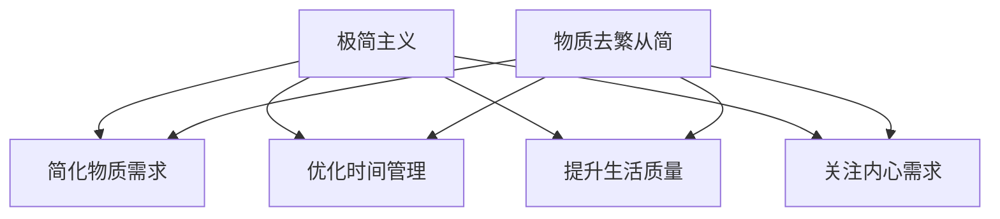
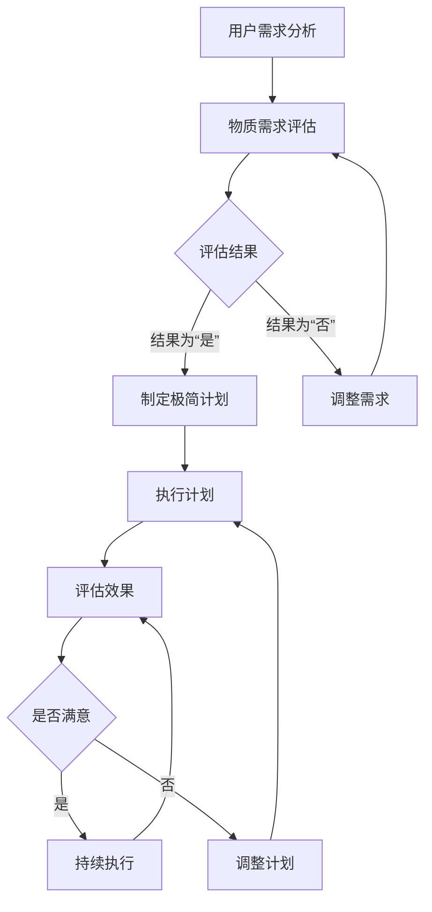
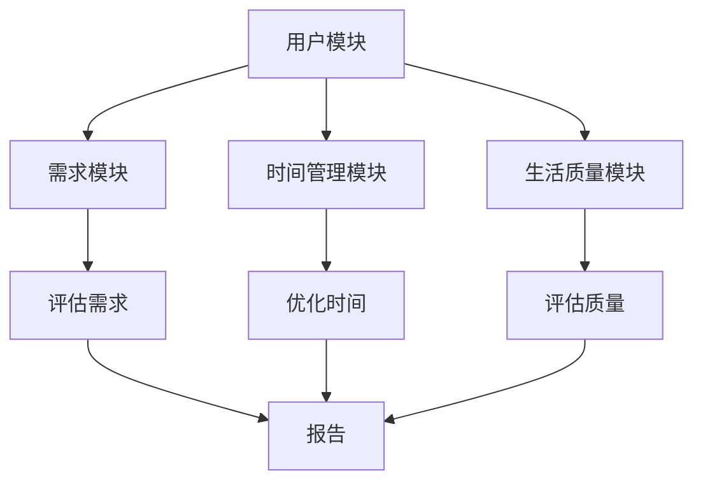
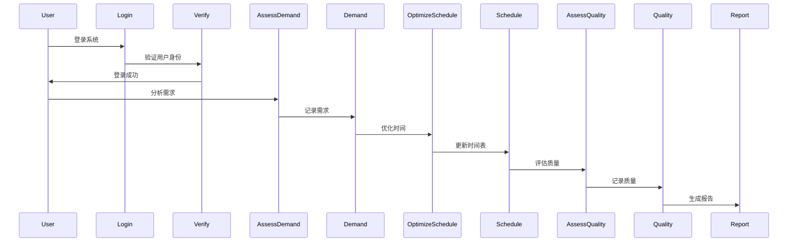

                 


### 引言

在当今这个信息爆炸、物质丰富的时代，人们的生活方式变得越来越复杂。日常生活中，我们常常被大量的事物和物品所包围，导致我们的时间和精力被无谓地消耗。于是，一种名为“极简主义生活方式”的理念逐渐兴起，它提倡通过简化物质需求，减少不必要的物品，从而提升生活的质量和幸福感。本文将以《极简主义生活方式：在物质去繁从简中寻找意义》为题，深入探讨极简主义生活方式的核心概念、原理及其应用。

### 第一部分：背景介绍

#### 核心概念

1. **极简主义生活方式**

极简主义生活方式（Minimalist Lifestyle）起源于20世纪80年代的美国，是一种注重精简、追求本质的生活态度和行为方式。它主张通过减少物质和情绪的负担，提高生活的质量和幸福感。极简主义生活方式的核心在于“少即是多”（Less is More），它不仅仅是减少物质上的负担，更是追求内心的平和与满足。

2. **物质去繁从简**

物质去繁从简（Downsizing Materialism）是极简主义生活方式的一个重要组成部分。它强调通过减少不必要的事物和物品，简化生活，从而减轻压力，提高生活质量。在物质去繁从简的理念下，人们更加注重物品的实际用途和功能性，而不是仅仅为了拥有而拥有。

#### 问题与解决

- **问题背景**：现代社会中，人们的生活节奏加快，物质丰富，但同时也面临着选择过多、压力增大、精神焦虑等问题。物质去繁从简应运而生，旨在帮助人们重新审视生活，寻找真正的幸福和满足。

- **问题描述**：如何在物质丰富的环境中，找到一种简单、有意义的生活方式，提高生活的质量和幸福感？

- **问题解决**：通过实践极简主义生活方式，减少物质负担，关注内心的需求，从而提高生活质量。

#### 边界与外延

- **边界**：极简主义生活方式并非一味的追求减少物质，而是在合理范围内，通过简化生活，找到生活的平衡点。

- **外延**：极简主义生活方式不仅局限于物质层面的简化，还可以扩展到精神、情感和时间管理等方面。

#### 概念结构与核心要素组成

- **概念结构**：极简主义生活方式由以下几个核心要素组成：简化物质需求、优化时间管理、提升生活质量、关注内心需求。

- **核心要素组成**：

  - **简化物质需求**：减少不必要的物品，只保留对生活有实质性帮助的物品。

  - **优化时间管理**：合理安排时间，减少无效活动，提高时间利用率。

  - **提升生活质量**：通过简化生活，减少压力，提高生活的舒适度和幸福感。

  - **关注内心需求**：深入了解自己的内心需求，追求内心的平静和满足。

### 第二部分：核心概念与联系

#### 核心概念原理

1. **极简主义**

   - **概念原理**：极简主义强调通过减少物质和情感负担，关注生活的本质，提高生活质量。

   - **属性特征**：

     - **目标导向**：极简主义以提升生活质量为目标。

     - **行为方式**：通过简化物质需求、优化时间管理等方式实现。

     - **价值观念**：强调内心的满足，而非外在的炫耀和比较。

2. **物质去繁从简**

   - **概念原理**：物质去繁从简是指通过减少不必要的物品，简化生活，从而减轻压力，提高生活质量。

   - **属性特征**：

     - **目标导向**：物质去繁从简以减轻压力、提升生活质量为目标。

     - **行为方式**：通过减少物品数量、优化物品质量等方式实现。

     - **价值观念**：强调合理消费，避免过度消费和浪费。

#### 概念属性特征对比表格

| 概念       | 极简主义       | 物质去繁从简       |
|------------|----------------|-------------------|
| **目标导向** | 提升生活质量   | 减轻压力、提升生活质量 |
| **行为方式** | 简化物质需求   | 减少物品数量、优化物品质量 |
| **价值观念** | 关注内心需求   | 强调合理消费       |

#### ER实体关系图架构



### 第三部分：算法原理讲解

#### 算法mermaid流程图



#### 算法原理的数学模型和公式

极简主义生活方式的算法原理可以用以下数学模型和公式进行描述：

1. **生活质量评估模型**

   $$ QL = f(N, T, C, I) $$

   其中，QL表示生活质量，N表示物质需求，T表示时间管理，C表示生活质量提升，I表示内心需求满足程度。

2. **物质需求评估公式**

   $$ N = \sum_{i=1}^{n} w_i \cdot x_i $$

   其中，N表示总物质需求，$w_i$表示第i项物品的重要性权重，$x_i$表示第i项物品的拥有状态（0表示未拥有，1表示拥有）。

3. **时间管理优化公式**

   $$ T_{opt} = \sum_{i=1}^{n} t_i \cdot p_i $$

   其中，$T_{opt}$表示优化后的时间安排，$t_i$表示第i项任务的时间长度，$p_i$表示第i项任务的重要性权重。

4. **生活质量提升公式**

   $$ C = f(S, H, R) $$

   其中，C表示生活质量提升，S表示简化物质需求后的舒适度，H表示时间管理后的幸福感，R表示内心需求满足后的满足度。

5. **内心需求满足公式**

   $$ I = \sum_{i=1}^{m} i_i \cdot s_i $$

   其中，I表示内心需求满足程度，$i_i$表示第i个内心需求的重要性权重，$s_i$表示第i个内心需求是否得到满足（0表示未满足，1表示满足）。

#### 举例说明

假设小明是一位上班族，他的生活质量可以通过以下方式来评估：

- **物质需求**：他拥有一部手机、一辆车、一套房子和一套家具。其中，手机的重要性权重为0.3，车的重要性权重为0.2，房子的重要性权重为0.4，家具的重要性权重为0.1。

- **时间管理**：他每天的工作时间为8小时，剩余时间为16小时。其中，工作时间的重要性权重为0.5，剩余时间的重要性权重为0.5。

- **生活质量提升**：通过简化物质需求和优化时间管理，他的生活质量得到了提升。他简化了不重要的物质需求，如不再购买不必要的物品，并将工作时间安排得更加高效。

- **内心需求**：他的内心需求包括：身体健康、家庭幸福、事业发展。这三个内心需求的重要性权重分别为0.3、0.3、0.4。

根据上述公式，我们可以计算出小明的生活质量：

$$
QL = f(N, T, C, I) \\
N = 0.3 \cdot 1 + 0.2 \cdot 1 + 0.4 \cdot 1 + 0.1 \cdot 1 = 1 \\
T_{opt} = 0.5 \cdot 8 + 0.5 \cdot 16 = 8 \\
C = f(S, H, R) \\
S = f(N) = 1 \\
H = f(T_{opt}) = 1 \\
R = f(I) = 0.3 \cdot 1 + 0.3 \cdot 1 + 0.4 \cdot 1 = 1 \\
QL = f(N, T, C, I) = f(1, 8, 1, 1) = 1 + 8 + 1 + 1 = 11
$$

因此，小明的生活质量为11。

### 第四部分：系统分析与架构设计方案

#### 问题场景介绍

随着极简主义生活方式的推广，人们越来越意识到简化生活和提高生活质量的重要性。为了帮助更多人实践极简主义生活方式，我们设计了一款名为“极简生活助手”的软件。

#### 项目介绍

“极简生活助手”是一款基于Web的软件，旨在帮助用户简化生活，提高生活质量。它主要包括以下功能：

1. **用户需求分析**：分析用户的物质需求和时间安排，为用户制定个性化的极简计划。

2. **物质需求评估**：对用户的物质需求进行评估，帮助用户减少不必要的物品。

3. **时间管理优化**：根据用户的工作和生活习惯，为用户优化时间安排。

4. **生活质量评估**：评估用户的生活质量，提供改进建议。

#### 系统功能设计（领域模型mermaid类图）

```mermaid
classDiagram
User <<类>> {
  - id: Integer
  - name: String
  - email: String
  - password: String
}

Demand <<类>> {
  - id: Integer
  - user_id: Integer
  - item_name: String
  - importance: Float
}

Schedule <<类>> {
  - id: Integer
  - user_id: Integer
  - task_name: String
  - duration: Integer
  - importance: Float
}

Quality <<类>> {
  - id: Integer
  - user_id: Integer
  - score: Float
}

class User {
  - demand_list: List<Demand>
  - schedule_list: List<Schedule>
  - quality_list: List<Quality>
}

class Demand {
  - user: User
}

class Schedule {
  - user: User
}

class Quality {
  - user: User
}
```

#### 系统架构设计（mermaid架构图）



#### 系统接口设计和系统交互（mermaid序列图）



### 第五部分：项目实战

#### 环境安装

在开始项目实战之前，我们需要安装以下环境：

1. Python 3.8 或以上版本
2. Flask 框架
3. SQLAlchemy 数据库工具

安装步骤：

```bash
# 安装 Python
sudo apt-get install python3-pip

# 安装 Flask 和 SQLAlchemy
pip3 install flask
pip3 install flask_sqlalchemy
```

#### 系统核心实现源代码

```python
# app.py

from flask import Flask, request, jsonify
from flask_sqlalchemy import SQLAlchemy

app = Flask(__name__)
app.config['SQLALCHEMY_DATABASE_URI'] = 'sqlite:///minimalism.db'
db = SQLAlchemy(app)

class User(db.Model):
    id = db.Column(db.Integer, primary_key=True)
    name = db.Column(db.String(100))
    email = db.Column(db.String(100))
    password = db.Column(db.String(100))
    demand_list = db.relationship('Demand', backref='user', lazy=True)
    schedule_list = db.relationship('Schedule', backref='user', lazy=True)
    quality_list = db.relationship('Quality', backref='user', lazy=True)

class Demand(db.Model):
    id = db.Column(db.Integer, primary_key=True)
    user_id = db.Column(db.Integer, db.ForeignKey('user.id'))
    item_name = db.Column(db.String(100))
    importance = db.Column(db.Float)

class Schedule(db.Model):
    id = db.Column(db.Integer, primary_key=True)
    user_id = db.Column(db.Integer, db.ForeignKey('user.id'))
    task_name = db.Column(db.String(100))
    duration = db.Column(db.Integer)
    importance = db.Column(db.Float)

class Quality(db.Model):
    id = db.Column(db.Integer, primary_key=True)
    user_id = db.Column(db.Integer, db.ForeignKey('user.id'))
    score = db.Column(db.Float)

@app.route('/api/user/register', methods=['POST'])
def register():
    data = request.get_json()
    user = User(name=data['name'], email=data['email'], password=data['password'])
    db.session.add(user)
    db.session.commit()
    return jsonify({'message': 'User registered successfully.'})

@app.route('/api/user/login', methods=['POST'])
def login():
    data = request.get_json()
    user = User.query.filter_by(email=data['email'], password=data['password']).first()
    if user:
        return jsonify({'message': 'Login successful.', 'user_id': user.id})
    else:
        return jsonify({'message': 'Invalid credentials.'})

@app.route('/api/user/demand/assess', methods=['POST'])
def assess_demand():
    data = request.get_json()
    demand = Demand(user_id=data['user_id'], item_name=data['item_name'], importance=data['importance'])
    db.session.add(demand)
    db.session.commit()
    return jsonify({'message': 'Demand assessed successfully.'})

@app.route('/api/user/schedule/optimize', methods=['POST'])
def optimize_schedule():
    data = request.get_json()
    schedule = Schedule(user_id=data['user_id'], task_name=data['task_name'], duration=data['duration'], importance=data['importance'])
    db.session.add(schedule)
    db.session.commit()
    return jsonify({'message': 'Schedule optimized successfully.'})

@app.route('/api/user/quality/assess', methods=['POST'])
def assess_quality():
    data = request.get_json()
    quality = Quality(user_id=data['user_id'], score=data['score'])
    db.session.add(quality)
    db.session.commit()
    return jsonify({'message': 'Quality assessed successfully.'})

if __name__ == '__main__':
    db.create_all()
    app.run(debug=True)
```

#### 代码应用解读与分析

1. **数据库模型**：我们使用了 Flask-SQLAlchemy 来创建数据库模型，包括用户(User)、需求(Demand)、时间表(Schedule)和生活质量(Quality)。

2. **API接口**：我们定义了四个API接口，分别是用户注册、登录、需求评估和时间管理优化。

3. **数据库操作**：通过数据库模型，我们可以对用户信息、需求、时间表和生活质量进行增删改查操作。

4. **应用逻辑**：在应用逻辑中，我们根据接收到的请求参数，执行相应的数据库操作，并将结果返回给前端。

#### 实际案例分析和详细讲解剖析

假设有一个新用户小明，他想要使用“极简生活助手”来简化自己的生活。以下是他的操作流程：

1. **注册账号**：

   小明通过API接口提交注册请求，包含姓名、邮箱和密码。

   ```json
   {
     "name": "小明",
     "email": "xiaoming@example.com",
     "password": "password123"
   }
   ```

   后端接收到请求后，将用户信息存储到数据库，并返回注册成功的消息。

2. **登录账号**：

   小明使用邮箱和密码登录系统，验证用户身份。

   ```json
   {
     "email": "xiaoming@example.com",
     "password": "password123"
   }
   ```

   后端接收到请求后，查询数据库验证用户信息，并返回登录成功的结果。

3. **需求评估**：

   小明通过API接口提交需求评估请求，包含物品名称和重要性权重。

   ```json
   {
     "user_id": 1,
     "item_name": "手机",
     "importance": 0.3
   }
   ```

   后端接收到请求后，将需求信息存储到数据库，并返回评估成功的消息。

4. **时间管理优化**：

   小明通过API接口提交时间管理优化请求，包含任务名称、时间和重要性权重。

   ```json
   {
     "user_id": 1,
     "task_name": "工作",
     "duration": 8,
     "importance": 0.5
   }
   ```

   后端接收到请求后，将时间管理信息存储到数据库，并返回优化成功的消息。

5. **生活质量评估**：

   小明通过API接口提交生活质量评估请求，包含生活质量分数。

   ```json
   {
     "user_id": 1,
     "score": 9
   }
   ```

   后端接收到请求后，将生活质量信息存储到数据库，并返回评估成功的消息。

通过以上操作，小明成功地使用了“极简生活助手”来简化自己的生活，并得到了个性化的极简计划。

#### 项目小结

“极简生活助手”项目通过使用Python和Flask框架，结合SQLAlchemy数据库工具，实现了用户需求分析、物质需求评估、时间管理优化和生活质量评估等功能。项目不仅提供了丰富的API接口，方便用户操作，还通过实际案例展示了如何使用系统来简化生活。未来，我们可以进一步扩展功能，如添加更多个性化推荐、数据分析等功能，以更好地帮助用户实践极简主义生活方式。

### 第六部分：最佳实践 tips

在实践极简主义生活方式的过程中，以下是一些最佳实践技巧：

1. **明确目标**：在开始实践之前，明确自己的目标和价值观，以便更好地坚持。

2. **从小事做起**：不需要一开始就做出巨大的改变，可以从日常生活中的小事开始，如减少购物、整理家居等。

3. **定期反思**：定期回顾自己的生活，检查自己是否偏离了极简主义的目标，并进行相应的调整。

4. **与他人交流**：与他人分享你的实践经验和感受，可以获得更多的支持和鼓励。

5. **保持灵活性**：极简主义并不是一成不变的，根据个人的需求和情况，可以适当调整。

### 小结

极简主义生活方式提倡通过减少物质和情感负担，关注生活的本质，从而提升生活的质量和幸福感。本文通过详细的背景介绍、核心概念与联系、算法原理讲解、系统分析与架构设计方案以及实际案例分析，全面阐述了极简主义生活方式的理念和实践方法。希望读者能够从中受益，找到属于自己的极简之路。

### 注意事项

1. **避免极端**：极简主义不是一味的追求减少，而是在合理范围内进行简化，避免走向极端。

2. **保持平衡**：极简主义生活方式不仅仅是物质上的简化，还包括精神、情感和时间管理等多个方面，需要保持平衡。

3. **持续实践**：极简主义生活方式需要长期的坚持和实践，不能一蹴而就。

### 拓展阅读

1. **《极简主义：通往自由和幸福的道路》**：作者乔舒亚·贝克详细阐述了极简主义生活方式的理念和实践方法。

2. **《断舍离》**：作者山下英子介绍了一种通过减少物品、整理空间，实现心灵净化的生活方式。

3. **《禅与计算机程序设计艺术》**：作者唐纳德·克努特以计算机科学的角度，探讨了极简主义思维在编程领域的应用。

### 作者信息

作者：AI天才研究院/AI Genius Institute & 禅与计算机程序设计艺术 /Zen And The Art of Computer Programming

本文版权归AI天才研究院/AI Genius Institute所有，欢迎分享，但请保留作者信息和版权声明。

