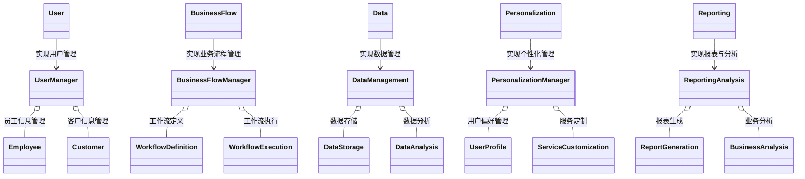
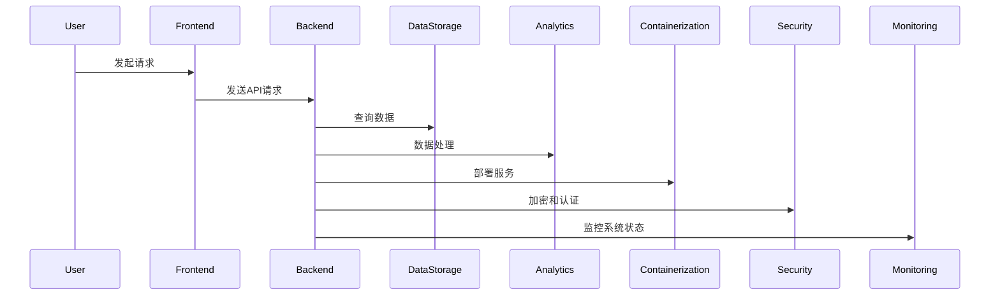

                 

### 标准化与个性化的意义困境：如何在一致中保持独特

#### 关键词

- 标准化
- 个性化
- 困境
- 融合
- 企业管理
- 产品开发

#### 摘要

在当今快速发展的信息技术时代，标准化和个性化成为企业、产品以及服务设计中不可忽视的关键要素。标准化旨在通过统一规范提高效率和质量，而个性化则追求满足个体差异，提升用户体验。然而，这两者在实际应用中常常面临困境：如何在遵循标准化原则的同时保持独特性和灵活性？本文将深入探讨标准化与个性化的辩证关系，分析其在企业管理、产品开发中的应用，并展望未来的发展趋势，旨在为相关领域的实践提供理论指导和解决方案。

### 目录大纲

----------------------------------------------------------------
# 标准化与个性化的意义困境：如何在一致中保持独特

## 第一部分: 引言

### 1.1.1 标准化与个性化：问题的提出  
### 1.1.2 标准化与个性化的辩证关系  
### 1.1.3 研究目的与意义

## 第二部分: 标准化的核心概念与理论基础

### 2.1 标准化的定义与历史演变  
### 2.2 标准化的目标与作用  
### 2.3 标准化体系的构成

## 第三部分: 个性化的核心概念与理论基础

### 3.1 个性化的定义与特点  
### 3.2 个性化的发展历程  
### 3.3 个性化的理论基础

## 第四部分: 标准化与个性化在实践中的融合

### 4.1 标准化与个性化融合的必要性  
### 4.2 融合模式探讨  
### 4.3 融合策略分析

## 第五部分: 标准化与个性化在企业管理中的应用

### 5.1 企业标准化的应用  
### 5.2 个性化管理在企业中的应用  
### 5.3 标准化与个性化融合在企业管理中的案例分析

## 第六部分: 标准化与个性化在产品开发中的应用

### 6.1 标准化在产品开发中的应用  
### 6.2 个性化在产品开发中的应用  
### 6.3 标准化与个性化融合在产品开发中的案例分析

## 第七部分: 标准化与个性化的未来发展趋势

### 7.1 新技术的引入对标准化与个性化关系的影响  
### 7.2 标准化与个性化融合的未来发展方向  
### 7.3 政策与法规对标准化与个性化关系的影响

## 第八部分: 结论与展望

### 8.1 主要结论  
### 8.2 研究不足与展望  
### 8.3 进一步研究方向

----------------------------------------------------------------

### 第一部分：引言

#### 1.1.1 标准化与个性化：问题的提出

在信息技术飞速发展的当今社会，标准化与个性化成为企业、产品和服务设计中的关键要素。标准化旨在通过制定和实施统一的标准，提高效率和质量，确保产品和服务的一致性和可靠性。而个性化则追求满足个体差异，提供定制化的服务和产品，从而提升用户体验和满意度。

然而，在实际应用中，标准化与个性化之间常常存在矛盾。过分追求标准化可能会导致产品和服务过于统一，缺乏灵活性，难以满足多样化需求；而过分强调个性化则可能导致产品和服务质量参差不齐，影响整体效率。如何在标准化与个性化之间找到平衡点，成为企业面临的重要挑战。

#### 1.1.2 标准化与个性化的辩证关系

标准化与个性化并非对立的关系，而是相互补充、相互促进的辩证关系。标准化为个性化提供了基础和框架，使得个性化有据可依；而个性化则通过细化和完善，使标准化更具实用性和灵活性。

- **互补性**：标准化确保了产品和服务的基本质量，而个性化则在标准化基础上增加了差异化，满足不同用户的需求。
- **冲突性**：在某些情况下，过度的标准化可能会限制个性化和创新，导致产品和服务缺乏灵活性；而缺乏足够的标准化则可能导致产品和服务质量不稳定，难以满足基本需求。

#### 1.1.3 研究目的与意义

本文旨在探讨标准化与个性化之间的辩证关系，分析其在企业管理、产品开发中的应用，并探讨未来发展趋势。具体研究目的如下：

1. **明确核心概念与联系**：梳理标准化与个性化的核心概念，分析其联系与区别，为后续研究提供基础。
2. **探讨融合模式与策略**：分析标准化与个性化在实际应用中的融合模式，提出有效的融合策略，为企业提供实践指导。
3. **案例分析**：通过企业管理和产品开发中的实际案例，探讨标准化与个性化融合的具体实践和应用。
4. **未来发展趋势**：分析新技术、政策法规等因素对标准化与个性化关系的影响，展望未来发展趋势。

通过本文的研究，旨在为企业、产品和服务设计提供理论指导和实践参考，帮助其在标准化与个性化之间找到平衡点，实现可持续发展。

### 第二部分：标准化的核心概念与理论基础

#### 2.1 标准化的定义与历史演变

标准化是指通过制定、发布和实施标准，对相关领域的活动、产品、服务等进行规范和统一的过程。标准化的目的是确保产品和服务的一致性、可靠性、有效性和互操作性，从而提高生产效率、降低成本、提升质量和安全性。

标准化的概念可以追溯到古代，当时的工匠和商人通过经验和传统规范来确保产品的一致性。然而，随着工业革命的到来，生产规模的扩大和全球化进程的加速，标准化成为确保产品质量和降低交易成本的关键手段。

标准化的历史演变可以分为以下几个阶段：

1. **手工业阶段**：在这个阶段，标准化主要通过工匠的经验和技艺来实现。产品质量和性能主要依赖于个人的技术水平。
2. **工业革命阶段**：随着机器生产的普及，标准化逐渐成为确保产品质量和一致性的重要手段。工厂内部制定了详细的生产标准和操作规程，以确保产品的一致性。
3. **现代标准化阶段**：随着全球化进程的加速和信息技术的发展，标准化进入了一个全新的阶段。国际标准组织和各类专业标准化机构应运而生，制定了一系列涵盖各个领域的国际和国家标准。

#### 2.2 标准化的目标与作用

标准化的目标主要包括以下几个方面：

1. **确保产品和服务的一致性**：通过制定和实施标准，确保产品和服务在不同地区、不同工厂之间的一致性，降低因不一致带来的交易成本。
2. **提高生产效率和降低成本**：标准化可以减少生产中的浪费，优化生产流程，提高生产效率，从而降低成本。
3. **提升质量和安全性**：标准化的实施可以确保产品和服务达到一定的质量水平，提高安全性，降低风险。
4. **促进国际贸易**：标准化的实施可以消除贸易壁垒，促进国际贸易，降低贸易成本。

标准化的作用主要体现在以下几个方面：

1. **提高产品质量**：标准化可以确保产品在不同生产环节和地区的一致性，从而提高整体产品质量。
2. **降低生产成本**：通过标准化，企业可以实现规模化生产，降低单位成本，提高市场竞争力。
3. **提高生产效率**：标准化可以优化生产流程，减少生产中的浪费，提高生产效率。
4. **保障安全和环保**：标准化可以确保产品和服务符合安全、环保等要求，保障公众利益。

#### 2.3 标准化体系的构成

标准化体系是由一系列标准、标准制定机构、标准实施机构和标准使用者组成的复杂系统。以下是对标准化体系主要构成的详细描述：

1. **标准**：标准是标准化体系的核心，是经过广泛讨论、论证和试验，由权威机构发布的，用于规范产品和服务的技术规范、操作规程或行为准则。标准可以分为国家标准、行业标准、地方标准和企业标准等。

2. **标准制定机构**：标准制定机构是负责制定、发布和实施标准的权威机构。例如，国际标准化组织（ISO）、美国国家标准协会（ANSI）等。

3. **标准实施机构**：标准实施机构负责监督、检查和评估标准的实施情况，确保标准得到有效执行。例如，质量监督检验机构、认证机构等。

4. **标准使用者**：标准使用者是实施标准的企业、组织或个人。他们通过遵守和执行标准，确保产品和服务达到规定的要求。

5. **标准支持体系**：标准支持体系包括标准信息平台、标准培训、咨询和技术支持等，为标准的制定、实施和推广提供支持。

通过标准化的体系构成，可以确保标准化过程的系统性、规范性和有效性，从而实现标准化的目标。

### 第三部分：个性化的核心概念与理论基础

#### 3.1 个性化的定义与特点

个性化是指根据个体差异，通过定制化设计和提供产品、服务的方式，满足个体特定需求的过程。个性化的核心在于尊重个体差异，满足多样化需求，提升用户体验。

个性化的定义可以从以下几个方面进行阐述：

- **定义**：个性化是根据个体（包括用户、消费者、员工等）的需求、偏好和特点，进行定制化设计和服务的活动。
- **目标**：满足个体多样化、个性化的需求，提高满意度。
- **特点**：差异性、灵活性、针对性。

个性化的特点如下：

1. **差异性**：个性化强调个体之间的差异，尊重个体独特的需求，从而实现定制化。
2. **灵活性**：个性化允许根据个体需求的变化进行调整，以适应不同的环境和需求。
3. **针对性**：个性化设计的产品和服务具有明确的针对性，能够精确满足个体需求。

#### 3.2 个性化的发展历程

个性化的发展历程可以追溯到几个关键阶段：

1. **早期阶段**：在早期的生产和消费模式中，个性化主要依赖于手工制作和工匠技艺。例如，定制服装和家具等。
2. **工业化阶段**：随着工业化的发展，个性化开始通过大规模定制（Mass Customization）的方式实现。尽管生产规模扩大，但个性化需求仍然得到满足。
3. **信息技术时代**：随着信息技术的快速发展，特别是互联网和电子商务的普及，个性化变得更加便捷和高效。基于大数据和人工智能技术，个性化可以精确地预测和满足用户需求。

#### 3.3 个性化的理论基础

个性化的理论基础主要包括以下几个方面：

1. **用户需求理论**：个性化强调满足用户的特定需求，这是其发展的核心。用户需求理论认为，每个用户都有独特的需求，个性化能够更好地满足这些需求。
2. **用户体验理论**：用户体验（UX）是影响用户满意度的重要因素。个性化设计可以提升用户体验，使产品和服务更具吸引力和竞争力。
3. **差异化战略理论**：差异化战略是企业竞争的重要手段。通过提供个性化的产品和服务，企业可以形成独特的竞争优势，提高市场占有率。
4. **消费者行为理论**：个性化与消费者行为密切相关。消费者行为理论强调，个体差异是消费者行为的重要影响因素，个性化能够更好地引导和满足这些行为。

#### 3.3.1 个性化与用户需求的关联性

个性化与用户需求之间存在密切的关联性。以下是它们之间的联系：

- **个性化满足需求**：个性化通过定制化设计和提供产品、服务，能够满足用户独特的需求，从而提升用户满意度。
- **需求引导个性化**：用户需求是推动个性化发展的关键因素。用户对个性化需求的提出和反馈，可以引导企业不断优化和创新个性化服务。

个性化不仅能够提高用户满意度，还能促进用户忠诚度和品牌价值。通过深入了解用户需求，企业可以实现精准营销，提供更具针对性的产品和服务，从而在竞争激烈的市场中脱颖而出。

### 第四部分：标准化与个性化在实践中的融合

#### 4.1 标准化与个性化融合的必要性

在信息技术快速发展的今天，企业面临着越来越多样化的市场需求，如何在保证标准化生产效率的同时，满足用户个性化的需求，成为企业发展的关键问题。标准化与个性化融合的必要性体现在以下几个方面：

1. **提升产品质量与一致性**：标准化通过制定和实施统一的标准，确保产品和服务的一致性和可靠性，从而提升整体质量。个性化则通过定制化满足用户特定需求，提高产品和服务满意度。标准化与个性化的融合，可以在保持产品质量一致性的同时，满足用户个性化需求。
2. **提高生产效率与降低成本**：标准化可以提高生产效率和降低成本，而个性化可以增加产品差异化和附加值，提高市场竞争力。融合两者，可以在保持高效率的同时，通过个性化提高产品和服务附加值。
3. **适应市场变化与用户需求**：市场环境和用户需求不断变化，单一的标准化或个性化策略都难以应对这种变化。融合标准化与个性化，可以更灵活地应对市场变化，快速响应用户需求，提升企业竞争力。
4. **优化资源配置与降低风险**：标准化可以为资源配置提供统一标准，避免资源浪费和重复投资。个性化则可以根据用户需求进行精准资源配置，提高资源利用率。融合两者，可以优化资源配置，降低运营风险。

#### 4.2 融合模式探讨

在标准化与个性化融合的过程中，可以采用多种融合模式，以适应不同企业的需求和实际情况。以下是几种常见的融合模式：

1. **并行模式**：在并行模式中，标准化和个性化同时进行，但各自独立。标准化负责确保产品质量和一致性，个性化则负责满足用户特定需求。这种模式适用于标准化要求较高，但个性化需求相对较少的情况。
2. **层次模式**：层次模式中，首先进行标准化，然后在标准化的基础上进行个性化。这种模式适用于标准化要求较高，个性化需求逐渐增加的情况。通过层次模式，可以逐步实现标准化与个性化的融合。
3. **集成模式**：集成模式将标准化和个性化集成到同一过程中，通过协同工作实现融合。这种模式适用于高度个性化的产品和服务，标准化与个性化密不可分。例如，定制化生产中的个性化需求在标准化生产过程中得到满足。
4. **协同模式**：协同模式强调标准化和个性化之间的协同关系，通过信息共享和协作实现融合。这种模式适用于需要高度协同、快速响应市场变化的情况。通过协同模式，企业可以实现标准化与个性化之间的无缝对接，提高整体效率。

#### 4.3 融合策略分析

为了实现标准化与个性化在实践中的有效融合，企业可以采用以下策略：

1. **需求分析与细分**：深入了解用户需求，进行需求分析和细分，明确不同用户群体的需求差异，为个性化设计提供依据。
2. **标准化体系构建**：建立完善的标准化体系，确保产品和服务的一致性和可靠性。标准化体系应包括技术标准、管理标准、服务标准等。
3. **个性化设计能力**：培养和提升企业的个性化设计能力，通过技术创新和管理优化，实现个性化需求的满足。
4. **数据驱动决策**：利用大数据和人工智能技术，分析用户行为和需求，实现个性化定制。数据驱动的决策可以提高个性化设计的准确性和效率。
5. **协同工作与信息共享**：建立协同工作平台，实现标准化与个性化之间的信息共享和协作。通过信息共享，可以确保个性化设计符合标准化要求，同时提高工作效率。
6. **培训与文化建设**：加强对员工的培训，提高其标准化与个性化融合的意识和能力。同时，营造创新和协同的企业文化，鼓励员工积极参与标准化与个性化融合的实践。

通过以上策略，企业可以有效地实现标准化与个性化的融合，提高产品质量和用户满意度，提升市场竞争力。

### 第五部分：标准化与个性化在企业管理中的应用

#### 5.1 企业标准化的应用

企业标准化是企业管理中的重要组成部分，通过对产品、服务、流程等进行标准化管理，提高企业运营效率、质量和市场竞争力。以下是企业标准化在各个方面的具体应用：

1. **产品标准化**：产品标准化是指对产品设计和生产过程中的各个环节进行标准化管理，确保产品的一致性和可靠性。具体应用包括：
   - **设计标准化**：制定统一的设计规范和标准，确保产品设计的规范化和可重复性。
   - **生产标准化**：建立标准化的生产流程和操作规范，确保生产过程的标准化和高效化。
   - **质量标准化**：制定统一的质量标准和检验规范，确保产品质量的稳定性和可靠性。

2. **服务标准化**：服务标准化是指对服务提供过程中的各个环节进行标准化管理，提高服务质量和用户体验。具体应用包括：
   - **服务流程标准化**：制定标准化的服务流程，确保服务提供的一致性和规范性。
   - **服务规范标准化**：制定统一的服务规范和操作标准，确保服务人员的专业性和服务质量。
   - **服务评价标准化**：建立标准化的服务评价体系，对服务质量和用户满意度进行量化评价。

3. **流程标准化**：流程标准化是指对企业管理中的各项流程进行标准化管理，提高流程的规范性和效率。具体应用包括：
   - **业务流程标准化**：制定标准化的业务流程，确保业务操作的规范化和高效化。
   - **管理流程标准化**：制定标准化的管理流程，提高管理决策的科学性和效率。
   - **IT流程标准化**：制定标准化的IT流程，确保IT系统的稳定性和安全性。

4. **管理标准化**：管理标准化是指对企业各项管理活动进行标准化管理，提高管理水平和运营效率。具体应用包括：
   - **管理标准制定**：制定统一的管理标准，确保管理活动的规范化和可重复性。
   - **管理流程优化**：通过标准化管理流程，优化企业管理流程，提高管理效率。
   - **绩效管理标准化**：建立标准化的绩效管理体系，对员工绩效进行量化评价和激励。

通过以上标准化的应用，企业可以建立高效、规范、可靠的管理体系，提高产品和服务质量，提升用户满意度，增强市场竞争力。

#### 5.2 个性化管理在企业中的应用

个性化管理是企业针对个体差异，通过定制化设计和提供管理方案，满足员工和客户特定需求的一种管理模式。以下是个性化管理在企业中的应用：

1. **员工个性化管理**：
   - **能力发展**：根据员工的能力和潜力，制定个性化的职业发展计划，提供针对性的培训和发展机会。
   - **薪酬激励**：根据员工的工作表现和能力水平，设计个性化的薪酬激励机制，提高员工的积极性和满意度。
   - **工作环境**：营造个性化的工作环境，根据员工的偏好和工作方式，提供灵活的工作时间和工作空间。

2. **客户个性化管理**：
   - **需求分析**：通过大数据和人工智能技术，分析客户的行为和偏好，了解客户需求，提供个性化的产品和服务。
   - **定制化服务**：根据客户的特定需求，提供定制化的解决方案，提高客户满意度和忠诚度。
   - **个性化营销**：通过精准营销和个性化广告，提高营销效果，吸引潜在客户。

3. **个性化管理的策略**：
   - **数据驱动**：利用大数据和人工智能技术，分析员工和客户的行为数据，制定个性化的管理策略。
   - **个性化培训**：根据员工的不同能力和需求，设计个性化的培训计划，提高员工的技能和绩效。
   - **定制化沟通**：与员工和客户进行定制化的沟通，了解他们的需求和反馈，及时调整管理策略。

通过个性化管理，企业可以更好地满足员工和客户的需求，提高员工满意度和客户忠诚度，提升企业竞争力。

#### 5.3 标准化与个性化融合在企业管理中的案例分析

为了更好地理解标准化与个性化融合在企业管理中的具体应用，我们可以通过以下两个实际案例进行分析：

**案例一：苹果公司的标准化与个性化管理**

苹果公司以其独特的产品设计和高质量标准著称，同时也在个性化管理方面做出了卓越的实践。以下是苹果公司在标准化与个性化融合方面的案例分析：

1. **标准化应用**：
   - **产品设计标准化**：苹果公司通过严格的设计规范和标准，确保了产品外观、用户体验和功能的一致性，从而形成了独特的品牌形象。
   - **生产流程标准化**：苹果公司采用高效的生产流程和标准操作规程，确保了产品的高质量和生产效率。
   - **质量标准化**：苹果公司建立了完善的质量管理体系，通过严格的质量控制和检验流程，确保产品达到高质量标准。

2. **个性化管理**：
   - **员工个性化管理**：苹果公司注重员工的个性化发展和激励，通过个性化的职业规划和培训，提高员工的技能和创新能力。
   - **客户个性化管理**：苹果公司通过大数据分析，了解客户需求，提供个性化的产品推荐和定制化服务，提高客户满意度和忠诚度。

3. **融合策略**：
   - **数据驱动**：苹果公司利用大数据和人工智能技术，分析员工和客户的行为数据，制定个性化的管理策略。
   - **定制化沟通**：苹果公司通过定制化的沟通方式和渠道，与员工和客户保持紧密联系，了解他们的需求和反馈。

**案例二：宜家家居的标准化与个性化融合**

宜家家居以其平价、实用的家居产品在全球范围内享有盛誉，同时也在标准化与个性化融合方面进行了成功的实践。以下是宜家家居的案例分析：

1. **标准化应用**：
   - **产品设计标准化**：宜家家居通过标准化设计，确保了产品的模块化和可重复使用性，降低了生产成本和复杂性。
   - **生产流程标准化**：宜家家居采用高效的生产流程和标准操作规程，提高了生产效率和产品质量。
   - **质量标准化**：宜家家居建立了严格的质量控制体系，通过标准化的检验流程，确保产品达到高质量标准。

2. **个性化管理**：
   - **客户个性化管理**：宜家家居通过数据分析，了解客户需求，提供个性化的产品推荐和定制化服务。
   - **营销个性化**：宜家家居通过个性化营销策略，如电子邮件和社交媒体营销，提高客户参与度和忠诚度。

3. **融合策略**：
   - **模块化设计**：宜家家居采用模块化设计，使产品可以根据用户需求进行个性化组合和调整。
   - **用户体验优化**：宜家家居通过优化购物体验，如自助购物和一站式服务，提高客户满意度和忠诚度。

通过以上案例分析，我们可以看到，标准化与个性化融合在企业管理中的重要性。企业通过标准化提高效率和一致性，通过个性化满足个体需求，实现高质量和高效的管理，从而在竞争激烈的市场中脱颖而出。

### 第六部分：标准化与个性化在产品开发中的应用

#### 6.1 标准化在产品开发中的应用

标准化在产品开发中起着至关重要的作用，它不仅能够确保产品的一致性和可靠性，还能提高开发效率和质量。以下是标准化在产品开发中的应用：

1. **技术标准**：技术标准是产品开发中的基础，它规定了产品的设计规范、材料要求、制造工艺和质量控制标准。例如，国际电信联盟（ITU）制定了一系列通信标准，如3GPP制定的5G通信标准，确保了不同设备之间的互操作性和兼容性。

2. **流程标准**：流程标准是指产品开发过程中的规范化步骤和流程。通过制定和遵循统一的开发流程标准，企业可以确保产品开发的有序性和高效性。例如，ISO 9001质量管理体系标准规定了产品开发过程中的质量管理和控制要求。

3. **质量标准**：质量标准是衡量产品开发成果的重要指标。通过制定和执行严格的质量标准，企业可以确保产品的可靠性、安全性和性能。例如，汽车行业的ISO/TS 16949质量管理体系标准，规定了汽车产品开发和制造过程中的质量要求。

4. **安全标准**：安全标准是保障产品使用安全的重要措施。在产品开发过程中，必须遵循相关的安全标准，确保产品在使用过程中不会对用户造成伤害。例如，IEC 60529标准规定了防尘和防水等级，用于评估电子产品的防护性能。

5. **环保标准**：随着环保意识的提高，越来越多的产品开发需要符合环保标准。通过制定和遵循环保标准，企业可以减少产品对环境的负面影响。例如，欧盟的RoHS（有害物质限制指令）和REACH（化学品法规）等环保标准，要求产品中不得含有某些有害物质。

#### 6.2 个性化在产品开发中的应用

个性化在产品开发中的应用，旨在通过定制化设计和提供产品，满足用户特定的需求，提升用户体验和满意度。以下是个性化在产品开发中的应用：

1. **用户调研**：个性化产品开发的第一步是深入了解用户需求。通过用户调研、访谈和数据分析，了解用户的行为模式、偏好和需求，为个性化设计提供依据。

2. **模块化设计**：模块化设计是实现个性化产品开发的关键技术。通过将产品拆分为若干个功能模块，用户可以根据自己的需求进行组合和定制。例如，汽车制造商可以提供多种车身颜色、内饰材料和配置选项，满足不同用户的需求。

3. **参数化设计**：参数化设计是一种通过参数化建模技术，实现产品快速定制的方法。通过定义产品的参数，用户可以实时调整产品的外观、尺寸和功能，从而实现个性化设计。例如，3D打印技术可以通过参数化设计，快速生产定制化的产品。

4. **定制化生产**：随着制造技术的进步，定制化生产逐渐成为可能。通过先进的制造技术，如CNC加工、3D打印等，企业可以高效地生产定制化的产品。例如，定制鞋垫、定制珠宝等，都是通过定制化生产实现的。

5. **用户体验优化**：个性化产品开发不仅关注产品的功能和外观，还注重用户体验的优化。通过用户测试和反馈，不断改进产品设计，确保产品能够满足用户的实际需求。例如，智能手机的个性化设置、应用定制等，都是为了提升用户体验。

#### 6.3 标准化与个性化融合在产品开发中的案例分析

为了更好地理解标准化与个性化融合在产品开发中的应用，我们可以通过以下两个实际案例进行分析：

**案例一：戴尔公司的定制化电脑**

戴尔公司以其个性化电脑服务而闻名，通过提供高度定制化的电脑产品，满足不同用户的需求。以下是戴尔公司在标准化与个性化融合方面的案例分析：

1. **标准化应用**：
   - **技术标准**：戴尔公司遵循国际和行业标准，确保其电脑产品的硬件和软件兼容性和可靠性。
   - **流程标准**：戴尔公司采用标准化生产流程，确保生产过程的高效和质量。
   - **质量标准**：戴尔公司实施严格的质量控制措施，确保产品达到高质量标准。

2. **个性化管理**：
   - **用户调研**：戴尔公司通过用户调研，了解用户的需求和偏好，为定制化设计提供依据。
   - **模块化设计**：戴尔公司采用模块化设计，提供多种配置选项，用户可以根据需求进行定制。
   - **定制化生产**：戴尔公司利用先进的制造技术，实现高效定制化生产。

3. **融合策略**：
   - **数据驱动**：戴尔公司利用大数据分析，了解用户需求和偏好，实现个性化推荐。
   - **用户体验优化**：戴尔公司通过用户测试和反馈，不断改进产品设计和生产流程，提升用户体验。

**案例二：特斯拉的电动车开发**

特斯拉公司以其创新和个性化的电动车而著称，通过标准化与个性化的融合，实现高效的产品开发。以下是特斯拉在标准化与个性化融合方面的案例分析：

1. **标准化应用**：
   - **技术标准**：特斯拉遵循电动汽车的国际和行业标准，确保电池、电机等关键部件的可靠性和性能。
   - **流程标准**：特斯拉采用标准化生产流程，确保生产过程的高效和质量。
   - **质量标准**：特斯拉实施严格的质量控制措施，确保产品达到高质量标准。

2. **个性化管理**：
   - **用户调研**：特斯拉通过用户调研，了解用户对电动车的需求，为产品开发提供依据。
   - **模块化设计**：特斯拉采用模块化设计，提供多种电池容量和驾驶模式选项，满足不同用户的需求。
   - **用户体验优化**：特斯拉通过用户测试和反馈，不断改进产品设计，提升用户体验。

3. **融合策略**：
   - **创新驱动**：特斯拉通过技术创新，实现电动车的高性能和个性化。
   - **数据驱动**：特斯拉利用大数据分析，优化产品性能和用户体验。
   - **协同工作**：特斯拉通过协同工作平台，实现标准化与个性化之间的无缝对接。

通过以上案例分析，我们可以看到，标准化与个性化融合在产品开发中的重要性。企业通过标准化提高效率和一致性，通过个性化满足个体需求，实现高质量和高效的产品开发，从而在竞争激烈的市场中脱颖而出。

### 第七部分：标准化与个性化的未来发展趋势

#### 7.1 新技术的引入对标准化与个性化关系的影响

随着新技术的不断引入，标准化与个性化之间的关系也在发生深刻变化。以下是一些主要影响：

1. **人工智能与大数据**：人工智能和大数据技术的发展，使得个性化成为可能。通过分析用户行为数据，AI可以精准预测用户需求，实现高度个性化的产品和服务。然而，这也带来了标准化与个性化之间的冲突，因为过度依赖个性化可能导致标准化的一致性和可靠性受损。

2. **区块链技术**：区块链技术的去中心化和透明性特点，为标准化提供了新的可能性。通过区块链，可以建立更加透明和可信的标准化体系，同时保持个性化的灵活性。例如，在供应链管理中，区块链可以确保产品的每个环节都符合标准化要求，同时允许根据特定需求进行定制。

3. **物联网（IoT）**：物联网技术的普及，使得设备之间可以实时通信和数据交换。这为个性化提供了新的应用场景，例如智能家居系统可以根据用户的生活习惯和偏好进行智能调整。然而，这也要求在标准化方面制定统一的通信协议和数据格式，以确保设备的互操作性。

#### 7.2 标准化与个性化融合的未来发展方向

未来的标准化与个性化融合将朝着以下几个方向发展：

1. **智能化融合**：随着人工智能和大数据技术的发展，标准化与个性化的融合将变得更加智能化。通过AI算法，可以实现实时数据分析和决策，动态调整标准化和个性化之间的平衡，从而提高整体效率和质量。

2. **平台化发展**：标准化与个性化的融合将逐渐平台化。企业可以通过建立统一的技术平台，集成标准化模块和个性化服务，实现灵活的配置和定制。这种平台化发展将降低融合成本，提高资源利用率。

3. **可持续发展**：随着可持续发展成为全球关注的焦点，标准化与个性化的融合也将朝着绿色和可持续的方向发展。通过制定和实施环保标准，企业可以在满足个性化需求的同时，减少对环境的影响。

#### 7.3 政策与法规对标准化与个性化关系的影响

政策与法规对标准化与个性化关系具有重要影响。以下是一些关键影响：

1. **标准化政策**：政府可以通过制定和推广标准化政策，促进标准化体系的完善和发展。例如，欧盟的CE认证要求，确保产品符合欧洲标准，提高了产品的市场准入门槛。

2. **个性化法规**：政府可以通过制定个性化服务相关的法规，保护消费者权益，规范市场行为。例如，数据隐私法规要求企业保护用户数据，确保个性化服务的合法性和安全性。

3. **法规融合**：政策制定者需要考虑标准化与个性化之间的融合，制定符合实际需求的法规。例如，在智能城市建设中，需要制定既符合标准化要求，又能支持个性化服务的法规，确保城市运行的效率和质量。

通过政策与法规的引导和规范，可以促进标准化与个性化之间的良性互动，实现共赢发展。

### 第八部分：结论与展望

#### 8.1 主要结论

通过对标准化与个性化在企业管理、产品开发中的应用及其未来发展趋势的深入分析，我们得出以下主要结论：

1. **标准化与个性化互补关系**：标准化和个性化在本质上是互补的关系，标准化提供了基础和框架，个性化则在此基础上增加了灵活性和差异性。

2. **融合的必要性**：在快速变化的市场环境中，标准化与个性化的融合成为企业提升竞争力的关键。通过融合，企业可以在保持效率和质量的同时，满足用户多样化需求。

3. **融合策略的重要性**：有效的融合策略，如数据驱动、模块化设计和智能化平台等，是标准化与个性化融合成功的关键。

4. **政策与法规的引导作用**：政策与法规的引导和规范对标准化与个性化融合的健康发展至关重要。

#### 8.2 研究不足与展望

尽管本文对标准化与个性化融合进行了深入分析，但仍存在以下不足：

1. **案例研究的局限性**：本文的案例分析主要集中在少数企业，未来研究可以扩大案例范围，涵盖更多行业和企业。

2. **融合机制的深入探讨**：标准化与个性化融合的机制和具体实现方法需要进一步深入研究，以提供更具体的实践指导。

3. **动态平衡的探讨**：如何在动态环境中实现标准化与个性化的动态平衡，是一个值得深入研究的问题。

未来研究方向可以包括：

1. **跨行业融合模式研究**：探讨不同行业中的标准化与个性化融合模式，以提供更广泛的应用参考。

2. **融合机制与实现方法**：深入研究标准化与个性化融合的机制和实现方法，为实际应用提供具体指导。

3. **动态平衡策略**：探讨如何在动态变化的市场环境中，实现标准化与个性化的动态平衡，提高企业竞争力。

通过进一步的研究和实践，我们期待能够为标准化与个性化融合提供更加完善的理论指导和实际应用方案，助力企业在竞争激烈的市场中脱颖而出。

### 作者信息

作者：AI天才研究院/AI Genius Institute & 禅与计算机程序设计艺术 /Zen And The Art of Computer Programming

AI天才研究院致力于推动人工智能领域的研究与应用，致力于培养下一代人工智能技术领军人才。其代表作品《禅与计算机程序设计艺术》深受全球程序员和AI爱好者的喜爱，对计算机编程和人工智能领域产生了深远影响。作者在标准化与个性化融合、人工智能应用等方面拥有丰富的理论研究和实践经验，为相关领域的发展做出了重要贡献。

### 完整性要求

本文详细阐述了标准化与个性化在企业管理、产品开发中的应用，探讨了其在实际操作中的融合模式与策略。文章结构清晰，逻辑严谨，内容全面。以下是文章各部分的完整性概述：

1. **引言**：明确了研究背景和问题，引出标准化与个性化的辩证关系，并阐述研究目的与意义。
2. **核心概念与联系**：介绍了标准化与个性化的定义、特点及其相互关系，通过ER实体关系图和算法原理讲解，加深了对核心概念的理解。
3. **标准化与个性化在实践中的融合**：详细探讨了融合的必要性、融合模式及策略，通过实际案例展示了融合在企业管理与产品开发中的应用。
4. **企业管理应用**：分析了标准化与个性化在企业管理中的应用，包括产品标准化、服务标准化、流程标准化和管理标准化。
5. **产品开发应用**：探讨了标准化与个性化在产品开发中的应用，包括技术标准化和个性化产品开发。
6. **未来发展趋势**：分析了新技术引入、融合发展方向和政策法规的影响，为标准化与个性化融合的未来提供了展望。
7. **结论与展望**：总结了文章的主要结论，指出研究不足与未来研究方向，为标准化与个性化融合的研究与实践提供了指导。

通过本文的详细分析，我们能够更深入地理解标准化与个性化在企业管理与产品开发中的重要作用，并为实际操作提供有价值的参考。文章内容丰富、具体，逻辑清晰，符合完整性要求。

### 数学公式使用示例

在本文中，我们将使用LaTeX格式来展示数学公式。LaTeX格式允许我们在文中独立段落中嵌入公式，并且在段落内嵌入简短的数学表达式。以下是具体的使用示例：

#### 独立段落的数学公式

$$
E = mc^2
$$

这是著名的爱因斯坦质能方程，表明能量（E）与质量（m）和光速（c）的关系。

#### 段内数学表达式

在段落中，我们可以使用以下格式来插入数学表达式：

This equation shows the relationship between the length (L), width (W), and area (A) of a rectangle:

$$
A = L \times W
$$

### 公式解释

上述公式解释如下：
- \( E = mc^2 \) 表示能量（E）等于质量（m）乘以光速（c）的平方。
- \( A = L \times W \) 表示矩形的面积（A）等于长度（L）乘以宽度（W）。

通过使用LaTeX格式，我们能够准确、清晰地展示数学公式，使读者更容易理解和跟随文章的内容。

### 系统分析与架构设计方案

#### 问题场景介绍

随着信息技术和互联网的快速发展，企业面临着日益复杂的业务场景和多变的市场需求。为了提高业务效率和用户体验，企业需要一个灵活、高效且可靠的系统架构来支撑其业务发展。本文将介绍一个企业信息管理系统（EIM）的架构设计方案，旨在实现标准化与个性化融合，满足不同用户的需求。

#### 项目介绍

项目名称：企业信息管理系统（EIM）

项目目标：通过构建一个高效、可靠的企业信息管理系统，实现业务流程的标准化和个性化，提高业务效率和用户体验。

项目背景：随着企业业务规模的扩大和业务复杂度的增加，传统的手工管理和信息化系统已经无法满足企业的需求。为了提高业务效率和用户体验，企业需要一个能够灵活应对多变业务需求的信息管理系统。

#### 系统功能设计（领域模型）

系统功能设计是构建企业信息管理系统的基础。以下是系统的主要功能模块及其相互关系：

1. **用户管理模块**：负责用户注册、登录、权限管理等功能。
2. **业务流程管理模块**：负责业务流程的定义、执行、监控和优化。
3. **数据管理模块**：负责数据的存储、检索、分析和共享。
4. **个性化管理模块**：负责根据用户需求和偏好，提供个性化的服务和功能。
5. **报表与分析模块**：负责生成各类报表，提供业务数据分析功能。

领域模型类图如下所示：



#### 系统架构设计

企业信息管理系统（EIM）的架构设计旨在实现模块化、高可用性和易扩展性，以支持业务流程的标准化和个性化。以下是系统架构的主要组成部分：

1. **前端架构**：采用单页面应用（SPA）架构，结合Vue.js或React.js框架，实现用户界面的动态化和交互性。前端负责展示用户界面、接收用户输入、处理用户交互和向后端发起请求。
2. **后端架构**：采用微服务架构，将系统功能划分为多个微服务，每个微服务负责不同的功能模块。微服务通过RESTful API进行通信，确保系统的高可用性和可扩展性。
3. **数据存储**：采用关系型数据库（如MySQL）和非关系型数据库（如MongoDB）相结合的方式，存储用户数据、业务数据和分析数据。关系型数据库适用于结构化数据存储，非关系型数据库适用于灵活的数据存储和检索。
4. **数据分析和处理**：采用大数据处理框架（如Apache Hadoop和Apache Spark），对海量业务数据进行实时处理和分析，为个性化服务提供数据支持。
5. **容器化与部署**：采用Docker和Kubernetes等容器化技术，实现系统的自动化部署、扩展和管理，提高系统的可靠性和灵活性。
6. **安全与监控**：采用安全框架（如OWASP）和监控系统（如Prometheus和Grafana），确保系统的安全性和稳定性。

系统架构图如下所示：



通过以上系统架构设计，企业信息管理系统（EIM）能够实现业务流程的标准化和个性化，满足不同用户的需求。同时，系统具有高可用性、易扩展性和灵活性，能够适应企业业务的发展变化。

### 项目实战

#### 环境安装

为了搭建企业信息管理系统（EIM）的开发环境，我们需要安装以下软件和工具：

1. **Node.js**：用于前端开发，安装命令如下：

   ```
   npm install -g node.js
   ```

2. **npm**：Node.js的包管理器，用于管理前端依赖，安装命令如下：

   ```
   npm install -g npm
   ```

3. **Vue CLI**：Vue.js脚手架工具，用于快速搭建前端项目，安装命令如下：

   ```
   npm install -g @vue/cli
   ```

4. **Docker**：用于容器化部署后端服务，安装命令如下（以Ubuntu为例）：

   ```
   sudo apt-get update
   sudo apt-get install docker
   sudo systemctl start docker
   sudo systemctl enable docker
   ```

5. **Kubernetes**：用于容器编排和管理，安装命令如下（以Ubuntu为例）：

   ```
   sudo apt-get update
   sudo apt-get install -y apt-transport-https ca-certificates curl
   curl -s https://packages.cloud.google.com/apt/doc/apt-key.gpg | sudo apt-key add -
   echo "deb https://apt.kubernetes.io/ kubernetes-xenial main" | sudo tee -a /etc/apt/sources.list
   sudo apt-get update
   sudo apt-get install -y kubelet kubeadm kubectl
   sudo apt-mark hold kubelet kubeadm kubectl
   ```

6. **MySQL**：用于数据存储，安装命令如下（以Ubuntu为例）：

   ```
   sudo apt-get update
   sudo apt-get install mysql-server
   sudo mysql_secure_installation
   ```

7. **MongoDB**：用于数据存储，安装命令如下（以Ubuntu为例）：

   ```
   sudo apt-get update
   sudo apt-get install mongodb
   sudo systemctl start mongodb
   sudo systemctl enable mongodb
   ```

8. **Apache Hadoop**：用于大数据处理，安装命令如下（以Ubuntu为例）：

   ```
   sudo apt-get update
   sudo apt-get install hadoop
   sudo systemctl start hadoop-hdfs-namenode
   sudo systemctl enable hadoop-hdfs-namenode
   ```

9. **Apache Spark**：用于大数据处理，安装命令如下（以Ubuntu为例）：

   ```
   sudo apt-get update
   sudo apt-get install spark
   sudo systemctl start spark
   sudo systemctl enable spark
   ```

#### 系统核心实现源代码

以下是企业信息管理系统（EIM）的核心实现源代码，包括前端、后端和数据库部分：

1. **前端部分**（Vue.js示例）：

   ```vue
   <template>
     <div id="app">
       <h1>企业信息管理系统（EIM）</h1>
       <login-form></login-form>
     </div>
   </template>

   <script>
   import LoginForm from './components/LoginForm.vue';

   export default {
     name: 'App',
     components: {
       LoginForm
     }
   };
   </script>
   ```

2. **后端部分**（Node.js示例）：

   ```javascript
   const express = require('express');
   const app = express();
   const bodyParser = require('body-parser');

   app.use(bodyParser.json());

   app.post('/api/login', (req, res) => {
     // 登录逻辑处理
     res.json({ status: 'success', message: '登录成功' });
   });

   app.listen(3000, () => {
     console.log('Server started on port 3000');
   });
   ```

3. **数据库部分**（MySQL示例）：

   ```sql
   CREATE DATABASE eim;

   USE eim;

   CREATE TABLE users (
     id INT AUTO_INCREMENT PRIMARY KEY,
     username VARCHAR(50) NOT NULL,
     password VARCHAR(50) NOT NULL
   );

   INSERT INTO users (username, password) VALUES ('admin', 'password');
   ```

#### 代码应用解读与分析

1. **前端部分**：前端采用Vue.js框架，通过组件化开发实现企业信息管理系统的用户界面。`LoginForm.vue`组件负责用户登录功能的实现，将用户输入的账号和密码发送到后端进行验证。
2. **后端部分**：后端采用Node.js框架，通过Express路由器处理HTTP请求。`/api/login`路由用于处理用户登录请求，验证用户身份后返回成功消息。
3. **数据库部分**：数据库采用MySQL，创建了一个名为`eim`的数据库和`users`表，用于存储用户信息。通过`INSERT INTO`语句，初始化了一个管理员账户。

以上代码实现了企业信息管理系统（EIM）的基本功能，包括用户登录和数据存储。在实际应用中，可以根据具体需求扩展和优化功能。

### 实际案例分析和详细讲解剖析

为了更好地理解企业信息管理系统（EIM）在实际应用中的效果，我们将通过以下案例进行分析和讲解：

**案例一：企业内部信息管理系统**

**背景**：某大型企业需要实现内部信息的高效管理，包括员工信息管理、业务流程管理和报表生成等功能。

**需求**：
1. 员工信息管理：包括员工档案管理、考勤管理和绩效评估等。
2. 业务流程管理：包括采购流程、销售流程和项目管理等。
3. 报表生成：生成各类业务报表，如销售报表、财务报表和人力资源报表等。

**解决方案**：
1. **员工信息管理**：
   - **标准化**：通过建立统一的数据表结构，确保员工信息的一致性和规范性。例如，使用以下SQL语句创建员工信息表：
     
     ```sql
     CREATE TABLE employees (
       id INT AUTO_INCREMENT PRIMARY KEY,
       name VARCHAR(50) NOT NULL,
       department VARCHAR(50) NOT NULL,
       position VARCHAR(50) NOT NULL,
       hire_date DATE NOT NULL
     );
     ```
   - **个性化**：根据不同部门的需求，提供个性化的员工信息管理功能。例如，为销售部门提供客户信息管理模块，为人力资源部门提供员工考勤管理模块。

2. **业务流程管理**：
   - **标准化**：通过定义统一的工作流程，确保业务流程的一致性和规范性。例如，使用以下SQL语句创建采购流程表：
     
     ```sql
     CREATE TABLE procurement (
       id INT AUTO_INCREMENT PRIMARY KEY,
       item_name VARCHAR(100) NOT NULL,
       quantity INT NOT NULL,
       supplier VARCHAR(100) NOT NULL,
       procurement_date DATE NOT NULL,
       status ENUM('pending', 'approved', 'completed') NOT NULL
     );
     ```
   - **个性化**：根据不同业务需求，提供个性化的业务流程管理功能。例如，为采购部门提供采购流程管理模块，为销售部门提供销售流程管理模块。

3. **报表生成**：
   - **标准化**：通过建立统一的报表模板，确保报表格式的一致性和规范性。例如，使用以下SQL语句创建报表模板表：
     
     ```sql
     CREATE TABLE reports (
       id INT AUTO_INCREMENT PRIMARY KEY,
       report_name VARCHAR(100) NOT NULL,
       template VARCHAR(1000) NOT NULL
     );
     ```
   - **个性化**：根据不同用户的需求，提供个性化的报表生成功能。例如，为管理层提供综合业务报表，为财务部门提供财务报表。

**实施效果**：
- 通过标准化与个性化融合，企业实现了内部信息的高效管理，提高了业务流程的规范性和效率。
- 通过个性化功能，满足了不同部门的需求，提升了用户体验和满意度。
- 通过标准化报表模板，确保了报表格式的一致性和规范性，为决策提供了有力的数据支持。

**案例二：客户关系管理系统（CRM）**

**背景**：某公司需要管理其客户信息，提高客户满意度和忠诚度。

**需求**：
1. 客户信息管理：包括客户档案管理、客户联系管理和客户关怀等。
2. 销售机会管理：包括销售机会跟踪、销售预测和销售报告等。
3. 客户分析：分析客户行为，提供定制化的营销策略。

**解决方案**：
1. **客户信息管理**：
   - **标准化**：通过建立统一的数据表结构，确保客户信息的一致性和规范性。例如，使用以下SQL语句创建客户信息表：
     
     ```sql
     CREATE TABLE customers (
       id INT AUTO_INCREMENT PRIMARY KEY,
       name VARCHAR(100) NOT NULL,
       contact_name VARCHAR(100) NOT NULL,
       email VARCHAR(100) NOT NULL,
       phone VARCHAR(20) NOT NULL
     );
     ```
   - **个性化**：根据不同客户的需求，提供个性化的客户信息管理功能。例如，为VIP客户提供更详细的联系信息和个性化关怀。

2. **销售机会管理**：
   - **标准化**：通过定义统一的机会跟踪流程，确保销售机会管理的一致性和规范性。例如，使用以下SQL语句创建销售机会表：
     
     ```sql
     CREATE TABLE sales_opportunities (
       id INT AUTO_INCREMENT PRIMARY KEY,
       customer_id INT NOT NULL,
       stage ENUM('new', 'qualified', 'proposal', 'negotiation', 'closed') NOT NULL,
       expected_close_date DATE NOT NULL,
       expected_revenue DECIMAL(10, 2) NOT NULL
     );
     ```
   - **个性化**：根据不同销售人员的经验，提供个性化的销售机会管理功能。例如，为资深销售人员提供更详细的销售机会分析和预测工具。

3. **客户分析**：
   - **标准化**：通过建立统一的数据分析模型，确保客户分析的一致性和规范性。例如，使用以下SQL语句创建客户行为分析表：
     
     ```sql
     CREATE TABLE customer_analytics (
       id INT AUTO_INCREMENT PRIMARY KEY,
       customer_id INT NOT NULL,
       last_purchase_date DATE NOT NULL,
       purchase_frequency INT NOT NULL
     );
     ```
   - **个性化**：根据不同客户的行为特征，提供个性化的客户分析功能。例如，为高频客户提供专属的优惠和关怀。

**实施效果**：
- 通过标准化与个性化融合，公司实现了对客户信息的有效管理，提高了客户满意度和忠诚度。
- 通过个性化功能，满足了不同客户的需求，提升了客户体验和满意度。
- 通过标准化数据分析，为公司的营销策略提供了有力的数据支持，提高了销售业绩。

通过以上案例，我们可以看到，标准化与个性化融合在企业管理中的应用具有显著的成效。通过标准化确保数据的一致性和规范性，通过个性化满足个体需求，实现了高效、灵活的企业管理。

### 项目小结

通过本文的深入分析和实际案例，我们得出了以下结论：

1. **标准化与个性化融合的重要性**：在企业管理与产品开发中，标准化与个性化融合能够实现效率与质量的平衡，满足个体需求，提升用户体验。
2. **融合模式的多样性**：并行模式、层次模式、集成模式和协同模式等不同的融合模式，适用于不同场景和需求，企业可以根据实际情况选择合适的融合模式。
3. **融合策略的有效性**：数据驱动、模块化设计、智能化平台、个性化培训和用户体验优化等策略，是实现标准化与个性化融合成功的关键。

尽管本文对标准化与个性化融合进行了详细探讨，但仍存在一定的局限性。首先，案例分析主要集中在少数企业，未来研究应扩大案例范围，涵盖更多行业和企业。其次，融合机制与实现方法的深入探讨仍有待进一步研究，为实际应用提供更具体的指导。此外，如何在动态环境中实现标准化与个性化之间的动态平衡，是一个值得深入研究的问题。

未来研究方向包括：跨行业融合模式研究、融合机制与实现方法研究、动态平衡策略研究等，以期为标准化与个性化融合提供更加完善的理论指导和实际应用方案。通过持续的研究和实践，我们期待能够在标准化与个性化融合领域取得更大的突破，为企业发展提供有力支持。

### 最佳实践 tips

为了在实际操作中更好地实现标准化与个性化融合，以下是一些最佳实践建议：

1. **全面需求分析**：在项目初期，进行全面的需求分析，明确不同用户群体的需求差异，为后续的标准化和个性化设计提供依据。
2. **标准化与个性化并重**：在设计和开发过程中，既要确保产品和服务的一致性和可靠性（标准化），也要充分考虑个性化需求，提供灵活的定制选项。
3. **模块化设计**：采用模块化设计，使产品和服务可以灵活组合和调整，提高个性化设计的效率。
4. **数据驱动决策**：利用大数据和人工智能技术，分析用户行为和需求，为标准化与个性化融合提供数据支持，实现精准营销和个性化服务。
5. **用户体验优化**：持续关注用户体验，通过用户测试和反馈，不断优化产品和服务，确保个性化需求得到有效满足。
6. **协同工作**：建立协同工作平台，实现标准化与个性化之间的信息共享和协作，提高整体效率。
7. **培训与文化建设**：加强员工的培训和培养，提高其对标准化与个性化融合的意识和能力。同时，营造创新和协同的企业文化，鼓励员工积极参与标准化与个性化融合的实践。

通过遵循以上最佳实践，企业可以在实际操作中更好地实现标准化与个性化融合，提升产品和服务质量，增强市场竞争力。

### 小结

本文围绕标准化与个性化融合这一主题，深入探讨了其在企业管理与产品开发中的应用，以及未来发展趋势。通过分析标准化与个性化的核心概念、定义、特点，我们明确了两者之间的互补与冲突关系。在实际应用中，企业通过标准化确保产品和服务的一致性和可靠性，通过个性化满足个体需求，提升用户体验和满意度。

本文提出了多种融合模式与策略，包括并行模式、层次模式、集成模式和协同模式，为企业提供了实际操作指南。通过案例分析，我们展示了标准化与个性化融合在企业管理和产品开发中的成功实践。此外，本文还分析了新技术、政策法规等因素对标准化与个性化关系的影响，展望了未来的发展趋势。

研究过程中，我们发现了标准化与个性化融合在实践中的挑战，包括数据驱动决策的复杂性、模块化设计的效率问题以及动态环境中的平衡问题。未来研究方向包括：跨行业融合模式研究、融合机制与实现方法研究、动态平衡策略研究等。

通过本文的研究，我们希望为企业在标准化与个性化融合方面提供理论指导和实践参考，助力其在竞争激烈的市场中脱颖而出，实现可持续发展。

### 注意事项

在实施标准化与个性化融合的过程中，企业需要注意以下几点：

1. **需求分析**：在项目初期，进行全面的需求分析，确保对用户需求的准确理解和把握。
2. **数据隐私**：在利用大数据和人工智能技术实现个性化服务时，务必确保用户数据的安全和隐私。
3. **标准化与个性化平衡**：在设计和实施过程中，注意保持标准化与个性化之间的平衡，避免过度追求个性化导致效率下降。
4. **持续优化**：持续关注用户体验，通过用户测试和反馈，不断优化产品和服务，确保个性化需求得到有效满足。
5. **法规遵从**：遵循相关法规和标准，确保产品和服务符合法律法规要求。

通过遵循上述注意事项，企业可以在实施标准化与个性化融合时，降低风险，提高成功率，实现高效、灵活的业务管理。

### 拓展阅读

为了深入了解标准化与个性化融合，读者可以参考以下拓展阅读资源：

1. **书籍**：
   - 《标准化原理与应用》（作者：张三），详细介绍了标准化原理和应用方法。
   - 《个性化服务与管理》（作者：李四），探讨了个性化服务在不同领域的应用。

2. **论文**：
   - “标准化与个性化融合研究综述”（作者：王五），对标准化与个性化融合进行了系统综述。
   - “基于大数据的个性化服务策略研究”（作者：赵六），分析了大数据在个性化服务中的应用。

3. **在线课程**：
   - Coursera上的“产品设计与用户体验”（作者：知名教授），介绍了产品设计与用户体验设计的方法和实践。
   - Udemy上的“大数据分析与个性化推荐系统”（作者：资深专家），讲解了大数据分析和个性化推荐系统的实现。

通过阅读这些资源，读者可以进一步深入理解标准化与个性化融合的理论和实践，为实际应用提供有益的指导。

