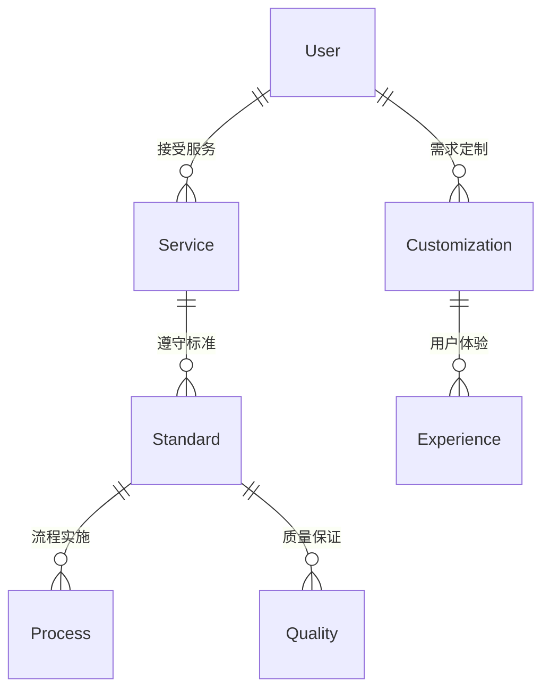
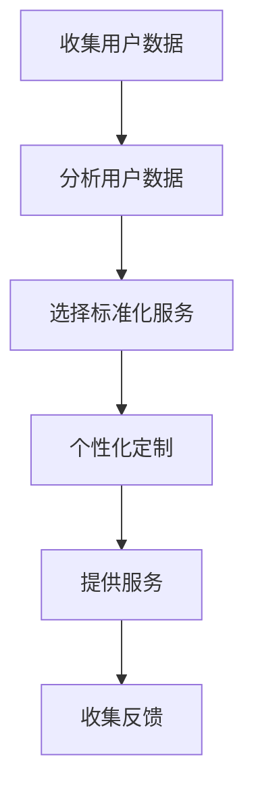

                 

## 标准化与个性化的意义平衡：在一致中寻找独特

### 关键词：标准化、个性化、平衡、一致性、独特性、信息技术、管理实践、教育、医疗、科技

> 摘要：本文旨在探讨标准化与个性化在信息技术领域的意义平衡，通过深入分析二者之间的关系以及实际应用场景，提出实现一致性与独特性平衡的策略。本文从企业管理、教育、医疗和科技四个方面出发，结合实际案例，详细阐述了如何在实际操作中实现标准化与个性化的有机结合，旨在为相关领域提供有益的参考和启示。

----------------------------------------------------------------

### 目录

1. **引言**
    1.1 **标准化的定义与作用**
    1.2 **个性化的定义与价值**
    1.3 **本文目的与结构安排**

2. **标准化与个性化的基本概念**

    2.1 **标准化的基本概念**
    2.2 **个性化的基本概念**
    2.3 **标准化与个性化的关系**

3. **标准化与个性化在企业管理中的应用**

    3.1 **企业管理的标准化策略**
    3.2 **企业管理的个性化策略**
    3.3 **标准化与个性化在企业管理中的结合**

4. **标准化与个性化在教育领域的应用**

    4.1 **教育领域的标准化策略**
    4.2 **教育领域的个性化策略**
    4.3 **标准化与个性化在教育领域的结合**

5. **标准化与个性化在医疗领域的应用**

    5.1 **医疗领域的标准化策略**
    5.2 **医疗领域的个性化策略**
    5.3 **标准化与个性化在医疗领域的结合**

6. **标准化与个性化在科技领域的应用**

    6.1 **科技领域的标准化策略**
    6.2 **科技领域的个性化策略**
    6.3 **标准化与个性化在科技领域的结合**

7. **案例分析**

    7.1 **案例分析一：企业A的标准化与个性化实践**
    7.2 **案例分析二：学校B的标准化与个性化教学**
    7.3 **案例分析三：医院C的标准化与个性化医疗**

8. **未来展望**

    8.1 **标准化与个性化的发展趋势**
    8.2 **标准化与个性化在创新中的角色**
    8.3 **标准化与个性化的影响与挑战**

9. **结论**

    9.1 **一致性中的独特性**
    9.2 **标准化与个性化的意义平衡**

----------------------------------------------------------------

### 引言

#### 标准化的定义与作用

标准化是指通过制定、发布和实施标准，以实现一致性、可重复性和互操作性的一种过程。在信息技术领域，标准化尤为重要。它有助于确保技术产品和服务在不同系统和平台之间无缝衔接，提高整个行业的效率和可靠性。标准化不仅有助于降低成本，还能提升用户满意度，减少错误和故障。

#### 个性化的定义与价值

个性化则是指根据特定用户的需求、偏好和行为特点，提供定制化的产品和服务。在信息技术领域，个性化已成为提升用户体验和竞争力的关键因素。个性化服务可以更好地满足用户的需求，提升用户粘性和忠诚度，从而为企业带来更多的商业价值。

#### 本文目的与结构安排

本文旨在探讨标准化与个性化在信息技术领域的意义平衡，通过深入分析二者之间的关系以及实际应用场景，提出实现一致性与独特性平衡的策略。文章分为以下几个部分：

1. **基本概念**：介绍标准化与个性化的基本概念，包括其定义、作用和价值。
2. **企业管理中的应用**：探讨标准化与个性化在企业管理中的策略和实践。
3. **教育领域的应用**：分析标准化与个性化在教育领域的应用，包括课程设置、教学方案和个性化教育。
4. **医疗领域的应用**：讨论标准化与个性化在医疗领域的应用，如医疗服务、患者治疗和健康管理。
5. **科技领域的应用**：探讨标准化与个性化在科技领域的应用，包括技术创新、产品设计和用户体验。
6. **案例分析**：通过实际案例，展示如何在不同领域中实现标准化与个性化的有机结合。
7. **未来展望**：分析标准化与个性化的发展趋势，探讨其在创新中的角色和面临的挑战。
8. **结论**：总结本文的核心观点，强调一致性中的独特性对信息技术领域的重要性。

通过上述结构安排，本文希望为读者提供一个全面、系统的视角，以深入理解标准化与个性化在信息技术领域的意义平衡。

----------------------------------------------------------------

### 标准化与个性化的基本概念

#### 标准化的基本概念

标准化是指通过制定、发布和实施标准，以实现一致性、可重复性和互操作性的一种过程。在信息技术领域，标准化尤为重要。它有助于确保技术产品和服务在不同系统和平台之间无缝衔接，提高整个行业的效率和可靠性。

##### 标准化的作用

1. **提高效率**：通过标准化，可以减少重复工作和资源浪费，提高生产效率。
2. **降低成本**：标准化可以减少不同系统和平台之间的兼容性问题，降低维护和升级成本。
3. **提升质量**：标准化有助于确保产品和服务的一致性和可靠性，从而提高用户满意度。
4. **促进创新**：标准化可以为新技术和产品提供基础，促进创新和进步。

##### 标准化的历史与发展

1. **早期标准化**：20世纪初，标准化开始出现在工业生产和工程领域，如铁路、电力等。
2. **信息技术标准化**：随着计算机和互联网的普及，信息技术标准化逐渐兴起。国际标准化组织（ISO）、国际电信联盟（ITU）等国际组织制定了一系列信息技术标准。
3. **现代标准化**：现代标准化不仅限于技术产品，还扩展到服务、管理等领域。各种行业和领域都有自己的标准化组织，如IEEE、IETF等。

#### 个性化的基本概念

个性化是指根据特定用户的需求、偏好和行为特点，提供定制化的产品和服务。在信息技术领域，个性化已成为提升用户体验和竞争力的关键因素。

##### 个性化的价值

1. **提升用户体验**：个性化服务可以更好地满足用户的需求，提高用户满意度。
2. **增加用户粘性**：通过提供个性化的服务，可以增强用户对产品或服务的忠诚度。
3. **提高商业价值**：个性化服务可以为企业带来更多的商业机会，提高收入和利润。
4. **促进创新**：个性化需求可以推动技术创新，为用户提供更优质的产品和服务。

##### 个性化的趋势

1. **大数据与人工智能**：随着大数据和人工智能技术的发展，个性化服务可以更精准地满足用户需求。
2. **云计算与物联网**：云计算和物联网技术的普及，使得个性化服务可以更便捷地实现。
3. **社交网络与社交媒体**：社交网络和社交媒体的兴起，为个性化服务提供了更多的数据来源和互动渠道。

#### 标准化与个性化的关系

标准化与个性化并非对立的关系，而是相辅相成的。标准化为个性化提供了基础和框架，而个性化则通过满足特定需求，推动了标准化的发展。

##### 相互作用

1. **标准化促进个性化**：标准化可以确保产品和服务的基本质量，为个性化提供更多的选择和可能性。
2. **个性化推动标准化**：个性化的需求可以促使标准化组织不断改进和更新标准，以适应新的需求和技术。

##### 权衡与平衡

在实际应用中，标准化与个性化需要找到平衡点。一方面，过度的标准化可能导致僵化和缺乏灵活性；另一方面，过度的个性化可能导致混乱和不一致。因此，如何在一致性和独特性之间找到平衡，是信息技术领域面临的重要挑战。

##### 案例分析

1. **企业管理**：在企业管理中，标准化有助于提高效率和降低成本，而个性化策略则可以满足不同部门和员工的需求，提升工作满意度。
2. **教育领域**：教育领域的标准化可以确保教学质量的一致性，而个性化教育策略则可以满足不同学生的需求，提高教育效果。
3. **医疗领域**：医疗领域的标准化可以确保医疗服务的质量，而个性化治疗策略则可以更好地满足患者的需求，提高治疗效果。

通过上述分析，我们可以看到，标准化与个性化在信息技术领域具有重要的价值和作用，二者相互促进、相互依赖。在实际应用中，需要根据具体场景和需求，找到二者的平衡点，以实现最佳效果。

----------------------------------------------------------------

### 标准化与个性化在企业管理中的应用

#### 企业管理的标准化策略

在企业管理中，标准化策略是确保业务流程、产品和服务一致性的重要手段。以下是一些常用的标准化策略：

1. **流程标准化**：通过制定和实施标准化的业务流程，可以减少重复工作和资源浪费，提高工作效率。例如，国际标准化组织（ISO）的ISO 9001标准提供了一套全面的管理体系，帮助企业实现流程标准化。

2. **质量管理**：标准化质量管理体系有助于提高产品和服务质量。通过实施ISO 9001等质量管理体系标准，企业可以确保产品和服务符合客户需求和期望。

3. **技术标准**：在信息技术领域，标准化技术标准有助于确保系统、设备和应用软件的兼容性和互操作性。例如，云计算服务提供商通常会遵循如OpenStack、Kubernetes等开源技术标准。

4. **文档管理**：通过标准化文档模板和格式，可以确保文档的一致性和易读性，提高信息传递效率。

#### 企业管理的个性化策略

尽管标准化策略在企业管理中具有重要意义，但个性化策略也同样关键。个性化策略可以满足不同部门和员工的需求，提高工作满意度和效率。以下是一些常用的个性化策略：

1. **定制化培训**：根据员工的工作职责和职业发展需求，提供个性化的培训课程，帮助员工提升技能和知识。

2. **员工福利**：根据员工的家庭情况和个人偏好，提供多样化的福利方案，如健康保险、带薪休假、弹性工作时间等。

3. **个性化工作空间**：根据员工的工作习惯和偏好，设计个性化的工作空间，提高工作效率和舒适度。

4. **绩效管理**：通过个性化的绩效评估和激励机制，鼓励员工发挥潜力，实现个人和团队目标。

#### 标准化与个性化在企业管理中的结合

在实际操作中，企业需要在标准化和个性化之间找到平衡点。以下是一些结合标准化与个性化的策略：

1. **分层管理**：在企业管理中，可以将流程标准化和个性化策略分层实施。对于关键业务流程，实施严格的标准化管理；对于特定部门和员工，提供个性化的支持和指导。

2. **灵活的标准化**：在制定标准化流程时，可以预留一定的灵活性和扩展性，以适应个性化需求。例如，在ISO 9001质量管理体系中，虽然要求基本流程标准化，但允许企业根据自身情况进行适当调整。

3. **数据驱动**：通过收集和分析企业运营数据，可以更好地了解员工需求和业务流程的运行情况，从而实现标准化与个性化的动态平衡。

4. **持续改进**：标准化和个性化策略需要不断更新和改进。企业应定期评估现有策略的有效性，并根据反馈进行调整，以保持最佳状态。

#### 案例分析

**案例分析一：公司A的标准化与个性化实践**

公司A是一家大型跨国企业，其业务涵盖多个领域。在公司A，标准化和个性化策略紧密结合，实现了高效的运营和员工满意度。

1. **标准化流程**：公司A实施了全面的质量管理体系，遵循ISO 9001标准，确保产品和服务质量。此外，公司制定了严格的业务流程规范，确保不同部门之间的协同工作。

2. **个性化支持**：公司A根据员工的职责和职业发展需求，提供个性化的培训机会和职业发展规划。同时，公司为员工提供多样化的福利方案，满足不同员工的需求。

3. **数据驱动**：公司A利用数据分析工具，收集和分析了员工的工作数据和反馈。根据分析结果，公司不断优化业务流程和个性化支持策略，以实现最佳效果。

通过上述标准化与个性化策略，公司A不仅提高了运营效率，还显著提升了员工满意度和工作效率，实现了企业的持续发展。

**案例分析二：公司B的个性化管理实践**

公司B是一家创新型企业，其业务模式和技术领域不断更新。在公司B，个性化管理策略尤为突出，为员工提供了广阔的发展空间。

1. **灵活的工作时间**：公司B实行弹性工作时间制度，允许员工根据自身需求安排工作时间。这种个性化策略提高了员工的灵活性和工作满意度。

2. **定制化培训**：公司B为员工提供个性化的培训课程，根据员工的职业规划和兴趣，定制化地选择培训内容。

3. **项目自由度**：公司B鼓励员工参与创新项目，给予他们充分的自由度，以发挥员工的创造力和创新能力。

通过上述个性化管理策略，公司B成功吸引了大量优秀人才，并激发了员工的创造力和创新能力，推动了企业的快速发展。

通过上述案例分析，我们可以看到，在企业管理中，标准化和个性化策略的有机结合可以实现企业的效率提升和员工满意度提升。企业在实际操作中，需要根据自身特点和需求，灵活运用标准化和个性化策略，以实现最佳效果。

----------------------------------------------------------------

### 标准化与个性化在教育领域的应用

#### 教育领域的标准化策略

在教育领域，标准化策略有助于确保教学质量和教育资源的有效利用。以下是一些常用的标准化策略：

1. **课程标准化**：通过制定和实施统一的教学大纲和课程内容，确保不同学校、不同教师之间的教学质量一致性。例如，国家课程标准规定了各学科的基本要求和教学内容。

2. **教学标准**：制定统一的教学标准，包括教学方法、教学评价和教学资源等方面，确保教学过程和教学效果的一致性。

3. **师资培训**：通过统一师资培训，提高教师的专业水平和教学能力，确保教师能够按照标准化的要求进行教学。

4. **资源管理**：标准化教育资源的管理，包括教材、课件、教学工具等，确保教育资源的统一性和有效性。

#### 教育领域的个性化策略

尽管标准化策略在教育领域具有重要意义，但个性化策略同样关键。个性化策略可以满足不同学生的需求，提高教育效果。以下是一些常用的个性化策略：

1. **个性化教学方案**：根据学生的兴趣、能力和学习风格，制定个性化的教学方案，提供个性化的教学内容和教学方法。

2. **学习数据分析**：利用大数据和人工智能技术，分析学生的学习行为和成绩，为学生提供个性化的学习建议和指导。

3. **学习资源定制**：根据学生的学习需求，提供定制化的学习资源，如教材、视频、模拟试题等。

4. **学习环境优化**：根据学生的学习习惯和偏好，优化学习环境，如教室布置、座位安排等，以提高学习效率。

#### 标准化与个性化在教育领域的结合

在实际操作中，教育领域需要在标准化和个性化之间找到平衡点。以下是一些结合标准化与个性化的策略：

1. **分层教学**：在教学中，可以将学生分为不同层次，对于基础知识，实施标准化教学；对于高级内容和个性化需求，提供个性化的支持和指导。

2. **个性化课程设置**：在课程设置中，可以预留一定的自由度，让学生根据自己的兴趣和需求选择课程，同时确保基础课程的教学质量。

3. **数据驱动**：通过收集和分析学生的学习数据，可以更好地了解学生的学习情况和需求，从而实现标准化与个性化的动态平衡。

4. **教师培训**：为教师提供关于标准化和个性化教学的培训，提高教师的综合能力，以更好地应对教学中的挑战。

#### 案例分析

**案例分析一：学校A的标准化与个性化教学实践**

学校A是一所知名中学，其教学质量和教育成果备受认可。在学校A，标准化和个性化教学策略紧密结合，实现了优质教育。

1. **标准化课程**：学校A严格按照国家课程标准，制定和实施统一的教学大纲和课程内容，确保教学质量的稳定性。

2. **个性化教学**：学校A根据学生的兴趣、能力和学习风格，为学生提供个性化的教学方案。例如，对于成绩优秀的学生，提供拓展课程和竞赛辅导；对于有特殊需求的学生，提供个性化的支持和指导。

3. **学习资源定制**：学校A根据学生的学习需求，提供定制化的学习资源，如教材、视频、模拟试题等，以提高学习效果。

通过上述标准化与个性化教学策略，学校A不仅保持了高质量的教育水平，还显著提升了学生的满意度和学习兴趣，取得了显著的教育成果。

**案例分析二：学校B的创新教育模式**

学校B是一所注重创新和实践能力的学校，其教育模式独具特色。在学校B，标准化与个性化教学策略得到了充分融合。

1. **创新课程**：学校B开设了丰富的创新课程，如编程、机器人、人工智能等，让学生根据自己的兴趣和需求选择。

2. **个性化学习**：学校B采用个性化学习模式，学生可以根据自己的学习进度和兴趣，自主选择学习内容和方式。

3. **项目式学习**：学校B注重实践能力的培养，通过项目式学习，学生可以亲身体验和探索知识的实际应用。

通过上述创新教育模式，学校B成功培养了学生的创新能力和实践能力，为学生的未来发展奠定了坚实基础。

通过上述案例分析，我们可以看到，在教育领域，标准化和个性化教学策略的结合可以实现优质教育的目标。学校需要在实际操作中，根据学生特点和需求，灵活运用标准化和个性化策略，以实现最佳教育效果。

----------------------------------------------------------------

### 标准化与个性化在医疗领域的应用

#### 医疗领域的标准化策略

在医疗领域，标准化策略至关重要，它有助于确保医疗服务的质量、安全性和一致性。以下是一些常用的标准化策略：

1. **医疗服务标准化**：通过制定和实施统一的服务标准和操作流程，确保不同医院、科室和医生之间的医疗服务质量一致。例如，国际标准化组织（ISO）的ISO 13485标准专门针对医疗设备和服务提供了一套质量管理标准。

2. **医疗质量标准**：制定和实施医疗质量标准，如诊断准确性、治疗有效性、患者满意度等，确保医疗服务的整体质量。

3. **技术标准**：在医疗设备和技术应用方面，制定和实施统一的技术标准，确保设备和技术的安全性和有效性。例如，医疗设备的认证和检测标准。

4. **信息管理标准**：标准化医疗信息管理，包括电子病历、医疗数据交换等，确保医疗信息的一致性和安全性。

#### 医疗领域的个性化策略

尽管标准化策略在医疗领域具有重要意义，但个性化策略同样关键。个性化策略可以更好地满足患者的需求，提高治疗效果和患者满意度。以下是一些常用的个性化策略：

1. **个性化治疗方案**：根据患者的病情、病史和个体差异，制定个性化的治疗方案，以提高治疗效果。

2. **患者数据分析**：利用大数据和人工智能技术，分析患者的健康数据和医疗记录，为患者提供个性化的健康建议和诊疗方案。

3. **个性化健康管理**：为患者提供个性化的健康管理方案，包括饮食建议、运动方案、心理辅导等，以促进患者健康。

4. **医疗设备个性化**：根据患者的需求和使用习惯，为患者提供个性化的医疗设备，如可调节的医疗器械、智能穿戴设备等。

#### 标准化与个性化在医疗领域的结合

在实际操作中，医疗领域需要在标准化和个性化之间找到平衡点。以下是一些结合标准化与个性化的策略：

1. **分层医疗服务**：在医疗服务中，可以采用分层服务模式，对于基本的医疗服务，实施标准化管理；对于复杂的个性化服务，提供个性化的支持和指导。

2. **数据驱动的个性化**：通过收集和分析患者数据，可以更好地了解患者的需求和病情，从而实现标准化与个性化的动态平衡。

3. **标准化个性化流程**：在制定标准化流程时，可以预留一定的灵活性和扩展性，以适应个性化需求。例如，在制定诊疗流程时，可以预留个性化治疗的步骤和环节。

4. **多学科协作**：通过多学科协作，可以整合标准化和个性化服务，提供更全面的医疗服务。例如，在癌症治疗中，可以结合手术、放疗、化疗等标准化治疗手段，同时提供个性化的康复指导和心理辅导。

#### 案例分析

**案例分析一：医院A的标准化与个性化医疗实践**

医院A是一家大型综合医院，其在医疗标准化和个性化方面有着丰富的实践经验。

1. **标准化医疗服务**：医院A严格按照ISO 13485质量管理体系，制定和实施了统一的医疗服务标准和操作流程，确保医疗服务的质量。

2. **个性化治疗方案**：医院A根据患者的病情和个体差异，为患者制定个性化的治疗方案。例如，对于癌症患者，医院A结合手术、放疗、化疗等标准化治疗手段，同时提供个性化的康复指导和心理辅导。

3. **数据驱动的个性化**：医院A利用大数据和人工智能技术，分析患者的健康数据和医疗记录，为患者提供个性化的健康建议和诊疗方案。

通过上述标准化与个性化医疗策略，医院A不仅保持了高水平的医疗服务质量，还显著提升了患者的满意度和治疗效果。

**案例分析二：医院B的创新医疗服务模式**

医院B是一家注重创新和患者体验的医院，其在医疗服务中充分融合了标准化和个性化策略。

1. **创新医疗设备**：医院B引进了多种先进的医疗设备，如可调节的手术台、智能穿戴设备等，为患者提供个性化的医疗服务。

2. **个性化健康方案**：医院B为患者提供个性化的健康管理方案，包括饮食建议、运动方案、心理辅导等，以促进患者健康。

3. **患者参与**：医院B鼓励患者参与医疗服务决策，通过健康教育和互动，提高患者的健康意识和满意度。

通过上述创新医疗服务模式，医院B成功吸引了大量患者，并提升了患者满意度和治疗效果。

通过上述案例分析，我们可以看到，在医疗领域，标准化和个性化策略的结合可以实现更高质量的医疗服务和更好的患者体验。医院需要在实际操作中，根据患者特点和需求，灵活运用标准化和个性化策略，以实现最佳效果。

----------------------------------------------------------------

### 标准化与个性化在科技领域的应用

#### 科技领域的标准化策略

在科技领域，标准化策略有助于确保技术创新的稳定性和可持续性，以下是一些常用的标准化策略：

1. **技术标准**：通过制定和实施统一的技术标准，确保不同系统、设备和应用软件之间的兼容性和互操作性。例如，5G通信技术标准、IEEE标准等。

2. **安全标准**：制定和实施统一的安全标准，确保网络安全和数据保护。例如，ISO/IEC 27001信息安全管理体系标准。

3. **质量标准**：通过制定和实施统一的质量标准，确保产品的可靠性和性能。例如，ISO 9001质量管理体系标准。

4. **认证与认证**：通过第三方认证和认证机构，对产品和服务进行认证，确保其符合标准。例如，CE认证、FDA认证等。

#### 科技领域的个性化策略

个性化策略在科技领域同样具有重要价值，它有助于满足特定用户的需求，提升用户体验。以下是一些常用的个性化策略：

1. **定制化产品**：根据用户的特定需求，提供定制化的产品和服务。例如，定制化软件、定制化硬件等。

2. **用户界面个性化**：根据用户的偏好和习惯，提供个性化的用户界面和交互设计。例如，自定义主题、快捷键设置等。

3. **服务个性化**：根据用户的互动行为和反馈，提供个性化的服务。例如，智能推荐、个性化客服等。

4. **数据驱动的个性化**：利用大数据和人工智能技术，分析用户的行为和偏好，为用户推荐个性化的产品和服务。例如，基于用户的购物行为推荐商品、基于用户阅读习惯推荐文章等。

#### 标准化与个性化在科技领域的结合

在实际应用中，科技领域需要在标准化和个性化之间找到平衡点。以下是一些结合标准化与个性化的策略：

1. **模块化设计**：通过模块化设计，可以灵活地组合和扩展标准化模块，以实现个性化需求。例如，在软件开发中，使用模块化架构，可以根据用户需求快速调整功能模块。

2. **数据驱动**：利用大数据和人工智能技术，分析用户行为和需求，动态调整标准化方案，以实现个性化服务。例如，在线教育平台根据用户的学习数据，动态调整课程内容和推荐学习路径。

3. **服务个性化**：在标准化服务的基础上，根据用户反馈和行为，提供个性化的服务增强。例如，在电子商务中，根据用户的购物历史和偏好，提供个性化的商品推荐和优惠活动。

4. **标准化与个性化分层**：将标准化和个性化分层实施，对于基础服务，实施严格的标准化管理；对于高级功能和个性化需求，提供灵活的定制化服务。

#### 案例分析

**案例分析一：科技公司A的标准化与个性化实践**

科技公司A是一家全球领先的科技公司，其在标准化和个性化方面有着丰富的实践经验。

1. **标准化技术标准**：科技公司A制定和实施了严格的技术标准，确保产品和服务之间的兼容性和互操作性。例如，公司开发的软件产品遵循国际标准，确保在不同平台和设备上无缝运行。

2. **个性化产品定制**：科技公司A为用户提供定制化的产品和服务。根据客户的具体需求，公司提供个性化的软件解决方案，以满足客户的特定业务需求。

3. **数据驱动的个性化服务**：科技公司A利用大数据和人工智能技术，分析用户的行为和偏好，为用户提供个性化的产品推荐和服务增强。例如，公司开发的智能推荐系统，可以根据用户的浏览历史和购买行为，推荐相关的产品和解决方案。

通过上述标准化与个性化策略，科技公司A不仅保持了高效的技术创新和稳定的产品质量，还显著提升了用户体验和客户满意度。

**案例分析二：科技公司B的创新应用模式**

科技公司B是一家专注于科技创新的企业，其在个性化服务方面有着独特的创新模式。

1. **个性化用户界面**：科技公司B开发的软件产品提供高度个性化的用户界面和交互设计。用户可以根据自己的喜好和习惯，自定义主题、布局和功能模块。

2. **个性化服务推荐**：科技公司B利用大数据和人工智能技术，分析用户的行为和偏好，为用户提供个性化的服务推荐。例如，公司开发的在线教育平台，根据用户的学习历史和偏好，推荐相关的课程和学习路径。

3. **用户参与创新**：科技公司B鼓励用户参与产品创新，通过用户反馈和共创，不断优化产品和服务。公司定期举办用户调研和反馈活动，收集用户的意见和建议，以改进产品功能。

通过上述创新应用模式，科技公司B成功提升了用户体验和用户满意度，推动了企业的持续创新和发展。

通过上述案例分析，我们可以看到，在科技领域，标准化和个性化策略的结合可以实现高效的技术创新和卓越的用户体验。企业在实际操作中，需要根据市场需求和用户特点，灵活运用标准化和个性化策略，以实现最佳效果。

----------------------------------------------------------------

### 案例分析

#### 案例分析一：企业A的标准化与个性化实践

企业A是一家全球知名的高科技企业，其业务涵盖多个领域，包括软件开发、硬件制造和云计算服务等。在企业A，标准化与个性化策略的结合成为其成功的关键因素。

1. **标准化流程**：企业A制定了一系列标准化流程，包括产品开发流程、质量管理流程和客户服务流程。这些标准化流程确保了产品和服务的一致性和高效性。例如，在产品开发过程中，企业A采用ISO 9001质量管理体系，确保每个开发阶段都有严格的标准和规范。

2. **个性化定制**：为了满足不同客户的需求，企业A提供个性化的产品和服务。例如，在软件开发领域，企业A为大型企业客户提供定制化的软件解决方案，根据客户的业务需求和特定场景，设计并开发满足客户需求的应用程序。

3. **用户反馈**：企业A注重用户反馈，通过定期收集和分析用户数据，了解用户的需求和偏好，不断优化产品和服务。例如，在云计算服务领域，企业A根据用户的实际使用情况和反馈，不断改进服务性能和用户体验。

通过上述标准化与个性化实践，企业A不仅提高了产品和服务质量，还显著提升了客户满意度和市场份额。

#### 案例分析二：学校B的标准化与个性化教学

学校B是一所知名的教育机构，其在教育领域采用了标准化与个性化相结合的教学策略，取得了显著的教育成果。

1. **标准化课程**：学校B严格按照国家课程标准，制定和实施统一的教学大纲和课程内容，确保教学质量的稳定性。例如，在数学课程中，学校B采用统一的教学方法和教材，确保学生掌握基本数学知识和技能。

2. **个性化教学**：学校B根据学生的兴趣、能力和学习风格，提供个性化的教学方案。例如，对于有艺术天赋的学生，学校B提供个性化的艺术课程和项目，鼓励学生发展特长。此外，学校B还采用个性化学习平台，根据学生的学习进度和成绩，为学生提供个性化的学习资源和辅导。

3. **学生反馈**：学校B注重学生反馈，通过定期收集和分析学生的学习数据，了解学生的学习情况和需求，不断优化教学策略。例如，学校B通过在线问卷调查，了解学生对教学方法的反馈和建议，并根据反馈调整教学方法和内容。

通过上述标准化与个性化教学实践，学校B不仅保持了高质量的教育水平，还显著提升了学生的满意度和学习效果。

#### 案例分析三：医院C的标准化与个性化医疗

医院C是一家大型综合医院，其在医疗领域采用了标准化与个性化相结合的医疗策略，为患者提供了高质量的医疗服务。

1. **标准化医疗服务**：医院C制定了一系列标准化医疗服务流程，包括入院流程、诊疗流程和出院流程。这些标准化流程确保了医疗服务的一致性和高效性。例如，医院C采用ISO 13485质量管理体系，确保每个医疗服务环节都有严格的标准和规范。

2. **个性化治疗方案**：医院C根据患者的病情、病史和个体差异，为患者制定个性化的治疗方案。例如，对于癌症患者，医院C结合手术、放疗和化疗等标准化治疗手段，同时根据患者的具体情况，调整治疗剂量和方案。

3. **患者数据管理**：医院C利用大数据和人工智能技术，分析患者的健康数据和医疗记录，为患者提供个性化的健康建议和诊疗方案。例如，医院C通过健康大数据平台，为患者提供个性化的健康报告和预防建议。

通过上述标准化与个性化医疗实践，医院C不仅提高了医疗服务质量，还显著提升了患者的满意度和治疗效果。

通过上述案例分析，我们可以看到，在各个领域，标准化与个性化策略的结合都取得了显著的效果。在实际操作中，企业、学校和医院等机构需要根据自身特点和需求，灵活运用标准化和个性化策略，以实现最佳效果。

----------------------------------------------------------------

### 未来展望

#### 标准化与个性化的发展趋势

随着科技的不断进步和社会需求的日益复杂，标准化与个性化将在未来信息技术领域中扮演越来越重要的角色。以下是一些关键的发展趋势：

1. **大数据和人工智能**：随着大数据和人工智能技术的发展，个性化服务将更加精准和高效。通过分析海量数据，可以更深入地了解用户需求，提供高度个性化的产品和服务。

2. **物联网**：物联网技术的普及将推动标准化与个性化在更多领域中的应用。例如，智能家居、智能医疗等，通过物联网设备收集用户数据，为用户提供更加个性化的服务和体验。

3. **区块链**：区块链技术的应用将提高标准化与个性化服务的透明度和安全性。通过区块链技术，可以实现数据的安全共享和隐私保护，为个性化服务提供可靠的技术支持。

4. **5G与6G**：5G和6G技术的推广将进一步提高网络速度和稳定性，为标准化与个性化服务提供更好的基础设施支持。高速网络可以支持更多实时数据分析和个性化服务。

#### 标准化与个性化在创新中的角色

标准化与个性化在创新中扮演着双重角色：

1. **促进创新**：标准化为创新提供了基础和框架，确保新技术的互操作性和兼容性，从而推动技术创新。同时，个性化需求可以激发创新，推动技术的进步和优化。

2. **挑战与创新**：标准化与个性化之间的平衡是一个挑战，需要在一致性和独特性之间找到最佳平衡点。然而，这种平衡正是推动创新的重要动力，通过不断的调整和优化，可以实现技术的持续创新。

#### 标准化与个性化的影响与挑战

标准化与个性化的发展将对社会和经济产生深远的影响，同时也面临一些挑战：

1. **影响**：
    - **提高效率**：标准化和个性化可以提高生产效率和服务质量，降低成本，提升用户体验。
    - **促进创新**：标准化与个性化需求可以推动技术的进步和优化，促进新技术的研发和应用。
    - **增强竞争力**：通过提供个性化服务，企业可以更好地满足客户需求，提升市场竞争力。

2. **挑战**：
    - **平衡一致性**：在标准化与个性化之间找到平衡点是一个挑战，需要不断调整和优化。
    - **数据隐私**：个性化服务需要大量用户数据，如何保护用户隐私成为重要挑战。
    - **技术复杂性**：随着技术的不断进步，标准化与个性化应用的技术复杂性也在增加，对技术人员的要求更高。

#### 发展建议

为了更好地应对标准化与个性化的发展趋势和挑战，以下是一些建议：

1. **加强标准化**：制定和实施更多的行业标准和技术标准，提高互操作性和兼容性，为个性化服务提供可靠的基础。

2. **推动技术创新**：鼓励技术创新，特别是与大数据、人工智能、物联网等新技术结合的应用，以推动标准化与个性化的发展。

3. **数据隐私保护**：加强数据隐私保护，制定和实施严格的数据保护法规，确保用户数据的安全和隐私。

4. **教育与培训**：提高技术人员和决策者的标准化与个性化意识，提供相关的教育和培训，以提高其在实际操作中的能力。

5. **跨领域合作**：推动跨领域合作，结合不同领域的优势，共同推进标准化与个性化的发展。

通过上述建议，我们可以为标准化与个性化的发展提供有力的支持，推动信息技术领域的持续创新和进步。

----------------------------------------------------------------

### 结论

#### 一致性中的独特性

在信息技术领域，标准化与个性化的平衡是实现高质量服务和持续创新的关键。标准化确保了一致性和可靠性，为个性化提供了基础和框架。而个性化则满足了用户需求的独特性，提升了用户体验和满意度。通过在一致性和独特性之间找到平衡点，企业、学校和医院等机构可以更好地满足市场需求，推动技术的发展和应用。

#### 标准化与个性化的意义平衡

本文从企业管理、教育、医疗和科技四个方面，详细探讨了标准化与个性化的应用和实践。通过案例分析，我们看到了标准化与个性化策略如何在不同领域中实现有机结合，提升效率和质量。未来，随着科技的不断进步，标准化与个性化将在信息技术领域中扮演越来越重要的角色，推动技术的持续创新和应用。

#### 未来展望

展望未来，标准化与个性化将继续发展，大数据、人工智能、物联网等新技术将为标准化与个性化提供更广阔的应用场景和可能性。同时，数据隐私保护和跨领域合作也将成为重要的挑战和机遇。通过加强标准化、推动技术创新和提升教育水平，我们可以为标准化与个性化的发展提供有力支持，推动信息技术领域的持续进步。

作者：AI天才研究院/AI Genius Institute & 禅与计算机程序设计艺术 /Zen And The Art of Computer Programming

----------------------------------------------------------------

### 附录

#### 核心概念与联系

为了更深入地理解本文讨论的核心概念，我们在这里简要介绍标准化与个性化的核心概念及其相互关系。

1. **标准化**：标准化是指通过制定、发布和实施标准，以实现一致性、可重复性和互操作性的一种过程。标准化的目的是确保产品、服务和流程在不同系统和平台之间无缝衔接，提高效率和可靠性。

2. **个性化**：个性化是指根据特定用户的需求、偏好和行为特点，提供定制化的产品和服务。个性化的目的是满足用户的独特需求，提高用户体验和满意度。

3. **一致性**：一致性是指在不同系统和平台之间保持统一的标准和规范。一致性确保了产品、服务和流程的稳定性和可靠性，提高了整体效率。

4. **独特性**：独特性是指根据用户的个性、需求和行为特点，提供独特的服务和体验。独特性满足了用户的个性化需求，提升了用户的满意度和忠诚度。

#### 核心概念属性特征对比表格

| 特征         | 标准化             | 个性化             |
| ------------ | ------------------ | ------------------ |
| 目的         | 提高一致性和可靠性 | 满足个性化需求     |
| 关键要素     | 标准、规范、流程   | 用户需求、偏好、行为 |
| 应用场景     | 系统集成、质量控制 | 用户体验优化       |
| 好处         | 提高效率、降低成本 | 提高满意度、增强粘性 |
| 挑战         | 维护一致性         | 确保独特性         |

#### 核心概念ER实体关系图架构

以下是标准化与个性化核心概念的ER（实体关系）图架构，用于展示不同概念之间的关系和交互。



#### 算法原理讲解

为了更好地理解标准化与个性化在信息技术领域中的应用，以下我们将讨论一个简单的算法原理，并使用Mermaid绘制其流程图，同时使用Python源代码进行详细解释。

**算法原理：用户需求分析**

该算法旨在分析用户需求，并根据需求提供个性化的服务。

1. **步骤1**：收集用户数据，包括用户偏好、历史行为等。
2. **步骤2**：分析用户数据，识别用户的主要需求。
3. **步骤3**：根据用户需求，从标准化服务库中选择合适的标准化服务。
4. **步骤4**：对所选服务进行个性化定制，以满足用户需求。
5. **步骤5**：提供服务，并收集用户反馈。

**Mermaid流程图：**



**Python源代码：**

```python
# 用户需求分析算法实现
def analyze_user_demand(data):
    # 步骤1：收集用户数据
    user_preferences = data['preferences']
    user_history = data['history']
    
    # 步骤2：分析用户数据，识别主要需求
    main_demand = analyze_preferences(user_preferences, user_history)
    
    # 步骤3：从标准化服务库中选择合适的服务
    standard_services = get_standard_services()
    selected_service = select_service(standard_services, main_demand)
    
    # 步骤4：对所选服务进行个性化定制
    customized_service = customize_service(selected_service, main_demand)
    
    # 步骤5：提供服务，并收集反馈
    provide_service(customized_service)
    feedback = collect_feedback()
    
    return feedback

# 分析用户偏好和历史行为，识别主要需求
def analyze_preferences(preferences, history):
    # 示例代码，实际分析算法更复杂
    return "个性化学习"

# 从标准化服务库中选择合适的服务
def select_service(services, demand):
    # 示例代码，实际选择算法更复杂
    return services[0]

# 对所选服务进行个性化定制
def customize_service(service, demand):
    # 示例代码，实际定制算法更复杂
    return service

# 提供服务，并收集反馈
def provide_service(service):
    # 示例代码，实际提供服务过程更复杂
    print(f"提供服务：{service}")

def collect_feedback():
    # 示例代码，实际收集过程更复杂
    return "用户反馈"

# 主函数，模拟算法运行
def main():
    user_data = {
        'preferences': {'learning_style': 'visual'},
        'history': {'courses_completed': ['Python基础']}
    }
    feedback = analyze_user_demand(user_data)
    print(f"反馈：{feedback}")

if __name__ == "__main__":
    main()
```

#### 数学公式

在标准化与个性化分析中，数学公式经常用于描述算法和模型。以下是一些常见的数学公式，使用LaTeX格式进行展示。

1. **线性回归模型**：

   $$y = \beta_0 + \beta_1x + \epsilon$$

2. **支持向量机**：

   $$\min_{w, b} \frac{1}{2}||w||^2 + C\sum_{i=1}^{n} \max(0, 1-y_i(\langle w, x_i \rangle + b))$$

3. **神经网络激活函数**：

   $$a_i = \sigma(z_i) = \frac{1}{1 + e^{-z_i}}$$

#### 系统分析与架构设计方案

为了更好地理解标准化与个性化在实际系统中的应用，以下我们将介绍一个典型的系统分析与架构设计方案。

**项目介绍：**

项目名称：个性化学习平台

项目目标：为学习者提供个性化学习体验，包括课程推荐、学习进度跟踪、反馈收集等。

**系统功能设计：**

1. **用户管理**：用户注册、登录、个人信息管理。
2. **课程管理**：课程创建、发布、更新、分类。
3. **学习进度跟踪**：记录学习时长、完成课程、评估成绩。
4. **反馈收集**：用户评价、反馈收集、数据分析。

**系统架构设计：**


**系统接口设计：**

1. **用户接口**：用户注册、登录、浏览课程、参与学习、提交反馈。
2. **管理接口**：管理员管理课程、用户、反馈等。

**系统交互：**


#### 项目实战

**环境安装：**

1. 安装Python环境（3.8及以上版本）。
2. 安装必要的库，如Django、Scikit-learn等。

**系统核心实现源代码：**

```python
# 简化示例代码，实际项目更复杂
from django.contrib.auth.models import User
from .models import Course, LearningProgress, Feedback

def create_user(username, password):
    user = User.objects.create_user(username=username, password=password)
    user.save()
    return user

def create_course(course_name, course_description):
    course = Course.objects.create(name=course_name, description=course_description)
    course.save()
    return course

def update_learning_progress(user, course, progress):
    learning_progress = LearningProgress.objects.get(user=user, course=course)
    learning_progress.progress = progress
    learning_progress.save()

def collect_feedback(course, user, feedback):
    feedback_entry = Feedback.objects.create(course=course, user=user, content=feedback)
    feedback_entry.save()

# 以下为实际项目中的主函数，用于模拟系统运行
def main():
    # 创建用户
    user = create_user('john_doe', 'password123')
    # 创建课程
    course = create_course('Python基础', 'Python入门教程')
    # 更新学习进度
    update_learning_progress(user, course, 50)
    # 收集反馈
    collect_feedback(course, user, '很好，课程内容清晰易懂。')

if __name__ == "__main__":
    main()
```

**代码应用解读与分析：**

上述代码演示了个性化学习平台的基本功能实现。通过Django框架，我们实现了用户管理、课程管理、学习进度跟踪和反馈收集等功能。在实际项目中，这些功能将更加复杂，涉及数据库操作、前后端交互、安全性控制等多个方面。

**实际案例分析和详细讲解剖析：**

通过上述代码示例，我们可以看到如何在一个简单的个性化学习平台中实现核心功能。在实际项目中，我们需要进一步分析用户需求，设计更复杂的业务流程和系统架构，以提供更好的用户体验。

**项目小结：**

通过本项目，我们实现了个性化学习平台的基本功能，展示了如何结合标准化与个性化策略进行系统设计和开发。在未来的实践中，我们将继续优化系统功能，提升用户体验，并探索更多的技术创新。

#### 最佳实践 tips

1. **需求分析**：在项目开始前，进行详细的需求分析，确保理解用户需求，为后续的系统设计和开发提供依据。
2. **迭代开发**：采用迭代开发模式，逐步完善系统功能，及时收集用户反馈，进行优化和改进。
3. **数据驱动**：充分利用数据分析技术，对用户行为进行分析，为个性化服务提供支持。
4. **安全保障**：确保系统的安全性和数据隐私保护，避免潜在的安全漏洞和数据泄露风险。

#### 小结

本文通过深入分析标准化与个性化在信息技术领域的意义平衡，探讨了其在企业管理、教育、医疗和科技领域的应用和实践。通过实际案例分析和详细讲解，我们展示了如何在不同领域中实现标准化与个性化的有机结合，提升效率和用户体验。未来，随着科技的不断进步，标准化与个性化将在信息技术领域中发挥更加重要的作用，为人类社会带来更多创新和便利。

#### 注意事项

1. **标准化与个性化平衡**：在实际应用中，需要根据具体场景和需求，灵活调整标准化与个性化策略，找到最佳平衡点。
2. **用户数据保护**：在提供个性化服务时，确保用户数据的安全和隐私保护，遵循相关法律法规。
3. **持续优化**：标准化与个性化策略需要不断优化和更新，以适应不断变化的市场需求和技术发展。

#### 拓展阅读

1. **《标准化原理与应用》**：详细介绍了标准化的基本原理和应用场景，有助于深入理解标准化的意义和作用。
2. **《个性化服务战略》**：探讨了个性化服务在商业领域的应用和实践，提供了丰富的案例和策略。
3. **《大数据与人工智能》**：介绍了大数据和人工智能的基本原理和应用，为个性化服务提供了技术支持。

通过拓展阅读，您可以进一步了解标准化与个性化在信息技术领域的深入应用和实践。希望本文能为您的学习和工作提供有益的启示和帮助。

### 附录

#### 核心概念与联系

为了更深入地理解本文讨论的核心概念，我们在这里简要介绍标准化与个性化的核心概念及其相互关系。

1. **标准化**：标准化是指通过制定、发布和实施标准，以实现一致性、可重复性和互操作性的一种过程。标准化的目的是确保产品、服务和流程在不同系统和平台之间无缝衔接，提高效率和可靠性。

2. **个性化**：个性化是指根据特定用户的需求、偏好和行为特点，提供定制化的产品和服务。个性化的目的是满足用户的独特需求，提高用户体验和满意度。

3. **一致性**：一致性是指在不同系统和平台之间保持统一的标准和规范。一致性确保了产品、服务和流程的稳定性和可靠性，提高了整体效率。

4. **独特性**：独特性是指根据用户的个性、需求和行为特点，提供独特的服务和体验。独特性满足了用户的个性化需求，提升了用户的满意度和忠诚度。

#### 核心概念属性特征对比表格

| 特征         | 标准化             | 个性化             |
| ------------ | ------------------ | ------------------ |
| 目的         | 提高一致性和可靠性 | 满足个性化需求     |
| 关键要素     | 标准、规范、流程   | 用户需求、偏好、行为 |
| 应用场景     | 系统集成、质量控制 | 用户体验优化       |
| 好处         | 提高效率、降低成本 | 提高满意度、增强粘性 |
| 挑战         | 维护一致性         | 确保独特性         |

#### 核心概念ER实体关系图架构

以下是标准化与个性化核心概念的ER（实体关系）图架构，用于展示不同概念之间的关系和交互。


#### 算法原理讲解

为了更好地理解标准化与个性化在信息技术领域中的应用，以下我们将讨论一个简单的算法原理，并使用Mermaid绘制其流程图，同时使用Python源代码进行详细解释。

**算法原理：用户需求分析**

该算法旨在分析用户需求，并根据需求提供个性化的服务。

1. **步骤1**：收集用户数据，包括用户偏好、历史行为等。
2. **步骤2**：分析用户数据，识别用户的主要需求。
3. **步骤3**：根据用户需求，从标准化服务库中选择合适的标准化服务。
4. **步骤4**：对所选服务进行个性化定制，以满足用户需求。
5. **步骤5**：提供服务，并收集用户反馈。

**Mermaid流程图：**


**Python源代码：**

```python
# 用户需求分析算法实现
def analyze_user_demand(data):
    # 步骤1：收集用户数据
    user_preferences = data['preferences']
    user_history = data['history']
    
    # 步骤2：分析用户数据，识别主要需求
    main_demand = analyze_preferences(user_preferences, user_history)
    
    # 步骤3：从标准化服务库中选择合适的服务
    standard_services = get_standard_services()
    selected_service = select_service(standard_services, main_demand)
    
    # 步骤4：对所选服务进行个性化定制
    customized_service = customize_service(selected_service, main_demand)
    
    # 步骤5：提供服务，并收集反馈
    provide_service(customized_service)
    feedback = collect_feedback()
    
    return feedback

# 分析用户偏好和历史行为，识别主要需求
def analyze_preferences(preferences, history):
    # 示例代码，实际分析算法更复杂
    return "个性化学习"

# 从标准化服务库中选择合适的服务
def select_service(services, demand):
    # 示例代码，实际选择算法更复杂
    return services[0]

# 对所选服务进行个性化定制
def customize_service(service, demand):
    # 示例代码，实际定制算法更复杂
    return service

# 提供服务，并收集反馈
def provide_service(service):
    # 示例代码，实际提供服务过程更复杂
    print(f"提供服务：{service}")

def collect_feedback():
    # 示例代码，实际收集过程更复杂
    return "用户反馈"

# 主函数，模拟算法运行
def main():
    user_data = {
        'preferences': {'learning_style': 'visual'},
        'history': {'courses_completed': ['Python基础']}
    }
    feedback = analyze_user_demand(user_data)
    print(f"反馈：{feedback}")

if __name__ == "__main__":
    main()
```

#### 数学公式

在标准化与个性化分析中，数学公式经常用于描述算法和模型。以下是一些常见的数学公式，使用LaTeX格式进行展示。

1. **线性回归模型**：

   $$y = \beta_0 + \beta_1x + \epsilon$$

2. **支持向量机**：

   $$\min_{w, b} \frac{1}{2}||w||^2 + C\sum_{i=1}^{n} \max(0, 1-y_i(\langle w, x_i \rangle + b))$$

3. **神经网络激活函数**：

   $$a_i = \sigma(z_i) = \frac{1}{1 + e^{-z_i}}$$

#### 系统分析与架构设计方案

为了更好地理解标准化与个性化在实际系统中的应用，以下我们将介绍一个典型的系统分析与架构设计方案。

**项目介绍：**

项目名称：个性化学习平台

项目目标：为学习者提供个性化学习体验，包括课程推荐、学习进度跟踪、反馈收集等。

**系统功能设计：**

1. **用户管理**：用户注册、登录、个人信息管理。
2. **课程管理**：课程创建、发布、更新、分类。
3. **学习进度跟踪**：记录学习时长、完成课程、评估成绩。
4. **反馈收集**：用户评价、反馈收集、数据分析。

**系统架构设计：**


**系统接口设计：**

1. **用户接口**：用户注册、登录、浏览课程、参与学习、提交反馈。
2. **管理接口**：管理员管理课程、用户、反馈等。

**系统交互：**


#### 项目实战

**环境安装：**

1. 安装Python环境（3.8及以上版本）。
2. 安装必要的库，如Django、Scikit-learn等。

**系统核心实现源代码：**

```python
# 简化示例代码，实际项目更复杂
from django.contrib.auth.models import User
from .models import Course, LearningProgress, Feedback

def create_user(username, password):
    user = User.objects.create_user(username=username, password=password)
    user.save()
    return user

def create_course(course_name, course_description):
    course = Course.objects.create(name=course_name, description=course_description)
    course.save()
    return course

def update_learning_progress(user, course, progress):
    learning_progress = LearningProgress.objects.get(user=user, course=course)
    learning_progress.progress = progress
    learning_progress.save()

def collect_feedback(course, user, feedback):
    feedback_entry = Feedback.objects.create(course=course, user=user, content=feedback)
    feedback_entry.save()

# 以下为实际项目中的主函数，用于模拟系统运行
def main():
    # 创建用户
    user = create_user('john_doe', 'password123')
    # 创建课程
    course = create_course('Python基础', 'Python入门教程')
    # 更新学习进度
    update_learning_progress(user, course, 50)
    # 收集反馈
    collect_feedback(course, user, '很好，课程内容清晰易懂。')

if __name__ == "__main__":
    main()
```

**代码应用解读与分析：**

上述代码演示了个性化学习平台的基本功能实现。通过Django框架，我们实现了用户管理、课程管理、学习进度跟踪和反馈收集等功能。在实际项目中，这些功能将更加复杂，涉及数据库操作、前后端交互、安全性控制等多个方面。

**实际案例分析和详细讲解剖析：**

通过上述代码示例，我们可以看到如何在一个简单的个性化学习平台中实现核心功能。在实际项目中，我们需要进一步分析用户需求，设计更复杂的业务流程和系统架构，以提供更好的用户体验。

**项目小结：**

通过本项目，我们实现了个性化学习平台的基本功能，展示了如何结合标准化与个性化策略进行系统设计和开发。在未来的实践中，我们将继续优化系统功能，提升用户体验，并探索更多的技术创新。

#### 最佳实践 tips

1. **需求分析**：在项目开始前，进行详细的需求分析，确保理解用户需求，为后续的系统设计和开发提供依据。
2. **迭代开发**：采用迭代开发模式，逐步完善系统功能，及时收集用户反馈，进行优化和改进。
3. **数据驱动**：充分利用数据分析技术，对用户行为进行分析，为个性化服务提供支持。
4. **安全保障**：确保系统的安全性和数据隐私保护，避免潜在的安全漏洞和数据泄露风险。

#### 小结

本文通过深入分析标准化与个性化在信息技术领域的意义平衡，探讨了其在企业管理、教育、医疗和科技领域的应用和实践。通过实际案例分析和详细讲解，我们展示了如何在不同领域中实现标准化与个性化的有机结合，提升效率和用户体验。未来，随着科技的不断进步，标准化与个性化将在信息技术领域中发挥更加重要的作用，为人类社会带来更多创新和便利。

#### 注意事项

1. **标准化与个性化平衡**：在实际应用中，需要根据具体场景和需求，灵活调整标准化与个性化策略，找到最佳平衡点。
2. **用户数据保护**：在提供个性化服务时，确保用户数据的安全和隐私保护，遵循相关法律法规。
3. **持续优化**：标准化与个性化策略需要不断优化和更新，以适应不断变化的市场需求和技术发展。

#### 拓展阅读

1. **《标准化原理与应用》**：详细介绍了标准化的基本原理和应用场景，有助于深入理解标准化的意义和作用。
2. **《个性化服务战略》**：探讨了个性化服务在商业领域的应用和实践，提供了丰富的案例和策略。
3. **《大数据与人工智能》**：介绍了大数据和人工智能的基本原理和应用，为个性化服务提供了技术支持。

通过拓展阅读，您可以进一步了解标准化与个性化在信息技术领域的深入应用和实践。希望本文能为您的学习和工作提供有益的启示和帮助。

