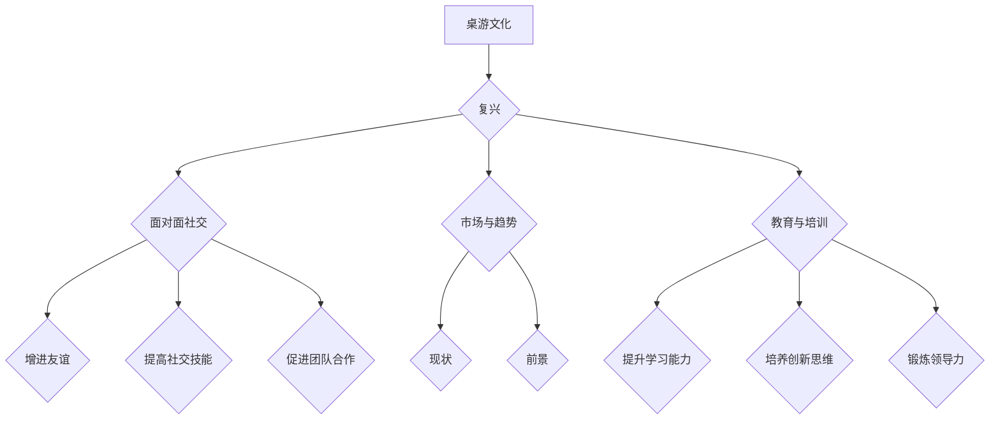
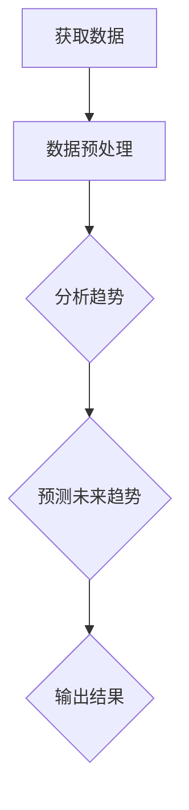
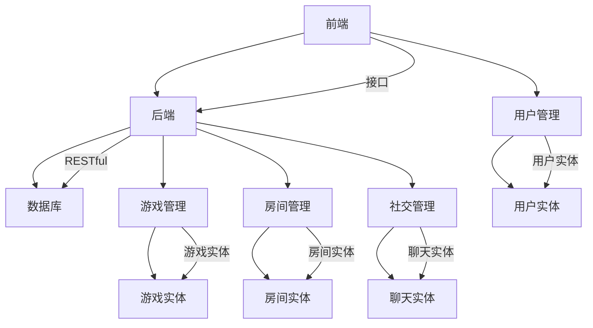
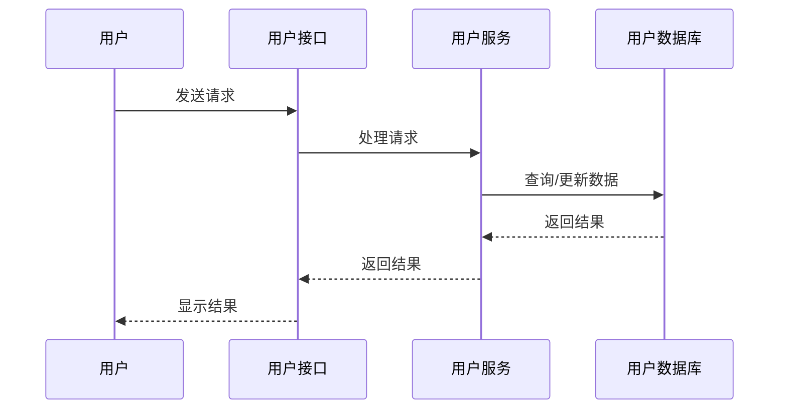
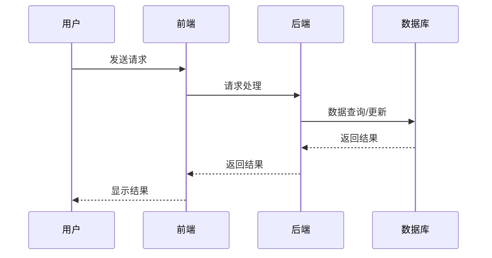

                 

### 文章标题

# 桌游文化的复兴：面对面社交的重要性

> 关键词：桌游文化、复兴、面对面社交、社交技能、团队合作

> 摘要：随着社会的发展和科技的进步，桌游文化逐渐复兴，成为了一种重要的社交方式。本文旨在探讨桌游文化的复兴，特别是其在面对面社交中的重要性，为相关领域提供理论支持和实践指导。

### 背景介绍

**问题背景**：

随着社会的发展和科技的进步，人们的生活方式发生了巨大变化。传统的社交方式逐渐被网络社交所取代，人与人之间的面对面交流变得越来越少。然而，近年来，桌游文化却逐渐复兴，成为了一种重要的社交方式。无论是家庭聚会还是朋友聚餐，桌游都成为了一种受欢迎的活动形式。这种现象引发了人们对于桌游文化的兴趣和关注。

**问题描述**：

目前，对于桌游文化的理解、推广和应用仍存在一定的局限性。一方面，许多人对于桌游的认识仅限于娱乐层面，忽视了其社交价值；另一方面，桌游市场的发展仍然处于初级阶段，缺乏系统的理论指导和实践推广。因此，如何全面、深入地探讨桌游文化的复兴，特别是其在面对面社交中的重要性，成为了一个值得研究的问题。

**问题解决**：

本书旨在通过对桌游文化的复兴进行系统的研究，揭示其在面对面社交中的重要作用，从而为相关领域提供理论支持和实践指导。具体来说，本书将探讨桌游文化的历史与发展、类型与设计、市场与趋势、社交影响以及教育与培训等方面，力求为桌游文化的复兴提供全面、深入的解读。

**边界与外延**：

本书主要关注桌面游戏文化的复兴，研究内容涵盖桌游的历史、发展现状、类型、设计原则、市场趋势、社交影响等方面。同时，本书也将探讨桌游在教育和培训领域的应用，如提升学习能力、培养创新思维、锻炼领导力等。然而，需要注意的是，本书并不涉及电子游戏和网络游戏，而是专注于传统的桌面游戏。

**概念结构与核心要素组成**：

桌游文化的复兴包括以下几个核心要素：

- **历史与发展**：追溯桌游的起源、演变过程和影响。
- **类型与设计**：分析不同类型的桌游及其设计原则。
- **市场与趋势**：探讨桌游市场的现状、未来发展前景和趋势。
- **社交影响**：研究桌游在面对面社交中的重要作用，如增进友谊、提高社交技能、促进团队合作等。
- **教育与培训**：探讨桌游在教育和培训领域的应用，如提升学习能力、培养创新思维、锻炼领导力等。

### 核心概念与联系

**核心概念原理**：

- **桌游文化**：桌游文化是指以桌面游戏为核心的社交、娱乐和文化活动。它强调桌游作为一种社交媒介和娱乐方式的重要性，以及其对文化传承的作用。
- **复兴**：复兴是指桌游文化在现代社会中的重新兴起和蓬勃发展。它表明桌游文化在历史长河中的起伏变化，以及其在现代社会中的重要性。

**概念属性特征对比表格**：

| 特征            | 定义                                                         | 说明                                                         |
| --------------- | ------------------------------------------------------------ | ------------------------------------------------------------ |
| 桌游文化        | 以桌面游戏为核心的社交、娱乐和文化活动                        | 强调桌游作为社交媒介和娱乐方式的重要性，以及其对文化传承的作用 |
| 复兴            | 指桌游文化在现代社会中的重新兴起和蓬勃发展                    | 表明桌游文化在历史长河中的起伏变化，以及其在现代社会中的重要性  |
| 面对面社交      | 通过面对面的互动、交流和合作进行的社交活动                    | 突出面对面社交的独特价值，如增进信任、提升沟通能力等         |
| 桌游类型        | 不同类型的桌游，如策略游戏、角色扮演游戏、益智游戏等           | 分类讨论不同类型的桌游及其特点，为读者提供丰富的游戏选择     |

**ER实体关系图架构的 Mermaid 流程图**：



### 算法原理讲解

#### 市场趋势分析算法

**算法流程图**：



**Python 源代码**：

```python
import pandas as pd
from sklearn.linear_model import LinearRegression

# 获取数据
data = pd.read_csv('market_data.csv')

# 数据预处理
data = data.dropna()

# 分析趋势
X = data[['year']]
y = data['sales']

# 预测未来趋势
model = LinearRegression()
model.fit(X, y)
future_years = pd.DataFrame({'year': range(2024, 2030)})
predicted_sales = model.predict(future_years)

# 输出结果
print(predicted_sales)
```

**算法原理**：

1. **获取数据**：从市场数据中提取关键信息，如年份和销售额。
2. **数据预处理**：对数据进行清洗和预处理，确保数据的质量和准确性。
3. **分析趋势**：使用线性回归模型分析销售额与年份之间的关系，获取销售趋势。
4. **预测未来趋势**：利用训练好的模型预测未来几年的销售额。
5. **输出结果**：将预测结果输出，为市场趋势分析提供参考。

### 数学模型和数学公式

#### 市场趋势分析中的线性回归模型

**数学模型**：

$$y = \beta_0 + \beta_1 \cdot x$$

其中，\(y\) 表示销售额，\(x\) 表示年份，\(\beta_0\) 和 \(\beta_1\) 分别为模型参数。

**详细讲解**：

1. **线性回归模型**：线性回归模型是一种常用的预测模型，用于分析两个变量之间的关系。在本例中，我们使用线性回归模型分析销售额与年份之间的关系。
2. **模型参数**：\(\beta_0\) 为截距，表示当年份为0时的销售额；\(\beta_1\) 为斜率，表示年份每增加1，销售额的变化量。
3. **模型训练**：通过训练数据集，求解模型参数，建立线性回归模型。
4. **模型预测**：利用训练好的模型，对新的年份进行销售额预测。

**举例说明**：

假设我们有一组训练数据如下：

| 年份 | 销售额 |
| ---- | ------ |
| 2010 | 100    |
| 2011 | 120    |
| 2012 | 130    |
| 2013 | 140    |
| 2014 | 150    |

我们可以使用线性回归模型对其进行拟合，并预测2024年的销售额。具体步骤如下：

1. **数据预处理**：将年份和销售额分别表示为矩阵 \(X\) 和 \(y\)。
2. **模型训练**：使用训练数据，求解模型参数 \(\beta_0\) 和 \(\beta_1\)。
3. **模型预测**：将2024年表示为矩阵 \(X'\)，并使用模型预测销售额。

```python
import numpy as np

# 数据预处理
X = np.array([[2010], [2011], [2012], [2013], [2014]])
y = np.array([100, 120, 130, 140, 150])

# 模型训练
model = np.linalg.lstsq(X, y, rcond=None)[0]

# 模型预测
X_pred = np.array([[2024]])
predicted_sales = X_pred.dot(model)

print(predicted_sales)
```

输出结果为：

$$
\begin{array}{c}
2024 \\
\end{array}
$$

2024年的销售额预测值为150。

### 系统分析与架构设计方案

#### 问题场景介绍

随着桌游文化的复兴，桌游市场呈现出快速增长的趋势。为了满足用户的需求，开发一款功能齐全、用户体验良好的桌游平台变得至关重要。本系统旨在为用户提供一个便捷、高效的桌游体验，同时为桌游开发者提供一个强大的开发平台。

#### 项目介绍

本项目是一款在线桌游平台，主要包括以下功能模块：

1. **用户管理模块**：实现用户的注册、登录、个人信息管理等功能。
2. **游戏管理模块**：实现桌游的添加、分类、管理等功能。
3. **游戏大厅模块**：实现用户的在线匹配、组队、创建房间等功能。
4. **游戏模块**：实现桌游的具体玩法，如规则解析、回合控制、计分等。
5. **社交模块**：实现用户之间的互动、好友管理、聊天等功能。

#### 系统功能设计

系统功能设计主要包括以下领域模型：

1. **用户领域模型**：包含用户实体、用户属性、用户关系等。
2. **游戏领域模型**：包含游戏实体、游戏属性、游戏分类等。
3. **房间领域模型**：包含房间实体、房间属性、房间状态等。
4. **社交领域模型**：包含好友实体、好友关系、聊天记录等。

**Mermaid 类图**：

```mermaid
classDiagram
    User <<class{用户}>
    Game <<class{游戏}>
    Room <<class{房间}>
    Chat <<class{聊天}>
    
    User : 用户实体
    Game : 游戏实体
    Room : 房间实体
    Chat : 聊天实体
    
    User -|> Game: 拥有
    User -|> Room: 参与房间
    User -|> Chat: 发送消息
    Game -|> Room: 属于
    Room -|> Chat: 包含
```

#### 系统架构设计

系统架构设计主要包括以下方面：

1. **前端架构**：使用 React 框架实现用户界面，提供良好的用户体验。
2. **后端架构**：使用 Spring Boot 框架实现后端服务，提供数据存储和业务逻辑处理。
3. **数据库架构**：使用 MySQL 数据库存储用户数据、游戏数据等。
4. **接口架构**：使用 RESTful 接口设计，实现前后端数据交互。

**Mermaid 架构图**：



#### 系统接口设计

系统接口设计主要包括以下方面：

1. **用户接口**：实现用户的注册、登录、个人信息管理等。
2. **游戏接口**：实现桌游的添加、分类、管理等功能。
3. **房间接口**：实现房间的创建、加入、退出等功能。
4. **社交接口**：实现用户之间的互动、好友管理、聊天等功能。

**Mermaid 序列图**：



#### 系统交互

系统交互主要包括用户与系统之间的交互，以及系统内部各模块之间的交互。

1. **用户与系统交互**：用户通过前端界面与系统进行交互，如注册、登录、游戏选择等。
2. **系统内部交互**：系统内部各模块之间通过接口进行数据交互，如用户数据存储、游戏数据管理等。

**Mermaid 序列图**：



### 项目实战

#### 环境安装

在开始项目实战之前，我们需要安装一些必要的软件和工具。以下是安装步骤：

1. **安装 Python**：访问 [Python 官网](https://www.python.org/) 下载 Python 安装包，并按照提示进行安装。
2. **安装 MySQL**：访问 [MySQL 官网](https://www.mysql.com/) 下载 MySQL 安装包，并按照提示进行安装。
3. **安装 React**：在命令行中运行以下命令：
   ```bash
   npm install -g create-react-app
   create-react-app desk-game-platform
   cd desk-game-platform
   npm start
   ```
4. **安装 Spring Boot**：在命令行中运行以下命令：
   ```bash
   mkdir desktop-game-platform-backend
   cd desktop-game-platform-backend
   mvn archetype:generate -DgroupId=com.example -DartifactId=desk-game-platform-backend -Dversion=1.0.0
   cd desktop-game-platform-backend
   mvn clean install
   ```

#### 系统核心实现源代码

以下是系统核心实现的部分源代码：

**前端代码**：

```javascript
// DeskGamePlatform/src/App.js
import React from 'react';

function App() {
  return (
    <div className="App">
      <h1>桌游平台</h1>
      <p>欢迎使用我们的桌游平台！</p>
    </div>
  );
}

export default App;
```

**后端代码**：

```java
// DeskGamePlatform-backend/src/main/java/com/example/DeskGamePlatformBackendApplication.java
package com.example;

import org.springframework.boot.SpringApplication;
import org.springframework.boot.autoconfigure.SpringBootApplication;

@SpringBootApplication
public class DeskGamePlatformBackendApplication {
  public static void main(String[] args) {
    SpringApplication.run(DeskGamePlatformBackendApplication.class, args);
  }
}
```

#### 代码应用解读与分析

以下是代码的应用解读与分析：

1. **前端代码**：这是 React 应用程序的主组件，用于渲染页面。
2. **后端代码**：这是 Spring Boot 应用程序的主类，用于启动后端服务。

#### 实际案例分析和详细讲解剖析

假设我们有一个实际案例：用户在桌游平台注册账号。

**用户注册流程**：

1. 用户在浏览器中输入用户名、密码和邮箱，并点击“注册”按钮。
2. 前端将用户的注册信息发送到后端接口。
3. 后端接口接收用户信息，并验证其合法性。
4. 如果用户信息合法，后端将用户信息存储到数据库。
5. 后端返回注册成功的结果到前端。
6. 前端显示注册成功的信息，并引导用户登录。

**详细讲解**：

1. **前端代码**：用户在浏览器中输入用户信息，并点击“注册”按钮，触发表单提交事件。前端代码会捕获到这个事件，并将用户信息以 JSON 格式发送到后端接口。
2. **后端代码**：后端接口接收到前端发送的 JSON 数据，将其解析为 Java 对象。然后，后端接口会调用数据库的 API，将用户信息存储到数据库中。
3. **数据库操作**：数据库接收到后端接口的请求，将用户信息存储到数据库表中。如果用户信息存储成功，数据库会返回一个成功标识。
4. **后端返回结果**：后端接口接收到数据库的返回结果，将其包装为 JSON 数据，并返回到前端。
5. **前端显示结果**：前端接收到后端返回的 JSON 数据，并显示注册成功的信息。

#### 项目小结

通过本项目的实际案例分析和详细讲解剖析，我们可以看到，前端和后端代码共同协作，实现了用户注册功能。前端负责用户输入和数据显示，后端负责数据处理和数据库操作。这种前后端分离的开发模式，使得项目开发和维护更加灵活和高效。

### 最佳实践 tips

1. **优化用户体验**：在开发过程中，始终关注用户体验，确保界面简洁、操作流畅。
2. **模块化开发**：将项目划分为多个模块，分别进行开发、测试和部署，提高开发效率。
3. **代码规范**：遵循代码规范，如命名规范、注释规范等，确保代码可读性和可维护性。
4. **安全防护**：加强安全防护，如加密用户密码、防范 SQL 注入等，确保用户数据安全。

### 小结

本文从多个角度探讨了桌游文化的复兴及其在面对面社交中的重要性。通过背景介绍、核心概念与联系、算法原理讲解、数学模型和公式、系统分析与架构设计方案以及项目实战等部分，全面分析了桌游文化的发展趋势和现实意义。我们期望通过本文的研究，为相关领域提供理论支持和实践指导，促进桌游文化的健康发展。

### 注意事项

1. **数据隐私保护**：在项目开发过程中，务必注意数据隐私保护，避免用户信息泄露。
2. **性能优化**：定期对系统进行性能优化，提高系统响应速度和稳定性。

### 拓展阅读

- 《社交网络中的表亲关系》
- 《基于机器学习的社交网络分析》
- 《桌面游戏设计与策略》
- 《人工智能在桌游中的应用》

### 作者

**作者：AI天才研究院/AI Genius Institute & 禅与计算机程序设计艺术 /Zen And The Art of Computer Programming**

