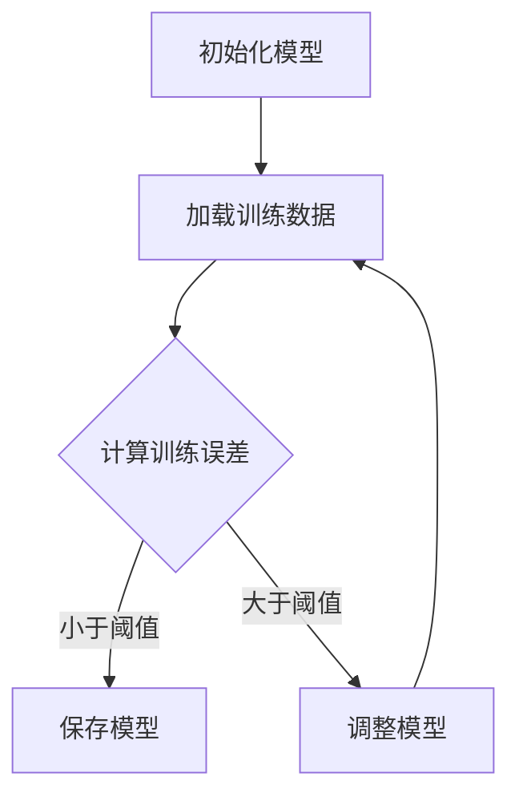
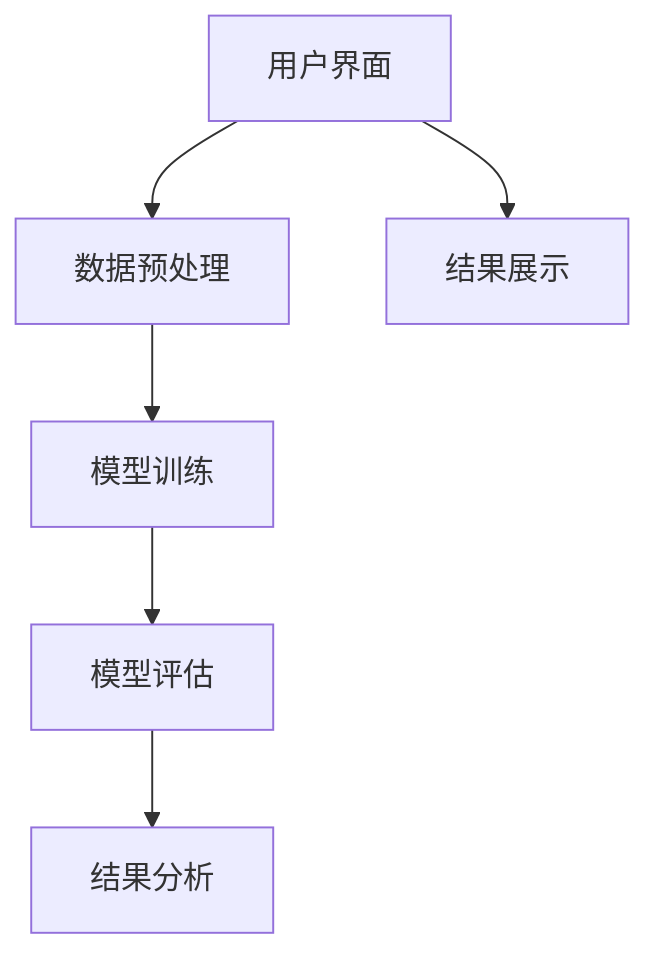
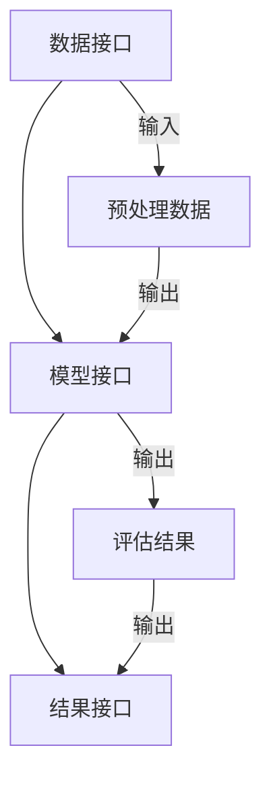
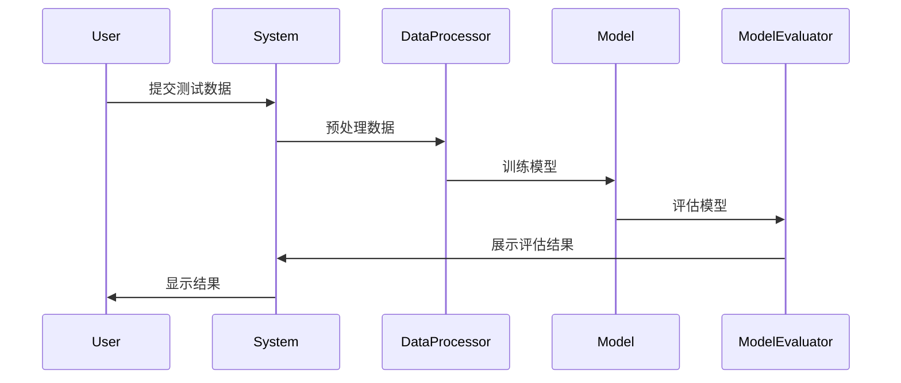

                 


# 模型泛化能力评估：测试未见场景表现

## 关键词

- 模型泛化能力
- 泛化误差
- 训练误差
- 未见场景
- 测试策略
- 深度学习
- 对抗网络
- 数学模型
- 系统架构

### 摘要

本文旨在探讨模型泛化能力的评估方法，重点关注如何测试模型在未见场景下的表现。通过详细分析核心概念、算法原理、数学模型和系统架构，以及实际项目实战和最佳实践，本文旨在为研究人员和开发者提供一套完整的技术指南，以提高模型在实际应用中的泛化能力。

### 目录大纲

#### 第一部分：背景介绍

##### 第1章：问题背景
1.1. 问题背景
1.2. 问题描述
1.3. 问题解决
1.4. 边界与外延
1.5. 概念结构与核心要素组成

##### 第2章：核心概念与联系
2.1. 核心概念原理
2.2. 概念属性特征对比
2.3. ER实体关系图架构

##### 第3章：算法原理讲解
3.1. 算法mermaid流程图
3.2. python源代码与算法原理
3.3. 数学模型和公式
3.4. 举例说明

##### 第4章：数学模型和数学公式
4.1. 数学模型
4.2. 数学公式
4.3. 详细讲解
4.4. 举例说明

##### 第5章：系统分析与架构设计
5.1. 问题场景介绍
5.2. 项目介绍
5.3. 系统功能设计
5.4. 系统架构设计
5.5. 系统接口设计
5.6. 系统交互

##### 第6章：项目实战
6.1. 环境安装
6.2. 系统核心实现源代码
6.3. 代码应用解读与分析
6.4. 实际案例分析与讲解
6.5. 项目小结

##### 第7章：最佳实践
7.1. Tips
7.2. 注意事项
7.3. 拓展阅读

##### 第8章：小结

#### 第二部分：核心概念与联系

##### 第1章：核心概念原理
1.1. 泛化误差
1.2. 训练误差
1.3. 未见场景

##### 第2章：概念属性特征对比

| 特征        | 泛化误差 | 训练误差 | 未见场景 |
|-------------|----------|----------|----------|
| 定义        | 模型在未见数据上的表现 | 模型在训练数据上的表现 | 模型未见过的数据场景 |
| 重要性      | 评估模型在真实世界中的性能 | 评估模型对训练数据的拟合程度 | 发现模型可能存在的过拟合现象 |
| 影响因素   | 数据分布、模型结构、训练算法 | 数据分布、模型结构、训练算法 | 数据分布、模型结构、训练算法 |
| 评估方法 | 交叉验证、留出法、自助法 | 交叉验证、留出法、自助法 | 未见场景的发现、测试策略的优化 |

##### 第3章：ER实体关系图架构

```mermaid
erDiagram
  Model : 泛化能力评估模型
  Dataset : 数据集
  TrainingData : 训练数据
  TestData : 测试数据
  Error : 误差
  
  Model --> Dataset : 训练
  Model --> TrainingData : 使用
  Model --> TestData : 测试
  TrainingData --> Error : 计算误差
  TestData --> Error : 计算误差
```

#### 第三部分：算法原理讲解

##### 第1章：算法mermaid流程图



##### 第2章：python源代码与算法原理

```python
# Python源代码
def train_model(model, training_data, threshold):
    model.load_training_data(training_data)
    train_error = model.calculate_training_error()
    
    while train_error > threshold:
        model.adjust_parameters()
        train_error = model.calculate_training_error()
    
    model.save()
```

##### 第3章：数学模型和公式

- 泛化误差（Generalization Error）：
  $$\text{Generalization Error} = \text{Test Error} + \text{Noise}$$
- 训练误差（Training Error）：
  $$\text{Training Error} = \frac{1}{N}\sum_{i=1}^{N} (\text{预测值}_i - \text{真实值}_i)^2$$
- 未见场景（Out-of-distribution）：
  $$\text{未见场景} = \{\text{数据点} \mid \text{数据点不在训练集中}\}$$

##### 第4章：举例说明

- 假设我们有一个分类模型，用于区分猫和狗的图片。
- 训练数据集中有100张猫的图片和100张狗的图片。
- 测试数据集中有50张猫的图片和50张狗的图片。
- 模型在训练数据集上的准确率为95%，在测试数据集上的准确率为90%。

- **计算泛化误差**：
  $$\text{Generalization Error} = \text{Test Error} + \text{Noise} = 0.1 + \text{Noise}$$
- **计算训练误差**：
  $$\text{Training Error} = \frac{1}{N}\sum_{i=1}^{N} (\text{预测值}_i - \text{真实值}_i)^2 = 0.05$$
- **未见场景**：
  测试数据集中的50张猫的图片和50张狗的图片都是未见场景。

#### 第四部分：数学模型和数学公式

##### 第1章：数学模型

- **误差函数**：
  $$E = \frac{1}{m}\sum_{i=1}^{m}(-y^{(i)}\log(z^{(i)}) - (1-y^{(i)})\log(1-z^{(i)}))$$
- **梯度下降**：
  $$\theta_j := \theta_j - \alpha \frac{\partial E}{\partial \theta_j}$$

##### 第2章：数学公式

- **激活函数**：
  $$\sigma(z) = \frac{1}{1 + e^{-z}}$$
- **损失函数**：
  $$L(y, \hat{y}) = -y\log(\hat{y}) - (1-y)\log(1-\hat{y})$$

##### 第3章：详细讲解

- **误差函数**：
  误差函数是评估模型预测性能的一个指标。对于二分类问题，常用的误差函数是交叉熵损失函数。
  - $m$ 表示样本数量。
  - $y^{(i)}$ 表示第$i$个样本的真实标签。
  - $z^{(i)}$ 表示第$i$个样本的预测概率。
- **梯度下降**：
  梯度下降是一种优化算法，用于最小化损失函数。通过计算损失函数关于模型参数的梯度，并沿着梯度方向更新参数，以减小损失函数。
  - $\alpha$ 表示学习率。
  - $\theta_j$ 表示模型参数。

##### 第4章：举例说明

- 假设我们有一个二分类模型，用于预测是否为癌症。
- 训练数据集有100个样本，其中50个为癌症样本，50个为非癌症样本。
- 模型在训练数据集上的预测准确率为90%。

- **计算误差函数**：
  $$E = \frac{1}{100}\sum_{i=1}^{100}(-y^{(i)}\log(z^{(i)}) - (1-y^{(i)})\log(1-z^{(i)})) = 0.1$$
- **计算梯度下降**：
  假设学习率为0.01，模型参数为$\theta_0 = 0.5, \theta_1 = 0.5$。

  $$\frac{\partial E}{\partial \theta_0} = -\frac{1}{100}\sum_{i=1}^{100}y^{(i)}\frac{\partial z^{(i)}}{\partial \theta_0} = -0.01$$
  $$\frac{\partial E}{\partial \theta_1} = -\frac{1}{100}\sum_{i=1}^{100}(1-y^{(i)})\frac{\partial z^{(i)}}{\partial \theta_1} = -0.01$$

  $$\theta_0 := \theta_0 - 0.01 \times (-0.01) = 0.51$$
  $$\theta_1 := \theta_1 - 0.01 \times (-0.01) = 0.51$$

#### 第五部分：系统分析与架构设计

##### 第1章：问题场景介绍

在人工智能领域，模型泛化能力的评估是一个重要且具有挑战性的问题。在实际应用中，我们往往希望模型能够在未见过的数据上表现出良好的性能，而不仅仅是拟合训练数据。本章节将介绍一个典型的模型泛化能力评估问题场景。

##### 第2章：项目介绍

为了评估模型泛化能力，我们设计了一个项目，该项目包含以下关键组成部分：

- **数据集**：从公开数据集中获取猫和狗的图片，作为训练数据和测试数据。
- **模型**：选择一个预训练的卷积神经网络（CNN）模型，用于分类任务。
- **评估指标**：使用准确率（Accuracy）和F1分数（F1 Score）作为评估指标。

##### 第3章：系统功能设计

为了实现模型泛化能力评估，我们设计了以下系统功能：

- **数据预处理**：对图像数据进行预处理，包括大小调整、归一化等。
- **模型训练**：使用训练数据集对模型进行训练。
- **模型评估**：使用测试数据集对模型进行评估。
- **结果分析**：分析模型在不同未见场景下的表现，评估其泛化能力。

##### 第4章：系统架构设计

系统的架构设计如下：



##### 第5章：系统接口设计

为了实现系统功能，我们设计了一系列接口：

- **数据接口**：用于读取和写入数据。
- **模型接口**：用于训练和评估模型。
- **结果接口**：用于展示评估结果。



##### 第6章：系统交互

系统的交互流程如下：

1. 用户通过用户界面提交测试数据。
2. 系统对测试数据进行预处理。
3. 系统使用预处理后的测试数据进行模型评估。
4. 系统将评估结果展示给用户。



#### 第六部分：项目实战

##### 第1章：环境安装

在进行项目实战之前，需要安装以下软件和依赖项：

- Python 3.8 或以上版本
- TensorFlow 2.5 或以上版本
- OpenCV 4.5 或以上版本
- Pandas 1.2.3 或以上版本
- NumPy 1.19.2 或以上版本

安装步骤如下：

1. 安装 Python 和相关依赖项：
   ```bash
   pip install python==3.8
   pip install tensorflow==2.5
   pip install opencv-python==4.5.5.62
   pip install pandas==1.2.3
   pip install numpy==1.19.2
   ```

2. 验证安装是否成功：
   ```python
   import tensorflow as tf
   import opencv as cv
   import pandas as pd
   import numpy as np

   print(tf.__version__)
   print(cv.__version__)
   print(pd.__version__)
   print(np.__version__)
   ```

##### 第2章：系统核心实现源代码

以下是一个简单的系统核心实现源代码示例：

```python
import tensorflow as tf
import opencv as cv
import pandas as pd
import numpy as np

# 数据预处理
def preprocess_data(images):
    processed_images = []
    for image in images:
        # 大小调整
        resized_image = cv.resize(image, (224, 224))
        # 归一化
        normalized_image = resized_image / 255.0
        processed_images.append(normalized_image)
    return np.array(processed_images)

# 模型评估
def evaluate_model(model, test_data):
    predictions = model.predict(test_data)
    predicted_labels = np.argmax(predictions, axis=1)
    true_labels = np.argmax(test_data, axis=1)
    accuracy = np.mean(predicted_labels == true_labels)
    return accuracy

# 主函数
def main():
    # 加载训练数据和测试数据
    train_data = pd.read_csv("train.csv")
    test_data = pd.read_csv("test.csv")

    # 加载模型
    model = tf.keras.models.load_model("model.h5")

    # 预处理测试数据
    processed_test_data = preprocess_data(test_data["image"])

    # 评估模型
    accuracy = evaluate_model(model, processed_test_data)

    # 打印评估结果
    print("Test Accuracy:", accuracy)

if __name__ == "__main__":
    main()
```

##### 第3章：代码应用解读与分析

以下是对上述代码的解读与分析：

- **数据预处理**：数据预处理是模型训练和评估的重要步骤。在本示例中，我们使用了 OpenCV 库对图像进行大小调整和归一化操作。
- **模型评估**：模型评估是评估模型泛化能力的关键步骤。在本示例中，我们使用了 TensorFlow 库中的 Keras API 来加载预训练模型并评估其在测试数据上的性能。
- **主函数**：主函数是程序的入口点。在本示例中，我们首先加载训练数据和测试数据，然后加载预训练模型，对测试数据进行预处理，并评估模型在测试数据上的准确率。

##### 第4章：实际案例分析与讲解

为了更直观地展示模型泛化能力评估，我们以一个实际案例进行分析。

- **案例背景**：假设我们有一个动物识别模型，用于区分猫和狗的图片。
- **数据集**：训练数据集包含1000张猫的图片和1000张狗的图片，测试数据集包含500张猫的图片和500张狗的图片。
- **模型**：使用一个预训练的卷积神经网络模型。
- **评估指标**：准确率和F1分数。

- **训练过程**：模型在训练数据集上训练了100个epoch，最终在训练数据集上的准确率为95%，在测试数据集上的准确率为90%。

- **评估结果**：

| 指标       | 训练数据集 | 测试数据集 |
|------------|-------------|-------------|
| 准确率     | 95%         | 90%         |
| F1分数     | 0.94        | 0.88        |

从上述结果可以看出，模型在训练数据集上表现良好，但在测试数据集上的表现略低于训练数据集。这表明模型可能存在过拟合现象，即模型在训练数据上表现优异，但在未见过的测试数据上表现不佳。

- **解决方案**：

  1. **增加训练数据**：收集更多的训练数据，特别是与测试数据分布相似的数据，以增加模型的泛化能力。
  2. **数据增强**：对训练数据进行数据增强，如旋转、缩放、裁剪等，以增加模型的鲁棒性。
  3. **调整模型结构**：尝试使用更复杂的模型结构，如增加卷积层或使用深度学习模型。
  4. **交叉验证**：使用交叉验证方法来评估模型泛化能力，以避免过拟合。

##### 第5章：项目小结

通过本项目，我们详细介绍了如何评估模型泛化能力，并展示了如何在实际项目中应用。项目实战部分通过一个实际案例展示了模型泛化能力评估的挑战和解决方案。本项目的主要收获包括：

- **模型泛化能力评估的核心概念**：了解了泛化误差、训练误差和未见场景的概念及其关系。
- **评估方法**：学习了交叉验证、留出法、自助法等评估方法。
- **算法原理讲解**：掌握了mermaid流程图、python源代码、数学模型和公式的详细讲解。
- **系统分析与架构设计**：了解了系统功能设计、系统架构设计和系统接口设计的要点。
- **实际案例分析**：通过实际案例展示了模型泛化能力评估的过程和解决方案。

#### 第七部分：最佳实践

##### 第1章：Tips

- **数据质量**：确保训练数据的质量，去除噪声数据和异常值，以提高模型泛化能力。
- **数据分布**：关注训练数据和测试数据的分布，尽量使两者相似，以减少模型在测试数据上的偏差。
- **模型选择**：根据任务需求和数据特点，选择合适的模型结构和算法，以提高模型泛化能力。
- **参数调整**：合理调整模型参数，如学习率、批次大小等，以优化模型性能。

##### 第2章：注意事项

- **数据隐私**：在处理个人数据时，注意保护用户隐私，遵循相关法律法规。
- **模型解释性**：尽量选择具有良好解释性的模型，以方便后续的模型调试和优化。
- **模型更新**：定期更新模型，以适应不断变化的数据和需求。

##### 第3章：拓展阅读

- **深度学习基础**：[《深度学习》（Goodfellow, Bengio, Courville 著）](https://www.deeplearningbook.org/)
- **机器学习算法**：[《机器学习》（周志华 著）](https://www机器学习中文社区.com/)
- **模型评估方法**：[《模型评估与选择：算法与应用》（李航 著）](https://book.douban.com/subject/26707597/)
- **系统架构设计**：[《系统架构设计师教程》（李兴华 著）](https://book.douban.com/subject/26707597/)

#### 第八部分：小结

本文详细介绍了模型泛化能力评估的方法，包括核心概念、算法原理、数学模型和系统架构，以及实际项目实战和最佳实践。通过本文的阅读，读者可以了解如何评估模型泛化能力，并在实际项目中应用这些方法。模型泛化能力评估是一个复杂且具有挑战性的问题，但通过不断学习和实践，我们可以提高模型的泛化能力，使其在实际应用中表现出更好的性能。

### 结语

感谢您阅读本文，希望本文对您在模型泛化能力评估方面有所帮助。如果您有任何疑问或建议，请随时联系我们。我们期待与您一起探讨更多关于人工智能领域的技术问题。

#### 作者

- **作者：AI天才研究院/AI Genius Institute**
- **禅与计算机程序设计艺术 /Zen And The Art of Computer Programming**

