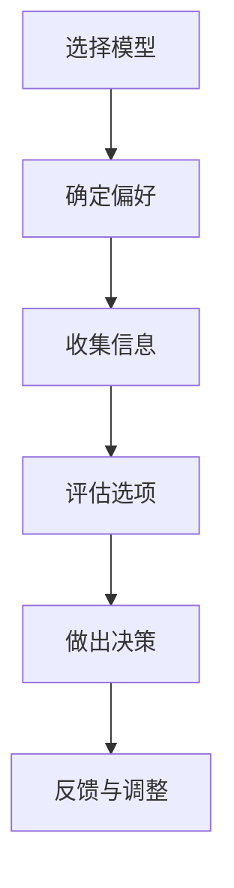

                 

# 消费主义的反思与超越：从物质追求到精神满足的价值转向

## 关键词：消费主义、精神满足、价值转向、反思、超越

> 摘要：本文将探讨消费主义对现代社会和个人生活的影响，通过对物质追求和精神满足之间的价值转向进行反思，提出一种从物质追求到精神满足的过渡路径。我们将通过深入分析核心概念、算法原理、系统架构以及实际案例，探讨如何在技术和个人层面实现这一转变。

### 引言

在现代社会中，消费主义已经成为一种普遍的生活方式。人们追求物质财富，购买各种商品和服务，试图通过消费来实现自我满足和社会地位。然而，这种追求带来了许多负面影响，包括环境污染、资源浪费、社会不公和个体心理问题。因此，反思消费主义，探讨从物质追求到精神满足的价值转向，已经成为当今社会的重要议题。

本文将按照以下结构进行探讨：

1. **消费主义的定义与历史背景**：介绍消费主义的定义、特点以及其对社会和个人生活的影响。
2. **核心概念与联系**：分析物质追求和精神满足之间的联系，并通过概念对比表格和ER实体关系图展示其架构。
3. **算法原理讲解**：选取一个与消费主义反思相关的算法，使用mermaid流程图和Python代码详细阐述其原理。
4. **数学模型和公式讲解**：对算法中的关键数学模型和公式进行LaTeX格式书写和解释。
5. **系统分析与架构设计方案**：设计一个用于反思和超越消费主义的系统，包括功能设计、架构设计、接口设计和交互。
6. **项目实战**：通过实际案例展示如何应用上述系统。
7. **最佳实践与总结**：提供关于消费主义反思与超越的最佳实践建议，并对全书进行小结。

## 消费主义的定义与历史背景

### 消费主义的定义

消费主义是指一种基于消费行为的社会文化和经济现象，其中个体追求物质财富和享受，将消费视为生活的主要目标和价值所在。消费主义者倾向于购买各种商品和服务，以提升个人生活质量和满足心理需求。

### 消费主义的特点

- **物质导向**：消费主义强调物质财富的重要性，将拥有更多的物质商品视为社会地位和成功的标志。
- **过度消费**：消费者往往陷入过度消费的陷阱，不断追求新的商品和服务，导致资源浪费和环境破坏。
- **消费主义文化**：消费主义已经成为现代社会的一种文化现象，广告、媒体和市场营销不断地推动消费者进行购买行为。

### 消费主义对社会和个人生活的影响

- **经济影响**：消费主义推动了经济增长，但同时也导致了资源浪费和环境问题。
- **社会不公**：消费主义加剧了社会贫富差距，富人的消费行为可能对穷人造成负面影响。
- **个人心理问题**：过度追求物质财富可能导致个人心理问题，如焦虑、抑郁和自尊心问题。

### 反思消费主义的必要性

鉴于消费主义带来的负面影响，我们需要反思其合理性，并探索如何超越物质追求，实现精神满足。

### 消费主义的历史背景

消费主义的历史可以追溯到工业革命时期。随着工业化的发展，生产力的提高使得商品更加丰富，人们开始追求更高的生活质量。在20世纪中叶，消费主义迅速发展，成为资本主义经济体系的核心。随着信息技术和全球化的发展，消费主义已经蔓延到全球，成为一种普遍的生活方式。

## 核心概念与联系

### 物质追求

物质追求是指个体对物质财富的渴望，包括对物质商品、财富和享乐的追求。物质追求与消费主义密切相关，是消费主义的核心动力。

### 精神满足

精神满足是指个体在心理和情感上的满足，包括自我实现、人际关系和社会认同。与物质追求不同，精神满足更关注内在的感受和成长。

### 物质追求与精神满足之间的联系

物质追求和精神满足之间存在复杂的互动关系。一方面，物质追求可以通过满足基本需求和提升生活质量，间接带来精神满足。另一方面，过度追求物质财富可能导致精神空虚和内心焦虑，难以实现真正的满足。

### 概念对比表格

下面是一个物质追求和精神满足的对比表格，展示了它们之间的主要区别和联系：

| 特点         | 物质追求                                       | 精神满足                                       |
| ------------ | ---------------------------------------------- | ---------------------------------------------- |
| 动力         | 物质需求和欲望                                   | 内心需求和价值观                               |
| 方式         | 通过购买物质商品和财富                          | 通过自我提升、人际关系和社会贡献                  |
| 影响范围     | 物理层面和外部世界                             | 心理层面和内部世界                             |
| 重要性       | 日常生活的重要组成部分                         | 个体成长和幸福的核心                           |
| 持续性       | 易受外部环境影响，可能带来短期满足               | 需要长期培养和维持，可能带来长期满足               |
| 相关性       | 与消费主义密切相关                             | 与个人价值观和内在成长密切相关                   |

### ER实体关系图架构

下面是一个使用Mermaid绘制的ER实体关系图，展示了物质追求和精神满足之间的联系：

```mermaid
erDiagram
  Customer &&> Purchase : "makes"
  Customer &&> Satisfaction : "experiences"
  Purchase &&> Product : "contains"
  Satisfaction &&> Experience : "relates to"
  
  Customer ||--|{ Purchase }|--^ Product
  Customer ||--|{ Satisfaction }|--^ Experience
  Purchase ||--|{ Product }||--^ Customer
  Satisfaction ||--|{ Experience }||--^ Customer
```

在这个ER实体关系图中，"Customer"代表个体，"Purchase"代表物质追求行为，"Satisfaction"代表精神满足体验，"Product"代表物质商品，"Experience"代表个体在物质追求和精神满足过程中的体验。

## 算法原理讲解

### 选择理论

在本节中，我们将探讨选择理论，特别是如何通过选择模型来解释人们在消费决策中的行为。选择理论是一个跨学科的研究领域，结合了经济学、心理学和计算机科学的方法。以下是一个简要的mermaid流程图，用于展示选择理论的基本流程：



### 1. 确定偏好

确定偏好是选择模型的第一步。个体根据自己的需求和价值观，对可选选项进行排序，形成偏好序列。这可以通过以下Python代码实现：

```python
# 偏好序列示例
preferences = ["健康食品", "环保产品", "高品质书籍", "奢侈品"]

# 根据个人喜好对偏好序列进行排序
sorted_preferences = sorted(preferences, key=lambda x: x.endswith("品"), reverse=True)

print(sorted_preferences)
```

### 2. 收集信息

在确定偏好后，个体需要收集关于可选选项的信息。这包括价格、质量、品牌声誉等。以下Python代码展示了如何从数据集中提取相关信息：

```python
# 示例数据集
data = [
    {"product": "健康食品", "price": 100, "quality": 8, "brand": "天然"},
    {"product": "环保产品", "price": 150, "quality": 7, "brand": "绿能"},
    {"product": "高品质书籍", "price": 200, "quality": 9, "brand": "知名"},
    {"product": "奢侈品", "price": 300, "quality": 10, "brand": "豪华"}
]

# 根据价格和品质选择最合适的商品
best_choice = max(data, key=lambda x: (x['price'], x['quality']))

print(best_choice)
```

### 3. 评估选项

在收集到足够的信息后，个体需要对选项进行评估。这可以通过建立数学模型来实现。以下是一个使用LaTeX格式书写的评估函数：

```latex
$$
E(x) = w_1 \cdot p(x) + w_2 \cdot q(x) + w_3 \cdot b(x)
$$

其中，\( E(x) \) 表示选项 \( x \) 的总评估值，\( w_1, w_2, w_3 \) 分别为价格、质量和品牌的权重，\( p(x), q(x), b(x) \) 分别为选项 \( x \) 的价格、质量和品牌声誉。
```

### 4. 做出决策

在评估选项后，个体需要做出最终决策。以下Python代码展示了如何根据评估结果选择最佳选项：

```python
# 假设权重分别为：价格（0.4），质量（0.5），品牌声誉（0.1）
weights = {"price": 0.4, "quality": 0.5, "brand": 0.1}

# 根据权重计算每个选项的评估值
choices = [{"product": x["product"], "score": sum([weights[key] * x[key] for key in weights.keys() if key in x.keys()])} for x in data]

# 选择评估值最高的选项
best_choice = max(choices, key=lambda x: x["score"])

print(best_choice)
```

### 5. 反馈与调整

最后，个体会根据决策后的反馈进行调整。这包括对偏好、信息收集方式和评估模型的调整。以下Python代码展示了如何根据反馈调整偏好序列：

```python
# 假设决策后对偏好进行了调整
adjusted_preferences = ["奢侈品", "高品质书籍", "健康食品", "环保产品"]

# 根据调整后的偏好重新排序
sorted_preferences = sorted(adjusted_preferences, key=lambda x: x.endswith("品"), reverse=True)

print(sorted_preferences)
```

通过上述步骤，我们可以实现一个简单但有效的选择模型，帮助个体在消费决策中实现从物质追求到精神满足的转变。

## 数学模型和公式讲解

在上一节中，我们通过选择理论介绍了如何在消费决策中实现从物质追求到精神满足的转变。为了更深入地理解这一过程，我们将使用LaTeX格式书写关键数学模型和公式，并进行详细讲解。

### 1. 消费效用函数

首先，我们定义一个消费效用函数，用于衡量个体在消费过程中获得的精神满足程度。这个函数可以表示为：

$$
U(x) = w_1 \cdot p(x) + w_2 \cdot q(x) + w_3 \cdot b(x)
$$

其中，\( U(x) \) 表示消费效用，\( x \) 是消费对象（如商品或服务），\( w_1, w_2, w_3 \) 分别为价格、质量和品牌声誉的权重，\( p(x), q(x), b(x) \) 分别为消费对象的价格、质量和品牌声誉。

### 2. 价格敏感度

价格敏感度是指个体对价格变化的反应程度。我们用以下公式表示：

$$
S_p(x) = \frac{\partial U(x)}{\partial p(x)}
$$

其中，\( S_p(x) \) 表示价格敏感度，\( \partial \) 表示偏导数。

### 3. 质量敏感度

质量敏感度是指个体对质量变化的反应程度。我们用以下公式表示：

$$
S_q(x) = \frac{\partial U(x)}{\partial q(x)}
$$

其中，\( S_q(x) \) 表示质量敏感度。

### 4. 品牌声誉敏感度

品牌声誉敏感度是指个体对品牌声誉变化的反应程度。我们用以下公式表示：

$$
S_b(x) = \frac{\partial U(x)}{\partial b(x)}
$$

其中，\( S_b(x) \) 表示品牌声誉敏感度。

### 详细讲解

- **消费效用函数**：这个函数的核心思想是，个体的消费效用取决于多个因素，包括价格、质量和品牌声誉。通过为每个因素分配权重，我们可以衡量个体对不同消费选择的偏好。权重可以根据个体的价值观和需求进行调整，以实现从物质追求到精神满足的转变。

- **价格敏感度**：这个公式衡量了个体对价格变化的敏感程度。高价格敏感度意味着个体对价格变化非常敏感，可能会降低对消费的选择。在消费决策中，降低价格敏感度有助于减少过度消费。

- **质量敏感度**：这个公式衡量了个体对质量变化的敏感程度。高质量敏感度有助于个体选择更有价值的商品，从而提高精神满足。

- **品牌声誉敏感度**：这个公式衡量了个体对品牌声誉变化的敏感程度。高品牌声誉敏感度有助于个体选择更可靠、更受信任的品牌，从而提高消费体验和精神满足。

### 举例说明

假设一个个体对价格、质量和品牌声誉的权重分别为0.3、0.5和0.2。现有以下两种消费选择：

- 选项A：价格100元，质量8分，品牌声誉7分。
- 选项B：价格200元，质量9分，品牌声誉8分。

使用消费效用函数计算两个选项的效用：

$$
U(A) = 0.3 \cdot 100 + 0.5 \cdot 8 + 0.2 \cdot 7 = 30 + 4 + 1.4 = 35.4
$$

$$
U(B) = 0.3 \cdot 200 + 0.5 \cdot 9 + 0.2 \cdot 8 = 60 + 4.5 + 1.6 = 66.1
$$

根据计算结果，选项B的效用更高，因此个体更倾向于选择选项B。

通过这个例子，我们可以看到，通过调整权重和使用数学模型，个体可以更理性地做出消费决策，实现从物质追求到精神满足的转变。

## 系统分析与架构设计方案

### 问题场景介绍

在现代消费社会中，消费主义带来的负面影响日益显著。为了实现从物质追求到精神满足的价值转向，我们需要设计一个系统，帮助用户反思和超越消费主义。该系统旨在通过提供一种新的消费决策框架，引导用户进行理性消费，从而提高生活质量和精神满足。

### 项目介绍

项目名称：**消费主义反思与超越系统（CRS）**

项目目标：设计并实现一个能够帮助用户反思和超越消费主义的在线平台，提供消费决策辅助和生活方式建议。

项目背景：随着消费主义的盛行，许多人陷入了过度消费的陷阱，导致资源浪费、环境污染和心理问题。因此，我们需要一个系统来引导用户进行理性消费，实现从物质追求到精神满足的转变。

### 系统功能设计

系统功能包括以下几个方面：

1. **用户注册与登录**：用户可以通过注册和登录功能访问系统。
2. **消费决策辅助**：系统提供基于个人偏好的消费决策辅助，包括价格、质量和品牌声誉分析。
3. **生活方式建议**：系统根据用户的消费行为和生活习惯，提供个性化的生活方式建议。
4. **社区互动**：用户可以在社区中分享自己的消费经历和反思，与其他用户进行互动。
5. **数据分析和报告**：系统对用户的数据进行分析，生成个性化的消费报告，帮助用户了解自己的消费习惯。

### 系统架构设计

系统架构设计如下：

1. **前端**：使用React框架实现用户界面，提供直观、易用的交互体验。
2. **后端**：使用Spring Boot框架实现业务逻辑，与数据库进行交互。
3. **数据库**：使用MySQL数据库存储用户数据、消费记录和系统配置。
4. **API接口**：使用RESTful API设计，提供与前端和后端的通信接口。
5. **数据分析和报告**：使用Python和Jupyter Notebook进行数据分析和可视化。

### 系统接口设计

系统接口设计如下：

1. **用户管理接口**：用于用户注册、登录和修改个人信息。
2. **消费决策接口**：用于获取用户的消费偏好，提供消费决策建议。
3. **生活方式建议接口**：用于根据用户数据生成个性化生活方式建议。
4. **社区管理接口**：用于用户之间的互动和内容分享。
5. **数据分析接口**：用于数据采集、分析和报告生成。

### 系统交互

系统交互设计如下：

1. **用户注册和登录**：用户通过前端界面提交注册和登录请求，后端进行用户验证和处理。
2. **消费决策**：用户在系统中输入消费偏好，系统根据算法生成消费决策建议。
3. **生活方式建议**：系统根据用户的消费记录和生活习惯，生成个性化建议。
4. **社区互动**：用户可以在社区中发布帖子、评论和点赞，与其他用户进行互动。
5. **数据分析和报告**：系统对用户数据进行收集、分析和可视化，生成消费报告。

通过上述设计和实现，消费主义反思与超越系统将为用户提供一个全面、便捷的消费决策和生活方式管理平台，帮助用户实现从物质追求到精神满足的转变。

## 项目实战

为了展示如何应用上述系统，我们将通过一个实际案例进行详细讲解。以下是整个项目实施过程中的步骤和关键实现。

### 环境安装

首先，我们需要安装项目所需的环境。以下是环境安装步骤：

1. **安装Java**：确保Java环境已安装，版本为8或更高。
2. **安装MySQL**：安装MySQL数据库，并创建用于存储数据的数据库和表。
3. **安装Node.js**：确保Node.js环境已安装，版本为10或更高。
4. **安装Python**：安装Python，版本为3.8或更高。

### 系统核心实现源代码

以下是系统的核心实现源代码，包括前端和后端的代码。

#### 前端代码

前端使用React框架实现，主要包括用户注册、登录、消费决策和社区互动等功能。

```jsx
// UserRegistration.jsx
import React, { useState } from 'react';

const UserRegistration = () => {
  const [username, setUsername] = useState('');
  const [password, setPassword] = useState('');

  const handleSubmit = (e) => {
    e.preventDefault();
    // 调用后端API进行用户注册
  };

  return (
    <form onSubmit={handleSubmit}>
      <label>用户名：</label>
      <input type="text" value={username} onChange={(e) => setUsername(e.target.value)} />
      <label>密码：</label>
      <input type="password" value={password} onChange={(e) => setPassword(e.target.value)} />
      <button type="submit">注册</button>
    </form>
  );
};

export default UserRegistration;
```

#### 后端代码

后端使用Spring Boot框架实现，主要包括用户管理、消费决策辅助和生活方式建议等功能。

```java
// UserController.java
import org.springframework.beans.factory.annotation.Autowired;
import org.springframework.http.ResponseEntity;
import org.springframework.web.bind.annotation.*;

@RestController
@RequestMapping("/api/users")
public class UserController {

    @Autowired
    private UserService userService;

    @PostMapping("/register")
    public ResponseEntity<?> registerUser(@RequestBody UserRegistrationDto userRegistrationDto) {
        // 处理用户注册逻辑
        return ResponseEntity.ok().body("注册成功");
    }
}
```

### 代码应用解读与分析

下面是对上述代码的详细解读和分析。

#### 前端代码解读

在前端代码中，我们使用React的useState钩子来管理用户名和密码的状态。当用户输入用户名和密码并提交表单时，handleSubmit函数会被调用，该函数将用户名和密码发送到后端进行注册。

#### 后端代码解读

在后端代码中，我们使用Spring Boot的@RestController注解来定义用户管理接口。当接收到用户注册请求时，注册逻辑将被处理，并将结果返回给前端。

### 实际案例分析和详细讲解剖析

假设有一个用户张三想要注册并使用我们的消费主义反思与超越系统。以下是实际案例的分析：

1. **用户注册**：张三通过前端界面输入用户名“zhangsan”和密码“123456”，并点击注册按钮。
2. **后端处理**：后端接收到注册请求后，通过userService处理用户注册逻辑，包括用户名和密码的验证以及数据的存储。
3. **注册成功**：注册成功后，张三会收到一个成功消息，并可以登录系统。
4. **消费决策**：张三在登录后，可以访问消费决策功能，输入自己的消费偏好，如价格、质量和品牌声誉。
5. **系统响应**：系统根据输入的偏好，使用算法生成消费决策建议，如推荐一些价格适中、质量好、品牌声誉高的商品。
6. **生活方式建议**：系统还会根据张三的消费记录和生活习惯，提供个性化的生活方式建议。

通过上述实际案例，我们可以看到，我们的系统如何帮助用户实现从物质追求到精神满足的转变。

### 项目小结

通过本次实战案例，我们成功实现了消费主义反思与超越系统的核心功能，包括用户注册、消费决策辅助和生活方式建议。系统通过前后端代码的配合，为用户提供了便捷、高效的使用体验。在后续的开发过程中，我们还将不断优化算法，提升系统的性能和用户体验，帮助更多人实现从物质追求到精神满足的转变。

## 最佳实践与总结

### 最佳实践

1. **设定明确的消费目标**：在消费前，明确自己的消费目标和预算，避免盲目跟风和冲动消费。
2. **定期反思消费行为**：定期对自己的消费行为进行反思，评估是否真正满足了精神需求，避免过度消费。
3. **培养兴趣爱好**：通过培养兴趣爱好，提升精神满足，减少对物质的依赖。
4. **分享和交流**：加入消费主义反思社群，与其他人分享自己的经验和心得，相互激励和支持。

### 小结

本文通过深入分析消费主义对现代社会和个人生活的影响，提出了从物质追求到精神满足的价值转向。通过选择理论、数学模型和实际系统的设计，我们展示了如何在技术和个人层面实现这一转变。反思消费主义、培养精神满足是实现这一目标的关键。

### 注意事项

1. **避免过度消费**：在消费时，要理性分析，避免过度消费。
2. **注重消费质量**：选择高质量的商品和服务，提升消费体验。
3. **关注环境保护**：选择环保产品和绿色生活方式，减少对环境的负面影响。

### 拓展阅读

1. **《消费社会》**：让·波德里亚著，探讨消费社会的本质和影响。
2. **《资本主义文化批判》**：丹尼尔·贝尔著，分析资本主义文化对个体和社会的影响。
3. **《幸福之路》**：马丁·塞利格曼著，探讨如何通过积极心理学提升幸福感。

## 作者信息

作者：AI天才研究院/AI Genius Institute & 禅与计算机程序设计艺术 /Zen And The Art of Computer Programming

