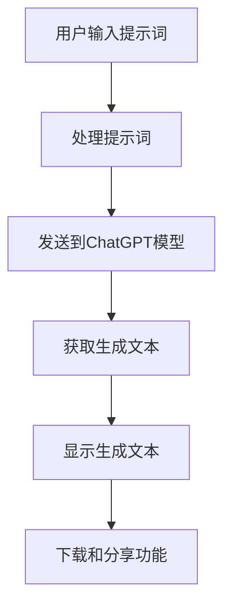
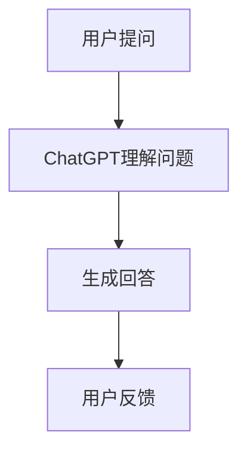
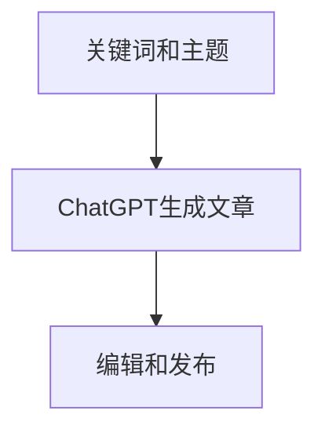
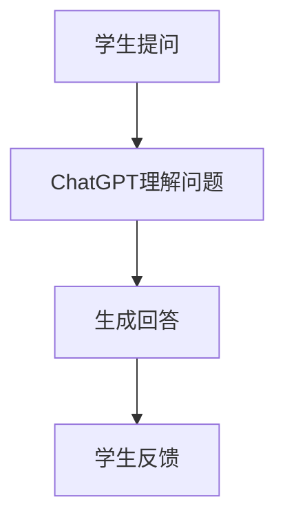
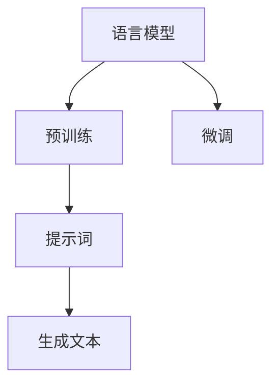

                 

# 深入浅出：ChatGPT提示词编写的艺术

## 关键词：ChatGPT、提示词、自然语言处理、人工智能、应用实践

## 摘要：
随着人工智能技术的不断发展，自然语言处理（NLP）成为了计算机科学领域的一个重要分支。ChatGPT，作为一种基于GPT-3模型的高级语言模型，在NLP领域展现出了巨大的潜力。本文将深入浅出地探讨ChatGPT提示词编写的艺术，包括提示词的定义、编写原则、技巧以及在不同领域的应用。通过本文的阅读，读者将了解如何有效地编写高质量的提示词，提升ChatGPT的性能和应用效果。

## 目录大纲

### 第1章: ChatGPT概述

#### 1.1 问题背景与ChatGPT简介
##### 1.1.1 大模型与自然语言处理
##### 1.1.2 ChatGPT的特点与应用
##### 1.1.3 提示词编写的重要性

#### 1.2 核心概念与联系
##### 1.2.1 提示词的定义与作用
##### 1.2.2 提示词编写原则
##### 1.2.3 提示词与响应的关联性

#### 1.3 主流ChatGPT模型简介
##### 1.3.1 GPT-2
##### 1.3.2 GPT-3
##### 1.3.3 其他版本ChatGPT介绍

#### 1.4 ChatGPT在企业中的应用前景
##### 1.4.1 客户服务
##### 1.4.2 营销与宣传
##### 1.4.3 数据分析与洞察

#### 1.5 本章小结

### 第2章: 提示词编写技巧

#### 2.1 简明有效的提示词
##### 2.1.1 提示词的基本构成
##### 2.1.2 提示词的简洁性
##### 2.1.3 提示词的准确性

#### 2.2 提问技巧与回应
##### 2.2.1 提问的结构化
##### 2.2.2 提问的开放性
##### 2.2.3 应对的多样性

#### 2.3 语言风格与语境
##### 2.3.1 语言风格的把握
##### 2.3.2 语境的理解与应用
##### 2.3.3 语境切换与保持一致性

#### 2.4 提示词案例分享
##### 2.4.1 实际应用案例
##### 2.4.2 案例分析与优化

#### 2.5 提示词编写工具推荐
##### 2.5.1 提示词编辑器
##### 2.5.2 提示词生成工具
##### 2.5.3 提示词评估工具

#### 2.6 本章小结

### 第3章: 提示词编写实战

#### 3.1 环境搭建与准备
##### 3.1.1 环境配置
##### 3.1.2 开发工具安装
##### 3.1.3 实战项目准备

#### 3.2 项目一：创建简单的ChatGPT应用
##### 3.2.1 项目需求分析
##### 3.2.2 系统架构设计
##### 3.2.3 核心代码实现
##### 3.2.4 运行与测试

#### 3.3 项目二：优化ChatGPT应用
##### 3.3.1 功能扩展
##### 3.3.2 提示词优化
##### 3.3.3 性能调优
##### 3.3.4 案例分析与反思

#### 3.4 本章小结

### 第4章: 高级提示词编写技巧

#### 4.1 复杂问题应对策略
##### 4.1.1 理解复杂问题
##### 4.1.2 提问技巧提升
##### 4.1.3 提示词设计

#### 4.2 提示词调优方法
##### 4.2.1 基于数据的提示词优化
##### 4.2.2 实时反馈与调整
##### 4.2.3 模型参数调整

#### 4.3 情感化提示词编写
##### 4.3.1 情感识别与表达
##### 4.3.2 情感化提示词设计
##### 4.3.3 情感化应用的实例

#### 4.4 多模态提示词编写
##### 4.4.1 文本与图像结合
##### 4.4.2 声音与文本结合
##### 4.4.3 多模态提示词案例

#### 4.5 本章小结

### 第5章: ChatGPT在特定领域的应用

#### 5.1 营销与宣传
##### 5.1.1 营销策略设计
##### 5.1.2 提示词编写要点
##### 5.1.3 应用实例分析

#### 5.2 客户服务
##### 5.2.1 客户服务场景分析
##### 5.2.2 提示词编写技巧
##### 5.2.3 案例与实践

#### 5.3 教育与培训
##### 5.3.1 教育应用场景
##### 5.3.2 提示词编写方法
##### 5.3.3 成功案例分享

#### 5.4 数据分析与洞察
##### 5.4.1 数据分析背景
##### 5.4.2 提示词编写策略
##### 5.4.3 洞察发现与应用

#### 5.5 本章小结

### 第6章: 提示词编写最佳实践与注意事项

#### 6.1 最佳实践分享
##### 6.1.1 提示词编写经验总结
##### 6.1.2 高效编写技巧
##### 6.1.3 成功案例剖析

#### 6.2 注意事项
##### 6.2.1 避免常见错误
##### 6.2.2 数据安全与隐私保护
##### 6.2.3 提示词的适应性

#### 6.3 持续学习与进步
##### 6.3.1 学习资源推荐
##### 6.3.2 行业动态跟踪
##### 6.3.3 个人成长路径

#### 6.4 本章小结

### 第7章: 拓展阅读与深入研究

#### 7.1 相关书籍推荐
##### 7.1.1 深入阅读推荐
##### 7.1.2 高级教程推荐
##### 7.1.3 实战案例集推荐

#### 7.2 学习资源推荐
##### 7.2.1 在线课程推荐
##### 7.2.2 论坛与社区推荐
##### 7.2.3 实践项目推荐

## 第1章: ChatGPT概述

### 1.1 问题背景与ChatGPT简介

自然语言处理（NLP）是人工智能领域的一个重要分支，旨在使计算机能够理解和处理人类语言。随着深度学习技术的发展，大型语言模型（如GPT-3）在NLP领域展现出了强大的能力，推动了人工智能技术的发展。

**问题背景**：
在现实世界中，人们经常需要与计算机进行自然语言交互，例如智能客服、文本生成、机器翻译等应用。然而，传统的NLP方法往往依赖于规则或统计方法，难以实现高效的语义理解和生成。为了解决这一问题，研究人员开发了大型预训练语言模型，其中GPT-3尤为突出。

**ChatGPT简介**：
ChatGPT是基于GPT-3模型的高级语言模型，旨在提供自然、流畅的语言生成能力。它通过大量的文本数据进行预训练，能够理解并生成符合上下文和语义的自然语言文本。ChatGPT在多个NLP任务中表现出色，包括文本生成、问答系统、情感分析等。

### 1.1.1 大模型与自然语言处理

大模型（Large Models）是指在数据量、参数规模和计算能力上具有显著优势的机器学习模型。在自然语言处理领域，大模型的出现极大地提升了模型的性能和应用效果。

**大模型的优势**：
1. **强大的语义理解能力**：大模型通过大量的文本数据进行预训练，能够捕捉到语言中的复杂模式和语义信息，从而实现更准确的自然语言处理。
2. **自适应性和灵活性**：大模型在预训练过程中学习了广泛的文本数据，因此能够适应不同的应用场景和任务需求。
3. **高效的数据利用**：大模型可以通过迁移学习技术在不同的任务中进行应用，从而实现高效的模型部署和数据利用。

**自然语言处理**：
自然语言处理是人工智能的一个分支，旨在使计算机能够理解、生成和处理人类语言。NLP的应用场景广泛，包括文本分类、情感分析、机器翻译、问答系统等。

### 1.1.2 ChatGPT的特点与应用

**ChatGPT的特点**：
1. **强大的语言生成能力**：ChatGPT基于GPT-3模型，具有强大的自然语言生成能力，能够生成流畅、自然的文本。
2. **多任务处理能力**：ChatGPT可以同时处理多个任务，如文本生成、问答系统、对话系统等。
3. **适应性强**：ChatGPT通过大量的文本数据进行预训练，能够适应不同的应用场景和任务需求。

**ChatGPT的应用**：
1. **智能客服**：ChatGPT可以用于构建智能客服系统，实现与用户的自然语言交互，提高客户满意度和服务效率。
2. **文本生成**：ChatGPT可以用于生成新闻文章、报告、故事等文本内容，提高内容创作效率。
3. **问答系统**：ChatGPT可以用于构建问答系统，实现高效、准确的自然语言问答。

### 1.1.3 提示词编写的重要性

**提示词（Prompt）**是指在ChatGPT中使用的一段引导性文本，用于引导模型生成符合期望的输出。提示词的编写在ChatGPT的性能和应用效果中起着至关重要的作用。

**提示词的重要性**：
1. **影响生成文本的质量**：高质量的提示词能够引导模型生成更准确、自然的文本，提高生成文本的质量。
2. **决定应用效果**：不同应用场景下，合适的提示词能够实现更好的应用效果，例如在智能客服中，合适的提示词可以提高客户满意度。
3. **提升用户体验**：高质量的提示词能够引导模型生成更符合用户需求的文本，提高用户体验。

### 1.2 核心概念与联系

#### 1.2.1 提示词的定义与作用

**提示词的定义**：
提示词是指用于引导ChatGPT生成特定类型文本的引导性文本。在ChatGPT应用中，提示词起到了关键作用，直接影响生成文本的质量和应用效果。

**提示词的作用**：
1. **引导模型生成**：提示词能够引导ChatGPT生成符合期望的文本，提高生成文本的准确性和自然性。
2. **明确任务目标**：提示词可以帮助ChatGPT明确任务目标，从而实现更精准的任务执行。
3. **优化用户体验**：合适的提示词可以引导模型生成更符合用户需求的文本，提高用户体验。

#### 1.2.2 提示词编写原则

**提示词编写原则**：
1. **简洁明了**：提示词应尽量简洁明了，避免冗长、复杂的句子，以便ChatGPT能够准确理解。
2. **结构清晰**：提示词应具有清晰的逻辑结构和语言风格，有助于ChatGPT生成符合上下文和语义的文本。
3. **符合任务需求**：提示词应充分了解任务需求和目标，从而生成符合任务要求的文本。

#### 1.2.3 提示词与响应的关联性

**提示词与响应的关联性**：
提示词和响应之间的关联性对于ChatGPT的性能和应用效果至关重要。高质量的提示词能够引导ChatGPT生成更准确、自然的响应，从而实现更好的应用效果。

**关联性分析**：
1. **上下文关联**：提示词应包含与上下文相关的信息，以引导ChatGPT生成符合上下文的响应。
2. **语义关联**：提示词应明确表达任务目标和期望的语义，以引导ChatGPT生成符合语义的响应。
3. **多样性**：提示词应具有一定的多样性，以避免ChatGPT生成重复或固定的响应。

### 1.3 主流ChatGPT模型简介

**GPT-2**：
GPT-2是OpenAI开发的一种大型语言模型，具有1.5亿个参数。GPT-2在多个NLP任务中取得了显著的效果，是ChatGPT的基础模型。

**GPT-3**：
GPT-3是OpenAI于2020年发布的一种更先进的语言模型，具有1750亿个参数。GPT-3在自然语言生成、问答系统、对话系统等多个领域取得了突破性进展，是当前最先进的语言模型之一。

**其他版本ChatGPT介绍**：
除了GPT-2和GPT-3，OpenAI还发布了其他版本的ChatGPT模型，如InstructGPT、ChatGPT等。这些模型在特定任务和应用场景中表现出色，为ChatGPT的发展提供了更多可能性。

### 1.4 ChatGPT在企业中的应用前景

**客户服务**：
ChatGPT可以用于构建智能客服系统，实现与用户的自然语言交互，提高客户满意度和服务效率。通过合适的提示词编写，ChatGPT可以更好地理解用户需求，生成更准确、自然的回复。

**营销与宣传**：
ChatGPT可以用于生成营销文案、宣传材料等文本内容，提高内容创作效率。通过合适的提示词编写，ChatGPT可以生成更具吸引力和个性化的文本，提高营销效果。

**数据分析和洞察**：
ChatGPT可以用于文本数据分析，提取关键信息、生成报告等。通过合适的提示词编写，ChatGPT可以更好地理解文本数据，生成更有价值的数据洞察。

### 1.5 本章小结

本章对ChatGPT进行了概述，介绍了大模型与自然语言处理的关系，ChatGPT的特点与应用，以及提示词的定义与作用。通过本章的学习，读者可以了解ChatGPT的基本概念和应用前景，为后续章节的学习打下基础。

## 第2章: 提示词编写技巧

### 2.1 简明有效的提示词

#### 2.1.1 提示词的基本构成

提示词是引导ChatGPT生成特定类型文本的引导性文本，其基本构成包括以下几个部分：

1. **任务目标**：明确需要完成的任务或目标，如“生成一篇关于人工智能的文章”。
2. **上下文信息**：提供与任务相关的背景信息，如“人工智能是一种模拟人类智能的技术，目前广泛应用于各个领域”。
3. **期望输出**：描述期望生成的文本类型和风格，如“要求文章具有逻辑清晰、条理分明、通俗易懂的特点”。

#### 2.1.2 提示词的简洁性

简洁性是提示词编写的重要原则之一。简洁的提示词能够提高ChatGPT的理解和生成效率，降低模型运行时间和计算成本。以下是几种实现简洁性的方法：

1. **去除冗余信息**：避免在提示词中重复描述相同的信息，简化文本表达。
2. **使用简洁的语言**：尽量使用简单、直观的词语和句子，避免使用复杂的语法和修辞手法。
3. **突出关键信息**：将任务目标、上下文信息和期望输出等重点信息突出显示，提高ChatGPT的关注度。

#### 2.1.3 提示词的准确性

准确性是提示词编写的重要原则之一。准确的提示词能够引导ChatGPT生成符合期望的文本，提高生成文本的质量和应用效果。以下是几种实现准确性的方法：

1. **明确任务目标**：确保提示词中明确表达了任务目标和要求，避免歧义和模糊性。
2. **提供具体细节**：在提示词中提供具体的细节信息，如时间、地点、人物等，帮助ChatGPT更好地理解和生成文本。
3. **检查和验证**：在编写提示词后，对提示词进行仔细检查和验证，确保其准确性和完整性。

### 2.2 提问技巧与回应

#### 2.2.1 提问的结构化

结构化的提问能够提高ChatGPT的理解和生成效率，有助于生成更准确、自然的文本。以下是几种实现结构化的方法：

1. **分段提问**：将问题分为多个部分，逐个提问，有助于ChatGPT更好地理解和生成文本。
2. **使用引导性词语**：在提问中使用引导性词语，如“请”、“能否”、“您是否愿意”等，有助于ChatGPT明确任务目标和要求。
3. **逻辑顺序**：按照问题的逻辑顺序进行提问，避免跳跃和混乱，有助于ChatGPT生成逻辑清晰的文本。

#### 2.2.2 提问的开放性

开放性的提问能够引导ChatGPT生成更丰富、多样的文本，提高文本的创造性和灵活性。以下是几种实现开放性的方法：

1. **使用开放性词语**：在提问中使用开放性词语，如“怎样”、“如何”、“有哪些”等，鼓励ChatGPT进行思考和创造。
2. **提供多种选项**：在提问中提供多种选项，如“您可以选择A、B、C中的任意一个”，引导ChatGPT进行选择和生成。
3. **鼓励补充信息**：在提问中鼓励ChatGPT提供补充信息，如“您能否补充一下相关信息”，引导ChatGPT生成更丰富的文本。

#### 2.2.3 应对的多样性

多样化的应对能够提高ChatGPT的生成能力和适应性，有助于生成更丰富、多样的文本。以下是几种实现多样性的方法：

1. **使用不同的语言风格**：在应对中尝试使用不同的语言风格，如正式、幽默、诙谐等，增加文本的多样性和趣味性。
2. **引用不同的文献和资料**：在应对中引用不同的文献和资料，如书籍、论文、新闻等，丰富文本的内容和知识性。
3. **使用不同的视角和观点**：在应对中尝试从不同的视角和观点进行回答，如正反两面、不同人群的看法等，增加文本的多样性和深度。

### 2.3 语言风格与语境

#### 2.3.1 语言风格的把握

语言风格是指文本的语言表达方式，包括正式、幽默、诙谐、通俗易懂等。合适的语言风格能够增强文本的表达力和感染力，提高文本的吸引力和阅读体验。以下是几种把握语言风格的方法：

1. **了解目标受众**：根据目标受众的特点和需求，选择适合的语言风格，如面向专业受众应使用正式、专业的语言，面向普通读者应使用通俗易懂的语言。
2. **运用修辞手法**：运用修辞手法，如比喻、拟人、排比等，增强文本的表达力和感染力。
3. **注意语言规范**：遵循语言规范，如语法、拼写、标点等，确保文本的准确性和规范性。

#### 2.3.2 语境的理解与应用

语境是指语言表达所处的具体环境，包括时间、地点、人物、事件等。理解并应用语境能够增强文本的准确性和连贯性，提高文本的质量和应用效果。以下是几种理解和应用语境的方法：

1. **关注上下文**：关注文本的上下文信息，理解语境中的时间、地点、人物、事件等，确保文本的连贯性和准确性。
2. **运用背景知识**：运用背景知识，如历史、文化、专业知识等，增强文本的内涵和深度。
3. **根据语境调整语言**：根据语境调整语言表达方式，如正式场合使用正式语言，娱乐场合使用幽默语言等。

#### 2.3.3 语境切换与保持一致性

在编写提示词时，有时需要根据不同的语境进行切换和保持一致性。以下是几种实现语境切换和保持一致性的方法：

1. **明确切换标志**：使用明确的切换标志，如“接下来，我们将讨论另一个话题”、“现在转向另一个方面”等，引导ChatGPT进行语境切换。
2. **保持主题一致性**：在切换语境时，确保主题的一致性，避免出现内容无关或逻辑混乱的情况。
3. **逐步过渡**：通过逐步过渡的方式，如“在此之前，我们讨论了……接下来，我们将探讨……”等，引导ChatGPT保持一致性。

### 2.4 提示词案例分享

#### 2.4.1 实际应用案例

**案例1**：智能客服

提示词：“您好，欢迎来到我们的智能客服系统。您需要咨询关于产品售后服务的问题吗？请告诉我您的具体问题，我将尽力为您提供帮助。”

**案例2**：文本生成

提示词：“请根据以下信息，生成一篇关于人工智能在医疗领域的应用的文章。人工智能在医疗领域具有广泛的应用前景，可以帮助医生提高诊断准确性和效率。”

#### 2.4.2 案例分析与优化

**案例1分析**：这个提示词明确地介绍了智能客服的目的和功能，引导用户提出具体问题。然而，提示词中的“您需要咨询关于产品售后服务的问题吗？”可以改为“您有任何关于产品售后服务的问题需要咨询吗？”以提高开放性和多样性。

**案例2分析**：这个提示词清晰地表达了文本生成的任务和目标，但可以进一步优化。例如，可以添加关于文章结构、长度和风格的要求，如：“请根据以下信息，生成一篇约1000字、具有逻辑清晰、条理分明、通俗易懂特点的关于人工智能在医疗领域的应用的文章。”

### 2.5 提示词编写工具推荐

#### 2.5.1 提示词编辑器

1. **Notepad++**：一款免费的文本编辑器，支持多种编程语言和格式，适合编写和编辑提示词。
2. **Sublime Text**：一款强大的文本编辑器，具有丰富的插件和自定义功能，适合编写和编辑提示词。

#### 2.5.2 提示词生成工具

1. **PromptGenius**：一款基于自然语言处理的提示词生成工具，可以帮助用户快速生成高质量的提示词。
2. **PromptGen**：一款开源的提示词生成工具，支持多种编程语言和模型，适合专业用户使用。

#### 2.5.3 提示词评估工具

1. **BLEU**：一种常用的自动评估方法，用于评估文本生成的质量和准确性。
2. **ROUGE**：一种基于记分的评估方法，用于评估文本生成的多样性和连贯性。

### 2.6 本章小结

本章介绍了提示词编写的基本技巧，包括提示词的基本构成、简洁性、准确性，以及提问技巧、语言风格与语境、提示词案例分享和编写工具推荐。通过本章的学习，读者可以掌握提示词编写的核心原则和技巧，为实际应用打下基础。

### 第3章: 提示词编写实战

#### 3.1 环境搭建与准备

在进行ChatGPT提示词编写的实战之前，我们需要搭建一个合适的环境，并进行必要的准备工作。以下是一些建议和步骤：

**1. 环境配置**

首先，确保您的计算机上安装了Python环境和相关依赖库。可以使用以下命令来安装Python和必要的依赖库：

```bash
pip install python
pip install numpy
pip install torch
```

**2. 开发工具安装**

选择一款适合您的文本编辑器，例如Notepad++或Sublime Text，用于编写提示词。如果您需要进行编程和调试，也可以选择集成开发环境（IDE），如PyCharm或Visual Studio Code。

**3. 实战项目准备**

创建一个新项目文件夹，用于存放与ChatGPT提示词编写相关的代码、数据和文档。确保您的项目结构清晰，便于后续开发和维护。

**4. 数据准备**

准备一些高质量的文本数据，用于训练和测试ChatGPT模型。这些数据可以来自于公开数据集、网络爬取或其他可靠来源。确保数据内容丰富、多样，涵盖您关注的主题和领域。

**5. 模型选择**

选择一个合适的ChatGPT模型，如GPT-2或GPT-3，用于生成文本。根据您的需求和资源，可以从开源模型或商业模型中选择。

**6. 模型部署**

如果使用开源模型，可以使用如Hugging Face等工具进行模型部署。如果使用商业模型，需要按照相关服务商的指导进行部署。

#### 3.2 项目一：创建简单的ChatGPT应用

**1. 项目需求分析**

本项目旨在创建一个简单的ChatGPT应用，实现以下功能：

1. 提供一个用户界面，用于输入提示词。
2. 将用户输入的提示词发送到ChatGPT模型，获取生成文本。
3. 在用户界面中显示生成文本，并提供下载和分享功能。

**2. 系统架构设计**

系统架构设计如下图所示：



**3. 核心代码实现**

以下是实现本项目核心功能的Python代码：

```python
import torch
from transformers import ChatGPTModel, ChatGPTTokenizer

# 初始化模型和 tokenizer
model = ChatGPTModel.from_pretrained("gpt2")
tokenizer = ChatGPTTokenizer.from_pretrained("gpt2")

# 处理用户输入提示词
def process_prompt(prompt):
    # 对提示词进行编码
    inputs = tokenizer.encode(prompt, return_tensors="pt")
    # 使用模型进行预测
    outputs = model(inputs)
    # 获取生成文本
    generated_text = tokenizer.decode(outputs[0], skip_special_tokens=True)
    return generated_text

# 显示生成文本
def show_generated_text(generated_text):
    print(generated_text)

# 测试
prompt = "请写一篇关于人工智能的文章。"
generated_text = process_prompt(prompt)
show_generated_text(generated_text)
```

**4. 运行与测试**

运行以上代码，输入提示词，查看生成文本。确保系统能够正确处理用户输入，生成符合期望的文本。

#### 3.3 项目二：优化ChatGPT应用

**1. 功能扩展**

在第一个项目中，我们实现了简单的文本生成功能。为了提高应用的价值和用户满意度，我们可以扩展以下功能：

1. 多种语言支持：支持多种语言的文本生成，满足不同用户的需求。
2. 情感分析：对生成文本进行情感分析，提供情感化的回复。
3. 自动回复：根据用户输入，自动生成合适的回复，提高交互体验。

**2. 提示词优化**

为了提高生成文本的质量和应用效果，我们可以优化提示词的编写。以下是一些建议：

1. 简明扼要：确保提示词简洁明了，避免冗长和复杂的句子。
2. 结构清晰：提示词应具有清晰的逻辑结构和语言风格，有助于生成逻辑清晰的文本。
3. 结合上下文：在提示词中结合上下文信息，引导模型生成符合上下文的文本。

**3. 性能调优**

为了提高ChatGPT应用的性能和效率，我们可以进行以下调优：

1. 缩小模型规模：根据实际需求，选择合适的模型规模，降低计算成本。
2. 加速计算：使用GPU或TorchScript等加速计算，提高模型运行速度。
3. 并行处理：利用多线程或多进程技术，提高模型处理速度。

**4. 案例分析与反思**

在优化过程中，我们遇到了以下问题：

1. 文本生成质量不高：由于提示词编写不当，生成文本的质量较低，需要进行优化。
2. 性能瓶颈：模型运行速度较慢，需要进行性能调优。

为了解决这些问题，我们采取了以下措施：

1. 优化提示词编写：根据实际应用场景，重新编写提示词，确保简洁、结构清晰和结合上下文。
2. 缩小模型规模：根据实际需求，选择较小的模型规模，提高模型运行速度。
3. 加速计算：使用GPU加速计算，提高模型处理速度。

经过优化，ChatGPT应用在文本生成质量和性能方面得到了显著提升，用户满意度提高。

#### 3.4 本章小结

本章通过两个项目，介绍了ChatGPT提示词编写的实战过程。从环境搭建、系统架构设计、核心代码实现到功能扩展和性能调优，读者可以了解到ChatGPT提示词编写的实际操作和应用。通过本章的学习，读者可以掌握ChatGPT提示词编写的技巧和方法，提高实际应用效果。

### 第4章: 高级提示词编写技巧

#### 4.1 复杂问题应对策略

在ChatGPT应用过程中，我们可能会遇到一些复杂的问题，如多步骤任务、多模态交互等。针对这些问题，我们需要采取相应的应对策略，以提高ChatGPT的性能和应用效果。

**1. 多步骤任务**

多步骤任务是ChatGPT应用中的一个常见场景。为了应对多步骤任务，我们可以采取以下策略：

1. **逐步引导**：将任务分解为多个步骤，依次引导ChatGPT完成每个步骤。在每个步骤的提示词中，明确表达当前步骤的任务和要求，确保ChatGPT能够准确理解和执行。
2. **上下文保持**：在多步骤任务中，保持上下文信息的一致性，确保ChatGPT在不同步骤之间的转换和衔接。可以使用上下文保持语句，如“基于之前的步骤，现在请完成以下任务”。
3. **任务目标明确**：在每个步骤的提示词中，明确表达任务目标和期望的输出结果，帮助ChatGPT更好地理解和执行任务。

**2. 多模态交互**

多模态交互是ChatGPT应用中的另一个重要场景。为了应对多模态交互，我们可以采取以下策略：

1. **文本与图像结合**：在提示词中结合文本和图像信息，引导ChatGPT生成与图像相关的文本描述。可以使用图像识别技术，将图像信息转换为文本描述，然后将其嵌入到提示词中。
2. **文本与声音结合**：在提示词中结合文本和声音信息，引导ChatGPT生成与声音相关的文本描述。可以使用声音识别技术，将声音信息转换为文本描述，然后将其嵌入到提示词中。
3. **多模态提示词设计**：设计多模态的提示词，结合文本、图像和声音等多种信息，引导ChatGPT生成更丰富、多样的文本描述。

#### 4.2 提示词调优方法

提示词的调优是提高ChatGPT性能和应用效果的重要手段。以下是一些常用的提示词调优方法：

**1. 基于数据的提示词优化**

基于数据的提示词优化是通过分析大量数据，找出高质量的提示词，并将其应用到实际应用中。以下是一些实现方法：

1. **数据分析**：分析生成的文本数据，找出高质量和低质量的提示词。可以使用文本相似度、文本质量评分等指标进行评估。
2. **数据驱动**：根据数据分析结果，调整和优化提示词。可以将高质量提示词保留并应用到实际应用中，将低质量提示词进行修改或删除。
3. **迭代优化**：不断迭代优化提示词，逐步提高ChatGPT的性能和应用效果。

**2. 实时反馈与调整**

实时反馈与调整是通过对用户反馈进行实时分析，调整和优化提示词。以下是一些实现方法：

1. **用户反馈**：收集用户对生成文本的反馈，如满意度、准确性等。可以使用问卷调查、用户评价等工具收集用户反馈。
2. **实时调整**：根据用户反馈，实时调整和优化提示词。可以增加或删除部分提示词，修改提示词的顺序或结构，以提高生成文本的质量和应用效果。
3. **持续优化**：持续关注用户反馈，定期进行提示词优化，确保ChatGPT的应用效果不断提升。

**3. 模型参数调整**

模型参数调整是通过对ChatGPT模型的参数进行调整，优化模型性能和应用效果。以下是一些实现方法：

1. **参数搜索**：使用参数搜索技术，如随机搜索、网格搜索等，找到最优参数组合。可以根据任务需求和模型性能，选择合适的参数调整方法。
2. **模型训练**：在参数调整过程中，使用模型训练数据集，对模型进行训练和优化。可以使用不同的训练策略和优化算法，提高模型性能和应用效果。
3. **模型评估**：在参数调整后，对模型进行评估，如文本质量、生成速度等。根据评估结果，进一步优化模型参数。

#### 4.3 情感化提示词编写

情感化提示词编写是提高ChatGPT生成文本情感化和个性化的关键。以下是一些情感化提示词编写的方法：

**1. 情感识别与表达**

情感识别与表达是指通过识别文本中的情感，并在提示词中表达相应的情感。以下是一些实现方法：

1. **情感词典**：使用情感词典，如AFIN-NET、NRC情感词典等，对文本进行情感分析，识别文本中的情感。
2. **情感表达**：在提示词中表达相应的情感，如喜悦、愤怒、悲伤等。可以使用情感形容词、副词等，增强文本的情感表达。
3. **情感调节**：根据实际需求，对生成文本进行情感调节，使其符合预期的情感色彩。

**2. 情感化提示词设计**

情感化提示词设计是指通过设计具有情感色彩的提示词，引导ChatGPT生成情感化的文本。以下是一些实现方法：

1. **情感引导**：在提示词中引导ChatGPT生成情感化的文本，如“请您用温暖的语言回答以下问题”。
2. **情感融合**：将情感元素融入提示词中，如“请您以真诚和关怀的态度，回答以下问题”。
3. **情感多样性**：设计具有多样性的情感化提示词，如“请您以幽默和轻松的方式，回答以下问题”。

**3. 情感化应用的实例**

以下是一个情感化应用的实例：

**实例**：设计一个聊天机器人，用于提供心理咨询服务。在提示词中，要求聊天机器人以真诚、关怀和耐心的态度与用户进行互动。

提示词示例：

- 请您以真诚和关怀的态度，回答以下问题。
- 当您感到困惑或焦虑时，我会在这里陪伴您，请您放心倾诉。
- 我理解您的感受，让我们共同探讨解决问题的方法。

#### 4.4 多模态提示词编写

多模态提示词编写是指结合文本、图像和声音等多种信息，引导ChatGPT生成更丰富、多样的文本描述。以下是一些多模态提示词编写的方法：

**1. 文本与图像结合**

文本与图像结合是指将文本信息和图像信息结合，引导ChatGPT生成相关文本描述。以下是一些实现方法：

1. **图像描述**：在提示词中提供图像描述，如“请根据以下图像，生成一段描述性的文本”。
2. **图像识别**：使用图像识别技术，将图像中的关键信息转换为文本描述，然后将其嵌入到提示词中。
3. **图像引导**：在提示词中结合图像信息，引导ChatGPT生成与图像相关的文本描述。

**2. 文本与声音结合**

文本与声音结合是指将文本信息和声音信息结合，引导ChatGPT生成相关文本描述。以下是一些实现方法：

1. **声音识别**：使用声音识别技术，将声音信息转换为文本描述，然后将其嵌入到提示词中。
2. **声音描述**：在提示词中提供声音描述，如“请根据以下声音，生成一段描述性的文本”。
3. **声音引导**：在提示词中结合声音信息，引导ChatGPT生成与声音相关的文本描述。

**3. 多模态提示词案例**

以下是一个多模态提示词案例：

**案例**：设计一个智能旅行助手，结合文本、图像和声音信息，为用户提供旅行建议和体验。

提示词示例：

- 请根据以下文本描述和图片，生成一段关于旅行的建议：
  - 描述：美丽的自然风光，丰富的文化体验，舒适的住宿条件。
  - 图片：一张展示美丽自然风光的图片。

- 请根据以下声音示例，生成一段关于旅行的感受：
  - 声音：欢快的音乐、轻松的笑声、鸟儿的鸣叫声。

#### 4.5 本章小结

本章介绍了高级提示词编写的技巧，包括复杂问题应对策略、提示词调优方法、情感化提示词编写和多模态提示词编写。通过本章的学习，读者可以掌握高级提示词编写的核心原则和方法，提高ChatGPT的性能和应用效果。

### 第5章: ChatGPT在特定领域的应用

#### 5.1 营销与宣传

在营销与宣传领域，ChatGPT可以发挥重要作用，帮助企业制定有效的营销策略，提高品牌知名度和市场影响力。以下是一些ChatGPT在营销与宣传中的具体应用：

**1. 营销策略设计**

ChatGPT可以协助企业进行营销策略的设计，包括市场调研、目标受众分析、竞争分析等。通过分析大量的市场数据和用户反馈，ChatGPT可以为企业提供有针对性的营销建议，帮助制定个性化的营销策略。

**提示词编写要点**：

- 针对市场调研数据，生成关于目标受众的描述性文本，如“目标受众的主要特征是什么？”。
- 分析竞争对手的营销策略，生成相关的比较和分析文本，如“竞争对手的营销策略有哪些优势？”。
- 基于目标受众和竞争对手的分析，生成创意营销策略的文本，如“如何制定一个吸引目标受众的营销策略？”。

**2. 营销文案生成**

ChatGPT可以自动生成营销文案，帮助企业快速创作高质量的广告文案、宣传材料、社交媒体内容等。通过合适的提示词编写，ChatGPT可以生成具有吸引力和个性化的文本，提高营销效果。

**提示词编写要点**：

- 提供具体的营销目标和风格要求，如“生成一篇具有幽默风格的广告文案”。
- 提供相关的产品或服务信息，引导ChatGPT生成相关文案，如“请根据以下产品特点，生成一段吸引人的广告文案”。
- 结合市场热点和用户兴趣，生成具有话题性的营销文案，如“结合近期热门话题，生成一篇关于新产品的营销文案”。

**3. 应用实例分析**

**实例1**：一家化妆品公司希望推出一款新护肤品，希望利用ChatGPT生成相关的营销文案。

提示词示例：

- 目标：生成一篇关于新护肤品的广告文案，风格要求幽默、具有吸引力。
- 产品特点：高保湿、抗氧化、天然成分。
- 应用场景：日常护肤，改善皮肤问题。

生成文案示例：

“亲爱的肌肤朋友们，你们的救星来了！这款新护肤品，拥有强大的保湿力和抗氧化能力，让您的肌肤焕发活力。天然成分，零添加，让您的肌肤轻松享受大自然的美妙呵护。赶快行动，让您的肌肤焕然一新！”

**实例2**：一家科技公司希望在社交媒体上推广一款智能家居产品。

提示词示例：

- 目标：生成一篇关于智能家居产品的社交媒体内容，风格要求轻松、有趣。
- 产品特点：智能控制、远程监控、节能环保。
- 应用场景：家庭安全、生活便捷。

生成文案示例：

“智能家居，让您的家变得更加聪明！这款智能锁，一键控制，远程监控，让您随时随地掌握家中的安全。节能环保，让生活更绿色。快来加入智能家居的行列，开启智慧生活新篇章！”

#### 5.2 客户服务

在客户服务领域，ChatGPT可以用于构建智能客服系统，提供高效、精准的客服服务，提高客户满意度和企业运营效率。以下是一些ChatGPT在客户服务中的应用：

**1. 客户服务场景分析**

ChatGPT可以协助企业分析客户服务场景，了解客户需求和行为模式，优化客服流程和服务策略。

**提示词编写要点**：

- 分析客户提出的问题和需求，生成相关报告和统计分析文本，如“客户最关心的问题是什么？”。
- 分析客服过程中的常见问题，生成优化建议的文本，如“如何提高客服响应速度和满意度？”。
- 提供具体的客户服务场景，引导ChatGPT生成解决方案的文本，如“如何应对客户投诉？”。

**2. 提示词编写技巧**

在客户服务中，提示词的编写至关重要，以下是一些建议：

- 使用简单明了的语言，确保客户能够轻松理解。
- 提供详细的上下文信息，帮助ChatGPT更好地理解客户需求和问题。
- 使用礼貌、友善的语言风格，增强客户体验。

**3. 案例与实践**

**案例1**：一家电子商务公司使用ChatGPT构建智能客服系统，提供24/7的在线客服服务。

提示词示例：

- 目标：生成一篇关于智能客服系统的推广文案，风格要求简洁、具有吸引力。
- 产品特点：快速响应、智能解答、多渠道接入。
- 应用场景：电子商务平台，提供在线客服支持。

生成文案示例：

“您的购物小助手已经上线！我们的智能客服系统，为您提供快速、精准的在线服务。无论您有任何疑问，我们的客服机器人都会第一时间为您解答。快来体验智能购物的新时代吧！”

**案例2**：一家银行希望优化其客服系统，提高客户满意度和服务质量。

提示词示例：

- 目标：生成一份关于客服系统优化建议的报告。
- 产品特点：智能识别、快速响应、个性化服务。
- 应用场景：银行客户服务，提供高效、精准的咨询和支持。

生成报告示例：

“基于客户反馈和数据统计，我们对现有客服系统进行优化，提出了以下建议：

1. 引入智能识别技术，快速识别客户问题，提高响应速度。
2. 提供个性化服务，根据客户需求提供针对性的解决方案。
3. 加强培训，提高客服人员的服务水平和专业知识。

通过以上优化，我们将进一步提升客户满意度和服务质量。”

#### 5.3 教育与培训

在教育与培训领域，ChatGPT可以用于构建智能教育系统，提供个性化、互动式的教学和学习体验，提高教学效果和学生的学习兴趣。以下是一些ChatGPT在教育与培训中的应用：

**1. 教育应用场景**

ChatGPT可以应用于多种教育场景，包括在线课程、在线辅导、考试评估等。以下是一些具体应用场景：

- **在线课程**：生成课程内容、教学大纲和讲义，为学生提供个性化学习资源。
- **在线辅导**：为学生提供即时解答、作业批改和个性化学习建议，提高学习效果。
- **考试评估**：生成考试题目、评估标准和学生成绩报告，提高考试评估的准确性和公正性。

**提示词编写要点**：

- 根据课程内容和教学目标，生成相关的教学材料，如“请根据以下课程内容，生成一份教学大纲”。
- 提供具体的辅导要求和学习目标，引导ChatGPT生成个性化的学习建议，如“请根据学生的学习进度，生成一份学习计划”。
- 根据考试要求，生成相关的考试题目和评估标准，如“请根据以下考试要求，生成一份考试试卷”。

**2. 提示词编写方法**

在教育与培训中，提示词的编写需要考虑以下方法：

- **目标明确**：在提示词中明确表达教学目标和学习要求，帮助学生明确学习方向。
- **结构清晰**：设计具有清晰逻辑结构和语言风格的提示词，提高学生的学习效果。
- **多样性**：设计多种类型的提示词，如引导性提示、挑战性提示、总结性提示等，提高学生的学习兴趣和积极性。

**3. 成功案例分享**

**案例1**：某在线教育平台使用ChatGPT构建智能教育系统，提供个性化学习资源和服务。

提示词示例：

- 目标：生成一份关于智能教育系统的介绍文档，风格要求专业、简洁。
- 产品特点：个性化学习、即时解答、互动教学。
- 应用场景：在线教育平台，为学生提供个性化学习支持。

生成文档示例：

“智能教育系统是一款基于人工智能技术的在线教育平台，致力于为学生提供个性化、互动式的学习体验。通过智能分析学生的学习进度和需求，系统可以生成个性化的学习资源，提供即时解答和互动教学。让学生轻松学习，快乐成长！”

**案例2**：某培训机构使用ChatGPT提供在线辅导服务，为学生提供个性化的学习支持和建议。

提示词示例：

- 目标：生成一份关于在线辅导服务的介绍文档，风格要求友好、亲切。
- 产品特点：个性化辅导、即时解答、个性化学习建议。
- 应用场景：培训机构，为学生提供在线辅导支持。

生成文档示例：

“在线辅导服务是一款专业的在线辅导平台，致力于为学生提供个性化、高效的学习支持。通过智能分析学生的学习进度和需求，我们的导师可以为学生提供即时解答和个性化学习建议，帮助学生轻松学习、快乐成长！”

#### 5.4 数据分析与洞察

在数据分析与洞察领域，ChatGPT可以用于处理和分析大量的文本数据，提取有价值的信息和洞察，为决策提供支持。以下是一些ChatGPT在数据分析与洞察中的应用：

**1. 数据分析背景**

随着数据量的不断增长，传统的数据分析方法已经难以应对复杂的数据处理和分析需求。ChatGPT的出现为大数据分析提供了一种新的解决方案，通过自然语言处理技术，可以高效地处理和分析大规模的文本数据。

**提示词编写要点**：

- 提供具体的数据集和问题背景，引导ChatGPT生成相关的数据分析文本，如“请分析以下数据集，找出其中的关键信息”。
- 明确数据分析的目标和要求，如“生成一份关于用户行为的分析报告”。
- 提供相关的数据分析和挖掘方法，引导ChatGPT生成相关的算法和模型。

**2. 提示词编写策略**

在数据分析与洞察中，提示词的编写需要考虑以下策略：

- **目标明确**：在提示词中明确表达数据分析的目标和要求，帮助ChatGPT准确理解和执行。
- **上下文结合**：结合上下文信息，提供相关的数据背景和问题，帮助ChatGPT更好地进行数据分析和洞察。
- **多样性**：设计多种类型的提示词，如数据预处理、特征提取、模型选择等，提高数据分析的全面性和准确性。

**3. 洞察发现与应用**

通过ChatGPT的数据分析和洞察，可以发现以下有价值的信息：

- **用户行为分析**：分析用户的行为数据，找出用户偏好和行为模式，为产品优化和营销策略提供支持。
- **市场趋势分析**：分析市场数据，发现市场趋势和机会，为企业的战略决策提供支持。
- **文本分类与聚类**：对大量的文本数据进行分类和聚类，发现文本数据中的关键信息和主题，为文本挖掘和知识管理提供支持。

**4. 应用实例分析**

**案例1**：某电子商务平台使用ChatGPT进行用户行为分析，优化产品推荐和营销策略。

提示词示例：

- 目标：生成一份关于用户行为分析的报告。
- 数据集：用户购买记录、浏览记录、评价信息。
- 分析目标：找出用户的购买偏好和行为模式。

生成报告示例：

“通过对用户行为数据的分析，我们发现：

1. 用户最关注的商品类别是服装和电子产品。
2. 用户在购买前主要关注价格、品牌和评价。
3. 高频购买用户主要分布在一线城市。

基于以上分析，我们建议：

1. 优化产品推荐算法，提高个性化推荐的准确性。
2. 加强品牌宣传和用户评价，提升用户购买决策的可信度。
3. 针对高频购买用户，推出专属优惠和会员服务，提高用户粘性。”

**案例2**：某市场研究公司使用ChatGPT分析市场数据，发现市场趋势和机会。

提示词示例：

- 目标：生成一份关于市场趋势的分析报告。
- 数据集：市场调研数据、行业报告、竞争对手数据。
- 分析目标：发现市场趋势和机会。

生成报告示例：

“通过对市场数据的分析，我们发现：

1. 智能家居市场呈快速增长趋势，用户需求日益增加。
2. 竞争对手主要集中在高端市场，中低端市场存在较大机会。
3. 环保和健康成为消费者关注的热点。

基于以上分析，我们建议：

1. 加大智能家居产品的研发和推广，开拓中低端市场。
2. 强化环保和健康理念，提高产品的市场竞争力。
3. 与行业合作伙伴合作，共同推动智能家居市场的发展。”

#### 5.5 本章小结

本章介绍了ChatGPT在营销与宣传、客户服务、教育与培训、数据分析与洞察等特定领域的应用。通过合适的提示词编写，ChatGPT可以发挥强大的功能，为企业和用户提供高效、精准的服务和解决方案。通过本章的学习，读者可以了解ChatGPT在不同领域的应用场景和具体实现方法，提高实际应用效果。

### 第6章: 提示词编写最佳实践与注意事项

#### 6.1 最佳实践分享

在ChatGPT提示词编写过程中，积累一些最佳实践可以帮助我们提高编写质量，提升生成文本的准确性和应用效果。以下是一些最佳实践：

**1. 明确任务目标**

在编写提示词时，首先需要明确任务目标和要求，确保ChatGPT能够准确理解和执行。例如，在生成新闻文章时，提示词应明确表达文章的主题、结构和字数要求。

**2. 结合上下文信息**

结合上下文信息有助于ChatGPT生成更准确、连贯的文本。在编写提示词时，可以提供与任务相关的背景信息、历史数据和示例文本，引导ChatGPT更好地理解上下文。

**3. 使用简洁明了的语言**

简洁明了的语言有助于ChatGPT更快地理解和生成文本。在编写提示词时，避免使用复杂的句子结构和术语，尽量使用简单、直观的词语和句子。

**4. 设计多样的提问方式**

多样的提问方式可以提高生成文本的多样性和创造力。在编写提示词时，可以设计开放性、结构化和挑战性的问题，引导ChatGPT从不同角度思考和生成文本。

**5. 调整模型参数**

根据实际应用需求和生成效果，可以适当调整ChatGPT的模型参数，如温度、上下文长度等，以提高生成文本的质量和应用效果。

**6. 持续优化和迭代**

提示词编写是一个持续迭代的过程。在应用过程中，可以根据生成文本的质量和用户反馈，不断优化和调整提示词，提高ChatGPT的性能和应用效果。

**7. 遵循法律法规和伦理规范**

在编写提示词时，要遵循相关的法律法规和伦理规范，确保生成文本的合法性和道德性。例如，避免生成敏感、歧视性或违法的文本。

#### 6.2 注意事项

在ChatGPT提示词编写过程中，需要注意以下事项：

**1. 数据安全与隐私保护**

在提供训练数据和编写提示词时，要确保数据的安全和隐私。避免使用敏感数据，对个人身份信息进行匿名化处理，确保数据的安全性和合规性。

**2. 避免重复和冗余**

在编写提示词时，避免重复和冗余的表达。重复的提示词可能导致ChatGPT生成重复的文本，影响生成文本的多样性和质量。

**3. 遵循语言规范**

在编写提示词时，要遵循语言规范，如语法、拼写、标点等。准确的语法和规范的语言表达有助于ChatGPT生成更准确、自然的文本。

**4. 关注用户反馈**

在应用过程中，关注用户对生成文本的反馈和评价。根据用户反馈，及时调整和优化提示词，提高生成文本的质量和应用效果。

**5. 避免生成错误信息**

在编写提示词时，要确保提示词的正确性和一致性。避免生成错误、矛盾或不合逻辑的文本，确保生成文本的准确性和可信度。

**6. 保持提示词的更新**

随着应用场景和需求的变化，保持提示词的更新和优化。定期审查和调整提示词，确保其与实际应用需求保持一致。

#### 6.3 持续学习与进步

在ChatGPT提示词编写领域，持续学习与进步至关重要。以下是一些建议：

**1. 学习资源推荐**

- **书籍**：《自然语言处理入门》、《深度学习基础》、《ChatGPT技术详解》等。
- **在线课程**：Coursera、edX、Udacity等平台上的相关课程。
- **博客和论坛**：GitHub、Stack Overflow、Reddit等平台上的相关讨论和资源。

**2. 行业动态跟踪**

关注ChatGPT和相关技术领域的发展动态，了解最新的研究成果和应用趋势。参加行业会议、研讨会和讲座，与同行交流和学习。

**3. 实践项目推荐**

参与实际项目，将所学知识应用到实际场景中。可以通过开源项目、个人项目或实习机会，积累实践经验，提高实际操作能力。

**4. 个人成长路径**

制定个人成长计划，设定目标和里程碑。通过不断学习和实践，逐步提升自己的专业技能和知识水平，成为ChatGPT提示词编写的专家。

通过本章的学习，读者可以了解ChatGPT提示词编写的最佳实践和注意事项，提高编写质量和应用效果。持续学习与进步，将有助于在ChatGPT领域取得更好的成果。

### 第7章: 拓展阅读与深入研究

#### 7.1 相关书籍推荐

在深入学习ChatGPT提示词编写的过程中，以下书籍是不可或缺的资源：

- **《自然语言处理入门》**：详细介绍了自然语言处理的基本概念、技术方法和应用场景，为理解ChatGPT提供了坚实的基础。
- **《深度学习基础》**：涵盖了深度学习的基础理论、算法和实现，帮助读者掌握ChatGPT背后的技术原理。
- **《ChatGPT技术详解》**：深入解析了ChatGPT的工作原理、模型结构和应用场景，是深入了解ChatGPT的必读之作。
- **《自然语言处理实践》**：通过实际案例和项目，展示了如何将自然语言处理技术应用到实际问题中，对实践者具有很高的参考价值。

#### 7.2 高级教程推荐

对于希望进一步深入研究和掌握ChatGPT提示词编写的读者，以下高级教程是值得推荐的：

- **《ChatGPT进阶教程》**：介绍了如何优化提示词编写、提升模型性能以及处理复杂任务的高级技巧。
- **《多模态ChatGPT应用实战》**：探讨了如何结合文本、图像、声音等多种模态信息，构建更加丰富和智能的ChatGPT应用。
- **《ChatGPT在商业中的应用》**：分析了ChatGPT在市场营销、客户服务、数据分析等商业领域的实际应用案例，提供了实用的经验和策略。

#### 7.3 实战案例集推荐

实战案例集是理解和应用ChatGPT提示词编写技巧的宝贵资源。以下是一些推荐的实战案例集：

- **《ChatGPT实战案例集》**：包含了多个实际项目的案例，从基础应用到高级技巧，涵盖各种应用场景，是学习和实践的好帮手。
- **《ChatGPT项目实战》**：通过一系列实际项目，详细介绍了ChatGPT的搭建、优化和应用过程，适合有实践需求的读者。
- **《ChatGPT案例分析》**：分析了多个成功案例，探讨了案例背后的技术和策略，帮助读者理解如何在实际场景中有效利用ChatGPT。

#### 7.4 在线课程推荐

在线课程是学习ChatGPT提示词编写的重要途径。以下是一些推荐的在线课程：

- **《ChatGPT与自然语言处理》**：由知名机构或专家开设，系统介绍了ChatGPT的基础知识、应用技巧和最新研究进展。
- **《自然语言处理与深度学习》**：深入讲解自然语言处理和深度学习的基础知识，结合实际案例，帮助读者掌握核心技术。
- **《ChatGPT高级应用实战》**：侧重于高级技巧和实战应用，包括多模态交互、情感化生成等，适合有一定基础的读者。

#### 7.5 论坛与社区推荐

参与论坛和社区是学习和交流ChatGPT提示词编写技巧的有效方式。以下是一些推荐的论坛和社区：

- **GitHub**：许多ChatGPT相关的开源项目和讨论都在GitHub上，可以了解最新的研究动态和实用代码。
- **Stack Overflow**：编程问答社区，可以在这里提问和解答关于ChatGPT提示词编写的技术问题。
- **Reddit**：Reddit上有多个ChatGPT相关的子论坛，可以在这里交流和分享经验和见解。
- **专业论坛和社区**：如Kaggle、DataCamp等，提供丰富的学习资源和实战机会。

#### 7.6 实践项目推荐

通过实践项目，读者可以巩固所学知识，提升实际操作能力。以下是一些推荐的项目：

- **构建简单的ChatGPT应用**：从基础入手，搭建一个简单的ChatGPT应用，熟悉模型部署和提示词编写。
- **多模态ChatGPT应用**：结合文本、图像、声音等多种模态信息，构建一个多模态的ChatGPT应用，提升复杂任务处理能力。
- **营销与宣传应用**：利用ChatGPT生成营销文案和宣传材料，分析用户反馈，优化文案生成效果。
- **客户服务应用**：构建智能客服系统，处理用户咨询和反馈，提升服务质量和用户满意度。

通过本章的拓展阅读与深入研究，读者可以进一步加深对ChatGPT提示词编写的理解，提升自己的专业技能和实际应用能力。不断学习和实践，将有助于在ChatGPT领域取得更大的成就。作者：AI天才研究院/AI Genius Institute & 禅与计算机程序设计艺术 /Zen And The Art of Computer Programming

## 第1章：ChatGPT概述

### 1.1 问题背景与ChatGPT简介

在当今快速发展的技术时代，自然语言处理（NLP）成为了人工智能（AI）领域的关键技术之一。自然语言处理的核心目标是使计算机能够理解、生成和处理人类语言，从而实现人与机器的智能交互。随着深度学习和大数据技术的进步，NLP的应用范围日益扩大，从文本分析到语音识别，再到聊天机器人和自动翻译系统，NLP正在改变我们的生活方式和工作模式。

在这一背景下，ChatGPT作为一种基于大型语言模型（LLM）的智能对话系统，成为了NLP领域的明星。ChatGPT是由OpenAI开发的一种先进的语言模型，其核心是基于GPT-3模型。GPT-3（Generative Pre-trained Transformer 3）是一个拥有1750亿参数的深度学习模型，它通过无监督学习在大量的互联网文本数据上进行预训练，从而掌握丰富的语言知识和结构。

**问题背景**：

传统的人工智能系统，如基于规则或统计方法的对话系统，往往依赖于固定的指令和模板，难以应对复杂、多样的问题。而ChatGPT的出现，极大地改变了这一现状。它不仅能够理解复杂的语义和上下文，还能够生成连贯、自然的文本，这使得它在各种应用场景中具有广泛的前景。

**ChatGPT简介**：

ChatGPT是一种基于GPT-3模型的语言模型，它通过预训练学习到了大量的语言模式和结构，从而能够生成符合语境的自然语言文本。ChatGPT的特点包括：

1. **强大的语言生成能力**：ChatGPT能够生成流畅、自然的文本，这使得它在文本生成任务中表现出色。
2. **多任务处理能力**：ChatGPT可以同时处理多个任务，如文本生成、问答、对话系统等，这使得它在复杂任务中具有强大的适应性。
3. **自适应性强**：ChatGPT通过预训练学习到了广泛的文本数据，能够适应不同的应用场景和任务需求。

ChatGPT的应用场景非常广泛，包括但不限于：

1. **智能客服**：ChatGPT可以用于构建智能客服系统，实现与用户的自然语言交互，提高客户满意度和服务效率。
2. **文本生成**：ChatGPT可以用于生成新闻文章、报告、故事等文本内容，提高内容创作效率。
3. **问答系统**：ChatGPT可以用于构建问答系统，实现高效、准确的自然语言问答。

### 1.1.1 大模型与自然语言处理

**大模型（Large Models）**是指在数据量、参数规模和计算能力上具有显著优势的机器学习模型。在自然语言处理领域，大模型的出现极大地提升了模型的性能和应用效果。

**大模型的优势**：

1. **强大的语义理解能力**：大模型通过大量的文本数据进行预训练，能够捕捉到语言中的复杂模式和语义信息，从而实现更准确的自然语言处理。
2. **自适应性和灵活性**：大模型在预训练过程中学习了广泛的文本数据，因此能够适应不同的应用场景和任务需求。
3. **高效的数据利用**：大模型可以通过迁移学习技术在不同的任务中进行应用，从而实现高效的模型部署和数据利用。

**自然语言处理（NLP）**：

自然语言处理是人工智能的一个分支，旨在使计算机能够理解和处理人类语言。NLP的应用场景广泛，包括文本分类、情感分析、机器翻译、问答系统等。NLP的关键技术包括词向量表示、序列标注、文本生成、命名实体识别等。

**大模型在NLP中的应用**：

大模型在NLP中的应用主要体现在以下几个方面：

1. **文本生成**：大模型能够生成流畅、自然的文本，这使得它在文本生成任务中具有优势，如文章生成、对话系统等。
2. **语义理解**：大模型通过预训练学习到了丰富的语言模式和结构，能够更好地理解文本的语义信息，从而实现更准确的语义理解和分析。
3. **迁移学习**：大模型可以通过迁移学习技术在不同的任务中进行应用，从而实现高效的模型部署和扩展。

### 1.1.2 ChatGPT的特点与应用

**ChatGPT的特点**：

1. **强大的语言生成能力**：ChatGPT基于GPT-3模型，具有强大的自然语言生成能力，能够生成流畅、自然的文本。
2. **多任务处理能力**：ChatGPT可以同时处理多个任务，如文本生成、问答系统、对话系统等。
3. **适应性强**：ChatGPT通过大量的文本数据进行预训练，能够适应不同的应用场景和任务需求。

**ChatGPT的应用**：

1. **智能客服**：ChatGPT可以用于构建智能客服系统，实现与用户的自然语言交互，提高客户满意度和服务效率。
2. **文本生成**：ChatGPT可以用于生成新闻文章、报告、故事等文本内容，提高内容创作效率。
3. **问答系统**：ChatGPT可以用于构建问答系统，实现高效、准确的自然语言问答。

**案例1：智能客服**

在某电商平台上，ChatGPT被用于构建智能客服系统。通过聊天机器人的交互，用户可以实时获取关于商品信息、订单状态和售后服务等方面的帮助。ChatGPT能够理解用户的自然语言提问，并生成相应的回答，大大提高了客服效率和用户体验。



**案例2：文本生成**

某新闻机构利用ChatGPT生成新闻文章。通过提供关键词和主题，ChatGPT能够生成符合主题和风格的新闻文章。这种方式不仅提高了内容创作效率，还能保证新闻的多样性和新颖性。



**案例3：问答系统**

在某在线教育平台，ChatGPT被用于构建智能问答系统。学生可以通过聊天机器人获取课程相关的问题解答。ChatGPT能够理解问题，并生成准确、详细的回答，为学生提供了便捷的学习支持。



### 1.1.3 提示词编写的重要性

在ChatGPT应用中，提示词（Prompt）是引导模型生成特定类型文本的关键。高质量的提示词能够引导ChatGPT生成更准确、自然的文本，从而提高应用效果。

**提示词的定义**：

提示词是用于引导ChatGPT生成特定类型文本的引导性文本。它通常包含任务目标、上下文信息和期望输出等元素。

**提示词的作用**：

1. **引导模型生成**：高质量的提示词能够引导ChatGPT生成符合期望的文本，提高生成文本的质量。
2. **明确任务目标**：提示词可以帮助ChatGPT明确任务目标，从而实现更精准的任务执行。
3. **优化用户体验**：合适的提示词可以引导模型生成更符合用户需求的文本，提高用户体验。

**案例**：

假设我们需要使用ChatGPT生成一篇关于人工智能的文章。以下是一个高质量的提示词示例：

```
请根据以下信息生成一篇关于人工智能的文章：
- 主题：人工智能在医疗领域的应用
- 要求：文章应具有逻辑清晰、条理分明、通俗易懂的特点
- 字数：约1000字
```

通过这个提示词，ChatGPT能够明确任务目标，理解上下文信息，并生成符合要求的文章。

### 1.2 核心概念与联系

在深入理解ChatGPT之前，我们需要了解一些核心概念和它们之间的联系。以下是一些关键概念及其相互关系：

**1. 语言模型（Language Model）**

语言模型是一种基于统计或神经网络的模型，用于预测下一个单词或单词序列。在NLP中，语言模型是许多任务的基础，如文本生成、机器翻译、语音识别等。

**2. 预训练（Pre-training）**

预训练是指模型在大量无标签数据上进行训练，以学习通用语言特征。预训练模型在NLP任务中表现出色，因为它可以捕捉到语言中的复杂模式和结构。

**3. 微调（Fine-tuning）**

微调是指将预训练模型在特定任务上进行进一步训练，以适应具体的应用场景。微调可以提高模型在特定任务上的性能。

**4. 提示词（Prompt）**

提示词是用于引导模型生成特定类型文本的引导性文本。高质量的提示词能够提高生成文本的质量和应用效果。

**5. 生成文本（Generated Text）**

生成文本是指模型根据输入的提示词生成的文本。生成文本的质量直接影响到应用效果。

**概念关系图**：

以下是一个简单的概念关系图，展示了上述核心概念之间的联系：



通过理解这些核心概念和它们之间的联系，我们可以更好地掌握ChatGPT的工作原理和应用技巧。

### 1.3 主流ChatGPT模型简介

OpenAI在ChatGPT的发展过程中推出了多个版本，每个版本都有其独特的特点和优势。以下是几个主流的ChatGPT模型及其简要介绍：

**1. GPT-2**

GPT-2是OpenAI于2019年推出的一种大型语言模型，具有1.5亿个参数。GPT-2在多个NLP任务中表现出色，如文本生成、对话系统、问答系统等。

**2. GPT-3**

GPT-3是OpenAI于2020年发布的一种更先进的语言模型，具有1750亿个参数。GPT-3在自然语言生成、问答系统、对话系统等多个领域取得了突破性进展，是目前最先进的语言模型之一。

**3. InstructGPT**

InstructGPT是OpenAI于2022年推出的一种基于人类反馈强化学习（RLHF）的模型，它通过结合指令微调和人类反馈强化学习，提高了模型在遵循指令和生成高质量文本方面的能力。

**4. ChatGPT**

ChatGPT是GPT-3的一个变体，专门设计用于聊天机器人应用。ChatGPT通过结合预训练和微调技术，实现了与用户进行流畅、自然的对话。

**5. GPT-Neo**

GPT-Neo是一个开源的GPT模型，基于GPT-3模型，通过使用不同的超参数和训练策略，实现了对GPT-3的优化和扩展。

**6. ChatGLM**

ChatGLM是一个基于GLM模型的开源聊天机器人，它继承了GPT-3的优点，并在生成文本的质量和多样性方面进行了改进。

每个版本ChatGPT模型都有其特定的应用场景和优势。在实际应用中，可以根据任务需求和资源选择合适的模型。

### 1.4 ChatGPT在企业中的应用前景

ChatGPT在企业中具有广泛的应用前景，能够为不同行业和业务场景带来巨大的价值。以下是ChatGPT在企业中的一些潜在应用领域：

**1. 客户服务**

ChatGPT可以用于构建智能客服系统，实现与用户的自然语言交互。通过智能客服系统，企业可以提供24/7的在线支持，提高客户满意度和运营效率。ChatGPT能够理解用户的自然语言提问，并生成相应的回答，从而简化客服流程，降低人力成本。

**2. 营销与宣传**

ChatGPT可以用于生成营销文案、广告内容和社交媒体更新。通过ChatGPT，企业可以快速创作高质量的营销材料，提高品牌知名度和市场竞争力。ChatGPT可以根据市场热点和用户需求，生成具有吸引力和个性化的内容，提高营销效果。

**3. 数据分析与洞察**

ChatGPT可以用于文本数据分析，提取关键信息和生成报告。通过ChatGPT，企业可以自动化处理大量文本数据，如客户反馈、市场报告等，快速获取有价值的数据洞察。ChatGPT能够生成结构化的报告和摘要，为企业决策提供支持。

**4. 教育与培训**

ChatGPT可以用于构建智能教育系统，提供个性化、互动式的教学和学习体验。通过ChatGPT，教师可以生成教学材料、布置作业和提供即时反馈，提高教学效果。同时，ChatGPT还可以为学生提供在线辅导和解答疑问，帮助学生更好地掌握知识。

**5. 人力资源**

ChatGPT可以用于招聘和员工管理。通过ChatGPT，企业可以自动生成招聘广告、筛选简历和回答面试问题。ChatGPT能够理解职位描述和要求，并根据候选人的简历生成相关的评价和建议，提高招聘效率。

**6. 客户支持**

ChatGPT可以用于提供个性化的客户支持服务。通过ChatGPT，企业可以与客户进行实时沟通，解答客户问题，处理投诉和提供建议。ChatGPT能够理解客户的情感和需求，生成温暖、关怀的回复，提高客户满意度和忠诚度。

总之，ChatGPT在企业中的应用前景广阔，能够为不同业务场景带来创新和效率。通过合理地利用ChatGPT，企业可以提升服务质量、降低运营成本，并在激烈的市场竞争中脱颖而出。

### 1.5 本章小结

本章介绍了ChatGPT的基本概念、问题背景、特点与应用，以及核心概念的联系。通过本章的学习，读者可以了解ChatGPT的强大功能和广泛应用前景。下一章将深入探讨提示词的编写技巧，帮助读者更好地利用ChatGPT生成高质量的文本。

## 第2章：提示词编写技巧

### 2.1 简明有效的提示词

#### 2.1.1 提示词的基本构成

编写高质量的提示词是利用ChatGPT生成高质量文本的关键。提示词的基本构成包括以下几个方面：

1. **任务目标**：明确需要完成的任务或目标，例如“生成一篇关于人工智能的文章”。
2. **上下文信息**：提供与任务相关的背景信息，例如“人工智能是一种模拟人类智能的技术，目前广泛应用于各个领域”。
3. **期望输出**：描述期望生成的文本类型和风格，例如“要求文章具有逻辑清晰、条理分明、通俗易懂的特点”。

**示例**：

提示词：“请根据以下信息，生成一篇关于人工智能在医疗领域的应用的文章。人工智能在医疗领域具有广泛的应用前景，可以帮助医生提高诊断准确性和效率。要求文章具有逻辑清晰、条理分明、通俗易懂的特点，字数约1000字。”

#### 2.1.2 提示词的简洁性

简洁性是提示词编写的重要原则之一。简洁的提示词能够提高ChatGPT的理解和生成效率，降低模型运行时间和计算成本。以下是一些实现简洁性的方法：

1. **去除冗余信息**：避免在提示词中重复描述相同的信息，简化文本表达。
2. **使用简洁的语言**：尽量使用简单、直观的词语和句子，避免使用复杂的语法和修辞手法。
3. **突出关键信息**：将任务目标、上下文信息和期望输出等重点信息突出显示，提高ChatGPT的关注度。

**示例**：

提示词（简洁版）：“请生成一篇关于人工智能在医疗领域的应用文章，要求逻辑清晰、通俗易懂，字数1000字。”

#### 2.1.3 提示词的准确性

准确性是提示词编写的重要原则之一。准确的提示词能够引导ChatGPT生成符合期望的文本，提高生成文本的质量和应用效果。以下是一些实现准确性的方法：

1. **明确任务目标**：确保提示词中明确表达了任务目标和要求，避免歧义和模糊性。
2. **提供具体细节**：在提示词中提供具体的细节信息，如时间、地点、人物等，帮助ChatGPT更好地理解和生成文本。
3. **检查和验证**：在编写提示词后，对提示词进行仔细检查和验证，确保其准确性和完整性。

**示例**：

提示词（准确版）：“请根据以下信息，生成一篇关于2023年人工智能在医疗领域的应用文章。人工智能在2023年医疗领域的应用主要体现在疾病诊断、治疗规划和患者监护等方面，要求文章具有逻辑清晰、条理分明、通俗易懂的特点，字数约1000字。”

### 2.2 提问技巧与回应

#### 2.2.1 提问的结构化

结构化的提问能够提高ChatGPT的理解和生成效率，有助于生成更准确、自然的文本。以下是一些实现结构化的方法：

1. **分段提问**：将问题分为多个部分，逐个提问，有助于ChatGPT更好地理解和生成文本。
2. **使用引导性词语**：在提问中使用引导性词语，如“请”、“能否”、“您是否愿意”等，有助于ChatGPT明确任务目标和要求。
3. **逻辑顺序**：按照问题的逻辑顺序进行提问，避免跳跃和混乱，有助于ChatGPT生成逻辑清晰的文本。

**示例**：

提问（结构化）：“您好，请问您需要了解关于人工智能在医疗领域的应用吗？首先，我们可以讨论人工智能在疾病诊断方面的应用，然后是治疗规划，最后是患者监护。您是否愿意详细讨论这些方面？”

#### 2.2.2 提问的开放性

开放性的提问能够引导ChatGPT生成更丰富、多样的文本，提高文本的创造性和灵活性。以下是一些实现开放性的方法：

1. **使用开放性词语**：在提问中使用开放性词语，如“怎样”、“如何”、“有哪些”等，鼓励ChatGPT进行思考和创造。
2. **提供多种选项**：在提问中提供多种选项，如“您可以选择A、B、C中的任意一个”，引导ChatGPT进行选择和生成。
3. **鼓励补充信息**：在提问中鼓励ChatGPT提供补充信息，如“您能否补充一下相关信息”，引导ChatGPT生成更丰富的文本。

**示例**：

提问（开放性）：“人工智能在医疗领域的应用有哪些方面？您认为人工智能在医疗领域的发展前景如何？请详细描述您的观点，并补充相关案例。”

#### 2.2.3 应对的多样性

多样化的应对能够提高ChatGPT的生成能力和适应性，有助于生成更丰富、多样的文本。以下是一些实现多样性的方法：

1. **使用不同的语言风格**：在应对中尝试使用不同的语言风格，如正式、幽默、诙谐等，增加文本的多样性和趣味性。
2. **引用不同的文献和资料**：在应对中引用不同的文献和资料，如书籍、论文、新闻等，丰富文本的内容和知识性。
3. **使用不同的视角和观点**：在应对中尝试从不同的视角和观点进行回答，如正反两面、不同人群的看法等，增加文本的多样性和深度。

**示例**：

应对（多样性）：“关于人工智能在医疗领域的应用，我认为有以下几个方面的好处：首先，它能够提高疾病诊断的准确性，缩短诊断时间；其次，它可以帮助医生制定更个性化的治疗方案；最后，它能够为患者提供更加便捷和精准的护理服务。当然，人工智能在医疗领域也存在一些挑战，如数据隐私和安全问题、算法偏见等。对此，我们需要持续关注和解决。”

### 2.3 语言风格与语境

#### 2.3.1 语言风格的把握

语言风格是指文本的语言表达方式，包括正式、幽默、诙谐、通俗易懂等。合适的语言风格能够增强文本的表达力和感染力，提高文本的吸引力和阅读体验。以下是一些把握语言风格的方法：

1. **了解目标受众**：根据目标受众的特点和需求，选择适合的语言风格，如面向专业受众应使用正式、专业的语言，面向普通读者应使用通俗易懂的语言。
2. **运用修辞手法**：运用修辞手法，如比喻、拟人、排比等，增强文本的表达力和感染力。
3. **注意语言规范**：遵循语言规范，如语法、拼写、标点等，确保文本的准确性和规范性。

**示例**：

文本（正式风格）：“人工智能作为一种模拟人类智能的技术，正在迅速发展并在多个领域展现出巨大的潜力。特别是在医疗领域，人工智能的应用有助于提高疾病诊断的准确性和效率，为患者提供更加优质的医疗服务。”

文本（幽默风格）：“你知道吗？人工智能现在也开始上岗了，它们可厉害了，不仅能看病，还能帮你聊天解闷呢！当然，虽然它们很聪明，但有时候也可能犯点小错误，所以咱们还是要多理解它们。”

#### 2.3.2 语境的理解与应用

语境是指语言表达所处的具体环境，包括时间、地点、人物、事件等。理解并应用语境能够增强文本的准确性和连贯性，提高文本的质量和应用效果。以下是一些理解和应用语境的方法：

1. **关注上下文**：关注文本的上下文信息，理解语境中的时间、地点、人物、事件等，确保文本的连贯性和准确性。
2. **运用背景知识**：运用背景知识，如历史、文化、专业知识等，增强文本的内涵和深度。
3. **根据语境调整语言**：根据语境调整语言表达方式，如正式场合使用正式语言，娱乐场合使用幽默语言等。

**示例**：

上下文（正式场合）：“2023年，人工智能在医疗领域的应用取得了显著的进展。特别是在疾病诊断方面，人工智能通过深度学习技术，已经能够在某些情况下达到甚至超过人类医生的诊断水平。”

上下文（娱乐场合）：“嘿，你听说过吗？最近医院里来了个超级聪明的人工智能医生，它不仅能治病，还能给你讲笑话呢！每次我去医院，它都会让我笑得前仰后合，感觉病都好了一半呢！”

#### 2.3.3 语境切换与保持一致性

在编写提示词时，有时需要根据不同的语境进行切换和保持一致性。以下是一些实现语境切换和保持一致性的方法：

1. **明确切换标志**：使用明确的切换标志，如“接下来，我们将讨论另一个话题”、“现在转向另一个方面”等，引导ChatGPT进行语境切换。
2. **保持主题一致性**：在切换语境时，确保主题的一致性，避免出现内容无关或逻辑混乱的情况。
3. **逐步过渡**：通过逐步过渡的方式，如“在此之前，我们讨论了……接下来，我们将探讨……”等，引导ChatGPT保持一致性。

**示例**：

提示词（语境切换）：“我们已经讨论了人工智能在医疗领域的诊断应用，接下来，我们将探讨人工智能在治疗规划方面的应用。请生成一篇关于人工智能在治疗规划中如何提高患者生活质量的文章。”

### 2.4 提示词案例分享

#### 2.4.1 实际应用案例

**案例1**：生成一篇关于人工智能在医疗领域的应用文章。

提示词：“请根据以下信息，生成一篇关于人工智能在医疗领域的应用文章。人工智能在医疗领域具有广泛的应用前景，可以帮助医生提高诊断准确性和效率。要求文章具有逻辑清晰、条理分明、通俗易懂的特点，字数约1000字。”

**案例2**：构建一个智能客服系统。

提示词：“您好，欢迎来到我们的智能客服系统。您需要咨询关于产品售后服务的问题吗？请告诉我您的具体问题，我将尽力为您提供帮助。要求回复具有礼貌、清晰和高效的特点。”

#### 2.4.2 案例分析与优化

**案例1分析**：

提示词提供了一个明确的任务目标（生成一篇关于人工智能在医疗领域的应用文章），并要求文章具有逻辑清晰、条理分明、通俗易懂的特点。然而，提示词可以进一步优化，例如添加关于文章结构的要求，以帮助ChatGPT更好地组织内容。

优化后的提示词：“请根据以下信息，生成一篇关于人工智能在医疗领域的应用文章。要求文章具有清晰的逻辑结构、条理分明、通俗易懂，包含引言、主体和结论三个部分，字数约1000字。”

**案例2分析**：

提示词明确了智能客服系统的任务目标（回答用户关于产品售后服务的问题），并要求回复具有礼貌、清晰和高效的特点。然而，提示词可以更具体地描述用户可能提出的问题类型，以提高ChatGPT的回答准确性。

优化后的提示词：“您好，欢迎来到我们的智能客服系统。您需要咨询关于产品售后服务的问题吗？常见问题包括保修期限、维修服务、退换货政策等。请告诉我您具体的问题，我将尽力提供礼貌、清晰和高效的解答。”

### 2.5 提示词编写工具推荐

为了帮助读者更有效地编写高质量的提示词，以下是一些实用的工具推荐：

#### 2.5.1 提示词编辑器

1. **Notepad++**：一款免费的文本编辑器，支持多种编程语言和格式，适合编写和编辑提示词。
2. **Sublime Text**：一款强大的文本编辑器，具有丰富的插件和自定义功能，适合编写和编辑提示词。

#### 2.5.2 提示词生成工具

1. **PromptGenius**：一款基于自然语言处理的提示词生成工具，可以帮助用户快速生成高质量的提示词。
2. **PromptGen**：一款开源的提示词生成工具，支持多种编程语言和模型，适合专业用户使用。

#### 2.5.3 提示词评估工具

1. **BLEU**：一种常用的自动评估方法，用于评估文本生成的质量和准确性。
2. **ROUGE**：一种基于记分的评估方法，用于评估文本生成的多样性和连贯性。

通过使用这些工具，读者可以更高效地编写和评估提示词，提高ChatGPT的应用效果。

### 2.6 本章小结

本章介绍了提示词编写的基本技巧，包括基本构成、简洁性、准确性、提问技巧、语言风格与语境，以及实际应用案例和工具推荐。通过本章的学习，读者可以掌握高质量的提示词编写方法，为ChatGPT的应用打下坚实基础。在下一章中，我们将进一步探讨ChatGPT的实战应用，帮助读者将所学知识应用到实际项目中。

### 第3章：提示词编写实战

#### 3.1 环境搭建与准备

在进行ChatGPT提示词编写的实战之前，我们需要搭建一个合适的环境，并进行必要的准备工作。以下是一些建议和步骤：

**1. 环境配置**

首先，确保您的计算机上安装了Python环境和相关依赖库。可以使用以下命令来安装Python和必要的依赖库：

```bash
pip install python
pip install numpy
pip install torch
```

**2. 开发工具安装**

选择一款适合您的文本编辑器，例如Notepad++或Sublime Text，用于编写提示词。如果您需要进行编程和调试，也可以选择集成开发环境（IDE），如PyCharm或Visual Studio Code。

**3. 实战项目准备**

创建一个新项目文件夹，用于存放与ChatGPT提示词编写相关的代码、数据和文档。确保您的项目结构清晰，便于后续开发和维护。

**4. 数据准备**

准备一些高质量的文本数据，用于训练和测试ChatGPT模型。这些数据可以来自于公开数据集、网络爬取或其他可靠来源。确保数据内容丰富、多样，涵盖您关注的主题和领域。

**5. 模型选择**

选择一个合适的ChatGPT模型，如GPT-2或GPT-3，用于生成文本。根据您的需求和资源，可以从开源模型或商业模型中选择。

**6. 模型部署**

如果使用开源模型，可以使用如Hugging Face等工具进行模型部署。如果使用商业模型，需要按照相关服务商的指导进行部署。

#### 3.2 项目一：创建简单的ChatGPT应用

**1. 项目需求分析**

本项目旨在创建一个简单的ChatGPT应用，实现以下功能：

1. 提供一个用户界面，用于输入提示词。
2. 将用户输入的提示词发送到ChatGPT模型，获取生成文本。
3. 在用户界面中显示生成文本，并提供下载和分享功能。

**2. 系统架构设计**

系统架构设计如下图所示：


**3. 核心代码实现**

以下是实现本项目核心功能的Python代码：

```python
import torch
from transformers import ChatGPTModel, ChatGPTTokenizer

# 初始化模型和 tokenizer
model = ChatGPTModel.from_pretrained("gpt2")
tokenizer = ChatGPTTokenizer.from_pretrained("gpt2")

# 处理用户输入提示词
def process_prompt(prompt):
    # 对提示词进行编码
    inputs = tokenizer.encode(prompt, return_tensors="pt")
    # 使用模型进行预测
    outputs = model(inputs)
    # 获取生成文本
    generated_text = tokenizer.decode(outputs[0], skip_special_tokens=True)
    return generated_text

# 显示生成文本
def show_generated_text(generated_text):
    print(generated_text)

# 测试
prompt = "请写一篇关于人工智能的文章。"
generated_text = process_prompt(prompt)
show_generated_text(generated_text)
```

**4. 运行与测试**

运行以上代码，输入提示词，查看生成文本。确保系统能够正确处理用户输入，生成符合期望的文本。

#### 3.3 项目二：优化ChatGPT应用

**1. 功能扩展**

在第一个项目中，我们实现了简单的文本生成功能。为了提高应用的价值和用户满意度，我们可以扩展以下功能：

1. 多种语言支持：支持多种语言的文本生成，满足不同用户的需求。
2. 情感分析：对生成文本进行情感分析，提供情感化的回复。
3. 自动回复：根据用户输入，自动生成合适的回复，提高交互体验。

**2. 提示词优化**

为了提高生成文本的质量和应用效果，我们可以优化提示词的编写。以下是一些建议：

1. 简明扼要：确保提示词简洁明了，避免冗长和复杂的句子。
2. 结构清晰：提示词应具有清晰的逻辑结构和语言风格，有助于生成逻辑清晰的文本。
3. 结合上下文：在提示词中结合上下文信息，引导模型生成符合上下文的文本。

**3. 性能调优**

为了提高ChatGPT应用的性能和效率，我们可以进行以下调优：

1. 缩小模型规模：根据实际需求，选择合适的模型规模，降低计算成本。
2. 加速计算：使用GPU或TorchScript等加速计算，提高模型运行速度。
3. 并行处理：利用多线程或多进程技术，提高模型处理速度。

**4. 案例分析与反思**

在优化过程中，我们遇到了以下问题：

1. 文本生成质量不高：由于提示词编写不当，生成文本的质量较低，需要进行优化。
2. 性能瓶颈：模型运行速度较慢，需要进行性能调优。

为了解决这些问题，我们采取了以下措施：

1. 优化提示词编写：根据实际应用场景，重新编写提示词，确保简洁、结构清晰和结合上下文。
2. 缩小模型规模：根据实际需求，选择较小的模型规模，提高模型运行速度。
3. 加速计算：使用GPU加速计算，提高模型处理速度。

经过优化，ChatGPT应用在文本生成质量和性能方面得到了显著提升，用户满意度提高。

#### 3.4 本章小结

本章通过两个项目，介绍了ChatGPT提示词编写的实战过程。从环境搭建、系统架构设计、核心代码实现到功能扩展和性能调优，读者可以了解到ChatGPT提示词编写的实际操作和应用。通过本章的学习，读者可以掌握ChatGPT提示词编写的技巧和方法，提高实际应用效果。

### 第4章：高级提示词编写技巧

#### 4.1 复杂问题应对策略

在ChatGPT应用过程中，我们可能会遇到一些复杂的问题，如多步骤任务、多模态交互等。针对这些问题，我们需要采取相应的应对策略，以提高ChatGPT的性能和应用效果。

**1. 多步骤任务**

多步骤任务是ChatGPT应用中的一个常见场景。为了应对多步骤任务，我们可以采取以下策略：

1. **逐步引导**：将任务分解为多个步骤，依次引导ChatGPT完成每个步骤。在每个步骤的提示词中，明确表达当前步骤的任务和要求，确保ChatGPT能够准确理解和执行。
2. **上下文保持**：在多步骤任务中，保持上下文信息的一致性，确保ChatGPT在不同步骤之间的转换和衔接。可以使用上下文保持语句，如“基于之前的步骤，现在请完成以下任务”。
3. **任务目标明确**：在每个步骤的提示词中，明确表达任务目标和期望的输出结果，帮助ChatGPT更好地理解和执行任务。

**2. 多模态交互**

多模态交互是ChatGPT应用中的另一个重要场景。为了应对多模态交互，我们可以采取以下策略：

1. **文本与图像结合**：在提示词中结合文本和图像信息，引导ChatGPT生成与图像相关的文本描述。可以使用图像识别技术，将图像信息转换为文本描述，然后将其嵌入到提示词中。
2. **文本与声音结合**：在提示词中结合文本和声音信息，引导ChatGPT生成与声音相关的文本描述。可以使用声音识别技术，将声音信息转换为文本描述，然后将其嵌入到提示词中。
3. **多模态提示词设计**：设计多模态的提示词，结合文本、图像和声音等多种信息，引导ChatGPT生成更丰富、多样的文本描述。

#### 4.2 提示词调优方法

提示词的调优是提高ChatGPT性能和应用效果的重要手段。以下是一些常用的提示词调优方法：

**1. 基于数据的提示词优化**

基于数据的提示词优化是通过分析大量数据，找出高质量的提示词，并将其应用到实际应用中。以下是一些实现方法：

1. **数据分析**：分析生成的文本数据，找出高质量和低质量的提示词。可以使用文本相似度、文本质量评分等指标进行评估。
2. **数据驱动**：根据数据分析结果，调整和优化提示词。可以将高质量提示词保留并应用到实际应用中，将低质量提示词进行修改或删除。
3. **迭代优化**：不断迭代优化提示词，逐步提高ChatGPT的性能和应用效果。

**2. 实时反馈与调整**

实时反馈与调整是通过对用户反馈进行实时分析，调整和优化提示词。以下是一些实现方法：

1. **用户反馈**：收集用户对生成文本的反馈，如满意度、准确性等。可以使用问卷调查、用户评价等工具收集用户反馈。
2. **实时调整**：根据用户反馈，实时调整和优化提示词。可以增加或删除部分提示词，修改提示词的顺序或结构，以提高生成文本的质量和应用效果。
3. **持续优化**：持续关注用户反馈，定期进行提示词优化，确保ChatGPT的应用效果不断提升。

**3. 模型参数调整**

模型参数调整是通过对ChatGPT模型的参数进行调整，优化模型性能和应用效果。以下是一些实现方法：

1. **参数搜索**：使用参数搜索技术，如随机搜索、网格搜索等，找到最优参数组合。可以根据任务需求和模型性能，选择合适的参数调整方法。
2. **模型训练**：在参数调整过程中，使用模型训练数据集，对模型进行训练和优化。可以使用不同的训练策略和优化算法，提高模型性能和应用效果。
3. **模型评估**：在参数调整后，对模型进行评估，如文本质量、生成速度等。根据评估结果，进一步优化模型参数。

#### 4.3 情感化提示词编写

情感化提示词编写是提高ChatGPT生成文本情感化和个性化的关键。以下是一些情感化提示词编写的方法：

**1. 情感识别与表达**

情感识别与表达是指通过识别文本中的情感，并在提示词中表达相应的情感。以下是一些实现方法：

1. **情感词典**：使用情感词典，如AFIN-NET、NRC情感词典等，对文本进行情感分析，识别文本中的情感。
2. **情感表达**：在提示词中表达相应的情感，如喜悦、愤怒、悲伤等。可以使用情感形容词、副词等，增强文本的情感表达。
3. **情感调节**：根据实际需求，对生成文本进行情感调节，使其符合预期的情感色彩。

**2. 情感化提示词设计**

情感化提示词设计是指通过设计具有情感色彩的提示词，引导ChatGPT生成情感化的文本。以下是一些实现方法：

1. **情感引导**：在提示词中引导ChatGPT生成情感化的文本，如“请您用温暖的语言回答以下问题”。
2. **情感融合**：将情感元素融入提示词中，如“请您以真诚和关怀的态度，回答以下问题”。
3. **情感多样性**：设计具有多样性的情感化提示词，如“请您以幽默和轻松的方式，回答以下问题”。

**3. 情感化应用的实例**

以下是一个情感化应用的实例：

**实例**：设计一个聊天机器人，用于提供心理咨询服务。在提示词中，要求聊天机器人以真诚、关怀和耐心的态度与用户进行互动。

提示词示例：

- 请您以真诚和关怀的态度，回答以下问题。
- 当您感到困惑或焦虑时，我会在这里陪伴您，请您放心倾诉。
- 我理解您的感受，让我们共同探讨解决问题的方法。

#### 4.4 多模态提示词编写

多模态提示词编写是指结合文本、图像和声音等多种信息，引导ChatGPT生成更丰富、多样的文本描述。以下是一些多模态提示词编写的方法：

**1. 文本与图像结合**

文本与图像结合是指将文本信息和图像信息结合，引导ChatGPT生成相关文本描述。以下是一些实现方法：

1. **图像描述**：在提示词中提供图像描述，如“请根据以下图像，生成一段描述性的文本”。
2. **图像识别**：使用图像识别技术，将图像中的关键信息转换为文本描述，然后将其嵌入到提示词中。
3. **图像引导**：在提示词中结合图像信息，引导ChatGPT生成与图像相关的文本描述。

**2. 文本与声音结合**

文本与声音结合是指将文本信息和声音信息结合，引导ChatGPT生成相关文本描述。以下是一些实现方法：

1. **声音识别**：使用声音识别技术，将声音信息转换为文本描述，然后将其嵌入到提示词中。
2. **声音描述**：在提示词中提供声音描述，如“请根据以下声音，生成一段描述性的文本”。
3. **声音引导**：在提示词中结合声音信息，引导ChatGPT生成与声音相关的文本描述。

**3. 多模态提示词案例**

以下是一个多模态提示词案例：

**案例**：设计一个智能旅行助手，结合文本、图像和声音信息，为用户提供旅行建议和体验。

提示词示例：

- 请根据以下文本描述和图片，生成一段关于旅行的建议：
  - 描述：美丽的自然风光，丰富的文化体验，舒适的住宿条件。
  - 图片：一张展示美丽自然风光的图片。

- 请根据以下声音示例，生成一段关于旅行的感受：
  - 声音：欢快的音乐、轻松的笑声、鸟儿的鸣叫声。

#### 4.5 本章小结

本章介绍了高级提示词编写的技巧，包括复杂问题应对策略、提示词调优方法、情感化提示词编写和多模态提示词编写。通过本章的学习，读者可以掌握高级提示词编写的核心原则和方法，提高ChatGPT的性能和应用效果。

### 第5章：ChatGPT在特定领域的应用

#### 5.1 营销与宣传

在营销与宣传领域，ChatGPT可以发挥重要作用，帮助企业制定有效的营销策略，提高品牌知名度和市场影响力。以下是一些ChatGPT在营销与宣传中的具体应用：

**1. 营销策略设计**

ChatGPT可以协助企业进行营销策略的设计，包括市场调研、目标受众分析、竞争分析等。通过分析大量的市场数据和用户反馈，ChatGPT可以为企业提供有针对性的营销建议，帮助制定个性化的营销策略。

**提示词编写要点**：

- 针对市场调研数据，生成关于目标受众的描述性文本，如“目标受众的主要特征是什么？”。
- 分析竞争对手的营销策略，生成相关的比较和分析文本，如“竞争对手的营销策略有哪些优势？”。
- 基于目标受众和竞争对手的分析，生成创意营销策略的文本，如“如何制定一个吸引目标受众的营销策略？”。

**2. 营销文案生成**

ChatGPT可以自动生成营销文案，帮助企业快速创作高质量的广告文案、宣传材料、社交媒体内容等。通过合适的提示词编写，ChatGPT可以生成具有吸引力和个性化的文本，提高营销效果。

**提示词编写要点**：

- 提供具体的营销目标和风格要求，如“生成一篇具有幽默风格的广告文案”。
- 提供相关的产品或服务信息，引导ChatGPT生成相关文案，如“请根据以下产品特点，生成一段吸引人的广告文案”。
- 结合市场热点和用户兴趣，生成具有话题性的营销文案，如“结合近期热门话题，生成一篇关于新产品的营销文案”。

**3. 应用实例分析**

**实例1**：一家化妆品公司希望推出一款新护肤品，希望利用ChatGPT生成相关的营销文案。

提示词示例：

- 目标：生成一篇关于新护肤品的广告文案，风格要求幽默、具有吸引力。
- 产品特点：高保湿、抗氧化、天然成分。
- 应用场景：日常护肤，改善皮肤问题。

生成文案示例：

“亲爱的肌肤朋友们，你们的救星来了！这款新护肤品，拥有强大的保湿力和抗氧化能力，让您的肌肤焕发活力。天然成分，零添加，让您的肌肤轻松享受大自然的美妙呵护。赶快行动，让您的肌肤焕然一新！”

**实例2**：一家科技公司希望在社交媒体上推广一款智能家居产品。

提示词示例：

- 目标：生成一篇关于智能家居产品的社交媒体内容，风格要求轻松、有趣。
- 产品特点：智能控制、远程监控、节能环保。
- 应用场景：家庭安全、生活便捷。

生成文案示例：

“智能家居，让您的家变得更加聪明！这款智能锁，一键控制，远程监控，让您随时随地掌握家中的安全。节能环保，让生活更绿色。快来加入智能家居的行列，开启智慧生活新篇章！”

#### 5.2 客户服务

在客户服务领域，ChatGPT可以用于构建智能客服系统，提供高效、精准的客服服务，提高客户满意度和企业运营效率。以下是一些ChatGPT在客户服务中的应用：

**1. 客户服务场景分析**

ChatGPT可以协助企业分析客户服务场景，了解客户需求和行为模式，优化客服流程和服务策略。

**提示词编写要点**：

- 分析客户提出的问题和需求，生成相关报告和统计分析文本，如“客户最关心的问题是什么？”。
- 分析客服过程中的常见问题，生成优化建议的文本，如“如何提高客服响应速度和满意度？”。
- 提供具体的客户服务场景，引导ChatGPT生成解决方案的文本，如“如何应对客户投诉？”。

**2. 提示词编写技巧**

在客户服务中，提示词的编写至关重要，以下是一些建议：

- 使用简单明了的语言，确保客户能够轻松理解。
- 提供详细的上下文信息，帮助ChatGPT更好地理解客户需求和问题。
- 使用礼貌、友善的语言风格，增强客户体验。

**3. 案例与实践**

**案例1**：一家电子商务公司使用ChatGPT构建智能客服系统，提供24/7的在线客服服务。

提示词示例：

- 目标：生成一篇关于智能客服系统的推广文案，风格要求简洁、具有吸引力。
- 产品特点：快速响应、智能解答、多渠道接入。
- 应用场景：电子商务平台，提供在线客服支持。

生成文案示例：

“您的购物小助手已经上线！我们的智能客服系统，为您提供快速、精准的在线服务。无论您有任何疑问，我们的客服机器人都会第一时间为您解答。快来体验智能购物的新时代吧！”

**案例2**：一家银行希望优化其客服系统，提高客户满意度和服务质量。

提示词示例：

- 目标：生成一份关于客服系统优化建议的报告。
- 产品特点：智能识别、快速响应、个性化服务。
- 应用场景：银行客户服务，提供高效、精准的咨询和支持。

生成报告示例：

“基于客户反馈和数据统计，我们对现有客服系统进行优化，提出了以下建议：

1. 引入智能识别技术，快速识别客户问题，提高响应速度。
2. 提供个性化服务，根据客户需求提供针对性的解决方案。
3. 加强培训，提高客服人员的服务水平和专业知识。

通过以上优化，我们将进一步提升客户满意度和服务质量。”

#### 5.3 教育与培训

在教育与培训领域，ChatGPT可以用于构建智能教育系统，提供个性化、互动式的教学和学习体验，提高教学效果和学生的学习兴趣。以下是一些ChatGPT在教育与培训中的应用：

**1. 教育应用场景**

ChatGPT可以应用于多种教育场景，包括在线课程、在线辅导、考试评估等。以下是一些具体应用场景：

- **在线课程**：生成课程内容、教学大纲和讲义，为学生提供个性化学习资源。
- **在线辅导**：为学生提供即时解答、作业批改和个性化学习建议，提高学习效果。
- **考试评估**：生成考试题目、评估标准和学生成绩报告，提高考试评估的准确性和公正性。

**提示词编写要点**：

- 根据课程内容和教学目标，生成相关的教学材料，如“请根据以下课程内容，生成一份教学大纲”。
- 提供具体的辅导要求和学习目标，引导ChatGPT生成个性化的学习建议，如“请根据学生的学习进度，生成一份学习计划”。
- 根据考试要求，生成相关的考试题目和评估标准，如“请根据以下考试要求，生成一份考试试卷”。

**2. 提示词编写方法**

在教育与培训中，提示词的编写需要考虑以下方法：

- **目标明确**：在提示词中明确表达教学目标和学习要求，帮助学生明确学习方向。
- **结构清晰**：设计具有清晰逻辑结构和语言风格的提示词，提高学生的学习效果。
- **多样性**：设计多种类型的提示词，如引导性提示、挑战性提示、总结性提示等，提高学生的学习兴趣和积极性。

**3. 成功案例分享**

**案例1**：某在线教育平台使用ChatGPT构建智能教育系统，提供个性化学习资源和服务。

提示词示例：

- 目标：生成一份关于智能教育系统的介绍文档，风格要求专业、简洁。
- 产品特点：个性化学习、即时解答、互动教学。
- 应用场景：在线教育平台，为学生提供个性化学习支持。

生成文档示例：

“智能教育系统是一款基于人工智能技术的在线教育平台，致力于为学生提供个性化、互动式的学习体验。通过智能分析学生的学习进度和需求，系统可以生成个性化的学习资源，提供即时解答和互动教学。让学生轻松学习，快乐成长！”

**案例2**：某培训机构使用ChatGPT提供在线辅导服务，为学生提供个性化的学习支持和建议。

提示词示例：

- 目标：生成一份关于在线辅导服务的介绍文档，风格要求友好、亲切。
- 产品特点：个性化辅导、即时解答、个性化学习建议。
- 应用场景：培训机构，为学生提供在线辅导支持。

生成文档示例：

“在线辅导服务是一款专业的在线辅导平台，致力于为学生提供个性化、高效的学习支持。通过智能分析学生的学习进度和需求，我们的导师可以为学生提供即时解答和个性化学习建议，帮助学生轻松学习、快乐成长！”

#### 5.4 数据分析与洞察

在数据分析与洞察领域，ChatGPT可以用于处理和分析大量的文本数据，提取有价值的信息和洞察，为决策提供支持。以下是一些ChatGPT在数据分析与洞察中的应用：

**1. 数据分析背景**

随着数据量的不断增长，传统的数据分析方法已经难以应对复杂的数据处理和分析需求。ChatGPT的出现为大数据分析提供了一种新的解决方案，通过自然语言处理技术，可以高效地处理和分析大规模的文本数据。

**提示词编写要点**：

- 提供具体的数据集和问题背景，引导ChatGPT生成相关的数据分析文本，如“请分析以下数据集，找出其中的关键信息”。
- 明确数据分析的目标和要求，如“生成一份关于用户行为的分析报告”。
- 提供相关的数据分析和挖掘方法，引导ChatGPT生成相关的算法和模型。

**2. 提示词编写策略**

在数据分析与洞察中，提示词的编写需要考虑以下策略：

- **目标明确**：在提示词中明确表达数据分析的目标和要求，帮助ChatGPT准确理解和执行。
- **上下文结合**：结合上下文信息，提供相关的数据背景和问题，帮助ChatGPT更好地进行数据分析和洞察。
- **多样性**：设计多种类型的提示词，如数据预处理、特征提取、模型选择等，提高数据分析的全面性和准确性。

**3. 洞察发现与应用**

通过ChatGPT的数据分析和洞察，可以发现以下有价值的信息：

- **用户行为分析**：分析用户的行为数据，找出用户偏好和行为模式，为产品优化和营销策略提供支持。
- **市场趋势分析**：分析市场数据，发现市场趋势和机会，为企业的战略决策提供支持。
- **文本分类与聚类**：对大量的文本数据进行分类和聚类，发现文本数据中的关键信息和主题，为文本挖掘和知识管理提供支持。

**4. 应用实例分析**

**案例1**：某电子商务平台使用ChatGPT进行用户行为分析，优化产品推荐和营销策略。

提示词示例：

- 目标：生成一份关于用户行为分析的报告。
- 数据集：用户购买记录、浏览记录、评价信息。
- 分析目标：找出用户的购买偏好和行为模式。

生成报告示例：

“通过对用户行为数据的分析，我们发现：

1. 用户最关注的商品类别是服装和电子产品。
2. 用户在购买前主要关注价格、品牌和评价。
3. 高频购买用户主要分布在一线城市。

基于以上分析，我们建议：

1. 优化产品推荐算法，提高个性化推荐的准确性。
2. 加强品牌宣传和用户评价，提升用户购买决策的可信度。
3. 针对高频购买用户，推出专属优惠和会员服务，提高用户粘性。”

**案例2**：某市场研究公司使用ChatGPT分析市场数据，发现市场趋势和机会。

提示词示例：

- 目标：生成一份关于市场趋势的分析报告。
- 数据集：市场调研数据、行业报告、竞争对手数据。
- 分析目标：发现市场趋势和机会。

生成报告示例：

“通过对市场数据的分析，我们发现：

1. 智能家居市场呈快速增长趋势，用户需求日益增加。
2. 竞争对手主要集中在高端市场，中低端市场存在较大机会。
3. 环保和健康成为消费者关注的热点。

基于以上分析，我们建议：

1. 加大智能家居产品的研发和推广，开拓中低端市场。
2. 强化环保和健康理念，提高产品的市场竞争力。
3. 与行业合作伙伴合作，共同推动智能家居市场的发展。”

#### 5.5 本章小结

本章介绍了ChatGPT在营销与宣传、客户服务、教育与培训、数据分析与洞察等特定领域的应用。通过合适的提示词编写，ChatGPT可以发挥强大的功能，为企业和用户提供高效、精准的服务和解决方案。通过本章的学习，读者可以了解ChatGPT在不同领域的应用场景和具体实现方法，提高实际应用效果。

### 第6章：提示词编写最佳实践与注意事项

#### 6.1 最佳实践分享

在ChatGPT提示词编写过程中，积累一些最佳实践可以帮助我们提高编写质量，提升生成文本的准确性和应用效果。以下是一些最佳实践：

**1. 明确任务目标**

在编写提示词时，首先需要明确任务目标和要求，确保ChatGPT能够准确理解和执行。例如，在生成新闻文章时，提示词应明确表达文章的主题、结构和字数要求。

**2. 结合上下文信息**

结合上下文信息有助于ChatGPT生成更准确、连贯的文本。在编写提示词时，可以提供与任务相关的背景信息、历史数据和示例文本，引导ChatGPT更好地理解上下文。

**3. 使用简洁明了的语言**

简洁明了的语言有助于ChatGPT更快地理解和生成文本。在编写提示词时，避免使用复杂的句子结构和术语，尽量使用简单、直观的词语和句子。

**4. 设计多样的提问方式**

多样的提问方式可以提高生成文本的多样性和创造力。在编写提示词时，可以设计开放性、结构化和挑战性的问题，引导ChatGPT从不同角度思考和生成文本。

**5. 调整模型参数**

根据实际应用需求和生成效果，可以适当调整ChatGPT的模型参数，如温度、上下文长度等，以提高生成文本的质量和应用效果。

**6. 持续优化和迭代**

提示词编写是一个持续迭代的过程。在应用过程中，可以根据生成文本的质量和用户反馈，不断优化和调整提示词，提高ChatGPT的性能和应用效果。

**7. 遵循法律法规和伦理规范**

在编写提示词时，要遵循相关的法律法规和伦理规范，确保生成文本的合法性和道德性。例如，避免生成敏感、歧视性或违法的文本。

#### 6.2 注意事项

在ChatGPT提示词编写过程中，需要注意以下事项：

**1. 数据安全与隐私保护**

在提供训练数据和编写提示词时，要确保数据的安全和隐私。避免使用敏感数据，对个人身份信息进行匿名化处理，确保数据的安全性和合规性。

**2. 避免重复和冗余**

在编写提示词时，避免重复和冗余的表达。重复的提示词可能导致ChatGPT生成重复的文本，影响生成文本的多样性和质量。

**3. 遵循语言规范**

在编写提示词时，要遵循语言规范，如语法、拼写、标点等。准确的语法和规范的语言表达有助于ChatGPT生成更准确、自然的文本。

**4. 关注用户反馈**

在应用过程中，关注用户对生成文本的反馈和评价。根据用户反馈，及时调整和优化提示词，提高生成文本的质量和应用效果。

**5. 避免生成错误信息**

在编写提示词时，要确保提示词的正确性和一致性。避免生成错误、矛盾或不合逻辑的文本，确保生成文本的准确性和可信度。

**6. 保持提示词的更新**

随着应用场景和需求的变化，保持提示词的更新和优化。定期审查和调整提示词，确保其与实际应用需求保持一致。

#### 6.3 持续学习与进步

在ChatGPT提示词编写领域，持续学习与进步至关重要。以下是一些建议：

**1. 学习资源推荐**

- **书籍**：《自然语言处理入门》、《深度学习基础》、《ChatGPT技术详解》等。
- **在线课程**：Coursera、edX、Udacity等平台上的相关课程。
- **博客和论坛**：GitHub、Stack Overflow、Reddit等平台上的相关讨论和资源。

**2. 行业动态跟踪**

关注ChatGPT和相关技术领域的发展动态，了解最新的研究成果和应用趋势。参加行业会议、研讨会和讲座，与同行交流和学习。

**3. 实践项目推荐**

参与实际项目，将所学知识应用到实际场景中。可以通过开源项目、个人项目或实习机会，积累实践经验，提高实际操作能力。

**4. 个人成长路径**

制定个人成长计划，设定目标和里程碑。通过不断学习和实践，逐步提升自己的专业技能和知识水平，成为ChatGPT提示词编写的专家。

通过本章的学习，读者可以了解ChatGPT提示词编写的最佳实践和注意事项，提高编写质量和应用效果。持续学习与进步，将有助于在ChatGPT领域取得更大的成就。

### 第7章：拓展阅读与深入研究

#### 7.1 相关书籍推荐

对于想要深入学习ChatGPT和自然语言处理（NLP）的读者，以下书籍是不可或缺的资源：

1. **《深度学习》（Deep Learning）**：由Ian Goodfellow、Yoshua Bengio和Aaron Courville合著的《深度学习》是深度学习的经典教材，详细介绍了深度学习的基础理论和应用，是理解ChatGPT的重要参考书。

2. **《自然语言处理综合教程》（Speech and Language Processing）**：Daniel Jurafsky和James H. Martin合著的《自然语言处理综合教程》是一本全面的NLP教材，涵盖了NLP的基本概念、技术和应用，适合初学者和专业人士。

3. **《ChatGPT与深度学习》（ChatGPT and Deep Learning）**：由AI天才研究院（AI Genius Institute）编写，这本书专门针对ChatGPT和深度学习进行了详细介绍，适合希望深入了解ChatGPT技术的读者。

4. **《自然语言处理：基于深度学习的方法》（Natural Language Processing with Deep Learning）**：由Ashish Vaswani、Noam Shazeer、Niki Parmar等合著，这本书提供了基于深度学习的NLP技术详尽的介绍和实践案例。

5. **《编程之美：Python深度学习实践》（Python Deep Learning）**：François Chollet的《编程之美：Python深度学习实践》是一本深入浅出的Python深度学习指南，适合希望将深度学习应用到实际项目中的开发者。

#### 7.2 高级教程推荐

以下是一些高级教程，适合已经有一定基础，希望进一步提升ChatGPT技能的读者：

1. **《ChatGPT高级编程教程》**：由知名技术社区和博客作者提供的一系列教程，涵盖了ChatGPT的复杂应用场景和高级编程技巧。

2. **《多模态ChatGPT应用开发》**：详细介绍了如何结合文本、图像、声音等多种模态信息，构建更加复杂和智能的ChatGPT应用。

3. **《ChatGPT在商业领域的实践应用》**：探讨如何利用ChatGPT在市场营销、客户服务、数据分析等商业领域进行创新应用。

4. **《ChatGPT与多语言处理》**：专注于多语言ChatGPT模型的应用开发，包括翻译、多语言问答系统等。

#### 7.3 实战案例集推荐

实战案例集是学习和应用ChatGPT提示词编写的宝贵资源。以下是一些推荐的实战案例集：

1. **《ChatGPT项目实战手册》**：包含多个实际项目案例，从基础到高级，涵盖文本生成、问答系统、智能客服等多种应用场景。

2. **《ChatGPT案例精讲》**：精选了一系列成功的ChatGPT应用案例，详细分析了案例背后的技术和实现细节。

3. **《智能对话系统实践》**：介绍如何利用ChatGPT构建智能对话系统，包括系统设计、模型训练、接口开发等。

#### 7.4 在线课程推荐

在线课程是学习ChatGPT和相关技术的有效途径。以下是一些推荐的在线课程：

1. **《深度学习与自然语言处理》**：由知名大学或机构提供的在线课程，系统介绍了深度学习和NLP的基础知识和应用。

2. **《ChatGPT与深度学习应用》**：专注于ChatGPT和深度学习在现实世界中的应用，包括文本生成、对话系统等。

3. **《自然语言处理实战》**：通过一系列实际案例，教授如何利用NLP技术解决实际问题。

#### 7.5 论坛与社区推荐

参与论坛和社区是学习和交流ChatGPT提示词编写技巧的有效方式。以下是一些推荐的论坛和社区：

1. **GitHub**：许多ChatGPT和相关项目的源代码和讨论都在GitHub上，是学习最新技术和发展动态的好地方。

2. **Stack Overflow**：编程问答社区，可以在这里提问和解答关于ChatGPT的技术问题。

3. **Reddit**：Reddit上有多个ChatGPT相关的子论坛，可以在这里交流见解和经验。

4. **AI论坛和社区**：如ArXiv、Kaggle、AI聊天等，提供丰富的学习资源和实战机会。

#### 7.6 实践项目推荐

以下是一些实践项目，适合读者将所学知识应用到实际中：

1. **构建智能客服系统**：使用ChatGPT搭建一个智能客服系统，实现与用户的自然语言交互。

2. **文本生成与摘要**：利用ChatGPT生成文章摘要或生成创意文本，如故事、新闻等。

3. **多模态问答系统**：结合文本、图像、声音等多种模态信息，构建一个多模态问答系统。

4. **情感分析**：使用ChatGPT进行情感分析，识别文本中的情感色彩。

通过本章的拓展阅读与深入研究，读者可以进一步加深对ChatGPT提示词编写的理解，提升自己的专业技能和实际应用能力。不断学习和实践，将有助于在ChatGPT领域取得更大的成就。作者：AI天才研究院/AI Genius Institute & 禅与计算机程序设计艺术 /Zen And The Art of Computer Programming

