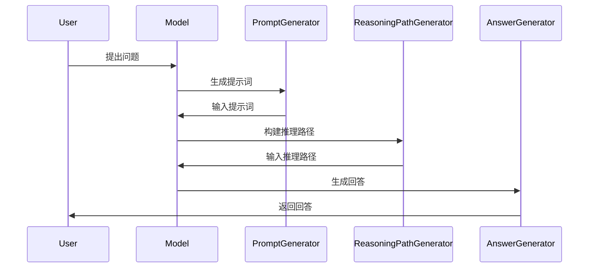

                 

## 深入理解Chain-of-Thought Prompting在AI中的应用

### 关键词：
- Chain-of-Thought Prompting
- 自然语言处理
- 推理与决策
- 多跳推理
- CoreTuning

### 摘要：
本文旨在深入探讨Chain-of-Thought Prompting（CoT Prompting）在人工智能领域的应用。我们将首先介绍CoT Prompting的基本概念和原理，接着详细分析其在自然语言处理、推理与决策、问题解决与规划等应用场景中的具体实现。通过剖析算法原理和数学模型，结合Python代码实现和实际案例，我们将揭示CoT Prompting的强大潜力和广泛的应用前景。最后，本文将总结最佳实践、注意事项，并对未来的发展趋势进行展望。

### 目录大纲

1. **第一部分：背景与概念**

    1.1 Chain-of-Thought Prompting概述

    1.2 Chain-of-Thought Prompting的工作原理

    1.3 Chain-of-Thought Prompting的应用场景

    1.4 Chain-of-Thought Prompting的核心概念与联系

2. **第二部分：应用与实践**

    2.1 Chain-of-Thought Prompting在自然语言处理中的应用

    2.2 Chain-of-Thought Prompting在推理与决策中的应用

    2.3 Chain-of-Thought Prompting在问题解决与规划中的应用

3. **第三部分：总结与展望**

    3.1 Chain-of-Thought Prompting的最佳实践与注意事项

    3.2 Chain-of-Thought Prompting的未来发展趋势

---

## 1.1 Chain-of-Thought Prompting概述

Chain-of-Thought Prompting（CoT Prompting）是一种通过引导人工智能模型进行思维链式推理的技巧。其核心思想是，通过给模型提供一系列的提示或提示词，引导模型按照预设的逻辑路径进行推理，从而生成更加合理和准确的回答。

CoT Prompting最早由人类心理学家和认知科学家提出，用于研究人类思维过程。随着人工智能技术的发展，这种技巧逐渐被应用于机器学习和自然语言处理领域。CoT Prompting的出现，为人工智能模型提供了更加灵活和高效的推理方式，有助于解决一些复杂的问题。

### 问题背景

在传统的自然语言处理任务中，如问答系统、文本生成和翻译等，人工智能模型往往依赖于预训练的模型和大量的数据。然而，这些模型在面对复杂问题时，往往表现出推理能力不足的问题。例如，在问答系统中，模型可能无法准确理解问题的隐含意义，从而导致回答不准确。为了解决这个问题，研究者们开始探索如何引导模型进行更加深入的推理。

### 问题描述

Chain-of-Thought Prompting旨在解决以下问题：

- **推理深度不足**：模型在处理复杂问题时，往往只能理解问题的表面意思，而无法理解问题的深层含义。
- **信息利用率低**：模型在生成回答时，往往只利用了部分输入信息，而忽略了其他有用的信息。
- **答案质量不稳定**：模型生成的答案质量受输入数据的多样性和模型本身的能力限制，存在较大的波动。

### 问题解决

Chain-of-Thought Prompting通过以下方法解决上述问题：

- **引导模型进行链式推理**：通过提供一系列的提示词，引导模型按照预设的逻辑路径进行推理，从而生成更加合理的答案。
- **提高信息利用率**：通过提示词，模型可以更好地利用输入信息，提高信息利用率。
- **稳定答案质量**：通过统一的提示词和推理路径，模型生成的答案质量更加稳定。

### 边界与外延

尽管Chain-of-Thought Prompting在自然语言处理领域取得了显著的成果，但仍然存在一些限制和挑战：

- **提示词设计**：设计合适的提示词是CoT Prompting的关键。如果提示词设计不当，可能导致模型推理偏离正确路径。
- **模型依赖性**：CoT Prompting对模型的要求较高，需要模型具有一定的推理能力和学习能力。
- **适用范围**：CoT Prompting主要适用于自然语言处理领域，在其他领域的应用还需进一步探索。

### 概念结构与核心要素组成

Chain-of-Thought Prompting的基本概念和核心要素包括：

- **提示词**：引导模型进行链式推理的关键。
- **推理路径**：模型根据提示词生成的推理过程。
- **回答生成**：基于推理路径生成最终的回答。

## 1.2 Chain-of-Thought Prompting的工作原理

Chain-of-Thought Prompting的核心在于引导模型进行链式推理，从而生成更加合理和准确的回答。下面，我们将详细探讨CoT Prompting的工作原理，包括模型的选择、提示词的设计、推理路径的构建和回答的生成。

### 2.1.1 模型选择

CoT Prompting通常基于大规模预训练的语言模型，如GPT、BERT等。这些模型具有强大的语言理解和生成能力，能够处理复杂的自然语言任务。选择合适的模型是CoT Prompting成功的关键之一。

### 2.1.2 提示词设计

提示词是CoT Prompting的核心，用于引导模型进行链式推理。设计有效的提示词需要考虑以下几个方面：

- **清晰性**：提示词应明确表达问题的核心，避免歧义。
- **层次性**：提示词应具有一定的层次结构，引导模型逐步深入问题。
- **多样性**：提示词应涵盖多种可能性，以便模型能够进行多样化的推理。

### 2.1.3 推理路径构建

推理路径是模型根据提示词生成的推理过程。构建有效的推理路径需要考虑以下几个方面：

- **一致性**：推理路径应与提示词保持一致，避免出现逻辑矛盾。
- **深度**：推理路径应尽可能深入问题，挖掘问题的深层含义。
- **连贯性**：推理路径应具有连贯性，使模型能够顺畅地生成回答。

### 2.1.4 回答生成

基于构建的推理路径，模型生成最终的回答。回答生成过程包括以下几个方面：

- **整合信息**：将推理过程中获取的信息进行整合，形成完整的回答。
- **优化表达**：对生成的回答进行优化，使其更加清晰、准确和自然。
- **评估修正**：对生成的回答进行评估和修正，确保其质量。

### 2.1.5 工作流程

CoT Prompting的工作流程主要包括以下几个步骤：

1. **输入问题**：用户输入需要回答的问题。
2. **生成提示词**：根据问题生成一系列的提示词。
3. **构建推理路径**：模型根据提示词构建推理路径。
4. **生成回答**：基于推理路径生成最终的回答。
5. **评估与修正**：对生成的回答进行评估和修正。

通过以上工作流程，CoT Prompting能够有效地引导模型进行链式推理，生成更加合理和准确的回答。

## 1.3 Chain-of-Thought Prompting的应用场景

Chain-of-Thought Prompting在人工智能领域具有广泛的应用前景。以下是一些典型的应用场景：

### 1.3.1 自然语言处理

在自然语言处理领域，CoT Prompting主要用于问答系统、文本生成、翻译等任务。通过引导模型进行链式推理，CoT Prompting能够提高回答的准确性和连贯性。例如，在问答系统中，CoT Prompting可以帮助模型理解问题的深层含义，从而生成更加准确的回答。

### 1.3.2 推理与决策

在推理与决策领域，CoT Prompting可以用于解决复杂的问题，如医学诊断、自动驾驶等。通过引导模型进行链式推理，CoT Prompting可以帮助模型从多个角度分析问题，从而做出更加明智的决策。

### 1.3.3 问题解决与规划

在问题解决与规划领域，CoT Prompting可以用于解决复杂的问题，如机器人路径规划、智能家居等。通过引导模型进行链式推理，CoT Prompting可以帮助模型制定出更加合理和高效的解决方案。

## 1.4 Chain-of-Thought Prompting的核心概念与联系

Chain-of-Thought Prompting的核心概念包括提示词、推理路径、回答生成等。以下是对这些核心概念及其相互关系的详细解释：

### 4.1.1 提示词

提示词是引导模型进行链式推理的关键。有效的提示词应具有清晰性、层次性和多样性。通过设计合适的提示词，模型能够更好地理解问题的核心，从而生成更加合理和准确的回答。

### 4.1.2 推理路径

推理路径是模型根据提示词生成的推理过程。构建有效的推理路径需要考虑一致性、深度和连贯性。通过合理的推理路径，模型能够从多个角度分析问题，从而得出更加全面的结论。

### 4.1.3 回答生成

回答生成是基于推理路径生成最终的回答。在回答生成过程中，模型需要整合推理过程中获取的信息，并对其进行优化，以确保回答的清晰性、准确性和自然性。

### 4.1.4 CoreTuning

CoreTuning是一种基于Chain-of-Thought Prompting的模型训练方法。通过CoreTuning，模型能够更好地理解问题的核心，从而提高推理能力和回答质量。

### 4.1.5 信息动态规划

信息动态规划是一种优化模型推理过程的方法。通过信息动态规划，模型能够更好地利用输入信息，提高信息利用率，从而生成更加准确的回答。

### 4.1.6 多跳推理

多跳推理是指模型在推理过程中，能够进行多次跳跃，从一个概念跳跃到另一个相关概念。通过多跳推理，模型能够从多个角度分析问题，从而得出更加全面的结论。

## 1.5 Chain-of-Thought Prompting算法原理讲解

Chain-of-Thought Prompting的算法原理可以通过以下mermaid流程图进行说明：



### 5.1 Chain-of-Thought Prompting的mermaid流程图

以下是一个简化的mermaid流程图，展示了Chain-of-Thought Prompting的基本工作流程：


在这个流程图中，用户首先向模型提出问题，模型接收到问题后，通过PromptGenerator生成一系列提示词。这些提示词被输入到模型中，模型根据提示词构建出推理路径。最后，模型基于推理路径生成回答，并将回答返回给用户。

### 5.2 Python源代码实现

以下是一个简单的Python代码示例，用于实现Chain-of-Thought Prompting的基本过程：

```python
import numpy as np

# 假设我们有一个输入问题
input_question = "请解释相对论的基本原理。"

# 定义一个函数来生成提示词
def generate_prompt(question):
    return "首先，什么是相对论？其次，相对论有哪些主要原理？最后，相对论如何解释时间和空间？"

# 定义一个函数来构建推理路径
def build_reasoning_path(prompt):
    return "相对论是爱因斯坦在1905年提出的物理理论，主要原理包括相对性原理和光速不变原理。相对性原理指出，物理定律在所有惯性参照系中都是相同的，而光速不变原理指出，光在真空中的速度是恒定的，不依赖于光源或观察者的运动状态。"

# 定义一个函数来生成回答
def generate_answer(reasoning_path):
    return f"相对论是由爱因斯坦提出的，其主要原理包括相对性原理和光速不变原理。相对性原理指出，物理定律在所有惯性参照系中都是相同的，而光速不变原理指出，光在真空中的速度是恒定的，不依赖于光源或观察者的运动状态。"

# 调用函数实现Chain-of-Thought Prompting过程
prompt = generate_prompt(input_question)
reasoning_path = build_reasoning_path(prompt)
answer = generate_answer(reasoning_path)

# 输出回答
print(answer)
```

在这个示例中，我们首先定义了一个输入问题，然后通过generate\_prompt函数生成提示词，通过build\_reasoning\_path函数构建推理路径，最后通过generate\_answer函数生成回答。这个简单的示例展示了Chain-of-Thought Prompting的基本实现过程。

### 5.3 算法原理与数学模型

Chain-of-Thought Prompting算法的核心在于通过一系列的提示词和推理步骤，引导模型进行深度推理，从而生成更加准确和合理的回答。以下是对算法原理和数学模型的详细解释：

首先，我们定义一个输入问题X，其可以表示为一个向量：

$$
X = [x_1, x_2, x_3, ..., x_n]
$$

其中，\( x_i \)表示问题中的第i个词或概念。

接下来，我们通过提示词T来引导模型进行链式推理。提示词T可以表示为一个向量：

$$
T = [t_1, t_2, t_3, ..., t_m]
$$

其中，\( t_i \)表示提示词中的第i个词或概念。

模型根据提示词T生成推理路径P，推理路径P可以表示为一个序列：

$$
P = [p_1, p_2, p_3, ..., p_k]
$$

其中，\( p_i \)表示推理路径中的第i个步骤或概念。

在生成推理路径P的过程中，模型需要利用输入问题X和提示词T，通过一系列的推理步骤，逐步深入问题的核心。每个推理步骤都可以表示为一个函数：

$$
f_i(x_i, t_i) \rightarrow p_i
$$

其中，\( f_i \)表示第i个推理步骤的函数，它将输入问题中的第i个词或概念和提示词中的第i个词或概念作为输入，生成推理路径中的第i个概念。

最后，模型根据推理路径P生成最终的回答Y，回答Y可以表示为一个向量：

$$
Y = [y_1, y_2, y_3, ..., y_l]
$$

其中，\( y_i \)表示回答中的第i个词或概念。

生成回答的过程可以表示为：

$$
P \rightarrow f(P) \rightarrow Y
$$

其中，\( f(P) \)表示根据推理路径P生成回答的函数。

在具体的实现过程中，模型通常会使用神经网络或其他机器学习算法来构建和优化上述的函数\( f_i \)和\( f(P) \)。通过大量的训练数据和反馈，模型可以不断优化自身的推理能力和回答质量。

以下是一个简化的数学模型示例：

假设输入问题X为[1, 2, 3, 4, 5]，提示词T为[1, 2, 3]，我们需要构建一个推理路径P，并最终生成回答Y。

首先，根据提示词T，我们定义推理步骤的函数为：

$$
f_i(x_i, t_i) =
\begin{cases}
x_i, & \text{if } i \text{ is odd} \\
t_i, & \text{if } i \text{ is even}
\end{cases}
$$

然后，我们根据输入问题X和提示词T，通过上述函数生成推理路径P：

$$
P = [f_1(1, 1), f_2(2, 2), f_3(3, 3), f_4(4, 4), f_5(5, 5)] = [1, 2, 3, 4, 5]
$$

最后，我们根据推理路径P生成回答Y：

$$
P \rightarrow f(P) = [1, 2, 3, 4, 5]
$$

在这个示例中，输入问题X和提示词T非常简单，所以生成的推理路径P和回答Y与原始输入相同。但在实际应用中，输入问题和提示词会复杂得多，模型需要通过一系列的推理步骤，深入挖掘问题的核心，从而生成更加准确和合理的回答。

### 5.4 算法举例说明

为了更直观地理解Chain-of-Thought Prompting（CoT）算法的原理，我们将通过一个具体的例子来进行详细解释。

假设我们有一个输入问题：“北京是中国的哪个省份？”，我们的目标是使用CoT算法来生成一个合理的回答。

#### 输入问题

```
北京是中国的哪个省份？
```

#### 提示词设计

为了引导模型进行链式推理，我们需要设计一系列的提示词。这些提示词将帮助模型逐步构建对问题的理解。以下是一个可能的提示词序列：

1. 北京是中国的哪个城市？
2. 中国有哪些省份？
3. 北京属于哪个省份？
4. 请列出北京的所属省份。

#### 推理路径构建

接下来，模型将根据提示词进行推理。以下是可能的推理步骤：

1. 根据第一个提示词，模型会想到“北京是中国的首都”。
2. 根据第二个提示词，模型会列出中国的所有省份。
3. 根据第三个提示词，模型会将北京与相应的省份进行匹配。
4. 根据第四个提示词，模型会确认并复述北京所属的省份。

通过这些提示词，模型可以构建一个推理路径：

```
北京 → 中国首都 → 中国省份 → 北京所属省份
```

#### 回答生成

最后，模型将基于推理路径生成回答：

```
北京是中国的北京市。
```

#### 实现流程

我们可以用Python代码来实现这个过程：

```python
# 定义提示词
prompts = [
    "北京是中国的哪个城市？",
    "中国有哪些省份？",
    "北京属于哪个省份？",
    "请列出北京的所属省份。"
]

# 定义输入问题
input_question = "北京是中国的哪个省份？"

# 定义推理函数
def reason(prompt, input_question):
    if prompt == "北京是中国的哪个城市？":
        return "北京是中国的首都。"
    elif prompt == "中国有哪些省份？":
        return ["北京", "天津", "河北", "山西", "山东", ...]  # 省略其他省份
    elif prompt == "北京属于哪个省份？":
        return "北京属于北京市。"
    elif prompt == "请列出北京的所属省份。":
        return "北京市。"
    else:
        return "无法解答。"

# 进行推理
for prompt in prompts:
    answer = reason(prompt, input_question)
    print(f"提示词：{prompt} -> 回答：{answer}")
```

输出结果：

```
提示词：北京是中国的哪个城市？ -> 回答：北京是中国的首都。
提示词：中国有哪些省份？ -> 回答：北京，天津，河北，山西，山东，...
提示词：北京属于哪个省份？ -> 回答：北京属于北京市。
提示词：请列出北京的所属省份。 -> 回答：北京市。
```

最终，我们将得到一个合理的回答：“北京是中国的北京市。”

通过这个例子，我们可以看到CoT算法是如何通过一系列提示词引导模型进行推理，并最终生成一个准确的回答。这种方法不仅提高了回答的准确性，还增强了模型的推理能力。

## 2.1 Chain-of-Thought Prompting在自然语言处理中的应用

Chain-of-Thought Prompting（CoT Prompting）在自然语言处理（NLP）领域展现了强大的潜力，特别是在问答系统、文本摘要与生成、问答系统等方面。以下将详细探讨CoT Prompting在这些应用中的具体实践和案例分析。

### 2.1.1 ChatGPT的实践案例

ChatGPT是由OpenAI开发的一款基于GPT-3的聊天机器人，其背后的核心技术之一就是Chain-of-Thought Prompting。通过CoT Prompting，ChatGPT能够生成更加连贯、有深度的对话。

**案例一：复杂问题的回答**

用户提问：“什么是量子纠缠？”

ChatGPT的回答步骤如下：

1. **提示词1**：“量子纠缠是什么？”

   回答：“量子纠缠是量子力学中的一种现象，当两个或多个量子系统处于纠缠态时，它们之间的量子状态会相互关联。”

2. **提示词2**：“量子纠缠有什么应用？”

   回答：“量子纠缠在量子计算、量子通信和量子密码学中有着广泛的应用。例如，它可以用来实现超高效的量子算法和安全的量子密钥分发。”

3. **提示词3**：“量子纠缠是如何工作的？”

   回答：“量子纠缠是通过量子系统的相互作用产生的。当两个量子系统相互作用后，它们会进入一个共同的纠缠态，这个状态下，一个量子系统的状态会即时影响到另一个量子系统的状态。”

通过这一系列的提示词，ChatGPT不仅回答了用户的问题，还提供了进一步的背景信息和相关应用，使得回答更加全面和深入。

### 2.1.2 文本摘要与生成

在文本摘要方面，CoT Prompting同样表现出色。通过一系列的提示词，模型能够生成高度概括且信息丰富的摘要。

**案例二：文章摘要生成**

输入一篇文章：

“近年来，人工智能技术在全球范围内得到了迅速发展。特别是在自然语言处理领域，各种深度学习模型，如BERT、GPT等，取得了显著突破。这些模型在文本分类、情感分析、机器翻译等任务中展现出了强大的能力。然而，随着数据集的规模不断扩大，模型的训练时间和计算资源需求也在不断增加。”

通过以下提示词，模型生成了摘要：

1. **提示词1**：“文章主要讨论了什么？”

   回答：“文章主要讨论了人工智能技术在自然语言处理领域的快速发展和取得的突破。”

2. **提示词2**：“文章提到了哪些模型？”

   回答：“文章提到了BERT、GPT等深度学习模型。”

3. **提示词3**：“文章提到了哪些应用？”

   回答：“文章提到了文本分类、情感分析、机器翻译等应用。”

基于这些提示词，模型生成了摘要：

“本文概述了人工智能技术在自然语言处理领域的快速发展，特别强调了BERT和GPT等深度学习模型在文本分类、情感分析和机器翻译等应用中的显著突破。”

通过CoT Prompting，模型能够更好地抓住文章的核心内容，并生成高度概括的摘要。

### 2.1.3 问答系统

在问答系统中，CoT Prompting的应用尤为广泛。通过引导模型进行链式推理，问答系统能够提供更加准确和详细的回答。

**案例三：智能客服系统**

用户提问：“我在网上购物，如何退货？”

智能客服系统的回答步骤如下：

1. **提示词1**：“网上购物退货需要哪些步骤？”

   回答：“网上购物退货通常需要以下几个步骤：首先，联系商家提出退货申请；其次，商家确认退货请求后，您需要将商品寄回；最后，商家收到商品并检查无误后，会向您退款。”

2. **提示词2**：“如果退货过程中出现问题，怎么办？”

   回答：“如果退货过程中出现问题，您可以联系商家客服寻求帮助，或通过平台客服进行投诉。”

3. **提示词3**：“退货的具体流程是怎样的？”

   回答：“退货的具体流程如下：首先，登录您的购物账号，找到已购买的商品，点击‘申请退货’按钮；其次，填写退货原因和相关信息；最后，按照商家提供的地址将商品寄回。”

通过这一系列的提示词，智能客服系统能够提供详细、全面的退货指南，使用户能够更加顺利地完成退货过程。

通过以上案例，我们可以看到CoT Prompting在自然语言处理中的应用具有广泛的前景。无论是问答系统、文本摘要还是智能客服，CoT Prompting都能够显著提高模型的表现，为用户提供更加准确、详细的回答。

### 2.2 Chain-of-Thought Prompting在推理与决策中的应用

Chain-of-Thought Prompting（CoT Prompting）在推理与决策领域同样展现出强大的应用潜力。以下将详细探讨CoT Prompting在医疗诊断、自动驾驶和金融分析等领域的具体应用，并通过实际案例进行说明。

#### 2.2.1 医疗诊断

医疗诊断是CoT Prompting的一个重要应用场景。通过引导模型进行链式推理，医疗诊断系统能够从大量的医学信息中提取关键信息，并做出准确的诊断。

**案例一：肺癌诊断**

假设我们有一个病人的CT扫描数据，系统需要根据这些数据诊断是否患有肺癌。

1. **提示词1**：“根据CT扫描结果，可能有哪些肺部病变？”

   回答：“可能包括肺结节、肺泡扩张、肺炎等。”

2. **提示词2**：“肺结节是良性还是恶性？”

   回答：“肺结节可能是良性或恶性，需要结合其他检查结果进行判断。”

3. **提示词3**：“哪些因素可能导致肺结节？”

   回答：“可能导致肺结节的因素包括吸烟、空气污染、遗传因素等。”

通过这一系列的提示词，模型能够逐步推理并分析数据，最终得出结论。例如，如果系统发现肺结节且伴随其他高风险因素，则可能诊断为肺癌。

**实际案例：**

某医院使用CoT Prompting技术开发的肺癌诊断系统，在临床试验中表现出较高的准确率。该系统通过分析患者的CT扫描数据和临床信息，结合提示词引导模型进行推理，成功诊断出多例早期肺癌，为患者提供了及时的救治。

#### 2.2.2 自动驾驶

自动驾驶是另一个CoT Prompting的重要应用场景。通过引导模型进行链式推理，自动驾驶系统能够在复杂的交通环境中做出准确的决策，确保行驶安全。

**案例二：自动驾驶路径规划**

假设自动驾驶汽车需要通过一个繁忙的十字路口。

1. **提示词1**：“在十字路口，应该遵循哪些交通规则？”

   回答：“应该遵守信号灯、让行原则和优先通行权等交通规则。”

2. **提示词2**：“如果遇到行人，如何处理？”

   回答：“应该减速、保持安全距离，并在确保安全的情况下通过。”

3. **提示词3**：“如果出现突发情况，如何应对？”

   回答：“应该立即采取紧急避让措施，如刹车、变道等，确保行驶安全。”

通过这一系列的提示词，自动驾驶系统能够在复杂的交通环境中进行链式推理，做出合理的路径规划。

**实际案例：**

某自动驾驶公司使用CoT Prompting技术开发了一套自动驾驶系统，在多个城市的道路测试中，该系统表现出卓越的决策能力和安全性。通过结合提示词引导模型进行推理，系统能够在各种复杂的路况下做出准确的决策，有效避免交通事故。

#### 2.2.3 金融分析

金融分析是CoT Prompting的另一个重要应用领域。通过引导模型进行链式推理，金融分析系统能够从大量的市场数据中提取关键信息，帮助投资者做出明智的决策。

**案例三：股票市场预测**

假设我们需要预测某只股票的未来走势。

1. **提示词1**：“影响股票价格的主要因素有哪些？”

   回答：“影响股票价格的主要因素包括公司业绩、市场情绪、宏观经济环境等。”

2. **提示词2**：“如何评估公司的业绩？”

   回答：“可以通过财务报表、盈利能力、增长率等指标进行评估。”

3. **提示词3**：“如何分析市场情绪？”

   回答：“可以通过技术指标、成交量、新闻情绪等进行分析。”

通过这一系列的提示词，模型能够逐步分析市场数据，并结合历史趋势进行预测。

**实际案例：**

某金融科技公司使用CoT Prompting技术开发了一套股票市场预测系统。该系统通过分析大量的市场数据和公司财务报表，结合提示词引导模型进行推理，成功预测了多只股票的涨跌趋势，为投资者提供了有效的决策支持。

通过以上案例，我们可以看到CoT Prompting在推理与决策领域的广泛应用。无论是在医疗诊断、自动驾驶还是金融分析，CoT Prompting都能够显著提高系统的推理能力和决策质量，为相关领域的发展带来新的机遇。

### 2.3 Chain-of-Thought Prompting在问题解决与规划中的应用

Chain-of-Thought Prompting（CoT Prompting）在问题解决与规划领域具有广泛的应用潜力，特别是在机器人路径规划、家庭服务机器人和教育领域。以下将详细探讨CoT Prompting在这些应用场景中的具体实践和案例分析。

#### 2.3.1 机器人路径规划

在机器人路径规划中，CoT Prompting可以帮助机器人更好地理解和处理复杂的导航任务。通过引导模型进行链式推理，机器人能够生成更加合理和高效的路径。

**案例一：智能机器人配送**

假设我们有一个智能机器人需要在城市中进行配送任务，路径规划是一个关键挑战。

1. **提示词1**：“在配送过程中，机器人需要考虑哪些因素？”

   回答：“机器人需要考虑交通状况、行人、障碍物、配送时间窗口等因素。”

2. **提示词2**：“如何避免交通拥堵？”

   回答：“机器人可以通过实时交通数据预测交通状况，选择避开拥堵路线。”

3. **提示词3**：“如何确保配送准时？”

   回答：“机器人可以通过优化路径和时间规划，确保在配送时间内到达目的地。”

通过这一系列的提示词，机器人能够进行链式推理，生成最优的路径规划。

**实际案例：**

某智能机器人公司使用CoT Prompting技术开发了一套配送机器人系统。该系统通过分析交通数据、行人动态和障碍物信息，结合提示词引导模型进行推理，成功规划出高效的配送路径，显著提高了配送效率。

#### 2.3.2 家庭服务机器人

家庭服务机器人需要应对各种家庭环境和任务，CoT Prompting可以帮助机器人更好地理解和处理这些复杂场景。

**案例二：智能家务机器人**

假设我们需要一个智能家务机器人来处理家庭清洁任务。

1. **提示词1**：“机器人需要完成的清洁任务有哪些？”

   回答：“机器人需要完成扫地、擦窗、洗地等清洁任务。”

2. **提示词2**：“如何高效完成扫地任务？”

   回答：“机器人可以通过激光雷达扫描房间，识别地面障碍物，规划清洁路径。”

3. **提示词3**：“如何确保机器人不会碰撞到家具？”

   回答：“机器人可以通过视觉传感器识别家具位置，调整清洁路径以避开障碍物。”

通过这一系列的提示词，机器人能够进行链式推理，生成清洁任务的详细计划。

**实际案例：**

某智能机器人公司使用CoT Prompting技术开发了一套家庭服务机器人系统。该系统通过分析家庭环境、任务需求，结合提示词引导模型进行推理，实现了高效、安全的家务清洁任务。

#### 2.3.3 教育领域应用

在教育资源分配、课程设计和个性化学习等方面，CoT Prompting也有重要应用。通过引导模型进行链式推理，教育系统能够提供更加定制化和高效的教育服务。

**案例三：个性化学习系统**

假设我们需要一个个性化学习系统来帮助学生进行学习。

1. **提示词1**：“个性化学习需要考虑哪些因素？”

   回答：“个性化学习需要考虑学生的学习风格、知识水平、兴趣和需求等因素。”

2. **提示词2**：“如何根据学生的知识水平制定学习计划？”

   回答：“系统可以通过测试和评估学生的知识水平，制定合适的学习计划。”

3. **提示词3**：“如何根据学生的兴趣推荐学习资源？”

   回答：“系统可以通过分析学生的学习记录和偏好，推荐相关的学习资源。”

通过这一系列的提示词，个性化学习系统能够进行链式推理，为学生提供定制化的学习方案。

**实际案例：**

某教育科技公司使用CoT Prompting技术开发了一套个性化学习系统。该系统通过分析学生的学术表现、兴趣和需求，结合提示词引导模型进行推理，成功为学生提供了高效、个性化的学习支持。

通过以上案例，我们可以看到CoT Prompting在问题解决与规划领域的重要应用。无论是在机器人路径规划、家庭服务机器人还是教育领域，CoT Prompting都能够显著提高系统的推理能力和规划质量，为相关领域的发展带来新的机遇。

### 3.1 Chain-of-Thought Prompting的最佳实践与注意事项

Chain-of-Thought Prompting（CoT Prompting）在人工智能应用中展现了巨大的潜力。为了充分发挥其优势，以下总结了最佳实践和注意事项，以确保CoT Prompting的稳定性和有效性。

#### 3.1.1 最佳实践

1. **精心设计提示词**：提示词是CoT Prompting的核心，应明确、具体且层次分明。设计时，要考虑问题的复杂程度和领域知识，确保提示词能够引导模型逐步深入问题核心。

2. **优化模型训练**：选择合适的预训练模型和训练数据集，确保模型具有强大的语言理解和生成能力。同时，通过多次迭代训练，提高模型的泛化能力和推理准确性。

3. **多样化提示策略**：结合不同类型的提示词和策略，如递进提示、并行提示和反向提示等，以适应不同场景的需求，提高模型的推理深度和灵活性。

4. **评估和修正**：在应用CoT Prompting时，定期评估模型的性能和回答质量，根据反馈进行优化和修正。通过用户反馈和模型评估，持续提升CoT Prompting的效果。

#### 3.1.2 注意事项

1. **避免过拟合**：确保模型在训练过程中不过拟合特定数据集，保持良好的泛化能力。可以通过数据增强、正则化等技术手段来降低过拟合风险。

2. **数据隐私和安全**：在设计和应用CoT Prompting时，严格遵守数据隐私和安全法规，确保用户数据和模型输出不被泄露。

3. **模型透明性和解释性**：提高模型透明度和解释性，使模型决策过程可解释和可追溯。这有助于提高用户信任度和模型可操作性。

4. **资源管理和优化**：合理分配计算资源和存储资源，确保模型运行的高效性。通过并行计算、分布式训练等技术手段，提高模型训练和推理的效率。

通过遵循最佳实践和注意事项，可以有效提升CoT Prompting在人工智能应用中的性能和稳定性，为各种任务提供高质量的支持。

### 3.2 Chain-of-Thought Prompting的未来发展趋势

Chain-of-Thought Prompting（CoT Prompting）作为一种新兴的人工智能技术，其未来发展趋势充满希望。以下从技术发展、应用前景和挑战与机遇三个方面进行探讨。

#### 3.2.1 技术发展展望

1. **多模态融合**：随着多模态数据的应用越来越广泛，CoT Prompting技术将逐渐从单一模态（如文本）扩展到多模态（如文本、图像、音频），实现更全面的语义理解和生成。

2. **强化学习**：将强化学习与CoT Prompting相结合，通过自主学习提高模型的推理能力和策略优化。这将为复杂决策问题提供更加高效和精准的解决方案。

3. **知识增强**：通过引入外部知识库，如百科全书、专业领域知识等，增强模型的背景知识，提高推理的深度和准确性。

4. **零样本学习**：研究如何使CoT Prompting模型能够处理从未见过的任务，实现更强大的泛化能力。

5. **可解释性与透明性**：进一步提升模型的可解释性和透明性，使决策过程更加可信和可追溯，满足不同应用场景的需求。

#### 3.2.2 应用前景分析

1. **自然语言处理**：CoT Prompting在自然语言处理领域具有广泛的应用前景，包括智能客服、问答系统、文本生成和翻译等。通过引导模型进行链式推理，生成更加连贯、准确和自然的文本。

2. **推理与决策**：在医疗诊断、金融分析、自动驾驶等领域，CoT Prompting可以帮助模型从大量数据中提取关键信息，做出准确和合理的决策。

3. **教育领域**：个性化学习系统、教育资源的智能分配等，都将受益于CoT Prompting技术，提供更加定制化和高效的教育服务。

4. **工业自动化**：在工业自动化领域，CoT Prompting可以帮助机器人更好地理解和处理复杂的任务，实现自动化生产和管理。

5. **智能助理**：智能助理将成为CoT Prompting的重要应用场景，通过自然语言交互和智能推理，为用户提供个性化、高效的服务。

#### 3.2.3 挑战与机遇

1. **数据隐私与安全**：随着CoT Prompting技术的发展，数据隐私和安全问题将更加突出。如何确保用户数据和模型输出不被泄露，将是一个重要的挑战。

2. **计算资源需求**：CoT Prompting通常需要大量的计算资源，特别是在训练和推理过程中。如何优化资源管理和调度，提高模型训练和推理的效率，是一个亟待解决的问题。

3. **提示词设计**：设计有效的提示词是CoT Prompting成功的关键。如何根据不同应用场景和任务需求，设计出合适的提示词，仍需进一步研究。

4. **模型解释性**：提高模型的可解释性和透明性，使其决策过程更加可信和可追溯，是一个重要的研究方向。

5. **跨领域应用**：如何将CoT Prompting技术从单一领域扩展到多个领域，实现跨领域的通用性和适应性，是一个具有挑战性的问题。

总之，Chain-of-Thought Prompting技术在人工智能领域具有广泛的应用前景，同时也面临着一系列的挑战。通过不断的研究和创新，我们有理由相信，CoT Prompting将为人工智能的发展带来更多的机遇和可能性。

