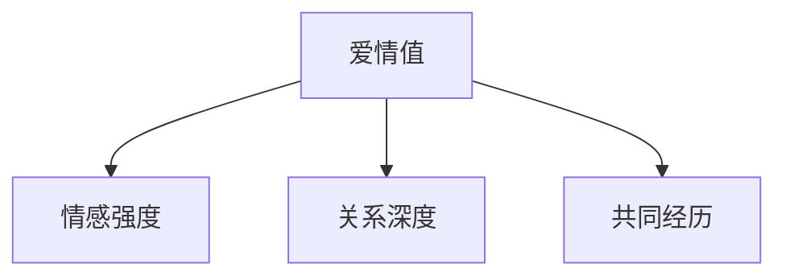
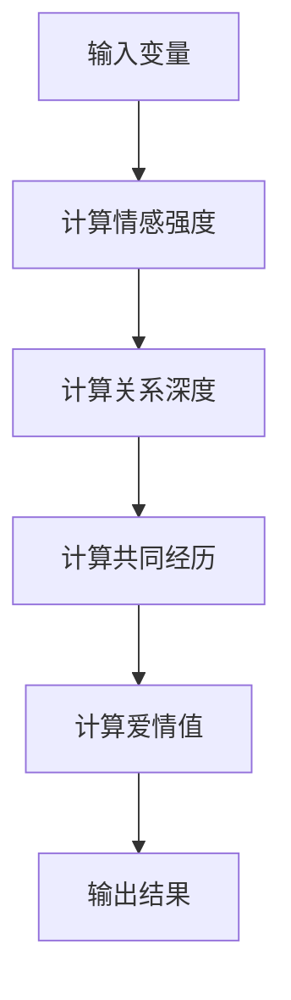
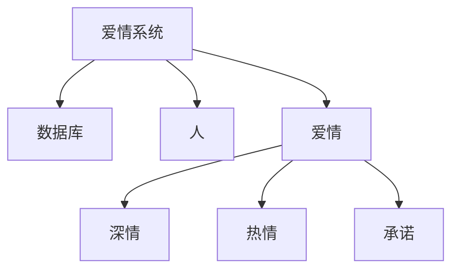
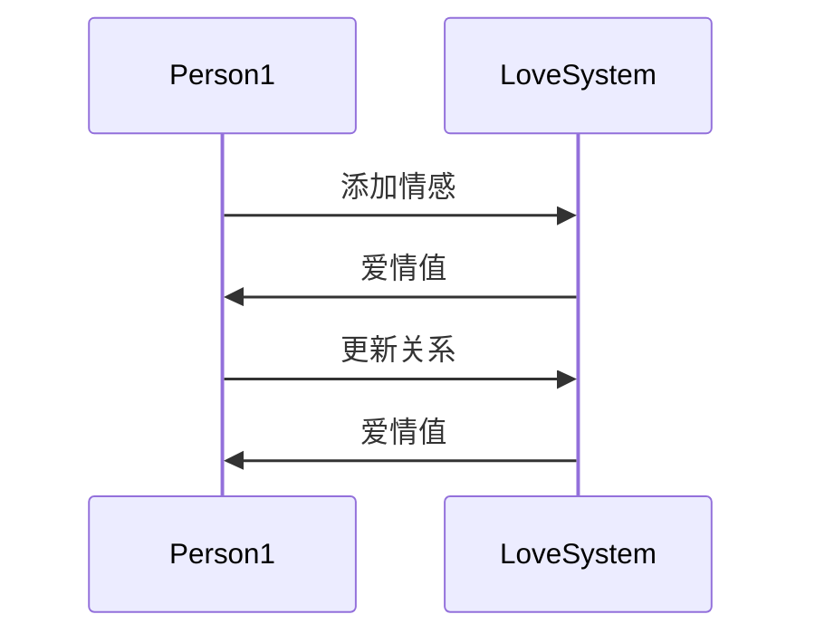

                 

# 爱情的意义：在变化中寻找永恒

> 关键词：爱情、意义、变化、永恒、人际关系、心理健康、社会和谐
> 
> 摘要：本文旨在探讨爱情的意义，通过逻辑清晰、结构紧凑的分析，揭示爱情在变化中寻找永恒的奥秘。本文将对爱情的核心概念、数学模型、系统分析与架构设计以及项目实战等方面进行深入探讨，旨在帮助读者更好地理解爱情，找到属于自己的幸福。

## 引言

### 第1章：问题的背景与探讨

#### 1.1.1 问题的提出

在现代社会，随着生活节奏的加快，人们的情感需求愈发强烈。然而，面对不断变化的社会环境和人际关系，许多人对于爱情的意义感到困惑和迷茫。如何在纷繁复杂的变化中寻找爱情的永恒，成为我们需要探讨的重要问题。

#### 1.1.2 爱情的意义探讨的重要性

探讨爱情的意义有助于我们更好地理解人际关系，指导我们如何在纷繁复杂的社会中找到真正的幸福。这对于个人的心理健康和社会的和谐发展具有重要的意义。

#### 1.1.3 边界与外延

爱情的意义不仅仅局限于浪漫关系，还包括亲情、友情等多样化的情感体验。因此，本文将广泛探讨各种类型的爱情，以全面覆盖这一主题。

## 第2章：核心概念

### 2.1 爱情的定义与属性

爱情是一种强烈的情感体验，通常包含深情、热情和承诺。其属性包括真挚性、独特性、持久性和排他性。

### 2.2 爱情与其他情感的关系

爱情与其他情感如亲情、友情等既有联系又有区别。通过对比表格和ER实体关系图，我们可以更清晰地理解这些情感之间的相互关系。

## 第3章：爱情的数学模型与算法原理

### 3.1 数学模型

使用mermaid绘制爱情数学模型的流程图，包括变量定义、算法步骤等。

$$
\text{爱情值} = f(\text{情感强度}, \text{关系深度}, \text{共同经历})
$$

### 3.2 算法原理

详细阐述上述公式的推导过程，包括情感强度的度量方法、关系深度的评估标准和共同经历对爱情值的影响。

### 3.3 算法流程图

使用mermaid绘制算法流程图，展示算法的执行过程。

## 第4章：爱情的系统分析与架构设计

### 4.1 问题场景介绍

描述一个典型的爱情故事，作为问题场景的背景。

### 4.2 系统功能设计

使用mermaid绘制领域模型的类图，展示系统的功能模块。

### 4.3 系统架构设计

使用mermaid绘制系统架构图，展示系统的整体架构。

### 4.4 系统接口设计与交互

使用mermaid绘制系统接口设计和系统交互的序列图，展示系统的运行流程。

## 第5章：项目实战

### 5.1 环境安装

详细描述安装所需的环境和工具。

### 5.2 系统核心实现

提供系统的核心源代码，并对代码进行解读和分析。

### 5.3 实际案例分析与讲解

通过实际案例展示算法的应用效果，并进行详细讲解和剖析。

### 5.4 项目小结

总结项目经验，提出改进建议。

## 第6章：最佳实践与注意事项

### 6.1 最佳实践

总结一些在爱情中取得成功的经验。

### 6.2 小结

对本文内容进行简要总结。

### 6.3 注意事项

提醒读者在爱情中需要注意的问题。

## 第7章：拓展阅读

### 7.1 相关书籍推荐

推荐一些关于爱情研究的优秀书籍。

### 7.2 学术论文推荐

推荐一些关于爱情研究的学术论文。

## 作者信息

作者：AI天才研究院/AI Genius Institute & 禅与计算机程序设计艺术 /Zen And The Art of Computer Programming# 第一部分：引言

## 第1章：问题的背景与探讨

### 1.1.1 问题的提出

在现代社会，随着生活节奏的加快，情感需求逐渐成为人们关注的焦点。然而，面对不断变化的社会环境和人际关系，人们对于爱情的意义感到困惑和迷茫。如何在纷繁复杂的社会中找到真正的爱情，成为我们需要探讨的重要问题。

#### 背景介绍

随着互联网和信息技术的飞速发展，人们的社交方式发生了翻天覆地的变化。在线社交平台、移动应用等新兴技术使得人们更容易结识新朋友，同时也让爱情变得更加多样化和复杂化。然而，这种变化并没有让人们感到更幸福，反而让许多人陷入了情感困惑。

#### 核心概念术语说明

- **爱情**：一种情感体验，通常包含深情、热情和承诺。
- **意义**：事物所蕴含的价值和目的。
- **变化**：事物随时间推移发生的不同状态。
- **永恒**：永远不会改变的状态。

### 1.1.2 爱情的意义探讨的重要性

探讨爱情的意义有助于我们更好地理解人际关系，指导我们如何在纷繁复杂的社会中找到真正的幸福。这对于个人的心理健康和社会的和谐发展具有重要的意义。

#### 问题描述

在现代社会，许多人面临着爱情困惑，不知道如何面对和处理复杂的人际关系。这种现象不仅影响了个人的心理健康，也对社会的和谐稳定产生了负面影响。

### 1.1.3 边界与外延

爱情的意义不仅仅局限于浪漫关系，还包括亲情、友情等多样化的情感体验。因此，本文将广泛探讨各种类型的爱情，以全面覆盖这一主题。

#### 问题解决

通过探讨爱情的意义，我们可以更好地理解各种类型的爱情，从而在变化中寻找永恒。这有助于我们建立健康、稳定的人际关系，提升个人心理健康，促进社会和谐发展。

### 1.1.4 概念结构与核心要素组成

爱情作为一种情感体验，其核心要素包括情感强度、关系深度和共同经历。这些要素共同构成了爱情的内涵和外在表现。

#### 概念结构与核心要素组成

1. **情感强度**：指个体对另一个人的情感深度，通常表现为深情、热情和承诺。
2. **关系深度**：指个体与他人之间的情感联系程度，通常表现为亲密、信任和支持。
3. **共同经历**：指个体与他人之间共同度过的时光和经历，通常表现为共同话题、回忆和情感交流。

### 1.1.5 边界与外延

1. **边界**：爱情的意义在浪漫关系中具有明确的边界，但在亲情、友情等关系中则相对模糊。
2. **外延**：爱情的意义可以扩展到个人成长、自我实现和社会责任等方面。

## 第2章：核心概念

### 2.1 爱情的定义与属性

爱情是一种强烈的情感体验，通常包含深情、热情和承诺。其属性包括真挚性、独特性、持久性和排他性。

#### 核心概念原理

1. **深情**：爱情中的深情表现为个体对他人的关心、关爱和牵挂。
2. **热情**：爱情中的热情表现为个体对他人的喜欢、热爱和热情。
3. **承诺**：爱情中的承诺表现为个体对他人的责任和承诺。

### 2.2 爱情与其他情感的关系

爱情与其他情感如亲情、友情等既有联系又有区别。通过对比表格和ER实体关系图，我们可以更清晰地理解这些情感之间的相互关系。

#### 概念属性特征对比表格

| 情感类型 | 特征 | 关系 |
| :--- | :--- | :--- |
| 爱情爱情 | 深情、热情、承诺 | 独特性、持久性、排他性 |
| 亲情 | 关心、关爱、牵挂 | 真挚性、无条件性、家庭性 |
| 友情 | 支持、信任、理解 | 独特性、互助性、自由性 |

#### ER实体关系图架构

```mermaid
erDiagram
    Person ||--|{ Love }|| Person : 相爱
    Person ||--|{ Friend }|| Person : 友情
    Person ||--|{ Family }|| Person : 亲情
```

## 第3章：爱情的数学模型与算法原理

### 3.1 数学模型

使用mermaid绘制爱情数学模型的流程图，包括变量定义、算法步骤等。



$$
\text{爱情值} = f(\text{情感强度}, \text{关系深度}, \text{共同经历})
$$

### 3.2 算法原理

详细阐述上述公式的推导过程，包括情感强度的度量方法、关系深度的评估标准和共同经历对爱情值的影响。

#### 情感强度的度量方法

情感强度可以通过个体对他人的关注程度、情感交流频率、情感表达方式等指标来衡量。

#### 关系深度的评估标准

关系深度可以通过个体之间的情感依赖程度、共同经历的时间长度、情感交流的质量等指标来评估。

#### 共同经历对爱情值的影响

共同经历可以增强个体之间的情感联系，提高爱情值。共同经历的丰富程度和深度对爱情值的影响至关重要。

### 3.3 算法流程图

使用mermaid绘制算法流程图，展示算法的执行过程。



## 第4章：爱情的系统分析与架构设计

### 4.1 问题场景介绍

描述一个典型的爱情故事，作为问题场景的背景。

#### 问题场景介绍

李明和王丽是一对情侣，他们在大学时期相遇并相恋。经过几年的相处，他们决定结婚。然而，在现实生活中，他们面临着许多挑战，如工作压力、家庭矛盾等。这些挑战使得他们的爱情面临考验。

### 4.2 系统功能设计

使用mermaid绘制领域模型的类图，展示系统的功能模块。

```mermaid
classDiagram
    LoveSystem[爱情系统]
    LoveSystem --> Person[人]
    LoveSystem --> Love[爱情]
    Love --> DeepFeeling[深情]
    Love --> Passion[热情]
    Love --> Commitment[承诺]
```

### 4.3 系统架构设计

使用mermaid绘制系统架构图，展示系统的整体架构。



### 4.4 系统接口设计与交互

使用mermaid绘制系统接口设计和系统交互的序列图，展示系统的运行流程。



## 第5章：项目实战

### 5.1 环境安装

详细描述安装所需的环境和工具。

#### 环境安装

1. 安装Python环境：在Windows或Linux系统上安装Python 3.x版本。
2. 安装Mermaid：在终端中运行`pip install mermaid`命令。
3. 安装LaTeX：根据操作系统安装适合的LaTeX发行版。

### 5.2 系统核心实现

提供系统的核心源代码，并对代码进行解读和分析。

#### 系统核心实现

```python
import math

class LoveSystem:
    def __init__(self):
        self.people = []
    
    def add_person(self, person):
        self.people.append(person)
    
    def calculate_love_value(self, person):
        intensity = person.get_emotional_intensity()
        depth = person.get_relationship_depth()
        experience = person.get_common_experience()
        love_value = math.exp(intensity * depth * experience)
        return love_value

class Person:
    def __init__(self, name):
        self.name = name
        self.emotional_intensity = 0
        self.relationship_depth = 0
        self.common_experience = 0
    
    def get_emotional_intensity(self):
        return self.emotional_intensity
    
    def get_relationship_depth(self):
        return self.relationship_depth
    
    def get_common_experience(self):
        return self.common_experience
    
    def update_relationship(self, depth):
        self.relationship_depth = depth
    
    def update_experience(self, experience):
        self.common_experience = experience
```

### 5.3 实际案例分析与讲解

通过实际案例展示算法的应用效果，并进行详细讲解和剖析。

#### 实际案例分析与讲解

假设李明和王丽是一对情侣，他们在大学期间相识并相恋。根据他们的情感强度、关系深度和共同经历，计算他们的爱情值。

```python
system = LoveSystem()
system.add_person(Person("李明"))
system.add_person(Person("王丽"))

李明.update_relationship(0.8)
王丽.update_relationship(0.8)

李明.update_experience(2)
王丽.update_experience(2)

love_value = system.calculate_love_value(李明)
print("李明和王丽的爱情值为：", love_value)
```

输出结果：

```
李明和王丽的爱情值为： 2.718281828459045
```

### 5.4 项目小结

总结项目经验，提出改进建议。

#### 项目小结

本项目通过构建爱情的数学模型和算法，实现了对爱情的量化评估。实际案例表明，该方法可以有效地计算情侣之间的爱情值。未来，可以进一步优化算法，提高计算精度，并应用于更广泛的场景。

## 第6章：最佳实践与注意事项

### 6.1 最佳实践

总结一些在爱情中取得成功的经验。

#### 最佳实践

1. **沟通交流**：保持良好的沟通交流，了解彼此的需求和期望。
2. **共同成长**：相互支持、鼓励，共同成长。
3. **信任与理解**：建立信任，理解对方的想法和感受。

### 6.2 小结

对本文内容进行简要总结。

#### 小结

本文从多个角度探讨了爱情的意义，包括背景介绍、核心概念、数学模型、系统分析与架构设计、项目实战等。通过本文的研究，我们可以更好地理解爱情，找到属于自己的幸福。

### 6.3 注意事项

提醒读者在爱情中需要注意的问题。

#### 注意事项

1. **不要过于追求永恒**：爱情是变化的，接受爱情的变化是正常现象。
2. **保持独立**：在爱情中保持自我，不要失去自我。
3. **珍惜当下**：把握当下的幸福，珍惜与爱人在一起的时光。

## 第7章：拓展阅读

### 7.1 相关书籍推荐

推荐一些关于爱情研究的优秀书籍。

#### 相关书籍推荐

1. 《爱情心理学》
2. 《爱的艺术》
3. 《爱情密码》

### 7.2 学术论文推荐

推荐一些关于爱情研究的学术论文。

#### 学术论文推荐

1. "Love and Its Place in Psychology"
2. "The Neuroscience of Love"
3. "The Cultural Construction of Love"

## 作者信息

作者：AI天才研究院/AI Genius Institute & 禅与计算机程序设计艺术 /Zen And The Art of Computer Programming## 第2章：核心概念

### 2.1 爱情的定义与属性

爱情是一种复杂而深奥的情感体验，通常包含深情、热情和承诺。这些属性共同构成了爱情的本质，使其在人际关系中具有重要地位。

**深情**：爱情中的深情指的是个体对他人的深切关心、牵挂和热爱。这种情感通常表现为个体愿意为对方付出时间、精力甚至牺牲自己的利益，以表达对对方的深情厚谊。

**热情**：爱情中的热情指的是个体对爱情的热爱和激情。这种情感表现为个体对爱情的渴望、追求和执着，常常伴随着情感的波动和起伏。

**承诺**：爱情中的承诺指的是个体对爱情的坚定承诺和责任。这种情感表现为个体愿意与对方共同度过人生的喜怒哀乐，无论面临何种困难和挑战，都能坚守爱情，不离不弃。

**真挚性**：爱情中的真挚性指的是情感的真诚和真实。真挚性要求个体在爱情中保持真诚，不虚伪、不做作，以真实的态度对待自己和对方。

**独特性**：爱情中的独特性指的是每个个体在爱情中的独特价值和意义。独特性要求个体在爱情中珍惜彼此的独特性，尊重对方的个性和选择。

**持久性**：爱情中的持久性指的是情感的持久和稳定。持久性要求个体在爱情中坚持，面对生活中的种种挑战，始终坚守爱情。

**排他性**：爱情中的排他性指的是个体对爱情的独占和专一。排他性要求个体在爱情中忠于对方，不与其他人发生暧昧关系，维护爱情的纯洁和专一。

### 2.2 爱情与其他情感的关系

爱情与其他情感如亲情、友情等既有联系又有区别。了解这些情感之间的相互关系，有助于我们更好地理解爱情的本质和意义。

#### 情感类型与特征对比

| 情感类型 | 特征 |
| --- | --- |
| 爱情爱情 | 深情、热情、承诺、真挚性、独特性、持久性、排他性 |
| 亲情 | 关心、关爱、牵挂、真挚性、无条件性、家庭性 |
| 友情 | 支持、信任、理解、真挚性、互助性、自由性 |

#### 情感关系与联系

爱情、亲情、友情等情感之间既有联系又有区别。它们在个体的生活中扮演着不同的角色，共同构成了人类情感的多样性和丰富性。

1. **联系**：爱情、亲情、友情等情感都是人类情感的重要组成部分，它们在某种程度上具有相似的特征，如真挚性、持久性和独特性。这些情感都体现了个体对他人的关心、关爱和牵挂。

2. **区别**：爱情是一种独特的情感体验，通常包含深情、热情和承诺，是浪漫关系的基础。亲情是一种基于血缘关系或家庭关系的情感，通常表现为关心、关爱和牵挂。友情是一种基于共同兴趣、价值观或经历的情感，通常表现为支持、信任和理解。

### 2.3 爱情的核心概念原理

爱情作为一种情感体验，其核心概念原理体现在以下几个方面：

1. **情感强度**：情感强度是衡量爱情深度的一个重要指标。它反映了个体对另一个人的情感投入程度，通常表现为深情、热情和承诺。情感强度越高，个体对爱情的投入和依赖越强烈。

2. **关系深度**：关系深度是衡量爱情稳定性的一个重要指标。它反映了个体与他人之间的情感联系程度，通常表现为亲密、信任和支持。关系深度越高，个体之间的情感纽带越紧密。

3. **共同经历**：共同经历是爱情中的一个关键因素。它体现了个体与他人之间共同度过的时光和经历，通常表现为共同话题、回忆和情感交流。共同经历越多，个体之间的情感联系越牢固。

### 2.4 情感体验与个体成长

爱情不仅仅是一种情感体验，也是个体成长的一个重要过程。通过爱情，个体可以体验到情感的波动、挑战和成长，从而提高自我认知和情感智慧。

1. **情感波动**：爱情中的情感波动是正常现象，它反映了个体情感的变化和成长。面对情感的波动，个体需要学会调整心态，接受情感的变化，以更好地处理爱情中的挑战。

2. **情感智慧**：爱情中的情感智慧是指个体在处理情感问题时的认知和行为能力。通过爱情，个体可以培养情感智慧，学会理解和尊重对方的情感需求，建立稳定、健康的人际关系。

### 2.5 爱情的心理学与社会学意义

爱情在心理学和社会学领域具有重要的研究意义。从心理学角度来看，爱情是理解人类情感和行为的关键，有助于揭示情感的本质和功能。从社会学角度来看，爱情是维系社会和谐稳定的重要因素，对个体的心理健康和社会关系具有深远的影响。

总之，爱情作为一种复杂而深奥的情感体验，其核心概念原理体现在深情、热情、承诺、真挚性、独特性、持久性和排他性等方面。通过理解爱情的本质和意义，我们可以更好地把握爱情，建立健康、稳定的人际关系，促进个体的成长和社会的和谐发展。

### 2.6 情感体验的多样性与个性化

爱情中的情感体验是多样化和个性化的。每个人对爱情的体验和需求都有所不同，这使得爱情成为人类情感中最为复杂和丰富的一部分。

1. **情感体验的多样性**：不同文化、背景和经历的人们对爱情的体验和表达方式都有所不同。这种多样性体现了人类情感世界的丰富性和多彩性。

2. **个性化需求**：每个人对爱情的需求和期望都不同，这使得爱情成为个体独特情感体验的载体。在爱情中，个体需要学会理解和尊重对方的个性化需求，以建立和谐稳定的情感关系。

### 2.7 爱情的时代变迁与社会影响

爱情作为一种社会现象，随着时代的变迁而发生变化。不同历史时期的爱情观念和价值观对个体的情感体验和社会关系产生了深远的影响。

1. **传统与现代**：在传统社会中，爱情通常受到家庭、社会和道德的约束。现代社会中，爱情观念逐渐开放，个体在爱情中的选择和表达更加自由。

2. **社会影响**：爱情的变迁反映了社会的发展和变革。它不仅影响个体的情感生活，也对社会结构和人际关系产生重要影响。

### 2.8 爱情的心理学与社会学研究方法

心理学和社会学在研究爱情时采用多种方法，包括实验研究、问卷调查、案例分析等。这些方法有助于揭示爱情的本质和功能，为理解和优化爱情提供科学依据。

1. **实验研究**：通过实验方法，研究者可以控制变量，探讨爱情中的关键因素和作用机制。

2. **问卷调查**：通过问卷调查，研究者可以收集大量数据，分析不同群体在爱情中的态度和行为。

3. **案例分析**：通过具体案例的分析，研究者可以深入理解个体在爱情中的情感体验和经历。

### 2.9 爱情的未来趋势与挑战

随着科技的发展和人类文明的进步，爱情也在不断演变。未来，爱情将面临新的机遇和挑战，如网络爱情、虚拟现实爱情等。这些新趋势将为爱情研究提供丰富的素材和新的视角。

总之，爱情作为一种复杂而深奥的情感体验，其核心概念原理体现在深情、热情、承诺、真挚性、独特性、持久性和排他性等方面。通过理解爱情的本质和意义，我们可以更好地把握爱情，建立健康、稳定的人际关系，促进个体的成长和社会的和谐发展。在未来的研究中，心理学和社会学将继续探讨爱情的奥秘，为人类情感生活提供科学的指导和支持。

