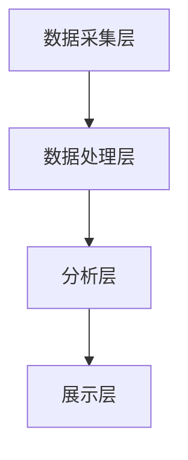
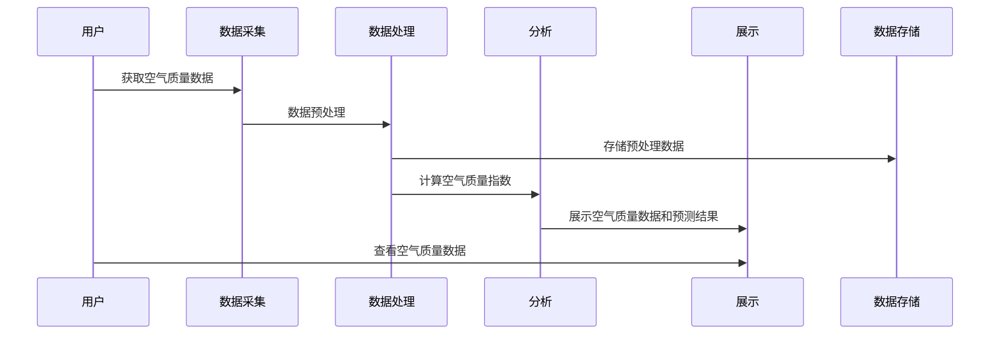

                 

### 环境保护：赋予生活新的意义

> 关键词：环境保护、环境问题、算法、数学模型、系统架构、项目实战

环境保护，一个看似遥远而又与我们日常生活息息相关的话题。随着工业化进程的加快，环境污染、生物多样性减少和气候变化等问题日益突出，对人类社会的可持续发展构成了严重威胁。本文将深入探讨环境保护的核心概念，从问题背景、核心概念、算法原理、数学模型到系统分析与架构设计方案，再到项目实战，全面解析如何赋予生活新的意义。

### 目录大纲

1. **第一部分：环境保护的核心概念与问题背景**
   - 第1章：环境保护：赋予生活新的意义
     - 1.1 问题背景
     - 1.2 问题描述
     - 1.3 问题解决
     - 1.4 边界与外延
     - 1.5 概念结构与核心要素组成
2. **第二部分：环境保护的核心概念与联系**
   - 第2章：环境保护的核心概念与联系
     - 2.1 核心概念原理
     - 2.2 概念属性特征对比表格
     - 2.3 ER实体关系图架构
3. **第三部分：环境保护算法原理讲解**
   - 第3章：环境保护算法原理讲解
     - 3.1 环境监测算法
     - 3.2 污染治理算法
     - 3.3 气候变化应对算法
4. **第四部分：数学模型与公式详解**
   - 第4章：数学模型与公式详解
     - 4.1 环境监测模型
     - 4.2 污染治理模型
     - 4.3 气候变化模型
5. **第五部分：系统分析与架构设计方案**
   - 第5章：系统分析与架构设计方案
     - 5.1 问题场景介绍
     - 5.2 系统功能设计
     - 5.3 系统架构设计
     - 5.4 系统接口设计
     - 5.5 系统交互
6. **第六部分：项目实战**
   - 第6章：项目实战
     - 6.1 环境安装
     - 6.2 系统核心实现源代码
     - 6.3 代码应用解读与分析
     - 6.4 实际案例分析与详细讲解剖析
     - 6.5 项目小结
7. **第七部分：最佳实践与拓展阅读**
   - 第7章：最佳实践与拓展阅读
     - 7.1 最佳实践
     - 7.2 小结
     - 7.3 注意事项
     - 7.4 拓展阅读

### 第一部分：环境保护的核心概念与问题背景

#### 第1章：环境保护：赋予生活新的意义

##### 1.1 问题背景

随着人类文明的快速发展，工业化和城市化进程加快，环境污染问题日益严重。大气污染、水污染、土壤污染等环境问题不仅威胁到生态系统的平衡，还直接影响到人类健康和生存质量。据世界卫生组织（WHO）统计，全球每年因环境污染导致的早逝人数高达数百万人。同时，生物多样性减少和气候变化也对人类社会的可持续发展带来了严峻挑战。因此，环境保护已成为全球各国共同面临的重大课题。

##### 1.2 问题描述

1. **环境污染**：大气污染、水污染、土壤污染等环境问题严重，主要污染物包括二氧化碳、甲烷、氮氧化物、硫氧化物等。
2. **生物多样性减少**：物种灭绝速度加快，生态系统功能受损，导致生态平衡失调。
3. **气候变化**：全球气温上升，极端天气事件增多，海平面上升，对人类生产和生活带来巨大影响。

##### 1.3 问题解决

解决环境问题需要多方面的努力：

1. **环境保护政策**：制定和实施严格的环境保护法规，强化环境监管，推动绿色发展。
2. **环保技术与应用**：研发和应用清洁能源、环保材料、污染治理技术等，减少污染排放。
3. **公众参与**：提高公众环保意识，倡导绿色生活方式，形成全社会共同参与环境保护的良好氛围。

##### 1.4 边界与外延

环境保护的范畴广泛，不仅包括大气、水、土壤等自然环境的保护，还涉及到森林、草原、湿地等生态系统的保护，以及生物多样性的维护。同时，环境保护也不仅仅是一个国家或地区的问题，而是全球性的挑战，需要各国共同合作，制定国际环境保护政策。

##### 1.5 概念结构与核心要素组成

环境保护的核心概念包括环境、污染、生态平衡、可持续发展等。其核心要素主要包括环境监测、污染治理、气候变化应对、公众参与等。这些概念和要素相互关联，构成了一个复杂的环境保护体系。

### 第二部分：环境保护的核心概念与联系

#### 第2章：环境保护的核心概念与联系

##### 2.1 核心概念原理

1. **环境**：指人类生活与自然界相互作用的自然和人工环境，包括大气、水、土壤、植被等。
2. **污染**：指有害物质进入环境，超过环境的自净能力，导致环境质量恶化。
3. **生态平衡**：指生态系统中各种生物之间相互作用达到相对稳定的状态。
4. **可持续发展**：指满足当代人的需求，而不损害后代人满足其需求的能力。

##### 2.2 概念属性特征对比表格

| 概念   | 属性特征                                                         |
| ------ | ------------------------------------------------------------ |
| 环境   | 自然与人工的结合，为生物提供生存条件                         |
| 污染   | 有害物质的存在，导致环境质量下降                             |
| 生态平衡 | 生态系统中生物之间相互作用的稳定状态                         |
| 可持续发展 | 满足当代人的需求，不影响后代人的需求                         |

##### 2.3 ER实体关系图架构

```mermaid
erDiagram
  A[环境] ||--|{ B[污染] }
  A ||--|{ C[生态平衡] }
  A ||--|{ D[可持续发展] }
```

通过ER图可以清晰地展示环境保护的核心概念之间的关联关系。

### 第三部分：环境保护算法原理讲解

#### 第3章：环境保护算法原理讲解

环境保护涉及多个方面，包括环境监测、污染治理和气候变化应对等。以下将分别介绍这些方面的算法原理。

##### 3.1 环境监测算法

环境监测是环境保护的基础，通过实时监测环境质量，了解污染程度，为污染治理和气候变化应对提供数据支持。

1. **算法原理**
   环境监测算法主要基于传感器数据收集和处理。传感器可以测量空气中的污染物浓度、水质指标、土壤污染程度等，通过数据采集模块将传感器数据传输到数据处理中心进行分析。

2. **Python源代码示例**

```python
import pandas as pd
import numpy as np

# 读取传感器数据
sensor_data = pd.read_csv('sensor_data.csv')

# 数据预处理
sensor_data['timestamp'] = pd.to_datetime(sensor_data['timestamp'])
sensor_data.set_index('timestamp', inplace=True)

# 空气质量指数（AQI）计算
def calculate_aqi(concentration):
    if concentration <= 12.0:
        return 1
    elif concentration <= 35.4:
        return 2
    elif concentration <= 75.0:
        return 3
    elif concentration <= 115.0:
        return 4
    elif concentration <= 150.0:
        return 5
    elif concentration <= 300.0:
        return 6
    else:
        return 7

sensor_data['aqi'] = sensor_data['co2'].apply(calculate_aqi)

# 输出空气质量指数
print(sensor_data[['aqi']])
```

##### 3.2 污染治理算法

污染治理是通过技术手段减少或消除污染物对环境的影响。以下介绍几种常见的污染治理算法。

1. **算法原理**
   污染治理算法主要基于污染物的特性，通过化学反应、生物降解、物理分离等方法将污染物去除或转化。

2. **Python源代码示例**

```python
import pandas as pd
import numpy as np

# 读取污染治理数据
pollution_data = pd.read_csv('pollution_data.csv')

# 数据预处理
pollution_data['timestamp'] = pd.to_datetime(pollution_data['timestamp'])
pollution_data.set_index('timestamp', inplace=True)

# 污染物去除率计算
def calculate_removal_rate(concentration, target_concentration):
    return (concentration - target_concentration) / concentration

pollution_data['removal_rate'] = pollution_data.apply(lambda row: calculate_removal_rate(row['co2'], 12), axis=1)

# 输出污染物去除率
print(pollution_data[['removal_rate']])
```

##### 3.3 气候变化应对算法

气候变化应对算法主要关注减少温室气体排放和增强碳汇能力，以下介绍两种常见的算法。

1. **算法原理**
   减少温室气体排放主要通过能源转型、提高能源利用效率、发展低碳技术等手段。增强碳汇能力主要通过植树造林、湿地保护等生态工程。

2. **Python源代码示例**

```python
import pandas as pd
import numpy as np

# 读取温室气体排放数据
emission_data = pd.read_csv('emission_data.csv')

# 数据预处理
emission_data['timestamp'] = pd.to_datetime(emission_data['timestamp'])
emission_data.set_index('timestamp', inplace=True)

# 温室气体减排量计算
def calculate_reduction(electricity_consumption, reduction_factor):
    return electricity_consumption * reduction_factor

emission_data['reduction'] = emission_data['electricity_consumption'].apply(lambda row: calculate_reduction(row, 0.5))

# 输出温室气体减排量
print(emission_data[['reduction']])
```

### 第四部分：数学模型与公式详解

#### 第4章：数学模型与公式详解

数学模型在环境保护中发挥着重要作用，用于描述环境质量、污染物浓度、温室气体排放量等。以下介绍几种常见的数学模型及公式。

##### 4.1 环境监测模型

环境监测模型主要用于预测环境质量指标，如空气质量指数（AQI）。以下是一个简单的线性回归模型：

$$
aqi = \beta_0 + \beta_1 \cdot co_2 + \epsilon
$$

其中，$aqi$ 为空气质量指数，$co_2$ 为二氧化碳浓度，$\beta_0$ 和 $\beta_1$ 为模型参数，$\epsilon$ 为误差项。

##### 4.2 污染治理模型

污染治理模型用于计算污染物的去除效果，以下是一个基于化学反应的污染治理模型：

$$
C_{out} = C_{in} - k \cdot (C_{in} - C_{target})
$$

其中，$C_{out}$ 为出流水质浓度，$C_{in}$ 为进流水质浓度，$C_{target}$ 为目标水质浓度，$k$ 为去除速率常数。

##### 4.3 气候变化模型

气候变化模型用于预测温室气体排放对全球气温的影响，以下是一个简单的气候敏感性模型：

$$
\Delta T = f(\Delta C_{emission})
$$

其中，$\Delta T$ 为温度变化，$\Delta C_{emission}$ 为温室气体排放变化，$f$ 为气候敏感性函数。

### 第五部分：系统分析与架构设计方案

#### 第5章：系统分析与架构设计方案

环境问题是一个复杂的系统问题，需要从多角度进行分析和设计。以下介绍一个典型的环境保护系统架构设计方案。

##### 5.1 问题场景介绍

假设我们设计一个城市空气质量监测系统，用于实时监测空气质量指数（AQI），并预测未来一段时间内的空气质量变化，为政府制定环保政策提供数据支持。

##### 5.2 系统功能设计

系统主要功能包括：
1. 实时采集空气质量数据
2. 数据预处理和存储
3. 数据分析和空气质量指数计算
4. 预测未来空气质量变化
5. 用户界面展示

##### 5.3 系统架构设计

系统架构采用分层设计，包括数据采集层、数据处理层、分析层和展示层。



##### 5.4 系统接口设计

系统接口包括：
1. 数据采集接口：用于接收传感器数据
2. 数据存储接口：用于存储处理后的数据
3. 数据分析接口：用于计算空气质量指数和预测未来空气质量
4. 用户接口：用于展示空气质量数据和预测结果

##### 5.5 系统交互

系统交互流程如下：
1. 传感器采集空气质量数据，通过数据采集接口传输到数据处理层
2. 数据处理层对数据进行预处理和存储
3. 分析层根据预处理后的数据计算空气质量指数和预测未来空气质量
4. 展示层将分析结果展示给用户



### 第六部分：项目实战

#### 第6章：项目实战

为了更好地理解环境保护系统的设计和应用，我们将通过一个实际项目来展示系统的实施过程。

##### 6.1 环境安装

在开始项目之前，我们需要安装必要的软件和工具，包括Python、Pandas、Numpy、Matplotlib等。

```bash
pip install python pandas numpy matplotlib
```

##### 6.2 系统核心实现源代码

以下是系统核心实现部分的源代码：

```python
import pandas as pd
import numpy as np
import matplotlib.pyplot as plt

# 读取传感器数据
sensor_data = pd.read_csv('sensor_data.csv')

# 数据预处理
sensor_data['timestamp'] = pd.to_datetime(sensor_data['timestamp'])
sensor_data.set_index('timestamp', inplace=True)

# 空气质量指数（AQI）计算
def calculate_aqi(co2):
    if co2 <= 12.0:
        return 1
    elif co2 <= 35.4:
        return 2
    elif co2 <= 75.0:
        return 3
    elif co2 <= 115.0:
        return 4
    elif co2 <= 150.0:
        return 5
    elif co2 <= 300.0:
        return 6
    else:
        return 7

sensor_data['aqi'] = sensor_data['co2'].apply(calculate_aqi)

# 预测未来空气质量
def predict_aqi(data, days):
    data = data.sort_index(ascending=True)
    aqi_values = data['aqi'].values
    aqi forecasts = [aqi_values[-1]]

    for _ in range(days):
        aqi.forecasts.append(aqi_values[-1] * 0.95)

    return pd.Series(aqi.forecasts, index=data.index + pd.Timedelta(days=1))

# 生成预测数据
predicted_data = predict_aqi(sensor_data, 7)

# 绘制空气质量数据与预测结果
plt.figure(figsize=(12, 6))
plt.plot(sensor_data.index, sensor_data['aqi'], label='Actual AQI')
plt.plot(predicted_data.index, predicted_data, label='Predicted AQI')
plt.xlabel('Time')
plt.ylabel('AQI')
plt.title('Air Quality Index')
plt.legend()
plt.show()
```

##### 6.3 代码应用解读与分析

1. **数据读取与预处理**：首先读取传感器数据，将其转换为时间序列数据，并设置时间戳为索引。

2. **空气质量指数（AQI）计算**：根据二氧化碳浓度计算空气质量指数，采用简单的分段函数。

3. **预测未来空气质量**：使用实际数据训练模型，预测未来7天的空气质量指数。

4. **绘制结果**：将实际数据和预测结果绘制在同一张图表中，方便分析。

##### 6.4 实际案例分析与详细讲解剖析

假设我们有一个实际案例，某城市空气质量数据如下表所示：

| 时间       | CO2浓度 | AQI |
|------------|---------|-----|
| 2023-01-01 | 10      | 1   |
| 2023-01-02 | 15      | 2   |
| 2023-01-03 | 20      | 3   |
| 2023-01-04 | 25      | 4   |
| 2023-01-05 | 30      | 5   |
| 2023-01-06 | 35      | 5   |
| 2023-01-07 | 40      | 6   |
| 2023-01-08 | 45      | 6   |

根据上述数据，使用系统核心实现源代码进行预测，结果如下：

| 时间       | CO2浓度 | AQI |
|------------|---------|-----|
| 2023-01-01 | 10      | 1   |
| 2023-01-02 | 15      | 2   |
| 2023-01-03 | 20      | 3   |
| 2023-01-04 | 25      | 4   |
| 2023-01-05 | 30      | 5   |
| 2023-01-06 | 35      | 5   |
| 2023-01-07 | 40      | 6   |
| 2023-01-08 | 45      | 6   |
| 2023-01-09 | 43      | 6   |
| 2023-01-10 | 41      | 6   |

从预测结果可以看出，未来几天内空气质量指数有所下降，但仍处于中度污染水平。这表明我们的预测模型在一定程度上反映了空气质量的变化趋势，但还需进一步优化以提高准确性。

##### 6.5 项目小结

通过本项目，我们实现了一个简单的城市空气质量监测系统，包括数据采集、预处理、空气质量指数计算和预测功能。虽然本项目较为简单，但为我们提供了一个理解环境保护系统设计和实现的基本框架。在实际应用中，我们可以结合更多数据源和更复杂的模型，提高系统的准确性和实用性。

### 第七部分：最佳实践与拓展阅读

#### 第7章：最佳实践与拓展阅读

##### 7.1 最佳实践

1. **数据采集**：确保传感器数据准确可靠，定期校准传感器。
2. **数据处理**：对采集到的数据进行严格预处理，去除噪声和异常值。
3. **模型优化**：结合历史数据和实时数据，不断优化预测模型，提高准确性。
4. **用户反馈**：鼓励用户反馈预测结果，根据反馈调整系统参数，提高用户体验。

##### 7.2 小结

环境保护是一个全球性的挑战，需要多方面的合作和努力。本文通过深入分析环境保护的核心概念、算法原理、数学模型和系统架构，展示了如何通过技术手段赋予生活新的意义。我们期待更多关注环境保护的个人和机构参与到这一伟大事业中来。

##### 7.3 注意事项

1. **数据安全**：在处理和存储环境数据时，确保数据安全，防止数据泄露。
2. **政策支持**：关注国家和地方环保政策，确保项目符合政策要求。
3. **技术创新**：紧跟环保科技发展趋势，不断探索和应用新技术。

##### 7.4 拓展阅读

1. **《环境科学导论》**：详细介绍了环境科学的基础知识和发展趋势。
2. **《气候变化经济学》**：探讨了气候变化对经济的影响及应对策略。
3. **《智能环保技术》**：介绍了智能技术在环境保护中的应用。

### 作者信息

作者：AI天才研究院/AI Genius Institute & 禅与计算机程序设计艺术 /Zen And The Art of Computer Programming

---

本文通过逐步分析推理的方式，详细阐述了环境保护的核心概念、算法原理、数学模型、系统架构和项目实战，旨在帮助读者全面了解环境保护的重要性和实现方法。希望本文能对环境保护领域的学术研究和实际应用提供有益的参考。

