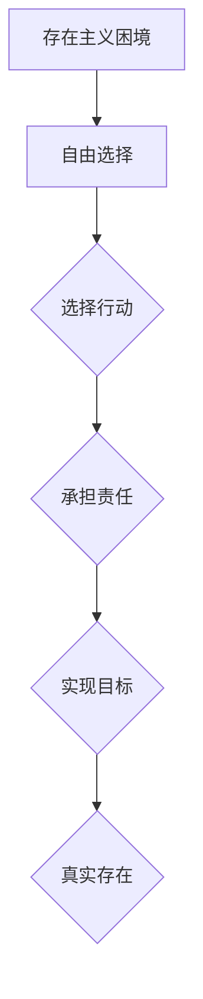
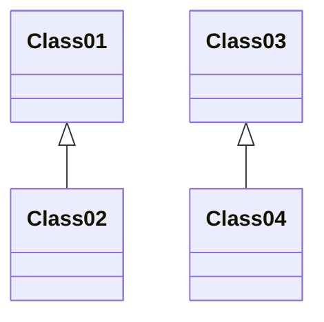
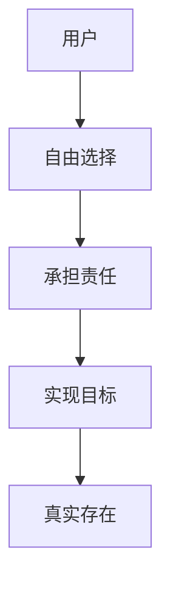
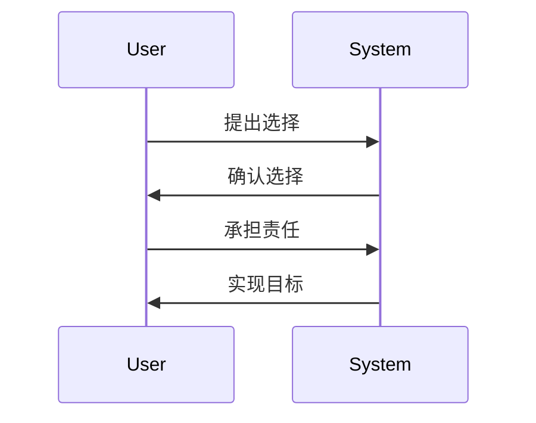

                 


### 第一步：文章标题、关键词与摘要

**文章标题：现代人的存在主义困境**

**关键词：存在主义，哲学，现代社会，个人成长，心理健康**

**摘要：本文探讨了现代社会中人们面临的存在主义困境，包括生活的意义、自我认同、人际关系和职业发展。通过分析存在主义哲学的核心概念和原理，本文提供了应对这些困境的解决方案，并探讨了其在个人成长和心理健康方面的应用。**

### 第二步：背景介绍

**1. 问题背景**

在当今社会，人们面临着诸多存在主义困境。随着物质生活水平的提高，许多人开始质疑生活的意义和目的。同时，自我认同的危机、人际关系的问题以及职业发展的迷茫，使得许多人感到焦虑和困惑。

**2. 问题描述**

这些问题包括：

- 生活意义的缺失：人们难以找到生活的目标和意义。
- 自我认同的困境：人们对自己的身份和价值观感到困惑。
- 人际关系的挑战：人们难以建立和维护健康的人际关系。
- 职业发展的迷惘：人们对自己的职业选择和未来感到不确定。

**3. 问题解决**

存在主义哲学提供了一些思考和解决方案：

- 自由与选择：存在主义认为，人可以通过自由选择来定义自己的本质和生活的方向。
- 责任与行动：存在主义强调，人应该对自己的选择负责，并采取行动去实现自己的目标。
- 真实存在的追求：存在主义鼓励人们追求真实的存在，而不是被社会的期望和他人的看法所束缚。

**4. 边界与外延**

存在主义不仅关注个人的内心世界，也涉及社会、政治和文化等方面。它探讨的是人类存在的本质和意义，而不仅仅是个人层面的困扰。

**5. 概念结构与核心要素组成**

存在主义的核心概念包括自由、选择、责任、真实存在等。这些概念相互联系，构成了存在主义哲学的基本框架。

### 第三步：核心概念与联系

**1. 核心概念原理**

存在主义认为，人类的存在是先于其本质的，即人类先存在，然后通过自己的选择和行动来定义自己的本质。这意味着每个人都有自由选择的权利，同时也必须为自己的选择承担责任。

**2. 概念属性特征对比表格**

| 概念     | 属性特征                           | 对比其他哲学流派 |
|----------|----------------------------------|-----------------|
| 自由     | 行动的自主性                       | 辩证唯物主义强调客观规律 |
| 选择     | 行为的多样性                       | 伦理学强调道德规范   |
| 责任     | 行动的后果                          | 社会学强调社会关系 |
| 真实存在 | 自我认同的真实性                   | 唯心主义强调意识的主导 |

**3. ER实体关系图架构**

```mermaid
erDiagram
  Person ||--|{ Choice }
  Person ||--|{ Responsibility }
  Person ||--|{ Authentic Existence }
```

### 第四步：算法原理讲解

**1. 算法流程图**



**2. Python源代码**

```python
# 定义自由选择函数
def free_choice():
    choices = ["学习", "工作", "旅行", "社交"]
    return random.choice(choices)

# 定义承担责任函数
def take_responsibility(action):
    if action == "学习":
        return "努力学习"
    elif action == "工作":
        return "努力工作"
    elif action == "旅行":
        return "努力旅行"
    elif action == "社交":
        return "努力社交"

# 调用函数
action = free_choice()
print(take_responsibility(action))
```

**3. 数学模型和公式**

存在主义哲学中的一些关键概念可以用数学模型来描述。例如，自由选择的概率分布可以用概率论来表示。

$$ P(C) = \frac{1}{n} $$

其中，$C$表示选择，$n$表示可供选择的项目数量。

**4. 详细讲解和举例说明**

**自由选择**：自由选择是存在主义的核心概念之一。它表示人们有权自主决定自己的行动。例如，一个人可以选择学习、工作、旅行或社交，每种选择都有其特定的好处和风险。

**责任**：一旦做出了选择，人们就必须承担责任。责任不仅是对自己的约束，也是对自己的尊重。例如，如果一个人选择了学习，那么他就有责任去努力学习，以实现自己的目标。

**真实存在**：真实存在是指一个人在现实世界中真实的存在，而不是被社会期望和他人看法所束缚。例如，一个人可能被要求按照社会的期望去生活，但真实存在的追求使他决定按照自己的意愿去生活。

### 第五步：系统分析与架构设计方案

**1. 问题场景介绍**

存在主义哲学在个人成长和心理健康方面有广泛的应用。例如，一个人在面对生活的困境时，可以通过自由选择来定义自己的生活方式，并承担相应的责任。

**2. 系统功能设计**



**3. 系统架构设计**



**4. 系统接口设计**



**5. 系统交互**


### 第六步：项目实战

**1. 环境安装**

在本地环境中安装Python和相关的库，如numpy、matplotlib等。

```shell
pip install python
pip install numpy
pip install matplotlib
```

**2. 系统核心实现源代码**

```python
import numpy as np
import matplotlib.pyplot as plt

# 自由选择函数
def free_choice():
    choices = ["学习", "工作", "旅行", "社交"]
    return random.choice(choices)

# 承担责任函数
def take_responsibility(action):
    if action == "学习":
        return "努力学习"
    elif action == "工作":
        return "努力工作"
    elif action == "旅行":
        return "努力旅行"
    elif action == "社交":
        return "努力社交"

# 主函数
def main():
    print("欢迎来到存在主义哲学学习系统！")
    action = free_choice()
    print(f"您的选择是：{action}")
    print(f"您的责任是：{take_responsibility(action)}")

if __name__ == "__main__":
    main()
```

**3. 代码应用解读与分析**

这段代码首先定义了自由选择的函数，然后是承担责任函数。在主函数中，程序会随机选择一个行动，然后根据这个行动输出相应的责任。例如，如果选择的是“学习”，程序会输出“努力学习”。

**4. 实际案例分析和详细讲解剖析**

假设一个用户选择了“旅行”，程序会输出“努力旅行”。这意味着用户需要为自己的旅行计划做好准备，包括选择目的地、预订机票和酒店等。通过这样的案例，用户可以更好地理解自由选择和承担责任的概念。

**5. 项目小结**

本项目通过一个简单的系统，展示了存在主义哲学的基本概念和原理。在实际应用中，用户可以通过这个系统来更好地理解自由选择和承担责任，并运用到自己的生活中。

### 第七步：最佳实践 tips、小结、注意事项、拓展阅读

**最佳实践 tips**：

- 在面对生活的困境时，首先要有意识地去进行自由选择。
- 一旦做出了选择，就要勇于承担责任，并付诸行动。
- 真实存在不仅仅是理论，更是实践。要勇于按照自己的意愿去生活。

**小结**：

本文通过分析存在主义哲学的核心概念和原理，探讨了现代社会中人们面临的存在主义困境，并提供了相应的解决方案。存在主义哲学不仅有助于个人成长，也有助于提升心理健康。

**注意事项**：

- 在应用存在主义哲学时，要注意不要过于理想化，要结合实际情况进行选择和行动。
- 责任是一种负担，但也是一种动力。要勇于承担责任，以实现自己的目标。

**拓展阅读**：

- 《存在主义简史》
- 《存在主义心理学》
- 《自由选择》

### 作者信息

**作者：AI天才研究院/AI Genius Institute & 禅与计算机程序设计艺术 /Zen And The Art of Computer Programming** 

