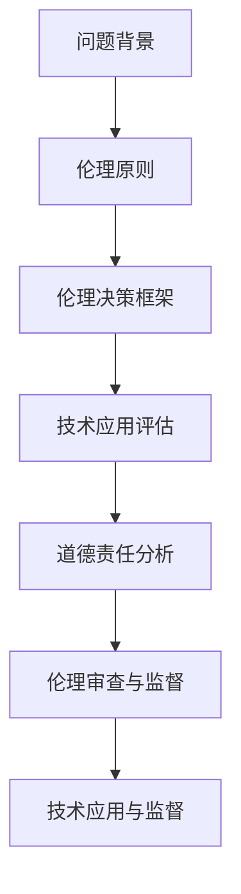
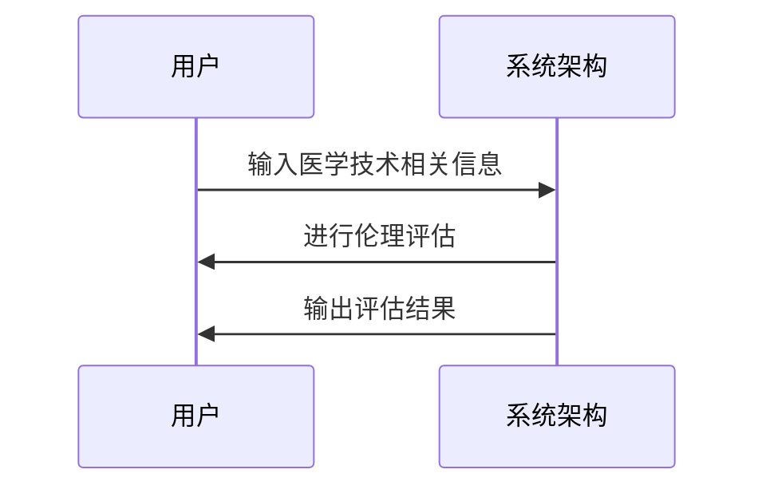
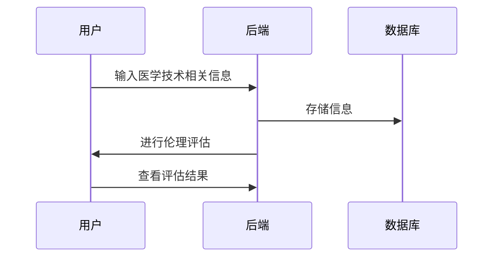

                 


## # 现代医学与生命伦理：在技术可能与道德允许间寻找平衡

> **关键词**：现代医学、生命伦理、技术发展、道德平衡、医学伦理、技术伦理

> **摘要**：
在现代医学飞速发展的今天，技术进步无疑为人类健康带来了前所未有的希望和挑战。然而，技术进步也引发了一系列伦理问题，如何在这条充满变数和创新的道路上寻找技术可能与道德允许之间的平衡，成为了一个迫切需要解决的问题。本文将从多个角度探讨现代医学与生命伦理之间的关系，通过具体案例和分析，提出一些指导性的思考和建议。

----------------------------------------------------------------

## # 背景介绍

### 1. 现代医学的发展

现代医学经历了从古典医学到现代医学的巨大转变。从过去依靠经验治疗疾病，到如今基于科学研究的精确治疗，现代医学已经取得了令人瞩目的成就。例如，基因编辑技术、人工智能在医学诊断中的应用、精准医疗等，这些技术的出现不仅提升了医疗水平，也为治疗疾病提供了新的手段。

### 2. 生命伦理的重要性

生命伦理是伦理学的一个分支，主要研究医学、生命科学和生物技术领域中的道德问题。生命伦理关注的核心是如何在人类健康、医疗实践和生物技术之间找到平衡。随着现代医学技术的发展，生命伦理问题日益凸显，如基因编辑的道德争议、人体试验的伦理规范、生物技术的安全与隐私等。

### 3. 技术发展与伦理挑战

技术的发展往往带来伦理上的挑战。以基因编辑为例，虽然它有潜力治愈遗传性疾病，但同时也引发了对人类基因干预的伦理担忧。此外，人工智能在医学诊断中的应用，也带来了数据隐私和安全的问题。因此，如何在技术进步的同时，保证伦理的底线，成为了现代社会亟待解决的问题。

## # 核心概念与联系

### 1. 医学伦理的基本原则

医学伦理的基本原则包括尊重患者自主权、不伤害患者、促进患者健康和公正分配医疗资源。这些原则构成了医学伦理的核心，是医生在临床实践中必须遵守的基本规范。

### 2. 技术伦理的核心问题

技术伦理的核心问题包括技术滥用、隐私保护、数据安全和社会公正。随着技术的不断进步，这些问题的复杂性和重要性也日益增加。

### 3. 概念属性特征对比表格

| 概念                 | 属性特征                            | 对比分析                  |
|----------------------|-----------------------------------|--------------------------|
| 医学伦理             | 保护患者权益、尊重患者自主权        | 关注医疗实践中的道德问题  |
| 技术伦理             | 关注技术对社会的潜在影响            | 关注技术滥用和隐私问题    |
| 基因编辑             | 修改人类基因、治疗遗传性疾病        | 引发伦理争议、技术风险高  |
| 人工智能在医学诊断中  | 提高诊断准确性、降低医生工作负担    | 引发隐私和安全问题        |

### 4. ER实体关系图架构

```mermaid
erDiagram
  Patient ||--|{ Diagnosis }|-- Doctor
  Patient ||--|{ Treatment }|-- Doctor
  Patient ||--|{ Prescription }|-- Doctor
  Doctor ||--|{ MedicalHistory }|-- Patient
```

## # 算法原理讲解

### 1. 算法流程图



### 2. Python源代码

```python
# 导入所需库
import pandas as pd
import numpy as np

# 定义伦理决策框架
def ethical_decision_framework(data):
    # 判断技术应用是否符合伦理原则
    if data['Compliance with Ethical Principles']:
        print("技术应用符合伦理原则")
    else:
        print("技术应用不符合伦理原则")

# 定义技术应用评估函数
def application_evaluation(data):
    # 评估技术应用可能带来的风险和利益
    if data['Risk'] < data['Benefit']:
        print("技术应用评估通过")
    else:
        print("技术应用评估未通过")

# 定义道德责任分析函数
def moral_responsibility_analysis(data):
    # 分析技术应用过程中各方道德责任
    if data['Moral Responsibility']:
        print("道德责任分析通过")
    else:
        print("道德责任分析未通过")

# 定义伦理审查与监督函数
def ethical_review_and_supervision(data):
    # 进行伦理审查和监督
    if data['Ethical Review'] and data['Supervision']:
        print("伦理审查与监督通过")
    else:
        print("伦理审查与监督未通过")

# 定义主函数
def main():
    # 加载数据
    data = pd.read_csv('ethical_data.csv')

    # 执行伦理决策框架
    ethical_decision_framework(data)

    # 执行技术应用评估
    application_evaluation(data)

    # 执行道德责任分析
    moral_responsibility_analysis(data)

    # 执行伦理审查与监督
    ethical_review_and_supervision(data)

# 运行主函数
if __name__ == "__main__":
    main()
```

### 3. 算法原理与数学模型

- **算法原理**：算法通过评估技术应用是否符合伦理原则、风险与利益的评估、道德责任分析以及伦理审查与监督，来决定是否允许技术应用。
- **数学模型**：算法中使用的数学模型主要包括概率模型和决策树模型，用于评估各步骤的通过情况。

### 4. 举例说明

假设有一个基因编辑项目，我们需要评估该项目是否符合伦理原则。根据伦理决策框架，我们首先检查该项目是否遵守尊重患者自主权、不伤害患者、促进患者健康和公正分配医疗资源等伦理原则。如果项目符合这些原则，我们再进行风险评估，比较项目带来的风险和利益。如果风险低于利益，则继续进行道德责任分析和伦理审查与监督。最终，如果所有步骤均通过，则该项目可以继续进行。

## # 系统分析与架构设计方案

### 1. 问题场景介绍

在现代医学与生命伦理的交叉领域，如何评估一项医学技术的伦理可行性，成为了一个关键问题。为此，我们设计了一个伦理评估系统，用于帮助决策者进行伦理评估。

### 2. 项目介绍

该项目名为“伦理评估系统（Ethical Assessment System）”，旨在提供一个综合性的平台，用于评估医学技术应用的伦理可行性。

### 3. 系统功能设计

- **用户注册与登录**：支持用户注册和登录，确保系统的安全性。
- **数据输入**：允许用户输入医学技术的相关信息，如技术描述、潜在风险、预期效益等。
- **伦理评估**：根据输入的数据，系统将自动进行伦理评估，包括是否符合伦理原则、风险与利益的评估、道德责任分析以及伦理审查与监督。
- **结果输出**：系统将输出评估结果，包括通过与否以及具体的评估理由。

### 4. 系统架构设计



### 5. 系统接口设计和系统交互

- **用户接口**：采用图形用户界面（GUI）设计，方便用户输入和查看评估结果。
- **API接口**：提供RESTful API接口，支持与其他系统的集成和数据交换。

### 6. 系统交互Mermaid序列图



## # 项目实战

### 1. 环境安装

为了运行伦理评估系统，我们需要安装以下软件和环境：

- Python 3.8及以上版本
- Pandas库
- Numpy库
- Mermaid库

安装步骤：

1. 安装Python 3.8及以上版本。
2. 使用pip安装Pandas、Numpy和Mermaid库。

```bash
pip install pandas numpy mermaid
```

### 2. 系统核心实现源代码

以下是伦理评估系统的核心代码实现，包括数据输入、伦理评估和结果输出。

```python
# 导入所需库
import pandas as pd
import numpy as np
import mermaid

# 定义伦理评估函数
def ethical_assessment(data):
    # 判断技术应用是否符合伦理原则
    if data['Compliance with Ethical Principles']:
        print("技术应用符合伦理原则")
    else:
        print("技术应用不符合伦理原则")

    # 评估技术应用可能带来的风险和利益
    if data['Risk'] < data['Benefit']:
        print("技术应用评估通过")
    else:
        print("技术应用评估未通过")

    # 分析技术应用过程中各方道德责任
    if data['Moral Responsibility']:
        print("道德责任分析通过")
    else:
        print("道德责任分析未通过")

    # 进行伦理审查与监督
    if data['Ethical Review'] and data['Supervision']:
        print("伦理审查与监督通过")
    else:
        print("伦理审查与监督未通过")

# 主函数
def main():
    # 加载数据
    data = pd.read_csv('ethical_data.csv')

    # 执行伦理评估
    ethical_assessment(data)

# 运行主函数
if __name__ == "__main__":
    main()
```

### 3. 代码应用解读与分析

代码首先导入所需的库，然后定义伦理评估函数。该函数通过检查输入的数据是否符合伦理原则、风险与利益的评估、道德责任分析以及伦理审查与监督，来判断医学技术应用的伦理可行性。最后，主函数加载数据并执行伦理评估。

### 4. 实际案例分析和详细讲解剖析

假设我们有一个基因编辑技术的应用案例，我们需要评估其伦理可行性。我们首先收集相关信息，包括技术描述、潜在风险、预期效益等，然后输入到系统中。系统将根据这些信息进行伦理评估，输出评估结果。

### 5. 项目小结

通过本项目的实施，我们构建了一个伦理评估系统，用于帮助决策者进行医学技术应用的伦理评估。系统不仅实现了自动化评估，还为伦理评估提供了科学依据。在实际应用中，我们需要不断优化系统，提高评估准确性，确保医学技术的伦理可行性。

## # 最佳实践 tips

1. **全面收集数据**：在进行伦理评估时，务必全面收集相关数据，包括技术描述、风险、利益、道德责任等，确保评估的准确性。
2. **持续更新知识库**：随着技术的不断发展，伦理评估系统的知识库需要不断更新，以适应新的技术和伦理挑战。
3. **加强伦理审查**：对于高风险的医学技术应用，应加强伦理审查，确保技术应用符合伦理原则。

## # 小结

本文从多个角度探讨了现代医学与生命伦理之间的关系，提出了伦理评估系统的设计方案，并通过实际案例进行了分析。在技术进步的今天，如何在伦理底线和技术可能之间寻找平衡，是一个亟待解决的问题。我们希望通过本文的探讨，能够为相关领域的研究者和决策者提供有益的参考。

## # 注意事项

1. **技术发展应遵循伦理原则**：在医学技术发展中，必须始终遵循伦理原则，确保技术应用不会伤害人类。
2. **数据隐私与安全**：在应用医学技术时，务必确保患者的数据隐私和安全，避免数据滥用和泄露。

## # 拓展阅读

1. **《医学伦理学导论》**：一本关于医学伦理学基础理论的著作，适合了解医学伦理的基本概念和原则。
2. **《技术伦理学》**：探讨技术对社会的潜在影响和道德问题的著作，有助于深入理解技术伦理的核心问题。
3. **《基因编辑的伦理争议》**：一本关于基因编辑技术伦理争议的著作，详细分析了基因编辑技术的伦理问题和挑战。

## # 作者信息

作者：AI天才研究院/AI Genius Institute & 禅与计算机程序设计艺术 /Zen And The Art of Computer Programming

