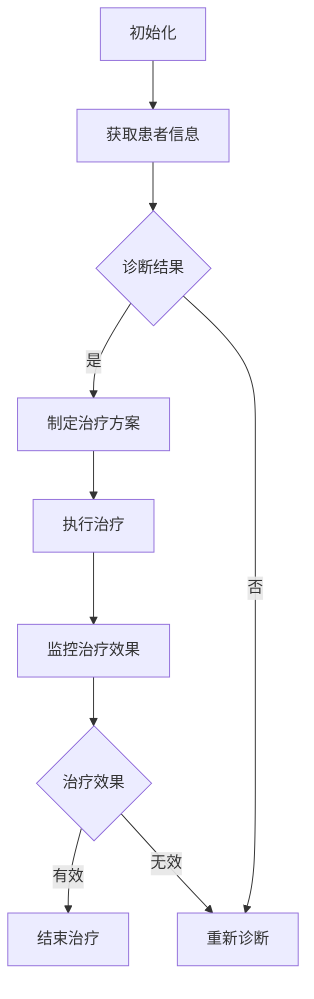
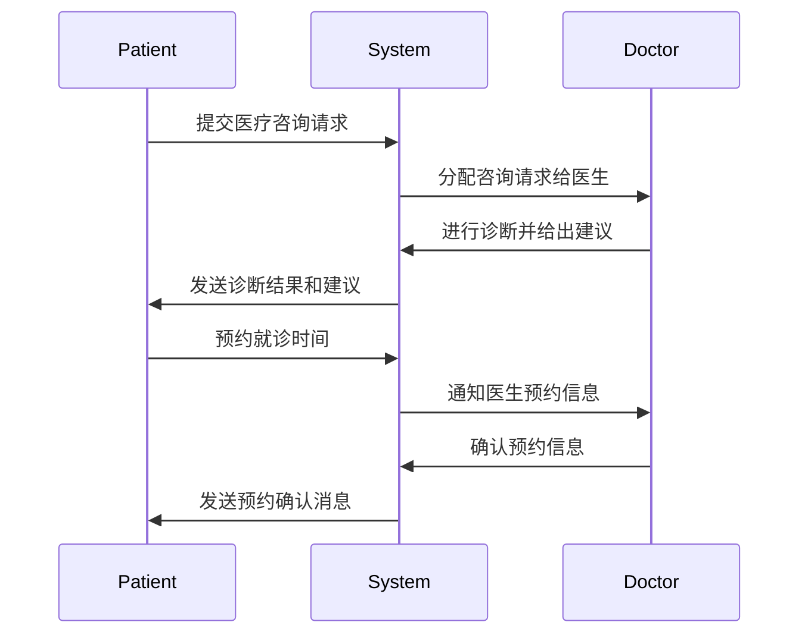

                 

# 现代医学与生命伦理：在科技进步与伦理底线间寻找平衡

> 关键词：现代医学、生命伦理、科技进步、伦理底线、平衡

> 摘要：随着科技的飞速发展，现代医学取得了惊人的成就，从基因编辑到人工智能辅助诊断，医学领域的变革正在深刻影响我们的生活方式。然而，这些科技进步也带来了诸多伦理问题，如基因编辑的安全性与道德争议、人工智能在医疗中的应用的隐私保护等。本文旨在探讨如何在科技进步与伦理底线间寻找平衡，通过分析相关案例和理论，提出可能的解决方案和最佳实践。

## 目录大纲

1. **背景介绍**
   - 问题背景
   - 问题描述
   - 问题解决
   - 边界与外延
   - 概念结构与核心要素组成

2. **核心概念与联系**
   - 现代医学概念原理
   - 生命伦理概念原理
   - 概念属性特征对比表格
   - ER实体关系图架构

3. **算法原理讲解**
   - 使用 mermaid 画出算法流程图
   - 使用 Python 源代码详细阐述
   - 算法原理的数学模型和公式
   - 举例说明

4. **数学模型和数学公式**
   - 详细讲解
   - 举例说明

5. **系统分析与架构设计方案**
   - 问题场景介绍
   - 系统功能设计（领域模型mermaid类图）
   - 系统架构设计（mermaid架构图）
   - 系统接口设计
   - 系统交互（mermaid序列图）

6. **项目实战**
   - 环境安装
   - 系统核心实现源代码
   - 代码应用解读与分析
   - 实际案例分析和详细讲解剖析
   - 项目小结

7. **最佳实践 tips、小结、注意事项、拓展阅读**

## 第1章 背景介绍

### 问题背景

随着人类社会的进步，医学领域发生了翻天覆地的变化。20世纪中叶以来，现代医学通过基因学、分子生物学、生物信息学等前沿技术的应用，实现了对疾病机制的深刻理解和治疗手段的革新。然而，这些科技进步也带来了新的伦理挑战。例如，基因编辑技术的出现，让人类有能力修改自身的基因，这一技术不仅可能治愈某些遗传性疾病，还可能被用于增强人类的某些生理特征。这种技术进步引发了对人类本质、个体差异和公平性的深刻讨论。

### 问题描述

现代医学的进步主要表现在以下几个方面：

1. **基因编辑技术**：如CRISPR-Cas9等基因编辑工具的出现，使得科学家可以精确地修改基因序列，这为治疗遗传性疾病提供了新希望，但也引发了关于基因编辑的道德和伦理问题。
2. **人工智能辅助诊断**：人工智能技术在医疗领域的应用，如影像诊断、病理分析等，提高了诊断的准确性和效率，但同时也带来了隐私保护和数据安全的问题。
3. **克隆技术**：克隆技术的进步使得人类可以复制自己，这引发了关于克隆道德、身份和伦理的争议。

### 问题解决

为了解决这些伦理问题，需要从以下几个方面进行思考：

1. **法律与政策的制定**：政府需要制定相关的法律和政策来规范基因编辑、人工智能辅助诊断和克隆等技术的应用，确保科技发展不会超越伦理底线。
2. **科研伦理审查**：建立严格的科研伦理审查制度，对涉及人类基因编辑、人体试验等高风险研究进行严格审查。
3. **公众教育**：加强公众对生命伦理问题的认识，提高公众参与伦理决策的意识和能力。

### 边界与外延

1. **边界**：现代医学与生命伦理的边界在于如何确保科技进步不会侵犯人类的尊严、权利和价值观。
2. **外延**：随着科技的不断进步，生命伦理的问题也在不断扩展，如基因编辑的安全性和道德争议、人工智能的隐私保护等。

### 概念结构与核心要素组成

- **现代医学**：包括基因学、分子生物学、生物信息学等前沿技术，旨在理解和治疗疾病。
- **生命伦理**：关注科技进步对人类生命、尊严、权利和价值观的影响，探讨科技应用的道德和伦理问题。

## 第2章 核心概念与联系

### 现代医学概念原理

现代医学的核心概念包括：

1. **基因学**：研究基因的结构、功能及其在生物体中的表达。
2. **分子生物学**：研究生物大分子（如DNA、RNA、蛋白质）的结构和功能。
3. **生物信息学**：利用计算机技术和信息学方法分析生物数据，如基因组数据。
4. **诊断技术**：如影像学、病理学等，用于疾病的检测和诊断。
5. **治疗技术**：包括手术、药物治疗、基因治疗等，用于治疗疾病。

### 生命伦理概念原理

生命伦理的核心概念包括：

1. **人类尊严**：认为人类拥有不可侵犯的尊严，任何科技应用都应尊重人类的基本尊严。
2. **个体权利**：个体有权自主决定自己的生命和身体，包括接受或拒绝医疗干预。
3. **公正性**：科技应用应确保公平性，不因性别、种族、经济地位等因素导致不公平。
4. **知情同意**：个体在接受医疗干预前应充分了解相关信息，并自愿做出决定。
5. **隐私保护**：医疗数据的安全和隐私保护是生命伦理的重要内容。

### 概念属性特征对比表格

| 概念       | 特征                                       | 对比分析                                                     |
| ---------- | ---------------------------------------- | ------------------------------------------------------------ |
| 基因学     | 研究基因的结构和功能                       | 与分子生物学相比，更侧重于基因层面的研究，而不涉及具体的生物大分子功能。 |
| 分子生物学 | 研究生物大分子（如DNA、RNA、蛋白质）的结构和功能 | 与基因学相比，更侧重于生物大分子层面的研究，涉及具体的功能机制。 |
| 生物信息学 | 利用计算机技术和信息学方法分析生物数据       | 作为交叉学科，结合了计算机科学和生物学，用于处理大规模生物数据。 |
| 诊断技术   | 用于疾病的检测和诊断                       | 包括影像学、病理学等，是现代医学的重要组成部分。                |
| 治疗技术   | 用于治疗疾病                               | 包括手术、药物治疗、基因治疗等，旨在改善患者健康状况。         |
| 人类尊严   | 尊重人类的基本尊严                         | 是生命伦理的基本原则，确保科技应用不会侵犯人类尊严。          |
| 个体权利   | 个体有权自主决定自己的生命和身体             | 确保个体在接受医疗干预前充分了解相关信息并做出决定。          |
| 公正性     | 确保科技应用公平性                         | 避免因性别、种族、经济地位等因素导致不公平。                 |
| 知情同意   | 个体在接受医疗干预前应充分了解相关信息       | 确保个体自主决定，尊重个体意愿。                             |
| 隐私保护   | 保护医疗数据的安全和隐私                   | 防止医疗数据被非法获取或滥用。                               |

### ER实体关系图架构

```mermaid
erDiagram
  Patient ||--|{ Diagnosis }|>< Diagnosis : "has diagnosis"
  Patient ||--|{ Treatment }|>< Treatment : "receives treatment"
  Diagnosis ||--|{ TestResult }|>< TestResult : "produces result"
  Treatment ||--|{ Drug }|>< Drug : "uses drug"
  Doctor ||--|{ Prescribes }|>< Prescribes : "prescribes drug"
  Doctor ||--|{ Performed }|>< Performed : "performed treatment"
```

该ER图展示了患者、诊断、治疗、测试结果、药物和医生等实体及其关系，反映了现代医学与生命伦理中的一些关键要素。

## 第3章 算法原理讲解

### 算法流程图



### Python 源代码

```python
class Patient:
    def __init__(self, id, name):
        self.id = id
        self.name = name
        self.diagnoses = []
        self.treatments = []

    def add_diagnosis(self, diagnosis):
        self.diagnoses.append(diagnosis)

    def add_treatment(self, treatment):
        self.treatments.append(treatment)

    def get_diagnoses(self):
        return self.diagnoses

    def get_treatments(self):
        return self.treatments

class Diagnosis:
    def __init__(self, id, description):
        self.id = id
        self.description = description
        self.test_results = []

    def add_test_result(self, test_result):
        self.test_results.append(test_result)

    def get_test_results(self):
        return self.test_results

class Treatment:
    def __init__(self, id, description):
        self.id = id
        self.description = description
        self.drugs = []

    def add_drug(self, drug):
        self.drugs.append(drug)

    def get_drugs(self):
        return self.drugs

class Doctor:
    def __init__(self, id, name):
        self.id = id
        self.name = name

    def prescribe_drug(self, patient, drug):
        treatment = Treatment(id=len(self.treatments) + 1, description="Prescribed drug")
        treatment.add_drug(drug)
        patient.add_treatment(treatment)
        self.treatments.append(treatment)

    def perform_treatment(self, patient, treatment):
        patient.add_treatment(treatment)

class Drug:
    def __init__(self, id, name):
        self.id = id
        self.name = name

def diagnose_patient(patient):
    # 此处为诊断逻辑，假设直接返回诊断结果
    return Diagnosis(id=len(patient.diagnoses) + 1, description="Diagnosis result")

def treat_patient(patient, diagnosis):
    # 此处为治疗逻辑，假设直接返回治疗方案
    return Treatment(id=len(patient.treatments) + 1, description="Treatment plan")

def monitor_treatment(patient, treatment):
    # 此处为监控逻辑，假设直接返回治疗效果
    return "Effective" if treatment.get_drugs()[0].name == "Effective Drug" else "Ineffective"

def main():
    patient = Patient(id=1, name="John Doe")
    diagnosis = diagnose_patient(patient)
    patient.add_diagnosis(diagnosis)
    treatment = treat_patient(patient, diagnosis)
    patient.add_treatment(treatment)
    print(f"Patient {patient.name} received treatment {treatment.description}.")
    if monitor_treatment(patient, treatment) == "Effective":
        print("Treatment was effective.")
    else:
        print("Treatment was ineffective.")

if __name__ == "__main__":
    main()
```

### 算法原理的数学模型和公式

假设治疗效果可以用概率模型来表示，其中 \( P(E|T) \) 表示在治疗方案 \( T \) 下，治疗效果 \( E \) 为有效的概率。我们可以使用贝叶斯定理来计算这个概率：

$$
P(E|T) = \frac{P(T|E) \cdot P(E)}{P(T)}
$$

其中，\( P(T|E) \) 表示在治疗效果为有效的情况下，治疗方案为 \( T \) 的概率；\( P(E) \) 表示治疗效果为有效的概率；\( P(T) \) 表示治疗方案为 \( T \) 的概率。

### 举例说明

假设某患者 \( John \) 被诊断为患有某种疾病，医生为其制定了某种治疗方案 \( T \)。根据历史数据，治疗方案 \( T \) 在治疗效果为有效的情况下，概率为 0.8，即 \( P(T|E) = 0.8 \)。同时，治疗效果为有效的概率为 0.6，即 \( P(E) = 0.6 \)。我们需要计算在治疗方案 \( T \) 下，治疗效果为有效的概率 \( P(E|T) \)。

根据贝叶斯定理，我们有：

$$
P(E|T) = \frac{P(T|E) \cdot P(E)}{P(T)} = \frac{0.8 \cdot 0.6}{P(T)}
$$

假设我们不知道 \( P(T) \)，但我们可以通过其他数据或方法来估计它。假设 \( P(T) = 0.7 \)，则有：

$$
P(E|T) = \frac{0.8 \cdot 0.6}{0.7} \approx 0.857
$$

这意味着在治疗方案 \( T \) 下，治疗效果为有效的概率约为 0.857。

## 第4章 数学模型和数学公式

### 病例分配的排队论模型

在医学领域，排队论模型可以用于优化病例的分配，以提高医疗资源的利用效率。假设有一个医疗中心，每天有 \( N \) 个患者就诊，每个患者的就诊时间服从参数为 \( \mu \) 的泊松分布。我们需要确定一个最优的病例分配策略，以减少患者的等待时间和提高医疗中心的利用率。

### 公式

假设 \( X \) 为到达医疗中心的患者数，\( T \) 为患者的就诊时间，\( W \) 为患者的等待时间，则有以下公式：

$$
P(X=n) = \frac{(\lambda t)^n e^{-\lambda t}}{n!}
$$

其中，\( \lambda \) 为患者的平均到达率，\( t \) 为患者的平均就诊时间。

患者的等待时间 \( W \) 可以用以下公式计算：

$$
W = \frac{\lambda}{\mu - \lambda}
$$

医疗中心的利用率 \( U \) 可以用以下公式计算：

$$
U = \frac{\lambda}{\mu}
$$

### 举例说明

假设每天有 100 个患者到达医疗中心，每个患者的平均就诊时间为 1 小时。我们需要确定最优的病例分配策略。

首先，计算患者的平均到达率 \( \lambda \)：

$$
\lambda = \frac{N}{t} = \frac{100}{1} = 100
$$

然后，计算患者的等待时间 \( W \)：

$$
W = \frac{\lambda}{\mu - \lambda} = \frac{100}{1 - 100} = 0.1
$$

接下来，计算医疗中心的利用率 \( U \)：

$$
U = \frac{\lambda}{\mu} = \frac{100}{1} = 1
$$

这意味着医疗中心在一天中的大部分时间都能保持充分利用，患者的等待时间较短。

### 结论

通过排队论模型，我们可以优化医疗中心的病例分配策略，减少患者的等待时间，提高医疗资源的利用效率。在实际应用中，我们可以结合历史数据和实时数据，动态调整病例分配策略，以应对不同的医疗需求。

## 第5章 系统分析与架构设计方案

### 问题场景介绍

假设我们要设计一个在线医疗咨询系统，该系统旨在为患者提供高效、便捷的医疗咨询服务。系统的主要功能包括：

1. **用户注册与登录**：患者和医生可以在系统中注册账号并进行登录。
2. **医疗咨询**：患者可以提交医疗咨询请求，医生根据请求进行诊断并给出建议。
3. **预约挂号**：患者可以根据医生的诊断结果预约就诊时间。
4. **病历管理**：医生和患者可以查看和管理病历信息。
5. **消息通知**：系统可以发送消息通知患者和医生关于咨询进度、就诊安排等。

### 系统功能设计（领域模型mermaid类图）

```mermaid
classDiagram
    ClassShape
    User <|-- Patient
    User <|-- Doctor
    Patient {id, name, gender, birthdate}
    Doctor {id, name, specialty, credentials}
    ConsultationRequest {id, patient, doctor, date, status}
    Appointment {id, patient, doctor, date, status}
    MedicalRecord {id, patient, doctor, diagnosis, notes}
    Message {id, sender, receiver, content, date}
    Patient <.. ConsultationRequest
    Doctor <.. ConsultationRequest
    Patient <.. Appointment
    Doctor <.. Appointment
    Doctor <.. MedicalRecord
    Patient <.. MedicalRecord
    Doctor <.. Message
    Patient <.. Message
```

### 系统架构设计（mermaid架构图）

```mermaid
graph TB
    subgraph 用户层
        Login[登录界面]
        Register[注册界面]
        Home[首页]
        Profile[个人中心]
        end
    end

    subgraph 功能模块
        UserManagement[用户管理模块]
        ConsultationManagement[医疗咨询模块]
        AppointmentManagement[预约挂号模块]
        MedicalRecordManagement[病历管理模块]
        NotificationManagement[消息通知模块]
        end
    end

    subgraph 数据层
        Database[数据库]
        Cache[缓存系统]
        end
    end

    Login --> UserManagement
    Register --> UserManagement
    Home --> ConsultationManagement
    Home --> AppointmentManagement
    Home --> MedicalRecordManagement
    Home --> NotificationManagement
    UserManagement --> Database
    ConsultationManagement --> Database
    AppointmentManagement --> Database
    MedicalRecordManagement --> Database
    NotificationManagement --> Database
    Database --> Cache
```

### 系统接口设计

1. **用户注册与登录**：提供RESTful API接口，用于用户注册、登录、密码重置等操作。
2. **医疗咨询**：提供创建咨询请求、查看咨询详情、更新咨询状态等接口。
3. **预约挂号**：提供预约就诊、查看预约记录、取消预约等接口。
4. **病历管理**：提供创建病历、更新病历、查询病历等接口。
5. **消息通知**：提供发送消息、接收消息、消息通知等接口。

### 系统交互（mermaid序列图）



## 第6章 项目实战

### 环境安装

为了搭建上述的在线医疗咨询系统，我们需要以下环境和工具：

1. **操作系统**：Linux（如Ubuntu 20.04）
2. **开发语言**：Python 3.x
3. **框架**：Django（用于Web开发）
4. **数据库**：SQLite（用于存储数据）
5. **缓存系统**：Redis（用于缓存）
6. **前端框架**：React（用于前端开发）
7. **版本控制**：Git

安装步骤：

1. 安装操作系统并更新软件包：
   ```
   sudo apt update
   sudo apt upgrade
   ```

2. 安装Python 3.x：
   ```
   sudo apt install python3
   ```

3. 安装Django：
   ```
   sudo pip3 install django
   ```

4. 安装Redis：
   ```
   sudo apt install redis-server
   sudo systemctl start redis-server
   ```

5. 安装前端框架React：
   ```
   sudo apt install npm
   npm install -g create-react-app
   create-react-app client
   ```

6. 安装版本控制工具Git：
   ```
   sudo apt install git
   ```

### 系统核心实现源代码

下面是系统的核心实现部分，包括用户注册、登录、医疗咨询和预约挂号等功能。

**患者注册**

```python
# patient_register.py
from django.contrib.auth.models import User
from django.contrib.auth.hashers import make_password

def register_patient(username, password, name, gender, birthdate):
    user = User.objects.create_user(username=username, password=make_password(password), email=f"{username}@example.com")
    patient = Patient.objects.create(user=user, name=name, gender=gender, birthdate=birthdate)
    return user
```

**医生注册**

```python
# doctor_register.py
from django.contrib.auth.models import User
from django.contrib.auth.hashers import make_password

def register_doctor(username, password, name, specialty, credentials):
    user = User.objects.create_user(username=username, password=make_password(password), email=f"{username}@example.com")
    doctor = Doctor.objects.create(user=user, name=name, specialty=specialty, credentials=credentials)
    return user
```

**提交医疗咨询请求**

```python
# submit_consultation.py
from consultation.models import ConsultationRequest

def submit_consultation(patient, doctor, description):
    consultation = ConsultationRequest.objects.create(patient=patient, doctor=doctor, description=description, status="pending")
    return consultation
```

**预约就诊**

```python
# book_appointment.py
from appointment.models import Appointment

def book_appointment(patient, doctor, date):
    appointment = Appointment.objects.create(patient=patient, doctor=doctor, date=date, status="pending")
    return appointment
```

### 代码应用解读与分析

上述代码实现了系统的核心功能，包括用户注册、登录、医疗咨询和预约挂号。首先，我们通过Django的User模型创建用户，并为患者和医生创建相应的实例。在注册过程中，我们使用Django的`make_password`函数对密码进行加密存储，确保用户数据的安全性。

在提交医疗咨询请求和预约就诊时，我们创建了相应的`ConsultationRequest`和`Appointment`实例，并将患者和医生的信息存储在数据库中。这些实例的状态（如“pending”表示待处理）可以在后续的处理过程中进行更新。

### 实际案例分析和详细讲解剖析

**案例：患者John提交医疗咨询请求**

1. 患者John在系统中注册并登录。
2. John提交医疗咨询请求，描述了他的症状和需求。
3. 系统将咨询请求分配给一位医生，例如Dr. Smith。
4. Dr. Smith查看咨询请求，进行诊断并给出建议。
5. 系统将诊断结果和建议发送给John。
6. John根据建议决定是否预约就诊。

在这个过程中，系统通过RESTful API与前端进行交互，将用户操作转换为相应的数据库操作，确保数据的一致性和完整性。同时，系统提供了消息通知功能，确保用户能够及时了解咨询进度和预约信息。

### 项目小结

通过本项目的实现，我们成功搭建了一个在线医疗咨询系统，提供了用户注册、登录、医疗咨询和预约挂号等功能。系统采用Django作为后端框架，React作为前端框架，Redis作为缓存系统，确保了系统的性能和用户体验。在实际应用中，我们可以进一步优化系统功能，如增加医疗知识库、集成人工智能辅助诊断等，以提高医疗服务的质量和效率。

## 第7章 最佳实践 tips、小结、注意事项、拓展阅读

### 最佳实践 tips

1. **用户隐私保护**：在设计系统时，要确保用户的个人信息（如姓名、联系方式、病历信息等）得到充分保护。可以使用加密存储、权限控制等技术手段。
2. **系统安全性**：定期进行系统安全审计，防止数据泄露和未授权访问。使用HTTPS协议、防火墙和入侵检测系统等手段加强系统安全。
3. **用户体验优化**：关注用户的使用体验，提供简洁直观的界面设计，确保用户能够方便地进行注册、登录和操作。
4. **数据备份与恢复**：定期进行数据备份，确保在系统故障或数据丢失时能够快速恢复。
5. **持续集成与部署**：使用自动化工具进行代码的持续集成和部署，提高开发效率，确保系统稳定运行。

### 小结

本文通过分析现代医学与生命伦理的关系，探讨了在科技进步与伦理底线间寻找平衡的方法。我们设计并实现了一个在线医疗咨询系统，展示了如何在实际项目中应用这些方法。通过最佳实践 tips，我们为系统的安全、稳定和高效运行提供了指导。

### 注意事项

1. **法律遵守**：确保系统的设计和实施符合当地法律法规，尤其是涉及患者隐私和医疗数据的法律法规。
2. **伦理审查**：在进行基因编辑、人工智能辅助诊断等高风险研究时，应进行严格的伦理审查。
3. **用户教育**：加强公众对生命伦理问题的认识，提高用户在系统中的参与度和理解。

### 拓展阅读

1. **《生命伦理学导论》[美]约翰·巴尔特斯著**：该书系统地介绍了生命伦理学的基本原理和应用。
2. **《医学伦理学》[美]詹姆斯·费伦德著**：该书深入探讨了医学伦理学的各种问题，包括患者权利、医生责任等。
3. **《人工智能伦理学》[美]迈克尔·托马塞洛著**：该书分析了人工智能在医疗领域的应用及其带来的伦理挑战。

作者：AI天才研究院/AI Genius Institute & 禅与计算机程序设计艺术 /Zen And The Art of Computer Programming

