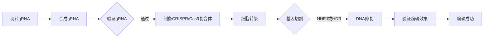
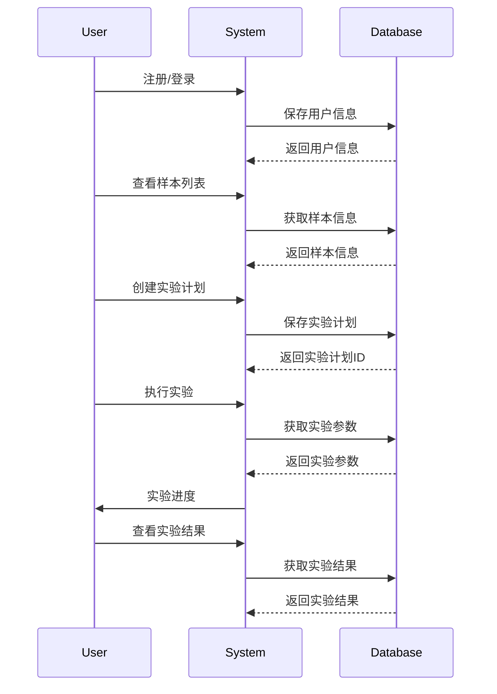
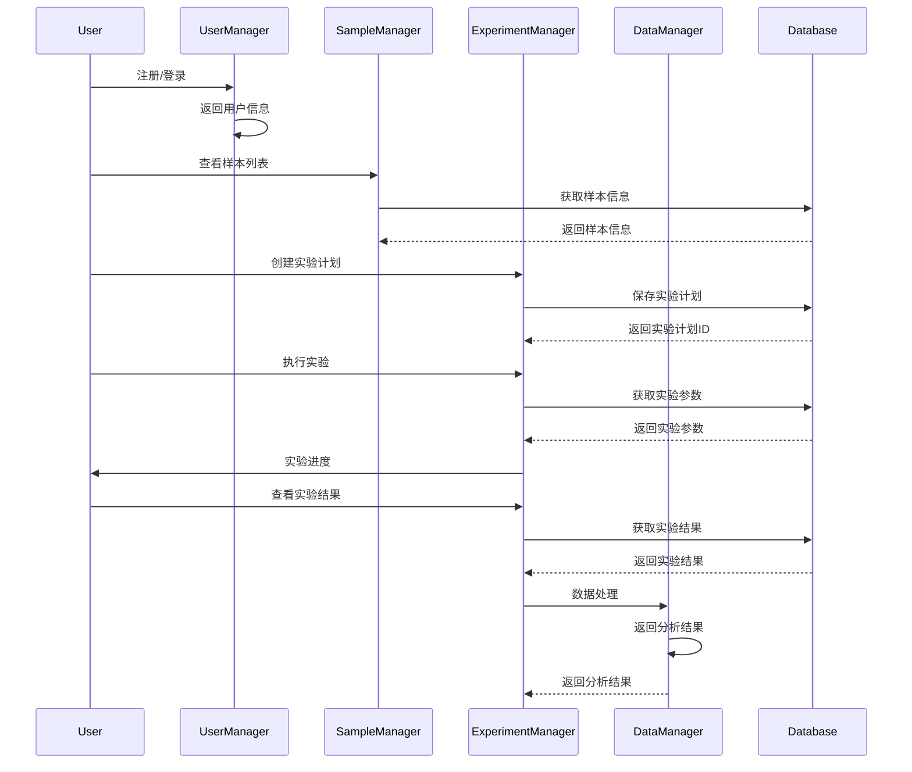
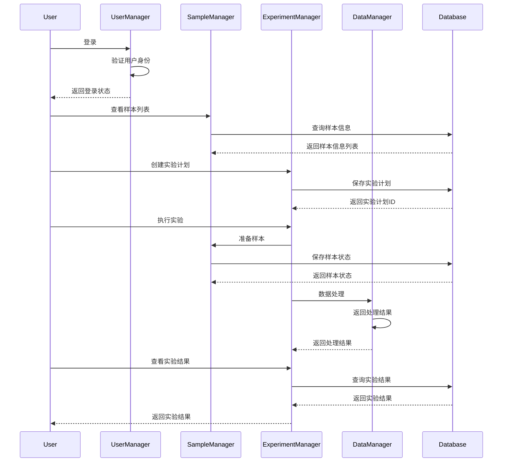

                 

### 第一部分：问题背景与核心概念

#### 第1章：现代医疗伦理概述

#### 1.1 问题背景

##### 1.1.1 医疗伦理的发展历程

医疗伦理的发展历程可以追溯到古希腊时期，当时的医生希波克拉底提出了“希波克拉底誓言”，强调了医生的职业道德和责任。这一誓言成为了医学伦理的基础，并延续至今。随着时间的推移，医疗伦理学逐渐形成了独立的学科，并随着医疗技术的进步而不断发展。

在过去的几十年中，医疗技术取得了巨大的进步，尤其是基因编辑技术的崛起，引发了关于医疗伦理的广泛讨论。基因编辑技术，如CRISPR/Cas9，使得科学家能够直接修改人类基因，这一技术的出现带来了巨大的治疗潜力，但同时也引发了许多伦理争议。

##### 1.1.2 现代医疗技术的发展

现代医疗技术的发展极大地改变了医学的面貌。从抗生素的发现到器官移植，再到基因疗法和细胞治疗，这些技术的发展不仅提高了疾病的治愈率，也改变了我们对健康和疾病的理解。特别是基因编辑技术，它为治疗遗传性疾病提供了前所未有的可能性。

然而，现代医疗技术的发展也带来了新的挑战。基因编辑技术不仅涉及医学伦理，还涉及社会伦理、法律和隐私问题。如何确保基因编辑技术的使用符合伦理标准，以及如何制定相应的法律和政策来规范这一领域，成为了现代医疗伦理学的重要议题。

##### 1.1.3 基因编辑技术的兴起

基因编辑技术的兴起是现代医疗技术发展的一个重要里程碑。CRISPR/Cas9技术，作为一种强大的基因编辑工具，使得科学家能够以前所未有的精度和效率对DNA进行修改。这一技术的出现，不仅为治疗遗传性疾病提供了新的希望，也引发了对医疗伦理的深刻反思。

基因编辑技术的潜力巨大，但同时也带来了一系列伦理问题。如何平衡科学进步与伦理责任，如何确保基因编辑技术的安全性和公平性，成为了现代医疗伦理学需要深入探讨的问题。

#### 1.2 核心概念

##### 1.2.1 医疗伦理的基本原则

医疗伦理学的基本原则包括尊重病人自主权、不伤害、善行和公正。这些原则为医疗实践提供了道德指导，并确保了医疗行为符合伦理标准。然而，在基因编辑技术的背景下，这些基本原则面临着新的挑战。

尊重病人自主权在基因编辑中尤为重要。病人需要充分了解基因编辑技术的潜在风险和不确定性，并能够在知情的情况下做出是否接受治疗的决定。不伤害原则要求医生在应用基因编辑技术时必须确保病人的安全和福祉。善行原则要求医生采取积极的措施来促进病人的健康，而公正原则要求基因编辑技术的应用应当公平，不应加剧社会不平等。

##### 1.2.2 基因编辑技术的基本原理

基因编辑技术的基本原理涉及对DNA序列的精确修改。CRISPR/Cas9技术利用一种名为CRISPR的天然免疫机制，通过Cas9酶切割DNA，然后通过DNA修复机制引入所需的改变。这一过程涉及几个关键步骤，包括目标识别、切割和修复。

了解基因编辑技术的基本原理对于理解其潜在伦理影响至关重要。科学家和伦理学家需要共同探讨如何确保基因编辑技术的安全性和有效性，并制定相应的伦理指导原则。

##### 1.2.3 生命操控的概念与范畴

生命操控是指通过技术手段对生命体的遗传特征进行修改，以实现特定的目的。基因编辑技术是生命操控的一种形式，它能够改变人类基因组的结构，从而影响个体的生理和生物学特征。

生命操控的概念与范畴涉及到广泛的伦理议题，包括基因编辑技术的道德边界、人类尊严、隐私权和未来世代的影响。如何划定生命操控的边界，以及如何在科学进步和伦理责任之间找到平衡，是现代医疗伦理学需要深入探讨的问题。

#### 1.3 边界与外延

##### 1.3.1 基因编辑技术的伦理争议

基因编辑技术的伦理争议主要集中在以下几个方面：

1. **基因编辑的道德边界**：如何确定基因编辑的应用范围和限制，以避免潜在的滥用和道德风险。
2. **人类尊严**：基因编辑是否可能侵犯人类尊严，特别是当涉及非治疗性基因编辑时。
3. **隐私权**：基因编辑技术可能涉及个人基因信息的收集和使用，这引发了关于隐私权和数据安全的担忧。
4. **未来世代的影响**：基因编辑可能对未出生的个体产生影响，这引发了关于代际公平和伦理责任的讨论。

##### 1.3.2 生命操控的社会影响

生命操控的社会影响是多层次和复杂的。首先，它可能对现有的社会结构和价值观产生深远的影响。例如，基因编辑技术可能导致社会分层加剧，因为只有富裕阶层能够承担昂贵的基因编辑治疗。此外，生命操控还可能引发社会和文化冲突，特别是在对人类自然特征的修改上。

##### 1.3.3 医疗伦理与法律的关系

医疗伦理与法律的关系在基因编辑技术的背景下变得尤为重要。法律需要为基因编辑技术提供明确的框架和指导，以确保其安全、合法和公正的应用。同时，医疗伦理学也需要与法律保持密切的联系，以共同制定和实施伦理标准。

然而，法律和伦理在处理基因编辑技术时可能会存在冲突。例如，某些法律可能未能充分反映最新的伦理原则，或者伦理原则可能未能得到法律的充分支持。因此，如何协调医疗伦理与法律的关系，以确保基因编辑技术的合理应用，是一个亟待解决的挑战。

#### 1.4 概念结构与核心要素组成

##### 1.4.1 基因编辑技术的基本结构

基因编辑技术的基本结构包括目标识别、切割、修饰和验证等几个关键步骤。CRISPR/Cas9技术通过引导Cas9酶到特定的DNA序列，然后切割该序列，从而实现基因的修改。这一过程需要精确的定位和高效的DNA修复机制。

##### 1.4.2 生命操控的核心要素

生命操控的核心要素包括基因、细胞和组织。基因是生命操控的靶点，细胞和组织的修改则可以实现特定的生物功能。此外，生命操控还需要涉及伦理审查、安全评估和监管机制，以确保其应用符合伦理和法律标准。

##### 1.4.3 医疗伦理的基本原则与要素

医疗伦理的基本原则包括尊重病人自主权、不伤害、善行和公正。这些原则贯穿于医疗实践的各个方面，并指导医生和医疗机构在处理医疗伦理问题时做出决策。医疗伦理的要素还包括伦理审查委员会、伦理指南和伦理培训，以确保医疗行为符合伦理标准。

#### 1.5 本章小结

本章概述了现代医疗伦理的背景和核心概念。通过探讨基因编辑技术的兴起、医疗伦理的基本原则以及生命操控的概念，我们为后续章节的分析提供了基础。接下来，我们将进一步深入探讨基因编辑技术的原理和应用，以及其在医疗伦理和社会层面的影响。这将帮助我们更好地理解这一领域的关键问题和挑战，为制定合理的伦理和政策框架提供依据。

---

#### 第2章：基因编辑技术原理

##### 2.1 基因编辑技术的基本原理

基因编辑技术的基本原理涉及对DNA序列的精确修改。CRISPR/Cas9技术是当前最常用的基因编辑工具，其核心机制包括以下几个关键步骤：

1. **目标识别**：CRISPR系统中的指导RNA（gRNA）与特定的DNA序列结合，识别并定位目标序列。
2. **切割**：Cas9酶在gRNA的引导下切割目标DNA序列，产生双链断裂（DSB）。
3. **修饰**：细胞通过非同源末端连接（NHEJ）或同源定向修复（HDR）机制对断裂的DNA进行修复，引入所需的变化。
4. **验证**：通过分子生物学技术，如PCR、测序等，验证基因编辑的效果。

这一过程需要高度的精确性和效率，以确保基因编辑的准确性和安全性。了解这些基本原理对于理解和应用基因编辑技术至关重要。

##### 2.1.1 CRISPR/Cas9技术的原理

CRISPR/Cas9技术是基于细菌天然免疫系统的基因编辑工具。在细菌感染噬菌体或其他外来DNA时，细菌会捕获并整合入侵者的DNA片段到其自身的基因组中，形成所谓的“CRISPR（Clustered Regularly Interspaced Short Palindromic Repeats）序列”。随后，细菌使用这些序列生成小RNA分子，称为“CRISPR RNA”（crRNA），这些crRNA与蛋白质复合物结合，形成CRISPR-Cas9复合体，用于识别并切割外来的DNA。

在CRISPR/Cas9技术中，科学家设计特定的gRNA来识别目标DNA序列，gRNA与Cas9蛋白结合，形成gRNA-Cas9复合体。这个复合体在gRNA的引导下定位到目标DNA序列，并在特定的位置进行切割。切割产生的双链断裂（DSB）随后被细胞通过非同源末端连接（NHEJ）或同源定向修复（HDR）机制进行修复。NHEJ通常会导致少量的插入或缺失（indels），而HDR则可以引入特定的核苷酸序列变化，从而实现基因编辑。

##### 2.1.2 基因编辑的步骤与流程

基因编辑的步骤和流程可以分为以下几个主要阶段：

1. **设计指导RNA（gRNA）**：根据目标基因的位置和序列，设计特定的gRNA，gRNA需要具有高序列特异性，以避免脱靶效应。
2. **合成gRNA**：通过化学合成方法合成gRNA，并对其进行序列验证。
3. **制备CRISPR/Cas9复合体**：将gRNA与Cas9蛋白混合，形成gRNA-Cas9复合体。
4. **细胞转染**：将CRISPR/Cas9复合体引入细胞中，可以通过多种方法，如电穿孔、病毒载体或脂质体等。
5. **基因切割**：gRNA-Cas9复合体在细胞内与目标DNA序列结合并切割。
6. **DNA修复**：细胞通过NHEJ或HDR机制修复切割产生的双链断裂。
7. **验证编辑效果**：通过PCR、测序或其他分子生物学技术，验证基因编辑的效果和准确性。

##### 2.1.3 基因编辑的主要类型

基因编辑技术可以根据编辑的结果和机制分为几种主要类型：

1. **基因敲除（Knockout）**：通过引入特定的DNA序列变化，完全去除目标基因的功能。
2. **基因敲入（Knockin）**：引入特定的DNA序列，替换目标基因的部分或全部序列，从而引入新的功能。
3. **点突变（Point Mutation）**：改变单个核苷酸，导致蛋白质的特定氨基酸发生改变。
4. **基因增强（Gene Amplification）**：通过引入额外的DNA拷贝，增加目标基因的表达水平。
5. **基因调控（Gene Regulation）**：通过编辑调控元件，如启动子或增强子，调节目标基因的表达。

不同类型的基因编辑在科学研究和医学应用中有着不同的用途和优势。

##### 2.2 概念属性特征对比表格

为了更好地理解不同基因编辑技术的概念属性特征，我们可以创建一个对比表格：

| 技术       | 原理                       | 优点                          | 缺点                          |
|------------|----------------------------|-------------------------------|-------------------------------|
| CRISPR/Cas9 | 利用CRISPR系统进行基因编辑 | 高效、精确、成本低           | 脱靶效应、基因修饰效率有限   |
| TALEN      | 利用人工设计的DNA结合域    | 精确度高、脱靶效应较少       | 设计复杂、制备成本高         |
| ZFN        | 利用人工设计的DNA结合域    | 精准度较高、效率较好         | 设计复杂、制备成本高、脱靶效应多 |
| base编辑器  | 通过碱基特异性修改DNA      | 精准度高、编辑效率高         | 适用范围有限、技术复杂性高   |

这个表格展示了不同基因编辑技术的原理、优点和缺点，有助于读者比较和选择合适的基因编辑工具。

##### 2.2.1 不同基因编辑技术的比较

不同基因编辑技术在原理、应用和效果上存在显著差异。以下是对几种主要基因编辑技术的详细比较：

1. **CRISPR/Cas9**：
   - **原理**：利用CRISPR系统中的gRNA与Cas9酶共同作用，精确切割目标DNA序列。
   - **应用**：广泛应用于基因敲除、点突变和基因增强等领域，适用于多种生物体。
   - **效果**：具有高效率、低脱靶率的特点，但脱靶效应仍然是一个重要问题。

2. **TALEN**：
   - **原理**：利用人工设计的DNA结合域，与目标DNA序列特异性结合后进行切割。
   - **应用**：在基因敲除和点突变实验中表现出较高的精度和效率，适用于植物和动物细胞。
   - **效果**：与CRISPR/Cas9相比，TALEN具有较低的脱靶率，但其设计复杂、制备成本较高。

3. **ZFN**：
   - **原理**：类似TALEN，利用人工设计的DNA结合域进行目标DNA切割。
   - **应用**：在基因敲除和基因修饰实验中表现出较高的精度和效率，但应用范围较窄。
   - **效果**：具有较高的切割效率和精度，但脱靶效应较多，设计复杂且制备成本高。

4. **base编辑器**：
   - **原理**：通过碱基特异性修改DNA，直接改变目标基因的碱基序列。
   - **应用**：在基因修饰、基因组编辑和基因调控等领域表现出较高的效率和准确性。
   - **效果**：具有高度的碱基特异性，编辑效率高，但适用范围有限，技术复杂性较高。

通过对比不同基因编辑技术的原理、应用和效果，我们可以更好地选择适用于特定研究和应用的基因编辑工具。

##### 2.2.2 基因编辑技术与其他生物技术的对比

基因编辑技术与其他生物技术如基因测序、基因治疗和细胞工程等在原理和应用上存在显著差异，以下是对这些技术的详细对比：

1. **基因测序**：
   - **原理**：通过高通量测序技术，对DNA或RNA序列进行精确测定。
   - **应用**：用于基因组学研究、疾病诊断和个体化医疗等。
   - **效果**：提供了全面和详细的基因组信息，有助于发现遗传变异和疾病关联。

2. **基因治疗**：
   - **原理**：通过引入功能性基因或基因修饰，纠正遗传性疾病。
   - **应用**：用于治疗遗传性疾病、癌症等。
   - **效果**：具有潜力治疗遗传性疾病，但技术复杂性和安全性问题仍需解决。

3. **细胞工程**：
   - **原理**：通过基因编辑或其他技术手段，改变细胞的功能或特性。
   - **应用**：用于再生医学、基因治疗和组织工程等。
   - **效果**：具有广泛的潜在应用，但技术复杂度和伦理问题需要关注。

基因编辑技术与其他生物技术在原理和应用上各有侧重，共同推动了生命科学的进步。

##### 2.2.3 基因编辑技术的优缺点

基因编辑技术具有多方面的优点和缺点，以下是对其优缺点的详细分析：

1. **优点**：
   - **精确性**：基因编辑技术如CRISPR/Cas9具有高度的序列特异性，可以精确切割目标DNA序列。
   - **高效性**：基因编辑技术具有较高的编辑效率和速度，能够在短时间内完成大量基因编辑实验。
   - **低成本**：与传统的基因编辑方法相比，CRISPR/Cas9技术具有较低的成本，使得基因编辑更加普及和可行。
   - **广泛适用性**：基因编辑技术适用于多种生物体和基因类型，从单细胞生物到复杂的人类基因组。

2. **缺点**：
   - **脱靶效应**：虽然基因编辑技术具有高序列特异性，但仍可能产生脱靶效应，导致非目标基因的意外编辑。
   - **安全性和伦理问题**：基因编辑技术可能引发伦理和安全问题，如基因编辑对后代的影响、基因编辑的潜在风险等。
   - **技术复杂性**：基因编辑技术涉及多个步骤和复杂的操作，对实验者的技术和经验要求较高。
   - **长期效果的不确定性**：基因编辑的长期效果和潜在风险尚不完全清楚，需要进一步的研究和验证。

通过分析基因编辑技术的优缺点，我们可以更好地理解其在实际应用中的挑战和限制。

##### 2.2.4 基因编辑技术的应用领域

基因编辑技术具有广泛的应用领域，以下是对其在医学、农业和环境保护等领域的应用进行详细讨论：

1. **医学领域**：
   - **治疗遗传性疾病**：基因编辑技术可用于治疗单基因遗传性疾病，如囊性纤维化和地中海贫血等。通过编辑患者的基因，可以纠正导致疾病的突变基因，从而提供有效的治疗。
   - **癌症治疗**：基因编辑技术可用于癌症治疗，如通过编辑肿瘤抑制基因或致癌基因，抑制肿瘤生长和扩散。
   - **基因治疗**：基因编辑技术可用于基因治疗，如通过引入功能性基因或基因修饰，纠正遗传性疾病或增强免疫系统的抗癌能力。

2. **农业领域**：
   - **作物改良**：基因编辑技术可用于改良作物，如通过编辑农作物的抗病基因或提高产量，增强作物的适应性和产量。
   - **转基因作物**：基因编辑技术可用于生产转基因作物，如通过编辑作物的基因，使其具有抗虫、抗病或提高营养价值的特点。
   - **环境修复**：基因编辑技术可用于修复受污染的环境，如通过编辑土壤微生物的基因，提高其对污染物的降解能力。

3. **环境保护领域**：
   - **生物修复**：基因编辑技术可用于生物修复，如通过编辑微生物的基因，提高其对污染物的降解能力，从而净化受污染的水体和土壤。
   - **生物防治**：基因编辑技术可用于生物防治，如通过编辑害虫的基因，降低其繁殖能力和传播能力，从而减少对作物的损害。
   - **生态修复**：基因编辑技术可用于生态修复，如通过编辑植物基因，提高其生存能力和生态功能，从而恢复和重建受损的生态系统。

基因编辑技术在医学、农业和环境保护等领域的应用展示了其巨大的潜力和前景，同时也带来了新的挑战和伦理问题。

##### 2.3 基因编辑技术的社会影响

基因编辑技术的社会影响是多方面的，包括医疗伦理、社会伦理和法律等方面。以下是对这些社会影响的详细讨论：

1. **医疗伦理的影响**：
   - **基因编辑的道德边界**：基因编辑技术的应用引发了关于其道德边界的讨论，包括是否应该进行非治疗性基因编辑、如何平衡科学进步与伦理责任等。
   - **人类尊严**：基因编辑技术可能对人类尊严产生影响，特别是在非治疗性基因编辑的情况下，如改善智商或身高等，这引发了关于人类自然特征修改的伦理争议。
   - **隐私权**：基因编辑技术可能涉及个人基因信息的收集和使用，这引发了关于隐私权和数据安全的担忧，特别是当基因信息被滥用或泄露时。

2. **社会伦理的影响**：
   - **社会分层**：基因编辑技术的应用可能导致社会分层加剧，因为只有富裕阶层能够负担昂贵的基因编辑治疗，这可能导致社会不平等和阶级差距的扩大。
   - **文化冲突**：基因编辑技术的引入可能引发文化冲突，特别是在对人类自然特征的修改上，这可能导致文化传统和价值观念的挑战和冲突。
   - **伦理审查**：基因编辑技术的应用需要严格的伦理审查，以确保其应用符合伦理标准，避免潜在的伦理风险和道德问题。

3. **法律的影响**：
   - **法律框架**：基因编辑技术的应用需要建立相应的法律框架，以确保其安全、合法和公正的应用。这包括制定关于基因编辑的法律、法规和政策，以及建立相应的监管机制。
   - **法律责任**：基因编辑技术的应用可能涉及法律责任，如因基因编辑治疗失败导致的医疗事故或基因编辑引发的伦理争议，需要明确法律责任和责任归属。
   - **国际合作**：基因编辑技术的全球应用需要国际社会的合作和协调，建立全球性的法律框架和监管机制，以确保基因编辑技术的合理、安全和公平的应用。

基因编辑技术的社会影响涉及多个领域，需要科学界、伦理学家和法律专家共同合作，制定合理的伦理和法律框架，以应对这些挑战。

##### 2.4 本章小结

本章详细探讨了基因编辑技术的基本原理和应用。通过分析CRISPR/Cas9技术的工作流程、不同基因编辑技术的比较以及其在医学、农业和环境保护等领域的应用，我们了解了基因编辑技术的多样性和潜力。同时，本章还讨论了基因编辑技术在社会和伦理层面的影响，强调了在应用基因编辑技术时需要考虑的道德和法律问题。本章的内容为后续章节的深入分析提供了基础，也为读者理解基因编辑技术的全貌提供了参考。

---

#### 第3章：基因编辑算法原理讲解

##### 3.1 基因编辑算法的基本原理

基因编辑算法的核心在于利用特定的算法和工具对DNA序列进行精确的修改。CRISPR/Cas9技术是目前应用最广泛的基因编辑工具，其基本原理包括以下步骤：

1. **目标识别**：指导RNA（gRNA）与目标DNA序列结合，识别并定位目标区域。
2. **切割**：Cas9酶在gRNA的引导下对目标DNA序列进行切割，产生双链断裂（DSB）。
3. **修复**：细胞通过非同源末端连接（NHEJ）或同源定向修复（HDR）机制对DSB进行修复，引入所需的基因编辑。
4. **验证**：通过分子生物学技术如PCR和测序，验证基因编辑的效果。

这一过程需要精确的算法设计和高效率的执行，以确保基因编辑的准确性和安全性。

##### 3.1.1 CRISPR/Cas9算法的原理

CRISPR/Cas9算法的工作原理基于细菌的天然免疫机制。细菌通过CRISPR系统捕获并整合入侵者的DNA片段到自己的基因组中，形成CRISPR序列。随后，细菌生成小RNA分子（crRNA），这些crRNA与Cas9蛋白复合物结合，形成CRISPR-Cas9复合体。这个复合体在crRNA的引导下识别并切割入侵者的DNA。

在CRISPR/Cas9基因编辑中，科学家设计特定的gRNA来识别目标DNA序列，gRNA与Cas9蛋白结合形成gRNA-Cas9复合体。这个复合体在gRNA的引导下定位到目标DNA序列，并在特定的位置进行切割。切割产生的双链断裂随后通过细胞内的DNA修复机制进行修复，引入所需的基因编辑。

##### 3.1.2 算法的工作流程

CRISPR/Cas9算法的工作流程可以分为以下几个主要阶段：

1. **设计指导RNA（gRNA）**：根据目标基因的位置和序列，设计具有高序列特异性的gRNA。这一步骤通常涉及使用生物信息学工具进行序列分析和筛选，以避免脱靶效应。

2. **合成gRNA**：通过化学合成方法合成gRNA，并对其进行序列验证，以确保其与目标序列的高度匹配。

3. **制备CRISPR/Cas9复合体**：将gRNA与Cas9蛋白混合，形成gRNA-Cas9复合体。这一步骤需要精确的控制条件，以确保复合体的稳定性和活性。

4. **细胞转染**：将CRISPR/Cas9复合体引入细胞中。可以通过多种方法如电穿孔、病毒载体或脂质体等进行细胞转染，以确保复合体在细胞内的有效分布。

5. **基因切割**：gRNA-Cas9复合体在细胞内与目标DNA序列结合并切割，产生双链断裂（DSB）。

6. **DNA修复**：细胞通过NHEJ或HDR机制对切割产生的DSB进行修复。NHEJ通常导致少量的插入或缺失（indels），而HDR可以引入特定的核苷酸序列变化。

7. **验证编辑效果**：通过分子生物学技术如PCR、测序等，验证基因编辑的效果和准确性。

##### 3.1.3 算法的优化与改进

为了提高CRISPR/Cas9算法的效率和准确性，科学家们进行了多项优化和改进：

1. **gRNA设计优化**：通过生物信息学工具，设计具有更高序列特异性和更低脱靶率的gRNA。这一步骤可以通过引入特定的核苷酸序列保守区、使用多指导RNA（mgRNA）等方式实现。

2. **Cas9蛋白改进**：科学家们通过基因工程方法，改进Cas9蛋白的结构和功能，提高其切割效率和特异性。例如，通过改变Cas9蛋白的DNA结合域，优化其与目标DNA的亲和力。

3. **DNA修复机制调控**：通过调节细胞内的DNA修复机制，如NHEJ和HDR的比例，提高基因编辑的准确性和效率。例如，使用小分子药物调控DNA修复酶的活性。

4. **算法自动化**：开发自动化算法，简化基因编辑的实验流程，提高实验效率和重复性。例如，使用高通量基因编辑平台，对大量样本进行快速、高效的基因编辑。

通过这些优化和改进，CRISPR/Cas9算法在基因编辑中的应用得到了显著提升，为科学研究和医学应用提供了更多可能性。

##### 3.2 数学模型和数学公式

为了深入理解CRISPR/Cas9基因编辑算法的原理，我们需要引入相关的数学模型和公式。以下是一些关键的数学模型和公式：

1. **切割效率**：
   $$ E_c = \frac{N_e}{N_t} $$
   其中，\( E_c \) 是切割效率，\( N_e \) 是成功切割的次数，\( N_t \) 是总尝试次数。

2. **脱靶率**：
   $$ D_t = 1 - E_d $$
   其中，\( D_t \) 是脱靶率，\( E_d \) 是脱靶切割的次数占总尝试次数的比例。

3. **编辑效率**：
   $$ E_e = \frac{N_e}{N_g} $$
   其中，\( E_e \) 是编辑效率，\( N_e \) 是成功编辑的次数，\( N_g \) 是目标基因的总数。

4. **编辑精度**：
   $$ P_e = \frac{N_e}{N_c} $$
   其中，\( P_e \) 是编辑精度，\( N_e \) 是成功编辑的次数，\( N_c \) 是总尝试次数。

这些数学模型和公式有助于我们定量分析CRISPR/Cas9基因编辑的效率、脱靶率和精度，为优化基因编辑算法提供理论支持。

##### 3.2.1 CRISPR/Cas9算法的数学模型

CRISPR/Cas9算法的数学模型主要关注切割效率、脱靶率和编辑精度。以下是对这些模型的详细解释：

1. **切割效率模型**：
   切割效率是指成功切割目标DNA序列的概率，其数学模型可以表示为：
   $$ E_c = \frac{N_e}{N_t} $$
   其中，\( E_c \) 是切割效率，\( N_e \) 是成功切割的次数，\( N_t \) 是总尝试次数。切割效率越高，说明算法对目标序列的识别和切割能力越强。

2. **脱靶率模型**：
   脱靶率是指错误切割非目标DNA序列的概率，其数学模型可以表示为：
   $$ D_t = 1 - E_d $$
   其中，\( D_t \) 是脱靶率，\( E_d \) 是脱靶切割的次数占总尝试次数的比例。脱靶率越低，说明算法对目标序列的识别越精确，减少了非目标序列的切割风险。

3. **编辑效率模型**：
   编辑效率是指成功引入所需基因编辑的概率，其数学模型可以表示为：
   $$ E_e = \frac{N_e}{N_g} $$
   其中，\( E_e \) 是编辑效率，\( N_e \) 是成功编辑的次数，\( N_g \) 是目标基因的总数。编辑效率越高，说明算法在目标基因上的编辑能力越强。

4. **编辑精度模型**：
   编辑精度是指成功编辑的比例，其数学模型可以表示为：
   $$ P_e = \frac{N_e}{N_c} $$
   其中，\( P_e \) 是编辑精度，\( N_e \) 是成功编辑的次数，\( N_c \) 是总尝试次数。编辑精度越高，说明算法的编辑结果越可靠，减少了脱靶和错误的概率。

通过这些数学模型，我们可以量化分析CRISPR/Cas9基因编辑算法的性能，为优化和改进算法提供理论依据。

##### 3.2.2 算法原理的公式表达

为了更好地理解CRISPR/Cas9基因编辑算法的原理，我们可以通过公式表达其关键步骤和参数。以下是一些重要的公式：

1. **目标识别**：
   $$ gRNA\_score = \sum_{i=1}^{n} s_i \cdot g_i $$
   其中，\( gRNA\_score \) 是gRNA与目标DNA序列的结合分数，\( s_i \) 是gRNA上每个核苷酸的得分，\( g_i \) 是目标DNA序列上相应的核苷酸。

2. **切割效率**：
   $$ E_c = \frac{N_e}{N_t} $$
   其中，\( E_c \) 是切割效率，\( N_e \) 是成功切割的次数，\( N_t \) 是总尝试次数。

3. **脱靶率**：
   $$ D_t = 1 - E_d $$
   其中，\( D_t \) 是脱靶率，\( E_d \) 是脱靶切割的次数占总尝试次数的比例。

4. **编辑效率**：
   $$ E_e = \frac{N_e}{N_g} $$
   其中，\( E_e \) 是编辑效率，\( N_e \) 是成功编辑的次数，\( N_g \) 是目标基因的总数。

5. **编辑精度**：
   $$ P_e = \frac{N_e}{N_c} $$
   其中，\( P_e \) 是编辑精度，\( N_e \) 是成功编辑的次数，\( N_c \) 是总尝试次数。

这些公式帮助我们量化分析CRISPR/Cas9算法的性能，指导优化和改进。

##### 3.2.3 算法优化的数学公式

为了提高CRISPR/Cas9基因编辑算法的性能，可以通过数学公式进行优化。以下是一些关键的优化公式：

1. **gRNA设计优化**：
   $$ gRNA\_score_{opt} = \sum_{i=1}^{n} s_i \cdot g_i + \lambda \cdot (1 - \frac{N_d}{N_t}) $$
   其中，\( gRNA\_score_{opt} \) 是优化后的gRNA结合分数，\( s_i \) 是核苷酸得分，\( g_i \) 是目标DNA序列上的核苷酸，\( \lambda \) 是权重系数，\( N_d \) 是脱靶切割次数。

2. **Cas9蛋白优化**：
   $$ E_c_{opt} = E_c \cdot \frac{\alpha C}{N_t} $$
   其中，\( E_c_{opt} \) 是优化后的切割效率，\( E_c \) 是原始切割效率，\( \alpha \) 是Cas9蛋白优化因子，\( C \) 是Cas9蛋白的浓度。

3. **DNA修复机制调控**：
   $$ E_e_{opt} = E_e \cdot \frac{\beta HDR}{NHDR} $$
   其中，\( E_e_{opt} \) 是优化后的编辑效率，\( E_e \) 是原始编辑效率，\( \beta \) 是HDR修复机制优化因子，\( NHDR \) 是HDR修复的次数。

通过这些优化公式，可以显著提高CRISPR/Cas9基因编辑算法的性能，确保更高的编辑效率和精度。

##### 3.3 举例说明

为了更好地理解CRISPR/Cas9基因编辑算法的原理和应用，我们可以通过具体实例进行详细说明。以下是一个CRISPR/Cas9算法应用实例：

**实例：基因敲除实验**

目标：敲除人类细胞中的BRCA1基因。

步骤：
1. **设计gRNA**：根据BRCA1基因的序列，使用生物信息学工具设计特定的gRNA，确保其与BRCA1基因的高序列特异性。
2. **合成gRNA**：通过化学合成方法合成gRNA，并对其进行序列验证。
3. **制备CRISPR/Cas9复合体**：将gRNA与Cas9蛋白混合，形成gRNA-Cas9复合体。
4. **细胞转染**：将CRISPR/Cas9复合体引入细胞中，使用电穿孔方法使复合体进入细胞内。
5. **基因切割**：gRNA-Cas9复合体在细胞内与BRCA1基因结合并切割，产生双链断裂。
6. **DNA修复**：细胞通过NHEJ或HDR机制对切割产生的双链断裂进行修复，导致BRCA1基因的敲除。
7. **验证编辑效果**：通过PCR和测序技术，验证BRCA1基因是否被成功敲除。

**结果**：
通过实验验证，成功敲除了BRCA1基因，细胞中BRCA1基因的表达水平显著降低。

**分析**：
这个实例展示了CRISPR/Cas9基因编辑算法在基因敲除实验中的应用。通过设计特定的gRNA，CRISPR/Cas9系统精确地切割BRCA1基因，导致其功能丧失。这个实例的成功表明，CRISPR/Cas9基因编辑算法具有高精度和高效率，为基因功能研究提供了强大的工具。

##### 3.4 算法流程图

为了更直观地展示CRISPR/Cas9基因编辑算法的流程，我们可以使用mermaid流程图来绘制。以下是一个CRISPR/Cas9算法的mermaid流程图：



这个流程图清晰地展示了CRISPR/Cas9基因编辑算法的步骤，从设计gRNA、合成gRNA、制备CRISPR/Cas9复合体、细胞转染、基因切割、DNA修复到验证编辑效果，每个步骤之间的逻辑关系和依赖关系都得到了明确的表达。

##### 3.5 本章小结

本章详细讲解了CRISPR/Cas9基因编辑算法的原理和应用。通过介绍算法的基本原理、工作流程、数学模型和优化公式，我们深入理解了基因编辑算法的核心机制和关键步骤。通过具体的实例和mermaid流程图，我们展示了算法在实际应用中的操作流程和结果。本章的内容为后续章节的分析和讨论提供了坚实的理论基础。

---

#### 第4章：基因编辑系统分析与架构设计

##### 4.1 问题场景介绍

在现代社会，基因编辑技术在医学、农业和生物研究等领域发挥着越来越重要的作用。随着基因编辑技术的不断发展和应用，如何设计和实现一个高效、稳定、安全的基因编辑系统成为了关键问题。

本章节将围绕一个实际问题场景——基因编辑实验室自动化系统，进行深入分析。该问题场景涉及以下几个核心需求：

1. **自动化实验流程**：通过自动化设备和技术，实现从样本处理、基因编辑到结果验证的全流程自动化。
2. **高精度和高效率**：确保基因编辑的准确性和效率，减少脱靶效应，提高实验结果的可靠性。
3. **数据安全和隐私保护**：保护实验数据和个人基因信息的隐私，防止数据泄露和滥用。
4. **兼容性和可扩展性**：系统应具备良好的兼容性和可扩展性，以适应不同的基因编辑应用场景和需求。

##### 4.1.2 基因编辑系统的需求分析

为了满足上述核心需求，我们需要对基因编辑系统进行详细的需求分析。以下是基因编辑系统的具体需求：

1. **实验流程自动化**：
   - **样本处理模块**：自动进行样本的提取、纯化和DNA酶处理。
   - **基因编辑模块**：自动合成和加载gRNA、Cas9蛋白，进行基因编辑。
   - **DNA修复和验证模块**：自动进行DNA修复和编辑效果验证，如PCR扩增、测序等。

2. **高精度和高效率**：
   - **精准定位**：使用高精度的DNA定位技术，确保编辑目标的高序列特异性。
   - **高效编辑**：优化CRISPR/Cas9算法和实验流程，提高编辑效率和成功率。
   - **多重验证**：通过多重分子生物学技术，验证编辑效果，确保编辑的准确性和稳定性。

3. **数据安全和隐私保护**：
   - **数据加密**：对实验数据进行加密存储和传输，防止数据泄露。
   - **隐私保护机制**：设计隐私保护机制，确保个人基因信息的匿名化和保护。
   - **访问控制**：实施严格的访问控制策略，确保只有授权人员可以访问和处理敏感数据。

4. **兼容性和可扩展性**：
   - **模块化设计**：采用模块化设计，使系统能够根据不同应用需求进行灵活配置和扩展。
   - **标准化接口**：设计标准化接口，确保系统能够与其他设备和工具无缝集成。
   - **可升级性**：系统应具备可升级性，以适应未来技术发展和应用需求。

##### 4.1.3 基因编辑系统的目标

基因编辑系统的目标是实现以下关键目标：

1. **提高实验效率和精度**：通过自动化和优化技术，提高基因编辑的效率和准确性，减少实验误差和脱靶效应。
2. **确保数据安全和隐私保护**：通过加密、隐私保护和访问控制等机制，确保实验数据的完整性和安全性，保护个人隐私。
3. **提供可扩展和灵活的解决方案**：设计模块化、标准化的系统架构，以适应不同应用场景和需求，实现系统的兼容性和可扩展性。
4. **推动基因编辑技术的应用和发展**：通过高效、稳定和安全的基因编辑系统，为医学、农业和生物研究等领域提供强有力的技术支持，促进基因编辑技术的广泛应用和发展。

##### 4.2 项目介绍

本章节介绍一个名为“基因编辑自动化实验室系统（Genome Editing Automation Laboratory System，GEALS）”的基因编辑系统项目。该项目旨在设计和实现一个高效、稳定、安全的基因编辑系统，以满足现代科研和临床应用的需求。

**4.2.1 项目概述**

GEALS项目的主要目标是构建一个自动化、模块化、兼容性和可扩展性强的基因编辑系统，提供从样本处理、基因编辑到结果验证的全面解决方案。项目涵盖以下关键模块：

1. **样本处理模块**：包括自动化样本提取、纯化和DNA酶处理设备。
2. **基因编辑模块**：包括自动化gRNA合成和加载、CRISPR/Cas9复合体制备和细胞转染设备。
3. **DNA修复和验证模块**：包括自动化DNA修复和编辑效果验证设备，如PCR扩增仪、测序仪等。
4. **数据管理和分析模块**：提供数据存储、加密和访问控制功能，支持实验结果的数据分析和可视化。

**4.2.2 技术栈**

GEALS项目采用以下技术栈：

1. **硬件设备**：自动化液体处理机器人、PCR扩增仪、测序仪、存储设备等。
2. **软件系统**：基因编辑算法和优化工具、自动化实验控制软件、数据管理与分析软件等。
3. **接口标准**：采用标准化接口协议，如API和SSH，确保系统与其他设备和工具的兼容性和可扩展性。
4. **数据处理与存储**：使用高性能计算和云存储技术，确保实验数据的安全存储和快速访问。

**4.2.3 实施步骤**

GEALS项目的实施分为以下几个关键步骤：

1. **需求分析与系统设计**：根据需求分析结果，设计基因编辑系统的架构和模块，制定详细的实施计划。
2. **硬件设备选型与集成**：选择合适的硬件设备，进行系统集成和测试，确保系统的高效性和稳定性。
3. **软件开发与测试**：开发基因编辑算法和自动化实验控制软件，进行功能测试和性能优化。
4. **系统集成与调试**：将硬件和软件系统进行集成，进行系统级调试和优化，确保系统整体性能和可靠性。
5. **用户培训与支持**：为用户提供详细的系统操作手册和培训，提供技术支持和售后服务。

##### 4.3 系统功能设计

为了实现基因编辑系统的目标，我们需要对系统的功能进行详细设计。以下是基因编辑系统的功能设计：

**4.3.1 领域模型mermaid类图**

首先，我们使用mermaid类图来展示基因编辑系统的领域模型，如下所示：

```mermaid
classDiagram
    Class01 <|-- Person
    Class01 <|-- Account
    Person <|-- Student
    Person <|-- Employee
    Account {
        id
        username
        password
        Person person
    }
    Student {
        id
        name
        major
        account
    }
    Employee {
        id
        name
        position
        salary
        account
    }
```

**4.3.2 系统功能模块的划分**

基因编辑系统的功能模块可以分为以下几个主要部分：

1. **用户管理模块**：负责用户的注册、登录、权限管理和个人信息维护。
2. **样本管理模块**：负责样本的录入、分类、存储和跟踪。
3. **实验管理模块**：负责实验的计划、执行、监控和结果记录。
4. **数据分析模块**：负责实验结果的数据处理、分析和可视化。
5. **系统维护模块**：负责系统的配置管理、日志记录和故障排除。

**4.3.3 系统功能说明**

1. **用户管理模块**：
   - 用户注册：用户可以通过系统注册账号，填写个人信息。
   - 用户登录：用户可以通过账号和密码登录系统。
   - 权限管理：系统管理员可以对用户权限进行分配和管理。
   - 个人信息维护：用户可以修改和更新个人信息。

2. **样本管理模块**：
   - 样本录入：用户可以录入样本信息，包括样本名称、来源、类型等。
   - 样本分类：系统可以对样本进行分类管理，便于查询和统计。
   - 样本存储：系统提供样本存储功能，包括存储位置和存储条件。
   - 样本跟踪：系统可以实时跟踪样本的状态和位置。

3. **实验管理模块**：
   - 实验计划：用户可以创建实验计划，包括实验名称、目的、步骤等。
   - 实验执行：系统可以自动执行实验流程，包括样本处理、基因编辑、结果验证等。
   - 实验监控：系统可以实时监控实验进度和状态，提供实时数据反馈。
   - 结果记录：系统可以记录实验结果，包括编辑效率、脱靶率等数据。

4. **数据分析模块**：
   - 数据处理：系统可以对实验结果进行数据处理，包括统计分析和可视化。
   - 数据分析报告：系统可以生成实验分析报告，包括实验结果、图表和结论等。
   - 数据共享：系统提供数据共享功能，用户可以查看和下载他人的实验数据。

5. **系统维护模块**：
   - 系统配置：系统管理员可以配置系统参数和设置。
   - 日志记录：系统记录系统运行日志，便于故障排查和性能优化。
   - 故障排除：系统提供故障排除功能，帮助用户解决系统问题。

##### 4.4 系统架构设计

为了实现基因编辑系统的功能需求，我们需要设计一个高效、稳定、安全的系统架构。以下是基因编辑系统的架构设计：

**4.4.1 系统架构的mermaid架构图**

使用mermaid，我们可以绘制一个系统架构的架构图，如下所示：



**4.4.2 系统架构的说明**

基因编辑系统的架构设计可以分为以下几个主要层次：

1. **用户层**：用户通过用户界面与系统进行交互，执行各种操作，如用户注册、登录、查看样本列表、创建实验计划等。

2. **业务逻辑层**：系统核心业务逻辑处理层，包括用户管理、样本管理、实验管理、数据分析等模块。该层处理用户请求，执行具体业务逻辑，并返回相应的结果。

3. **数据层**：系统数据库存储层，负责存储用户信息、样本信息、实验计划和实验结果等数据。该层通过数据库接口提供数据访问和操作功能。

4. **硬件层**：系统硬件设备层，包括自动化液体处理机器人、PCR扩增仪、测序仪等硬件设备。该层通过硬件接口与业务逻辑层进行数据交互，执行实验操作。

5. **接口层**：系统接口层，负责与其他系统和工具进行数据交换和集成。该层提供标准化接口协议，如API和SSH，确保系统的兼容性和可扩展性。

通过上述架构设计，基因编辑系统实现了模块化、标准化和可扩展性，满足了高效、稳定、安全的系统要求。

##### 4.4.3 系统模块的职责划分

在基因编辑系统的架构设计中，各个系统模块的职责划分如下：

1. **用户管理模块**：
   - 职责：负责用户注册、登录、权限管理和个人信息维护。
   - 交互：与用户界面层进行交互，接收用户请求，处理用户信息，并返回相应的响应。

2. **样本管理模块**：
   - 职责：负责样本的录入、分类、存储和跟踪。
   - 交互：与用户界面层和业务逻辑层进行交互，接收和传递样本信息，更新样本状态，并提供样本查询功能。

3. **实验管理模块**：
   - 职责：负责实验的计划、执行、监控和结果记录。
   - 交互：与用户界面层和业务逻辑层进行交互，接收和执行实验请求，监控实验进度，记录实验结果。

4. **数据分析模块**：
   - 职责：负责实验结果的数据处理、分析和可视化。
   - 交互：与用户界面层和业务逻辑层进行交互，接收和传递实验数据，进行数据处理和分析，并生成分析报告。

5. **系统维护模块**：
   - 职责：负责系统的配置管理、日志记录和故障排除。
   - 交互：与用户界面层和业务逻辑层进行交互，接收和维护系统配置，记录系统日志，处理系统故障。

通过明确划分各个模块的职责，基因编辑系统实现了功能分离和协同工作，提高了系统的可维护性和可扩展性。

##### 4.5 系统接口设计

基因编辑系统的接口设计是确保系统模块之间数据交换和功能协作的关键。以下是系统接口的详细设计：

**4.5.1 系统接口的mermaid序列图**

使用mermaid，我们可以绘制一个系统接口的序列图，如下所示：



**4.5.2 系统接口的功能说明**

1. **用户管理接口**：
   - 功能：用户注册、登录、权限管理和个人信息维护。
   - 参数：用户名、密码、用户信息、权限级别等。
   - 返回值：用户ID、用户状态、权限状态、个人信息等。

2. **样本管理接口**：
   - 功能：样本录入、分类、存储和跟踪。
   - 参数：样本ID、样本名称、来源、类型、存储位置等。
   - 返回值：样本状态、样本信息、样本列表等。

3. **实验管理接口**：
   - 功能：实验计划创建、执行、监控和结果记录。
   - 参数：实验ID、实验名称、实验目的、实验步骤、实验参数等。
   - 返回值：实验状态、实验进度、实验结果等。

4. **数据分析接口**：
   - 功能：实验结果的数据处理、分析和可视化。
   - 参数：实验结果数据、分析参数、可视化参数等。
   - 返回值：分析结果、图表数据、报告文件等。

通过设计清晰、规范化的系统接口，基因编辑系统实现了模块之间的有效协作和数据交互，提高了系统的整体性能和用户体验。

##### 4.5.3 系统接口的调用流程

基因编辑系统接口的调用流程如下：

1. **用户登录**：
   - 用户通过用户管理接口进行登录，提供用户名和密码。
   - 用户管理模块验证用户身份，返回用户ID和权限状态。
   - 用户获得登录权限，进入系统主界面。

2. **查看样本列表**：
   - 用户通过样本管理接口请求查看样本列表。
   - 样本管理模块从数据库获取样本信息，返回样本列表。

3. **创建实验计划**：
   - 用户通过实验管理接口创建实验计划，输入实验名称、目的、步骤等。
   - 实验管理模块将实验计划保存到数据库，返回实验计划ID。

4. **执行实验**：
   - 用户通过实验管理接口请求执行实验，输入实验参数。
   - 实验管理模块根据实验参数生成实验执行计划，并通知样本管理模块准备样本。

5. **监控实验进度**：
   - 实验管理模块实时监控实验进度，将实验状态和进度信息返回给用户。

6. **查看实验结果**：
   - 用户通过实验管理接口请求查看实验结果。
   - 实验管理模块从数据库获取实验结果，返回给用户。

7. **数据处理与分析**：
   - 用户通过数据分析接口请求对实验结果进行数据处理和分析。
   - 数据分析模块对实验结果进行处理，生成分析结果和可视化图表。

通过上述接口调用流程，基因编辑系统实现了用户与系统模块之间的有效通信和功能协作，确保了系统的稳定性和可靠性。

##### 4.6 系统交互

为了确保基因编辑系统能够高效、稳定地运行，我们需要设计一个清晰、规范化的系统交互流程。以下是系统交互的详细描述：

**4.6.1 系统交互的mermaid序列图**

使用mermaid，我们可以绘制一个系统交互的序列图，如下所示：



**4.6.2 系统交互的说明**

1. **用户登录**：
   - 用户通过用户管理接口进行登录，提供用户名和密码。
   - 用户管理模块验证用户身份，并将登录状态返回给用户。

2. **查看样本列表**：
   - 用户通过样本管理接口请求查看样本列表。
   - 样本管理模块查询数据库，获取样本信息列表，并返回给用户。

3. **创建实验计划**：
   - 用户通过实验管理接口创建实验计划，输入实验名称、目的、步骤等。
   - 实验管理模块将实验计划保存到数据库，并返回实验计划ID。

4. **执行实验**：
   - 用户通过实验管理接口请求执行实验，输入实验参数。
   - 实验管理模块通知样本管理模块准备样本，并更新样本状态。

5. **数据处理**：
   - 实验管理模块将实验数据发送给数据分析模块，进行数据处理和分析。
   - 数据分析模块返回处理结果给实验管理模块。

6. **查看实验结果**：
   - 用户通过实验管理接口请求查看实验结果。
   - 实验管理模块查询数据库，获取实验结果，并返回给用户。

通过上述系统交互流程，基因编辑系统能够高效、稳定地运行，确保用户和系统模块之间的信息流通和功能协作。

##### 4.7 本章小结

本章详细分析了基因编辑系统的设计，包括问题场景介绍、需求分析、系统架构设计、接口设计和系统交互。通过mermaid类图、流程图和序列图等可视化工具，我们展示了基因编辑系统的模块划分、功能设计、接口调用流程和系统交互。本章的内容为基因编辑系统的实现提供了理论基础和指导，为后续章节的深入讨论奠定了基础。

---

## 概述

本文详细探讨了现代医疗伦理中的新挑战，尤其是基因编辑与生命操控的边界问题。我们首先介绍了医疗伦理的发展历程和现代医疗技术的发展，随后重点分析了基因编辑技术的原理、优缺点以及其应用领域。在讨论基因编辑技术的伦理争议时，我们深入探讨了医疗伦理的基本原则，并分析了生命操控的概念与范畴。

为了深入理解基因编辑技术，我们详细讲解了CRISPR/Cas9算法的原理，包括其数学模型和优化公式，并通过具体实例展示了算法的实际应用。接着，我们分析了基因编辑系统的问题场景、需求分析、架构设计以及接口设计，为基因编辑系统的实现提供了详细的指导。

在文章的最后，我们总结了基因编辑技术对医疗伦理和社会的影响，并强调了在应用基因编辑技术时需要考虑的道德和法律问题。通过本文的探讨，我们希望为科学界、伦理学家和政策制定者提供有价值的见解，以促进基因编辑技术的合理、安全和公正应用。

---

## 最佳实践 tips

在处理基因编辑和生命操控相关问题时，以下是一些最佳实践 tips，有助于确保科学和伦理的平衡：

1. **伦理审查**：在开展基因编辑研究或应用之前，必须进行严格的伦理审查。建立伦理审查委员会，对研究项目进行全面的评估，确保研究符合伦理原则。

2. **透明度**：研究过程和结果应保持透明，及时向公众通报基因编辑技术的进展和潜在风险，增强公众对基因编辑技术的理解和信任。

3. **数据安全**：严格保护实验数据和个人基因信息的安全，采用加密技术和隐私保护机制，防止数据泄露和滥用。

4. **公众参与**：在制定基因编辑相关的政策和法规时，应广泛征求公众意见，确保政策制定过程具有透明性和包容性。

5. **专业培训**：对从事基因编辑研究和应用的科研人员进行专业培训，提高其伦理意识和操作技能，确保研究的安全性和合规性。

6. **国际合作**：建立全球性的合作框架，制定统一的伦理标准和法规，促进国际间在基因编辑技术研究和应用方面的协调与合作。

7. **持续监测**：对基因编辑技术的应用进行持续监测，评估其长期效果和潜在风险，及时调整政策和法规，确保基因编辑技术的安全性和有效性。

通过遵循这些最佳实践，我们可以更好地应对基因编辑和生命操控带来的伦理挑战，推动科学和技术的可持续发展。

---

## 小结

本文系统地探讨了现代医疗伦理中的新挑战，特别是基因编辑与生命操控的边界问题。通过分析医疗伦理的发展历程和现代医疗技术的发展，我们了解了基因编辑技术的原理、优缺点以及其广泛应用领域。具体而言，我们详细讲解了CRISPR/Cas9算法的原理，通过数学模型和具体实例展示了其应用效果。此外，我们还分析了基因编辑系统的问题场景、需求分析、架构设计以及接口设计，为基因编辑系统的实现提供了全面的理论和实践指导。

在讨论基因编辑技术的伦理争议时，我们深入探讨了医疗伦理的基本原则，并强调了生命操控的概念与范畴。我们通过一系列最佳实践 tips，提供了如何平衡科学和伦理的方法，为基因编辑技术的合理应用提供了有益的指导。

然而，基因编辑技术的伦理挑战仍然复杂且多样。未来研究应重点关注以下几个方面：

1. **长期安全性**：继续研究基因编辑技术的长期效果和潜在风险，确保其安全性和有效性。
2. **伦理审查机制**：建立和完善伦理审查机制，确保研究项目符合伦理原则，减少潜在的伦理风险。
3. **隐私保护**：加强数据隐私保护措施，防止基因信息的泄露和滥用。
4. **国际合作**：推动全球范围内的合作与协调，制定统一的伦理标准和法规，促进基因编辑技术的可持续发展。

通过持续的研究和探索，我们有望更好地应对基因编辑和生命操控带来的伦理挑战，实现科学和技术的良性互动。

---

## 拓展阅读

为了更深入地了解基因编辑技术及其在医疗伦理中的挑战，以下是一些推荐阅读材料：

1. **学术期刊文章**：
   - "CRISPR/Cas9 Gene Editing: The Technology, Applications, and Ethical Considerations" by Edith Heard et al. in *Nature Reviews Genetics*.
   - "The Ethics of Germline Gene Editing: Science, Technology, and Public Values" by Alta Charo et al. in *The American Journal of Bioethics*.

2. **专业书籍**：
   - "The Ethics of Human Enhancement" by Michael Sandel.
   - "Redesigning Humans: Our Inheritable Future" by Baruch Brody.

3. **政策报告**：
   - "Human Genome Editing: Science, Ethics, and Governance" by the National Academies of Sciences, Engineering, and Medicine.

4. **科普文章**：
   - "The Promise and Peril of Gene Editing" by David E. Reich in *The New York Times*.
   - "CRISPR and the Ethics of Editing Humanity" by Emily Finn in *Nautilus*.

这些文献和资源提供了丰富的信息和深度分析，有助于读者更全面地理解基因编辑技术的现状和未来发展方向，以及其在医疗伦理中的挑战。通过阅读这些内容，读者可以深入了解基因编辑技术的伦理问题，并为相关讨论和政策制定提供参考。

