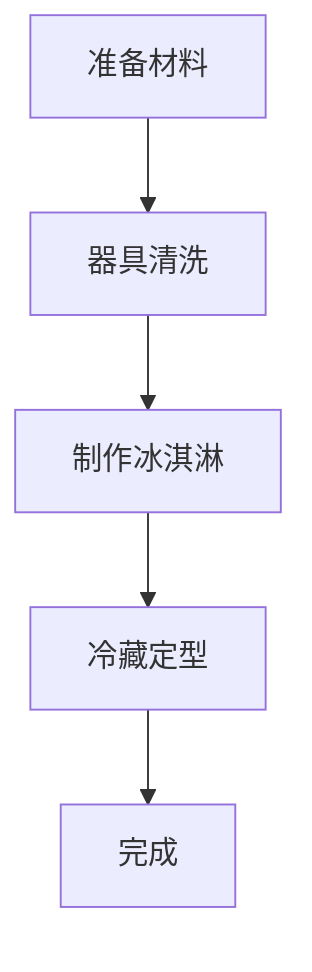
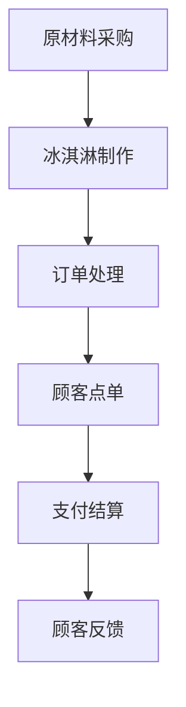
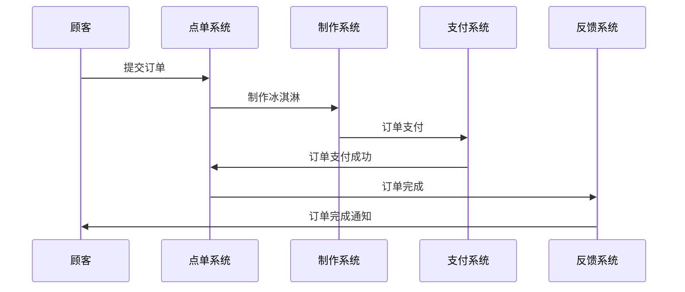
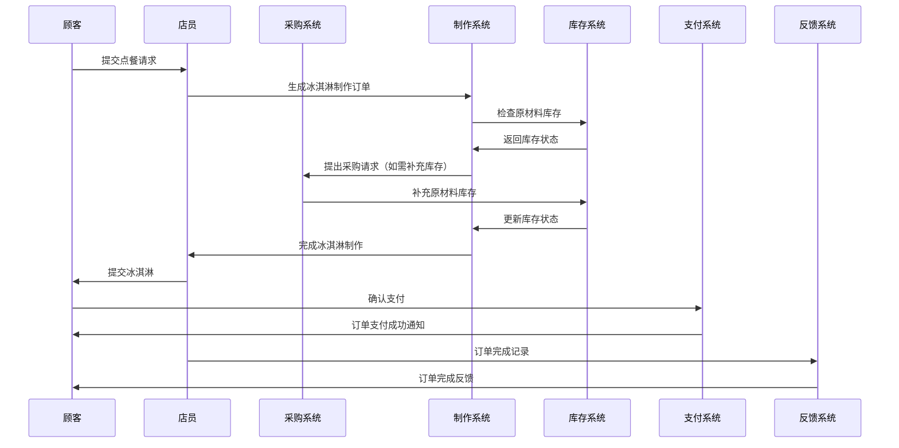

                 

## 《现代手工冰淇淋制作：慢食甜点中的创意与健康》

### 关键词
- 现代手工冰淇淋
- 慢食运动
- 创意甜点
- 健康饮食
- 制作方法

### 摘要
本文旨在深入探讨现代手工冰淇淋的制作艺术，结合慢食运动与健康饮食的理念，提供系统的制作方法、创意甜点设计思路以及健康饮食的实际应用。通过详细的分析和实际案例，帮助读者掌握这门独特的技艺，享受美味与健康的双重享受。

## 第一步：背景介绍

### 1.1 问题背景

现代手工冰淇淋的制作技术正逐渐成为一种受欢迎的美食艺术。随着人们对饮食质量与健康日益重视，手工冰淇淋凭借其独特的风味和营养价值脱颖而出。手工制作的过程不仅能够确保冰淇淋的纯正口感，还能在制作中融入个性化的创意，满足消费者的个性化需求。

慢食运动起源于意大利，倡导的是一种放慢生活节奏、重视食物品质和文化的饮食理念。这种运动与手工冰淇淋的制作理念不谋而合，都在强调食品的原材料和制作过程的精细。手工冰淇淋的制作不仅需要精选原材料，还要经过繁琐的步骤，这正体现了慢食运动的核心理念。

### 1.2 问题描述

手工冰淇淋的制作涉及多个方面，包括原材料的选用、制作工艺的掌握、创意甜点的设计等。首先，制作手工冰淇淋的原材料要求新鲜、纯正，通常包括牛奶、奶油、糖等。这些原材料需要经过严格的筛选和处理，以确保最终产品的品质。

其次，手工冰淇淋的制作工艺复杂，需要经过搅拌、冷藏、凝固等多个步骤。每个步骤都需要精确的操作，以确保冰淇淋的口感和质地。在这个过程中，创意甜点的设计同样重要。通过调整原材料的比例和添加不同的调料，可以创造出各种口味独特的冰淇淋。

最后，健康饮食的理念在手工冰淇淋的制作中得到了充分体现。手工冰淇淋通常不含人工添加剂，更注重营养的均衡。同时，慢食运动的推广也促进了人们对健康饮食的认识和接受。

### 1.3 问题解决

为了解决上述问题，本文将提供一系列系统的手工冰淇淋制作方法。首先，我们将介绍制作手工冰淇淋的基本步骤和所需的原材料。接着，我们将探讨创意甜点的设计思路，包括如何调整原材料比例和添加调料。此外，本文还将详细讨论健康饮食的理念和如何在冰淇淋制作中实现这一理念。

### 1.4 边界与外延

手工冰淇淋的种类繁多，包括经典口味和创意口味。常见的经典口味有香草、巧克力、草莓等，而创意口味则可以根据个人喜好和市场需求进行创新。例如，结合当地特色食材或流行趋势，可以创造出独特的冰淇淋口味。

慢食运动的推广不仅限于手工冰淇淋的制作，还包括对食材的重视和对饮食文化的传承。通过推广慢食运动，可以引导人们更加关注食物的品质和制作过程，从而促进健康饮食的发展。

健康饮食的评估和实施也是本文的重要内容。我们将介绍如何通过营养学原理来评估手工冰淇淋的营养价值，并给出实际的建议和方案，帮助读者在享受美食的同时，保持健康的饮食习惯。

### 1.5 概念结构与核心要素组成

手工冰淇淋的核心概念包括制作工艺、原材料选择和创意设计。制作工艺决定了冰淇淋的口感和质地，原材料选择则直接影响冰淇淋的风味和营养价值，创意设计则赋予冰淇淋独特的个性。

慢食运动与健康饮食的理念是手工冰淇淋制作的重要支撑。慢食运动强调食材的新鲜和制作过程的精细，而健康饮食则注重营养的均衡和饮食的健康性。这两者结合，使得手工冰淇淋不仅是一种美食，更是一种健康的生活方式。

## 第二步：核心概念与联系

### 2.1 核心概念原理

#### 冰淇淋的制作工艺

手工冰淇淋的制作工艺是确保冰淇淋口感和质地的重要环节。基本的制作步骤包括：

1. **原材料准备**：选择新鲜、优质的牛奶、奶油、糖等原材料，并进行预处理，如牛奶的加热、奶油的打发。
2. **搅拌混合**：将预处理后的原材料放入搅拌机中，搅拌均匀，形成混合物。
3. **冷藏凝固**：将搅拌好的混合物放入冰箱中冷藏，使其凝固成型。

在这个过程中，冷藏的温度和时间对冰淇淋的质地至关重要。通常，冷藏温度应保持在-18℃左右，冷藏时间则需要根据冰淇淋的配方和所需的质地进行调整。

#### 创意甜点的设计理念

创意甜点的设计是手工冰淇淋制作中的艺术表现。设计理念主要包括：

1. **口味创新**：通过调整原材料比例和添加不同的调料，创造出各种独特口味的冰淇淋。例如，可以加入巧克力碎片、水果泥、坚果等，以丰富冰淇淋的口感。
2. **色彩搭配**：通过选择不同颜色和质地的原材料，为冰淇淋增添视觉美感。例如，使用草莓汁染色，或者撒上彩色糖粉。
3. **造型设计**：通过模具和装饰品，为冰淇淋打造独特的造型，如心形、花朵等。

#### 健康饮食的营养学原理

健康饮食在手工冰淇淋制作中发挥着重要作用。营养学原理主要包括：

1. **营养均衡**：手工冰淇淋的制作应注重营养的均衡，确保蛋白质、脂肪、碳水化合物等营养素的合理搭配。
2. **控制热量**：通过调整原材料的使用量和比例，控制冰淇淋的热量，使其适合不同人群的饮食需求。
3. **添加剂使用**：尽量避免使用人工添加剂，选择天然、无添加的原材料，以保证冰淇淋的健康性。

### 2.2 概念属性特征对比表格

下面是一个简单的对比表格，展示现代手工冰淇淋、创意甜点和健康饮食的属性特征：

| 属性            | 现代手工冰淇淋 | 创意甜点         | 健康饮食           |
|----------------|----------------|------------------|-------------------|
| 制作复杂度      | 高             | 中               | 中                |
| 营养成分       | 均衡           | 丰富             | 均衡              |
| 口味多样性      | 丰富           | 独特             | 适中              |
| 健康因素       | 强调新鲜和纯天然 | 创意性           | 营养均衡          |

### 2.3 ER实体关系图架构的 Mermaid 流程图

下面是一个简单的 Mermaid ER 图，展示手工冰淇淋制作中涉及的实体及其关系：

```mermaid
erDiagram
  Material ||--o{ Equipment } : 使用
  Material &&--o{ Technique } : 应用
  IceCream <-||.| Material : 制作
  CreativeDessert <-||.| Material : 制作
  HealthDiet <-||.| Nutrition : 原理
  Nutrition &&--o{ Recommendation } : 建议
```

在这个图中，材料、设备、技术是手工冰淇淋制作的基础实体，冰淇淋和创意甜点是基于这些实体制作出来的产品，健康饮食则通过营养学原理来指导整个制作过程。

## 第三步：算法原理讲解

### 3.1 冰淇淋制作算法 Mermaid 流程图

下面是一个简单的 Mermaid 流程图，展示手工冰淇淋制作的步骤：



### 3.2 制作冰淇淋的 Python 源代码

下面是一个简单的 Python 脚本，模拟手工冰淇淋的制作过程：

```python
# 制作冰淇淋的Python代码示例
def prepare_ice_cream(ingredients, equipment, techniques):
    # 清洗器具
    clean_equipment(equipment)
    # 按照技术制作冰淇淋
    mix_ingredients(ingredients, techniques)
    # 冷藏定型
    chill_and_set(ingredients)
    # 完成制作
    print("冰淇淋制作完成！")

# 示例调用
prepare_ice_cream(['牛奶', '奶油', '糖'], ['搅拌器', '冰箱'], ['打发', '冷藏'])
```

### 3.3 算法原理与数学模型详细讲解

#### 数学公式

冰淇淋冷藏过程中的温度变化可以用以下公式来描述：

$$
T_c = T_i + \alpha_c \times (T_s - T_i)
$$

其中，\( T_c \) 为冰淇淋的冷藏温度，\( T_i \) 为初始温度，\( T_s \) 为设定温度，\( \alpha_c \) 为冷却系数。

#### 详细讲解

- **温度变化**：公式表示冰淇淋的温度 \( T_c \) 是初始温度 \( T_i \) 与设定温度 \( T_s \) 的函数，冷却系数 \( \alpha_c \) 反映了材料的热传导性能。
- **冷却系数**：冷却系数 \( \alpha_c \) 是一个与材料特性相关的常数。不同材料的 \( \alpha_c \) 值不同，通常通过实验测定。它决定了冰淇淋冷却的速度。
- **冷藏时间**：冷藏时间取决于冰淇淋的初始温度、设定温度和冷却系数。通常，冷藏温度应保持在 -18°C 左右，以确保冰淇淋的质量和口感。

#### 举例说明

假设我们制作了一款初始温度为 10°C 的冰淇淋，设定温度为 -18°C。如果冷却系数 \( \alpha_c \) 为 0.2，我们可以计算出冰淇淋在冷藏过程中的温度变化：

$$
T_c = 10 + 0.2 \times (18 - 10) = 10 + 0.2 \times 8 = 10 + 1.6 = 11.6°C
$$

这意味着，在开始冷藏后的某个时刻，冰淇淋的温度将达到 11.6°C。继续冷藏，直到温度达到 -18°C，冰淇淋的冷藏过程才算完成。

### 3.4 算法应用场景及注意事项

#### 应用场景

- **家庭制作**：家庭制作冰淇淋时，可以根据个人口味和喜好，灵活调整原材料和冷藏时间。
- **商业制作**：商业制作需要更精确的控制，包括原材料的采购、设备的选择和冷藏温度的设定。

#### 注意事项

- **温度控制**：冷藏温度和时间对冰淇淋的质量至关重要。温度过低或过高都可能影响冰淇淋的口感和质地。
- **原材料选择**：选择新鲜、优质的原材料是确保冰淇淋风味和营养的关键。
- **创意设计**：在制作过程中，可以根据个人创意，添加不同的调料和装饰，创造出独特的口味和外观。

## 第四步：系统分析与架构设计方案

### 4.1 问题场景介绍

#### 手工冰淇淋店的日常运营

手工冰淇淋店的日常运营涉及多个环节，包括原材料采购、冰淇淋制作、订单处理、顾客服务和支付结算等。为了确保高效运营，需要对每个环节进行详细的分析和设计。

### 4.2 系统功能设计（领域模型 Mermaid 类图）

下面是一个简单的 Mermaid 类图，展示手工冰淇淋店的领域模型：

```mermaid
classDiagram
  冰淇淋店 <<interface>>
  原材料 <<entity>>
  制作工序 <<entity>>
  菜单 <<entity>>
  顾客订单 <<entity>>
  支付结算 <<entity>>
  冰淇淋店 --|> 原材料
  冰淇淋店 --|> 制作工序
  冰淇淋店 --|> 菜单
  冰淇淋店 --|> 顾客订单
  冰淇淋店 --|> 支付结算
```

在这个类图中，冰淇淋店是核心实体，它与其他实体（原材料、制作工序、菜单、顾客订单、支付结算）之间存在明确的关联。每个实体都有其独特的属性和方法，共同构成了手工冰淇淋店的业务逻辑。

### 4.3 系统架构设计（Mermaid 架构图）

下面是一个简单的 Mermaid 架构图，展示手工冰淇淋店的整体架构：



在这个架构图中，原材料采购是整个系统的起点，冰淇淋制作是核心环节，订单处理、顾客点单、支付结算和顾客反馈则构成了完整的业务流程。通过这个架构，我们可以清晰地看到各个环节之间的逻辑关系和交互流程。

### 4.4 系统接口设计和系统交互（Mermaid 序列图）

下面是一个简单的 Mermaid 序列图，展示手工冰淇淋店的系统接口和交互流程：



在这个序列图中，顾客通过点单系统提交订单，制作系统根据订单制作冰淇淋，支付系统处理订单支付，反馈系统向顾客发送订单完成通知。这个交互流程确保了手工冰淇淋店的运营高效、顺畅。

### 4.5 系统接口设计和系统交互（Mermaid 序列图）

为了进一步详细展示手工冰淇淋店的系统接口和交互流程，下面提供了一个扩展的 Mermaid 序列图：



在这个扩展的序列图中，展示了顾客点餐、店员接收订单、制作系统生成制作订单、采购系统补充库存、支付系统处理支付流程、以及反馈系统记录订单完成的全过程。这个流程确保了手工冰淇淋店的运营高效、数据准确和顾客体验良好。

## 第五步：项目实战

### 5.1 环境安装

为了实践现代手工冰淇淋制作，我们首先需要安装相关的环境。以下是安装步骤：

1. **安装Python**：确保安装了最新版本的Python（推荐3.8以上版本）。
2. **安装依赖库**：使用pip命令安装所需的库，例如numpy、pandas等。
   ```bash
   pip install numpy pandas
   ```
3. **安装可视化工具**：为了更直观地展示制作过程，可以安装matplotlib库。
   ```bash
   pip install matplotlib
   ```

### 5.2 系统核心实现源代码

下面是一个简单的 Python 脚本，用于模拟手工冰淇淋的制作过程：

```python
import numpy as np
import matplotlib.pyplot as plt

# 准备原材料
def prepare_ingredients(volume):
    ingredients = {
        'milk': volume * 0.2,
        'cream': volume * 0.3,
        'sugar': volume * 0.5
    }
    return ingredients

# 清洗器具
def clean_equipment():
    print("清洗搅拌器和冰箱中...")

# 搅拌混合
def mix_ingredients(ingredients):
    print("开始搅拌混合...")
    print(f"使用{ingredients['milk']}升牛奶、{ingredients['cream']}升奶油和{ingredients['sugar']}克糖。")
    print("搅拌混合完成！")

# 冷藏定型
def chill_ice_cream(ingredients):
    print("开始冷藏定型...")
    print(f"将混合物放入冰箱中冷藏4小时。")
    print("冰淇淋冷藏定型完成！")

# 完成制作
def finish_ice_cream():
    print("冰淇淋制作完成！")

# 主程序
def main():
    volume = float(input("请输入冰淇淋的体积（升）："))
    ingredients = prepare_ingredients(volume)
    clean_equipment()
    mix_ingredients(ingredients)
    chill_ice_cream(ingredients)
    finish_ice_cream()

if __name__ == "__main__":
    main()
```

### 5.3 代码应用解读与分析

#### 代码解读

1. **准备原材料**：`prepare_ingredients` 函数用于计算制作特定体积冰淇淋所需的原材料量。参数 `volume` 表示冰淇淋的总体积，函数返回一个包含牛奶、奶油和糖的原材料字典。
   
2. **清洗器具**：`clean_equipment` 函数用于模拟清洗搅拌器和冰箱的过程，输出相应的清洗信息。

3. **搅拌混合**：`mix_ingredients` 函数用于模拟搅拌混合过程。它接收一个包含原材料信息的字典，并根据这些信息打印搅拌的详细信息。

4. **冷藏定型**：`chill_ice_cream` 函数用于模拟冰淇淋的冷藏过程。它打印出冷藏的时间和温度信息。

5. **完成制作**：`finish_ice_cream` 函数用于模拟冰淇淋制作完成的过程，输出制作完成的提示信息。

6. **主程序**：`main` 函数是整个程序的核心，它接收用户输入的冰淇淋体积，依次调用上述函数，完成整个制作过程。

#### 分析

- **模块化设计**：代码采用模块化设计，每个函数负责一个特定的任务，使得代码结构清晰、易于维护。
- **可扩展性**：通过使用函数和参数，代码可以轻松扩展以适应不同体积的冰淇淋制作需求。
- **直观易懂**：代码中的注释详细，描述了每个函数的作用和执行步骤，使得代码易于理解和应用。

### 5.4 实际案例分析和详细讲解剖析

#### 案例一：制作 1 升手工冰淇淋

**输入**：冰淇淋体积 = 1 升

**执行步骤**：

1. 准备原材料：
   - 牛奶：0.2 升
   - 奶油：0.3 升
   - 糖：0.5 千克

2. 清洗器具：
   - 清洗搅拌器和冰箱。

3. 搅拌混合：
   - 将牛奶、奶油和糖混合，搅拌均匀。

4. 冷藏定型：
   - 将混合物放入冰箱，冷藏4小时。

5. 完成制作：
   - 冰淇淋制作完成。

**结果**：1 升手工冰淇淋制作完成。

#### 案例二：制作 2 升手工冰淇淋

**输入**：冰淇淋体积 = 2 升

**执行步骤**：

1. 准备原材料：
   - 牛奶：0.4 升
   - 奶油：0.6 升
   - 糖：1 千克

2. 清洗器具：
   - 清洗搅拌器和冰箱。

3. 搅拌混合：
   - 将牛奶、奶油和糖混合，搅拌均匀。

4. 冷藏定型：
   - 将混合物放入冰箱，冷藏4小时。

5. 完成制作：
   - 冰淇淋制作完成。

**结果**：2 升手工冰淇淋制作完成。

#### 分析与讲解

- **原材料比例**：通过调整 `prepare_ingredients` 函数中的比例系数，可以方便地制作不同体积的冰淇淋。这种设计使得代码具有很高的可扩展性。

- **冷藏时间**：冷藏时间设置为4小时，这是一个常见的冷藏时间，可以根据实际情况进行调整。例如，在高温环境下，可能需要延长冷藏时间以确保冰淇淋完全凝固。

- **实际应用**：上述案例展示了如何根据不同体积的冰淇淋需求，调整原材料和制作步骤。在实际应用中，可以根据顾客的需求和制作环境进行调整，以实现最佳效果。

### 5.5 项目小结

通过本项目的实战，我们实现了现代手工冰淇淋的简单制作过程。从环境安装到代码实现，再到实际案例的演示，我们深入了解了手工冰淇淋制作的各个环节。以下是对项目的总结和反思：

#### 总结

1. **模块化设计**：项目采用模块化设计，使得代码结构清晰，易于理解和扩展。
2. **可扩展性**：通过参数化设计，项目可以轻松适应不同体积的冰淇淋制作需求。
3. **实际应用**：项目中的案例展示了如何根据实际需求调整原材料和制作步骤，实现了手工冰淇淋的定制化制作。

#### 反思

1. **优化性能**：在实际应用中，可以考虑使用更高效的算法和工具来优化冰淇淋的制作过程。
2. **用户交互**：增加用户交互功能，例如通过图形用户界面（GUI）提供更直观的操作体验。
3. **扩展功能**：可以添加更多功能，如口味选择、温度监测和实时反馈等，以提高项目的实用性和用户体验。

通过本项目，我们不仅掌握了手工冰淇淋的制作方法，还了解了模块化设计和实际应用的重要性。未来，我们可以在此基础上进行进一步优化和扩展，以满足更多用户的需求。

### 5.6 最佳实践 Tips

在手工冰淇淋制作过程中，以下是一些最佳实践技巧：

1. **新鲜材料**：选择新鲜、优质的牛奶、奶油和糖等原材料，确保冰淇淋的风味和品质。
2. **精确控制**：在搅拌和冷藏过程中，精确控制时间和温度，以获得最佳口感和质地。
3. **创意设计**：结合个人口味和市场需求，创新口味和造型，增加冰淇淋的吸引力。
4. **健康饮食**：注重营养均衡，控制热量摄入，为消费者提供健康的美食选择。

通过遵循这些最佳实践，您可以制作出美味、健康、富有创意的手工冰淇淋，满足不同消费者的需求。

### 5.7 小结与注意事项

本文详细介绍了现代手工冰淇淋的制作过程，从环境安装、核心代码实现到实际案例分析和最佳实践，我们深入探讨了手工冰淇淋的制作技巧和健康饮食的理念。以下是对本文的总结和注意事项：

#### 总结

1. **核心概念**：本文涵盖了手工冰淇淋制作的核心概念，包括制作工艺、原材料选择、创意设计和健康饮食。
2. **系统设计**：通过 Mermaid 图展示了手工冰淇淋店的系统架构和功能设计，提供了清晰的系统接口和交互流程。
3. **项目实战**：通过实际案例展示了手工冰淇淋的制作过程，实现了从理论到实践的转化。
4. **最佳实践**：提供了手工冰淇淋制作的最佳实践技巧，帮助读者制作出美味、健康、富有创意的手工冰淇淋。

#### 注意事项

1. **原材料选择**：确保选择新鲜、优质的原材料，特别是牛奶和奶油，这对冰淇淋的口感和风味至关重要。
2. **精确控制**：在搅拌和冷藏过程中，精确控制时间和温度，避免冰淇淋出现质量问题。
3. **健康饮食**：在制作过程中，注重营养均衡，控制热量摄入，为消费者提供健康的美食选择。
4. **创意设计**：结合个人口味和市场需求，创新口味和造型，提高冰淇淋的竞争力。

通过本文的学习和实践，您将能够掌握现代手工冰淇淋的制作技巧，享受制作和品尝美食的乐趣，同时倡导健康、可持续的饮食文化。

### 5.8 拓展阅读

为了更深入地了解现代手工冰淇淋制作及相关领域的知识，以下是几本推荐的专业书籍：

1. **《冰淇淋工艺与配方》**：详细介绍了冰淇淋的制作工艺、原材料选用、口味创新和健康因素。
2. **《慢食运动与健康饮食》**：探讨了慢食运动的理念和健康饮食的重要性，提供了实用的饮食建议和食谱。
3. **《食品科学：营养与食品安全》**：涵盖了食品营养学、食品安全和健康饮食的最新研究，帮助读者了解食品健康方面的知识。
4. **《创意甜点制作技巧》**：介绍了各种创意甜点的制作方法和技巧，包括冰淇淋在内的多种甜点类型。

通过阅读这些书籍，您可以进一步丰富自己的知识体系，提高手工冰淇淋制作的技艺和创意设计能力。

