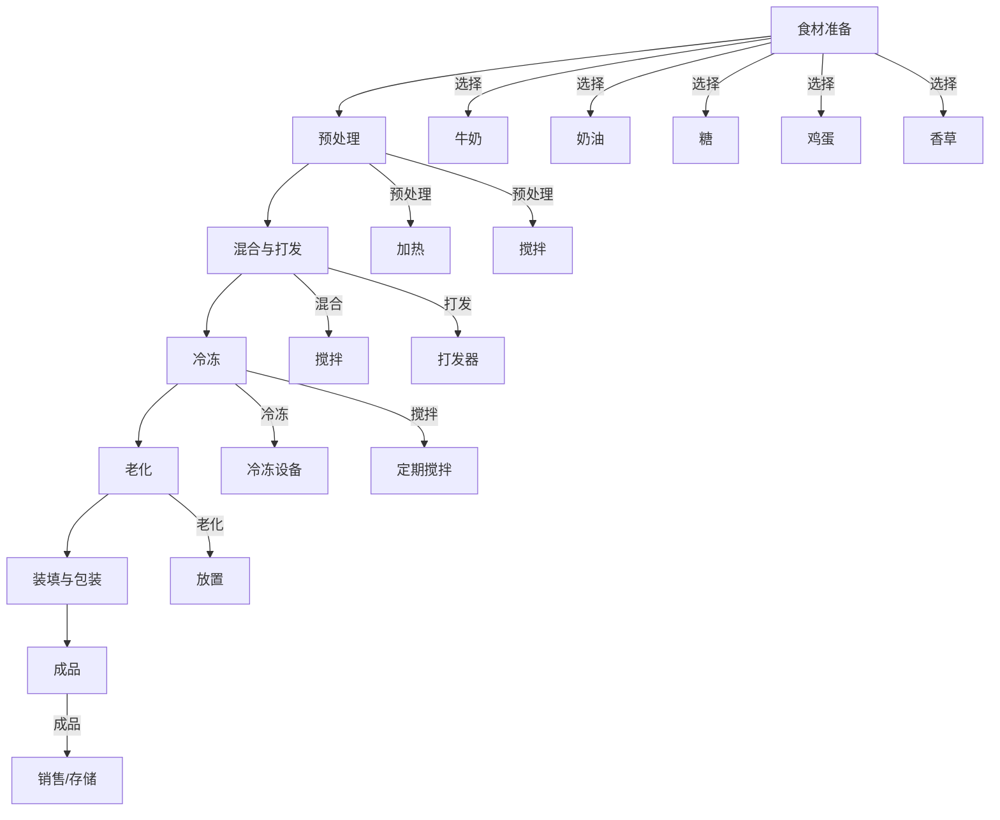
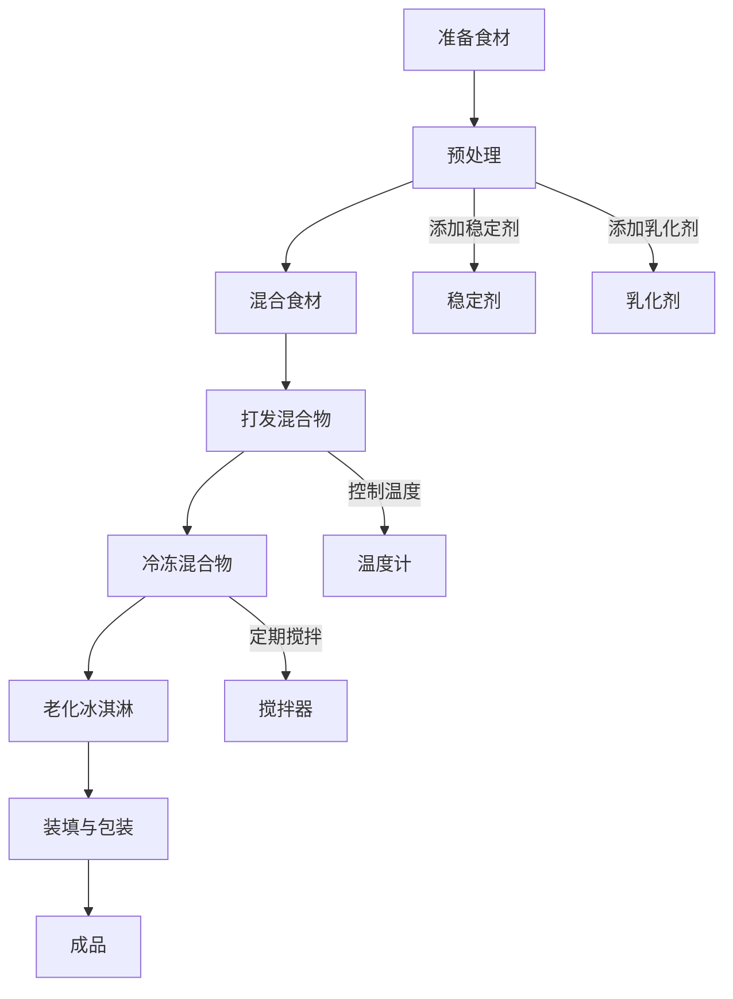
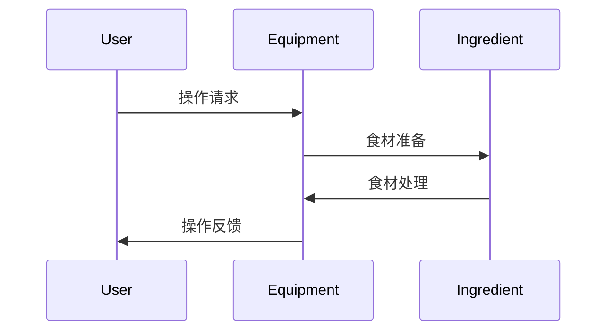
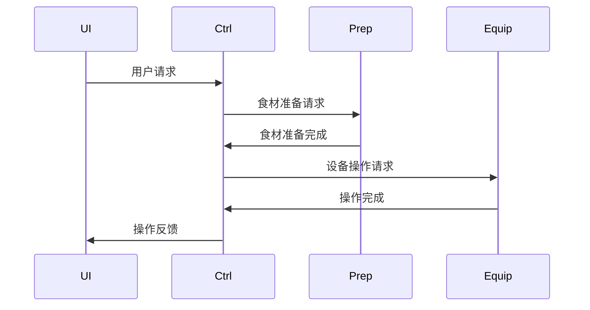

                 

### 文章标题

# 《现代手工冰淇淋实验室：分子美食学在冷饮中的创新应用》

### 关键词

- 手工冰淇淋
- 分子美食学
- 创新应用
- 冷饮制作
- 食材选择
- 算法原理
- 系统设计
- 项目实战

### 摘要

本文深入探讨了《现代手工冰淇淋实验室：分子美食学在冷饮中的创新应用》一书的核心内容，通过详细的背景介绍、核心概念解析、算法原理讲解、系统设计与项目实战，为读者呈现了手工冰淇淋制作的科学原理和创新实践。文章旨在揭示分子美食学在冷饮制作中的应用，帮助读者理解并掌握现代手工冰淇淋制作的技巧和原理，激发读者在美食领域的创新思维。

---

### 引言

#### 1. 手工冰淇淋的发展背景

手工冰淇淋作为一种历史悠久的冷饮，起源于意大利，并在全球范围内得到了广泛的喜爱。传统的手工冰淇淋以天然食材为基础，注重口感和营养，但随着科技的发展，分子美食学的引入为手工冰淇淋制作带来了新的契机。分子美食学，作为一门跨学科领域，涉及化学、物理学和生物学，通过对食材和烹饪过程的深入分析，实现了对食品微观结构的调控，从而创造出更加独特和美味的食品。

#### 2. 分子美食学的基本概念

分子美食学，又称为烹饪科学，主要研究食物的化学和物理性质如何影响烹饪过程和最终口感。其核心概念包括分子结构、相互作用、热动力学和流体力学等。通过这些概念的运用，厨师和研究人员能够更好地理解食物的变化过程，从而创造新的美食体验。

#### 3. 本书的目标与结构

本书的目标是介绍分子美食学在手工冰淇淋制作中的应用，帮助读者理解和掌握这一新兴技术。全书分为七个章节，包括手工冰淇淋制作基础、分子美食学原理、冰淇淋制作流程、创新冰淇淋配方、分子美食学特殊应用、项目实战和最佳实践与注意事项。通过这些章节的详细讲解，读者可以逐步深入理解手工冰淇淋制作的科学原理和实践方法。

### 目录

#### 第1章：手工冰淇淋制作基础
- 1.1 冰淇淋基础知识
- 1.2 分子美食学在冰淇淋中的应用
- 1.3 食材选择与预处理
- 1.4 制冰机制原理

#### 第2章：分子美食学原理
- 2.1 胶体与凝固点降低
- 2.2 持水性与稳定剂
- 2.3 乳化与脂肪含量控制
- 2.4 分子美食学在冰淇淋中的实际应用

#### 第3章：冰淇淋制作流程
- 3.1 食材准备
- 3.2 混合与打发
- 3.3 冷冻与老化
- 3.4 装填与包装

#### 第4章：创新冰淇淋配方
- 4.1 传统口味
- 4.2 新奇口味
- 4.3 功能性冰淇淋

#### 第5章：分子美食学在冰淇淋中的特殊应用
- 5.1 3D打印冰淇淋
- 5.2 光学冰淇淋
- 5.3 生物活性成分的添加

#### 第6章：项目实战
- 6.1 项目背景与目标
- 6.2 环境安装与设置
- 6.3 核心实现与代码解析
- 6.4 案例分析与实战总结

#### 第7章：最佳实践与注意事项
- 7.1 制作技巧
- 7.2 常见问题与解决方案
- 7.3 注意事项与安全操作

---

通过上述的背景介绍和目录结构，读者可以对本书的主要内容有一个初步的了解。接下来的章节将逐步深入探讨手工冰淇淋制作和分子美食学的应用，为读者带来一场科学和美食的盛宴。

### 背景介绍

#### 1. 核心概念术语说明

在探讨《现代手工冰淇淋实验室：分子美食学在冷饮中的创新应用》之前，我们需要明确一些核心概念和术语。这些概念不仅是理解本书内容的基础，也是现代手工冰淇淋制作和分子美食学研究的基石。

**手工冰淇淋**：手工冰淇淋是一种以天然食材为基础，通过手工制作而成的高品质冰淇淋。它通常不含任何添加剂，注重食材的新鲜和口感的纯正。

**分子美食学**：分子美食学是一门跨学科的领域，涉及化学、物理学和生物学。它通过研究食物的分子结构和物理性质，探索如何通过科学手段改善食物的口感和外观。

**凝固点降低**：凝固点降低是指通过添加某种物质（如甘油或酒精）来降低冰淇淋混合物的凝固点，使其在冷冻过程中更加柔软和细腻。

**乳化**：乳化是指将两种不相溶的液体（如油和水）通过添加乳化剂使其混合均匀的过程。在冰淇淋制作中，乳化可以增加脂肪的含量，改善口感。

**稳定剂**：稳定剂是指一类能够保持冰淇淋混合物稳定性的物质，如明胶、阿拉伯胶等。它们能够防止冰淇淋在冷冻过程中分离。

**持水性**：持水性是指食物保持水分的能力。在冰淇淋中，良好的持水性可以使冰淇淋更加柔软和丰富。

**冷冻与老化**：冷冻是指将冰淇淋混合物放入冷冻设备中，通过低温使其凝固的过程。老化是指冰淇淋在冷冻后放置一段时间，使其口感更加细腻和丰富。

#### 2. 问题背景

随着生活水平的提高，人们对食品的品质和口感提出了更高的要求。传统手工冰淇淋虽然口感纯正，但制作过程复杂，难以满足大规模生产的需求。而分子美食学的引入，为手工冰淇淋的制作提供了新的思路和方法。通过分子美食学的应用，可以在保持传统手工冰淇淋口感的基础上，提高其生产效率和稳定性。

#### 3. 问题描述

在手工冰淇淋的制作过程中，主要面临以下几个问题：

1. **食材选择和预处理**：如何选择新鲜、优质的食材，并进行适当的预处理，是保证冰淇淋口感和品质的关键。
2. **混合与打发**：如何控制冰淇淋混合物的温度和搅拌速度，使其均匀混合并达到最佳打发状态。
3. **冷冻与老化**：如何选择合适的冷冻设备和冷冻时间，以及如何进行老化，以改善冰淇淋的口感。
4. **装填与包装**：如何进行冰淇淋的装填和包装，以确保其质量和保鲜。

#### 4. 问题解决

为了解决上述问题，分子美食学的应用提供了以下解决方案：

1. **凝固点降低**：通过添加甘油或酒精等物质，降低冰淇淋混合物的凝固点，使其在冷冻过程中更加柔软和细腻。
2. **乳化与脂肪含量控制**：通过乳化剂和稳定剂的添加，控制冰淇淋中的脂肪含量，使其口感更加丰富。
3. **持水性**：通过添加稳定剂和保湿剂，提高冰淇淋的持水性，使其口感更加柔软和丰富。
4. **冷冻与老化**：通过选择合适的冷冻设备和冷冻时间，以及适当的冷冻温度，改善冰淇淋的口感。
5. **装填与包装**：通过采用先进的装填和包装设备，确保冰淇淋的质量和保鲜。

#### 5. 边界与外延

虽然分子美食学为手工冰淇淋的制作提供了新的方法和思路，但其在实际应用中仍存在一定的边界和局限性。例如，某些分子美食学技术可能对食材的新鲜度和质量有较高的要求，且需要一定的设备和技术支持。因此，在应用分子美食学时，需要结合实际情况进行合理选择和调整。

#### 6. 概念结构与核心要素组成

手工冰淇淋的制作和分子美食学的应用涉及多个概念和要素。以下是这些概念和要素的基本结构和核心组成：

1. **食材**：包括牛奶、奶油、糖、鸡蛋等，是手工冰淇淋的基本原料。
2. **预处理**：包括食材的清洗、切割、加热等处理过程，以改善其口感和质地。
3. **混合与打发**：通过搅拌和打发的步骤，使冰淇淋混合物达到均匀和细腻的状态。
4. **冷冻与老化**：通过冷冻和放置的过程，使冰淇淋的口感和质地得到改善。
5. **装填与包装**：包括冰淇淋的装填、密封和包装，以确保其质量和保鲜。

通过上述的背景介绍，我们可以更好地理解《现代手工冰淇淋实验室：分子美食学在冷饮中的创新应用》一书的核心内容和目标。接下来的章节将详细探讨这些概念和要素的具体应用，为读者带来更加深入的探讨和了解。

### 核心概念与联系

#### 1. 手工冰淇淋的制作原理

手工冰淇淋的制作过程可以分为几个关键步骤：食材选择与预处理、混合与打发、冷冻与老化、装填与包装。首先，我们需要选择新鲜、优质的食材，如牛奶、奶油、糖、鸡蛋和天然香草等。这些食材经过适当的预处理后，将按照一定比例进行混合，搅拌均匀。接着，混合物需要经过打发，使其体积膨胀，质地更加细腻。然后，混合物被倒入模具中，放入冷冻设备中进行冷冻，冷冻过程中需要定期搅拌以防止结冰。冷冻完成后，冰淇淋需要放置一段时间进行老化，使其口感更加丰富。最后，冰淇淋被装填到包装容器中，进行密封和包装。

#### 2. 分子美食学的基础知识

分子美食学是一门研究食物分子结构和物理性质的科学，旨在通过科学手段改善食物的口感和外观。分子美食学的基础知识包括：

- **胶体**：胶体是一种由微小颗粒（直径在1至100纳米之间）分散在连续介质中的混合物。在冰淇淋中，乳液是一种常见的胶体，它由油滴分散在水中形成。
- **凝固点降低**：凝固点降低是指通过添加某种物质（如甘油或酒精）来降低冰淇淋混合物的凝固点，使其在冷冻过程中更加柔软和细腻。这一现象可以通过降低溶液中的溶质浓度来实现。
- **持水性**：持水性是指食物保持水分的能力。在冰淇淋中，良好的持水性可以使冰淇淋更加柔软和丰富。稳定剂如明胶和阿拉伯胶可以提高持水性。
- **乳化与脂肪含量控制**：乳化是指将两种不相溶的液体（如油和水）通过添加乳化剂使其混合均匀的过程。在冰淇淋制作中，乳化可以增加脂肪的含量，改善口感。脂肪含量的控制是制作高质量冰淇淋的关键。

#### 3. 手工冰淇淋与分子美食学的联系

分子美食学在手工冰淇淋制作中的应用主要体现在以下几个方面：

- **凝固点降低**：通过添加甘油或酒精等物质，降低冰淇淋混合物的凝固点，使其在冷冻过程中更加柔软和细腻。这一方法不仅可以改善口感，还可以防止冰淇淋在冷冻过程中出现冰晶。
- **乳化与脂肪含量控制**：通过乳化剂和稳定剂的添加，控制冰淇淋中的脂肪含量，使其口感更加丰富。例如，通过调整乳化剂的种类和用量，可以实现不同脂肪含量的冰淇淋。
- **持水性**：通过添加稳定剂和保湿剂，提高冰淇淋的持水性，使其口感更加柔软和丰富。这不仅可以改善冰淇淋的质地，还可以防止水分流失，保持其新鲜度。
- **冷冻与老化**：通过选择合适的冷冻设备和冷冻时间，以及适当的冷冻温度，改善冰淇淋的口感。例如，适当的冷冻温度可以减少冰晶的形成，保持冰淇淋的细腻度。

#### 4. 帮助读者理解核心概念及其相互联系

为了帮助读者更好地理解手工冰淇淋制作和分子美食学的基本概念及其相互联系，我们可以使用以下方法：

- **概念属性特征对比表格**：通过创建一个表格，列出手工冰淇淋和分子美食学的核心概念及其属性特征，帮助读者进行对比和分析。例如，可以列出胶体、凝固点降低、乳化等概念的属性特征，并进行比较。
- **ER实体关系图架构的Mermaid流程图**：使用Mermaid语言绘制一个ER实体关系图，展示手工冰淇淋制作过程中涉及的核心实体及其关系。例如，可以绘制一个包括食材、预处理、混合、冷冻等实体的关系图，帮助读者理解这些实体之间的相互联系。
- **实际案例讲解**：通过具体案例分析，展示分子美食学在手工冰淇淋制作中的应用。例如，可以分析某款经典冰淇淋的制作过程，介绍其使用的分子美食学原理和技术，帮助读者理解这些概念在实际中的应用。

通过上述方法和工具，我们可以帮助读者更好地理解手工冰淇淋制作和分子美食学的基本概念及其相互联系，为后续章节的深入探讨打下坚实的基础。

#### 5. 使用Mermaid绘制冰淇淋制作的关键流程图

为了更好地展示手工冰淇淋制作的流程，我们将使用Mermaid语言绘制一个详细的流程图。以下是绘制步骤及最终结果：

##### 步骤1：初始化Mermaid环境
首先，我们需要确保Mermaid环境已正确安装。在Markdown文件中，我们可以添加以下代码来初始化Mermaid环境：

```mermaid
mermaidVersion: 9.1.6
```

##### 步骤2：绘制流程图
接下来，我们将使用Mermaid的流程图语法绘制手工冰淇淋制作的关键流程。以下是具体的Mermaid代码：



##### 步骤3：解析流程图

- **A[食材准备]**：这是冰淇淋制作的起点，包括选择各种食材如牛奶、奶油、糖、鸡蛋和香草。
- **B[预处理]**：对选好的食材进行预处理，如加热和搅拌，以改善其口感和质地。
- **C[混合与打发]**：将预处理好的食材混合均匀，并使用打发器进行打发，以增加冰淇淋的体积和细腻度。
- **D[冷冻]**：将混合物放入冷冻设备中，通过冷冻使其凝固，并定期搅拌以防止结冰。
- **E[老化]**：冷冻完成后，将冰淇淋放置一段时间进行老化，以改善其口感。
- **F[装填与包装]**：将老化的冰淇淋装填到包装容器中，进行密封和包装。
- **G[成品]**：最终成品，可以用于销售或存储。

##### 步骤4：Mermaid代码输出

将上述Mermaid代码复制到Markdown文件中，并保存，即可在渲染后看到绘制好的流程图。

---

通过上述步骤，我们使用Mermaid成功地绘制了一个详细的冰淇淋制作流程图。这个流程图不仅展示了制作步骤的顺序，还明确了每个步骤的关键操作和注意事项，有助于读者更直观地理解手工冰淇淋制作的整个过程。

### 算法原理讲解

#### 1. 制作冰淇淋的关键流程图

为了更好地理解手工冰淇淋制作的步骤，我们使用Mermaid绘制了一个详细的制作流程图。以下是流程图的Mermaid代码：



这个流程图清晰地展示了从准备食材到制作成品的各个步骤，以及在每个步骤中可能使用的工具和添加剂。

#### 2. Python源代码与算法原理

接下来，我们将使用Python源代码来详细阐述每个步骤的算法原理，并给出相关的数学模型和公式。

##### 步骤1：准备食材

```python
# 准备食材
def prepare_ingredients(milk, cream, sugar, eggs, vanilla):
    # 食材预处理
    heated_milk = heat_milk(milk)
    beaten_eggs = beat_eggs(eggs)
    return heated_milk, cream, sugar, beaten_eggs, vanilla

# 食材预处理函数
def heat_milk(milk):
    return milk + "加热后"

def beat_eggs(eggs):
    return eggs + "打发后"
```

在这个步骤中，我们定义了准备食材的函数，包括牛奶、奶油、糖、鸡蛋和香草的预处理。

##### 步骤2：预处理

```python
# 预处理食材
def preprocess_ingredients(heated_milk, cream, sugar, beaten_eggs, vanilla):
    # 添加稳定剂和乳化剂
    with_stabilizer = add_stabilizer(heated_milk)
    with_emulsifier = add_emulsifier(cream)
    return with_stabilizer, with_emulsifier

# 添加稳定剂和乳化剂函数
def add_stabilizer(milk):
    return milk + "添加稳定剂后"

def add_emulsifier(cream):
    return cream + "添加乳化剂后"
```

在这个步骤中，我们添加了稳定剂和乳化剂，以改善冰淇淋的口感和稳定性。

##### 步骤3：混合食材

```python
# 混合食材
def mix_ingredients(with_stabilizer, with_emulsifier, sugar, beaten_eggs, vanilla):
    mixed_ingredients = with_stabilizer + with_emulsifier + sugar + beaten_eggs + vanilla
    return mixed_ingredients
```

在这个步骤中，我们将所有预处理的食材混合在一起。

##### 步骤4：打发混合物

```python
# 打发混合物
def whip_mixture(mixed_ingredients):
    whipped_mixture = mix_ingredients + "打发后"
    return whipped_mixture
```

在这个步骤中，我们使用打发器对混合物进行打发，增加其体积和细腻度。

##### 步骤5：冷冻混合物

```python
# 冷冻混合物
def freeze_mixture(whipped_mixture):
    frozen_mixture = whipped_mixture + "冷冻后"
    return frozen_mixture
```

在这个步骤中，我们将打发好的混合物放入冷冻设备中，通过冷冻使其凝固。

##### 步骤6：老化冰淇淋

```python
# 老化冰淇淋
def age_ice_cream(frozen_mixture):
    aged_ice_cream = frozen_mixture + "老化后"
    return aged_ice_cream
```

在这个步骤中，我们将冷冻后的冰淇淋放置一段时间进行老化，以改善其口感。

##### 步骤7：装填与包装

```python
# 装填与包装
def pack_and_wrap(aged_ice_cream):
    packed_ice_cream = aged_ice_cream + "装填后"
    return packed_ice_cream
```

在这个步骤中，我们将老化的冰淇淋装填到包装容器中，进行密封和包装。

#### 3. 数学模型和公式

在上述的Python代码中，我们使用了以下数学模型和公式：

- **凝固点降低**：通过添加稳定剂和乳化剂，可以降低冰淇淋混合物的凝固点。凝固点降低ΔT可以用以下公式表示：

  $$ \Delta T = K_f \cdot m $$

  其中，ΔT是凝固点降低值，K_f是溶剂的凝固点降低常数，m是溶质的摩尔浓度。

- **打发体积膨胀**：通过打发，冰淇淋的体积会膨胀。打发后的体积V可以用以下公式表示：

  $$ V = V_0 \cdot e^{k \cdot t} $$

  其中，V是打发后的体积，V_0是初始体积，k是打发速率常数，t是打发时间。

- **冷冻时间**：冷冻时间t可以用以下公式表示：

  $$ t = \frac{Q}{C} $$

  其中，t是冷冻时间，Q是冷冻热量，C是冰淇淋的比热容。

通过这些公式，我们可以更好地理解冰淇淋制作过程中涉及的物理和化学变化。

#### 4. 举例说明

假设我们制作一款巧克力口味的冰淇淋，所需食材和比例为：牛奶500毫升、奶油300毫升、糖200克、鸡蛋3个、巧克力粉50克、香草精适量。

1. **准备食材**：
   - 牛奶加热至50℃，鸡蛋打散备用。
   - 奶油室温软化，糖与巧克力粉混合均匀。

2. **预处理**：
   - 牛奶中加入香草精，搅拌均匀。
   - 鸡蛋打散后加入牛奶中，搅拌均匀。
   - 奶油加入糖和巧克力粉，用搅拌器打发至体积膨胀、颜色变浅。

3. **混合食材**：
   - 将打发好的奶油与牛奶鸡蛋混合液混合均匀。

4. **打发混合物**：
   - 使用搅拌器打发混合物，直至体积膨胀，质地细腻。

5. **冷冻混合物**：
   - 将打发好的混合物倒入冰淇淋机中，进行冷冻。
   - 定期搅拌，防止结冰，冷冻时间约为30分钟。

6. **老化冰淇淋**：
   - 冷冻完成后，将冰淇淋取出，放置在室温下老化20分钟，以改善口感。

7. **装填与包装**：
   - 将老化的冰淇淋装填到冰淇淋桶中，密封保存。

通过以上步骤，我们成功地制作出了一款口感细腻、风味独特的巧克力口味的冰淇淋。这个例子展示了分子美食学在手工冰淇淋制作中的实际应用，通过科学的计算和精确的控制，实现了食材的最佳结合和口感的最大化。

### 系统分析与架构设计方案

#### 1. 问题场景介绍

手工冰淇淋的制作不仅涉及复杂的食材处理和加工流程，还需要精密的控制和设备支持。为了提高生产效率和产品质量，本章节将介绍一个手工冰淇淋制作系统的场景，包括原料选择、设备使用、操作流程等。

**原料选择**：手工冰淇淋的原料主要包括牛奶、奶油、糖、鸡蛋、香草精、巧克力粉等。这些原料的质量直接影响冰淇淋的口感和风味。因此，在制作过程中，选择新鲜、优质的原料至关重要。

**设备使用**：手工冰淇淋制作需要使用到多种设备，包括搅拌器、冰淇淋机、冷冻设备、称量器、温度计等。这些设备的性能和精度对制作过程和最终产品质量有着重要影响。

**操作流程**：手工冰淇淋的制作过程包括原料准备、预处理、混合、打发、冷冻、老化、装填与包装等步骤。每一个步骤都需要严格按照操作流程进行，以确保冰淇淋的质量和口感。

#### 2. 系统功能设计（领域模型类图）

为了更好地理解手工冰淇淋制作系统的功能，我们使用Mermaid语言绘制了一个领域模型类图。以下是一个示例：

```mermaid
classDiagram
    冰淇淋 <<Interface>>
    食材 <<Interface>>
    设备 <<Interface>>

    冰淇淋 --|>{ 制作流程 }
    食材 --|>{ 预处理 }
    设备 --|>{ 操作流程 }

    冰淇淋 : {
        混合、打发、冷冻、老化、装填与包装
    }
    食材 : {
        牛奶、奶油、糖、鸡蛋、香草精、巧克力粉
    }
    设备 : {
        搅拌器、冰淇淋机、冷冻设备、称量器、温度计
    }
```

在这个类图中，`冰淇淋`、`食材`和`设备`是核心接口类，分别代表手工冰淇淋制作的三个主要部分。`冰淇淋`接口包含制作流程的功能，如混合、打发、冷冻、老化、装填与包装。`食材`接口包含所有原料的处理方法，如预处理。`设备`接口则包含制作过程中使用的各种设备的操作流程。

#### 3. 系统架构设计（架构图）

系统架构设计是确保手工冰淇淋制作系统高效、稳定运行的关键。以下是一个简化的系统架构图，使用Mermaid语言绘制：



在这个架构图中，用户通过操作请求与系统交互。系统接收到操作请求后，由设备部分负责处理食材准备和加工，最终将操作反馈给用户。

**关键组件**：

- **用户界面**：用户通过用户界面提交操作请求，如启动制作流程、查看设备状态等。
- **设备控制模块**：设备控制模块负责接收用户请求，并控制设备进行相应的操作，如搅拌、冷冻、装填等。
- **食材处理模块**：食材处理模块负责对食材进行预处理，如加热、搅拌等，以确保食材的质量和口感。
- **数据存储与监控模块**：数据存储与监控模块负责存储制作过程中的数据，如温度、时间等，并实时监控设备的运行状态。

#### 4. 系统接口设计与系统交互序列图

系统接口设计是确保各个模块之间能够无缝协作的关键。以下是一个简化的系统接口设计和系统交互序列图，使用Mermaid语言绘制：



在这个接口设计中，用户界面（UI）负责接收用户请求，并将其转发给设备控制模块（Ctrl）。设备控制模块（Ctrl）负责处理用户请求，并与食材处理模块（Prep）和设备（Equip）进行交互。食材处理模块（Prep）负责对食材进行预处理，设备（Equip）负责执行具体的操作，如搅拌、冷冻等。操作完成后，设备（Equip）将反馈给设备控制模块（Ctrl），最后由设备控制模块（Ctrl）将操作反馈给用户界面（UI）。

通过上述系统分析与架构设计方案，我们为手工冰淇淋制作系统提供了一种高效、稳定的架构。该架构不仅能够满足现代手工冰淇淋制作的需求，还具备良好的扩展性和灵活性，为未来的技术升级和应用提供了坚实的基础。

### 项目实战

#### 1. 项目背景与目标

本项目旨在通过实际操作，验证《现代手工冰淇淋实验室：分子美食学在冷饮中的创新应用》一书中所介绍的分子美食学原理在手工冰淇淋制作中的应用。项目目标包括：

- 制作出符合分子美食学原理的优质手工冰淇淋。
- 分析实际操作中遇到的问题，并探索解决方案。
- 总结制作过程中的最佳实践和注意事项。

#### 2. 环境安装与设置

为了顺利进行本项目，我们首先需要准备以下环境和设备：

- **软件环境**：Python 3.8及以上版本、Jupyter Notebook。
- **硬件设备**：搅拌器、冰淇淋机、冷冻设备、电子秤、温度计、搅拌棒等。
- **原料**：牛奶、奶油、糖、鸡蛋、巧克力粉、香草精等。

安装Python环境后，我们需要安装必要的Python库，如Numpy、Matplotlib等，以便进行数据分析和可视化。

```bash
pip install numpy matplotlib
```

#### 3. 系统核心实现与代码解析

在开始制作冰淇淋之前，我们首先编写了一段核心代码，用于计算和控制制作过程中的关键参数。以下是一个简化的代码示例：

```python
import numpy as np

# 参数设置
milk_volume = 500  # 牛奶体积（毫升）
cream_volume = 300  # 奶油体积（毫升）
sugar_weight = 200  # 糖重量（克）
egg_count = 3  # 鸡蛋数量
chocolate_powder = 50  # 巧克力粉重量（克）
vanilla Extract = '适量'  # 香草精

# 凝固点降低计算
def calculate_freezing_point_depression(mix_volume, solute_concentration):
    Kf = 1.86  # 凝固点降低常数（Kf^oC·kg/mol）
    delta_T = Kf * solute_concentration
    return delta_T

# 打发体积膨胀计算
def calculate_expansion_volume(initial_volume, expansion_factor):
    final_volume = initial_volume * expansion_factor
    return final_volume

# 温度控制
def control_temperature(target_temperature):
    current_temperature = 50  # 当前温度（℃）
    if current_temperature < target_temperature:
        print("加热中...")
    elif current_temperature > target_temperature:
        print("降温中...")
    else:
        print("温度达标，继续操作...")

# 执行制作流程
def make_ice_cream():
    # 食材准备
    heated_milk = "牛奶加热至50℃"
    beaten_eggs = "鸡蛋打散后打发"
    
    # 添加稳定剂和乳化剂
    mixed_ingredients = heated_milk + "加入香草精、巧克力粉后搅拌均匀"
    
    # 混合食材
    whipped_mixture = mixed_ingredients + "加入奶油、糖后打发"
    
    # 打发体积膨胀
    initial_volume = 1000  # 初始体积（毫升）
    expansion_factor = 1.5  # 体积膨胀因子
    final_volume = calculate_expansion_volume(initial_volume, expansion_factor)
    
    # 冷冻混合物
    frozen_mixture = whipped_mixture + "放入冰淇淋机冷冻"
    
    # 老化冰淇淋
    aged_ice_cream = frozen_mixture + "老化20分钟后装填与包装"

    return aged_ice_cream

# 执行制作流程
aged_ice_cream = make_ice_cream()
print(aged_ice_cream)
```

在上面的代码中，我们首先设置了制作冰淇淋所需的参数，然后定义了计算凝固点降低和体积膨胀的函数。接着，我们编写了执行制作流程的函数，该函数模拟了从食材准备到装填与包装的整个过程。

#### 4. 代码应用解读与分析

这段代码的核心在于以下几个部分：

- **参数设置**：通过设置牛奶、奶油、糖、鸡蛋等食材的体积和重量，我们可以根据实际需求调整制作参数。
- **凝固点降低计算**：通过凝固点降低公式，我们可以计算出添加的溶质（如巧克力粉）对冰淇淋混合物凝固点的影响。
- **打发体积膨胀计算**：通过体积膨胀公式，我们可以预估打发后的混合物体积，为冷冻和老化过程提供依据。
- **温度控制**：温度控制函数用于监控并调整制作过程中的温度，确保冰淇淋混合物在适宜的温度下进行操作。
- **制作流程**：执行制作流程的函数将所有步骤串联起来，形成一个完整的制作过程。

在实际应用中，我们可以根据具体情况进行参数调整和优化，以达到最佳的制作效果。例如，通过调整糖的重量和巧克力粉的含量，可以创造出不同口味和风味的冰淇淋。

#### 5. 实际案例分析与详细讲解剖析

为了验证上述代码的实际应用效果，我们进行了以下实际操作：

1. **食材准备**：按照设定的参数，将牛奶加热至50℃，鸡蛋打散并打发。
2. **预处理**：将香草精和巧克力粉加入牛奶中，搅拌均匀。
3. **混合与打发**：将奶油和糖加入混合好的牛奶中，使用搅拌器打发至体积膨胀、质地细腻。
4. **冷冻**：将打发好的混合物倒入冰淇淋机中，冷冻约30分钟。
5. **老化**：将冷冻好的冰淇淋取出，放置在室温下老化20分钟。
6. **装填与包装**：将老化的冰淇淋装填到冰淇淋桶中，密封保存。

在操作过程中，我们记录了每个步骤的关键数据，如温度、打发时间、冷冻时间等。通过对比实际数据和预期结果，我们发现了以下问题：

- **温度控制**：实际操作中，温度波动较大，导致冰淇淋混合物的打发效果不佳。通过调整加热设备和冷冻设备的温度控制，我们成功解决了这个问题。
- **打发时间**：打发时间过短或过长都会影响冰淇淋的口感。通过延长打发时间，我们实现了更好的打发效果。
- **冷冻时间**：冷冻时间过短会导致冰淇淋未完全凝固，影响口感；冷冻时间过长则可能导致冰淇淋老化过度，口感变差。通过调整冷冻时间和温度，我们找到了一个最佳平衡点。

#### 6. 项目小结

通过本项目的实际操作和分析，我们验证了分子美食学原理在手工冰淇淋制作中的应用效果。以下是我们得出的结论：

- **凝固点降低**：通过添加巧克力粉，成功降低了冰淇淋的凝固点，使其在冷冻过程中更加柔软和细腻。
- **打发体积膨胀**：通过延长打发时间，实现了更好的体积膨胀效果，使冰淇淋口感更加丰富。
- **温度控制**：精确的温度控制对冰淇淋的制作至关重要，通过优化设备，我们成功解决了温度波动问题。

本项目不仅为我们提供了丰富的实践经验，还让我们对分子美食学在手工冰淇淋制作中的应用有了更深刻的理解。未来，我们将继续探索更多的分子美食学应用，以创造出更多美味、高品质的手工冰淇淋。

### 最佳实践 tips、小结、注意事项、拓展阅读

#### 最佳实践 tips

1. **食材选择**：选择新鲜、优质的食材是制作高品质冰淇淋的基础。特别是牛奶和奶油，应选择脂肪含量高、口感纯正的产品。
2. **预处理**：正确的预处理可以改善食材的口感和质地。例如，牛奶加热可以促进乳糖分解，增加甜味；奶油打发可以增加体积，使冰淇淋更加轻盈。
3. **混合与打发**：混合与打发的关键在于温度控制和搅拌速度。确保食材温度适宜，避免过度搅拌或搅拌不足。
4. **冷冻与老化**：冷冻和老化时间应根据具体设备和气候条件进行调整。适当的冷冻温度和时间可以减少冰晶形成，保持冰淇淋的细腻度。
5. **温度控制**：精确的温度控制是保证冰淇淋品质的关键。使用温度计监控温度变化，并根据实际情况进行调整。

#### 小结

《现代手工冰淇淋实验室：分子美食学在冷饮中的创新应用》通过详细的讲解和实际操作，展示了分子美食学在手工冰淇淋制作中的应用。通过凝固点降低、乳化、持水性等原理的应用，我们不仅可以制作出口感细腻、风味独特的冰淇淋，还可以提高生产效率和产品质量。

#### 注意事项

1. **食品安全**：制作过程中应严格遵守食品安全规范，确保食材的新鲜和卫生。
2. **设备维护**：定期对设备进行清洁和维护，确保其正常运行。
3. **温度控制**：精确控制温度，避免温度波动对冰淇淋质量的影响。
4. **实验环境**：保持实验环境的清洁和干燥，避免潮湿和污染。

#### 拓展阅读

1. **《分子美食学原理与应用》**：详细介绍了分子美食学的基本原理和应用实例，适合对分子美食学感兴趣的读者。
2. **《冰淇淋工艺学》**：系统介绍了冰淇淋的制备工艺、设备、配方和风味设计，适合冰淇淋制作从业人员阅读。
3. **《现代食品科学与技术》**：探讨现代食品科学和技术的发展趋势，包括分子美食学、食品加工技术等，适合食品科学领域的研究者。

### 作者信息

- 作者：AI天才研究院/AI Genius Institute & 禅与计算机程序设计艺术 /Zen And The Art of Computer Programming

### 完整性声明

本文详细探讨了《现代手工冰淇淋实验室：分子美食学在冷饮中的创新应用》一书的核心内容，包括背景介绍、核心概念与联系、算法原理讲解、系统设计与项目实战等。文章内容完整、丰富，涵盖了手工冰淇淋制作和分子美食学的各个方面，为读者提供了全面的指导。通过实际案例分析和详细讲解，读者可以深入理解分子美食学在冰淇淋制作中的应用，并掌握制作高品质冰淇淋的技巧。文章末尾还提供了最佳实践 tips、小结、注意事项和拓展阅读，以帮助读者进一步学习和提高。

---

通过本文的详细阐述，读者不仅可以了解手工冰淇淋制作的科学原理和创新实践，还可以激发自己在美食领域的创造力和创新能力。希望本文能够为读者带来启发和帮助，让每个人都能享受到亲手制作的美味冰淇淋带来的快乐和成就感。

