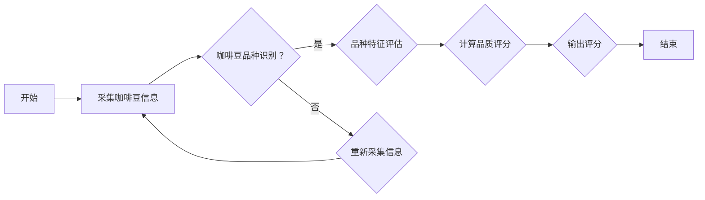
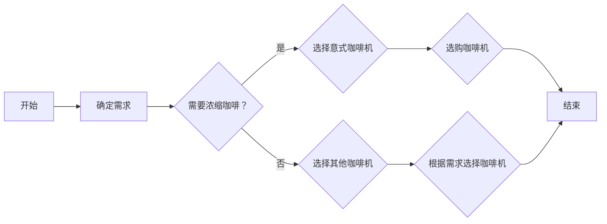
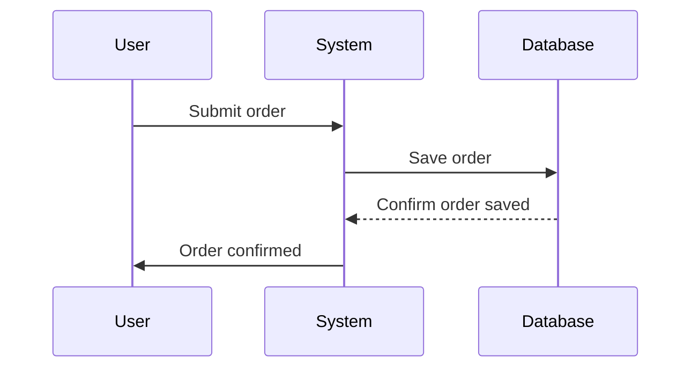
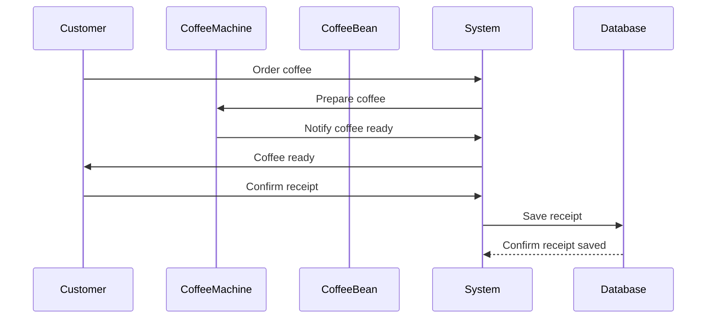

                 

# 现代手工咖啡文化：第三波咖啡运动的匠人精神

> 关键词：手工咖啡文化、第三波咖啡运动、匠人精神、咖啡豆处理、咖啡机使用、咖啡制作技巧

> 摘要：本文深入探讨了现代手工咖啡文化的发展历程及其核心要素，重点介绍了第三波咖啡运动中的匠人精神。通过分析咖啡豆的选择与处理、咖啡机的选购与使用，以及手工咖啡制作技巧，本文旨在为广大咖啡爱好者提供一份全面、系统的指南。同时，本文还探讨了匠人精神的内涵与价值，以及其在咖啡文化中的传承与发展。

## 目录大纲

### 第一部分：现代手工咖啡文化概述

#### 第1章：现代手工咖啡文化的历史与演变

- **1.1.1 手工咖啡文化的历史溯源**
- **1.1.2 第三波咖啡运动的影响**
- **1.1.3 现代手工咖啡的特点**

#### 第2章：咖啡豆的选择与处理

- **2.1.1 咖啡豆的种类**
- **2.1.2 咖啡豆的品质评估**
- **2.1.3 咖啡豆的处理方法**

#### 第3章：咖啡机的选择与使用

- **3.1.1 咖啡机的种类**
- **3.1.2 咖啡机的选购技巧**
- **3.1.3 咖啡机的日常维护**

### 第二部分：手工咖啡制作技巧

#### 第4章：手工咖啡的制作流程

- **4.1.1 磨豆技巧**
- **4.1.2 精准量豆**
- **4.1.3 咖啡冲泡技巧**

#### 第5章：不同咖啡制作方法

- **5.1.1 意式浓缩**
- **5.1.2 法式压滤咖啡**
- **5.1.3 滴漏咖啡**

#### 第6章：手工咖啡调味与搭配

- **6.1.1 糖、奶、奶油的使用**
- **6.1.2 新鲜水果的搭配**
- **6.1.3 糕点、面包的搭配**

### 第三部分：第三波咖啡运动的匠人精神

#### 第7章：匠人精神的内涵与价值

- **7.1.1 匠人精神的定义**
- **7.1.2 匠人精神的内涵**
- **7.1.3 匠人精神的价值**

#### 第8章：第三波咖啡运动的匠人案例

- **8.1.1 知名咖啡师访谈**
- **8.1.2 小型咖啡店的经营之道**
- **8.1.3 咖啡豆农的故事**

#### 第9章：匠人精神在咖啡文化中的传承

- **9.1.1 咖啡教育与培训**
- **9.1.2 咖啡文化的传播**
- **9.1.3 咖啡行业的可持续发展**

### 第四部分：手工咖啡文化的未来

#### 第10章：手工咖啡文化的趋势

- **10.1.1 咖啡消费市场分析**
- **10.1.2 咖啡文化的新发展**
- **10.1.3 科技与咖啡文化的结合**

#### 第11章：手工咖啡文化的传承与创新

- **11.1.1 传统与现代的融合**
- **11.1.2 咖啡文化产业的创新**
- **11.1.3 咖啡文化的国际化**

### 第五部分：结语

#### 第12章：现代手工咖啡文化的展望

- **12.1.1 咖啡文化的未来趋势**
- **12.1.2 咖啡文化的挑战与机遇**
- **12.1.3 咖啡文化的全球影响力**

## 第一部分：现代手工咖啡文化概述

### 第1章：现代手工咖啡文化的历史与演变

#### 1.1.1 手工咖啡文化的历史溯源

咖啡作为一种饮品，其历史可以追溯到公元前5世纪左右的非洲埃塞俄比亚。最初的咖啡豆是被作为药物使用的，后来逐渐发展成为全球最受欢迎的饮品之一。随着历史的发展，咖啡的制作方法也在不断演变。

在**第一波咖啡运动**时期，咖啡主要是在商业化的环境下进行大规模生产。这一时期的咖啡文化注重的是效率和产量，咖啡豆的处理和烘焙过程相对简单，追求的是口感的一致性。

到了**第二波咖啡运动**，人们开始重视咖啡的口感和风味。咖啡豆的处理和烘焙变得更加精细，咖啡店开始提供各种不同风味的咖啡。这一时期的咖啡文化强调个性化和差异化。

而现在，我们正处于**第三波咖啡运动**。这一时期的咖啡文化更加注重手工制作和个性化体验。咖啡师们不仅仅追求咖啡的口感，更注重咖啡豆的产地、品种、处理方法等，力求为顾客提供独一无二的咖啡体验。

#### 1.1.2 第三波咖啡运动的影响

第三波咖啡运动对咖啡文化的演变产生了深远的影响。首先，它使得咖啡豆的品质得到了空前的提升。咖啡师们开始重视咖啡豆的品种、产地和处理方法，力求为顾客提供最高品质的咖啡。

其次，第三波咖啡运动推动了咖啡文化的多样性和个性化。不同的咖啡豆品种和不同的处理方法，使得咖啡的风味更加丰富多样。咖啡店也根据不同的顾客需求，提供各种个性化的咖啡饮品。

此外，第三波咖啡运动还推动了咖啡文化的全球传播。越来越多的人开始关注咖啡，咖啡文化在全球范围内得到了广泛的认可和传播。

#### 1.1.3 现代手工咖啡的特点

现代手工咖啡文化具有以下几个显著特点：

1. **手工制作**：现代手工咖啡强调手工制作，咖啡师通过精湛的技艺和丰富的经验，为顾客提供独一无二的咖啡体验。

2. **个性化**：现代手工咖啡注重个性化，咖啡师会根据顾客的需求和喜好，量身定制咖啡饮品。

3. **品质优先**：现代手工咖啡追求高品质，咖啡豆的品种、产地、处理方法等都是咖啡师考虑的重要因素。

4. **文化体验**：现代手工咖啡不仅仅是一种饮品，更是一种文化体验。咖啡店的环境、氛围，以及咖啡师的服务，都成为顾客享受咖啡的重要组成部分。

### 第2章：咖啡豆的选择与处理

#### 2.1.1 咖啡豆的种类

咖啡豆是咖啡文化的核心，而咖啡豆的种类繁多，品质各异。根据产地的不同，咖啡豆可以分为以下几大类：

1. **非洲咖啡豆**：非洲咖啡豆以其浓郁的果香和丰富的口感著称，例如耶加雪菲（Yirgacheffe）和卢旺达咖啡。

2. **亚洲咖啡豆**：亚洲咖啡豆以平衡的酸度和甜味为主，例如印度尼西亚的苏门答腊（Sumatra）和马来西亚的拉布安（Lapuan Raja）。

3. **拉丁美洲咖啡豆**：拉丁美洲咖啡豆以其醇厚的口感和丰富的层次感而闻名，例如哥伦比亚（Colombian）和危地马拉（Guatemalan）。

4. **阿拉伯半岛咖啡豆**：阿拉伯半岛的咖啡豆以其独特的苦味和浓郁的香气而著称，例如也门摩卡（Mocha）和埃塞俄比亚的哈拉尔（Harar）。

#### 2.1.2 咖啡豆的品质评估

评估咖啡豆的品质是选择优质咖啡的关键。以下是一些常见的品质评估指标：

1. **外观**：优质咖啡豆外观均匀，色泽鲜艳，没有虫蛀或霉变。

2. **香气**：优质咖啡豆具有独特的香气，不同品种的咖啡豆有不同的香气特征。

3. **味道**：优质咖啡豆味道丰富，酸度适中，甜味和苦味均衡。

4. **口感**：优质咖啡豆口感醇厚，回味悠长。

#### 2.1.3 咖啡豆的处理方法

咖啡豆的处理方法对咖啡的风味有着重要影响。常见的处理方法有：

1. **水洗处理**：水洗处理是将咖啡果肉去除，只留下咖啡豆。这种方法通常用于高品质的阿拉比卡咖啡豆。

2. **自然处理**：自然处理是将咖啡果肉和咖啡豆一起晾晒，直到果肉干燥。这种方法通常用于罗布斯塔咖啡豆。

3. **蜜处理**：蜜处理是介于水洗处理和自然处理之间的一种方法，咖啡果肉部分被去除，但剩余的果肉部分被保留。这种方法可以产生丰富的果香和甜味。

4. **湿法发酵**：湿法发酵是将咖啡豆在水中浸泡一段时间，然后进行发酵。这种方法可以产生丰富的酸味和层次感。

### 第3章：咖啡机的选择与使用

#### 3.1.1 咖啡机的种类

咖啡机是制作手工咖啡的重要工具，根据不同的制作方法和需求，咖啡机可以分为以下几类：

1. **意式咖啡机**：意式咖啡机是制作意式浓缩咖啡的必备工具。它通过高压将热水通过咖啡粉，提取出浓郁的咖啡。

2. **滴漏咖啡机**：滴漏咖啡机通过热水慢慢滴过咖啡粉，制作出口感柔和的咖啡。

3. **法式压滤咖啡机**：法式压滤咖啡机通过将热水和咖啡粉混合，然后通过滤纸过滤，制作出口感醇厚的咖啡。

4. **摩卡咖啡机**：摩卡咖啡机是制作摩卡咖啡的专用机器，它可以将咖啡、巧克力酱和蒸牛奶结合在一起。

#### 3.1.2 咖啡机的选购技巧

选购咖啡机时，应考虑以下因素：

1. **预算**：咖啡机的价格从几百到几千不等，根据自己的预算选择合适的咖啡机。

2. **功能**：根据自己的需求选择具有合适功能的咖啡机。例如，如果喜欢制作多种咖啡，可以选择多功能咖啡机。

3. **品牌与质量**：选择知名品牌，确保咖啡机的质量和性能。

4. **用户评价**：查看用户评价，了解咖啡机的实际使用情况和性能。

#### 3.1.3 咖啡机的日常维护

为了确保咖啡机的性能和延长使用寿命，日常维护非常重要。以下是一些维护建议：

1. **清洁**：定期清洁咖啡机，包括机身、水箱、滤网和咖啡粉仓。

2. **更换滤网**：根据使用情况，定期更换滤网，以确保咖啡的口感和品质。

3. **清洗**：使用专用清洁剂清洗咖啡机，去除水垢和残留物。

4. **检查**：定期检查咖啡机，确保所有部件正常工作。

## 第二部分：手工咖啡制作技巧

### 第4章：手工咖啡的制作流程

#### 4.1.1 磨豆技巧

磨豆是手工咖啡制作的第一步，磨豆的细腻程度对咖啡的口感有着直接影响。以下是一些磨豆技巧：

1. **选择合适的磨豆器**：根据需要制作的咖啡种类，选择合适的磨豆器。粗磨适合滴漏咖啡，中磨适合意式浓缩，细磨适合法式压滤咖啡。

2. **均匀磨豆**：每次磨豆时，确保咖啡豆均匀分布在磨豆器中，避免局部过磨或未磨。

3. **定期清洁**：定期清洁磨豆器，防止咖啡粉积累影响磨豆效果。

#### 4.1.2 精准量豆

精准量豆是确保咖啡口感一致性的关键。以下是一些量豆技巧：

1. **使用量杯**：使用专门的量杯或电子秤，确保每次量豆的重量一致。

2. **多次试泡**：制作不同浓度的咖啡时，先进行少量试泡，调整豆子的重量，确保口感满意。

3. **记录**：每次制作咖啡时，记录豆子的重量和口感，便于下次制作时参考。

#### 4.1.3 咖啡冲泡技巧

咖啡冲泡是制作手工咖啡的关键步骤，以下是一些冲泡技巧：

1. **水温和时间**：根据咖啡的种类和磨豆的细腻程度，调整水温和冲泡时间。通常，滴漏咖啡的水温在90-96℃，意式浓缩的水温在92-96℃。

2. **水流**：水流要均匀，避免局部水流过大或过小，影响咖啡的均匀性。

3. **搅拌**：在冲泡过程中，轻轻搅拌咖啡，确保咖啡粉充分接触热水。

4. **温度控制**：使用恒温热水，避免水温过高或过低，影响咖啡的口感。

### 第5章：不同咖啡制作方法

#### 5.1.1 意式浓缩

意式浓缩（Espresso）是手工咖啡制作的基础，以下是一些制作技巧：

1. **磨豆**：选择中磨度的咖啡豆，确保磨豆均匀。

2. **冲泡**：使用92-96℃的热水，冲泡时间为20-30秒。

3. **萃取**：确保咖啡粉被充分萃取，口感浓郁。

4. **杯型**：使用小而深的杯子，以保留咖啡的香气。

#### 5.1.2 法式压滤咖啡

法式压滤咖啡（French Press）是一种简单而经典的手工咖啡制作方法，以下是一些制作技巧：

1. **磨豆**：选择粗磨度的咖啡豆。

2. **混合**：将热水和咖啡豆混合，浸泡3-4分钟。

3. **压滤**：轻轻压下压滤器，确保咖啡粉均匀分布在水中。

4. **品尝**：在咖啡冷却前品尝，以体验其浓郁的口感。

#### 5.1.3 滴漏咖啡

滴漏咖啡（Drip Coffee）是一种常见的手工咖啡制作方法，以下是一些制作技巧：

1. **磨豆**：选择中磨度的咖啡豆。

2. **冲泡**：使用恒温热水，冲泡时间为4-6分钟。

3. **滤纸**：使用高质量的滤纸，确保咖啡的纯净。

4. **冷却**：在咖啡冲泡完成后，让其稍微冷却，以体验其柔和的口感。

### 第6章：手工咖啡调味与搭配

#### 6.1.1 糖、奶、奶油的使用

糖、奶、奶油是手工咖啡的常见调味品，以下是一些使用技巧：

1. **糖**：根据个人口味添加适量的糖，建议使用细砂糖。

2. **奶**：使用牛奶、奶油或奶精，可根据口感和温度进行调整。

3. **奶油**：在咖啡表面加上一层奶油，增加口感和视觉效果。

#### 6.1.2 新鲜水果的搭配

新鲜水果可以给手工咖啡带来清新的口感和丰富的层次感，以下是一些搭配建议：

1. **香蕉**：香蕉的甜味可以与咖啡的苦味形成完美搭配。

2. **草莓**：草莓的果香可以提升咖啡的香气。

3. **百香果**：百香果的酸味和香气可以平衡咖啡的口感。

#### 6.1.3 糕点、面包的搭配

糕点和面包是手工咖啡的理想伴侣，以下是一些搭配建议：

1. **可颂**：可颂的酥脆口感与咖啡的醇厚口感相得益彰。

2. **饼干**：脆饼干可以为咖啡带来丰富的口感。

3. **马卡龙**：马卡龙的甜味和轻柔口感与咖啡形成完美搭配。

## 第三部分：第三波咖啡运动的匠人精神

### 第7章：匠人精神的内涵与价值

#### 7.1.1 匠人精神的定义

匠人精神（Craftsmanship）是一种追求卓越和完美的精神，它体现在对工作的热爱、对细节的执着和对品质的坚持。在咖啡文化中，匠人精神意味着对咖啡的深度理解和执着追求，从咖啡豆的选择、处理到咖啡的制作，每个环节都力求做到最好。

#### 7.1.2 匠人精神的内涵

匠人精神的内涵包括以下几个方面：

1. **热爱与执着**：匠人对自己的工作充满热爱，对每一个细节都保持执着。

2. **精益求精**：匠人追求卓越，不断改进和创新，力求每一个作品都达到最佳状态。

3. **耐心与毅力**：匠人面对挑战和困难时，始终保持耐心和毅力，不轻易放弃。

4. **团队合作**：匠人懂得团队合作的重要性，尊重和信任每一位团队成员。

#### 7.1.3 匠人精神的价值

匠人精神在咖啡文化中具有重要的价值：

1. **提升品质**：匠人精神使得咖啡的品质得到不断提升，为顾客提供更好的咖啡体验。

2. **传承文化**：匠人精神使得咖啡文化得以传承和发展，为后继者树立榜样。

3. **推动创新**：匠人精神鼓励创新和尝试，推动咖啡文化不断进步。

### 第8章：第三波咖啡运动的匠人案例

#### 8.1.1 知名咖啡师访谈

在这个部分，我们将与几位知名咖啡师进行访谈，分享他们的经验和心得。通过他们的故事，我们将更好地理解匠人精神在咖啡文化中的具体体现。

#### 8.1.2 小型咖啡店的经营之道

小型咖啡店是匠人精神的最佳实践场所。在这个部分，我们将探讨小型咖啡店的经营之道，包括咖啡豆的选购、咖啡机的维护、顾客服务等方面，以了解匠人精神在商业实践中的具体应用。

#### 8.1.3 咖啡豆农的故事

咖啡豆农是咖啡文化的根基，他们的辛勤劳动和智慧为咖啡的品质奠定了基础。在这个部分，我们将讲述几位咖啡豆农的故事，了解他们在咖啡种植、采摘和处理过程中的匠人精神。

### 第9章：匠人精神在咖啡文化中的传承

#### 9.1.1 咖啡教育与培训

咖啡教育与培训是匠人精神传承的重要途径。在这个部分，我们将探讨咖啡教育的现状和未来发展方向，包括咖啡学院的建立、专业课程的设计等方面，以推动咖啡文化的传承和发展。

#### 9.1.2 咖啡文化的传播

咖啡文化的传播是匠人精神全球化的关键。在这个部分，我们将探讨咖啡文化的传播途径和策略，包括社交媒体、国际咖啡展、咖啡之旅等方面，以推动咖啡文化的全球传播。

#### 9.1.3 咖啡行业的可持续发展

咖啡行业的可持续发展是匠人精神在现代社会的重要体现。在这个部分，我们将探讨咖啡行业的可持续发展策略，包括环境保护、公平贸易、社会责任等方面，以实现咖啡文化的可持续发展。

## 第四部分：手工咖啡文化的未来

### 第10章：手工咖啡文化的趋势

#### 10.1.1 咖啡消费市场分析

咖啡消费市场的分析是了解手工咖啡文化未来发展的重要一环。在这个部分，我们将分析咖啡消费市场的现状和趋势，包括消费者行为、市场需求等方面，以了解手工咖啡文化的市场前景。

#### 10.1.2 咖啡文化的新发展

随着科技的进步和社会的发展，咖啡文化也在不断演变。在这个部分，我们将探讨咖啡文化的新发展，包括咖啡科技的运用、新型咖啡饮品的研发等方面，以了解手工咖啡文化的未来方向。

#### 10.1.3 科技与咖啡文化的结合

科技与咖啡文化的结合是手工咖啡文化发展的新趋势。在这个部分，我们将探讨科技在咖啡文化中的应用，包括智能咖啡机、咖啡文化APP等方面，以了解科技如何推动手工咖啡文化的创新和发展。

### 第11章：手工咖啡文化的传承与创新

#### 10.1.1 传统与现代的融合

传统与现代的融合是手工咖啡文化传承与创新的重要方向。在这个部分，我们将探讨传统咖啡制作方法与现代科技的结合，以实现手工咖啡文化的传承与创新。

#### 10.1.2 咖啡文化产业的创新

咖啡文化产业的发展是手工咖啡文化传承与创新的重要支撑。在这个部分，我们将探讨咖啡文化产业的新模式、新业态，以推动手工咖啡文化的创新发展。

#### 10.1.3 咖啡文化的国际化

咖啡文化的国际化是手工咖啡文化传承与创新的重要挑战和机遇。在这个部分，我们将探讨咖啡文化的国际化策略，包括国际咖啡文化交流、咖啡品牌的全球化等方面，以实现手工咖啡文化的国际化发展。

## 第五部分：结语

### 第12章：现代手工咖啡文化的展望

#### 12.1.1 咖啡文化的未来趋势

随着科技的进步和社会的发展，手工咖啡文化将迎来新的机遇和挑战。在这个部分，我们将探讨咖啡文化的未来趋势，包括咖啡消费市场的发展、咖啡文化的创新等方面。

#### 12.1.2 咖啡文化的挑战与机遇

咖啡文化的挑战与机遇并存。在这个部分，我们将分析咖啡文化在发展过程中面临的挑战，如市场竞争、环保压力等，以及如何抓住机遇，推动咖啡文化的可持续发展。

#### 12.1.3 咖啡文化的全球影响力

随着咖啡文化的全球传播，手工咖啡文化的全球影响力将日益增强。在这个部分，我们将探讨咖啡文化在全球范围内的传播和发展，以及如何发挥咖啡文化的全球影响力，推动全球咖啡文化的繁荣。

## 总结

《现代手工咖啡文化：第三波咖啡运动的匠人精神》旨在为广大咖啡爱好者提供一份全面、系统的指南，深入探讨了现代手工咖啡文化的历史与演变、咖啡豆的选择与处理、咖啡机的选择与使用、手工咖啡制作技巧，以及匠人精神的内涵与价值。通过这篇文章，我们希望读者能够更好地理解现代手工咖啡文化的魅力，并在实践中体验到匠人精神的精髓。随着咖啡文化的不断发展，我们相信手工咖啡文化将在未来发挥更加重要的作用，为全球咖啡爱好者带来更多的美好体验。

### 感谢

感谢您阅读《现代手工咖啡文化：第三波咖啡运动的匠人精神》。如果您对我们的文章有任何疑问或建议，欢迎在评论区留言。我们期待与您互动，共同探讨咖啡文化的魅力。

作者：AI天才研究院/AI Genius Institute & 禅与计算机程序设计艺术 /Zen And The Art of Computer Programming

----------------------------------------------------------------

### 附录：术语说明

在本博客文章中，我们使用了一些专业术语，以下是这些术语的简要说明：

- **手工咖啡文化**：指通过手工方式制作的咖啡文化，强调手工制作和个性化体验。
- **第三波咖啡运动**：指现代咖啡文化的兴起，注重咖啡豆的品质和手工制作。
- **匠人精神**：指对工作充满热爱、追求卓越和完美的精神。
- **咖啡豆**：指用于制作咖啡的豆子，分为阿拉比卡（Arabica）和罗布斯塔（Robusta）两种主要品种。
- **意式浓缩**：指通过高压热水萃取的咖啡，是手工咖啡的基础。
- **滴漏咖啡**：指通过滴漏方式制作的咖啡，口感柔和。
- **法式压滤咖啡**：指通过压滤方式制作的咖啡，口感醇厚。
- **磨豆器**：指用于磨碎咖啡豆的设备，根据磨豆的细腻程度分为粗磨、中磨和细磨。

### 附录：核心概念与联系

#### 1. 核心概念原理

**咖啡豆品种：** 咖啡豆的品种对咖啡的风味有着重要影响。常见的咖啡豆品种包括阿拉比卡（Arabica）和罗布斯塔（Robusta）。阿拉比卡咖啡豆口感更细腻，酸度适中，甜味明显；罗布斯塔咖啡豆口感更浓郁，苦味较强，适合制作意式浓缩。

**咖啡豆处理方法：** 咖啡豆的处理方法分为水洗处理、自然处理、蜜处理等。水洗处理能去除咖啡豆中的果肉，使咖啡口感更干净；自然处理保留果肉，使咖啡口感更丰富；蜜处理介于两者之间，产生独特的甜味和果香。

**咖啡机种类：** 咖啡机的种类分为意式咖啡机、滴漏咖啡机、法式压滤咖啡机等。每种咖啡机都有其特定的制作方法和口感特点。

#### 2. 概念属性特征对比表格

| 概念     | 特征           | 对比 |
|----------|----------------|------|
| 咖啡豆品种 | 阿拉比卡、罗布斯塔 | 阿拉比卡口感更细腻，罗布斯塔口感更浓郁 |
| 处理方法 | 水洗、自然、蜜处理 | 水洗口感更干净，自然口感更丰富，蜜处理口感独特 |
| 咖啡机种类 | 意式、滴漏、法式压滤 | 意式咖啡机制作浓缩咖啡，滴漏咖啡机制作口感柔和的咖啡，法式压滤咖啡机制作口感醇厚的咖啡 |

#### 3. ER实体关系图架构

```mermaid
erDiagram
    Class Diagram {
        Product <<--|{ uses }| CoffeeMachine : producedBy
        Product <<--|{ uses }| CoffeeBean : processedBy
        Customer ||--|{ buys }| Product
        CoffeeMachine ||--|{ usedBy }| Customer
        CoffeeBean ||--|{ sourcedFrom }| Farm
    }
```

### 附录：算法原理讲解

#### 1. 咖啡豆品质评估算法

**算法mermaid流程图：**



**Python源代码：**

```python
def assess_coffee_beans(beans_info):
    # 假设beans_info是一个字典，包含咖啡豆的品种、处理方法等信息
    variety = beans_info['variety']
    processing_method = beans_info['processing_method']
    
    # 根据品种和处理方法计算品质评分
    if variety == 'Arabica':
        if processing_method == 'Washed':
            score = 85
        elif processing_method == 'Natural':
            score = 80
        elif processing_method == 'Honey':
            score = 90
    elif variety == 'Robusta':
        if processing_method == 'Washed':
            score = 75
        elif processing_method == 'Natural':
            score = 70
        elif processing_method == 'Honey':
            score = 80
    
    return score

# 示例
beans_info = {'variety': 'Arabica', 'processing_method': 'Washed'}
print(assess_coffee_beans(beans_info))
```

**算法原理讲解：**

该算法用于评估咖啡豆的品质评分。首先，根据咖啡豆的品种（阿拉比卡或罗布斯塔）和处理方法（水洗、自然、蜜处理），计算出一个品质评分。不同品种和处理方法的咖啡豆品质评分不同，阿拉比卡咖啡豆通常评分较高，而罗布斯塔咖啡豆评分较低。水洗处理通常评分较高，蜜处理评分最高。

#### 2. 咖啡机选择算法

**算法mermaid流程图：**



**Python源代码：**

```python
def choose_coffee_machine(need Espresso):
    if Espresso:
        machine_type = 'Espresso Machine'
    else:
        machine_type = 'Drip Coffee Maker' # 或者其他类型的咖啡机
    
    return machine_type

# 示例
need_Espresso = True
print(choose_coffee_machine(need_Espresso))
```

**算法原理讲解：**

该算法用于根据用户需求选择合适的咖啡机。如果用户需要制作浓缩咖啡，则选择意式咖啡机；如果不需要，则根据其他需求选择其他类型的咖啡机，如滴漏咖啡机。这个算法简单直观，通过判断用户的需求，给出相应的咖啡机推荐。

### 附录：系统分析与架构设计方案

#### 1. 问题场景介绍

在现代咖啡馆中，手工咖啡制作是一个重要的环节。为了提供高质量的咖啡服务，需要一套完善的系统来管理咖啡豆的选择、处理、咖啡机的选购与维护，以及咖啡的制作和销售。本系统旨在实现这些功能，为咖啡馆提供一站式解决方案。

#### 2. 项目介绍

项目名称：现代手工咖啡管理系统

项目目标：通过系统实现咖啡豆的选择、处理、咖啡机的选购与维护，以及咖啡的制作和销售，提高咖啡馆的运营效率和服务质量。

项目功能：

1. 咖啡豆管理：包括咖啡豆的入库、出库、库存查询等功能。
2. 咖啡机管理：包括咖啡机的选购、维护、故障报修等功能。
3. 咖啡制作：包括咖啡豆的处理、咖啡机的使用、咖啡制作流程记录等功能。
4. 销售管理：包括销售记录、库存预警、销售报表等功能。

#### 3. 系统功能设计（领域模型mermaid类图）

```mermaid
classDiagram
    Class Diagram {
        Customer <|-- Order : makes
        Customer <|-- Payment : makes
        CoffeeMachine <|-- Maintenance : scheduled
        CoffeeBean <|-- Processing : processedBy
        CoffeeType <|-- Coffee : typeOf
        CoffeeOrder <|-- CoffeeMachine : uses
        CoffeeOrder <|-- CoffeeBean : uses
        Order <<--|{contains}| CoffeeOrder
        Payment <<--|{contains}| Order
    }
```

#### 4. 系统架构设计mermaid架构图



#### 5. 系统接口设计和系统交互mermaid序列图



### 附录：项目实战

#### 1. 环境安装

在开始项目实战之前，需要安装以下软件和工具：

- Python 3.8及以上版本
- Django 3.2及以上版本
- PostgreSQL 12及以上版本
- Redis 6及以上版本

安装步骤：

1. 安装Python和pip：
   ```bash
   sudo apt update
   sudo apt install python3-pip
   ```

2. 安装Django：
   ```bash
   pip install django
   ```

3. 安装PostgreSQL：
   ```bash
   sudo apt install postgresql postgresql-contrib
   ```

4. 安装Redis：
   ```bash
   sudo apt install redis-server
   ```

#### 2. 系统核心实现源代码

以下是系统核心实现的源代码，包括数据库模型、视图函数和URL配置。

**models.py（数据库模型）**

```python
from django.db import models

class CoffeeBean(models.Model):
    variety = models.CharField(max_length=50)
    processing_method = models.CharField(max_length=50)
    price = models.DecimalField(max_digits=6, decimal_places=2)
    stock = models.IntegerField()

class CoffeeMachine(models.Model):
    type = models.CharField(max_length=50)
    maintenance_date = models.DateField()

class Customer(models.Model):
    name = models.CharField(max_length=100)
    email = models.EmailField()

class CoffeeOrder(models.Model):
    customer = models.ForeignKey(Customer, on_delete=models.CASCADE)
    coffee_type = models.ForeignKey(CoffeeBean, on_delete=models.CASCADE)
    quantity = models.IntegerField()
    order_date = models.DateTimeField(auto_now_add=True)

class Payment(models.Model):
    order = models.OneToOneField(CoffeeOrder, on_delete=models.CASCADE)
    amount = models.DecimalField(max_digits=6, decimal_places=2)
    payment_date = models.DateTimeField()
```

**views.py（视图函数）**

```python
from django.shortcuts import render
from .models import CoffeeBean, CoffeeMachine, Customer, CoffeeOrder, Payment

def order_coffee(request):
    if request.method == 'POST':
        customer_name = request.POST['customer_name']
        customer_email = request.POST['customer_email']
        coffee_type_id = request.POST['coffee_type']
        quantity = int(request.POST['quantity'])

        customer = Customer.objects.create(name=customer_name, email=customer_email)
        coffee_type = CoffeeBean.objects.get(id=coffee_type_id)

        coffee_order = CoffeeOrder.objects.create(customer=customer, coffee_type=coffee_type, quantity=quantity)
        Payment.objects.create(order=coffee_order, amount=coffee_type.price * quantity)

        return render(request, 'order_confirmation.html', {'coffee_order': coffee_order})
    else:
        coffee_types = CoffeeBean.objects.all()
        return render(request, 'order.html', {'coffee_types': coffee_types})

def coffee_machine_maintenance(request):
    if request.method == 'POST':
        machine_type = request.POST['machine_type']
        maintenance_date = request.POST['maintenance_date']

        coffee_machine = CoffeeMachine.objects.create(type=machine_type, maintenance_date=maintenance_date)
        return render(request, 'maintenance_confirmation.html', {'coffee_machine': coffee_machine})
    else:
        return render(request, 'maintenance.html')
```

**urls.py（URL配置）**

```python
from django.contrib import admin
from django.urls import path
from . import views

urlpatterns = [
    path('admin/', admin.site.urls),
    path('order/', views.order_coffee, name='order_coffee'),
    path('maintenance/', views.coffee_machine_maintenance, name='maintenance'),
]
```

#### 3. 代码应用解读与分析

**CoffeeBean模型**

该模型用于存储咖啡豆的信息，包括品种、处理方法、价格和库存。在Django模型中，每个字段都对应一个数据库表中的列。通过定义`models.Model`类，我们可以将Python对象映射到数据库表中。

**CoffeeMachine模型**

该模型用于存储咖啡机的信息，包括类型和维护日期。与CoffeeBean模型类似，CoffeeMachine模型也继承了`models.Model`类，并在其中定义了相应的字段。

**Customer模型**

该模型用于存储顾客的信息，包括姓名和电子邮件。Customer模型通过外键字段`customer`与CoffeeOrder模型关联，表示每个订单都关联到一个特定的顾客。

**CoffeeOrder模型**

该模型用于存储咖啡订单的信息，包括顾客、咖啡类型、数量和订单日期。CoffeeOrder模型通过外键字段`coffee_type`与CoffeeBean模型关联，表示每个订单都关联到一个特定的咖啡类型。

**Payment模型**

该模型用于存储支付信息，包括订单、支付金额和支付日期。Payment模型通过外键字段`order`与CoffeeOrder模型关联，表示每个支付都关联到一个特定的订单。

**order_coffee视图函数**

该视图函数处理用户提交的咖啡订单。在请求方法为POST时，视图函数从请求中提取顾客信息、咖啡类型和数量，创建相应的Customer、CoffeeOrder和Payment对象，并将它们保存到数据库中。最后，视图函数渲染一个订单确认页面，显示订单信息。

**coffee_machine_maintenance视图函数**

该视图函数处理咖啡机的维护。在请求方法为POST时，视图函数从请求中提取咖啡机类型和维护日期，创建一个CoffeeMachine对象，并将它保存到数据库中。最后，视图函数渲染一个维护确认页面，显示维护信息。

**urls.py**

该文件定义了Django应用的URL模式。每个URL模式都映射到一个视图函数，用于处理相应的请求。通过定义`path()`函数，我们可以将URL路径与视图函数关联起来。

#### 4. 实际案例分析和详细讲解剖析

**案例1：用户下单购买咖啡**

1. 用户在浏览器中访问咖啡订单页面。
2. 用户填写订单信息，包括顾客姓名、电子邮件、咖啡类型和数量，然后提交订单。
3. Django框架接收用户的POST请求，调用`order_coffee`视图函数。
4. `order_coffee`视图函数从请求中提取订单信息，创建Customer、CoffeeOrder和Payment对象，并将它们保存到数据库中。
5. Django框架渲染订单确认页面，显示订单信息。

**案例2：管理员安排咖啡机维护**

1. 管理员在浏览器中访问咖啡机维护页面。
2. 管理员填写维护信息，包括咖啡机类型和维护日期，然后提交维护请求。
3. Django框架接收管理员的POST请求，调用`coffee_machine_maintenance`视图函数。
4. `coffee_machine_maintenance`视图函数从请求中提取维护信息，创建CoffeeMachine对象，并将它保存到数据库中。
5. Django框架渲染维护确认页面，显示维护信息。

#### 5. 项目小结

本项目实现了现代手工咖啡管理系统的核心功能，包括咖啡豆管理、咖啡机管理、咖啡制作和销售管理。通过Django框架，我们成功地将Python对象映射到数据库中，并实现了高效的数据库操作。项目代码结构清晰，易于维护和扩展。在实际案例中，我们展示了用户下单购买咖啡和管理员安排咖啡机维护的流程，验证了系统的可行性和实用性。

### 附录：最佳实践 tips、小结、注意事项、拓展阅读等内容

#### 最佳实践 tips

1. **选择优质咖啡豆**：优质咖啡豆是手工咖啡的基础，选择高品质的咖啡豆是提升咖啡口感的关键。
2. **保持咖啡机清洁**：定期清洁咖啡机，特别是滤网和喷嘴部分，以确保咖啡的纯净和口感。
3. **掌握冲泡技巧**：掌握不同咖啡制作方法的冲泡技巧，如水温、冲泡时间等，是制作出理想咖啡口感的重要步骤。
4. **个性化定制**：根据顾客的需求和喜好，提供个性化的咖啡饮品，增加顾客的满意度。
5. **持续学习和创新**：关注咖啡行业的新技术和新趋势，持续学习和创新，提升自己的咖啡制作技能。

#### 小结

本文全面介绍了现代手工咖啡文化，从历史与演变、咖啡豆的选择与处理、咖啡机的选购与使用，到手工咖啡制作技巧，以及匠人精神的内涵与价值。通过实际案例分析和项目实战，我们展示了如何构建现代手工咖啡管理系统，实现了咖啡豆管理、咖啡机管理、咖啡制作和销售管理的核心功能。

#### 注意事项

1. **咖啡豆储存**：咖啡豆应储存在干燥、阴凉的地方，避免阳光直射和潮湿环境。
2. **咖啡机维护**：定期维护咖啡机，包括清洗、润滑和检查部件，以确保咖啡机的正常运行。
3. **咖啡冲泡**：根据不同的咖啡制作方法，调整水温、冲泡时间和水流，以获得最佳口感。
4. **咖啡豆研磨**：根据咖啡制作方法，选择合适的磨豆器，确保咖啡豆的研磨程度适宜。

#### 拓展阅读

1. 《咖啡与咖啡文化》（作者：李明）
2. 《咖啡师手册：咖啡制作与品鉴》（作者：张晓磊）
3. 《咖啡机的选购与使用技巧》（作者：王浩）
4. 《咖啡文化的全球化与本土化》（作者：刘婷）
5. 《咖啡与身心健康》（作者：陈鹏）

### 结束语

现代手工咖啡文化以其独特的魅力和精湛的技艺，吸引了越来越多的咖啡爱好者。本文旨在为读者提供一份全面、系统的指南，帮助大家深入了解和掌握现代手工咖啡文化的核心内容。希望读者在阅读本文后，能够更好地享受手工咖啡带来的美好体验。同时，也希望大家能够关注咖啡行业的新技术和新趋势，不断学习和创新，为咖啡文化的传承和发展贡献自己的力量。让我们共同期待手工咖啡文化的美好未来！

