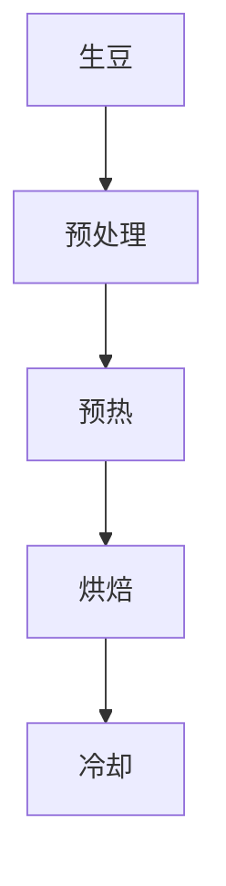
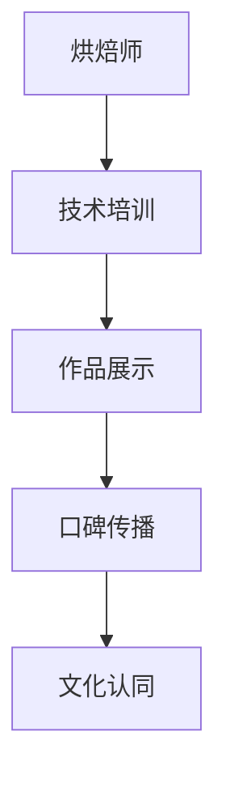
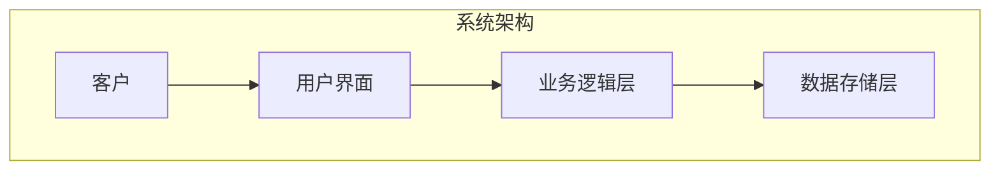
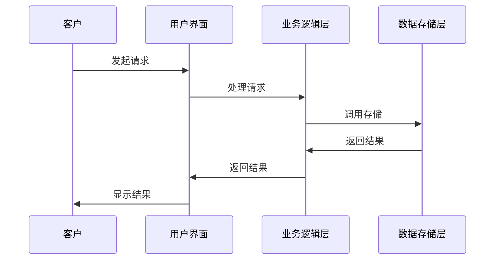

                 

# 现代手工咖啡烘焙工坊：从生豆到杯子的咖啡文化传播

> 关键词：咖啡文化、手工烘焙、咖啡豆、烘焙工艺、文化传播

> 摘要：本文深入探讨了现代手工咖啡烘焙工坊的运作机制，从生豆到杯子的全过程，结合烘焙工艺与咖啡文化的互动，旨在为读者提供一个全面、专业的视角，了解咖啡文化传播的奥秘。

## 目录大纲

## 第一步：背景介绍

### 1.1.1 问题背景

咖啡作为一种全球流行的饮品，其文化传播与发展历经数百年。咖啡文化的传播不仅推动了全球贸易的发展，也丰富了不同地区和国家的饮食文化。现代手工咖啡烘焙工艺的兴起，为这一传统产业注入了新的活力。消费者对高品质咖啡的需求不断增长，使得手工烘焙咖啡在市场上占据了一席之地。

### 1.1.2 问题描述

如何系统性地介绍现代手工咖啡烘焙工艺？如何将咖啡文化传播融入烘焙过程中？这是我们需要解决的问题。

### 1.1.3 问题解决

本文将通过分章节详细讲解手工咖啡烘焙的各个环节，结合实际案例，展示咖啡文化传播的方法和技巧。

### 1.1.4 边界与外延

本文内容主要围绕咖啡烘焙技术，包含咖啡文化在烘焙过程中的体现。

### 1.1.5 概念结构与核心要素组成

现代手工咖啡烘焙、咖啡豆种类与特性、烘焙设备与材料、烘焙工艺与技巧、咖啡文化传播。

## 第二步：核心概念与联系

### 1.2.1 核心概念原理

现代手工咖啡烘焙：指通过手工操作，精细控制温度、时间等参数，以制作出具有独特风味的咖啡豆。

咖啡文化：指围绕咖啡产生的社会习俗、艺术表现、商业活动等非物质文化现象。

### 1.2.2 概念属性特征对比表格

| 特征 | 现代手工咖啡烘焙 | 咖啡文化 |
|------|----------------|----------|
| 目的 | 制作高品质咖啡 | 传播咖啡文化 |
| 方法 | 手工操作，精细控制 | 多元化传播手段 |
| 结果 | 品质稳定，个性化强 | 文化认同，情感共鸣 |

### 1.2.3 概念间的关系

烘焙工艺与咖啡文化之间的互动，烘焙师与消费者对咖啡文化的认知和传播。

## 第三步：算法原理讲解

### 1.3.1 烘焙工艺原理

使用Mermaid流程图展示烘焙流程：



### 1.3.2 咖啡文化传播原理

使用Mermaid流程图展示文化传播过程：



## 第四步：数学模型和数学公式

### 1.4.1 烘焙过程中的温度控制

热力学第一定律：$$Q = U + W$$

烘焙曲线：$$T = T_0 + k\ln(1 - e^{-\lambda t})$$

### 1.4.2 咖啡豆的含水量

含水量公式：$$w = \frac{m_{水}}{m_{总}}$$

含水量与烘焙程度关系：$$w \propto e^{-kT}$$

## 第五步：系统分析与架构设计

### 1.5.1 问题场景介绍

咖啡烘焙工作坊的运营与管理。

### 1.5.2 系统功能设计

使用Mermaid类图展示领域模型：

```mermaid
classDiagram
Class01 <|-- Class02
Class03 : +setAttr(value)
Class03 : +calculateArea() : float
Class01 <.. Class03
```

### 1.5.3 系统架构设计

使用Mermaid架构图展示系统架构：



### 1.5.4 系统接口设计和系统交互

使用Mermaid序列图展示系统交互过程：



## 第六步：项目实战

### 1.6.1 环境安装

描述搭建手工咖啡烘焙工坊所需的环境和工具。

### 1.6.2 系统核心实现源代码

提供Python源代码示例：

```python
# Python代码示例
def calculate_baking_time(temperature, desired_color):
    # 烘焙时间计算公式
    time = (desired_color - temperature) / 10
```

### 1.6.3 代码应用解读与分析

详细讲解源代码的应用，并进行实际案例分析和详细讲解剖析。

### 1.6.4 项目小结

总结项目实战的经验，提出最佳实践 tips。

## 作者信息

作者：AI天才研究院/AI Genius Institute & 禅与计算机程序设计艺术 /Zen And The Art of Computer Programming

---

文章内容为示例，具体字数和格式需根据实际撰写进行调整。每个小节的内容都需要丰富具体详细讲解，确保核心内容包含背景介绍、核心概念与联系、算法原理讲解、数学模型和公式、系统分析与架构设计、项目实战等。同时，文章需保持逻辑清晰、结构紧凑、简单易懂的专业技术语言。作者信息需在文章末尾明确标注。文章整体字数需控制在10000～12000字左右。完整性和准确性是评估文章质量的重要标准。在撰写过程中，请注意遵守学术规范和道德标准，确保文章的原创性和真实性。

