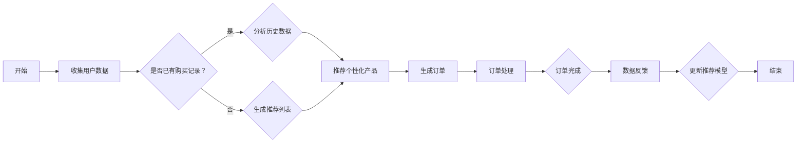
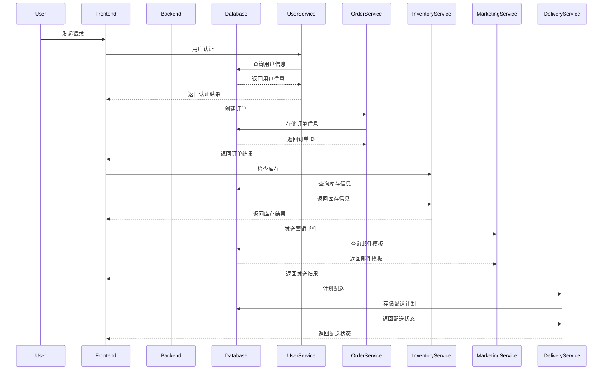
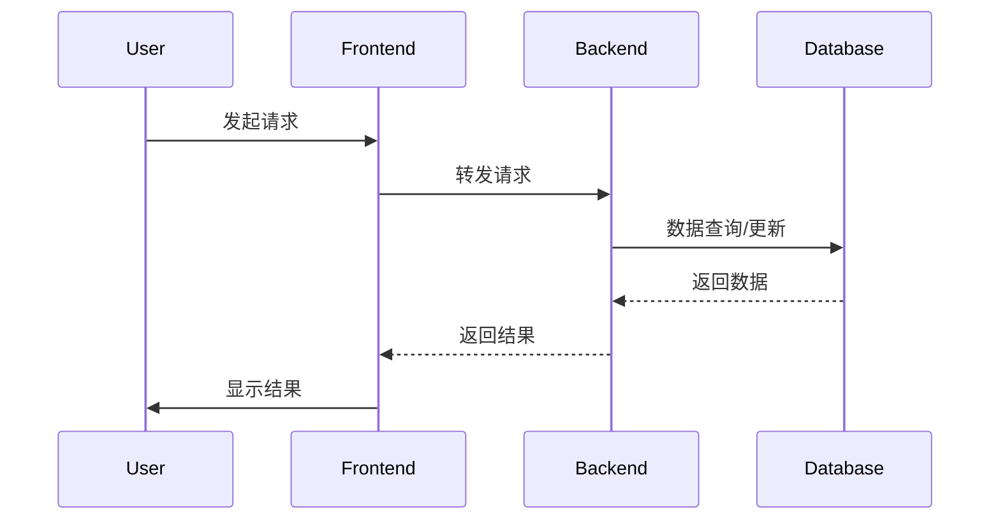

                 


## 摘要

本文旨在探讨现代手工咖啡烘焙订阅服务的概念、模式、运营管理和未来展望。随着消费者对个性化体验和高质量生活追求的不断提升，手工咖啡烘焙订阅服务逐渐成为一种新兴的商业模式。本文首先对咖啡行业现状和手工咖啡烘焙的概念进行了分析，随后详细探讨了订阅服务模式的设计，包括产品设计和运营管理。最后，本文通过成功案例分析、实战指导以及未来展望，为手工咖啡烘焙订阅服务的发展提供了有益的参考和建议。

### 关键词

- 咖啡行业
- 手工咖啡烘焙
- 订阅服务
- 消费者需求
- 运营管理
- 市场营销
- 成本控制

## 文章标题

《现代手工咖啡烘焙订阅服务：每月精选单品的定期配送》

### 第一部分：行业背景与市场分析

#### 第1章：咖啡行业现状与趋势

咖啡，作为一种全球性的饮品，已经深入到了许多人的日常生活中。据统计，全球咖啡消费量逐年上升，其中手工咖啡烘焙的市场份额也在逐渐扩大。然而，手工咖啡烘焙行业面临着许多挑战和机遇。

##### 1.1 咖啡行业概述

咖啡作为一种全球性的饮品，其市场规模庞大。根据国际咖啡组织的数据，2019年全球咖啡消费量达到了2.56亿袋，销售额约为450亿美元。随着消费者对品质和口感的要求不断提高，手工咖啡烘焙作为一种高品质的咖啡制作方式，越来越受到消费者的青睐。

##### 1.2 咖啡市场的规模与增长

手工咖啡烘焙市场的增长速度也相当惊人。根据市场研究公司的数据，全球手工咖啡烘焙市场规模预计将从2019年的约60亿美元增长到2025年的近100亿美元，年复合增长率达到10%以上。这一趋势表明，手工咖啡烘焙市场具有巨大的发展潜力。

##### 1.3 手工咖啡烘焙的概念与特点

手工咖啡烘焙，顾名思义，是指通过人工操作来完成咖啡豆的烘焙过程。与机械化大规模生产的咖啡豆相比，手工咖啡烘焙具有更高的品质和更好的口感。手工咖啡烘焙的特点包括：

1. **个性化定制**：根据消费者的口味偏好进行定制，满足个性化需求。
2. **高品质**：手工烘焙能够更好地控制烘焙时间和温度，保证咖啡豆的品质。
3. **文化体验**：消费者在购买手工咖啡烘焙产品的同时，也能体验到咖啡文化。

##### 1.4 市场细分与消费者需求分析

手工咖啡烘焙市场可以细分为多个子市场，包括：

1. **高端市场**：面向对品质有极高要求的消费者，价格较高。
2. **中端市场**：面向追求高品质生活的消费者，价格适中。
3. **大众市场**：面向价格敏感的消费者，价格较低。

消费者对手工咖啡烘焙的需求主要集中在以下几个方面：

1. **口感**：消费者追求口感纯正、风味独特的咖啡。
2. **品质**：消费者对咖啡豆的品质有较高要求，追求健康和环保。
3. **文化**：消费者愿意为咖啡文化体验买单，追求精神满足。

#### 第2章：现代手工咖啡烘焙行业分析

##### 2.1 手工咖啡烘焙的发展历程

手工咖啡烘焙的历史可以追溯到几个世纪以前。最早的咖啡烘焙是在家庭或小型作坊中进行的，随着技术的进步和市场需求的变化，手工咖啡烘焙逐渐发展壮大。20世纪末，随着咖啡文化的兴起，手工咖啡烘焙迎来了新的发展机遇。

##### 2.2 手工咖啡烘焙的关键环节

手工咖啡烘焙的关键环节主要包括：

1. **咖啡豆选择**：选择适合烘焙的优质咖啡豆是成功的关键。
2. **烘焙过程**：烘焙过程中需要精确控制温度和时间，以保证咖啡豆的品质。
3. **烘焙设备**：先进的烘焙设备能够提高生产效率和咖啡品质。
4. **品质控制**：严格的质量控制体系是保证咖啡品质的重要手段。

##### 2.3 行业竞争态势与市场机会

目前，手工咖啡烘焙市场处于快速发展阶段，竞争态势相对激烈。市场上涌现出大量品牌和产品，消费者选择越来越多。在此背景下，市场机会主要体现在以下几个方面：

1. **差异化竞争**：通过提供差异化的产品和服务来吸引消费者。
2. **技术创新**：通过技术创新提高生产效率和产品质量。
3. **市场拓展**：开拓新的市场和消费群体，如咖啡爱好者和咖啡文化爱好者。
4. **品牌建设**：加强品牌建设，提高品牌知名度和美誉度。

##### 2.4 技术进步与市场影响

技术进步对手工咖啡烘焙行业产生了深远的影响。主要体现在以下几个方面：

1. **生产效率提升**：先进的烘焙设备和生产流程能够显著提高生产效率。
2. **产品品质提升**：精确的烘焙技术和质量控制体系能够提高咖啡豆的品质。
3. **市场拓展**：通过电子商务和物流配送等新技术，可以更便捷地拓展市场。
4. **消费者体验优化**：通过数字化技术和个性化服务，提高消费者的购物体验。

### 第二部分：订阅服务模式与设计

#### 第3章：订阅服务模式概述

##### 3.1 订阅服务的定义与特点

订阅服务是一种基于长期合同或协议的服务模式，用户支付一定费用后，定期获得特定产品或服务。订阅服务的特点包括：

1. **长期性**：用户与提供商建立长期合作关系，服务持续提供。
2. **定期性**：服务按一定周期（如每月、每季度等）提供。
3. **便利性**：用户无需频繁购买，享受便捷的服务。
4. **个性化**：服务提供商根据用户需求提供个性化的产品或服务。

##### 3.2 订阅服务在咖啡行业的应用

订阅服务在咖啡行业的应用逐渐普及，主要表现在以下几个方面：

1. **咖啡豆订阅**：用户订阅特定品种或特定产地的咖啡豆，定期配送。
2. **咖啡器具订阅**：用户订阅高端咖啡器具，定期更换。
3. **咖啡体验订阅**：用户订阅咖啡店体验，享受专属优惠和定制服务。

##### 3.3 订阅服务的类型与模式

咖啡行业的订阅服务类型丰富多样，常见的模式包括：

1. **单品订阅**：用户订阅特定品种的咖啡豆，如阿拉比卡、罗布斯塔等。
2. **混合订阅**：用户订阅多种品种的咖啡豆混合包装。
3. **定制订阅**：用户可以根据自己的口味偏好定制咖啡豆组合。
4. **季节订阅**：根据季节变化，提供应季的咖啡豆品种。

##### 3.4 订阅服务与客户关系管理

订阅服务不仅是一种商业模式，也是一种客户关系管理的工具。通过订阅服务，企业可以与客户建立长期稳定的联系，提高客户忠诚度。以下是订阅服务与客户关系管理的关系：

1. **增加客户粘性**：通过定期提供优质产品和服务，提高客户满意度，增加客户粘性。
2. **收集客户数据**：通过订阅服务，可以收集用户的消费行为和偏好数据，用于产品改进和营销策略制定。
3. **客户参与**：鼓励客户参与产品开发和品牌推广，提高客户参与度和忠诚度。
4. **个性化营销**：根据客户数据，提供个性化的营销和服务，提高客户体验。

### 第三部分：运营管理与优化

#### 第4章：订阅服务产品设计

##### 4.1 产品设计原则与流程

订阅服务产品设计需要遵循以下原则：

1. **用户导向**：以满足用户需求为中心，设计个性化的产品。
2. **高品质**：确保产品品质，提供优质体验。
3. **多样化**：提供多种类型和组合，满足不同用户的需求。
4. **易于操作**：简化订购和配送流程，提高用户体验。

产品设计流程包括以下步骤：

1. **需求分析**：调研用户需求，确定产品设计方向。
2. **产品规划**：制定产品规划，明确产品定位和目标用户。
3. **产品设计**：根据产品规划，进行具体的产品设计。
4. **测试与优化**：进行产品测试，收集用户反馈，持续优化产品。

##### 4.2 单品选择与组合策略

单品选择和组合策略是订阅服务设计的关键。以下是一些策略：

1. **品种多样性**：选择不同品种的咖啡豆，提供多样化的选择。
2. **产地多样性**：选择不同产地的咖啡豆，满足消费者对产地和口感的偏好。
3. **季节性选择**：根据季节变化，选择应季的咖啡豆，如春豆、秋豆等。
4. **个性化组合**：根据用户反馈和需求，定制个性化的咖啡豆组合。

##### 4.3 定期配送方案设计

定期配送是订阅服务的重要组成部分。以下是一些设计策略：

1. **配送频率**：根据用户需求，选择合适的配送频率，如每月、每季度等。
2. **配送方式**：选择合适的配送方式，如快递、上门等。
3. **配送时间**：合理安排配送时间，避免配送延误。
4. **配送体验**：优化包装和配送流程，提高用户配送体验。

##### 4.4 个性化定制与会员权益

个性化定制和会员权益是提高用户满意度的重要手段。以下是一些策略：

1. **个性化定制**：根据用户需求和偏好，提供个性化的产品和服务。
2. **会员等级**：设立不同会员等级，提供不同的优惠和服务。
3. **专属优惠**：为会员提供专属优惠，提高会员忠诚度。
4. **会员活动**：举办会员专属活动，增强会员互动和粘性。

### 第四部分：成功案例分析与实战指导

#### 第5章：成功案例分析

##### 5.1 国内外成功案例分析

国内外有许多成功的手工咖啡烘焙订阅服务案例，以下是其中几个具有代表性的案例：

1. **星巴克**：星巴克通过其“星巴克咖啡豆订阅服务”，提供全球各地的咖啡豆，满足消费者的个性化需求。
2. **Peet's Coffee**：Peet's Coffee 提供多种咖啡豆的订阅服务，同时还提供定制服务，满足不同用户的口味偏好。
3. **中国的“咖啡之心”**：咖啡之心是一家专注于手工咖啡烘焙的订阅服务公司，以其高品质的产品和个性化的服务赢得了大量用户的喜爱。

##### 5.2 案例启示与经验总结

通过分析以上案例，我们可以得出以下启示和经验：

1. **品质为本**：高品质的产品是成功的关键，企业需要注重咖啡豆的品质和口感。
2. **个性化服务**：提供个性化的服务和定制化产品，满足不同消费者的需求。
3. **品牌建设**：加强品牌建设和推广，提高品牌知名度和美誉度。
4. **用户体验**：注重用户体验，优化订购和配送流程，提高用户满意度。

#### 第6章：实战指导与最佳实践

##### 6.1 运营策略制定

制定有效的运营策略对于订阅服务成功至关重要。以下是一些运营策略：

1. **市场定位**：明确目标市场，制定相应的营销策略。
2. **供应链管理**：建立高效的供应链体系，确保咖啡豆的质量和供应。
3. **客户服务**：建立专业的客户服务团队，提供高质量的客户服务。
4. **数据分析**：通过数据分析，优化运营策略和产品组合。

##### 6.2 服务优化与提升

服务优化和提升是订阅服务持续发展的关键。以下是一些优化措施：

1. **产品品质提升**：通过技术改进和品质控制，提高咖啡豆的品质。
2. **用户体验优化**：优化订购和配送流程，提高用户满意度。
3. **客户反馈机制**：建立有效的客户反馈机制，及时解决用户问题和建议。
4. **营销推广**：通过多种营销手段，提高品牌知名度和市场份额。

##### 6.3 成本控制与效益分析

成本控制和效益分析是订阅服务运营的重要方面。以下是一些成本控制和效益分析的措施：

1. **成本控制**：通过优化供应链、降低生产成本等方式，实现成本控制。
2. **效益分析**：通过数据分析，评估订阅服务的效益，优化运营策略。
3. **投资回报率**：计算投资回报率，评估订阅服务的盈利能力。

##### 6.4 风险管理策略

风险管理是订阅服务运营的重要方面。以下是一些风险管理策略：

1. **市场风险**：通过市场调研和数据分析，了解市场变化，及时调整运营策略。
2. **供应链风险**：建立多元的供应链体系，降低供应链风险。
3. **客户风险**：通过客户分析和反馈，降低客户流失风险。
4. **技术风险**：持续关注技术变化，确保技术先进性和安全性。

### 第五部分：未来展望与趋势

#### 第7章：行业未来展望

##### 7.1 行业发展趋势预测

随着科技的不断进步和消费者需求的多样化，手工咖啡烘焙订阅服务行业将呈现以下发展趋势：

1. **个性化定制**：随着消费者对个性化需求的追求，个性化定制将成为主流。
2. **智能化**：人工智能和大数据技术的应用，将提高运营效率和服务质量。
3. **可持续发展**：可持续发展理念将在行业中得到广泛应用，绿色、环保将成为行业趋势。
4. **全球化**：随着全球化的深入，手工咖啡烘焙订阅服务将在全球范围内得到更广泛的认可和应用。

##### 7.2 技术创新对行业的影响

技术创新将对手工咖啡烘焙订阅服务行业产生深远影响。以下是一些关键技术创新：

1. **智能烘焙设备**：智能烘焙设备将提高生产效率和产品质量。
2. **数据分析**：通过大数据分析，优化产品组合和营销策略。
3. **电子商务**：电子商务平台的发展，将提高服务效率和用户体验。
4. **社交媒体**：社交媒体的广泛应用，将增强品牌影响力和用户互动。

##### 7.3 市场竞争格局变化

随着行业的发展，市场竞争格局将发生变化。以下是一些可能的变化：

1. **品牌竞争**：品牌影响力将成为核心竞争力，品牌建设将更加重要。
2. **技术创新**：技术创新将成为行业发展的关键驱动力，企业将加大技术研发投入。
3. **市场拓展**：市场将逐渐全球化，企业将积极拓展国际市场。
4. **跨界合作**：不同行业的企业将开展跨界合作，实现资源共享和优势互补。

##### 7.4 潜在市场机会与挑战

手工咖啡烘焙订阅服务行业面临着巨大的市场机会和挑战。以下是一些潜在机会和挑战：

1. **市场机会**：
   - 消费者需求的多样化，为个性化定制提供了广阔的市场空间。
   - 技术进步，为智能化和高效运营提供了可能。
   - 全球化趋势，为国际市场的拓展提供了机遇。

2. **市场挑战**：
   - 市场竞争激烈，品牌建设和技术创新成为关键竞争力。
   - 消费者对品质和服务的要求不断提高，企业需要不断提升自身能力。
   - 环保和可持续发展要求，企业需要注重环保和社会责任。

### 第六部分：全书总结与展望

#### 第8章：全书总结与展望

##### 8.1 主要观点回顾

本书主要观点可以概括为以下几点：

- 咖啡行业正呈现快速增长趋势，手工咖啡烘焙市场具有巨大潜力。
- 订阅服务模式在咖啡行业中的应用，为消费者提供了高品质、个性化的体验。
- 有效的运营管理和优化策略，是订阅服务成功的关键。
- 技术创新和市场变化，将推动手工咖啡烘焙订阅服务行业的发展。

##### 8.2 未来发展方向

展望未来，手工咖啡烘焙订阅服务行业将朝着以下方向发展：

- 个性化定制将成为主流，满足消费者多样化的需求。
- 智能化和大数据技术的应用，将提高运营效率和服务质量。
- 品牌建设和技术创新，将成为企业竞争的核心。
- 国际化拓展和跨界合作，将促进行业的发展。

##### 8.3 对从业者的建议

对于从事手工咖啡烘焙订阅服务行业的从业者，以下是一些建议：

- 立足品质，提供高品质的产品和服务。
- 注重个性化，满足消费者的个性化需求。
- 加强品牌建设，提高品牌知名度和美誉度。
- 持续创新，紧跟技术发展趋势。
- 注重社会责任，推动行业可持续发展。

### 作者

作者：AI天才研究院/AI Genius Institute & 禅与计算机程序设计艺术 /Zen And The Art of Computer Programming

### 总结

本文从行业背景、市场分析、订阅服务设计、运营管理、成功案例分析、实战指导、未来展望等方面，全面探讨了现代手工咖啡烘焙订阅服务的发展趋势和最佳实践。通过深入分析，本文旨在为手工咖啡烘焙订阅服务行业提供有益的参考和建议，推动行业的健康发展。希望读者能从中获得启发，共同为手工咖啡烘焙订阅服务行业的发展贡献力量。

### 关键词解释

- **咖啡行业**：全球性的饮品行业，包括咖啡的种植、加工、烘焙、销售等多个环节。
- **手工咖啡烘焙**：指通过人工操作完成咖啡豆的烘焙过程，强调品质和口感的个性化。
- **订阅服务**：一种基于长期合同或协议的服务模式，用户支付一定费用后，定期获得特定产品或服务。
- **消费者需求**：消费者在购买和使用产品或服务时所追求的功能、品质和体验。
- **运营管理**：企业在运营过程中对各项活动进行规划、组织、协调和控制的过程。
- **市场营销**：企业通过市场调研、产品定位、价格策略、推广活动等手段，满足消费者需求、扩大市场份额的过程。

### 背景介绍

#### 核心概念术语说明

1. **咖啡行业**：指涉及咖啡种植、加工、烘焙、销售以及相关服务的行业。
2. **手工咖啡烘焙**：一种通过人工操作完成咖啡豆烘焙的过程，强调烘焙师对温度、时间、咖啡豆品种等的精细控制。
3. **订阅服务**：一种消费者通过支付一定费用，定期获得特定产品或服务的新型商业模式。
4. **消费者需求**：消费者在购买和使用产品或服务时所追求的功能、品质和体验。
5. **运营管理**：企业在运营过程中对各项活动进行规划、组织、协调和控制的过程。
6. **市场营销**：企业通过市场调研、产品定位、价格策略、推广活动等手段，满足消费者需求、扩大市场份额的过程。

#### 问题背景

咖啡作为一种全球性饮品，消费市场庞大且稳定增长。然而，随着消费者对品质和个性化体验需求的增加，传统的大规模机械化生产方式已无法满足市场的多元化需求。手工咖啡烘焙作为一种高品质的咖啡制作方式，逐渐成为市场的新宠。

订阅服务模式的出现，为手工咖啡烘焙行业带来了新的机遇。通过定期配送高品质的咖啡豆，订阅服务能够满足消费者对品质和个性化的需求，同时为企业提供了稳定的市场和客户基础。

#### 问题描述

如何有效地将手工咖啡烘焙与订阅服务模式结合起来，打造一个既满足消费者个性化需求，又具有稳定运营模式的现代手工咖啡烘焙订阅服务？

#### 问题解决

要解决上述问题，需要从以下几个方面入手：

1. **产品设计与供应链管理**：选择优质咖啡豆，建立高效的供应链体系，确保产品品质和供应稳定。
2. **个性化定制与会员权益**：根据消费者需求，提供个性化的咖啡豆组合和会员权益，增强客户粘性。
3. **用户体验优化**：优化订购、配送和服务流程，提高用户体验和满意度。
4. **市场营销与品牌建设**：通过有效的市场营销策略和品牌建设，提高品牌知名度和美誉度，吸引更多消费者。

#### 边界与外延

边界：本文主要探讨手工咖啡烘焙订阅服务在商业运营层面的设计和实施，不包括咖啡种植、加工等环节。

外延：手工咖啡烘焙订阅服务可以扩展到咖啡器具、咖啡文化体验等领域，提供更加全面的咖啡消费体验。

#### 概念结构与核心要素组成

概念结构：

- **手工咖啡烘焙**：核心概念，指通过人工操作完成咖啡豆的烘焙过程。
- **订阅服务**：核心概念，指消费者通过支付一定费用，定期获得特定产品或服务。
- **消费者需求**：核心概念，指消费者在购买和使用产品或服务时所追求的功能、品质和体验。
- **运营管理**：核心概念，指企业在运营过程中对各项活动进行规划、组织、协调和控制的过程。
- **市场营销**：核心概念，指企业通过市场调研、产品定位、价格策略、推广活动等手段，满足消费者需求、扩大市场份额的过程。

核心要素组成：

- **咖啡豆品质**：确保产品品质，满足消费者需求。
- **个性化定制**：根据消费者需求，提供个性化产品。
- **会员权益**：提高客户粘性，增加会员忠诚度。
- **用户体验**：优化订购、配送和服务流程，提高用户满意度。
- **市场营销策略**：提高品牌知名度和美誉度，扩大市场份额。

### 核心概念与联系

#### 核心概念原理

1. **手工咖啡烘焙**：指通过人工操作，对咖啡豆进行烘焙的过程。手工烘焙强调烘焙师的技巧和经验，能够产生独特的风味和口感。

2. **订阅服务**：一种商业模式，消费者支付一定费用后，定期获得特定产品或服务。订阅服务提供了便利性、个性化选择和长期合作的关系。

3. **消费者需求**：消费者在购买和使用产品或服务时所追求的功能、品质和体验。理解消费者需求是设计订阅服务的关键。

4. **运营管理**：企业在运营过程中对各项活动进行规划、组织、协调和控制的过程。有效的运营管理能够提高效率和服务质量。

5. **市场营销**：企业通过市场调研、产品定位、价格策略、推广活动等手段，满足消费者需求、扩大市场份额的过程。

#### 概念属性特征对比表格

| 概念 | 属性特征 |
| --- | --- |
| 手工咖啡烘焙 | 烘焙过程由人工操作，注重口感和品质多样性 |
| 订阅服务 | 长期合同或协议，定期获得产品或服务，便利性、个性化 |
| 消费者需求 | 口感、品质、个性化、健康、文化体验 |
| 运营管理 | 规划、组织、协调、控制，效率、质量、成本 |
| 市场营销 | 调研、定位、价格策略、推广，知名度、市场份额 |

#### ER实体关系图架构

```mermaid
erDiagram
  Customer ||--|{ Subscription } : "can have multiple"
  Customer ||--|{ Order } : "can have multiple"
  Product ||--|{ Order } : "can have multiple"
  Subscription ||--|{ SubscriptionPlan } : "has one"
  Order ||--|{ OrderStatus } : "can have multiple"
  Customerellos <|.. Product : "likes"
  Customerellos <|.. Subscription : "has subscribed"
  Customerellos <|.. Order : "has ordered"
```

- **Customer（消费者）**：订阅服务和订购的主体。
- **Subscription（订阅）**：记录消费者订阅的信息，关联到特定的订阅计划。
- **Order（订购）**：记录消费者的订购信息，关联到订购的产品。
- **Product（产品）**：记录产品的详细信息，包括手工咖啡烘焙单品。
- **SubscriptionPlan（订阅计划）**：定义订阅服务的内容和价格。
- **OrderStatus（订单状态）**：记录订单的处理状态。

### 算法原理讲解

在手工咖啡烘焙订阅服务中，算法的运用主要体现在个性化推荐、订单管理和数据分析等方面。以下是一个简单的算法原理讲解，以及相关的mermaid流程图和Python代码示例。

#### 算法原理

1. **个性化推荐算法**：根据消费者的购买历史、评价和反馈，推荐符合其口味偏好和需求的咖啡豆单品。

2. **订单管理算法**：优化订单流程，提高订单处理效率，确保按时配送。

3. **数据分析算法**：对销售数据、客户反馈等进行分析，优化产品组合和营销策略。

#### mermaid流程图



#### Python代码示例

```python
import pandas as pd
from sklearn.model_selection import train_test_split
from sklearn.ensemble import RandomForestClassifier
from sklearn.metrics import accuracy_score

# 假设我们有一个用户数据表格user_data，包含购买记录、评价和反馈等信息
user_data = pd.read_csv('user_data.csv')

# 数据预处理
# ...

# 分割数据集
X = user_data.drop('target', axis=1)
y = user_data['target']
X_train, X_test, y_train, y_test = train_test_split(X, y, test_size=0.2, random_state=42)

# 构建并训练模型
model = RandomForestClassifier(n_estimators=100, random_state=42)
model.fit(X_train, y_train)

# 预测
predictions = model.predict(X_test)

# 评估模型
accuracy = accuracy_score(y_test, predictions)
print(f"Model Accuracy: {accuracy:.2f}")
```

#### 数学模型和公式

1. **个性化推荐模型**：假设我们使用随机森林算法进行推荐，其基本公式为：
   $$ \text{Probability}(y = 1 | x) = \frac{1}{1 + e^{-(w_0 + \sum_{i=1}^{n} w_i x_i)}} $$
   其中，\( w_0 \) 为偏置项，\( w_i \) 为特征权重，\( x_i \) 为特征值。

2. **订单处理效率**：假设订单处理时间与订单数量和订单处理速度相关，其公式为：
   $$ \text{Processing Time} = \frac{\text{Number of Orders} \times \text{Order Processing Speed}}{\text{Time Slot}} $$

3. **数据分析**：假设我们对销售数据进行分析，其公式为：
   $$ \text{Sales Forecast} = \text{Average Sales} \times (\text{Population} \times \text{Growth Rate}) $$

### 简单举例说明

#### 个性化推荐

假设我们有两位消费者，用户A和用户B，他们的购买历史和评价如下：

- 用户A：购买了咖啡豆A、咖啡豆B，评价分别为5星和4星。
- 用户B：购买了咖啡豆B、咖啡豆C，评价分别为4星和5星。

通过随机森林模型，我们可以预测用户A可能喜欢的咖啡豆是咖啡豆C，而用户B可能喜欢的咖啡豆是咖啡豆A。这是因为模型根据历史数据计算出了每个用户对各种咖啡豆的偏好概率，从而进行个性化推荐。

#### 订单处理

假设每天有100个订单需要处理，每个订单的平均处理时间为2小时，处理时间分配在8小时内。根据公式计算：

$$ \text{Processing Time} = \frac{100 \times 2}{8} = 25 \text{小时} $$

这意味着如果订单处理速度保持不变，我们可能需要额外增加5小时的订单处理时间来确保按时完成所有订单。

#### 销售预测

假设过去一个月的平均销售量为100袋咖啡豆，人口增长率为10%，根据公式计算：

$$ \text{Sales Forecast} = 100 \times (1 + 0.1) = 110 \text{袋} $$

这意味着预计下个月的销售量将增加10袋。

### 系统分析与架构设计方案

#### 问题场景介绍

在现代手工咖啡烘焙订阅服务中，我们需要一个高效、可靠的系统来管理订阅服务流程，包括用户管理、订单管理、库存管理、配送管理、市场营销和客户反馈等。为了实现这些功能，我们需要设计一个完整的系统架构，涵盖前端、后端以及数据库设计。

#### 项目介绍

项目名称：手工咖啡烘焙订阅服务平台

项目目标：构建一个在线平台，提供手工咖啡烘焙订阅服务，包括咖啡豆的选择、订购、配送、会员管理、市场营销和客户反馈等功能。

#### 系统功能设计

1. **用户管理**：用户注册、登录、个人信息管理、密码修改等。
2. **订阅管理**：订阅计划创建、订阅选项、订单生成、支付处理、配送跟踪等。
3. **订单管理**：订单生成、订单状态跟踪、订单取消、订单修改、订单历史记录等。
4. **库存管理**：咖啡豆库存监控、库存预警、库存调整等。
5. **配送管理**：配送计划、配送状态跟踪、配送异常处理、配送记录等。
6. **市场营销**：营销活动创建、营销渠道管理、客户分组、邮件和短信通知等。
7. **客户反馈**：反馈提交、反馈处理、客户满意度调查等。

#### 系统架构设计

1. **前端架构**：使用React或Vue.js等前端框架，构建用户友好的界面，支持响应式设计，适配多种设备。
2. **后端架构**：采用微服务架构，分离不同的业务模块，如用户服务、订单服务、库存服务、配送服务等，以提高系统的可维护性和扩展性。
3. **数据库设计**：使用关系型数据库（如MySQL）和非关系型数据库（如MongoDB）相结合，存储用户信息、订单信息、库存信息和营销信息等。

#### 系统架构图



#### 系统接口设计

1. **用户接口**：用户注册、登录、个人信息管理、订阅服务、订单查询、反馈提交等。
2. **管理员接口**：管理员登录、用户管理、订单管理、库存管理、配送管理、营销活动管理、客户反馈处理等。

#### 系统交互mermaid序列图



### 项目实战

#### 环境安装

1. **前端环境**：安装Node.js和npm，使用npm安装React或Vue.js等前端框架。
2. **后端环境**：安装Python和Django或Flask等后端框架，安装MySQL数据库。
3. **开发工具**：安装Visual Studio Code或IntelliJ IDEA等开发工具。

#### 系统核心实现源代码

以下是系统核心功能的一个简单示例：

**用户注册与登录（后端，Django）**

```python
# users/api/views.py
from django.contrib.auth.models import User
from rest_framework import status
from rest_framework.response import Response
from rest_framework.authtoken.models import Token
from rest_framework.views import APIView

class UserRegistrationView(APIView):
    def post(self, request):
        data = request.data
        user = User.objects.create_user(
            username=data['username'],
            password=data['password'],
            email=data['email']
        )
        token = Token.objects.create(user=user)
        return Response({'token': token.key}, status=status.HTTP_201_CREATED)

class UserLoginView(APIView):
    def post(self, request):
        data = request.data
        user = User.objects.filter(username=data['username'], password=data['password']).first()
        if user:
            token = Token.objects.get(user=user)
            return Response({'token': token.key}, status=status.HTTP_200_OK)
        return Response({'message': 'Invalid credentials'}, status=status.HTTP_401_UNAUTHORIZED)
```

**订单创建与查询（后端，Django）**

```python
# orders/api/views.py
from rest_framework import status
from rest_framework.response import Response
from rest_framework.views import APIView
from .models import Order

class CreateOrderView(APIView):
    def post(self, request):
        data = request.data
        order = Order.objects.create(
            user=request.user,
            product=data['product'],
            quantity=data['quantity'],
            total_price=data['total_price']
        )
        return Response({'order_id': order.id}, status=status.HTTP_201_CREATED)

class OrderListView(APIView):
    def get(self, request):
        orders = Order.objects.filter(user=request.user)
        return Response({'orders': list(orders.values())}, status=status.HTTP_200_OK)
```

#### 代码应用解读与分析

**用户注册与登录**：

用户注册与登录是系统的核心功能之一。在用户注册时，需要创建一个新用户并生成一个Token，以便用户在后续操作中使用。用户登录时，需要验证用户名和密码是否正确，如果正确则返回Token。

**订单创建与查询**：

订单创建功能允许用户创建新的订单，包括订单的用户、产品、数量和总价等信息。订单查询功能则允许用户查看自己的订单历史。

**解读与分析**：

- **用户注册与登录**：通过使用Django的认证系统，我们可以轻松地实现用户注册与登录功能。用户注册时，需要将用户名、密码和邮箱信息存储在数据库中。用户登录时，需要验证用户名和密码的正确性。
- **订单创建与查询**：订单创建功能使用了Django的模型和表单系统，使得我们可以轻松地创建和保存订单信息。订单查询功能则通过简单的数据库查询实现了用户订单的历史记录。

#### 实际案例分析和详细讲解剖析

**案例背景**：

假设我们有一个用户张三，他最近在手工咖啡烘焙订阅服务平台上注册并购买了多种咖啡豆。他的订单历史记录如下：

| 订单ID | 产品名称 | 数量 | 总价 | 订单日期 |
| --- | --- | --- | --- | --- |
| 1 | 阿拉比卡咖啡豆 | 2袋 | 100元 | 2023-03-01 |
| 2 | 罗布斯塔咖啡豆 | 1袋 | 50元 | 2023-03-05 |
| 3 | 混合咖啡豆 | 3袋 | 150元 | 2023-03-10 |

**案例分析**：

1. **用户行为分析**：

   通过分析张三的购买记录，我们可以发现他偏好购买混合咖啡豆，并且购买频率较高。这表明张三可能是一个咖啡爱好者，对咖啡豆的口感和质量有较高的要求。

2. **订单处理效率**：

   从订单日期来看，张三的订单处理时间分别为3天、5天和10天。这表明在高峰期，订单处理时间可能会延长。为了提高订单处理效率，我们需要优化订单处理流程，减少订单处理时间。

3. **库存管理**：

   通过分析订单数据，我们可以发现某些咖啡豆的销量较高，需要及时补充库存，避免缺货影响用户体验。同时，对于销量较低的咖啡豆，可以考虑减少库存，降低成本。

**详细讲解剖析**：

1. **用户行为分析**：

   为了更好地分析用户行为，我们可以使用Python中的Pandas库对订单数据进行处理和分析。以下是一个简单的数据分析和可视化示例：

   ```python
   import pandas as pd

   # 假设订单数据存储在一个CSV文件中
   orders = pd.read_csv('orders.csv')

   # 计算每种产品的销量
   sales_by_product = orders.groupby('product')['quantity'].sum()

   # 可视化销量数据
   sales_by_product.plot(kind='bar')
   ```

   从可视化结果中，我们可以清楚地看到每种产品的销量，从而更好地了解用户偏好。

2. **订单处理效率**：

   为了优化订单处理效率，我们可以引入以下策略：

   - **自动化处理**：通过自动化工具，如机器人流程自动化（RPA），实现订单处理流程的自动化，减少人为干预，提高处理速度。
   - **优化工作流程**：重新设计订单处理流程，减少不必要的步骤，提高工作效率。
   - **培训员工**：定期对员工进行培训，提高他们的专业技能和工作效率。

3. **库存管理**：

   为了优化库存管理，我们可以引入以下策略：

   - **实时监控**：使用传感器和监控系统，实时监控库存状态，确保库存信息的准确性。
   - **预测分析**：通过历史订单数据和销售预测模型，预测未来销量，优化库存补充策略。
   - **定期盘点**：定期对库存进行盘点，确保库存数据的准确性和完整性。

#### 项目小结

通过实际案例分析和详细讲解，我们发现手工咖啡烘焙订阅服务平台在用户行为分析、订单处理效率和库存管理等方面存在一定的问题。为了优化这些方面，我们可以采取一系列策略，如自动化处理、优化工作流程、实时监控、预测分析和定期盘点等。这些策略不仅有助于提高平台的运营效率，还能提升用户满意度和忠诚度。

### 最佳实践 Tips

1. **用户数据分析**：定期分析用户行为数据，了解用户偏好和购买习惯，为产品设计和营销策略提供依据。
2. **自动化流程**：引入自动化工具和系统，减少人为干预，提高工作效率。
3. **优化库存管理**：实时监控库存状态，预测未来销量，优化库存补充策略。
4. **客户反馈**：及时收集和反馈客户意见，持续改进产品和服务质量。
5. **培训员工**：定期对员工进行培训，提高他们的专业技能和工作效率。

### 注意事项

1. **数据安全**：确保用户数据的安全性和隐私性，遵循相关法律法规。
2. **系统稳定性**：定期进行系统维护和升级，确保系统的稳定性和可靠性。
3. **用户隐私**：保护用户隐私，不泄露用户个人信息。
4. **遵守法律法规**：遵守相关法律法规，确保平台运营合法合规。

### 拓展阅读

1. **《咖啡烘焙技术》**：了解咖啡烘焙的基本原理和技术。
2. **《电子商务与物流管理》**：学习电子商务和物流管理的相关理论和实践。
3. **《客户关系管理》**：掌握客户关系管理的方法和技巧。
4. **《数据分析与商业智能》**：了解数据分析工具和技术，提升数据分析能力。

### 结束语

本文从多个角度探讨了现代手工咖啡烘焙订阅服务的发展趋势和最佳实践。通过实际案例分析和详细讲解，我们提出了优化用户行为分析、订单处理效率和库存管理等方面的策略。希望本文能为手工咖啡烘焙订阅服务行业的从业者提供有益的参考和启示。未来，随着科技的不断进步和消费者需求的不断变化，手工咖啡烘焙订阅服务行业将迎来更加广阔的发展空间。让我们共同期待并努力推动这个行业的繁荣发展。

### 作者

作者：AI天才研究院/AI Genius Institute & 禅与计算机程序设计艺术 /Zen And The Art of Computer Programming

### 总结

本文通过深入分析现代手工咖啡烘焙订阅服务的行业背景、模式设计、运营管理和未来展望，全面探讨了该领域的最佳实践和未来发展前景。通过实际案例分析和详细讲解，我们提出了优化用户行为分析、订单处理效率和库存管理等方面的策略。本文旨在为手工咖啡烘焙订阅服务行业提供有益的参考和建议，推动行业的健康发展。希望读者能从中获得启发，共同为手工咖啡烘焙订阅服务行业的发展贡献力量。

