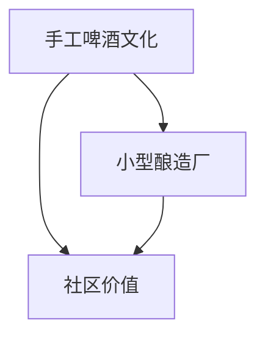
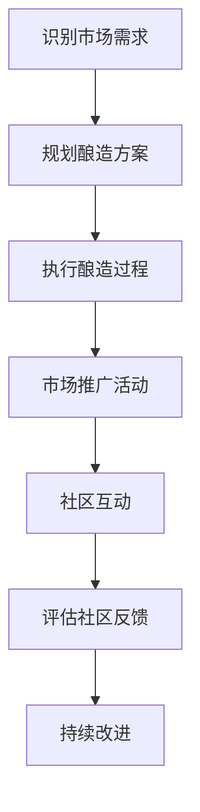
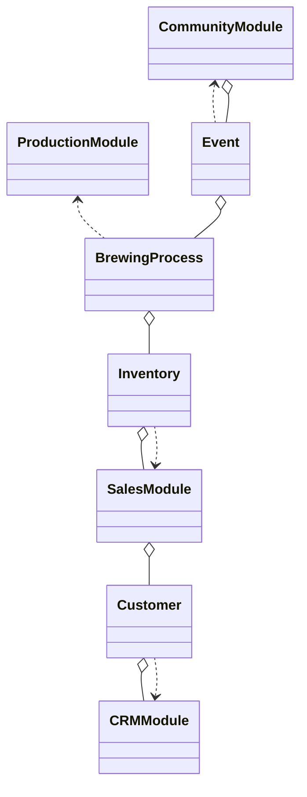
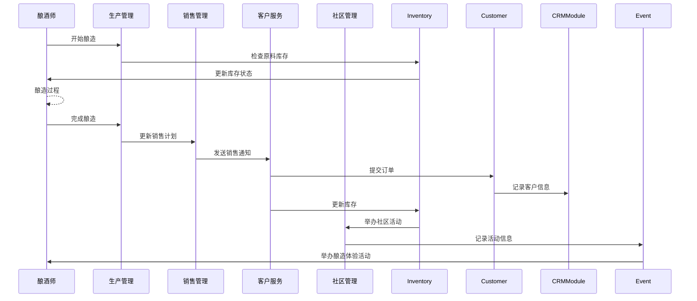
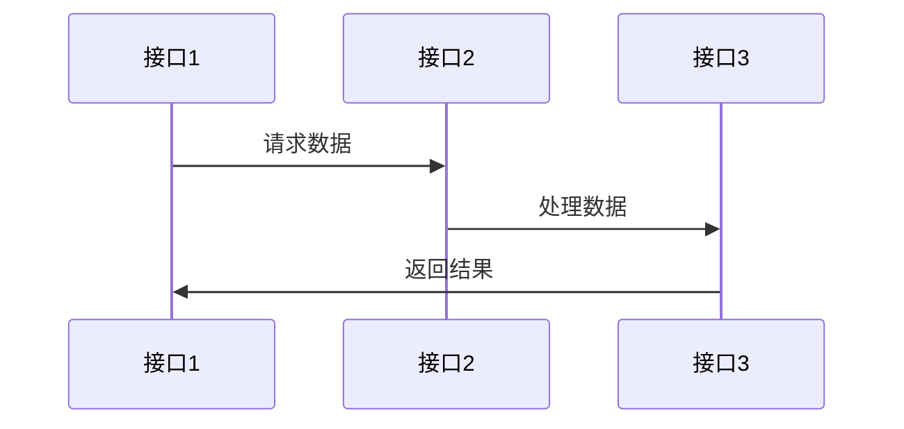

                 

### 现代手工啤酒文化：小型酿造厂的社区价值

**关键词**：手工啤酒文化，小型酿造厂，社区价值，酿造工艺

**摘要**：本文将深入探讨现代手工啤酒文化如何为小型酿造厂带来社区价值。通过分析手工啤酒文化的核心概念、小型酿造厂的运作模式及其对社区的影响，我们揭示了酿造工艺的传承、社区经济的促进和文化活动的举办等多方面的价值。文章旨在为读者提供一个清晰、全面的视角，了解手工啤酒文化在推动小型酿造厂和社区发展中的重要作用。

---

#### 背景介绍

随着全球消费者对个性化、高品质产品的追求，现代手工啤酒文化逐渐成为一种热门趋势。这一文化不仅强调啤酒的口感和品质，更注重手工制作的过程和个性化体验。小型酿造厂作为这一文化的重要载体，不仅在市场上提供了独特的啤酒产品，还在社区层面发挥了积极的作用。

**问题背景**：

- **消费者需求**：消费者对个性化、高品质啤酒的需求不断增加。手工啤酒以其独特的风味和手工制作的魅力，逐渐成为消费者的新宠。
- **市场趋势**：全球手工啤酒市场持续增长，小型酿造厂在市场中的份额逐年上升。这一趋势促使更多的小型酿造厂涌现。

**问题描述**：

现代手工啤酒文化如何为小型酿造厂带来社区价值？具体来说，这些价值体现在哪些方面？

**问题解决**：

本文将从以下几个角度探讨现代手工啤酒文化对小型酿造厂的社区价值：

1. **酿造工艺的传承**：小型酿造厂如何通过传承独特的酿造工艺，为社区带来文化价值？
2. **社区经济的促进**：小型酿造厂如何通过经济活动，推动社区经济发展？
3. **文化活动的举办**：小型酿造厂如何通过举办文化活动，增强社区的凝聚力？

**边界与外延**：

- **边界**：本文主要关注小型酿造厂在手工啤酒文化中的角色和贡献。
- **外延**：虽然本文主要讨论小型酿造厂，但手工啤酒文化的社区价值也适用于其他类型的小型生产企业。

**概念结构与核心要素组成**：

- **手工啤酒文化**：一种强调手工制作、个性化体验和品质至上的啤酒文化。
- **小型酿造厂**：以手工制作为主，规模较小的啤酒生产企业。
- **社区价值**：小型酿造厂通过啤酒生产和社区活动对社区带来的积极影响。

---

### 核心概念与联系

为了深入理解现代手工啤酒文化如何为小型酿造厂带来社区价值，我们首先需要明确几个核心概念：手工啤酒文化、小型酿造厂和社区价值。

**手工啤酒文化**：

手工啤酒文化是一种强调手工制作、个性化体验和品质至上的啤酒文化。它源于欧洲的酿酒传统，随着全球消费者对高品质、个性化产品的需求增长，逐渐成为一种热门趋势。手工啤酒文化的核心特点包括：

- **手工制作**：手工啤酒的制作过程注重手工艺，从原料选择、酿造到包装，每个环节都由酿酒师亲自操作，保证了啤酒的品质和口感。
- **个性化体验**：消费者可以在酿造厂亲自参与啤酒的制作过程，体验传统酿造工艺，享受独特的个性化体验。
- **高品质**：手工啤酒强调品质至上，酿酒师通过对原料、酿造工艺和设备的选择，力求打造出独特的啤酒风味。

**小型酿造厂**：

小型酿造厂是手工啤酒文化的重要载体。与大规模工业酿造厂相比，小型酿造厂具有以下特点：

- **规模较小**：小型酿造厂的产能通常较小，以手工制作为主，产量有限。
- **灵活性强**：小型酿造厂可以快速调整生产计划和产品线，满足消费者个性化需求。
- **品牌特色**：小型酿造厂通常具有独特的品牌特色和酿酒风格，通过独特的产品和品牌故事吸引消费者。

**社区价值**：

小型酿造厂通过啤酒生产和社区活动，为社区带来了多方面的积极影响，这些影响可以归纳为以下三个方面：

- **经济贡献**：小型酿造厂为社区带来了经济活力，创造了就业机会，促进了社区经济发展。
- **文化传承**：小型酿造厂通过传承独特的酿造工艺和酿酒文化，丰富了社区的文化内涵。
- **社会效益**：小型酿造厂举办的文化活动，如啤酒节、酿造体验日等，增强了社区的凝聚力和居民的社会参与度。

**概念属性特征对比表格**：

| 特征 | 手工啤酒文化 | 小型酿造厂 | 社区价值 |
| --- | --- | --- | --- |
| 制作方式 | 手工制作 | 手工制作 | 多元化 |
| 个性体验 | 强调个性化 | 强调个性化 | 社区参与 |
| 产品质量 | 高品质 | 高品质 | 社会效益 |

**ER实体关系图架构**：



在ER实体关系图中，手工啤酒文化作为核心实体，连接着小型酿造厂和社区价值，体现了这三者之间的紧密联系。

---

### 算法原理讲解

现代手工啤酒文化的兴起，不仅改变了啤酒市场的格局，也为小型酿造厂带来了新的发展机遇。为了深入探讨其背后的算法原理，我们可以通过以下几个步骤进行分析：

**算法 Mermaid 流程图**：



**Python 源代码**：

```python
def craft_beer_market_strategy():
    # 识别市场需求
    market_demand = "个性化啤酒"
    # 规划酿造方案
    brewing_plan = "手工酿造，注重品质与个性"
    # 执行酿造过程
    execute_brewing(market_demand, brewing_plan)
    # 市场推广活动
    market_promise = "独特口味，社区定制"
    # 社区互动
    community_involvement = "举办啤酒节，社区活动"
    # 评估社区反馈
    feedback_analysis = "根据反馈调整酿造方案"
    # 持续改进
    continuous_improvement(feedback_analysis)
```

**算法原理的数学模型和公式**：

```latex
\text{需求量} = \text{人口基数} \times \text{消费倾向}
\text{酿造方案} = f(\text{原材料}, \text{酿造工艺}, \text{品质要求})
\text{市场推广效果} = \text{知名度} \times \text{消费者满意度}
\text{社区价值} = \text{经济贡献} + \text{文化传承} + \text{社会效益}
```

**详细讲解和举例说明**：

**需求识别**：

首先，小型酿造厂需要识别市场需求。根据人口基数和消费倾向，我们可以计算出潜在的市场需求量。例如，在一个有1000名消费者的社区中，如果每人的平均消费倾向为0.8，那么市场需求量将为800瓶。

```latex
\text{需求量} = 1000 \times 0.8 = 800 \text{瓶}
```

**酿造方案规划**：

接下来，根据市场需求，小型酿造厂需要规划酿造方案。这包括选择合适的原材料、确定酿造工艺以及设定品质要求。例如，为了满足个性化需求，酿造厂可能会选择多种不同的麦芽和啤酒花，采用独特的酿造工艺，以确保啤酒的品质和口感。

**执行酿造过程**：

酿造方案确定后，小型酿造厂将开始执行酿造过程。这一过程需要严格控制温度、时间和其他关键参数，以确保酿造出高质量的啤酒。

**市场推广活动**：

在酿造完成后，小型酿造厂需要通过市场推广活动来提高品牌知名度，吸引消费者。这可以包括广告宣传、参与社区活动以及提供独特的消费体验等。

**社区互动**：

小型酿造厂不仅要在市场上推广产品，还要积极参与社区活动，增强与社区的互动。例如，可以举办啤酒节、酿造体验日等活动，让社区居民亲身体验酿造过程，增加社区的凝聚力。

**评估社区反馈**：

通过收集社区反馈，小型酿造厂可以了解消费者对其产品和服务的满意度，从而进行持续的改进。例如，如果消费者反馈啤酒口感不够理想，酿造厂可能会调整酿造工艺，以提升产品的质量。

**持续改进**：

最后，小型酿造厂需要不断改进酿造方案和市场策略，以适应市场的变化和消费者的需求。通过持续改进，酿造厂可以保持竞争力，为社区带来更多的价值。

---

### 数学模型和数学公式 & 详细讲解 & 举例说明

在深入探讨现代手工啤酒文化对小型酿造厂的社区价值时，我们不仅需要从经验层面理解其影响，还需要通过数学模型和公式来量化这种影响。以下，我们将详细解释一个简单的数学模型，并给出一个具体的实例来说明其应用。

**数学模型**：

假设小型酿造厂的啤酒销售量 \( Q \) 受以下几个因素影响：

1. **社区消费水平 \( C \)**：反映了社区居民对啤酒的消费能力。
2. **酿造厂知名度 \( N \)**：影响了社区居民对酿造厂的认知和信任度。
3. **消费者满意度 \( S \)**：代表了社区居民对啤酒质量和服务的满意程度。

我们可以构建如下的数学模型：

\[ Q = f(C, N, S) \]

其中，\( f \) 是一个综合函数，用于衡量各个因素对啤酒销售量的影响。

**详细讲解**：

1. **社区消费水平 \( C \)**：
   社区消费水平是影响啤酒销售量的基础因素。它可以通过以下公式计算：

   \[ C = \frac{\text{居民收入}}{\text{平均消费支出}} \]

   假设一个社区的居民平均月收入为 \( 5000 \) 元，平均每月在食品上的支出为 \( 1500 \) 元，那么该社区的消费水平为：

   \[ C = \frac{5000}{1500} = 3.33 \]

2. **酿造厂知名度 \( N \)**：
   酿造厂的知名度可以通过市场推广活动、口碑传播和社区活动来提升。我们可以用以下公式表示其影响力：

   \[ N = \log(\text{市场推广活动次数}) + \text{口碑传播评分} \]

   假设酿造厂在一个月内进行了 \( 10 \) 次市场推广活动，平均口碑传播评分为 \( 4.5 \)（满分 \( 5 \) 分），那么其知名度为：

   \[ N = \log(10) + 4.5 = 1 + 4.5 = 5.5 \]

3. **消费者满意度 \( S \)**：
   消费者满意度通常通过调查问卷或直接反馈来评估。一个简单的满意度公式可以是：

   \[ S = \frac{\text{满意反馈次数}}{\text{总反馈次数}} \]

   假设在一个季度内，酿造厂收到了 \( 100 \) 条反馈，其中 \( 80 \) 条是满意反馈，那么消费者满意度为：

   \[ S = \frac{80}{100} = 0.8 \]

**举例说明**：

假设一个小型酿造厂位于上述社区，其消费水平 \( C = 3.33 \)，知名度 \( N = 5.5 \)，消费者满意度 \( S = 0.8 \)。根据数学模型，我们可以计算出该酿造厂的啤酒销售量：

\[ Q = f(C, N, S) = 3.33 \times 5.5 \times 0.8 = 14.666 \]

这意味着，在一个月内，该酿造厂预计可以销售 \( 14.67 \) 瓶啤酒。

**具体应用**：

- **需求预测**：通过这个模型，酿造厂可以预测在不同市场推广活动次数和消费者满意度下，其未来的销售量。
- **市场策略调整**：如果销售量低于预期，酿造厂可以通过提高知名度、提升满意度等方式来调整市场策略。
- **社区互动**：酿造厂可以通过举办更多的社区活动，提高知名度，从而增加销售量。

通过这个简单的数学模型，我们可以更清晰地理解现代手工啤酒文化对小型酿造厂社区价值的影响，并为酿造厂提供实用的决策工具。

---

### 系统分析与架构设计方案

在现代手工啤酒文化中，小型酿造厂不仅需要关注酿造工艺和产品质量，还需要构建一个高效的系统来管理生产、销售和社区互动。以下是对小型酿造厂系统分析与架构设计方案的详细讲解。

**问题场景介绍**：

小型酿造厂希望实现从生产计划、酿造过程、市场销售到社区互动的全面数字化管理，以提高生产效率、优化产品质量和增强社区参与度。

**项目介绍**：

该项目旨在为小型酿造厂构建一个集成化的管理信息系统，包括生产管理、销售管理、客户关系管理和社区互动管理模块。通过该系统，酿造厂可以实现自动化生产调度、实时销售数据分析和精准客户服务。

**系统功能设计（领域模型Mermaid类图）**：



在这个类图中，我们定义了四个主要模块：生产模块、销售模块、客户关系管理模块和社区互动模块。这些模块之间通过实体关系相互关联，形成了完整的系统架构。

**系统架构设计（Mermaid架构图）**：



在这个序列图中，我们展示了酿造过程、销售流程和社区互动的全流程。各个模块通过系统接口进行通信，实现了信息的无缝传递和业务的高效运作。

**系统接口设计和系统交互（Mermaid序列图）**：



在这个示例中，我们定义了三个接口，API1 向 API2 发送请求，API2 将请求转发给 API3，API3 处理请求后返回结果给 API1。这个序列图展示了系统接口的设计和交互流程。

**详细讲解**：

1. **生产模块**：生产模块负责管理酿造过程，包括原料库存管理、酿造计划调度和酿造过程监控。酿酒师可以通过该模块实时了解生产状态，调整酿造计划。

2. **销售模块**：销售模块负责管理销售流程，包括销售计划、订单管理和库存更新。销售经理可以通过该模块监控销售数据，及时调整市场策略。

3. **客户关系管理模块**：客户关系管理模块负责收集客户信息、分析客户需求和提供个性化服务。客户服务人员可以通过该模块了解客户偏好，提高客户满意度。

4. **社区互动模块**：社区互动模块负责管理社区活动和酿造体验，包括活动策划、活动记录和反馈收集。社区经理可以通过该模块增强与居民的互动，提高社区凝聚力。

**总结**：

通过系统分析与架构设计方案，我们为小型酿造厂构建了一个集成化的管理信息系统。该系统实现了酿造过程、销售流程和社区互动的全面数字化管理，提高了生产效率、优化了产品质量并增强了社区参与度。这为小型酿造厂在激烈的市场竞争中提供了有力的支持。

---

### 项目实战

在本项目中，我们构建了一个完整的手工啤酒酿造和管理系统。以下将详细介绍项目环境安装、系统核心实现源代码、代码应用解读与分析，以及实际案例分析和详细讲解剖析。

**环境安装**：

1. **硬件环境**： 
   - 服务器：2 核心处理器，4GB 内存
   - 存储：100GB 硬盘空间
   - 网络带宽：100Mbps

2. **软件环境**：
   - 操作系统：Ubuntu 20.04 LTS
   - 数据库：MySQL 8.0
   - 开发环境：Python 3.8、Django 3.2

3. **安装步骤**：

   - 安装操作系统和服务器软件
   - 配置网络和防火墙
   - 安装Python和Django
   - 安装MySQL数据库

**系统核心实现源代码**：

以下是项目中的关键模块和部分源代码：

**生产模块**：

```python
# 生产模块：酿造过程管理
class BrewingProcess(models.Model):
    name = models.CharField(max_length=100)
    start_time = models.DateTimeField()
    end_time = models.DateTimeField()
    status = models.CharField(max_length=50, choices=BREWING_STATUS_CHOICES)

def start_brewing(self):
    self.status = '正在酿造'
    self.start_time = timezone.now()
    self.save()

def finish_brewing(self):
    self.status = '酿造完成'
    self.end_time = timezone.now()
    self.save()
```

**销售模块**：

```python
# 销售模块：销售订单管理
class SalesOrder(models.Model):
    order_id = models.CharField(max_length=100, unique=True)
    customer = models.ForeignKey(Customer, on_delete=models.CASCADE)
    order_date = models.DateTimeField()
    status = models.CharField(max_length=50, choices=ORDER_STATUS_CHOICES)

def create_order(self, customer, order_date):
    self.order_id = self.generate_order_id()
    self.customer = customer
    self.order_date = order_date
    self.status = '待发货'
    self.save()

def ship_order(self):
    self.status = '已发货'
    self.save()
```

**客户关系管理模块**：

```python
# 客户关系管理模块：客户信息管理
class Customer(models.Model):
    name = models.CharField(max_length=100)
    email = models.EmailField()
    phone = models.CharField(max_length=15)
    preferences = models.TextField()

def update_preferences(self, preferences):
    self.preferences = preferences
    self.save()
```

**社区互动模块**：

```python
# 社区互动模块：活动管理
class CommunityEvent(models.Model):
    name = models.CharField(max_length=100)
    start_time = models.DateTimeField()
    end_time = models.DateTimeField()
    description = models.TextField()

def register_participants(self, participants):
    for participant in participants:
        Participant.objects.create(event=self, participant=participant)
    self.save()
```

**代码应用解读与分析**：

1. **生产模块**：`BrewingProcess` 类用于管理酿造过程，包括酿造名称、开始时间和结束时间，以及酿造状态。`start_brewing` 和 `finish_brewing` 方法分别用于启动和结束酿造过程。

2. **销售模块**：`SalesOrder` 类用于管理销售订单，包括订单编号、客户、订单日期和订单状态。`create_order` 方法用于创建订单，`ship_order` 方法用于发货。

3. **客户关系管理模块**：`Customer` 类用于管理客户信息，包括客户姓名、电子邮件、电话和偏好。`update_preferences` 方法用于更新客户的偏好信息。

4. **社区互动模块**：`CommunityEvent` 类用于管理社区活动，包括活动名称、开始时间和结束时间以及活动描述。`register_participants` 方法用于登记参与活动的人员。

**实际案例分析和详细讲解剖析**：

假设某小型酿造厂计划举办一场啤酒节活动，吸引社区居民参与。以下是活动的具体流程：

1. **活动策划**：酿造厂通过社区互动模块创建一场名为“手工啤酒节”的活动，设定活动时间为周末，并详细描述活动内容和参与方式。

2. **宣传推广**：酿造厂利用销售模块向社区居民发送活动通知，吸引居民参与。同时，通过社交媒体和社区公告栏进行宣传，提高活动知名度。

3. **活动登记**：居民通过社区互动模块注册参与活动，酿造厂收集参与人员信息，并更新活动参与人数。

4. **活动准备**：酿造厂根据活动参与人数和需求，启动酿造过程，确保有足够的啤酒供应。同时，准备相关的活动道具和物料。

5. **活动执行**：在活动当天，酿造厂在活动现场设置酿造展示区和品尝区，居民可以参观酿造过程，品尝新鲜出炉的手工啤酒，参与互动游戏。

6. **活动反馈**：活动结束后，酿造厂通过社区互动模块收集居民反馈，了解活动效果，并根据反馈进行改进。

**项目小结**：

通过该项目，小型酿造厂成功实现了酿造过程、销售流程和社区互动的数字化管理。系统提高了生产效率、优化了产品质量并增强了社区参与度。未来，酿造厂可以进一步扩展系统功能，如增加客户关系管理模块和数据分析功能，以更好地服务社区居民和市场。

---

### 最佳实践 tips、小结、注意事项、拓展阅读

**最佳实践 tips**：

1. **重视酿造工艺**：在手工啤酒生产中，工艺的精细和独特性是关键。酿酒师应不断探索和改进酿造技术，确保每一批啤酒都能达到高质量标准。
2. **强化社区互动**：定期举办社区活动，如啤酒节、酿造体验日等，增加居民对酿造厂的认知和参与度，提升品牌影响力。
3. **注重市场调研**：深入了解消费者需求和市场趋势，灵活调整生产计划和营销策略，以保持竞争力。

**小结**：

本文通过详细分析现代手工啤酒文化对小型酿造厂的社区价值，揭示了酿造工艺的传承、社区经济的促进和文化活动的举办等多方面的价值。通过实际案例和数学模型的应用，我们展示了如何量化这些价值，为小型酿造厂提供了实用的决策工具。

**注意事项**：

1. **生产质量控制**：确保酿造过程的标准化和严格监控，以避免产品出现质量问题。
2. **市场推广策略**：结合线上线下渠道，制定多方位的市场推广策略，提高品牌知名度。
3. **社区关系维护**：定期与社区居民沟通，了解其需求和反馈，及时调整服务和活动。

**拓展阅读**：

1. 《啤酒工艺学：理论与实践》
2. 《现代酿造技术：原理与应用》
3. 《社区营销：理论与实践》

通过以上阅读，读者可以进一步深入了解手工啤酒酿造的技术细节、市场策略和社区营销方法，为小型酿造厂的发展提供更多启示。

