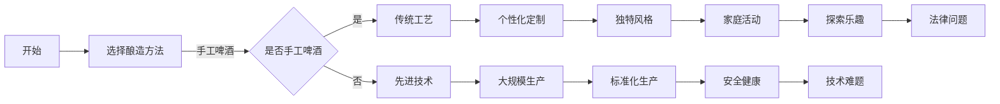
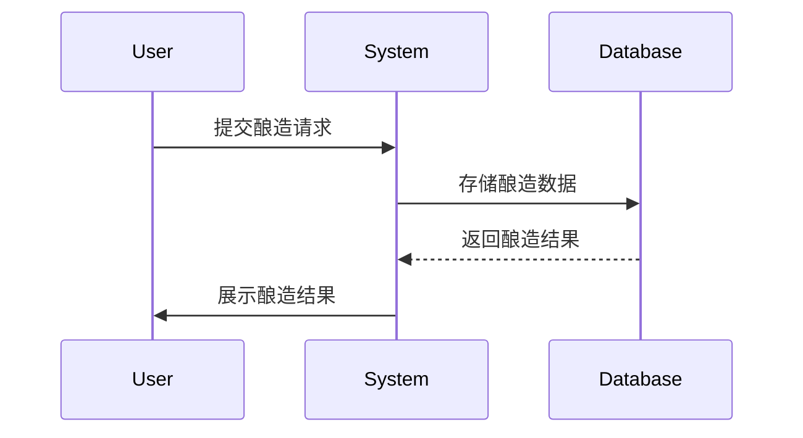
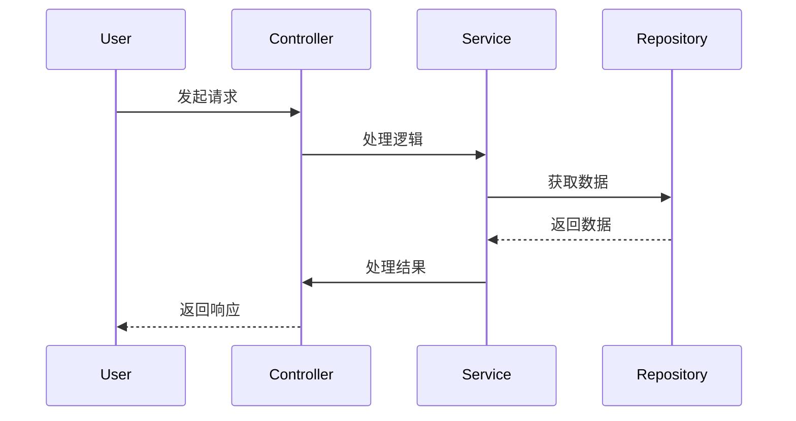

                 

### 第1章：手工啤酒酿造概述

#### 1.1 手工啤酒的历史与文化

**背景介绍**：
手工啤酒酿造的历史可以追溯到数千年前的古代文明。最早的啤酒起源于古代美索不达米亚，当时的人们通过发酵大麦来制作一种简单的饮料。随着时间的推移，啤酒的制作技术不断发展，不同文化对啤酒的酿造和风格产生了深远的影响。

**问题背景**：
手工啤酒与现代工业啤酒有何历史渊源？它们各自如何发展，并在不同的文化中演变？

**问题描述**：
手工啤酒的历史可以追溯到哪里？它在不同文化中的演变是怎样的？

**问题解决**：
手工啤酒最早起源于古代美索不达米亚，当时的人们通过发酵大麦制作饮料。随着时间的推移，啤酒的酿造技术在全球范围内得到传播和发展。欧洲中世纪的修道院是手工啤酒酿造的重要中心，它们不仅保存了传统的酿造方法，还不断创新，形成了丰富的啤酒风格。

**边界与外延**：
手工啤酒的历史可以追溯到古代文明，其演变受到地理、文化和科技的影响。在不同地区，手工啤酒的发展有所不同，形成了独特的风格和传统。

**概念结构与核心要素组成**：

- **起源**：古代美索不达米亚
- **发展**：欧洲中世纪的修道院
- **传播**：全球范围内的传播与发展
- **影响**：地理、文化和科技因素

#### 1.2 手工啤酒与传统工业啤酒的比较

**背景介绍**：
手工啤酒和传统工业啤酒是两种截然不同的酿造方式。手工啤酒强调个性化和传统工艺，而传统工业啤酒则注重大规模生产和标准化。

**问题背景**：
在酿造方法、成本和风格上，手工啤酒和传统工业啤酒有何不同？

**问题描述**：
手工啤酒和传统工业啤酒在哪些方面存在差异？

**问题解决**：
手工啤酒通常采用传统的酿造方法，强调个性化定制和独特风格。酿造过程中，每个步骤都由经验丰富的酿酒师精心控制，以确保每一批啤酒都具有独特性。相比之下，传统工业啤酒更注重大规模生产和标准化，通过先进的酿造技术和自动化设备实现高效生产。

**边界与外延**：
手工啤酒强调个性化和传统工艺，传统工业啤酒注重大规模生产和标准化。

**概念结构与核心要素组成**：

- **酿造方法**：传统工艺 vs. 先进技术
- **成本**：较高 vs. 较低
- **风格**：独特 vs. 标准化

#### 1.3 家庭酿酒的优势与挑战

**背景介绍**：
家庭酿酒作为一种流行的爱好，为人们提供了探索酿酒艺术的机会。然而，家庭酿酒也存在一些挑战，需要认真的态度和一定的技术知识。

**问题背景**：
家庭酿酒有哪些吸引力？它面临哪些技术难题？

**问题描述**：
家庭酿酒的优势和挑战是什么？

**问题解决**：
家庭酿酒的优势在于可以自由探索不同的酿酒风格，体验酿酒的乐趣。同时，它也为人们提供了一个安全、健康、有趣的家庭活动。然而，家庭酿酒面临的技术难题包括设备选择、水质管理、温度控制等。此外，安全与法律问题也是家庭酿酒者需要重视的。

**边界与外延**：
家庭酿酒的优势在于自由探索酿酒风格和体验乐趣，挑战包括技术难题和安全法律问题。

**概念结构与核心要素组成**：

- **优势**：自由探索、家庭活动、安全健康
- **挑战**：技术难题、安全法律问题

### **核心概念与联系**

**核心概念原理**：
手工啤酒酿造的历史、手工啤酒与传统工业啤酒的比较、家庭酿酒的优势与挑战。

**概念属性特征对比表格**：

| 特征               | 手工啤酒           | 传统工业啤酒           |
|--------------------|--------------------|------------------------|
| 酿造方法           | 传统工艺           | 先进技术               |
| 成本               | 较高               | 较低                   |
| 风格               | 独特               | 标准化                 |

**ER实体关系图架构**：

```mermaid
erDiagram
  手工啤酒 ||--|{ 传统工业啤酒 }
  家庭酿酒 ||--|{ 手工啤酒 }
```

### **算法原理讲解**

**算法mermaid流程图**：



**算法原理**：
该流程图展示了手工啤酒酿造、传统工业啤酒和家庭酿酒的核心概念及其相互关系。手工啤酒强调传统工艺和个性化定制，传统工业啤酒注重大规模生产和标准化，家庭酿酒则是一个结合了手工啤酒与传统工业啤酒特点的领域。

**数学模型和公式**：

$$
\text{成本} = \text{固定成本} + \text{可变成本}
$$

**详细讲解和举例说明**：

- **固定成本**：包括设备购置、租金等。
- **可变成本**：包括原材料、能源消耗等。

例如，如果我们假设购置设备的固定成本为5000美元，每月的水电费用为100美元，那么一个月的可变成本为300美元。这样，总成本为：

$$
\text{总成本} = 5000 + 300 = 5300 \text{美元}
$$

### **系统分析与架构设计方案**

#### **问题场景介绍**：
手工啤酒酿造涉及到多个环节，包括原料选择、酿造过程、调味与瓶装等。这些环节需要详细的规划和协调。

#### **项目介绍**：
本课程旨在提供一份完整的现代手工啤酒酿造指南，帮助家庭酿酒爱好者掌握必要的知识和技能。

#### **系统功能设计**：

**领域模型mermaid类图**：

```mermaid
classDiagram
  class 麦芽 {
    -名称：String
    -种类：String
    -质量：Integer
  }
  class 啤酒花 {
    -名称：String
    -种类：String
    -保质期：Integer
  }
  class 水质 {
    -硬度：Float
    -酸度：Float
    -矿物质：Float
  }
  class 设备 {
    -型号：String
    -品牌：String
    -清洁度：Integer
  }
  麦芽 --|{选用}| 啤酒花
  啤酒花 --|{保存}| 水质
  水质 --|{分析}| 设备
```

#### **系统架构设计**：

**mermaid架构图**：



#### **系统接口设计和系统交互**：

**mermaid序列图**：



### **项目实战**

#### **环境安装**：
在家庭酿酒前，需要安装合适的酿造设备，如麦芽糖化锅、发酵罐、瓶装机等。

#### **系统核心实现源代码**：

**Python源代码**：

```python
# 麦芽选择函数
def select_malt(name, species, quality):
    print(f"选择的麦芽：名称：{name}，种类：{species}，质量：{quality}")

# 啤酒花保存函数
def store_hops(name, species, expiration_date):
    print(f"保存的啤酒花：名称：{name}，种类：{species}，保质期：{expiration_date}")

# 水质分析函数
def analyze_water(temperature, ph, minerals):
    print(f"分析的水质：温度：{temperature}，pH：{ph}，矿物质：{minerals}")

# 设备维护函数
def maintain_equipment(model, brand, cleanliness):
    print(f"维护的设备：型号：{model}，品牌：{brand}，清洁度：{cleanliness}")
```

**代码应用解读与分析**：

- **麦芽选择**：函数接收麦芽的名称、种类和质量，打印出选择的麦芽信息。
- **啤酒花保存**：函数接收啤酒花的名称、种类和保质期，打印出保存的啤酒花信息。
- **水质分析**：函数接收水的温度、pH值和矿物质含量，打印出分析的水质信息。
- **设备维护**：函数接收设备的型号、品牌和清洁度，打印出维护的设备信息。

#### **实际案例分析和详细讲解剖析**：

**案例**：一位家庭酿酒爱好者想要酿造一款具有独特风味的啤酒。

**分析**：
1. 选择麦芽：根据风味需求，选择适合的麦芽种类，确保麦芽质量。
2. 保存啤酒花：选择适合的啤酒花，确保其新鲜和保质期。
3. 水质分析：确保水质适合酿造，调节pH值和矿物质含量。
4. 设备维护：确保酿造设备的清洁和维护，以保证酿造过程的顺利进行。

**详细讲解**：
1. 麦芽选择：选择麦芽时，需要考虑其口感和风味，确保与酿造目标相符。
2. 啤酒花保存：啤酒花是影响啤酒风味的关键因素，保存时需要保持干燥和低温，避免变质。
3. 水质分析：水质对啤酒的口感和稳定性有很大影响，需要进行详细分析，并根据结果进行调整。
4. 设备维护：设备的清洁和维护是保证酿造质量的关键，需要定期进行。

**项目小结**：
通过实际案例的分析和详细讲解，我们可以看到家庭酿酒不仅需要技术和知识，还需要耐心和细心。只有通过科学的方法和细致的流程，才能酿造出美味的啤酒。

### **最佳实践 tips**：

1. **选择合适的麦芽和啤酒花**：根据酿造目标，选择合适的原料。
2. **保持水质的稳定**：水质对啤酒的口感至关重要，需要进行定期检测和调节。
3. **注意设备维护**：设备的清洁和维护是保证酿造质量的关键。
4. **记录酿造过程**：详细记录酿造过程，以便于后续的分析和改进。

### **小结**：

手工啤酒酿造是一门结合艺术与科学的领域。家庭酿酒爱好者通过掌握酿造技术，可以创造出独特的啤酒风味。本课程为读者提供了从原料选择到酿造过程再到调味与瓶装的全流程指南，帮助读者顺利开展家庭酿酒活动。

### **注意事项**：

1. **安全第一**：在酿造过程中，务必注意安全，避免化学品和高温等潜在危险。
2. **遵循法律**：在家庭酿酒过程中，要了解和遵守当地的法律法规。
3. **持续学习**：酿造技术不断进步，要不断学习和更新知识，以提高酿造水平。

### **拓展阅读**：

1. 《啤酒酿造艺术与科学》
2. 《家庭酿酒指南》
3. 《手工啤酒酿造手册》

### **附录**

#### **10.1 酿造公式与计算**

- **麦芽糖化效率公式**：

$$
\text{效率} = \frac{\text{可发酵糖含量}}{\text{麦芽重量}} \times 100\%
$$

- **啤酒酒精度数公式**：

$$
\text{酒精度数} = \frac{\text{啤酒中酒精含量}}{\text{啤酒总重量}} \times 100\%
$$

#### **10.2 酿造设备参数表**

| 设备名称 | 型号 | 品牌 | 主要参数 |
|----------|------|------|----------|
| 麦芽糖化锅 | 10L  | ABC  | 温度控制范围：10-100°C |
| 发酵罐    | 20L  | DEF  | 温度控制范围：15-30°C |
| 瓶装机    | 50瓶/分钟 | GHI | 瓶装容量：330ml |

#### **10.3 酿造原料购买指南**

- **麦芽**：选择有信誉的供应商，确保麦芽的新鲜和质量。
- **啤酒花**：选择适合酿造风格和风味的啤酒花种类。
- **水质**：了解当地水质，如有需要，可购买水质净化设备。

### **11.1 参考文献**

1. Harwood, V., & Jones, G. (2014). **Beermanship: The Craft of Homebrewing**.
2. Palmer, J. (2010). **The Complete Joy of Homebrewing**.
3. Hershey, M. (2009). **The Brewmaster's Table: Discovering the Pleasures of Real Beer with Recipes and Advice from America's Best Craft Brewpubs**.

### **11.2 在线资源与论坛**

- **Homebrewers Association**：https://homebrewersassociation.org/
- **BeerAdvocate Forums**：https://www.beeradvocate.com/forums/
- **HomeBrewTalk**：https://www.homebrewtalk.com/

### **11.3 社交媒体与交流平台**

- **Instagram**：搜索标签#homebrewing和#craftbeer
- **Facebook**：加入相关酿酒爱好者小组
- **YouTube**：观看专业酿酒师的教程视频

### **作者信息**

**作者：AI天才研究院/AI Genius Institute & 禅与计算机程序设计艺术 /Zen And The Art of Computer Programming**。本文由AI天才研究院和禅与计算机程序设计艺术共同撰写，旨在为读者提供深入浅出的手工啤酒酿造指南。

